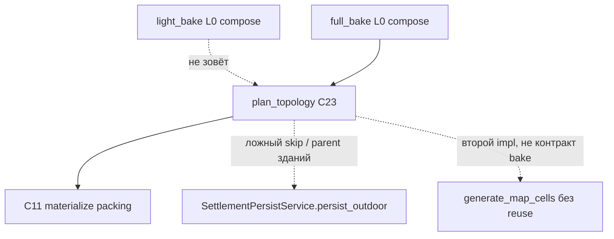

# City generation — technical debt (код)

**Тип:** инженерное ТЗ / living registry. Не generate SoT, не bake SoT.  
**Продукт / алгоритм города:** [`tz_city_generation.md`](./tz_city_generation.md) (§8 topology, §1.2 рецепт, C22 packing).  
**Склейка pack+SQL:** [`tz_settlement_outdoor.md`](./tz_settlement_outdoor.md) (**C23**, C11, C14, C19; дыры §14).  
**Bake L0 / job boundaries:** [`tz_world_pack_storage.md`](./tz_world_pack_storage.md) § Bake modes; compose — [`tz_map_light_bake.md`](./tz_map_light_bake.md) (topology **не** compose).  
**DAG / lazy:** архитектура — DAG консьюмер стабильного интерфейса генератора. **Gate: DAG** — агент ноды не трогает; bake пока не wired в DAG (процесс, не целевая схема). См. [`tz_world_generation_dag.md`](./tz_world_generation_dag.md).  
**Общий реестр smells:** [`tz_generator_technical_debt.md`](./tz_generator_technical_debt.md) **CITY-T-1…4**. Этот файл — **запахи после посадки C23** (2026-09-06), не дубль рецепта §1.2 и не reopen C22.

**Срез кода:** `SettlementOutdoorOrchestrator.plan_topology` после `WorldSurfaceMaterializationOrchestrator.materialize_pack_full`; packing reuse `DistrictTopologySlot` + city graph. Контракт продукта **locked и в коде** (city §8 / C23 ✅). Ниже — швы с legacy persist, DAG и слоями.

**Правило ID:** новый smell → новый **CITY-T-5x**; resolved не удалять. Не плодить параллельные литералы SoT ([`dataModel-no-hardcode`](../.cursor/rules/dataModel-no-hardcode.mdc)).

---

## Карта связанных ТЗ (не копировать алгоритмы)

| Документ | Что брать оттуда | Что **не** дублировать сюда |
|---|---|---|
| [city §8](./tz_city_generation.md) | Что фиксирует topology: имена/N/типы районов, `settlement_gate`, не packing | Текст спеки topology |
| [outdoor **C23**](./tz_settlement_outdoor.md) | Когда skip topology vs C14 packing; persist SQL NL + city `connection_*`; не zst | C14/C19 протокол pack |
| [pack § Bake modes](./tz_world_pack_storage.md) | `full_bake` = L0 на `world_bounds`, **затем** post-pass topology; `light_bake` topology не делает; packing не bake | Compose contributors, WP-13 |
| [light bake](./tz_map_light_bake.md) | L0 canvas; `SettlementContributor` = pin-диск, не районы | Маски / hydrology |
| [connections §5.1](./tz_structure_connections.md) | `_plan_world_routes` **после** ворот | Алгоритм A* (отложен) |
| [CITY-T-1b](./tz_generator_technical_debt.md#city-t-1--контур-вокруг-city-generate) | Dual persist debug vs DAG — родительский ID | Слайс «починить ноду» |

---

## Приоритет

| # | ID | Ось | Что | P | Status |
|---|---|---|---|---|---|
| 1 | **CITY-T-5a** | legacy | Два persist: здания parent = город vs район; authored-skip ломается | **P1** | **open** |
| 2 | **CITY-T-5g** | legacy | `needs_settlement_outdoor_persist`: C23 дети+city edges = «packing готов» без zst | **P1** | **open** |
| 3 | **CITY-T-5b** | legacy | `generate_map_cells` не reuse freeze — контракт generate; **lazy отложен** | later | **deferred** |
| 4 | **CITY-T-5h** | хардкод | `"road"` / `"city"` в consumer вместо POJO/registry | P1 | **open** |
| 5 | **CITY-T-5i** | смешение | Два call site `plan_district_slots` + `plan_city_street_grid` | P2 | **open** |
| 6 | **CITY-T-5j** | смешение | Дубль extract NL района (topology vs packing) | P2 | **open** |
| 7 | **CITY-T-5c** | смешение | Planner импортирует `settlementOutdoorUids` (цикл пакета) | P2 | **open** |
| 8 | **CITY-T-5k** | смешение | Authored-skip в трёх местах | P2 | **open** |
| 9 | **CITY-T-5l** | смешение | `load_topology_slots` тянет `specialization_extras` из planner | P2 | **open** |
| 10 | **CITY-T-5f** | legacy | `city_graph_for_settlement` без фильтра `GraphLevel.CITY` (A* позже) | P2 | **open** |
| 11 | **CITY-T-5e** | legacy | Район `system_template_uid` FK на `building_templates` | P3 | **open** |
| 12 | **CITY-T-5d** | хардкод | Smoke `"medium"` вместо `DistrictDensity` | P3 | **open** |
| 13 | **CITY-T-5m** | смешение | Bake-фасад: `PackMissing` валит `full_bake`; ошибки uid глотаются | P3 | **open** |

**Не этот файл / не эти ID:** алгоритм C22 packing (city §6.3); A* highway (connections §5.1); `init_mode`; interiors; CITY-T-1c стены; CITY-T-2b uid library; CITY-T-3 parallel одного generate (мастер); C16 parallel batch (после C19).

---

## Что C23 уже закрыл (не reopen)

| Было | Сейчас |
|---|---|
| CITY-T-1a: overlay скелета `extra="ignore"`, колонок нет | **resolved** — `BundleNamedLocation` из `SettlementSkeleton.model_fields`; колонки `0001`; `city_skeleton_from_settlement` через `model_validate` |
| C23 код ⬜ | **resolved** — `plan_topology` после L0 `full_bake`; packing reuse слотов |
| `getattr(settlement, "settlement_density", None)` как замена колонки | Колонка есть; mapper итерирует `model_fields` (не хак с default `None`) |
| `"district" if registry is None` в extract | Снято; тип района — `WorldLocationTypeRegistry.SYSTEM_TYPE_DISTRICT` + `entry_for` |
| City node `uuid4` | uuid5 (`city_connection_node_uid`); area `uuid4` **не** трогали (вне scope) |

После правки `0001`: локальная БД **recreate**, не ALTER.

---

## Ось 1 — конфликты с legacy

### CITY-T-5a — два persist, разный parent здания

**Status:** `open` | **Severity:** high | **P:** P1  
**Срез:** outdoor §14 **P2**, **P5**; CITY-T-1b (DAG — другой writer).

Канон C11 (`extract_settlement`): здание `parent_location_uid` = uid **района**. Authored skip смотрит только **прямых** детей города: таверна/square/gate у города → skip topology **и** packing; районы C23 + здания-внуки → packing не путает с authored.

Legacy [`SettlementPersistService.persist_outdoor`](../backend/app/application/worldData/settlementPersistService.py) + [`collect_building_locations`](../backend/app/application/worldData/generators/assemblers/settlementAssembler/settlementLayoutExtract.py):

- зданий вешает на **поселение**;
- районов в SQL может не быть;
- city edges пишет как «outdoor готов».

После такого прогона `get_children(city)` видит дома → C23 `has_authored_non_district_children` = true → **навсегда skip** topology и packing, даже без zst.

HTTP `generate-settlement` идёт в outdoor-оркестратор — конфликта нет. Ломаются: `debug_settlement_persist.py`, любой код, зовущий `settlement_persist_service().persist_outdoor` на мире после `full_bake`.

**Fix (не слайс «удалить сервис»):**

1. Канон parent: settlement → district → building (C4/C5). Legacy collect не переписывает parent на город.
2. Skip «authored» = не-район **прямой** ребёнок города **без** `district_topology` у siblings-районов / без C23 freeze. Сгенерированные здания — внуки.
3. Не использовать `persist_outdoor` как writer эталона; эталон = C11/C19. Occupancy-flood / patches — leftover P2/P3, не второй эталон.

---

### CITY-T-5g — skip packing по «есть дети + city edge»

**Status:** `open` | **Severity:** high | **P:** P1  
**Склейка:** C14 = skip packing iff **zst + manifest + SQL дети**. Районы C23 **без** zst — **не** C14-skip.  
**Bake:** после `full_bake` дети-районы и city gates **есть**, zst города **нет**.

[`needs_settlement_outdoor_persist`](../backend/app/application/worldData/generators/assemblers/settlementAssembler/settlementLayoutExtract.py): если есть любые children **и** любые city edges → `False` (не нужно persist), плюс ещё `needs_settlement_geometry` по map_cells.

C23 как раз создаёт children + city edges **без** packing. Старый persist с `skip_if_initialized` решит, что outdoor уже полный.

Там же литерал `e.graph_level == "city"` — **CITY-T-5h**.

**Fix:** skip legacy persist = тот же контракт, что C14 (zst+manifest+дети) **или** явный scope occupancy-only. Не «нашлись city edges».

---

### CITY-T-5b — `generate_map_cells` не reuse freeze

**Status:** `deferred` | **Severity:** high | **P:** later  
**Не путать** с загрузкой мира и lazy L2 / `detailed_bake` ([`tz_world_pack_storage.md`](./tz_world_pack_storage.md) WP-13, [`tz_terrain_generation.md`](./tz_terrain_generation.md) § TR-LAZY-LOAD) — это **другие** алгоритмы, не этот ID.

Дыра только **settlement** `generate_map_cells` без reuse C23 freeze. Отложена. Не утверждать, что «lazy-init алгоритмов нет».

---

### CITY-T-5f — city graph load без `graph_level`

**Status:** `open` | **Severity:** medium | **P:** P2  
**Триггер:** connections §5.1 `_plan_world_routes` на `settlement_gate` (ещё не код).

[`city_graph_for_settlement`](../backend/app/application/worldData/settlementOutdoor/settlementOutdoorTopology.py) берёт узлы с `location_uid == settlement` и **любые** рёбра, у которых конец в этом множестве — **без** `GraphLevel.CITY`.

Пока world-routes нет — ок. Когда A* сядет в ворота, packing reuse может затянуть world-рёбра в `SettlementLayout` и C11 перезапишет их как city.

**Fix:** фильтр рёбер `graph_level == GraphLevel.CITY` (+ endpoints city-link, как в `extract_topology`). World-рёбра не класть в layout packing.

---

### CITY-T-5e — FK района на building_templates

**Status:** `open` | **Severity:** low | **P:** P3  
**Склейка:** C23 пишет `named_locations.system_template_uid` = `DistrictTemplateEntry.system_name`.

В [`0001_initial.sql`](../backend/app/db/migrations/0001_initial.sql) `system_template_uid` REFERENCES `building_templates(template_uid)`. Имя чертежа района — не uid здания. Packing-extract делал то же; C23 чаще создаёт такие строки.

SQLite FK часто выключен — риск на recreate с pragma.

**Fix:** колонка шаблона района отдельная / без FK на buildings; или FK на реестр районов мира, если он таблица. Не класть district `system_name` в building uid.

---

### CITY-T-5d — smoke density литерал

**Status:** `open` | **Severity:** low | **P:** P3

[`debug_settlement.py`](../backend/scripts/debug_settlement.py), [`debug_settlement_persist.py`](../backend/scripts/debug_settlement_persist.py): `settlement_density = "medium"`. Поле на NL есть (1a), setattr не падает. Дубль [`DistrictDensity.MEDIUM.wire_value`](../backend/app/dataModel/settlement/enums/districtDensity.py).

Не generate-consumer; ломает правило no-hardcode в harness.

---

## Ось 2 — хардкоды

**Не хардкод (SoT / допустимо):**

| Что | Почему ок |
|---|---|
| `WorldLocationTypeRegistry.SYSTEM_TYPE_DISTRICT = "district"` | ClassVar реестра; consumer — `entry_for` |
| `_ENGINE_ENTRIES` `system_type="district"` | Определение builtin-строки реестра |
| Тесты `"town"` / `"gothic"` / `"stone_fence"` | Фикстура мира (CITY-T-4 / C23 план) |
| Теги uuid5 `gate_s`, `corridor_v` | Алгоритм identity, не POJO default |
| `lanes_per_side=1` на кольце | Алгоритмическая константа сетки |
| Area `uuid4` | Вне scope C23 |

### CITY-T-5h — литералы `"road"` / `"city"` в consumer

**Status:** `open` | **Severity:** medium | **P:** P1  
**Правило:** [dataModel-no-hardcode](../.cursor/rules/dataModel-no-hardcode.mdc). План C23 требовал `WorldConnectionTypeRegistry` / `GraphLevel` / `DistrictConnection`.

| Где | Литерал | Откуда брать |
|---|---|---|
| [`streets.py`](../backend/app/application/worldData/generators/assemblers/settlementAssembler/planner/streets.py) `link_chain(..., conn_type="road")` | тип **ребра** кольца | `DistrictConnection.street_default().connection_type` или `WorldConnectionTypeRegistry.require_engine(...)` с ключом из `DEFAULT_CONNECTION_TYPE` (сам ключ живёт в POJO) |
| тот же файл `resolve_material(world, "road", ...)` | **use_type** материала | `CONSTRUCTION_MATERIAL_DEFAULTS` / тот же SoT, что `DEFAULT_ROAD_MATERIAL` — не плодить третий `"road"` как connection-type |
| [`settlementPersistService.py`](../backend/app/application/worldData/settlementPersistService.py) | `graph_level == "city"` | `GraphLevel.CITY.value` |
| debug scripts | `"city"` на рёбрах layout | `GraphLevel.CITY` |

`ConnectionNodeType.SETTLEMENT_GATE` на **узлах** — верно (ворота = node_type). `settlement_gate` в `WorldConnectionTypeRegistry` — тип **ребра** в каноне connections; кольцо сейчас пишет `road`. Не путать node_type и connection_type. Если продукт хочет ребро-тип `settlement_gate` — отдельное решение connections TZ, не молчаливый литерал.

Префиксы `edge_uid` `city_` / `city_link_` — стабильная пара узлов (C23 контракт), не дубль Field default.

---

## Ось 3 — смешивание ответственности

**Задумано спекой (не долг):**

| Слой | Делает | ТЗ |
|---|---|---|
| `PackMaterializationOrchestrator` | только L0 | pack / light bake |
| `SettlementContributor` | pin-диск L0 | light bake |
| `WorldSurfaceMaterializationOrchestrator.materialize_pack_full` | после L0 → `plan_topology` | pack Bake modes + C23 |
| `SettlementOutdoorOrchestrator.plan_topology` | skip + planner + persist topology | outdoor C23 |
| `SettlementAssembler.assemble` | packing; reuse слотов если передали | city C22 / C11 |

### CITY-T-5i — два вызова planner topology

**Status:** `open` | **Severity:** medium | **P:** P2

`_plan_topology_one` сам зовёт `plan_district_slots` → `plan_city_street_grid`. Тот же порядок в `SettlementAssembler`, если слоты/`city_graph` не передали.

Два call site: правка planner’а должна попасть в оба.

**Fix:** один метод на `SettlementGeneratorService` (например `plan_slots_and_city_graph`) — единственный writer порядка. Оркестратор: skip + terrain bbox + persist. Assembler: packing; plan только если freeze нет.

---

### CITY-T-5j — дубль extract района

**Status:** `open` | **Severity:** medium | **P:** P2

[`extract_topology`](../backend/app/application/worldData/settlementOutdoor/settlementOutdoorExtract.py) и `extract_settlement` почти одинаково собирают district `NamedLocation` + `district_topology` JSON.

Расхождение полей разъедет freeze uid/`display_name`/subtype.

**Fix:** одна `district_named_location(settlement, slot, index)`; оба extract тонкие.

---

### CITY-T-5c — uid generate в пакете persist

**Status:** `open` | **Severity:** medium | **P:** P2

`district_location_uid` / `city_connection_node_uid` живут в `settlementOutdoorUids`. Planner `streets.py` их импортирует → загрузка `settlementOutdoor` → раньше `__init__` тянул оркестратор → цикл `districts → streets → outdoor → districts`. Лечили **пустым** [`settlementOutdoor/__init__.py`](../backend/app/application/worldData/settlementOutdoor/__init__.py).

Generate не должен зависеть от пакета склейки.

**Fix:** identity-модуль рядом с assembler (или тонкий `dataModel` helper без SQL). Outdoor extract и streets импортируют его. Пакет outdoor снова может реэкспортировать оркестратор, если нужно.

Area `uuid4` в `areaPaths.py` — не переносить в этом ID.

---

### CITY-T-5k — authored skip ×3

**Status:** `open` | **Severity:** low | **P:** P2  
**Контракт:** outdoor C23 — не-район дети **у города** → skip topology **и** packing (даже без zst).

Сейчас: `has_authored_non_district_children` + `should_skip_topology`; то же в `should_skip_materialize`; ещё раз безусловно в `materialize` до C14.

Для прямых детей города логика сходится (здания C11 — внуки). Три входа разъедутся при следующем исключении (square как district subtype, gate-NL vs gate-node).

**Fix:** одна функция решения (authored / c23-freeze+gates / c14-zst). Оркестратор только читает enum статуса.

---

### CITY-T-5l — loader слотов знает рецепт специализаций

**Status:** `open` | **Severity:** low | **P:** P2

[`load_topology_slots`](../backend/app/application/worldData/settlementOutdoor/settlementOutdoorTopology.py) для packing тянет `specialization_extras` из `planner/districts.py` (required types, subject tags). Outdoor-пакет зависит от внутренностей generate.

Freeze JSON не содержит required/tags — их считают заново с мира. Если реестр специализаций мира сменился между topology и packing, слот той же геометрии получит другие required.

**Fix:** либо класть required/tags в `DistrictTopologySlot` (расширение POJO), либо считать extras в assembler при reuse, не в outdoor loader. Не второй проход `plan_district_slots`.

---

### CITY-T-5m — bake-фасад и ошибки topology

**Status:** `open` | **Severity:** low | **P:** P3  
**Bake:** post-pass обязателен после успешного L0 `full_bake` (pack TZ). Compose L0 **не** знает о районах.

[`materialize_pack_full`](../backend/app/application/worldData/worldSurfaceMaterializationOrchestrator.py): `plan_topology` после L0. `SettlementOutdoorPackMissingError` уронит весь bake (после finalize pack не должно случаться). Ошибки **одного** uid — continue + `failed_uids` внутри batch; отчёт bake **не** несёт failed topology.

`light_bake` topology не делает. **`detailed_bake` topology не делает** (C23 — full). Packing — C11 из detailed, не из этого фасада full.

**Fix:** прокинуть `TopologyBatchResult` в job report bake (failed uids видны мастеру); PackMissing после L0 — инвариант «pack есть», не новый mode.

Не переносить topology в `SettlementContributor` и не делать 4-й bake mode.

---

## Иерархия assembler vs outdoor (вердикт)

God-object’ов в Settlement → District → Area **по-прежнему нет**. После C23 жирнее **оркестратор склейки** (topology + C11 + C16 selectors в одном классе) — это **осознанный** фасад outdoor ТЗ, не generate-бог.

Следить:

| Модуль | Смешение | ID |
|---|---|---|
| `SettlementOutdoorOrchestrator` | topology pass + packing persist + batch C16 | задумано; вынести plan в generator — **5i** |
| `settlementOutdoorExtract.py` | packing extract + topology extract | **5j** |
| `planner/streets.py` | entries + city ring + material; теперь ещё outdoor uids | CITY-T-4 leftover + **5c** |
| `WorldSurfaceMaterializationOrchestrator` | pack L0 + вызов topology | задумано pack TZ; отчёт — **5m** |

---

## Порядок работ (не phase-план агента)

1. **P1 persist:** 5a + 5g (+ литерал 5h в том же файле persist). Иначе debug/legacy после `full_bake` портит skip.  
2. **P1 хардкод streets:** `link_chain` через POJO.  
3. **P2 слои:** 5i → 5j → 5c (снять цикл пакета).  
4. **P2 контракт graph:** 5f до A* world routes.  
5. **P3:** 5e FK, 5d smoke, 5k/5l/5m polish.  
**CITY-T-5b** / lazy generate — **не этот срез.** Wiring ноды — **CITY-T-1b / 1e**, Gate: DAG.

Код C23 / city §8 / outdoor C23 **не** откатывать. Спеку topology **не** переписывать.

---

## Changelog

| Дата | Изменение |
|---|---|
| 2026-09-06 | **detailed_bake** консьюмер C11 (хук ⬜). Topology по-прежнему только full. |
| 2026-09-06 | Файл открыт: ревью после C23 — dual persist (5a/5g), generate reuse (5b), хардкоды (5h/5d), смешение call site/extract/uids/skip/loader/bake report (5i–5m). SoT продукта — city §8, склейка C23, bake modes. |
