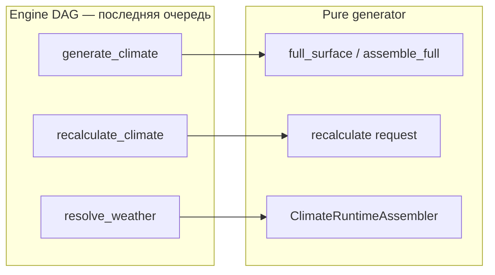
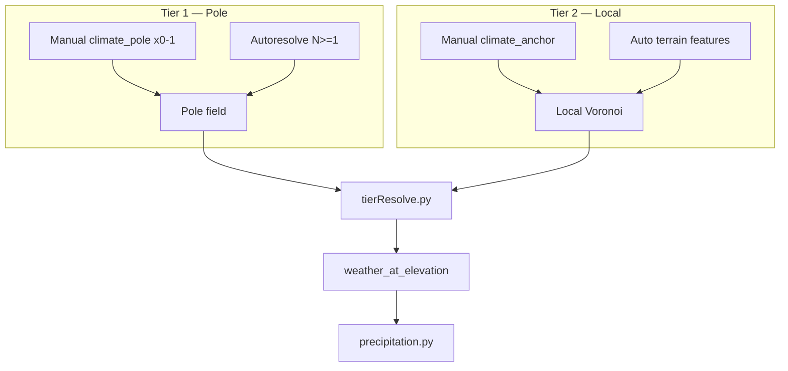
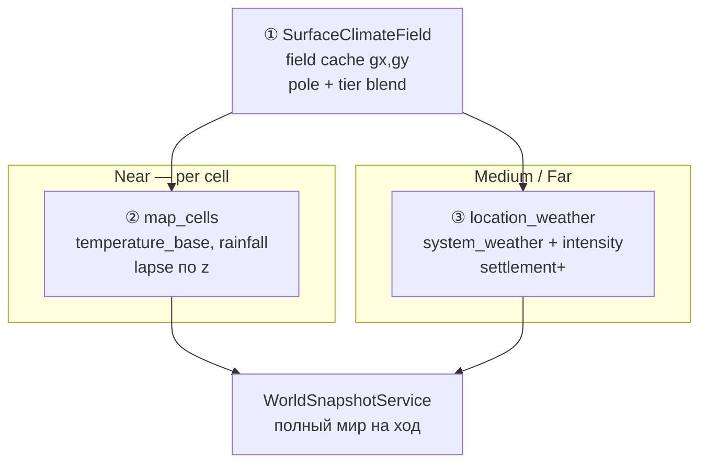
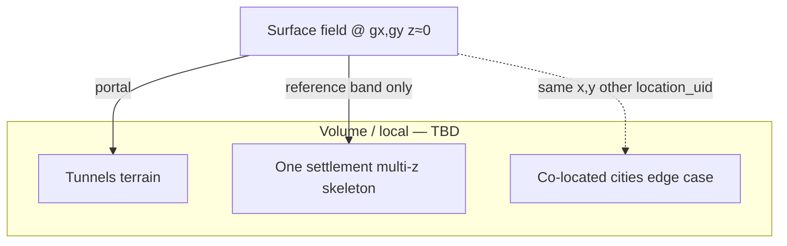

## Назначение

Климат — **отдельный pure-generator**, независимый от terrain shape и weather runtime.

| Система | Роль |
|---|---|
| **ClimateGeneratorService** | spatial assignment + `temperature_base` / `rainfall` на eager generate |
| **TerrainGeneratorService** | two-phase skeleton (`z`, `system_terrain` columns); **не** пишет climate fields |
| **Weather** (runtime) | тип погоды от `temperature_base` + `rainfall` + `weather_type_registry` |

**Статус:** v2.6.1 — eager surface ✅ · **Climate LOD + SurfaceClimateField утверждены (2026-06)** · recalc/runtime impl ⬜ · DAG nodes ⬜

## Терминология snapshot (не путать)

| Термин | Модуль | Что это |
|---|---|---|
| **World Snapshot** | [`WorldSnapshotService`](./tz_world_snapshot.md) | **Полное** сохранение мира **на каждый ход** — единый общий модуль; time travel, regen, база для far LOD |
| **`SurfaceClimateField`** | climate generator | Derived **horizontal field** `(gx, gy)` — pole + tier blend; **не маска**, не world snapshot |
| **`WeatherSnapshot`** | `ClimateRuntimeAssembler` | Runtime DTO (temp + `system_weather`) для сцены; ephemeral |
| **`climate_status`** | World Pack manifest / blob | Bake LOD: `coarse` \| `fine` — **не** pole/local tier (CL-2); см. § World Pack climate |

Дальше в этом документе **«field cache»** / **`SurfaceClimateField`** — только climate derived layer. **«World snapshot»** — только [`tz_world_snapshot.md`](./tz_world_snapshot.md).

## Утверждено (2026-06)

| # | Решение |
|---|---|
| C1 | **`run_cell_weather_pass`** — Pass 3: `temperature_base` + `rainfall` на cells; **не** liquid, **не** season offset |
| C2 | **`ClimateRecalcRequest`:** `run_cell_weather` → CellWeatherPass; **`run_liquid_overlay`** → liquidOverlayPass (split; см. CL-7) |
| C3 | **`ClimateChangeEvent.kind = season_changed`** — calendar / world tick → `recalculate_climate` + `resolve_weather` |
| C4 | Оттепель на горах → melt / v2 `flow_level` на **горных реках** ([`tz_terrain_hydrology.md`](./tz_terrain_hydrology.md)); skeleton **не** regen |
| C5 | `season_temp_offsets` — **runtime** (`effective_temperature`), eager map **не** переписывается при смене сезона |
| C6 | **`SurfaceClimateField`** — горизонтальный **field cache** `(gx, gy)`: pole + tier blend (`resolve_surface_sample`); refresh при смене pole/anchor (+ influence pad), **не** каждый сезон; **≠** world snapshot |
| C7 | **Per-cell resolve** — `weather_at_elevation(zone, z)` на колонку; пишет `temperature_base`, `rainfall` на `map_cells`; near / materialization bbox |
| C8 | **Climate LOD** — near → per-cell; medium/far → sample field cache + `location_weather`; far читает **persisted world state** ([`tz_world_snapshot.md`](./tz_world_snapshot.md)) |
| C9 | **Partial recalc** — terrain/hydrology dirty rect → **только resolve колонок**; field cache без изменений, если anchors не двигались |
| C10 | **Weather vs liquid** — разные dirty regions; `run_cell_weather` и `run_liquid_overlay` независимы; после hydrology (U28) liquid pass **не** создаёт `liquid_body` в русле |
| C11 | **`season_changed` + LOD** — near: optional cell recalc (горы + `river_cells` bbox); far: C5 runtime + `location_weather`, **без** full-world upsert cells |
| C12 | **LOD upgrade** — игрок входит в far rect → lazy promote: field-cache-only → per-cell batch в entering bbox |
| C13 | **Field cache persist** — v1 in-memory на batch materialization; v2 — часть world snapshot blob или sparse derived store (CL-17); **не** отдельный модуль snapshot |

> **Черновики, не утверждены:** routing в DAG-нодах (детали), § «Surface vs volume climate» (v2.4). § «Три процесса» — контракты утверждены (C1–C5, C6–C13); impl ⬜. Стык generators ↔ DAG — [`tz_world_generation_dag.md`](./tz_world_generation_dag.md) (**черновик целиком**).

**Принцип платформы:** не симуляция Земли. Высота **не** задаёт arctic. Полюса и мастерские якоря — источник «холодного/жаркого»; рельеф — только **локальные** центры Voronoi tier-2.

**Три процесса:** eager generate, recalculate и runtime weather — **разные** pipeline; все три вызываются **только из DAG-нод** (ноды — последняя очередь). Generator — pure, без routing по «что изменилось».

**Отказоустойчивость:** generate **не падает** на битых master-данных. **Целевое (v3):** defaults материализованы в БД через [`tz_json_validation.md`](./tz_json_validation.md) normalize-on-import; generate читает `World`; legacy — только `warn_once`. **Transitional v1:** runtime fallback + hardcodes в generators — см. json validation TZ § Legacy.

---

## Расположение

```
app/application/worldData/generators/
  climate/
    climateZone.py, registry.py          ← enum + N+1 profile_for
    climateGeneratorService.py         ← spatial sample + weather_at_elevation
    poleResolve.py, climatePole.py     ← manual/autoresolve poles
    climatePoleField.py                ← inverse-distance / fade blend
    tierResolve.py                     ← pole + local tier cell resolution (CL-2)
    math.py, locations.py, terrainZ.py ← shared helpers (CL-12)
    anchorDetect.py, anchorAssign.py   ← auto features from heightmap
    anchorCollect.py, climateAnchorField.py
    precipitation.py                   ← liquid mult, peak clamp, logging
    weatherResolve.py                  ← runtime pick weather_type_registry ⬜
    zoneField.py                       ← legacy admin Voronoi (v1 fallback)
  assemblers/climateAssembler/
    types.py                           ← ClimateChangeEvent, ClimateRecalcRequest
    climateOrchestratorService.py
    climateSurfaceAssembler.py
    climateRuntimeAssembler.py
    passes/…

app/application/engine/nodes/pojo/python/climate/   ← ⬜ последняя очередь
  generate_climate.py                  ← eager full_surface
  recalculate_climate.py               ← partial recalc + routing
  resolve_weather.py                   ← runtime WeatherSnapshot

  terrain/terrainGeneratorService.py   ← pure terrain passes (orchestration — DAG)

app/api/routes/map.py                  ← debug harness (POST …/generate-*); production — DAG
```

**Вызов:** production — DAG-ноды → orchestrator / runtime assembler. `map.py` generate-* — path **2** (debug); те же функции, без HTTP в product flow. Script smoke — § «Три входа» в [`tz_world_generation_dag.md`](./tz_world_generation_dag.md).

---

## Три процесса (v2.3 — контракты утверждены, impl ⬜)

Eager generate, recalculate и runtime weather — **не один pipeline с флагом**, а три отдельных контракта. Generator выполняет то, что явно запросили; **когда и зачем вызывать** — только в DAG-нодах. **Climate LOD (C6–C13)** расширяет процесс 2 и 3 — см. § «Climate LOD».



| # | Процесс | Generator entry | Пишет `map_cells` | Когда |
|---|---|---|---|---|
| **1 Eager** | Первичная генерация surface | `ClimateOrchestratorService.full_surface` | ✅ temp, rainfall, z, terrain | Нет карты / full regen |
| **2 Recalculate** | Partial update по существующему heightmap | `ClimateOrchestratorService.recalculate(ClimateRecalcRequest)` | ✅ partial upsert changed cells | Master/terrain изменились точечно |
| **3 Runtime** | Тип погоды для сцены/tick | `ClimateRuntimeAssembler.resolve_weather` | ❌ не трогает eager map | Gameplay loop, season |

**Инвариант:** semantic routing (`anchor_changed` → какие passes) **не** в `ClimateSurfaceAssembler` — только в `recalculate_climate` node.

### Контракты (types.py)

**Node input — что изменилось:**

```python
@dataclass(frozen=True)
class ClimateChangeEvent:
    kind: Literal[
        "anchor_changed",
        "zone_changed",
        "terrain_changed",
        "season_changed",   # смена сезона по calendar / world tick
        "manual",
    ]
    bbox: SurfaceGridRect | None = None
    location_uids: frozenset[str] = frozenset()
    season: str | None = None          # новый system_season (если kind=season_changed)
    previous_season: str | None = None # опционально, для melt/thaw direction
```

**Generator input — что выполнить:**

```python
@dataclass(frozen=True)
class ClimateRecalcRequest:
    run_pole_resolve:     bool = True
    run_anchor_collect:   bool = True
    run_cell_weather:     bool = True    # CellWeatherPass: temperature_base, rainfall
    run_liquid_overlay:   bool = True    # liquidOverlayPass — отдельный флаг (утверждено v2.5)
    output_bbox:          SurfaceGridRect | None = None
    include_non_surface:  bool = False
```

> **Код vs ТЗ (CL-7):** в `ClimateSurfaceAssembler.recalculate` сейчас `run_cell_weather` **ошибочно** gate'ит только `liquidOverlayPass`; weather pass вызывается всегда. Target: honor оба флага; `types.py` sync ⬜.

**Runtime output:**

```python
@dataclass(frozen=True)
class WeatherSnapshot:
    season:                str | None
    temperature_base:      int
    effective_temperature: int
    rainfall:              int
    system_weather:        str | None = None
    intensity:             int = 0   # stub до tick loop
```

`RecalcTrigger` — deprecated alias для `ClimateChangeEvent` (не передавать в generator).

### Routing в ноде `recalculate_climate` (спека, impl ⬜)

Нода: `post_llm` · загружает world/locations/heightmap из repos · строит `ClimateRecalcRequest` · вызывает `recalculate` · `pending_patches` upsert cells.

| `ClimateChangeEvent.kind` | `ClimateRecalcRequest` (рекомендация) |
|---|---|
| `anchor_changed` | pole ✅, anchor ✅, weather ✅; `output_bbox` вокруг anchor |
| `zone_changed` | pole ✅, anchor ✅, weather ✅; `include_non_surface=True` |
| `terrain_changed` | pole ✅, anchor ✅ (re-detect), weather ✅; heightmap от caller |
| **`season_changed`** | `run_pole_resolve=False`, `run_anchor_collect=False`; **near:** `run_cell_weather=True`, `run_liquid_overlay=True`, `output_bbox` = горные регионы + `river_cells`; **far:** оба `False` — только runtime C5 + `location_weather` ([`tz_terrain_hydrology.md`](./tz_terrain_hydrology.md), § Climate LOD) |
| `manual` | поля из `bbox` / `location_uids` явно |

Pole resolve перед cell weather **обязателен** (tier 1 base). `run_pole_resolve=False` — только если передан cached `pole_field` (расширение v2.4).

Partial return: generator может пересчитать широко, но **вернуть** только ячейки в `output_bbox` (upsert merge).

### Многопоточность (CL-PAR)

> Симметрия с [`tz_terrain_generation.md`](./tz_terrain_generation.md) § TR-PAR. **Orchestrator impl ✅; DAG shared `ctx` ⬜.**

| Компонент | Параллелизм |
|---|---|
| `run_pole_resolve_pass` | **serial** |
| `run_anchor_collect_pass` | **serial** (global surface index) |
| `run_cell_weather_pass` | **parallel** batches (`ChunkComputePool`) |
| `run_liquid_overlay_pass` | `surface_top` index **serial**; overlay per batch **parallel** |
| `save_pass(climate)` | **strictly serial** |

**Caller contract:** тот же `MaterializationContext(free_cores)` что и `generate_surface`; `ParallelPolicy.resolve_climate_workers` + optional `world.climate_parallel_workers`.

**DAG:** `generate_climate` node читает `context["materialization_ctx"]` — **не** probe CPU самостоятельно. См. [`tz_world_generation_dag.md`](./tz_world_generation_dag.md) § MaterializationContext.

| ID | Задача | Статус |
|---|---|---|
| CL-PAR-1 | `ClimateBatchOrchestrator` + pool | ✅ |
| CL-PAR-DAG-1 | `GenerateClimateNode` → `apply_climate_batch(..., ctx)` | ⬜ |

### Нода `generate_climate` (спека)

| Поле | Значение |
|---|---|
| id | `generate_climate` |
| phase | `post_llm` |
| deps | `generate_surface` (или shared gate materialization) |
| reads | `context["materialization_ctx"]` — **shared** с surface |
| calls (target) | `ClimateBatchOrchestrator.apply_climate_batch(..., ctx)` |
| calls (interim) | `ClimateOrchestratorService.apply_climate_pass` — без parallel `ctx` |
| writes | bulk upsert climate fields + liquid overlay |
| status | ⬜ migrate to batch orchestrator + shared `ctx` (CL-PAR-DAG-1) |

Debug: `POST …/map/generate-climate` + `materialize-stack` — `ClimateBatchOrchestrator` + query `free_cores` / stub `5`. Legacy `full_surface` — regen / tests only.

### Нода `resolve_weather` (спека, impl ⬜)

| Поле | Значение |
|---|---|
| id | `resolve_weather` |
| phase | `pre_llm` |
| reads | `temperature_base`, `rainfall` из scene/cells + `season` |
| calls | `ClimateRuntimeAssembler.resolve_weather` |
| writes | `state.shared_context["weather"]` или downstream `location_weather` (tick — позже) |

Pick: `weather_type_registry` по `priority` / `check_order` ASC — см. § Runtime weather.

---

Hardcoded dicts из terrain **удалены**. Дефолты — в `ClimateZone` + `CLIMATE_ZONE_DEFAULTS`.

| `system_climate` | `base_temperature` | `typical_elevation_z` | `base_rainfall` |
|---|---|---|---|
| arctic | -25 | 4 | 20 |
| tundra | -20 | 3 | 30 |
| temperate | 12 | 0 | 55 |
| tropical | 28 | -1 | 80 |
| desert | 30 | 0 | 10 |
| volcanic | 35 | 2 | 5 |
| … | … | … | … |

Полный список — в `climateZone.py`.  
**N+1:** зона может существовать **только** в `world.climate_zone_registry` без enum-члена. Мир без `arctic` в registry — arctic недоступен.

---

## World: температурный коридор и полюса (v2.1)

### `climate_temperature_peak_min` / `climate_temperature_peak_max`

Абсолютные **пиковые** экстремумы мира (учёт сезонов и модификаторов на уровне продукта):

```json
{
  "climate_temperature_peak_min": -40,
  "climate_temperature_peak_max": 45
}
```

Полюса **не** берут enum-temp как абсолют — derived из коридора (см. ниже).  
`season_temp_offsets` — runtime сдвиг от `temperature_base`, не переписывает eager map.

**Три слоя температуры (A):**

> **Смена сезона:** `ClimateChangeEvent(kind="season_changed")` — calendar / world tick → `recalculate_climate` + `resolve_weather`. Оттепель на горах → melt → v2 `flow_level` на горных реках ([`tz_terrain_hydrology.md`](./tz_terrain_hydrology.md)); skeleton **не** regen.

| Слой | Смысл |
|---|---|
| `climate_temperature_peak_min/max` | Абсолютный коридор мира (сезоны, экзотика) |
| `base_temperature` зоны / pole inset 20% | **Опорные** точки градиента, не потолок ячейки |
| `MapCell.temperature_base` | profile + lapse + override; **clamp** к `[peak_min, peak_max]` на eager |

Inset 20% у полюса — только derived temp полюса, не лимит ячейки.  
Arctic **−60°C** на ячейке: `peak_min: -60` + override в `climate_zone_registry`, не enum `−25`.

**Preset vs лимит (B):** enum и fallback `−40…45` в коде — **земной preset** для импорта и pole math, когда peak не задан. Они **не** запрещают Titan (−179) или Venus (+430): мастер задаёт `peak_min/max` и registry. Отдельного `climate_preset` в v1 нет.

### `precipitation_liquid` (v2.2)

```json
{
  "precipitation_liquid": "water",
  "material_registry": [
    {
      "system_material": "water",
      "material_category": "liquid",
      "cool_into": "ice",
      "cool_temp": 0,
      "heat_into": "steam",
      "heat_temp": 100
    }
  ]
}
```

| Поле | Default | Смысл |
|---|---|---|
| `precipitation_liquid` | `"water"` | ref → `material_registry`; см. fallback ниже |

**Fallback chain** (`precipitation.py` → `resolve_world_precipitation_liquid`):

1. `world.precipitation_liquid` (или `"water"`) — запись с `material_category: "liquid"`
2. `water` из registry
3. первый `liquid` в registry
4. built-in defaults `{ cool_temp: 0, heat_temp: 100 }`

При шагах 2–4 — `warn_once` **один раз на `(world_uid, reason)`**. Нормальный resolve — без warning.

---

## Отказоустойчивость: fallback и validator

> **Решение (v2.2.3):** runtime fallback — **намеренная** отказоустойчивость генератора. Жёсткий validator при JSON-import и в редакторе миров — **отложен** до фиксации JSON-контрактов мира.

### Два слоя (разные роли)

| Слой | Когда | Роль |
|---|---|---|
| **Import validator** (будущий) | JSON-import, UI редактора миров | Ранний reject битых контрактов **до** generate |
| **Runtime fallback** (сейчас и дальше) | Eager generate, partial recalc, legacy БД | Graceful degradation — мир генерируется, результат интерпретируем |

Validator **дополняет** fallback, **не заменяет** его: даже после validator возможны partial recalc, ручные правки в БД, миграции старых миров. Fallback остаётся последней линией.

**Причина отложить validator:** контракты (`climate_pole`, peak band, `precipitation_liquid`, registry entries) ещё эволюционируют. Premature validator быстро устареет. Сначала — стабилизация контрактов и проверка fallback-цепочек на практике (тот же принцип, что [`tz_economic_tier.md`](./tz_economic_tier.md) §6–7).

### Runtime fallback (текущее поведение)

Generate **не бросает исключение** на типичных дырах в master-данных. Каждый fallback — детерминированный дефолт + `warn_once` `(world_uid, reason)` (см. § Логирование).

| Компонент | Условие | Fallback | Модуль |
|---|---|---|---|
| Peak band | `peak_min/max` не заданы | Earth preset `−40…45` | `precipitation.peak_bounds` |
| `precipitation_liquid` | ref не найден | chain: explicit → water → first liquid → built-in | `precipitation.py` |
| Phase band | `heat_temp ≤ cool_temp` | built-in `{0, 100}` | `precipitation.py` |
| Unknown zone | `system_climate` нет в registry | `temperate` profile | `registry.py` |
| Pole count | >1 manual `climate_pole` | первый pole + warning | `poleResolve.py` |
| Pole без zone | pole location без `system_climate_zone` | derived / default | `poleResolve.py` |
| `mode=manual` без pole | нет declared pole | пустой `ClimatePoleField` → uniform default | `poleResolve.py` |
| Active pole | admin zones в merge | admin skipped at tier resolve | `anchorCollect.py` |
| Local features | >32 auto anchors | cap at 32 | `anchorDetect.py` |
| Pole bbox | `pole_field.bbox is None` | span из modifiers | `tierResolve.py` |
| Heightmap bbox | нет static anchors | empty bbox path | `heightmapPass.py` |
| Cell temp | raw вне peak band | clamp к `[peak_min, peak_max]` | `precipitation.clamp_temperature_to_peak` |
| Resolve climate | нет zone в иерархии | `default_climate_zone` или `temperate` | `resolve_climate` |
| Legacy v1 | нет pole/local path | admin Voronoi (`build_zone_field`) | `zoneField.py` |

**WARNING at resolve** — штатный сигнал, что сработала отказоустойчивость, а не признак «недоделки до validator».

### Import validator (будущий, CL-5)

> Полный контракт: [`tz_json_validation.md`](./tz_json_validation.md). Один validator для JSON-import **и** UI редактора миров — после фиксации контрактов.

**Целевые проверки (черновик):**

- не более одного `climate_pole` на мир;
- `climate_temperature_peak_min ≤ peak_max` (если оба заданы);
- `precipitation_liquid` → существующий `material_registry` entry с `material_category: liquid`;
- `system_climate_zone` на pole/anchor → entry в `climate_zone_registry` или known enum;
- `climate_pole_mode` / `climate_pole_preset` — допустимые enum-значения.

Ошибка import с понятным сообщением. Runtime fallback **остаётся** для всего, что прошло import, но изменилось позже (recalc, legacy).

**До включения validator:** runtime fallback + `warn_once` (§ Логирование).

---

## Логирование (v2.2.2)

Общий helper: [`loggingHelpers.py`](backend/app/application/worldData/generators/climate/loggingHelpers.py) — `warn_once`, `debug_once` (dedupe per world).

### Pass summaries (INFO)

Logger: `app.application.worldData.generators.assemblers.climateAssembler.climateSurfaceAssembler`

| Pass | Пример |
|---|---|
| pole_resolve | `poles=N preset=… mode=…` |
| heightmap | `cells=N z_range=[lo,hi]` |
| anchor_collect | `manual=M auto=A admin=… admin_skipped=…` |
| cell_weather | `surface_cells=N extra_non_surface=K` |

### WARNING (fallback / master data issues)

| Модуль | Ситуация |
|---|---|
| `precipitation.py` | fallback `precipitation_liquid`; invalid phase band (`heat <= cool`) |
| `poleResolve.py` | >1 pole; pole без zone; `mode=manual` без pole |
| `registry.py` | unknown `system_climate` → temperate defaults |
| `anchorDetect.py` | terrain features capped at 32 |
| `anchorCollect.py` | admin zones skipped при active pole |
| `heightmapPass.py` | empty bbox (no static anchors) |
| `tierResolve.py` | pole bbox missing → modifier span fallback |

### DEBUG

| Модуль | Когда |
|---|---|
| `precipitation.py` | каждый `effective_rainfall` (шумно на grid) |
| `precipitation.py` | `peak_clamp` once per world когда temp обрезан |

Детали liquid — [`tz_materials.md`](./tz_materials.md) §7.1.

**Rainfall на ячейке:**

```
moisture     = zone.base_rainfall          # влажность зоны, не обнуляется при замерзании
liquid_mult  = f(temp, cool_temp, heat_temp, cool_into, heat_into)   # 0..1, outer 10% smoothstep
rainfall     = round(moisture × liquid_mult)   # жидкие осадки в eager map
```

Снег/град — `weather_type_registry` по temp + moisture; при `temp ≤ cool_temp` liquid_mult = 0, moisture в зоне сохраняется для runtime.

**Пример холодного мира (D):**

```json
{
  "climate_temperature_peak_min": -60,
  "climate_temperature_peak_max": 35,
  "precipitation_liquid": "water",
  "climate_zone_registry": [
    { "system_climate": "arctic", "base_temperature": -55, "base_rainfall": 20 }
  ]
}
```

При `temp = -55` и `precipitation_liquid: "water"` → `rainfall = 0` (ниже `cool_temp`).  
Для жидких осадков в мороз — другой liquid (напр. `cool_temp: -80`) или снег через `weather_type_registry`.

### Хранение полюсов (гибрид C — утверждено)

| Данные | Где |
|---|---|
| `climate_temperature_peak_min/max` | `World` |
| `climate_local_influence_fraction` | `World` (default 0.1 × bbox diagonal) |
| `climate_pole_mode`: `"manual"` \| `"autoresolve"` | `World` |
| `climate_pole_preset`: `ice` \| `desert` \| `binary` \| … | `World` (autoresolve) |
| **Manual pole (max 1)** | `named_location`, `system_location_type = "climate_pole"` |
| **Autoresolve poles (N ≥ 1)** | derived at generate (не в `named_locations`) |

**Manual:** мастер объявляет **не больше одного** `climate_pole`. Второй полюс **не** autoresolve-ится.

```json
{
  "location_uid": "pole-north",
  "system_location_type": "climate_pole",
  "pole_kind": "cold",
  "system_climate_zone": "arctic",
  "weight": 1.0,
  "map_x": 6000,
  "map_y": 500000,
  "map_z": 0
}
```

- `pole_kind`: `cold` \| `hot` \| `neutral`
- `weight` — множитель в pole blend (не radius в метрах)
- `map_z` — лор; blend только `(gx, gy)`

### Autoresolve (утверждено)

Если **manual pole отсутствует** и `climate_pole_mode = "autoresolve"` (default при `null`), autoresolve по `climate_pole_preset` (default `binary`).

При `climate_pole_mode = "manual"` без объявленного pole → **пустой** `ClimatePoleField` (uniform `default_climate_zone`).

1. **N ≥ 1** полюсов (из preset; `binary` → 2, `ice`/`desert` → 1)
2. Позиции — deterministic по `hash(world_uid)` + surface bbox
3. Каждый полюс: **`system_climate_zone`** (preset/registry) **и** **`base_temperature`** derived из peak min/max
4. **Не смотрит на elevation**

### Derived temp полюса (inset 20% от span)

```
span = peak_max - peak_min

HOT pole:  peak_max - 0.20 × span
COLD pole: peak_min + 0.20 × span
```

Manual override на pole location перекрывает derived.

### Pole field — влияние на ячейки (утверждено)

**N ≥ 2 — inverse-distance blend (6B):**

```
w_i = weight_i / (dist_i + ε)^p     # ε, p — v2 constants
temp(cell) = Σ w_i × pole_temp_i / Σ w_i
zone(cell) → profile полюса с max w_i (rainfall, typical_elevation_z)
```

**N = 1 — fade к default (отдельный алгоритм):**

```
t = clamp01( dist(cell, pole) / (bbox_diagonal × 0.5) )
sample = lerp(pole_sample, default_climate_zone_sample, smoothstep(t))
```

Однородно холодный/жаркий мир: один pole + узкий коридор + `default_climate_zone`.

**Elevation не участвует** в pole field.

---

## Два уровня якорей (v2.1)



| Tier | Тип | Источник | Elevation? | Роль |
|---|---|---|---|---|
| 1 | **Pole** | `climate_pole` / autoresolve | **Нет** | Глобальный градиент мира |
| 2 | **Local** | `climate_anchor` + auto terrain | WHERE only | Локально модифицирует pole sample |

**Merge vs resolve (admin zones):**

| Этап | Admin `region/kingdom/…` |
|---|---|
| `build_merged_field` (AnchorCollectPass) | ✅ попадают в `ClimateAnchorField` |
| `tierResolve` (CellWeatherPass) | ❌ **пропускаются** при active pole field |
| Legacy v1 (`build_coarse_field`) | ✅ admin Voronoi, если нет manual anchors |

**Cell resolve (`tierResolve.py`):**

1. `pole_sample = sample_at_pole_field(gx, gy)` — всегда tier 1
2. Modifiers = manual + auto anchors (**не** ADMIN)
3. `r = bbox.diagonal × climate_local_influence_fraction` (default 0.1); cap `min(r, dist_to_2nd_modifier / 2)`
4. `dist ≤ r`: zone/rainfall от nearest modifier; temp из profile (+ optional override)
5. Outer 20% `[0.8r … r]`: zone/rainfall — local; **temp** smoothstep к pole base (CL-2d accepted)
6. `dist > r` → pole sample
7. `weather_at_elevation(zone, z, base_temperature_override?)` → clamp + `effective_rainfall`

Приоритет источников зоны (conceptual — до tier resolve):

| Приоритет | Источник | Где применяется |
|---|---|---|
| 1 | Pole field | tier 1, база ячейки |
| 2 | Manual `climate_anchor` | tier 2 modifier |
| 3 | Auto terrain features | tier 2 modifier |
| 4 | Admin zone | legacy path / merge only |
| 5 | `default_climate_zone` | pole fade N=1, fallbacks |

---

## Local anchors (tier 2)

**Manual first → auto second** в `build_merged_field`. Auto local **наследует зону** из pole field в точке feature, **не** из elevation.

| Сигнал | Prominence |
|---|---|
| Peak (local max) | ≥ 50 m |
| Basin (local min) | ≥ 25 m |
| Water (`liquid_body`) | ≥ 10 m |

Cap **32** features. **Запрещено:** elevation→arctic, settlement footprint.

---

## Eager pipeline (проcess 1)

| Pass | Модуль | Выход |
|---|---|---|
| PoleResolvePass | `poleResolve.py` | `ClimatePoleField` |
| HeightmapPass | heightmap + pole bias | `z`, `system_terrain` |
| AnchorCollectPass | `anchorCollect.py` + detect/assign | `ClimateAnchorField` |
| **CellWeatherPass** | `cellWeatherPass.run_cell_weather_pass` | `temperature_base`, `rainfall`, `location_uid` |
| **LiquidOverlayPass** | `liquidOverlayPass` | `liquid_body` where temp allows (target: hydrology mask) |

### `run_cell_weather_pass` (утверждено)

Pure pass — **не** путается с флагом `ClimateRecalcRequest.run_cell_weather`.

**Вход:** `world`, `locations`, `pole_field`, `local_field` (anchor), `cells[]`.  
**На каждую cell:**

1. `resolve_surface_sample(gx, gy)` — pole + local tier → `system_climate_zone`, optional temp override.
2. `weather_at_elevation(zone, z)` — lapse + peak clamp → `temperature_base`; `rainfall` via `effective_rainfall`.

**Выход:** новые `MapCell` с climate fields; `system_terrain`, `z` **без изменений**.

**Не делает:** `season_temp_offsets` (runtime), `liquid_body`, hydrology carve, regen heightmap.

**Вызывается из:** `assemble_full`, `apply_climate_pass` (перед liquid), `apply_weather_only`, `recalculate` (when `run_cell_weather=True`).

Entry points (`ClimateOrchestratorService`) — **процесс 1**:

| Метод | Passes |
|---|---|
| `full_surface` / `full_surface_detailed` | все 4 |
| `heightmap_only` | pole + heightmap |
| `apply_weather_only` | pole + anchor collect + cell weather (heightmap уже есть) |

## Recalculate (процесс 2)

Отдельный entry — **не** `full_surface` с флагом.

```python
def recalculate(
    world: World,
    locations: list[NamedLocation],
    heightmap_cells: list[MapCell],   # z/terrain уже в cells; regen heightmap — caller
    request: ClimateRecalcRequest,
) -> list[MapCell]:                   # partial list для upsert
```

| Поле request | Смысл |
|---|---|
| `run_pole_resolve` | `PoleResolvePass` |
| `run_anchor_collect` | re-detect + merge anchors на переданном heightmap |
| `run_cell_weather` | **`run_cell_weather_pass`** — `temperature_base`, `rainfall` |
| `run_liquid_overlay` | **`run_liquid_overlay_pass`** — `liquid_body` (утверждено v2.5; в коде ⬜) |
| `output_bbox` | вернуть только ячейки в rect (None = все из weather pass) |
| `include_non_surface` | добавить static anchor cells (`resolve_climate` path) |

**Статус impl:** контракт ✅ · execution по request ⬜ (stub → `apply_weather_only`).

### Partial recalc — field cache vs column resolve (C6, C9)

Два шага **не смешивать** (это **не** world snapshot — см. [`tz_world_snapshot.md`](./tz_world_snapshot.md)):

| Шаг | Что пересчитывает | Когда | Пишет `map_cells` |
|---|---|---|---|
| **Field cache refresh** | `SurfaceClimateField` — pole + tier horizontal sample | pole/anchor/zone change (+ influence pad) | ❌ (v2: in world snapshot blob или derived store — CL-17) |
| **Column resolve** | `weather_at_elevation` по `(gx, gy, z)` | hydrology/terrain dirty rect; near LOD; materialization | ✅ `temperature_base`, `rainfall` |
| **Liquid overlay** | phase/state на cells с водой | отдельный dirty rect; `run_liquid_overlay` | ✅ overlay fields only |

**Hydrology patch** ([`tz_terrain_hydrology.md`](./tz_terrain_hydrology.md)): carve меняет `z` / roles → **column resolve** в dirty bbox; field cache **не** пересобирать, если anchors не двигались.

**Invariant:** generator может считать шире dirty rect, но **возвращает** только cells в `output_bbox` (upsert merge).

---

## Climate LOD — field cache / per-cell / per-location (v2.6 — утверждено)

> **Связь:** зоны near/medium/far — [`tz_lazy_simulation.md`](./tz_lazy_simulation.md). Погода вдали **не** требует per-cell `map_cells` каждый сезон или каждый день. **World snapshot** на каждый ход — [`tz_world_snapshot.md`](./tz_world_snapshot.md); far LOD **читает** сохранённое состояние, а не отдельный climate-only snapshot.

### Три уровня resolve



| Уровень | Данные | Потребители |
|---|---|---|
| **① Field cache** | `system_climate_zone`, optional temp override, `typical_elevation_z`, zone moisture | resolve ② и ③; **derived**, не маска |
| **② Per-cell** | `MapCell.temperature_base`, `rainfall` | terrain narration, hydrology, scene geometry |
| **③ Per-location** | `location_weather` на settlement+ ([`tz_locations.md`](./tz_locations.md)) | gameplay вдали, LLM, NPC batch |

### LOD по зонам симуляции

| Зона | `map_cells` climate | Частота / механизм |
|---|---|---|
| **Near** (сцена) | **Per-cell resolve** | каждый сезон / при входе в локацию / hydrology patch в bbox; optional daily — **runtime only** (C5), без rewrite eager map |
| **Medium** | cells есть, **не каждый тик** | `location_weather.remaining_ticks` — тик settlement; sample field cache → upsert `location_weather` |
| **Far** | **`map_cells` не обновляются** каждый сезон | field cache + `location_weather`; состояние **фиксируется** world snapshot на ход (C8) |

**Правило:** рядом с игроком — **perCell** имеет смысл; вдали — **resolve по слепку** + агрегат на settlement.

### Частота: season vs day

| Событие | Near | Medium / Far |
|---|---|---|
| **`season_changed`** | optional `recalculate` в bbox (горы, `river_cells`); melt → v2 `flow_level` | `resolve_effective_temperature` + refresh `location_weather` из field cache; **не** touch всех cells |
| **Daily / tick в сцене** | `resolve_weather` → `WeatherSnapshot` | `location_weather` decrement; без per-cell pass |
| **Player proximity upgrade** | promote rect: field cache → per-cell batch (C12) | — |
| **Конец хода** | cells в bbox попадают в **world snapshot** | [`WorldSnapshotService.capture_turn`](./tz_world_snapshot.md) |

### Контракт `SurfaceClimateField` (C6)

```python
@dataclass(frozen=True)
class SurfaceClimateFieldCell:
    system_climate_zone:       str
    base_temperature_override: int | None
    typical_elevation_z:       int
    zone_moisture:             int          # profile.base_rainfall до liquid_mult

@dataclass(frozen=True)
class SurfaceClimateField:
    """Horizontal field cache after pole + tier resolve; one sample per (gx, gy). Not a boolean mask."""
    cells: dict[tuple[int, int], SurfaceClimateFieldCell]
    pole_field: ClimatePoleField
    local_field: ClimateAnchorField
    bbox: SurfaceGridRect | None = None

def build_surface_climate_field(
    world, locations, pole_field, local_field, grid_rect,
) -> SurfaceClimateField: ...

def sample_field(field: SurfaceClimateField, gx: int, gy: int) -> SurfaceClimateFieldCell: ...

def resolve_cell_weather(
    world, field: SurfaceClimateField, cell: MapCell,
) -> MapCell:
    """Per-column: sample field + weather_at_elevation(zone, z) → temp, rainfall."""
```

**v1:** field живёт in-memory между passes одного batch (materialization).  
**v2 (CL-17):** sparse persist для второго HTTP / gameplay без full pole recompute.

**CellWeatherPass (target):** `build_surface_climate_field` → `resolve_cell_weather` per column; pole/tier math **не** дублировать в pass.

### `ClimateLODPolicy` (orchestration, v2)

```python
@dataclass(frozen=True)
class ClimateLODPolicy:
    mode: Literal["per_cell", "field_cache_only"]
    output_bbox: SurfaceGridRect | None
    refresh_field_cache: bool = False   # pole/anchor change only
```

Выбор `mode` — **не** в generator: DAG / tick orchestrator по дистанции игрока ([`tz_lazy_simulation.md`](./tz_lazy_simulation.md)). Generator honor `ClimateRecalcRequest` + optional LOD policy extension (v2).

### Liquid overlay после hydrology (C10, U28)

| Cell state | Hydrology | Climate `liquidOverlayPass` |
|---|---|---|
| Open water (`liquid_candidate`) | mask + carve | temp OK → `liquid_body`; frozen → material phase |
| River bed (U28) | уже **`liquid_body`** + `role: river_bed` | **состояние** (phase/material), **не** создание terrain |
| Solid land | — | skip |

Target D HY-6: **no** global `z ≤ 0` rule ([`tz_terrain_hydrology.md`](./tz_terrain_hydrology.md) § Climate).

### Smoke regression — `world_test_all` (2026-07)

**Fixture / harness:** [`fixtures/world_test_all.json`](../fixtures/world_test_all.json) + `backend/scripts/debug_surface_helpers.py` → `world-test-all-001`.

**Подтверждённые дефекты climate eager path (фикстура корректна):**

| # | Комponent | Interim поведение | Target |
|---|---|---|---|
| **CL-R1** | `liquidOverlayPass` | Любая surface-top cell с `z ≤ 0` → `liquid_body` если `liquid_precipitation_mult > 0` | Только cells с `hydrology.liquid_candidate` (D HY-6); river bed — phase only (U28) |
| **CL-R2** | `_non_surface_anchor_cells` | +2 MapCell в **meter** `(map_x, map_y, map_z)` для dungeon / underground | Grid-normalize или volume path; **не** участвовать в surface liquid mask ([`tz_terrain_generation.md`](./tz_terrain_generation.md) NC-1c) |
| **CL-R3** | `liquid_precipitation_mult` + fixture `water` | Нет `cool_temp`/`heat_temp` → mult **1.0** всегда | Phase band из `material_registry`; frozen dungeon не получает liquid overlay |

**Наблюдаемый результат прогона:**

```
map_cells total=5462  (5460 grid skeleton + 2 extra anchors)
surface grid tops: 260 × tundra, z≈3…7, liquid_body=0
liquid_body=2 @ (6000,24000,z=-1) dungeon  temp=-5
              @ (42000,18000,z=-3) underground  temp=32
```

**Regression acceptance (после fix):**

- Eager `generate-climate` на `world-test-all-001`: **0** `liquid_body` пока hydrology stub / без `liquid_candidate`.
- После D HY-7a: `liquid_body` только на declare lake/sea/river cells surface grid; dungeon/underground **без** `liquid_body`.
- `liquidOverlayPass` **не** создаёт terrain на `_non_surface_anchor_cells` (skip или pre-filter non-grid cells).

**Cross-ref:** HY-1, [`tz_terrain_hydrology.md`](./tz_terrain_hydrology.md) § Interim bug; TR-8 / CL-11 — extract `nonSurfaceAnchorPass`.

### Статус реализации

| Элемент | Статус |
|---|---|
| v1 admin zone Voronoi (`build_zone_field`) | ✅ legacy API |
| Pole tier + autoresolve | ✅ |
| Tier resolve CL-2 | ✅ |
| Local manual + auto (no elevation→zone) | ✅ |
| Orchestrator + 4 passes (eager) | ✅ |
| `precipitation_liquid` + peak clamp | ✅ v2.2 |
| `volcanic` enum | ✅ |
| Runtime fallback + `warn_once` | ✅ намеренная отказоустойчивость |
| Import validator (`climate_pole` max 1, refs) | ⬜ — после фиксации JSON-контрактов |
| `climate_pole_mode` wiring | ✅ CL-4 |
| `ClimateChangeEvent` / `ClimateRecalcRequest` | ✅ v2.3 contracts · v2.5–v2.6 LOD + snapshot **утверждено**, types.py sync ⬜ |
| `SurfaceClimateField` + `resolve_cell_weather` | ⬜ spec C6–C7 |
| `ClimateLODPolicy` + zone routing | ⬜ orchestrator / DAG |
| `recalculate` execution по request + `output_bbox` | ⬜ (CL-7) |
| `weatherResolve.py` + runtime pick | ⬜ |
| DAG nodes (`generate` / `recalculate` / `resolve_weather`) | ⬜ последняя очередь |

### Smoke tests

`backend/scripts/debug_settlement.py` — **target:** pipeline-тесты через HTTP (path **2**, см. [`tz_world_generation_dag.md`](./tz_world_generation_dag.md) § «Три входа»). ⬜ часть тестов ещё in-process.

- `test_climate_zone_voronoi` — unit (path 3) OK
- `test_climate_registry_override` — unit (path 3) OK
- `test_climate_temperature_formula` — unit (path 3) OK
- `test_climate_manual_anchor_voronoi` — **→ API** (`generate-surface` + `generate-climate`)
- `test_climate_orchestrator_passes` — **→ API**
- `test_climate_detect_relative_elevation` — unit (path 3) OK
- `test_climate_pole_tier` — unit (path 3) OK
- `test_climate_tier_resolve` — **→ API**
- `test_climate_precipitation_liquid`

---

## `world.climate_zone_registry`

Entry перекрывает enum default для `system_climate`:

```json
{
  "system_climate": "arctic",
  "base_temperature": -25,
  "typical_elevation_z": 4,
  "base_rainfall": 20,
  "temperature_variance": 8,
  "rainfall_variance": 10
}
```

Reader принимает `list[dict]` или `dict` (legacy) — без миграции БД.

---

## `resolve_climate(location)`

Walk-up по `parent_location_uid` (как `tz_locations.md`):

```
if location.system_climate_zone → return it
if parent → resolve_climate(parent)
return world.default_climate_zone or "temperate"
```

---

## ClimateGeneratorService API

```python
@dataclass(frozen=True)
class SurfaceClimateSample:
    system_climate_zone:       str
    zone_location_uid:         str | None
    typical_elevation_z:       int
    base_temperature_override: int | None = None   # pole blend / tier override

class ClimateGeneratorService:
    # legacy v1
    def build_zone_field(world, locations, cell_m) -> ZoneClimateField
    def build_coarse_field(world, locations, cell_m) -> ClimateAnchorField
    def sample_at_grid(world, uid_map, field, gx, gy) -> SurfaceClimateSample

    # v2 pole + tier
    def sample_at_pole_field(world, pole_field, gx, gy) -> SurfaceClimateSample
    def sample_at_anchor_field(world, uid_map, local_field, gx, gy) -> SurfaceClimateSample
    def resolve_surface_sample(world, uid_map, pole_field, local_field, gx, gy) -> SurfaceClimateSample

    def resolve_climate(world, uid_map, location) -> str
    def weather_at_elevation(
        world, system_climate, z,
        base_temperature_override: int | None = None,
    ) -> tuple[int, int]   # (temperature_base, rainfall)
```

### Формула температуры и rainfall (v2.2)

```
profile = profile_for(world, system_climate)
base    = base_temperature_override ?? profile.base_temperature
lapse   = world.elevation_lapse_rate ?? 0.65
raw     = round(base - lapse × (z / 100))
temperature_base = clamp(raw, peak_min, peak_max)     # precipitation.peak_bounds

moisture = profile.base_rainfall                     # zone moisture, не обнуляется
liquid   = resolve_world_precipitation_liquid(world)
mult     = liquid_precipitation_mult(temperature_base, liquid)
rainfall = clamp(round(moisture × mult), 0, 100)
```

Pole-derived temp попадает в `base_temperature_override` через `tierResolve` / `ClimatePoleField.sample`.

---

## Связь с terrain

`TerrainGeneratorService.generate_surface` → `ClimateOrchestratorService.full_surface`.

Per surface cell (упрощённо):

```python
pole_field   = run_pole_resolve_pass(...)
heightmap    = run_heightmap_pass(..., pole_field)
anchor_field = run_anchor_collect_pass(..., heightmap, pole_field)
for cell in heightmap:
    sample = climate.resolve_surface_sample(world, uid_map, pole_field, anchor_field, cell.x, cell.y)
    temp, rainfall = climate.weather_at_elevation(
        world, sample.system_climate_zone, cell.z, sample.base_temperature_override,
    )
```

HeightmapPass использует `typical_elevation_z` из pole/local sample для bias z-noise.

---

## MapCell fields

| Поле | Кто пишет |
|---|---|
| `temperature_base`, `rainfall` | CellWeatherPass |
| `location_uid` (surface) | uid local/pole anchor |
| `system_terrain`, `z` | HeightmapPass |

---

## Runtime weather (процесс 3)

`ClimateRuntimeAssembler` — не переписывает `map_cells.temperature_base` / `rainfall`.

| Метод | Статус |
|---|---|
| `resolve_effective_temperature` | ✅ `season_temp_offsets` |
| `resolve_weather` | ⬜ pick `weather_type_registry` → `WeatherSnapshot` |

### Pick из `weather_type_registry` (контракт)

Модуль: `climate/weatherResolve.py` (⬜).

Перебор записей по **возрастанию** `priority` или `check_order` (оба имени; если оба — `priority` wins):

| Поле entry | Match |
|---|---|
| `temp_min` | `effective_temperature >= temp_min` (null = ∞−) |
| `temp_max` | `effective_temperature <= temp_max` (null = ∞+) |
| `rainfall_min` | `rainfall >= rainfall_min` (null = нет минимума) |

Первое совпадение → `system_weather`. Fallback: entry `clear` → hard `"clear"` + `warn_once` (см. § отказоустойчивость).

Снег/град при eager `liquid_mult = 0`: `rainfall` на map может быть 0, но match использует zone moisture semantics через переданный `rainfall` arg (eager field).

**Не в процессе 3 (позже):** `location_weather` persist + tick/`remaining_ticks` на medium/far — **контракт** [`tz_locations.md`](./tz_locations.md); near использует per-cell + runtime. `intensity` formula, `penetrates_shelter` — позже.

**Far-zone weather (C8):** `sample_field(field, settlement_gx, gy)` + `season_temp_offsets` → upsert `location_weather`; walk-up `resolve_weather(location)` для district outdoor.

---

## Surface vs volume climate (v2.4 — черновик, не утверждён)

> **Контекст:** после развития **terrain** (подземные тоннели) и **settlement/structure** климат **не на всех `(x, y, z)`** совпадает с surface field в `(gx, gy)` на `z≈0`.

### Два слоя модели

| Слой | Что это | Статус |
|---|---|---|
| **Surface climate field** | Pole/tier + heightmap + cell weather на **WORLD_SURFACE_GRID** (`z≈0` wilderness tile) | ✅ eager v2 (процесс 1) |
| **Volume / local climate** | Тоннели; **multi-z skeleton** одного города; co-located settlements (edge case) | 📋 spec |

**Инвариант (уже в продукте):** глубина **не** превращает surface wilderness в arctic сами по себе. Pole/tier на `(gx,gy)` — **surface field**; underhive / spire одного города и тоннели — volume rules.



### Surface (текущий scope — без изменений)

- `ClimateOrchestratorService.full_surface` — surface grid cells: `z`, `system_terrain`, `temperature_base`, `rainfall`.
- Pole blend — только `(gx, gy)`; `typical_elevation_z` — bias heightmap, не «глубина = холод».
- Static anchor `map_z != 0` (`_non_surface_anchor_cells`) — **точечный** legacy path: `resolve_climate` + `weather_at_elevation`; **не** volume resolver. **2026-07:** пишет `map_x/map_y` в meters в `map_cells` (NC-1c); при eager climate merge попадает под interim `liquidOverlayPass` — см. § Smoke regression CL-R1…CL-R3.

### Сценарии volume (будущие)

Три **разных** кейса — не смешивать:

| # | Сценарий | Сущности | Частота | Почему ≠ pole/tier surface |
|---|---|---|---|---|
| **A** | **Подземные тоннели** | terrain graph | основной terrain consumer | сегменты, порталы, нет осадков |
| **B** | **Multi-z city skeleton** | **один** settlement / одно дерево `location_uid` | sci-fi hive (WH40k-style) | underhive → surface → spire: microclimate **по z-band**, одна сущность |
| **C** | **Co-located settlements** | **≥2** settlement на одной `(x,y)` | **edge case** | разные `location_uid` ([`tz_locations.md`](./tz_locations.md) § «Вертикальное наложение») |

#### B — один город, vertical skeleton (валидный продукт)

[`tz_assembler_hierarchy.md`](./tz_assembler_hierarchy.md): settlement «понимает топологию по z (наземный / подземный / воздушный **одновременно**)».  
Пример — **один** hive `location_uid = "hive_primus"`:

```
z = -200 … -50   underhive districts   — stale air, heat, rainfall≈0
z = -50 … +30    surface hive level    — smog, partial exposure (≠ wilderness pole)
z = +30 … +800   spire / aerial decks  — wind, cold exposure (≠ underhive)
```

Surface field в `(gx,gy)` — **референс** для surface band, не copy-paste на все ярусы. Resolver — по **z-band / district / `LocationLevel`** после settlement placement ([`tz_city_generation.md`](./tz_city_generation.md)).

#### C — co-located cities (edge case)

**Разные города**, одна `(x,y)`:

```
(x, y, z=33)  → city_surface      — location_uid A
(x, y, z=28)  → city_underground  — location_uid B
(x, y, z=120) → city_aerial       — location_uid C
```

| | B (hive) | C (co-located) |
|---|---|---|
| Settlement count | 1 | ≥2 |
| `location_uid` | одно дерево | разные деревья |
| Типичность | редкий sci-fi, **штатный** кейс | **edge case** |

PK `(world_uid, x, y, z)` различает z в обоих кейсах. **Ошибка:** один climate на все z при совпадении `(x,y)`.

### Принципы volume climate (утверждено направление)

1. **Surface field — опора для z≈0 wilderness и surface settlement outdoor**, не универсальный ответ для всех z при тех же `(x,y)`.
2. **Иерархия локаций.** `system_climate_zone` + `resolve_climate` — override на settlement; для hive (B) — дополнительно **z-band profile** на district/level.
3. **Indoor vs outdoor.** `is_outdoor: false` — без `location_weather`; volume outdoor (площадь в пещере, палуба) — microclimate по location, не pole tier с surface.
4. **Rainfall.** Enclosed / deep: eager `rainfall` часто **0** или zone humidity; не surface liquid mult «сквозь землю».
5. **Cave water (U12).** Подземные озёра и реки — **`cave_liquid_candidate`**, не surface hydrology mask; liquid overlay через **volume / cave pass** ([`tz_terrain_hydrology.md`](./tz_terrain_hydrology.md) § cave systems). Своя экосистема (biota — future).
6. **Не смешивать coordinate spaces.** Interior 1m grid здания — **не** target для `CellWeatherPass`. Volume climate — **named_location** / tunnel segment ([`tz_terrain_generation.md`](./tz_terrain_generation.md) § coordinate spaces).

### Целевой контракт (черновик — impl отложен)

```python
@dataclass(frozen=True)
class VolumeClimateContext:
    """Built by settlement/terrain node — not pole/tier grid pass."""
    volume_kind: Literal[
        "tunnel",
        "cave_system",            # U12: underground lakes/rivers + ecosystem
        "settlement_z_band",      # B: one hive, underhive / surface / spire
        "co_located_settlement",  # C: edge case, distinct location_uid
        "enclosed_district",
    ]
    location_uid: str
    z_band:                str | None = None   # e.g. underhive | surface | spire
    portal_surface_sample: SurfaceClimateSample | None  # entrance / nearest surface z≈0
    system_climate_zone:   str | None                   # NamedLocation tree override
    depth_m:               int | None                   # meters below surface reference ( tunnels / underground )
    exposure:              str | None                   # aerial: sheltered | open | windward
```

**Resolver (будущий):** `resolve_volume_climate(world, context) -> (temperature_base, rainfall, …)` — portal sample + registry + peak clamp; **без** pole Voronoi по `(gx,gy)` для underground/aerial cell.

**Tunnel-specific (TBD с terrain TZ):** segment climate от portal cells; blend на стыке.

### Mapping процессов

| Объём | Процесс 1 eager | Процесс 2 recalc | Процесс 3 runtime |
|---|---|---|---|
| Surface wilderness `z≈0` | `full_surface` ✅ | `recalculate` ⬜ | `resolve_weather` ⬜ |
| Tunnel (A) | ⬜ volume pass | portal bbox ⬜ | sheltered / none |
| Hive z-bands (B) | ⬜ post-settlement resolver | district patch ⬜ | per outdoor deck |
| Co-located (C) | ⬜ per `location_uid` | location patch ⬜ | outdoor vs indoor |

### Зависимости (порядок работ)

1. **Terrain:** tunnel topology (A)  
2. **Settlement:** multi-z skeleton (B) + co-located validation (C) — [`tz_locations.md`](./tz_locations.md)  
3. **Climate:** `VolumeClimateContext` + resolver (A/B/C)  
4. **DAG:** volume resolve после settlement/terrain placement  

**Не блокирует** eager surface v2. Pole/tier не меняем — volume resolver для z≠surface band и tunnels.

---

## Отложено

- Volume climate: A tunnels · B hive multi-z skeleton · C co-located edge case (§ Surface vs volume — spec ✅, impl ⬜)
- `random(±temperature_variance)` / deterministic per-cell noise
- Neighbor climate blend
- `POST …/map/generate-climate` — ✅ pass в очереди materialization (debug harness; production — `generate_climate` node)
- Zone polygons / climate barriers
- `location_weather` table + tick loop (LOD medium/far — § Climate LOD)
- `SurfaceClimateField` in world snapshot blob (CL-17)
- [`tz_world_snapshot.md`](./tz_world_snapshot.md) — unified capture module
- Import validator (§ отказоустойчивость)
- **DAG nodes** — контракты ✅; реализация **последняя очередь**

---

## World Pack climate (cutover) — статус и debt

Хранение/read climate на pack-мире — [`tz_world_pack_storage.md`](./tz_world_pack_storage.md) (WP-18, WP-PERF-32, MERGE-2). Здесь — **климатический контракт** и долг после ревью cutover (2026-07-12), до/после smoke.

### Терминология (не путать с pole/local tier)

| Термин | Значения | Смысл |
|---|---|---|
| **`climate_status`** (manifest tile / blob) | `coarse` \| `fine` | **Bake LOD готовности** climate в pack — не climate zone, не pole/local tier (CL-2) |
| Progress `localGridLoading.climate_status` | `coarse_only` \| `fine_ready` | Агрегат UX: только `climate_coarse.zst` vs есть per-tile fine blob |
| **Устарело:** `climate_tier` / `A` / `B` | — | Переименовано; legacy wire ещё мапится при read |

| Blob | Путь | Координаты sample |
|---|---|---|
| **coarse** | `climate_coarse.zst` | macro grid; `sample_step_m=1`; light / full bake |
| **fine** | `r.{gx}.{gy}.climate.zst` / location climate | meters + stride; detailed_bake / scene / фон |

Read merge: **fine → coarse** field-wise; `climate_delta` (patch) выше обоих.  
`POST …/map/generate-climate` на pack-мире → **422** (base climate только через `pack/bake`).

### Pack bake modes — climate (утверждено 2026-07-15)

Кросс-срез: [`tz_terrain_generation.md`](./tz_terrain_generation.md) § **Bake modes (locations)**; wire — [`tz_world_pack_storage.md`](./tz_world_pack_storage.md).

| Mode | Climate | Impl |
|---|---|---|
| **light_bake** | Пишет **coarse** (`climate_coarse.zst`); optional fine enqueue на spawn / P0 tiles | ✅ |
| **full_bake** | Тот же coarse pipeline на **все** location L0 tiles (без location cap) | ✅ |
| **detailed_bake** | Fine climate по territory одной локации (tier B denser), после/вместе с L2 terrain refine | ✅ tile fine + L2 z; unit=`r.{gx}.{gy}.climate.zst` (`l.{uid}.climate.zst` — optional v2) |

**Sample contract:** pole + local → zone/base; `weather_at_elevation(zone, z)` с best-available z (L2 → parent light → coarse). Elevation не выбирает zone.

**Offline cases:** light complete ⇒ coarse готов на P0; full complete ⇒ coarse покрывает все location tiles; full+all detailed ⇒ coarse + fine/`location_terrain` climate для каждой pin-локации. Partial → resume bake, не `generate-climate`.

### Impl cutover

| # | Критерий | Статус |
|---|---|---|
| 1 | coarse bake на light pack | ✅ |
| 2 | apply: meters→macro для coarse (`sample_macro`) | ✅ |
| 3 | prefer fine over coarse (`sample_meters`) | ✅ |
| 4 | reject legacy `generate-climate` | ✅ |
| 5 | fine denser content (per light-cell sample) | ✅ |
| 6 | fine через `ClimateFinePending` + worker drain (не inline mid-pipeline) | ✅ |

### Архитектурный debt (CL-PACK) — статус после фикса 2026-07-12

| ID | Статус | Примечание |
|---|---|---|
| **CL-PACK-1** | ✅ | `ClimatePackBakeOrchestrator` |
| **CL-PACK-2** | ✅ | coarse в light bake; fine enqueue + `drain_climate_fine` |
| **CL-PACK-3** | ✅ | `locationsIndexBake.build_locations_index_payload` |
| **CL-PACK-4** | accepted | L0 `climate_zone_id` — optional UI tint; не debt |
| **CL-PACK-5** | ✅ | `climatePackApply.apply_climate_to_view` |
| **CL-PACK-6** | ✅ | `sample_macro` / `sample_meters` + ValueError на mismatch |
| **CL-PACK-7** | ✅ | `coarse_surface_z` только macro keys |
| **CL-PACK-8** | ✅ | denser `build_climate_tile_wire` |
| **CL-PACK-9** | ✅ | `bake_tiles(surface_ctx=…)` |
| **CL-PACK-10** | ✅ | `climate` = blobs; `climate_coarse_samples` / `climate_fine_tiles` |
| **CL-PACK-11** | ✅ | `PackReadContext.invalidate_climate*` |

### Smoke acceptance (pack climate)

```powershell
cd backend
$env:DEBUG_API_TIMEOUT="600"
python scripts/initialize_world.py --fixture ../fixtures/world_terrain_test.json --skip-import --skip-clear
```

| Check | Ожидание |
|---|---|
| `pack/climate_coarse.zst` | есть; metrics `has_climate_coarse=True` |
| Scene cells | `temperature_base` / `rainfall` заполнены (WP-A12) |
| `generate-climate` | 422 на pack-мире |
| Fine denser | spawn tile: `climate_status=fine_ready` после drain; denser samples |

---

## Changelog

| Дата | Версия | Изменение |
|---|---|---|
| 2026-07-16 | Pack climate correct resolve: pole+local + z ladder; light `spawn_player` / full `none` / detailed fine+L2 z |
| 2026-07-16 | Pack bake modes climate: light/full coarse ✅; detailed climate fine territory ⬜ |
| 2026-07-15 | § World Pack climate | **Bake modes:** light / full / detailed; offline cases + resume |
| 2026-07-12 | § World Pack climate | CL-PACK-1…11 fix; CL-PACK-4 accepted as L0 tint; denser fine + ClimatePackBakeOrchestrator |
| 2026-07-12 | § World Pack climate | cutover status; `climate_status` coarse/fine; debt CL-PACK-1…11 (ревью до smoke) |
| 2026-07 | § CL-PAR — `ClimateBatchOrchestrator`; DAG `MaterializationContext` (CL-PAR-DAG-1) |
| 2026-07 | § Smoke regression `world_test_all`: CL-R1…CL-R3 (false liquid_body, NC-1c, water phase mult) |
| 2026-06 | v2.6.1 | Disambiguation: World Snapshot vs SurfaceClimateField; cross-ref `tz_world_snapshot.md` |
| 2026-06 | v2.6 | **Climate LOD** C6–C13: SurfaceClimateField, per-cell vs field cache, partial recalc, hydrology U28 liquid split, lazy sim cross-ref |
| 2026-06 | v2.5.2 | U12 cave water: volume principle + `cave_system` in VolumeClimateContext draft |
| 2026-06 | v2.4.1 | cross-link § «Три входа»; smoke tests path 2 vs path 3 |
| 2026-06 | v2.4 | § volume climate: A tunnels, B hive multi-z skeleton, C co-located edge case |
| 2026-06 | v2.3 | три процесса (eager/recalc/runtime); контракты ChangeEvent/RecalcRequest; спека DAG nodes |
| 2026-06 | v2.5 | `season_changed`; CellWeatherPass semantics; `run_liquid_overlay`; hydrology cross-ref |
| 2026-06 | v2.5.1 | Блок «Утверждено» C1–C5; CL-7 documented; eager pipeline + LiquidOverlayPass row |
| 2026-06 | v2.2.3 | § отказоустойчивость: fallback как design, validator отложен до контрактов |
| 2026-06 | v2.2.2 | logging audit: warn_once hub, pass INFO, fallback WARNINGs |
| 2026-06 | v2.2.1 | CL-4 pole mode, CL-2b admin merge, CL-10..12 shared helpers |
| 2026-06 | v2.2 | `precipitation_liquid`, `precipitation.py`, peak clamp, debug/warning logs |
| 2026-06 | v2.1 | Pole tier, tier resolve (CL-2), orchestrator passes |
| earlier | v1 | Admin Voronoi, local anchors |

---

## Связанные документы

- [`tz_terrain_generation.md`](./tz_terrain_generation.md) — surface grid, tunnels (future), coordinate spaces
- [`tz_world_snapshot.md`](./tz_world_snapshot.md) — единый модуль snapshot на ход
- [`tz_lazy_simulation.md`](./tz_lazy_simulation.md) — LOD зоны; climate per-cell vs field cache
- [`tz_terrain_hydrology.md`](./tz_terrain_hydrology.md) — горные реки, seasonal flow vs bootstrap carve; partial bbox после hydrology
- [`tz_locations.md`](./tz_locations.md) — § «Вертикальное наложение локаций» (co-located settlements)
- [`tz_city_generation.md`](./tz_city_generation.md) — settlement generation
- [`tz_assembler_hierarchy.md`](./tz_assembler_hierarchy.md) — settlement z-топология (hive skeleton)
- [`tz_materials.md`](./tz_materials.md) — §7.1 precipitation liquid
- [`project_data_storage_tz.md`](./project_data_storage_tz.md)
- [`tz_world_generation_dag.md`](./tz_world_generation_dag.md) — generators ↔ engine DAG (library pattern, node map)
- [`tz_engine_flow.md`](./tz_engine_flow.md) — engine phases (pass loop, patches)
- [`tz_generator_technical_debt.md`](./tz_generator_technical_debt.md) — CL-* registry
- [`tz_world_pack_storage.md`](./tz_world_pack_storage.md) — pack climate blobs, merge fine→coarse, WP-18 / WP-PERF-32
