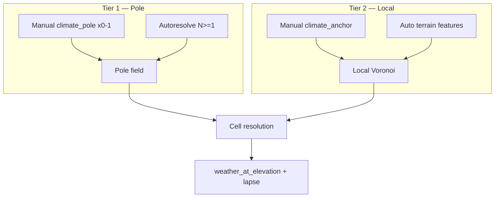

## Назначение

Климат — **отдельный pure-generator**, независимый от terrain shape и weather runtime.

| Система | Роль |
|---|---|
| **ClimateGeneratorService** | spatial assignment + `temperature_base` / `rainfall` на eager generate |
| **TerrainGeneratorService** | heightmap (`z`, `system_terrain`); **вызывает** climate per cell |
| **Weather** (runtime) | тип погоды от `temperature_base` + `rainfall` + `weather_type_registry` |

**Статус:** v1 admin Voronoi ✅ · local anchors ✅ · **pole tier v2.1** ✅ (без engine DAG nodes).

**Принцип платформы:** не симуляция Земли. Высота **не** задаёт arctic. Полюса и мастерские якоря — источник «холодного/жаркого»; рельеф — только **локальные** центры Voronoi.

---

## Расположение

```
app/application/worldData/generators/
  climate/                           ← enum, registry, pole/local anchors, detect, assign
  assemblers/climateAssembler/       ← passes + orchestrator (DAG hook points)
    climateOrchestratorService.py
    climateSurfaceAssembler.py
    climateRuntimeAssembler.py         ← season/weather (runtime, no map_cell rewrite)
    passes/poleResolvePass.py          ← v2.1
    passes/heightmapPass.py
    passes/anchorCollectPass.py
    passes/cellWeatherPass.py

  terrain/terrainGeneratorService.py   ← thin facade → orchestrator

app/api/routes/map.py                  ← POST …/generate-surface
```

**Engine DAG:** ноды **не** реализуются в коде — мастер подключает `ClimateOrchestratorService` / `ClimateRuntimeAssembler`.

---

## ClimateZone enum (built-in defaults)

Hardcoded dicts из terrain **удалены**. Дефолты — в `ClimateZone` + `CLIMATE_ZONE_DEFAULTS`.

| `system_climate` | `base_temperature` | `typical_elevation_z` | `base_rainfall` |
|---|---|---|---|
| arctic | -25 | 4 | 20 |
| tundra | -20 | 3 | 30 |
| temperate | 12 | 0 | 55 |
| tropical | 28 | -1 | 80 |
| desert | 30 | 0 | 10 |
| volcanic | 35 | 2 | 5 |
| … | … | … | … |

Полный список — в `climateZone.py`.  
**N+1:** зона может существовать **только** в `world.climate_zone_registry` без enum-члена. Мир без `arctic` в registry — arctic недоступен.

---

## World: температурный коридор и полюса (v2.1)

### `climate_temperature_peak_min` / `climate_temperature_peak_max`

Абсолютные **пиковые** экстремумы мира (учёт сезонов и модификаторов на уровне продукта):

```json
{
  "climate_temperature_peak_min": -40,
  "climate_temperature_peak_max": 45
}
```

Полюса **не** берут enum-temp как абсолют — derived из коридора (см. ниже).  
`season_temp_offsets` — runtime сдвиг от `temperature_base`, не переписывает eager map.

### Хранение полюсов (гибрид C — утверждено)

| Данные | Где |
|---|---|
| `climate_temperature_peak_min/max` | `World` |
| `climate_local_influence_fraction` | `World` (default 0.1 × bbox diagonal) |
| `climate_pole_mode`: `"manual"` \| `"autoresolve"` | `World` |
| `climate_pole_preset`: `ice` \| `desert` \| `binary` \| … | `World` (autoresolve) |
| **Manual pole (max 1)** | `named_location`, `system_location_type = "climate_pole"` |
| **Autoresolve poles (N ≥ 1)** | derived at generate (не в `named_locations`) |

**Manual:** мастер объявляет **не больше одного** `climate_pole`. Второй полюс **не** autoresolve-ится.

```json
{
  "location_uid": "pole-north",
  "system_location_type": "climate_pole",
  "pole_kind": "cold",
  "system_climate_zone": "arctic",
  "weight": 1.0,
  "map_x": 6000,
  "map_y": 500000,
  "map_z": 0
}
```

- `pole_kind`: `cold` \| `hot` \| `neutral`
- `weight` — множитель в pole blend (не radius в метрах)
- `map_z` — лор; blend только `(gx, gy)`

### Autoresolve (утверждено)

Если manual pole нет и `climate_pole_mode = "autoresolve"`:

1. **N ≥ 1** полюсов (из preset; `binary` → 2, `ice`/`desert` → 1, …)
2. Позиции — deterministic по `hash(world_uid)` + surface bbox
3. Каждый полюс: **`system_climate_zone`** (preset/registry) **и** **`base_temperature`** derived из peak min/max
4. **Не смотрит на elevation**

### Derived temp полюса (inset 20% от span)

```
span = peak_max - peak_min

HOT pole:  peak_max - 0.20 × span
COLD pole: peak_min + 0.20 × span
```

Manual override на pole location перекрывает derived.

### Pole field — влияние на ячейки (утверждено)

**N ≥ 2 — inverse-distance blend (6B):**

```
w_i = weight_i / (dist_i + ε)^p     # ε, p — v2 constants
temp(cell) = Σ w_i × pole_temp_i / Σ w_i
zone(cell) → profile полюса с max w_i (rainfall, typical_elevation_z)
```

**N = 1 — fade к default (отдельный алгоритм):**

```
t = clamp01( dist(cell, pole) / (bbox_diagonal × 0.5) )
sample = lerp(pole_sample, default_climate_zone_sample, smoothstep(t))
```

Однородно холодный/жаркий мир: один pole + узкий коридор + `default_climate_zone`.

**Elevation не участвует** в pole field.

---

## Два уровня якорей (v2.1)



| Tier | Тип | Источник | Elevation? | Роль |
|---|---|---|---|---|
| 1 | **Pole** | world + `climate_pole` / autoresolve | **Нет** | Глобальный градиент мира |
| 2 | **Local** | `climate_anchor` + auto + admin fallback | WHERE only | Локально модифицирует pole field |

**На ячейке:**

1. `sample_pole_field(gx, gy)` — tier 1 (всегда)
2. Modifiers = `climate_anchor` manual + auto (**ADMIN не участвует** при active pole)
3. `r = bbox.diagonal × climate_local_influence_fraction` (default 0.1); cap `min(r, dist_to_2nd_modifier / 2)`
4. `dist ≤ r`: zone/rainfall от nearest modifier; temp из profile
5. Внешние 20% `[0.8r … r]`: zone/rainfall still local; **temp** smoothstep к pole base
6. `dist > r` → pole sample
7. `weather_at_elevation(world, zone, z, base_override?)`

---

## Local anchors (tier 2)

**Manual first → auto second.**

| Приоритет | Источник |
|---|---|
| 1 | Manual `climate_anchor` |
| 2 | Auto terrain features |
| 3 | Admin `region/kingdom/empire/duchy` |
| 4 | `default_climate_zone` |

Auto local **наследует зону** из pole field в точке feature, **не** из elevation.

| Сигнал | Prominence |
|---|---|
| Peak (local max) | ≥ 50 m |
| Basin (local min) | ≥ 25 m |
| Water (`liquid_body`) | ≥ 10 m |

Cap **32** features. **Запрещено:** elevation→arctic, settlement footprint.

---

## Eager pipeline (v2.1)

| Pass | Выход |
|---|---|
| PoleResolvePass | `ClimatePoleField` |
| HeightmapPass | `z`, `system_terrain` |
| AnchorCollectPass | `ClimateAnchorField` (local) |
| CellWeatherPass | `temperature_base`, `rainfall` |

### Статус реализации

| Элемент | Статус |
|---|---|
| v1 admin zone Voronoi | ✅ fallback |
| Local manual + auto (no elevation→zone) | ✅ |
| Orchestrator + pole pass | ✅ |
| Pole tier | ✅ |
| `climate_pole` import validation (max 1) | ✅ |
| `volcanic` enum | ✅ |
| Engine DAG nodes | ⬜ мастер |

---

## `world.climate_zone_registry`

Entry перекрывает enum default для `system_climate`:

```json
{
  "system_climate": "arctic",
  "base_temperature": -25,
  "typical_elevation_z": 4,
  "base_rainfall": 20,
  "temperature_variance": 8,
  "rainfall_variance": 10
}
```

Reader принимает `list[dict]` или `dict` (legacy) — без миграции БД.

---

## `resolve_climate(location)`

Walk-up по `parent_location_uid` (как `tz_locations.md`):

```
if location.system_climate_zone → return it
if parent → resolve_climate(parent)
return world.default_climate_zone or "temperate"
```

---

## ClimateGeneratorService API

```python
@dataclass(frozen=True)
class SurfaceClimateSample:
    system_climate_zone: str
    zone_location_uid: str | None
    typical_elevation_z: int

class ClimateGeneratorService:
    def build_zone_field(world, locations, cell_m) -> ZoneClimateField
    def resolve_climate(world, uid_map, location) -> str
    def sample_at_grid(world, uid_map, field, gx, gy) -> SurfaceClimateSample
    def sample_at_pole_field(world, pole_field, gx, gy) -> SurfaceClimateSample  # v2.1
    def weather_at_elevation(world, system_climate, z) -> tuple[int, int]
```

### Формула температуры

```
lapse = world.elevation_lapse_rate ?? 0.65
temperature_base = round(profile.base_temperature - lapse × (z / 100))
rainfall = profile.base_rainfall
```

Pole-derived temp влияет на `profile.base_temperature` при sampling pole field (до lapse).

---

## Связь с terrain

```python
pole_sample = climate.sample_at_pole_field(world, pole_field, gx, gy)
local_sample = climate.sample_at_anchor_field(world, uid_map, local_field, gx, gy)
sample = resolve_tier2_override(pole_sample, local_sample)
z = clamp(z_noise(..., sample.typical_elevation_z), world.z_min, world.z_max)
temp, rainfall = climate.weather_at_elevation(world, sample.system_climate_zone, z)
```

---

## MapCell fields

| Поле | Кто пишет |
|---|---|
| `temperature_base`, `rainfall` | CellWeatherPass |
| `location_uid` (surface) | uid local/pole anchor |
| `system_terrain`, `z` | HeightmapPass |

---

## Отложено

- `random(±temperature_variance)` / deterministic per-cell noise
- Neighbor climate blend
- `POST …/map/generate-climate`
- Zone polygons / climate barriers
- Full runtime seasons in `ClimateRuntimeAssembler`

---

## Связанные документы

- `tz_terrain_generation.md`
- `tz_locations.md`
- `project_data_storage_tz.md`
- `tz_generator_technical_debt.md`
