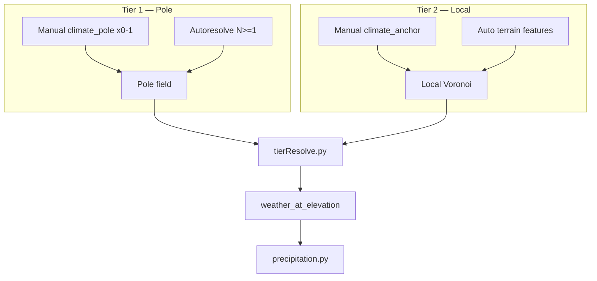

## Назначение

Климат — **отдельный pure-generator**, независимый от terrain shape и weather runtime.

| Система | Роль |
|---|---|
| **ClimateGeneratorService** | spatial assignment + `temperature_base` / `rainfall` на eager generate |
| **TerrainGeneratorService** | heightmap (`z`, `system_terrain`); **вызывает** climate per cell |
| **Weather** (runtime) | тип погоды от `temperature_base` + `rainfall` + `weather_type_registry` |

**Статус:** v2.2 — pole tier ✅ · tier resolve (CL-2) ✅ · precipitation liquid ✅ · peak clamp ✅ · engine DAG ⬜

**Принцип платформы:** не симуляция Земли. Высота **не** задаёт arctic. Полюса и мастерские якоря — источник «холодного/жаркого»; рельеф — только **локальные** центры Voronoi tier-2.

---

## Расположение

```
app/application/worldData/generators/
  climate/
    climateZone.py, registry.py          ← enum + N+1 profile_for
    climateGeneratorService.py         ← spatial sample + weather_at_elevation
    poleResolve.py, climatePole.py     ← manual/autoresolve poles
    climatePoleField.py                ← inverse-distance / fade blend
    tierResolve.py                     ← pole + local tier cell resolution (CL-2)
    math.py, locations.py, terrainZ.py ← shared helpers (CL-12)
    anchorDetect.py, anchorAssign.py   ← auto features from heightmap
    anchorCollect.py, climateAnchorField.py
    precipitation.py                   ← liquid mult, peak clamp, logging
    zoneField.py                       ← legacy admin Voronoi (v1 fallback)
  assemblers/climateAssembler/
    climateOrchestratorService.py
    climateSurfaceAssembler.py
    climateRuntimeAssembler.py         ← season offset stub; weather_type ⬜
    passes/poleResolvePass.py
    passes/heightmapPass.py
    passes/anchorCollectPass.py
    passes/cellWeatherPass.py

  terrain/terrainGeneratorService.py   ← thin facade → orchestrator

app/api/routes/map.py                  ← POST …/generate-surface
```

**Engine DAG:** ноды **не** реализуются в коде — мастер подключает `ClimateOrchestratorService` / `ClimateRuntimeAssembler`.

---

## ClimateZone enum (built-in defaults)

Hardcoded dicts из terrain **удалены**. Дефолты — в `ClimateZone` + `CLIMATE_ZONE_DEFAULTS`.

| `system_climate` | `base_temperature` | `typical_elevation_z` | `base_rainfall` |
|---|---|---|---|
| arctic | -25 | 4 | 20 |
| tundra | -20 | 3 | 30 |
| temperate | 12 | 0 | 55 |
| tropical | 28 | -1 | 80 |
| desert | 30 | 0 | 10 |
| volcanic | 35 | 2 | 5 |
| … | … | … | … |

Полный список — в `climateZone.py`.  
**N+1:** зона может существовать **только** в `world.climate_zone_registry` без enum-члена. Мир без `arctic` в registry — arctic недоступен.

---

## World: температурный коридор и полюса (v2.1)

### `climate_temperature_peak_min` / `climate_temperature_peak_max`

Абсолютные **пиковые** экстремумы мира (учёт сезонов и модификаторов на уровне продукта):

```json
{
  "climate_temperature_peak_min": -40,
  "climate_temperature_peak_max": 45
}
```

Полюса **не** берут enum-temp как абсолют — derived из коридора (см. ниже).  
`season_temp_offsets` — runtime сдвиг от `temperature_base`, не переписывает eager map.

**Три слоя температуры (A):**

| Слой | Смысл |
|---|---|
| `climate_temperature_peak_min/max` | Абсолютный коридор мира (сезоны, экзотика) |
| `base_temperature` зоны / pole inset 20% | **Опорные** точки градиента, не потолок ячейки |
| `MapCell.temperature_base` | profile + lapse + override; **clamp** к `[peak_min, peak_max]` на eager |

Inset 20% у полюса — только derived temp полюса, не лимит ячейки.  
Arctic **−60°C** на ячейке: `peak_min: -60` + override в `climate_zone_registry`, не enum `−25`.

**Preset vs лимит (B):** enum и fallback `−40…45` в коде — **земной preset** для импорта и pole math, когда peak не задан. Они **не** запрещают Titan (−179) или Venus (+430): мастер задаёт `peak_min/max` и registry. Отдельного `climate_preset` в v1 нет.

### `precipitation_liquid` (v2.2)

```json
{
  "precipitation_liquid": "water",
  "material_registry": [
    {
      "system_material": "water",
      "material_category": "liquid",
      "cool_into": "ice",
      "cool_temp": 0,
      "heat_into": "steam",
      "heat_temp": 100
    }
  ]
}
```

| Поле | Default | Смысл |
|---|---|---|
| `precipitation_liquid` | `"water"` | ref → `material_registry`; см. fallback ниже |

**Fallback chain** (`precipitation.py` → `resolve_world_precipitation_liquid`):

1. `world.precipitation_liquid` (или `"water"`) — запись с `material_category: "liquid"`
2. `water` из registry
3. первый `liquid` в registry
4. built-in defaults `{ cool_temp: 0, heat_temp: 100 }`

При шагах 2–4 — `warn_once` **один раз на `(world_uid, reason)`**. Нормальный resolve — без warning.

## Логирование (v2.2.2)

Общий helper: [`loggingHelpers.py`](backend/app/application/worldData/generators/climate/loggingHelpers.py) — `warn_once`, `debug_once` (dedupe per world).

### Pass summaries (INFO)

Logger: `app.application.worldData.generators.assemblers.climateAssembler.climateSurfaceAssembler`

| Pass | Пример |
|---|---|
| pole_resolve | `poles=N preset=… mode=…` |
| heightmap | `cells=N z_range=[lo,hi]` |
| anchor_collect | `manual=M auto=A admin=… admin_skipped=…` |
| cell_weather | `surface_cells=N extra_non_surface=K` |

### WARNING (fallback / master data issues)

| Модуль | Ситуация |
|---|---|
| `precipitation.py` | fallback `precipitation_liquid`; invalid phase band (`heat <= cool`) |
| `poleResolve.py` | >1 pole; pole без zone; `mode=manual` без pole |
| `registry.py` | unknown `system_climate` → temperate defaults |
| `anchorDetect.py` | terrain features capped at 32 |
| `anchorCollect.py` | admin zones skipped при active pole |
| `heightmapPass.py` | empty bbox (no static anchors) |
| `tierResolve.py` | pole bbox missing → modifier span fallback |

### DEBUG

| Модуль | Когда |
|---|---|
| `precipitation.py` | каждый `effective_rainfall` (шумно на grid) |
| `precipitation.py` | `peak_clamp` once per world когда temp обрезан |

Детали liquid — [`tz_materials.md`](./tz_materials.md) §7.1.

**Rainfall на ячейке:**

```
moisture     = zone.base_rainfall          # влажность зоны, не обнуляется при замерзании
liquid_mult  = f(temp, cool_temp, heat_temp, cool_into, heat_into)   # 0..1, outer 10% smoothstep
rainfall     = round(moisture × liquid_mult)   # жидкие осадки в eager map
```

Снег/град — `weather_type_registry` по temp + moisture; при `temp ≤ cool_temp` liquid_mult = 0, moisture в зоне сохраняется для runtime.

**Пример холодного мира (D):**

```json
{
  "climate_temperature_peak_min": -60,
  "climate_temperature_peak_max": 35,
  "precipitation_liquid": "water",
  "climate_zone_registry": [
    { "system_climate": "arctic", "base_temperature": -55, "base_rainfall": 20 }
  ]
}
```

При `temp = -55` и `precipitation_liquid: "water"` → `rainfall = 0` (ниже `cool_temp`).  
Для жидких осадков в мороз — другой liquid (напр. `cool_temp: -80`) или снег через `weather_type_registry`.

### Хранение полюсов (гибрид C — утверждено)

| Данные | Где |
|---|---|
| `climate_temperature_peak_min/max` | `World` |
| `climate_local_influence_fraction` | `World` (default 0.1 × bbox diagonal) |
| `climate_pole_mode`: `"manual"` \| `"autoresolve"` | `World` |
| `climate_pole_preset`: `ice` \| `desert` \| `binary` \| … | `World` (autoresolve) |
| **Manual pole (max 1)** | `named_location`, `system_location_type = "climate_pole"` |
| **Autoresolve poles (N ≥ 1)** | derived at generate (не в `named_locations`) |

**Manual:** мастер объявляет **не больше одного** `climate_pole`. Второй полюс **не** autoresolve-ится.

```json
{
  "location_uid": "pole-north",
  "system_location_type": "climate_pole",
  "pole_kind": "cold",
  "system_climate_zone": "arctic",
  "weight": 1.0,
  "map_x": 6000,
  "map_y": 500000,
  "map_z": 0
}
```

- `pole_kind`: `cold` \| `hot` \| `neutral`
- `weight` — множитель в pole blend (не radius в метрах)
- `map_z` — лор; blend только `(gx, gy)`

### Autoresolve (утверждено)

Если **manual pole отсутствует** и `climate_pole_mode = "autoresolve"` (default при `null`), autoresolve по `climate_pole_preset` (default `binary`).

При `climate_pole_mode = "manual"` без объявленного pole → **пустой** `ClimatePoleField` (uniform `default_climate_zone`).

1. **N ≥ 1** полюсов (из preset; `binary` → 2, `ice`/`desert` → 1)
2. Позиции — deterministic по `hash(world_uid)` + surface bbox
3. Каждый полюс: **`system_climate_zone`** (preset/registry) **и** **`base_temperature`** derived из peak min/max
4. **Не смотрит на elevation**

### Derived temp полюса (inset 20% от span)

```
span = peak_max - peak_min

HOT pole:  peak_max - 0.20 × span
COLD pole: peak_min + 0.20 × span
```

Manual override на pole location перекрывает derived.

### Pole field — влияние на ячейки (утверждено)

**N ≥ 2 — inverse-distance blend (6B):**

```
w_i = weight_i / (dist_i + ε)^p     # ε, p — v2 constants
temp(cell) = Σ w_i × pole_temp_i / Σ w_i
zone(cell) → profile полюса с max w_i (rainfall, typical_elevation_z)
```

**N = 1 — fade к default (отдельный алгоритм):**

```
t = clamp01( dist(cell, pole) / (bbox_diagonal × 0.5) )
sample = lerp(pole_sample, default_climate_zone_sample, smoothstep(t))
```

Однородно холодный/жаркий мир: один pole + узкий коридор + `default_climate_zone`.

**Elevation не участвует** в pole field.

---

## Два уровня якорей (v2.1)



| Tier | Тип | Источник | Elevation? | Роль |
|---|---|---|---|---|
| 1 | **Pole** | `climate_pole` / autoresolve | **Нет** | Глобальный градиент мира |
| 2 | **Local** | `climate_anchor` + auto terrain | WHERE only | Локально модифицирует pole sample |

**Merge vs resolve (admin zones):**

| Этап | Admin `region/kingdom/…` |
|---|---|
| `build_merged_field` (AnchorCollectPass) | ✅ попадают в `ClimateAnchorField` |
| `tierResolve` (CellWeatherPass) | ❌ **пропускаются** при active pole field |
| Legacy v1 (`build_coarse_field`) | ✅ admin Voronoi, если нет manual anchors |

**Cell resolve (`tierResolve.py`):**

1. `pole_sample = sample_at_pole_field(gx, gy)` — всегда tier 1
2. Modifiers = manual + auto anchors (**не** ADMIN)
3. `r = bbox.diagonal × climate_local_influence_fraction` (default 0.1); cap `min(r, dist_to_2nd_modifier / 2)`
4. `dist ≤ r`: zone/rainfall от nearest modifier; temp из profile (+ optional override)
5. Outer 20% `[0.8r … r]`: zone/rainfall — local; **temp** smoothstep к pole base (CL-2d accepted)
6. `dist > r` → pole sample
7. `weather_at_elevation(zone, z, base_temperature_override?)` → clamp + `effective_rainfall`

Приоритет источников зоны (conceptual — до tier resolve):

| Приоритет | Источник | Где применяется |
|---|---|---|
| 1 | Pole field | tier 1, база ячейки |
| 2 | Manual `climate_anchor` | tier 2 modifier |
| 3 | Auto terrain features | tier 2 modifier |
| 4 | Admin zone | legacy path / merge only |
| 5 | `default_climate_zone` | pole fade N=1, fallbacks |

---

## Local anchors (tier 2)

**Manual first → auto second** в `build_merged_field`. Auto local **наследует зону** из pole field в точке feature, **не** из elevation.

| Сигнал | Prominence |
|---|---|
| Peak (local max) | ≥ 50 m |
| Basin (local min) | ≥ 25 m |
| Water (`liquid_body`) | ≥ 10 m |

Cap **32** features. **Запрещено:** elevation→arctic, settlement footprint.

---

## Eager pipeline (v2.2)

| Pass | Модуль | Выход |
|---|---|---|
| PoleResolvePass | `poleResolve.py` | `ClimatePoleField` |
| HeightmapPass | heightmap + pole bias | `z`, `system_terrain` |
| AnchorCollectPass | `anchorCollect.py` + detect/assign | `ClimateAnchorField` |
| CellWeatherPass | `tierResolve` + `weather_at_elevation` | `temperature_base`, `rainfall`, `location_uid` |

Entry points (`ClimateOrchestratorService`):

| Метод | Passes |
|---|---|
| `full_surface` | все 4 |
| `heightmap_only` | pole + heightmap |
| `apply_weather_only` | anchor collect (optional) + cell weather |
| `recalculate` | stub по `RecalcTrigger` (CL-7 open) |

### Статус реализации

| Элемент | Статус |
|---|---|
| v1 admin zone Voronoi (`build_zone_field`) | ✅ legacy API |
| Pole tier + autoresolve | ✅ |
| Tier resolve CL-2 | ✅ |
| Local manual + auto (no elevation→zone) | ✅ |
| Orchestrator + 4 passes | ✅ |
| `precipitation_liquid` + peak clamp | ✅ v2.2 |
| `volcanic` enum | ✅ |
| `climate_pole` max 1 validator | ⚠️ warning at resolve (CL-5 partial) |
| `climate_pole_mode` wiring | ✅ CL-4 |
| `weather_type_registry` в runtime | ⬜ |
| Engine DAG nodes | ⬜ мастер |

### Smoke tests

`backend/scripts/debug_settlement.py`:

- `test_climate_zone_voronoi`
- `test_climate_registry_override`
- `test_climate_temperature_formula`
- `test_climate_manual_anchor_voronoi`
- `test_climate_orchestrator_passes`
- `test_climate_detect_relative_elevation`
- `test_climate_pole_tier`
- `test_climate_tier_resolve`
- `test_climate_precipitation_liquid`

---

## `world.climate_zone_registry`

Entry перекрывает enum default для `system_climate`:

```json
{
  "system_climate": "arctic",
  "base_temperature": -25,
  "typical_elevation_z": 4,
  "base_rainfall": 20,
  "temperature_variance": 8,
  "rainfall_variance": 10
}
```

Reader принимает `list[dict]` или `dict` (legacy) — без миграции БД.

---

## `resolve_climate(location)`

Walk-up по `parent_location_uid` (как `tz_locations.md`):

```
if location.system_climate_zone → return it
if parent → resolve_climate(parent)
return world.default_climate_zone or "temperate"
```

---

## ClimateGeneratorService API

```python
@dataclass(frozen=True)
class SurfaceClimateSample:
    system_climate_zone:       str
    zone_location_uid:         str | None
    typical_elevation_z:       int
    base_temperature_override: int | None = None   # pole blend / tier override

class ClimateGeneratorService:
    # legacy v1
    def build_zone_field(world, locations, cell_m) -> ZoneClimateField
    def build_coarse_field(world, locations, cell_m) -> ClimateAnchorField
    def sample_at_grid(world, uid_map, field, gx, gy) -> SurfaceClimateSample

    # v2 pole + tier
    def sample_at_pole_field(world, pole_field, gx, gy) -> SurfaceClimateSample
    def sample_at_anchor_field(world, uid_map, local_field, gx, gy) -> SurfaceClimateSample
    def resolve_surface_sample(world, uid_map, pole_field, local_field, gx, gy) -> SurfaceClimateSample

    def resolve_climate(world, uid_map, location) -> str
    def weather_at_elevation(
        world, system_climate, z,
        base_temperature_override: int | None = None,
    ) -> tuple[int, int]   # (temperature_base, rainfall)
```

### Формула температуры и rainfall (v2.2)

```
profile = profile_for(world, system_climate)
base    = base_temperature_override ?? profile.base_temperature
lapse   = world.elevation_lapse_rate ?? 0.65
raw     = round(base - lapse × (z / 100))
temperature_base = clamp(raw, peak_min, peak_max)     # precipitation.peak_bounds

moisture = profile.base_rainfall                     # zone moisture, не обнуляется
liquid   = resolve_world_precipitation_liquid(world)
mult     = liquid_precipitation_mult(temperature_base, liquid)
rainfall = clamp(round(moisture × mult), 0, 100)
```

Pole-derived temp попадает в `base_temperature_override` через `tierResolve` / `ClimatePoleField.sample`.

---

## Связь с terrain

`TerrainGeneratorService.generate_surface` → `ClimateOrchestratorService.full_surface`.

Per surface cell (упрощённо):

```python
pole_field   = run_pole_resolve_pass(...)
heightmap    = run_heightmap_pass(..., pole_field)
anchor_field = run_anchor_collect_pass(..., heightmap, pole_field)
for cell in heightmap:
    sample = climate.resolve_surface_sample(world, uid_map, pole_field, anchor_field, cell.x, cell.y)
    temp, rainfall = climate.weather_at_elevation(
        world, sample.system_climate_zone, cell.z, sample.base_temperature_override,
    )
```

HeightmapPass использует `typical_elevation_z` из pole/local sample для bias z-noise.

---

## MapCell fields

| Поле | Кто пишет |
|---|---|
| `temperature_base`, `rainfall` | CellWeatherPass |
| `location_uid` (surface) | uid local/pole anchor |
| `system_terrain`, `z` | HeightmapPass |

---

## ClimateRuntimeAssembler (runtime stub)

Не переписывает `map_cells.temperature_base` / `rainfall`.

| Метод | Статус |
|---|---|
| `resolve_effective_temperature` | ✅ `season_temp_offsets` |
| `resolve_weather` | ⬜ `system_weather` всегда `None`; `weather_type_registry` не подключён |

Снег/град при `liquid_mult = 0` — зона здесь, не в eager map.

---

## Отложено

- `random(±temperature_variance)` / deterministic per-cell noise
- Neighbor climate blend
- `POST …/map/generate-climate`
- Zone polygons / climate barriers
- Full runtime weather pick from `weather_type_registry`
- CL-2b: admin anchors не merge при active pole ✅
- CL-4: wire `climate_pole_mode` ✅

---

## Changelog

| Дата | Версия | Изменение |
|---|---|---|
| 2026-06 | v2.2.2 | logging audit: warn_once hub, pass INFO, fallback WARNINGs |
| 2026-06 | v2.2.1 | CL-4 pole mode, CL-2b admin merge, CL-10..12 shared helpers |
| 2026-06 | v2.2 | `precipitation_liquid`, `precipitation.py`, peak clamp, debug/warning logs |
| 2026-06 | v2.1 | Pole tier, tier resolve (CL-2), orchestrator passes |
| earlier | v1 | Admin Voronoi, local anchors |

---

## Связанные документы

- [`tz_terrain_generation.md`](./tz_terrain_generation.md)
- [`tz_materials.md`](./tz_materials.md) — §7.1 precipitation liquid
- [`tz_locations.md`](./tz_locations.md)
- [`project_data_storage_tz.md`](./project_data_storage_tz.md)
- [`tz_generator_technical_debt.md`](./tz_generator_technical_debt.md) — CL-* registry
