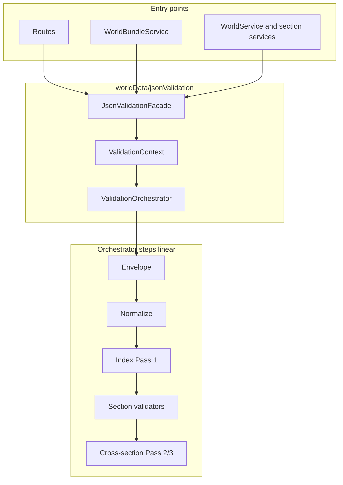

# JSON Validation — Technical Specification

**Версия документа: 0.1** (2026-06)

**Версия реестра JSON-схем: 0.1** — schema index (§ JSON Schema Registry) + **Field Contract Registry** (поля, ENUM-E / REF-W, import policy до JV-impl).

| Поле | Значение |
|---|---|
| Код `worldData/jsonValidation/` | ✅ Phase 7 — runtime legacy warn-only (JV-7) |
| T2 section import hooks | ✅ locations, races, perks, map |
| T3–T5 CRUD hooks | ✅ world, locations, races, perks |
| T6 seed import | ✅ SeedTableValidator + import/upsert gate |
| Transitional | ad-hoc validators в services + runtime hardcodes в generators |
| Следующая версия реестра | **0.2** — после JV-1…JV-3 (Pydantic row models + bundleValidator) |

---

## Назначение

Единый контракт **семантической** проверки master JSON: import bundle, будущий редактор миров, normalize policy в БД.

| Документ | Роль |
|---|---|
| **Этот ТЗ** | **§0** vocabulary + **SCH-*** field contracts + **§ Архитектура** (facade, orchestrator, triggers) + JV queue |
| [`tz_races.md`](./tz_races.md) | **домен** race contract (merge, appearance stack, L3 semantics) |
| [`tz_json_import.md`](./tz_json_import.md) | HTTP import, `ImportResult`, repos — **механика** загрузки |
| Domain `tz_*.md` | **доменные правила** по ссылке из реестра |
| [`tz_generator_technical_debt.md`](./tz_generator_technical_debt.md) | backlog HY-5 / HY-S-* (wire enum, connections loop); детали имплементации — § Архитектура ниже |

**Out of scope:** `engine/` + `contracts/` (LLM turn), geometry validators structure, faction.

---

## §0 — N1-S / N1-W vocabulary и `system_*` / `display_*` (приоритет v0.1)

> **N+1** в продукте = расширяемые таблицы мастера (**N1-S**, **N1-W**, **N1-G**).  
> **Не путать** с **ENUM-E** — захардкоженными типами внутри записи (`material_category`, `node_category`, …).  
> Доменный контекст: [`project_data_storage_tz.md`](./project_data_storage_tz.md) §«Единая схема статов и скиллов», §«Ключевые правила».

### Три слоя vocabulary (не смешивать)

| Слой | ID | Суть | Пример |
|---|---|---|---|
| **Engine-closed тип** | `ENUM-E-*` | Захардкожен в движке; **не** расширяется мастером | `material_category`, `node_category`, `node_type`, `GraphLevel` |
| **N1-S schema** | `N1-S-*` | Таблица сущностей мира: **`system_name` / `display_name`**; ref на `ENUM-E` внутри записи | `stat_schema[]`, `npc_fields[]` |
| **N1-W vocabulary** | `N1-W-*` | Расширяемая таблица мира: **`system_<domain>` / `display_*`**; мастер добавляет строки | `material_registry[]`, `climate_zone_registry[]` |

**Правило validator:**

```
ref на сущность  →  ключ ∈ N1-S или N1-W таблицы этого мира (Pass 1 → index → Pass 2)
поле type/category внутри записи  →  ∈ ENUM-E (reject unknown)
```

**Preset keys** в fixtures (`temperate`, `region`, `standard`) — **не** отдельный gate enum; валидность = ключ **объявлен** в соответствующей **N1-W** таблице мира.

---

### N1-S — schema tables (`system_name` / `display_name`)

> **Три уровня — не смешивать при проверке JSON / fixtures.**

| Уровень | Что это | Пример `stat_schema` |
|---|---|---|
| **L1 — SQLite колонка** | Одна TEXT/JSON колонка на `worlds`; **нет** колонки `system_name` в DDL | `worlds.stat_schema` |
| **L2 — wire shape** | Форма всего blob: **legacy map** (fixtures) vs **target array** (канон) | map `{ "strength": {...} }` → array `[ { "system_name": "strength", ... } ]` |
| **L3 — поля записи** | Ключи **внутри** каждого элемента массива (или значения map в legacy) | `system_name`, `display_name`, `alias`, … |

```
worlds (SQLite)
  └── stat_schema          ← L1: имя колонки
        └── [ {...}, ... ] ← L2: array (target) | { key: {...} } (legacy)
              └── system_name, display_name, …  ← L3: поля entry (L3-N1-S)
```

**L3-N1-S** — единый паттерн **полей записи** (не имя SQLite-колонки): **`system_name`** + **`display_name`**.  
**N1-W** использует другой L3: `system_material`, `system_climate`, … — см. § N1-W.

Домен: [`project_data_storage_tz.md`](./project_data_storage_tz.md) §«Единая схема».

#### L3 — поля одной записи N1-S

| Поле entry (L3) | req | Примечание |
|---|---|---|
| `system_name` | Y | immutable; overflow: `stat_1`, `field_1`, … |
| `display_name` | Y | UI / LLM |
| `alias` | Y* | *stat/skill/resist; unique в AliasRegistry |
| `description`, `lore_ref`, `tag_refs` | N | refs → N1-W lore/tag |

#### L1 + L2 — каталог N1-S колонок на `worlds`

| ID | L1 `worlds.*` | L2 target wire | L2 legacy wire (fixtures) | L3 system key | L3 display key | ENUM-E в entry |
|---|---|---|---|---|---|---|
| **N1-S-01** | `stat_schema` | **array** | **map** (key = implicit `system_name`) | `system_name` | `display_name` | category `stat` implicit |
| **N1-S-02** | `skill_schema` | **array** | **map** (drift) | `system_name` | `display_name` | category `mastery` implicit |
| **N1-S-03** | `resist_schema` | **array** | **map** (drift) | `system_name` | `display_name` | category `resist` implicit |
| **N1-S-04** | `npc_fields` | **array** | — (нет в fixtures) | `system_name` | `display_name` | **`node_category`** → E-02 |
| **N1-S-05** | `player_fields` | **array** | — (нет в fixtures) | `system_name` | `display_name` | **`node_category`** → E-02 |
| **N1-S-06** | `action_registry` | **array** | — | `system_name` | `display_name` | action logic engine-closed |

**Ref с персонажа / данных:** N1-S-01 → `system_stats[system_name]`; N1-S-02 → `character_mastery.system_skill`; N1-S-04/05 → `character_custom_fields.system_field`.

**`stat_schema` entry** — доп. L3: `min`, `max` (int, `min ≤ max`). **`skill_schema`** — + `initial_value` (0–100).

#### L2 legacy vs L2 target — `stat_schema` (проверяемый контракт)

**Legacy (as-is в [`fixtures/world_template.json`](../fixtures/world_template.json))** — L2 = map, L3 **без** поля `system_name`:

```json
"stat_schema": {
  "strength": { "display_name": "Сила", "min": 1, "max": 20 }
}
```

| Уровень | Legacy значение |
|---|---|
| L1 | `worlds.stat_schema` |
| L2 | JSON **object** (map) |
| L3 `system_name` | **отсутствует** — неявно = ключ map `"strength"` |
| L3 `display_name` | `"Сила"` |

**Target (канон после JV-1 normalize → persist в L1):**

```json
"stat_schema": [
  {
    "system_name":   "strength",
    "display_name":  "Сила",
    "alias":         "Str",
    "min":           1,
    "max":           20
  }
]
```

| Уровень | Target значение |
|---|---|
| L1 | `worlds.stat_schema` (тот же blob) |
| L2 | JSON **array** |
| L3 `system_name` | явное поле `"strength"` |
| L3 `display_name` | `"Сила"` |

**Normalize (JV-1):** L2 map → L2 array; для каждой пары `(key, value)` → `{ "system_name": key, ...value }`; затем reject dup `system_name` / `alias`.

**`npc_fields` / `player_fields`** — только target (array + explicit L3); пример:

```json
"npc_fields": [
  {
    "system_name":   "faction_loyalty",
    "display_name":  "Лояльность фракции",
    "node_category": "faction_context"
  }
]
```

`node_category` ∈ **ENUM-E E-02** — захардкожен; сами поля (`faction_loyalty`, `field_1`) — **N1-S** (L3 `system_name`).

---

### N1-W — world vocabulary (`system_<domain>` / `display_*`)

> **Тот же принцип L1/L2/L3**, но L3 **не** `system_name` — доменный ключ (`system_material`, `system_climate`, …).

| Уровень | N1-W пример |
|---|---|
| L1 | `worlds.material_registry` |
| L2 | **array** (или map для lore/tag — см. строку) |
| L3 | `system_material` + `display_name` (+ ENUM-E `material_category` на row) |

Мастер **добавляет строки**; preset из template — стартовый набор, не enum gate.

| ID | L1 `worlds.*` | L3 key field | L3 display field | Entry ENUM-E fields | REF index |
|---|---|---|---|---|---|
| **N1-W-01** | `material_registry[]` | `system_material` | `display_name` | **`material_category`** → ENUM-E | REF-W-MATERIAL |
| **N1-W-02** | `terrain_registry[]` | `system_terrain` | `display_name` / glossary | `terrain_category` → REF-W-TERRAIN-CAT | REF-W-TERRAIN |
| **N1-W-03** | `terrain_category_registry[]` | `system_category` | — | passability flags (bool) | REF-W-TERRAIN-CAT |
| **N1-W-04** | `climate_zone_registry[]` | `system_climate` | — (profile nums) | — | REF-W-CLIMATE |
| **N1-W-05** | `weather_type_registry[]` | `system_weather` | `display_weather` | priority, params | REF-W-WEATHER |
| **N1-W-06** | `connection_type_registry[]` | `system_connection_type` | `display_name` | hydrology subset → ENUM-E declare | REF-W-CONN |
| **N1-W-07** | `location_type_registry` | `system_type` | `display_type` *(fixture: map + `display_name`)* | `parent_types[]`, `is_outdoor`; subtypes[].`border_category` → E-05 | REF-W-LOC-TYPE |
| **N1-W-07a** | `…subtypes[]` | `system_subtype` | — | `border_category` | per parent type |
| **N1-W-08** | `city_size_registry[]` | `system_size` | `display_size` | `map_cells_count` | REF-W-CITY-SIZE |
| **N1-W-09** | `economic_tier_registry[]` | `system_tier` | `display_tier` | `base_value`, … | REF-W-ECON-TIER |
| **N1-W-10** | `danger_level_registry[]` | `system_danger` | `display_danger` | `priority` int | REF-W-DANGER |
| **N1-W-11** | `cell_state_registry[]` | `system_state` | `display_state` | **`state_category`** → ENUM-E | REF-W-CELL-STATE |
| **N1-W-12** | `location_state_registry[]` | `system_state` | `display_state` | need_modifiers, … | REF-W-LOC-STATE |
| **N1-W-13** | `road_type_registry[]` | `system_road_type` | `display_name` | — | REF-W-ROAD |
| **N1-W-14** | `passage_type_registry[]` | `system_passage_type` | `display_name` | — | REF-W-PASSAGE |
| **N1-W-15** | `room_type_registry` | key | `display_name` | — | REF-W-ROOM-TYPE |
| **N1-W-16** | `building_template_registry` | template uid | metadata | — | REF-W-BUILDING-TPL |
| **N1-W-17** | `barrier_template_registry` | template uid | metadata | — | REF-W-BARRIER-TPL |
| **N1-W-18** | `wound_type_registry[]` | `system_wound_type` | — | `vital` bool | REF-W-WOUND |
| **N1-W-19** | `colour_registry[]` | `system_colour` | `display_colour` | — | REF-W-COLOUR |
| **N1-W-20** | `texture_registry[]` | `system_texture` | `display_texture` | — | REF-W-TEXTURE |
| **N1-W-21** | `lore_registry` | map key (lore id) | **stub body** *(fixture: `display_name`, `description`; draft: `title`, `content`)* | — | **REF-W-LORE** *(inbound only)* |
| **N1-W-22** | `tag_registry` | key | label/meaning | — | REF-W-TAG |
| **N1-W-23** | `intensity_level_registry[]` | `system_level` | `display_level` | `priority` | REF-W-INTENSITY |
| **N1-W-24** | `narrative_type_registry[]` | `system_type` | `display_type` | — | REF-W-NARR-TYPE |
| **N1-W-25** | `character_trait_registry[]` | `system_trait` | — | need_multipliers | REF-W-TRAIT |
| **N1-W-26** | `respawn_type_registry[]` | `system_respawn_type` | `display_name` | location_tag, … | REF-W-RESPAWN |
| **N1-W-27** | `npc_target_type_registry[]` | `system_target_type` | — | glossary_ref | REF-W-NPC-TARGET |
| **N1-W-28** | `npc_needs_registry[]` | `system_need_type` | `display_need` | increment_per_tick | REF-W-NPC-NEED |
| **N1-W-29** | `npc_goal_type_registry[]` | `system_goal_type` | — | glossary_ref | REF-W-NPC-GOAL |
| **N1-W-30** | `resource_type_registry[]` | `system_resource` | `display_resource` | — | REF-W-RESOURCE |
| **N1-W-31** | `body_schema_registry` | key | display | parts[] | REF-W-BODY-SCHEMA |
| **N1-W-32** | `material_use_type_registry` | key | display | — | REF-W-MAT-USE |
| **N1-W-33** | `material_category_registry` | key | display | ⚠ legacy; **`material_category` on material row** = ENUM-E | — |
| **N1-W-34** | `faction_relation_type_registry` | key | display | — | defer |
| **N1-W-35** | `muscle_tables[]` | `table_id` | `display_name`; entries[].`system_muscle` | weight int | REF-W-MUSCLE-TBL |
| **N1-W-36** | `constitution_tables[]` | `table_id` | `display_name`; entries[].`system_constitution` | weight int | REF-W-CONSTIT-TBL |
| **N1-W-37** | `lighting_type_registry` | key | `display_name` | — | REF-W-LIGHTING *(spec; ORM ⬜)* |
| **N1-W-38** | `material_tag_registry` | key | display | — | REF-W-MAT-TAG *(spec; ORM ⬜)* |
| **N1-W-39** | `npc_llm_event_type_registry[]` | `system_event_type` | `display_name` | — | REF-W-NPC-LLM-EVT *(spec; ORM ⬜)* |

**N1-W validate:** `system_*` / table keys unique per table; refs from bundle rows ∈ index; **не** проверять против ENUM preset list.

---

### §0.1 — Audit L1/L2/L3 vs fixtures (2026-06)

Источник wire as-is: [`fixtures/world_template.json`](../fixtures/world_template.json) (+ `world_test.json` — тот же drift).  
ORM: [`World`](../backend/app/db/models/world.py). Target: domain TZ + §0 выше.

**Легенда**

| Mark | Значение |
|---|---|
| ✅ | L2 + L3 совпадают с target |
| ◐ | L2 OK, L3 частично (лишние/переименованные поля) |
| ❌ | L2 или L3 drift — нужен normalize (JV-1 / JV-2) |
| ⬜ | нет в fixture; target по TZ |

#### N1-S — audit

| ID | L1 | Fixture L2 | Target L2 | Fixture L3 key | Target L3 key | Fixture L3 display | Status |
|---|---|---|---|---|---|---|---|
| N1-S-01 | `stat_schema` | **map** | **array** | implicit map key | `system_name` | `display_name` | ❌ |
| N1-S-02 | `skill_schema` | ⬜ absent | **array** | — | `system_name` | `display_name` | ⬜ |
| N1-S-03 | `resist_schema` | ⬜ absent | **array** | — | `system_name` | `display_name` | ⬜ |
| N1-S-04 | `npc_fields` | ⬜ absent | **array** | — | `system_name` | `display_name` | ⬜ |
| N1-S-05 | `player_fields` | ⬜ absent | **array** | — | `system_name` | `display_name` | ⬜ |
| N1-S-06 | `action_registry` | ⬜ absent | **array** | — | `system_name` | `display_name` | ⬜ |

**N1-S-01 legacy example (fixture):** ключ `"strength"` = L3 `system_name`; поля `system_name` в JSON **нет**.

#### N1-W — audit (present in `world_template.json`)

| ID | L1 | Fixture L2 | Target L2 | Fixture L3 (key / display) | Target L3 | Status | Notes |
|---|---|---|---|---|---|---|---|
| N1-W-01 | `material_registry` | array | array | `system_material` / `display_name` | same | ✅ | `material_category` → ENUM-E E-03 |
| N1-W-02 | `terrain_registry` | array | array | `system_terrain` / *(via `glossary_ref`→lore)* | same | ✅ | нет inline `display_terrain` — OK |
| N1-W-04 | `climate_zone_registry` | array | array | `system_climate` / *(no display)* | same | ✅ | profile nums only |
| N1-W-06 | `connection_type_registry` | array | array | `system_connection_type` / `display_name` | same | ✅ | |
| N1-W-07 | `location_type_registry` | **map** | **array** | implicit key / **`display_name`** | **`system_type` / `display_type`** | ❌ | нет `parent_types`, `subtypes`, `is_outdoor` |
| N1-W-08 | `city_size_registry` | array | array | `system_size` / `display_size` | same | ◐ | fixture: **`radius`**; target: **`map_cells_count`** |
| N1-W-09 | `economic_tier_registry` | array | array | `system_tier` / `display_tier` | same | ✅ | |
| N1-W-21 | `lore_registry` | **map** | **map** | lore id (map key) | same | stub body fields | ◐ **stub** | inbound **refs**, не vocabulary; `tz_lore` TBD |

**N1-W-07 legacy (fixture):**

```json
"location_type_registry": {
  "region": { "display_name": "Регион" }
}
```

| Уровень | Fixture | Target |
|---|---|---|
| L2 | map | array |
| L3 key | `"region"` (implicit) | `"system_type": "region"` |
| L3 display | `display_name` | `display_type` |
| L3 meta | отсутствует | `parent_types`, `is_outdoor`, `subtypes[]` |

**N1-W-21 — `lore_registry` (glossary target, stub)**

> **Роль:** хранилище **lore-объектов** мира; другие сущности **ссылаются** ключом, а не дублируют display.  
> **Не** типичная N1-W vocabulary (`system_material` / `display_name`). Полный контракт — будущее `tz_lore.md` *(⬜)*.

**Inbound refs (validator Pass 2):**

| Ref field | Source row | Rule |
|---|---|---|
| `glossary_ref` | terrain, material, location, building, room, climate, … | key ∈ `lore_registry` |
| `lore_ref` | N1-S stat/skill/resist entry | key ∈ `lore_registry` |
| `tag_refs` | N1-S, locations | → **N1-W-22** tag_registry, не lore |

**Fixture (stub body — имена полей не финальны):**

```json
"lore_registry": {
  "terrain_plains": { "display_name": "Равнина", "description": "..." }
},
"terrain_registry": [
  { "system_terrain": "plains", "glossary_ref": "terrain_plains", ... }
]
```

| Уровень | Контракт v0.1 |
|---|---|
| L1 | `worlds.lore_registry` |
| L2 | map `{ [lore_id]: body }` |
| L3 key | `lore_id` (= значение `glossary_ref` / `lore_ref`) |
| L3 body | **stub** — fixture `display_name`/`description`; draft storage `title`/`content`; **не gate** до `tz_lore` |

**Resolve (runtime / LLM):** `display_*` и описание terrain/room/building → `lore_registry[glossary_ref]` ([`tz_locations.md`](./tz_locations.md)). Механика — в domain registry; нарратив — в lore.

#### N1-W — absent in `world_template.json` (⬜ fixture; target unchanged)

| ID | L1 | Target L2 | Target L3 key / display |
|---|---|---|---|
| N1-W-03 | `terrain_category_registry` | array | `system_category` / `display_category` |
| N1-W-05 | `weather_type_registry` | array | `system_weather` / `display_weather` |
| N1-W-07a | subtypes in N1-W-07 | nested array | `system_subtype` / `display_subtype` |
| N1-W-10 | `danger_level_registry` | array | `system_danger` / `display_danger` |
| N1-W-11 | `cell_state_registry` | array | `system_state` / `display_state` |
| N1-W-12 | `location_state_registry` | array | `system_state` / `display_state` |
| N1-W-13 | `road_type_registry` | array | `system_road_type` / *(lore via glossary)* |
| N1-W-14 | `passage_type_registry` | array | `system_passage_type` / `display_name` |
| N1-W-15 | `room_type_registry` | map/array | key / `display_name` |
| N1-W-16…17 | building/barrier templates | map | template uid / metadata |
| N1-W-18 | `wound_type_registry` | array | `system_wound_type` / — |
| N1-W-19…20 | colour/texture | array | `system_colour`/`system_texture` / `display_*` |
| N1-W-22 | `tag_registry` | map | key / `label`, `meaning` |
| N1-W-23 | `intensity_level_registry` | array | `system_level` / `display_level` |
| N1-W-24 | `narrative_type_registry` | array | `system_type_narrative`* / `display_type_narrative`* |
| N1-W-25…34 | traits, respawn, npc_*, resource, body, mat_use, faction | per TZ | см. §0 N1-W catalog |
| N1-W-35…36 | muscle/constitution tables | array | `table_id` / nested `system_muscle`… |
| N1-W-37…39 | lighting, mat_tag, npc_llm_event | spec | ORM ⬜ |

\* storage TZ wire; §0 catalog сокращённо `system_type` — при impl сверить с [`project_data_storage_tz.md`](./project_data_storage_tz.md).

#### N1-W-02 + N1-W-03 cross-ref (fixture)

`terrain_registry[].terrain_category` = `"solid"|"liquid"|"aerial"|"crevice"|"barrier"` — ref → **N1-W-03 index**, не ENUM-E.  
Fixture **не объявляет** `terrain_category_registry` — категории inline; Pass 2 validator должен либо require N1-W-03 rows, либо auto-seed defaults (JV-2 TBD).

#### Normalize queue (fixture drift → target)

| JV | Blobs | Действие |
|---|---|---|
| JV-1 | N1-S-01…03 | map → array; explicit `system_name` |
| JV-1 | N1-W-07 | map → array; `display_name` → `display_type`; inject `system_type` |
| JV-1 | N1-W-08 | `radius` → `map_cells_count` *(или alias both during transition)* |
| JV-2 | N1-W-03, refs | Pass 1 index + Pass 2 REF-W |
| JV-2 | N1-W-21 | REF-W-LORE: `glossary_ref` / `lore_ref` ∈ index; body struct **defer** `tz_lore` |

---

### §0.2 — Race contract (`races[]`) — ссылка на domain TZ

> **Не N1-W.** Отдельная таблица `races`; персонаж: `system_race` → `race_uid`.  
> **Домен (merge, appearance stack, L3 semantics, fixture drift):** [`tz_races.md`](./tz_races.md).  
> **Validator wire contracts:** **SCH-RACE-ROW**, **SCH-RACE-CONTRACT**, **SCH-RACE-LIST** — Field Contract § ниже.  
> **DDL / character sheet / registry_dependencies:** [`project_data_storage_tz.md`](./project_data_storage_tz.md).

---

### N1-G — global seed tables (appearance, не per-world)

`POST /api/seed/import` — те же N+1 правила, storage global.

| Pattern | Example |
|---|---|
| Base immutable keys + display | `system_hair_type: straight` |
| Overflow row | `system_hair_shape_1`, `system_social_status_1` |

Персонаж: `system_hair_type` → ref seed row; overflow `_1`, `_2`.  
Domain: [`project_data_storage_tz.md`](./project_data_storage_tz.md) §Seed tables.

---

### ENUM-E — engine-closed type registries (не N+1 таблицы)

Поля **внутри** записей N1-S / N1-W; unknown → **reject**.

| ENUM-E ID | Wire values | Used in |
|---|---|---|
| **E-01** `SchemaCategory` | `stat`, `mastery`, `resist` | implicit по колонке N1-S; AliasRegistry |
| **E-02** `NodeCategory` | `faction_context`, `profession_detail`, `secret`, `psychological_profile`, `social_connections`, `personal_history`, … | N1-S-04/05 `node_category` |
| **E-03** `MaterialCategory` | `solid`, `liquid`, `gas` | `material_registry[].material_category` |
| **E-04** `CellStateCategory` | `interactive`, `environmental` | N1-W-11 `state_category` |
| **E-05** `BorderCategory` | `liquid`, `null` | location subtype `border_category` |
| **E-06** `InventorySlotId` | `weapon`, `head`, `hands`, `body`, `feet`, `accessory` | `slots[]`; not N1-W |
| **E-07** `ItemCategory` | weapon, armor, tool, … | Python `item_category_registry`; not world JSON |
| **E-08** `ConnectionNodeType` | intersection, settlement_gate, portal, … | `connection_nodes[].node_type` |
| **E-09** `GraphLevel` | world, city, district, area | node/edge `graph_level` |
| **E-10** `HydrologyConnectionType` | lake_shoreline, coastline, river, mountain_river | declare path; also rows in N1-W-06 |
| **E-11** `BridgeSubtype` | pedestrian, transport, viaduct | edge `bridge_subtype` |
| **E-12** `SidewalkSide` | left, right | edge `side` |
| **E-13** `PortalType` | coordinate, graph | portal node |
| **E-14** `BuildingElement` | floor, wall, door, … | map_cells |
| **E-15** `CardinalFacing` | north, south, east, west | map_cells, structure |
| **E-16** `HydrologyCellRole` | coastal_sea, open_ocean, … | map_cells.hydrology output |
| **E-17** `MeasurementSystem` | metric, imperial | scalar `world.measurement_system` |
| **E-18** `StatConflictMode` | soft, migrate | scalar |
| **E-19** `ClimatePoleMode` | manual, autoresolve | scalar |
| **E-20** `ClimatePolePreset` | ice, desert, binary | scalar |
| **E-21** `SeasonKey` | winter, spring, summer, autumn | `season_temp_offsets` keys |
| **E-22** `SystemGender` | male, female, asexual, both | `races.{gender}` column names; `character.system_gender` |

**Не ENUM-E:** ключи `system_climate`, `system_material`, `system_location_type` — это **строки N1-W**, не wire enum.

---

### Принцип `system_*` / `display_*` (N1-S L3)

| Где | System (immutable) | Display (editable) |
|---|---|---|
| **Запись N1-S** (L3 внутри `stat_schema[]`) | `system_name` | `display_name` |
| **Запись N1-W** (L3 внутри `material_registry[]`) | `system_material` (и т.д.) | `display_name` / `display_*` |
| **Значения на персонаже** | `system_stats` — dict `{ system_name: number }` | `display_stats` |
| **Скиллы на персонаже** | `character_mastery.system_skill` → N1-S-02 | `display_mastery` |

**`system_stat` / `display_stat` (singular) — не используются.**  
Для N1-S entry — только **`system_name` / `display_name`** (L3, не SQLite column).

Overflow slots (лимит именованных ключей / UI редактора):

```
system_name: "stat_1"    ← служебный, не меняется
display_name: "Псионика" ← имя мастера
```

Тот же паттерн: `stat_2`, `system_social_status_1`, `system_hair_1`, … — см. storage TZ.

### Target L2 + L3 — полный пример `stat_schema` (после normalize)

L1 = `worlds.stat_schema`; L2 = **array**; L3 = поля ниже.

```json
"stat_schema": [
  {
    "system_name":   "strength",
    "display_name":  "Сила",
    "alias":         "Str",
    "description":   "Физическая мощь",
    "lore_ref":      "lore_stat_strength",
    "tag_refs":      ["tag_physical"],
    "min":           1,
    "max":           20
  },
  {
    "system_name":   "stat_1",
    "display_name":  "Псионика",
    "alias":         "Psi",
    "description":   null,
    "lore_ref":      null,
    "tag_refs":      [],
    "min":           1,
    "max":           20
  }
]
```

**AliasRegistry** (при загрузке мира): `alias → { category: "stat", system_name }`.  
Формулы и LLM: `"Str:15 Psi:8"`, не полные display-имена.

**`skill_schema`** — та же структура + `initial_value` (0–100).  
**`resist_schema`** — та же структура без `min`/`max`/`initial_value` (см. storage TZ).

### Поля одной записи `stat_schema` (L3 contract, target wire)

| Поле (L3) | req | Примечание |
|---|---|---|
| `system_name` | **Y** | immutable; в legacy = ключ map до normalize |
| `display_name` | **Y** | UI / LLM |
| `alias` | **Y** (канон) | уникален в пределах мира; коллизия → reject |
| `min` | **Y** | int |
| `max` | **Y** | int; `min ≤ max` |
| `description` | N | |
| `lore_ref` | N | ref → `lore_registry` |
| `tag_refs` | N | ref → `tag_registry` |

Категория `"stat"` **не пишется** в JSON — implicit для всех записей `stat_schema`.

### Дефолты

| Уровень | Значение |
|---|---|
| **Код** (`World.stat_schema`) | `{}` — **нет** зашитых статов в движке |
| **Пресет** [`fixtures/world_template.json`](../fixtures/world_template.json) | 6 статов: `strength`, `agility`, `endurance`, `intelligence`, `perception`, `charisma`; `min: 1`, `max: 20` — **шаблон мастера**, не runtime default |

### Legacy wire в fixtures (L2 drift — normalize on import)

См. § N1-S «L2 legacy vs L2 target» — там же таблица уровней для проверки.

Кратко: fixtures **L2 map**, L3 **без** `system_name`; JV-1 → L2 array + explicit L3.

**Целевое (JV-1 / schema normalize):**

1. **normalize** L2 map → L2 array; L3 `system_name` := ключ map;
2. **reject** duplicate L3 `system_name` / duplicate `alias`;
3. **warn** missing `alias` на legacy import → derive или editor v2;
4. persist **target** JSON в L1 `worlds.stat_schema`.

Аналогично: `character_test.json` — `system_stats` keys = L3 `system_name` после normalize.

### Validator rules (N1-S — priority P0)

| Правило | import |
|---|---|
| L3 `system_name` unique в `stat_schema` | reject |
| после normalize: L2 must be array | reject map on re-save (TBD editor) |
| `alias` unique across stat + skill + resist | reject |
| `min ≤ max` | reject |
| `lore_ref` / `tag_refs` | reject or warn (TBD) |
| `character.system_stats` keys ⊆ N1-S-01 index | reject (JV-6) |
| `npc_fields[].node_category` ∈ ENUM-E E-02 | reject |
| N1-W entry: `material_category` ∈ ENUM-E E-03 | reject |
| engine-closed `category` on N1-S | не в JSON; implicit |

---

**Field Contract Registry v0.1** (§ ниже) — детализация по bundle/map/hydrology; **§0 имеет приоритет** для schema entities и `system_*`/`display_*`.

---

## Field Contract Registry v0.1

> Wire-контракты полей для **F1** world master (и nested blobs).  
> **Семейство + Validator target** для каждого `SCH-*`: [JSON Schema Registry §A/§B](#json-schema-registry-v01) · [матрица F0–F7](#семейства--json-schema-registry).

### Колонки таблиц

| Колонка | Значение |
|---|---|
| **field** | JSON-ключ (dot-path для вложенных) |
| **type** | JSON type / SQLite |
| **req** | `Y` import \| `N` optional \| `D` default if absent |
| **enum / ref** | `ENUM-E-*` \| `REF-W-*` → N1-W \| N1-S §0 (L1/L2/L3) \| `free` |
| **wire** | L2 shape: `array` target \| `map` legacy \| `either` until JV-1 |
| **impl** | ✅ semantic \| ◐ struct/ad-hoc \| ⬜ planned |
| **import** | `reject` \| `normalize` \| `struct` \| `strip` \| `warn` \| `—` |
| **JV** | задача impl |

**Import policy v0.1:** `struct` = только тип/наличие колонки сегодня; целевое поведение — в колонке **import** (ещё ⬜ до JV).

---

### ENUM-E — engine-closed types (§0)

См. таблицу **ENUM-E E-01…E-21** в §0. Код: `generators/registries/` + parse в `jsonValidation/` (JV-0).

**Не путать:** preset keys (`temperate`, `region`, `water`) — это **N1-W rows** в template, не ENUM-E.

### Scalar enums — ENUM-E only (legacy draft ID → E-*)

| Legacy draft | ENUM-E | Field |
|---|---|---|
| ENUM-W-001 | E-17 | `measurement_system` |
| ENUM-W-002 | E-18 | `stat_conflict_mode` |
| ENUM-W-003 | E-19 | `climate_pole_mode` |
| ENUM-W-004 | E-20 | `climate_pole_preset` |
| ENUM-W-024 | E-21 | `season_temp_offsets` keys |

### Topology / generator fields — ENUM-E only (не N1-W)

| Legacy draft | ENUM-E | Used in |
|---|---|---|
| ENUM-W-013 | E-08 | `connection_nodes[].node_type` |
| ENUM-W-014 | E-09 | `graph_level` |
| ENUM-W-015 | E-10 | hydrology declare; rows also in N1-W-06 |
| ENUM-W-016 | E-11 | `bridge_subtype` |
| ENUM-W-017 | E-12 | sidewalk `side` |
| ENUM-W-018 | E-13 | `portal_type` |
| ENUM-W-019 | E-15 | `system_facing` |
| ENUM-W-020 | E-14 | `system_building_element` |
| ENUM-W-023 | E-16 | `map_cells.hydrology` roles |

### ~~Были ошибочно ENUM-W gate~~ → REF-W → N1-W index

Следующие **не** ENUM-E gate на import — только **REF-W → N1-W index**:

| Было (ошибочно) | N1-W ID | REF |
|---|---|---|
| ENUM-W-005 ClimateZone | N1-W-04 | REF-W-CLIMATE |
| ENUM-W-006 LocationType | N1-W-07 | REF-W-LOC-TYPE |
| ENUM-W-007…010 subtypes | N1-W-07a | per parent type |
| ENUM-W-011 GeographicSubtype | N1-W-07a + generator | hydrology loader |
| ENUM-W-012 CitySize | N1-W-08 | REF-W-CITY-SIZE |
| ENUM-W-021 TerrainCategory | N1-W-03 | REF-W-TERRAIN-CAT |
| ENUM-W-022 DangerLevel | N1-W-10 | REF-W-DANGER |

**World-open refs (`REF-W-*`):** ключ должен существовать в **N1-W index** этого `world_uid` (Pass 1 → Pass 2). Custom keys **valid** если объявлены в том же bundle.

| REF-W | N1-W | Match field |
|---|---|---|
| REF-W-MATERIAL | N1-W-01 | `system_material` |
| REF-W-LIQUID | N1-W-01 | row with `material_category=liquid` (ENUM-E E-03) |
| REF-W-TERRAIN | N1-W-02 | `system_terrain` |
| REF-W-TERRAIN-CAT | N1-W-03 | `system_category` |
| REF-W-CLIMATE | N1-W-04 | `system_climate` |
| REF-W-WEATHER | N1-W-05 | `system_weather` |
| REF-W-CONN | N1-W-06 | `system_connection_type` |
| REF-W-LOC-TYPE | N1-W-07 | `system_type` / `locations[].system_location_type` |
| REF-W-CITY-SIZE | N1-W-08 | `system_size` / `system_city_size` |
| REF-W-ECON-TIER | N1-W-09 | `system_tier` |
| REF-W-DANGER | N1-W-10 | `system_danger` |
| REF-W-CELL-STATE | N1-W-11 | `system_state` (cell) |
| REF-W-LOC-STATE | N1-W-12 | location state key |
| REF-W-ROAD | N1-W-13 | `system_road_type` |
| REF-W-PASSAGE | N1-W-14 | `system_passage_type` |
| REF-W-ROOM-TYPE | N1-W-15 | room type key |
| REF-W-BUILDING-TPL | N1-W-16 | template uid |
| REF-W-BARRIER-TPL | N1-W-17 | template uid |
| REF-W-WOUND | N1-W-18 | `system_wound_type` |
| REF-W-COLOUR | N1-W-19 | `system_colour` |
| REF-W-TEXTURE | N1-W-20 | `system_texture` |
| REF-W-LORE | N1-W-21 | lore key |
| REF-W-TAG | N1-W-22 | tag key |
| REF-W-INTENSITY | N1-W-23 | `system_level` |
| REF-W-NARR-TYPE | N1-W-24 | `system_type` |
| REF-W-TRAIT | N1-W-25 | `system_trait` |
| REF-W-RESPAWN | N1-W-26 | `system_respawn_type` |
| REF-W-NPC-TARGET | N1-W-27 | `system_target_type` |
| REF-W-NPC-NEED | N1-W-28 | `system_need_type` |
| REF-W-NPC-GOAL | N1-W-29 | `system_goal_type` |
| REF-W-RESOURCE | N1-W-30 | `system_resource` |
| REF-W-BODY-SCHEMA | N1-W-31 | body schema key |
| REF-W-MAT-USE | N1-W-32 | material use key |
| REF-W-MUSCLE-TBL | N1-W-35 | `table_id`; entry `system_muscle` |
| REF-W-CONSTIT-TBL | N1-W-36 | `table_id`; entry `system_constitution` |
| REF-W-LIGHTING | N1-W-37 | lighting type key |
| REF-W-MAT-TAG | N1-W-38 | material tag key |
| REF-W-NPC-LLM-EVT | N1-W-39 | `system_event_type` |

---

### SCH-WORLD-BUNDLE-ENVELOPE — корневые ключи

| field | type | req | enum / ref | impl | import | JV |
|---|---|---|---|---|---|---|
| `world` | object | Y | — | ✅ | reject if missing | JV-1 |
| `locations` | array | N | — | ◐ | struct | JV-2 |
| `connection_nodes` | array | N | — | ◐ | struct | JV-2 |
| `connection_edges` | array | N | — | ◐ | struct | JV-2 |
| `races` | array | N | — | ◐ | struct | JV-8 |
| `perks` | array | N | — | ◐ | struct | future |
| `states` | array | N | — | ◐ | struct | future |
| `map_cells` | array | N | — | ◐ | struct | low |
| `_template_meta` | object | N | — | — | **strip** (не persist) | — |

---

### SCH-WORLD-ROW — `bundle.world` / `worlds` table

#### Identity & meta

| field | type | req | enum / ref | impl | import | JV |
|---|---|---|---|---|---|---|
| `world_uid` | string | Y | free (slug) | ✅ | reject if missing | JV-1 |
| `name` | string | Y | free | ◐ | struct | JV-1 |
| `created_at` | string | Y | ISO8601 | ◐ | struct | JV-1 |
| `narrative_language` | string | D `ru` | BCP47-ish free | ◐ | struct | future |
| `measurement_system` | string | D `metric` | **ENUM-E E-17** | ◐ | reject unknown | JV-3 |
| `current_tick` | int | D `0` | — | ◐ | struct | — |
| `schema_version` | string\|null | N | free semver | ◐ | struct | JV-6 bind |
| `world_map_version` | string\|null | N | free | ◐ | struct | — |

#### Stat / combat / calendar (JSON blobs — struct v0.1)

| field | type | req | wire (L2) | enum / ref (L3) | impl | import | JV |
|---|---|---|---|---|---|---|---|
| `stat_schema` | array\|object | D `[]` | **map** legacy → **array** target | **N1-S-01**; L3: `system_name`, `display_name`, … | ◐ | normalize map→array | JV-1 |
| `skill_schema` | array\|object | D `[]` | map → array | **N1-S-02** | ◐ | normalize | JV-1 |
| `resist_schema` | array\|object | D `[]` | map → array | **N1-S-03** | ◐ | normalize | JV-1 |
| `derived_formulas` | object | D `{}` | — | formula DSL | ◐ | struct | future |
| `action_formulas` | object | D `{}` | — | formula DSL | ◐ | struct | future |
| `npc_fields` | **array** | D `[]` | array only | **N1-S-04**; L3 + `node_category` → E-02 | ◐ | reject | JV-1 |
| `player_fields` | **array** | D `[]` | array only | **N1-S-05** | ◐ | reject | JV-1 |
| `action_registry` | **array** | D `[]` | array only | **N1-S-06**; L3 `system_name`, `display_name` | ◐ | struct | future |
| `slots` | object | D `{}` | — | ENUM-E E-06 slot id + `display_name` | ◐ | struct | future |
| `weight_enabled` | bool | D `true` | — | — | ◐ | struct | — |
| `volume_enabled` | bool | D `true` | — | — | ◐ | struct | — |
| `overload_penalty_formula` | string\|null | N | — | formula | ◐ | struct | — |
| `combat_settings` | object | D `{}` | — | free | ◐ | struct | future |
| `calendar` | object | D `{}` | — | free | ◐ | struct | future |
| `sleep_penalty_formula` | string\|null | N | — | formula | ◐ | struct | — |

#### HP / wounds

| field | type | req | enum / ref | impl | import | JV |
|---|---|---|---|---|---|---|
| `hp_enabled` | bool | D `true` | — | ◐ | struct | — |
| `faint_threshold` | float | D `0.05` | 0..1 | ◐ | struct | future |
| `faint_check_formula` | string\|null | N | formula | ◐ | struct | — |
| `wounds_enabled` | bool | D `false` | — | ◐ | struct | — |
| `wound_death_formula` | string\|null | N | formula | ◐ | struct | — |
| `wound_type_registry` | array/map | D `{}` | **N1-W-18** §0 | ◐ | struct | JV-8 |

#### Map / grid settings

| field | type | req | enum / ref | impl | import | JV |
|---|---|---|---|---|---|---|
| `map_cell_size_m` | int | D `3000` | ≥1000, multiple of 1000 | ✅ | reject | JV-1 |
| `grid_bbox_padding` | int | D `2` | ≥0 | ✅ | reject | JV-1 |
| `terrain_chunk_columns` | int | D `32` | int ≥1 | ✅ | reject | JV-1 |
| `map_subsurface_depth` | int | D `20` | int ≥10 | ✅ | reject | JV-1 |
| `default_passage_height` | int | D `2` | ≥1 | ◐ | struct | future |
| `z_min` | int\|null | N | ≤ `z_max` if both | ◐ | reject if inverted | JV-3 |
| `z_max` | int\|null | N | meters internal | ◐ | struct | JV-3 |
| `elevation_lapse_rate` | float\|null | N | ≥0 | ◐ | struct | future |
| `g` | float | D `1.0` | >0 | ◐ | struct | — |
| `closed_planet_grid` | bool | D `false` | — | ◐ | struct | — |
| `world_bounds` | object\|null | N | `{x_min,x_max,y_min,y_max}` | ◐ | struct | future |
| `magma_band_thickness` | int\|null | N | ≥0 or null=skip | ◐ | struct | future |

#### Climate policy (scalar fields on `worlds`)

| field | type | req | enum / ref | impl | import | JV |
|---|---|---|---|---|---|---|
| `default_climate_zone` | string\|null | N | **REF-W-CLIMATE** (N1-W-04) | ◐ | reject unknown | JV-3 |
| `climate_temperature_peak_min` | int\|null | N | — | ◐ | reject if > max | JV-3 |
| `climate_temperature_peak_max` | int\|null | N | — | ◐ | reject if < min | JV-3 |
| `climate_pole_mode` | string\|null | D→`autoresolve` at generate | **ENUM-E E-19** | ◐ | normalize null→`autoresolve` | JV-3 |
| `climate_pole_preset` | string\|null | D→`binary` at generate | **ENUM-E E-20** | ◐ | normalize null→`binary` | JV-3 |
| `climate_local_influence_fraction` | float\|null | N | 0..1 recommended | ◐ | struct | JV-3 |
| `precipitation_liquid` | string\|null | D→`water` at generate | **REF-W-LIQUID** | ◐ | reject if not liquid material | JV-3 |
| `season_temp_offsets` | object | D `{}` | keys **ENUM-E E-21**, values int °C offset | ◐ | reject bad keys | JV-3 |

#### Migration

| field | type | req | enum / ref | impl | import | JV |
|---|---|---|---|---|---|---|
| `stat_conflict_mode` | string | D `soft` | **ENUM-E E-18** | ◐ | reject unknown | future |
| `stat_migrations` | object | D `{}` | alias map | ◐ | struct | future |
| `registry_migrations` | object | D `{}` | alias map | ◐ | struct | future |
| `trait_change_log_threshold` | float | D `0.2` | — | ◐ | struct | — |

#### Registries on `worlds` — N1-W catalog

Полный список **N1-W-01…N1-W-39** — §0 «N1-W — world vocabulary tables».  
Persist = ◐ struct; semantic = ⬜ JV-2 (Pass 1 index + Pass 2 refs).

| Rule | import |
|---|---|
| `system_*` unique per N1-W table | reject |
| entry field `material_category` | **ENUM-E E-03** only |
| entry field `state_category` (cell) | **ENUM-E E-04** only |
| subtype `border_category` | **ENUM-E E-05** `liquid` \| null |
| ref from bundle row | ∈ N1-W index (REF-W-*) |

#### `world.hydrology` — SCH-WORLD-HYDROLOGY (nested)

| field | type | req | enum / ref | impl | import | JV |
|---|---|---|---|---|---|---|
| `enabled` | bool | D→`true` | — | ◐ | **normalize explicit** | JV-3 |
| `default_shore.system_terrain` | string | D `shore` | **REF-W-TERRAIN** | ◐ | reject unknown | JV-3 |
| `default_shore.system_material` | string | D `sand` | **REF-W-MATERIAL** | ◐ | reject unknown | JV-3 |
| `default_rivers.enabled` | bool | D `true` | — | ◐ | normalize explicit | JV-3 |
| `default_rivers.autoresolve` | bool | D `true` | — | ◐ | normalize explicit | JV-3 |
| `default_rivers.bands.min` | int | D `1` | 1..99 | ◐ | reject out of range | JV-3 |
| `default_rivers.bands.max` | int | D `5` | 1..99, ≥ min | ◐ | reject | JV-3 |
| `default_rivers.type_classify.mountain_min_source_z` | int\|null | D schema | z grid units | ◐ | **normalize null→40** | JV-3 |
| `default_rivers.type_classify.path_mountain_fraction` | float\|null | D schema | 0..1 | ◐ | **normalize null→0.5** | JV-3 |
| `default_rivers.type_classify.rapid_drop_threshold_m` | int\|null | D schema | meters | ◐ | **normalize null→3** | JV-3 |
| `default_rivers.type_classify.mountain_bed_steepness_factor` | float\|null | D schema | >0 | ◐ | **normalize null→1.5** | JV-3 |
| `default_rivers.type_classify.foothill_gradient_threshold` | float\|null | D schema | ≥0 | ◐ | **normalize null→0.12** | JV-3 |
| `default_lakes.enabled` | bool | D `true` | — | ◐ | normalize explicit | JV-3 |
| `default_lakes.autoresolve` | bool | D `true` | — | ◐ | normalize explicit | JV-3 |
| `default_lakes.bands.min` | int | D `1` | 1..99 | ◐ | reject | JV-3 |
| `default_lakes.bands.max` | int | D `5` | 1..99 | ◐ | reject | JV-3 |
| `default_seas.enabled` | bool | D `true` | — | ◐ | normalize explicit | JV-3 |
| `default_seas.autoresolve_coastal_sea` | bool | D `true` | — | ◐ | normalize explicit | JV-3 |
| `default_seas.autoresolve_open_ocean` | bool | D `true` | — | ◐ | normalize explicit | JV-3 |
| `default_seas.bands.min` | int | D `1` | 1..99 | ◐ | reject | JV-3 |
| `default_seas.bands.max` | int | D `20` | 1..99 | ◐ | reject | JV-3 |
| `default_landforms.enabled` | bool | D `true` | — | ◐ | normalize explicit | JV-3 |
| `default_landforms.autoresolve` | bool | D `true` | — | ◐ | normalize explicit | JV-3 |
| `materialize_named_locations` | bool | D `false` | — | ◐ | normalize explicit | JV-3 |

Schema defaults for `type_classify` (U22): см. [`resolveRiverTypeClassify.py`](../backend/app/application/worldData/generators/terrain/hydrology/resolveRiverTypeClassify.py).

#### `world.caves` — SCH-WORLD-CAVES

| field | type | req | enum / ref | impl | import | JV |
|---|---|---|---|---|---|---|
| `hydrology.enabled` | bool | D `true` | — | ◐ | normalize explicit | out of scope U12 |
| `hydrology.autoresolve.underground_lakes` | bool | D `true` | — | ◐ | struct | U12 |
| `hydrology.autoresolve.underground_rivers` | bool | D `true` | — | ◐ | struct | U12 |
| `hydrology.materialize_named_locations` | bool | D `false` | — | ◐ | struct | U12 |

---

### SCH-NAMED-LOCATION-ROW — `locations[]`

| field | type | req | enum / ref | impl | import | JV |
|---|---|---|---|---|---|---|
| `location_uid` | string | Y | unique in bundle | ◐ | reject dup | JV-2 |
| `world_uid` | string | N | injected on import | ◐ | strip/overwrite | — |
| `display_name` | string | Y | free | ◐ | struct | JV-2 |
| `system_location_type` | string | Y | **REF-W-LOC-TYPE** (N1-W-07) | ◐ | reject unknown | JV-2 |
| `system_location_subtype` | string\|null | N | N1-W-07a per parent type | ◐ | reject if not in registry | JV-2 |
| `created_at` | string | Y | ISO8601 | ◐ | struct | — |
| `parent_location_uid` | string\|null | N | FK → locations | ◐ | reject broken FK | JV-2 |
| `system_description` | string\|null | N | free | ◐ | struct | — |
| `display_description` | string\|null | N | free | ◐ | struct | — |
| `glossary_ref` | string\|null | N | **REF-W-LORE** | ◐ | warn if missing | JV-2 |
| `tag_refs` | array\|null | N | **REF-W-TAG** keys | ◐ | warn | JV-2 |
| `is_discovered` | bool | D `false` | — | ◐ | struct | — |
| `is_accessible` | bool | D `true` | — | ◐ | struct | — |
| `entry_difficulty` | int\|null | N | 0..100 | ◐ | struct | future |
| `guard_level` | int\|null | N | ≥0 | ◐ | struct | — |
| `system_location_mood` | string\|null | N | free | ◐ | struct | — |
| `display_location_mood` | string\|null | N | free | ◐ | struct | — |
| `owner_uid` | string\|null | N | FK character/NPC | ◐ | struct | future |
| `system_climate_zone` | string\|null | N | **REF-W-CLIMATE** | ◐ | reject unknown | JV-3 |
| `state_uid` | string\|null | N | FK → `states[]` | ◐ | reject broken FK | JV-2 |
| `system_city_size` | string\|null | N | **REF-W-CITY-SIZE** | ◐ | reject unknown | JV-2 |
| `system_economic_tier` | string\|null | N | **REF-W-ECON-TIER** | ◐ | warn (defer strict) | JV-8 |
| `is_public` | bool | D `false` | — | ◐ | struct | — |
| `is_forbidden` | bool | D `false` | — | ◐ | struct | — |
| `is_selectable` | bool | D `true` | — | ◐ | struct | — |
| `map_x` | int\|null | N | meters | ◐ | struct | JV-2 |
| `map_y` | int\|null | N | meters | ◐ | struct | JV-2 |
| `map_z` | int\|null | N | meters | ◐ | struct | JV-2 |
| `is_mobile` | bool | D `false` | — | ◐ | struct | — |
| `system_template_uid` | string\|null | N | **REF-W-BUILDING-TPL** | ◐ | reject if building | JV-5 |
| `parent_wall_material` | string\|null | N | **REF-W-MATERIAL** | ◐ | reject unknown | JV-2 |
| `parent_floor_material` | string\|null | N | **REF-W-MATERIAL** | ◐ | reject unknown | JV-2 |
| `is_outdoor` | bool\|null | N | overrides registry | ◐ | struct | JV-2 |
| `is_sheltered` | bool | D `false` | — | ◐ | struct | — |
| `is_transit` | bool | D `false` | — | ◐ | struct | — |

**Cross-row rules (bundle):**

| rule | impl | import | JV |
|---|---|---|---|
| max 1 `system_location_type=climate_pole` | ✅ | reject | JV-3 |
| `parent_location_uid` topo order | ✅ | reject cycle | JV-2 |
| parent.type ∈ `child.location_type_registry.parent_types` | ⬜ | reject | JV-2 |
| `room` requires `building` ancestor | ⬜ | reject | JV-2 |
| `geographic.lake` ⇒ declare `lake_shoreline` chain | ⬜ | reject | JV-2 |
| `geographic.sea|ocean` ⇒ declare `coastline` chain | ⬜ | reject | JV-2 |

---

### SCH-CONNECTION-NODE-ROW — `connection_nodes[]`

| field | type | req | enum / ref | impl | import | JV |
|---|---|---|---|---|---|---|
| `node_uid` | string | Y | unique | ◐ | reject dup | JV-2 |
| `world_uid` | string | N | injected | ◐ | strip | — |
| `x` | int | Y | meters | ◐ | struct | JV-2 |
| `y` | int | Y | meters | ◐ | struct | JV-2 |
| `z` | int | Y | meters | ◐ | struct | JV-2 |
| `node_type` | string | Y | **ENUM-E E-08** | ◐ | reject unknown | JV-2 |
| `graph_level` | string | Y | **ENUM-E E-09** | ◐ | reject unknown | JV-2 |
| `location_uid` | string\|null | N | FK → locations | ◐ | reject broken FK | JV-2 |
| `portal_type` | string\|null | N* | **ENUM-E E-13** | ◐ | reject if portal node | JV-2 |
| `portal_destinations` | array\|null | N* | portal graph | ◐ | struct | JV-2 |
| `portal_bidirectional` | int\|null | N* | 0\|1 | ◐ | struct | JV-2 |
| `portal_is_active` | int\|null | N* | 0\|1 | ◐ | struct | JV-2 |
| `portal_blocked_behavior_override` | string\|null | N* | free | ◐ | struct | future |

*N* = required semantics when `node_type=portal`; otherwise must be null.

---

### SCH-CONNECTION-EDGE-ROW — `connection_edges[]`

| field | type | req | enum / ref | impl | import | JV |
|---|---|---|---|---|---|---|
| `edge_uid` | string | Y | unique | ◐ | reject dup | JV-2 |
| `world_uid` | string | N | injected | ◐ | strip | — |
| `from_node_uid` | string | Y | FK nodes | ◐ | reject broken FK | JV-2 |
| `to_node_uid` | string | Y | FK nodes | ◐ | reject broken FK | JV-2 |
| `connection_type` | string | Y | **REF-W-CONN** | ◐ | reject unknown | JV-2 |
| `graph_level` | string | Y | **ENUM-E E-09** | ◐ | reject unknown | JV-2 |
| `bidirectional` | bool | D `true` | — | ◐ | struct | — |
| `lanes_per_side` | int | D `1` | ≥1 for road types | ◐ | struct | JV-2 |
| `width_cells` | int\|null | N | ≥1 | ◐ | struct | JV-2 |
| `bridge_subtype` | string\|null | N* | **ENUM-E E-11** | ◐ | reject if not bridge | JV-2 |
| `parent_edge_uid` | string\|null | N* | FK edge | ◐ | reject | JV-2 |
| `side` | string\|null | N* | **ENUM-E E-12** | ◐ | reject if not sidewalk | JV-2 |
| `material` | string\|null | N | **REF-W-MATERIAL** | ◐ | reject unknown | JV-2 |
| `condition` | int | D `100` | 0..100 | ◐ | struct | — |
| `features` | array\|null | N | free | ◐ | struct | — |
| `lighting_type` | string\|null | N | **REF-W-LIGHTING** (N1-W-37) | ◐ | warn | future |
| `danger_level` | string | D `none` | **REF-W-DANGER** | ◐ | reject unknown | JV-2 |
| `has_sidewalk` | bool | D `false` | — | ◐ | struct | — |
| `under_construction` | bool | D `false` | — | ◐ | struct | — |
| `under_repair` | bool | D `false` | — | ◐ | struct | — |
| `street_objects` | array\|null | N | free | ◐ | struct | — |
| `traversal_conditions` | object\|null | N | free | ◐ | struct | future |
| `location_uid` | string | — | **strip C4** | ✅ | **strip** on import | JV-2 |

*N* = required when `connection_type` is `bridge` / `sidewalk` respectively.

**Hydrology declare subset** (`connection_type` ∈ N1-W-06 **and** ENUM-E E-10): polyline via waypoints; max turn 45° (U14) — ⬜ reject (JV-2).

---

### SCH-MAP-CELL-ROW — `map_cells[]` (low priority)

| field | type | req | enum / ref | impl | import | JV |
|---|---|---|---|---|---|---|
| `world_uid`, `x`, `y`, `z` | — | Y | composite key | ◐ | struct | low |
| `system_terrain` | string\|null | N | **REF-W-TERRAIN** | ◐ | reject | low |
| `system_building_element` | string\|null | N | **ENUM-E E-14** | ◐ | reject | low |
| `system_material` | string\|null | N | **REF-W-MATERIAL** | ◐ | reject | low |
| `system_facing` | string\|null | N | **ENUM-E E-15** | ◐ | reject | low |
| `system_danger_level_override` | string\|null | N | **REF-W-DANGER** | ◐ | reject | low |
| `location_uid` | string\|null | N | FK locations | ◐ | reject | low |
| `hydrology` | object\|null | N | roles **ENUM-E E-16** | ◐ | struct | HY-4 |
| `temperature_base`, `rainfall` | int\|null | N | — | ◐ | struct | prefer generate |

---

### SCH-RACE-ROW — `bundle.races[]`

Domain: [`tz_races.md`](./tz_races.md). Impl today: struct only — [`Race`](../backend/app/db/models/race.py), JV-8.

| field | type | req | wire | enum / ref | impl | import | JV |
|---|---|---|---|---|---|---|---|
| `race_uid` | string | Y | — | free slug *(TZ: hash)* | ◐ | reject dup | JV-8 |
| `world_uid` | string | N | injected | — | ◐ | strip | — |
| `display_race` | string | Y | — | free | ◐ | struct | JV-8 |
| `created_at` | string | Y | ISO8601 | — | ◐ | struct | — |
| `race_traits` | object | N | L2 blob | SCH-RACE-CONTRACT L3 traits | ◐ | defer refs | JV-8 |
| `male` | object\|null | N | L2 blob | SCH-RACE-CONTRACT L3 gender; **E-22** | ◐ | defer | JV-8 |
| `female` | object\|null | N | L2 blob | SCH-RACE-CONTRACT L3 gender | ◐ | defer | JV-8 |
| `asexual` | object\|null | N | L2 blob | SCH-RACE-CONTRACT L3 gender | ◐ | defer | JV-8 |
| `both` | object\|null | N | L2 blob | SCH-RACE-CONTRACT L3 gender | ◐ | defer | JV-8 |

#### SCH-RACE-CONTRACT — L3 validation rules (JV-8)

**Import не merge** — только целостность каждого blob. Merge at character init — runtime ([`tz_races.md`](./tz_races.md) § Merge).

**L3 — `race_traits`:**

| L3 field | ref / type | Validator |
|---|---|---|
| `terrain_access` | string[] → terrain **category** keys | ⊆ N1-W-03 index или known categories |
| `tag_refs` | string[] | **REF-W-TAG** (N1-W-22) |
| `sleep_requirement_ticks` | int | ≥0; default 8 at runtime |

**L3 — gender blob** (все поля опциональны; column `null` → пол недоступен):

| Rule | Policy |
|---|---|
| Gender column `null` | пол **недоступен** для расы |
| `applicable_fields` absent | все не-базовые поля **разрешены** (permissive) |
| `applicable_fields.X = false` | поле выключено |
| `muscle_stat` / `constitution_stat` | alias ∈ AliasRegistry (N1-S) |
| `muscle_table` / `constitution_table` | `table_id` ∈ N1-W-35 / N1-W-36 |
| `body_schema` | `schema_id` ∈ **REF-W-BODY-SCHEMA** |
| `lifespan[].age_type` | ref → **N1-G** `age_type` |
| `hair_types` / `skin_types` / `beard_types` / … keys | ref → **N1-G seed** tables |
| nested `colours` | ⊆ **REF-W-COLOUR**; `textures` ⊆ **REF-W-TEXTURE** |
| `lifespan` ranges | no gaps, no overlap |
| `height_range` / `weight_range` | `system_measurement_unit` required if range present |

**Ref graph Pass 2:**

| Layer | Race contract refs |
|---|---|
| **N1-G seed** | `hair_type`, `skin_type`, `eye_*`, `mouth_*`, `age_type`, `voice_*`, … |
| **N1-W world** | `colour_registry`, `texture_registry`, `body_schema_registry`, `muscle_tables`, `constitution_tables`, `tag_registry` |
| **N1-S** | stat aliases |

**Import policy:**

| Phase | Action |
|---|---|
| **today** | `Race(**row)` struct only |
| **JV-8 Pass 1** | per-blob shape; gender null semantics |
| **JV-8 Pass 2** | ref integrity vs N1-G + N1-W + N1-S alias |
| **JV-6** | character `system_race` ∈ races; appearance vs effective contract |

### SCH-STATE-ROW — `bundle.states[]` — defer JV-8

Struct-only today. Semantic: `government_type` enum — storage TZ; field table ⬜ JV-8.

---

Struct filter today ([`Player`](../backend/app/db/models/player.py)). Per-field contract ⬜ JV-6; **`system_race` → `races.race_uid`** ([`tz_races.md`](./tz_races.md)); refs vs effective race contract + world registries. **Не** смешивать с world bundle.

---

## JSON Schema Registry v0.1

> **Семейства F0–F7** и полная матрица SCH-* → validator: [§ Архитектура → Семейства × JSON Schema Registry](#семейства--json-schema-registry).  
> В карточках ниже — cross-ref **Семейство** + **Validator** (target, если ⬜).

### Легенда impl

| Метка | Значение |
|---|---|
| **✅ impl** | проверка есть в коде сегодня (может быть ad-hoc, не Pydantic) |
| **◐ partial** | часть правил / только normalize / только struct |
| **⬜ planned** | описано в этом ТЗ + domain TZ; код `jsonValidation/` ⬜ |
| **—** | вне scope v0.1 |

| Метка семейства | Пакет |
|---|---|
| **F0** | Transport — `JsonResolver` |
| **F1** | World master — `worldData/jsonValidation/` |
| **F2** | Character — `character/jsonValidation/` |
| **F3** | Seed N1-G — `SeedTableValidator` |
| **F5** | Infra — не semantic JSON |
| **F6** | Wire ENUM-E — `generators/registries/` |
| **F7** | Runtime legacy — deprecated at generate |

**ID схем:** `SCH-*` — стабильный идентификатор; не менять при переходе ad-hoc → Pydantic.

---

### A. Реализовано (v0.1 — as-is в коде)

#### SCH-JSON-ENVELOPE — сырой JSON файл

| | |
|---|---|
| **Семейство** | **F0** Transport |
| **Validator** | — (step 0 transport, вне facade) |
| **Entry** | любой `POST …/import` с `file` / `path` |
| **Impl** | ✅ [`JsonResolver`](../backend/app/api/utils/jsonResolver.py) |
| **Проверяет** | UTF-8; валидный JSON (`dict` или `list`); file XOR path |
| **Не проверяет** | семантику объектов внутри |
| **JV** | остаётся transport-layer; не переносить в jsonValidation |

---

#### SCH-WORLD-BUNDLE-ENVELOPE — корень world bundle

| | |
|---|---|
| **Семейство** | **F1** World master |
| **Validator** | `EnvelopeValidator` ⬜ JV-1 |
| **Entry** | `POST /api/worlds/import` — корневой `dict` |
| **Impl** | ✅ [`WorldBundleService.import_bundle`](../backend/app/application/worldData/worldBundleService.py) |
| **Проверяет** | ключ `"world"` обязателен; `world.world_uid` обязателен |
| **Не проверяет** | наличие/формат секций; cross-FK; policy blobs |
| **JV** | → `bundleValidator` (JV-1) расширит envelope |

---

#### SCH-WORLD-ROW — запись `worlds`

| | |
|---|---|
| **Семейство** | **F1** World master |
| **Validator** | `WorldRowValidator` ⬜ JV-1 |
| **JSON** | объект `bundle.world` или `POST /api/worlds` |
| **Impl** | ◐ [`WorldService`](../backend/app/application/worldData/worldService.py) |
| **Проверяет** | `World(**data)` — поля dataclass/SQLite; `_validate`: `map_cell_size_m` (int, ≥1000, кратно 1000), `grid_bbox_padding` ≥0, `terrain_chunk_columns` ≥1, `map_subsurface_depth` ≥10 |
| **Не проверяет** | `hydrology`, `caves`, `*_registry` refs, climate policy, formulas, `schema_version` |
| **JV** | JV-3 normalize blobs; JV-2 registries |

**Под-схемы JSON blob на `worlds` (все ◐ struct-only сегодня — только JSON parse через dataclass, без semantic):**

| Sub-ID | Поле `worlds.*` | Семейство | Validator (target) | Impl struct | Semantic |
|---|---|---|---|---|---|
| SCH-WORLD-HYDROLOGY | `hydrology` TEXT/JSON | F1 | `HydrologyPolicyValidator` ⬜ JV-3 | ✅ persist | ⬜ |
| SCH-WORLD-CAVES | `caves` TEXT/JSON | F1 | struct only | ✅ persist | — U12 |
| SCH-WORLD-REGISTRIES | `*_registry` columns | F1 | `WorldRowValidator` struct + `RegistryRefsValidator` ⬜ JV-2 | ✅ persist | ⬜ |
| SCH-WORLD-CLIMATE-FIELDS | `climate_pole_*`, … | F1 | `ClimatePolicyValidator` ⬜ JV-3 (→ **SCH-WORLD-CLIMATE-POLICY** §B) | ✅ persist | ⬜ |
| SCH-WORLD-FORMULAS | `derived_formulas`, … | F1 | defer | ✅ persist | ⬜ future |

---

#### SCH-WORLD-UPDATE-FORCE — смена `map_cell_size_m`

| | |
|---|---|
| **Семейство** | **F5** Infra (product rule, не schema) |
| **Validator** | — (`WorldService.update`, не jsonValidation) |
| **Entry** | `PUT /api/worlds/{uid}` |
| **Impl** | ✅ `WorldService.update` |
| **Проверяет** | при смене `map_cell_size_m` без `force=true` → `requires_force` (не сохраняет) |
| **JV** | остаётся в `WorldService` (не jsonValidation) |

---

#### SCH-LOCATION-LIST — `bundle.locations[]`

| | |
|---|---|
| **Семейство** | **F1** World master |
| **Validator** | list envelope; row → `NamedLocationRowValidator` ⬜ JV-2 (**SCH-NAMED-LOCATION-ROW** §B) |
| **Impl** | ◐ [`NamedLocationService.import_from_json`](../backend/app/application/worldData/namedLocationService.py) |
| **Проверяет** | max **1** `system_location_type == climate_pole` на batch; `NamedLocation(**row)`; parent topo_sort в bundle |
| **Не проверяет** | REF-W location/subtype; settlement skeleton; geographic declare; N1-W refs |
| **JV** | ⬜ `NamedLocationRow` (JV-2) |

---

#### SCH-CONNECTION-NODE-LIST — `bundle.connection_nodes[]`

| | |
|---|---|
| **Семейство** | **F1** World master |
| **Validator** | list envelope; row → `ConnectionNodeRowValidator` ⬜ JV-2 (**SCH-CONNECTION-NODE-ROW** §B) |
| **Impl** | ◐ [`ConnectionGraphService.import_nodes`](../backend/app/application/worldData/connectionGraphService.py) |
| **Проверяет** | `ConnectionNode(**row)` + inject `world_uid` |
| **Не проверяет** | `node_type` ENUM-E E-08; `location_uid` exists; coords |
| **JV** | ⬜ JV-2 |

---

#### SCH-CONNECTION-EDGE-LIST — `bundle.connection_edges[]`

| | |
|---|---|
| **Семейство** | **F1** World master |
| **Validator** | list envelope; row → `ConnectionEdgeRowValidator` ⬜ JV-2; cross → `DeclareTopologyValidator` |
| **Impl** | ◐ [`ConnectionGraphService.import_edges`](../backend/app/application/worldData/connectionGraphService.py) |
| **Проверяет** | **normalize C4:** удаление `location_uid` с edge; `ConnectionEdge(**row)` |
| **Не проверяет** | `connection_type` REF-W-CONN; ENUM-E E-09; `from/to_node_uid` FK; river turn ≤45°; declare topology |
| **JV** | ⬜ `ConnectionEdgeRow` (JV-2) |

---

#### SCH-RACE-LIST — `bundle.races[]`

| | |
|---|---|
| **Семейство** | **F1** World master |
| **Validator** | list struct today; semantic → `RaceContractValidator` ⬜ JV-8 (**SCH-RACE-CONTRACT** §B, **SCH-RACE-ROW** Field Contract) |
| **Spec** | **SCH-RACE-ROW** + [`tz_races.md`](./tz_races.md) |
| **Impl** | ◐ [`RaceService.import_from_json`](../backend/app/application/worldData/raceService.py) — `import_list` |
| **Проверяет** | `Race(**row)` struct |
| **Не проверяет** | SCH-RACE-CONTRACT: gender blobs, N1-G/N1-W refs, `applicable_fields`, merge |
| **JV** | ⬜ JV-8 |

---

#### SCH-PERK-LIST — `bundle.perks[]`

| | |
|---|---|
| **Семейство** | **F1** World master |
| **Validator** | `PerkRowValidator` ⬜ future (**SCH-PERK-ROW** §B) |
| **Impl** | ◐ `WorldPerkService.import_from_json` — struct only |
| **JV** | ⬜ future |

---

#### SCH-STATE-LIST — `bundle.states[]`

| | |
|---|---|
| **Семейство** | **F1** World master |
| **Validator** | `StateRowValidator` ⬜ defer (**SCH-STATE-ROW** Field Contract) |
| **Impl** | ◐ `StateService.import_from_json` — struct only |
| **JV** | ⬜ future |

---

#### SCH-MAP-CELL-LIST — `bundle.map_cells[]` / map import

| | |
|---|---|
| **Семейство** | **F1** World master |
| **Validator** | `MapCellRowValidator` ⬜ low (**SCH-MAP-CELL-ROW** Field Contract) |
| **Entry** | bundle section или `POST …/map/import` |
| **Impl** | ◐ `MapCellService.import_from_json` — struct only |
| **Не проверяет** | terrain refs, hydrology JSON, z bounds |
| **JV** | ⬜ low priority (generate path preferred) |

---

#### SCH-SEED-BUNDLE — глобальные lookup-таблицы

| | |
|---|---|
| **Семейство** | **F3** Seed (N1-G) |
| **Validator** | `SeedTableValidator` (whitelist + row shape) |
| **Entry** | `POST /api/seed/import` |
| **Impl** | ✅ [`SeedService`](../backend/app/application/worldData/seedService.py) |
| **Проверяет** | ключ верхнего уровня ∈ `ALLOWED_SEED_TABLES`; per-row upsert errors |
| **Таблицы v0.1** | `social_status`, `age_type`, `hair_*`, `skin_type`, `brows_*`, `beard_*`, `eye_*`, `mouth_*`, `nose_*`, `ear_*`, `breast_*`, `genitals_*`, `voice_*`, `body_hair_density` |
| **JV** | optional: typed row models; таблицы стабильны |

---

#### SCH-CHARACTER-ROW — import персонажа

| | |
|---|---|
| **Семейство** | **F2** Character |
| **Validator** | struct today `PlayerService`; semantic → `CharacterSheetValidator` ⬜ JV-6 (**SCH-CHARACTER-SHEET** §B) |
| **Entry** | `POST /api/characters/import` |
| **Impl** | ◐ [`PlayerService.create`](../backend/app/application/worldData/playerService.py) |
| **Проверяет** | фильтр ключей по полям `Player` dataclass; auto `character_uid`, `created_at` |
| **Не проверяет** | refs к world registries, stats schema, appearance keys, `world_schema_version` |
| **JV** | ⬜ `character/jsonValidation/` (JV-6) — **отдельный пакет**, не worldData |

---

#### SCH-DB-SCHEMA — SQLite vs models

| | |
|---|---|
| **Семейство** | **F5** Infra |
| **Validator** | — (`Database.validate_schema` on startup) |
| **Impl** | ✅ `Database.validate_schema` on startup |
| **Проверяет** | колонки ORM-моделей ↔ `0001_initial.sql` |
| **Не относится** | к master JSON import |

---

#### SCH-WIRE-ENUM-DEFS — StrEnum (generator, не import gate)

| | |
|---|---|
| **Семейство** | **F6** Wire defs (ENUM-E) |
| **Validator** | used by F1 validators via `shared/wire.py` `parse_enum` |
| **Impl** | ◐ [`hydrology/types.py`](../backend/app/application/worldData/generators/terrain/hydrology/types.py): `GeographicSubtype`, `HydrologyConnectionType`, … |
| **Использование** | generator load / unit tests; **не** import gate для N1-W keys (`system_climate`, `system_type`, …) |
| **JV** | ENUM-E E-08…E-16 → `generators/registries/` + parse в jsonValidation (JV-0, JV-2) |

---

#### SCH-BUILDING-TEMPLATE — JSON шаблон здания

| | |
|---|---|
| **Семейство** | **F1** World master |
| **Validator** | `BuildingTemplateValidator` ⬜ JV-4 (also §B) |
| **Impl** | ◐ stub: [`validate_template` → `NotImplementedError`](../backend/app/application/worldData/generators/structure/structureGeneratorService.py) |
| **Spec** | ✅ полный — [`tz_building_generator.md`](./tz_building_generator.md) §10 (~40 правил) |
| **JV** | ⬜ JV-4 |

---

#### SCH-BUNDLE-REMAP — duplicate world_uid import

| | |
|---|---|
| **Семейство** | **F5** Infra |
| **Validator** | — (UID remap, не semantic) |
| **Impl** | ✅ [`bundleRemapService`](../backend/app/application/worldData/bundleRemapService.py) |
| **Поведение** | normalize UIDs при повторном import (не semantic validation) |

---

#### Runtime (не JSON schema — transitional) — **F7**

| ID | Семейство | Impl | Validator | Примечание |
|---|---|---|---|---|
| SCH-RUNTIME-HYDROLOGY-DEFAULTS | F7 | ✅ warn + `TYPE_CLASSIFY_DEFAULTS` (JV-7) | — | **deprecated** → `HydrologyPolicyValidator` JV-3 |
| SCH-RUNTIME-CLIMATE-FALLBACK | F7 | ✅ warn + import canonical liquid (JV-7) | — | **deprecated** → `ClimatePolicyValidator` JV-3 |
| SCH-RUNTIME-ECONOMIC-TIER | F7 | ✅ `tier_rank(unknown)` warn (JV-7) | ⬜ **SCH-ECONOMIC-TIER-REF** JV-8 | [`tz_economic_tier.md`](./tz_economic_tier.md) §6 |

---

### B. Запланировано (jsonValidation — не impl v0.1)

Схемы ниже **описаны** в domain TZ и этом документе; код **`worldData/jsonValidation/models/`** ⬜.  
Cross-ref семейств: [§ Семейства × JSON Schema Registry](#семейства--json-schema-registry).

| Schema ID | Семейство | Validator (target) | JSON / объект | Правила (кратко) | JV | Domain TZ |
|---|---|---|---|---|---|---|
| **SCH-WORLD-HYDROLOGY** | F1 | `HydrologyPolicyValidator` | `world.hydrology` | normalize `type_classify` null→explicit; bands 1–99; `enabled` explicit in DB | JV-3 | hydrology § U22 |
| **SCH-WORLD-CLIMATE-POLICY** | F1 | `ClimatePolicyValidator` | climate fields on `worlds` | max 1 pole; peak min≤max; `precipitation_liquid` ref; zone refs; pole mode enum | JV-3 | climate CL-5 |
| **SCH-WORLD-REGISTRY-REFS** | F1 | `RegistryRefsValidator` | entries in `*_registry` | N1-W Pass 1 index + Pass 2 REF-W integrity | JV-2 | locations, building |
| **SCH-NAMED-LOCATION-ROW** | F1 | `NamedLocationRowValidator` | each `locations[]` | REF-W-LOC-TYPE / subtype (N1-W-07a); settlement skeleton; map coords | JV-2 | city §5, locations |
| **SCH-CONNECTION-NODE-ROW** | F1 | `ConnectionNodeRowValidator` | each `connection_nodes[]` | ENUM-E E-08 node_type; optional `location_uid` FK | JV-2 | structure_connections |
| **SCH-CONNECTION-EDGE-ROW** | F1 | `ConnectionEdgeRowValidator` | each `connection_edges[]` | REF-W-CONN + ENUM-E E-10 declare subset; FK nodes; U14 turn | JV-2 | hydrology, connections |
| **SCH-BUNDLE-DECLARE-TOPOLOGY** | F1 | `DeclareTopologyValidator` | cross-section | lake→`lake_shoreline`; sea→`coastline`; anchor-only declare invalid | JV-2 | hydrology U20–U27 |
| **SCH-BUILDING-TEMPLATE** | F1 | `BuildingTemplateValidator` | standalone JSON | full §10 building generator | JV-4 | building §10 |
| **SCH-DISTRICT-TEMPLATE** | F1 | `DistrictTemplateValidator` | standalone JSON | street_layout, required_structures, allowed_structure_types | JV-5 | city §9 |
| **SCH-BARRIER-TEMPLATE** | F1 | `BarrierTemplateValidator` | registry / JSON | barrier_template_registry refs | JV-5 | locations |
| **SCH-BUILDING-TEMPLATE-REGISTRY** | F1 | `RegistryRefsValidator` | world registry entry | `system_template_uid` exists in `building_templates` | JV-5 | building §5.2 |
| **SCH-RACE-CONTRACT** | F1 | `RaceContractValidator` | `races[]` blobs | 5 JSON blobs; L3 § SCH-RACE-CONTRACT; ref graph N1-G+N1-W+N1-S | JV-8 | [`tz_races.md`](./tz_races.md) |
| **SCH-PERK-ROW** | F1 | `PerkRowValidator` | `perks[]` | conditions, formula refs | future | — |
| **SCH-STATE-ROW** | F1 | `StateRowValidator` | `states[]` | defer | defer | — |
| **SCH-MAP-CELL-ROW** | F1 | `MapCellRowValidator` | each `map_cells[]` | REF-W terrain, hydrology roles E-16 | low | — |
| **SCH-CHARACTER-SHEET** | F2 | `CharacterSheetValidator` | character import | platform fields + refs vs bound world registries | JV-6 | storage TZ |
| **SCH-CHARACTER-WORLD-BIND** | F2 | `CharacterWorldBindValidator` | session / migrate | `world_schema_version` mismatch handling | JV-6 | storage TZ |
| **SCH-ECONOMIC-TIER-REF** | F1 | cross in location/template validators | locations / templates | tier ∈ registry (сейчас defer) | JV-8 | economic_tier §6 |
| **SCH-FACTION-BUNDLE** | — | — | factions | — | — | контракт не готов |

**Целевой пакет Pydantic (v0.2 registry):**

```
jsonValidation/models/
  worldRow.py              # SCH-WORLD-ROW + sub-blobs after normalize
  namedLocationRow.py        # SCH-NAMED-LOCATION-ROW
  connectionNodeRow.py       # SCH-CONNECTION-NODE-ROW
  connectionEdgeRow.py       # SCH-CONNECTION-EDGE-ROW
  hydrologyPolicy.py         # SCH-WORLD-HYDROLOGY
  climatePolicy.py           # SCH-WORLD-CLIMATE-POLICY
  buildingTemplate.py        # SCH-BUILDING-TEMPLATE  (JV-4)
```

---

### C. Сводка v0.1

| Категория | ✅/◐ impl | ⬜ planned |
|---|---|---|
| Transport JSON | 1 | 0 |
| World bundle sections | 8 struct/ad-hoc | 6 semantic |
| World policy blobs | struct only | hydrology + climate |
| Standalone templates | spec only (building) | building + district + barrier |
| Character | struct filter | full sheet + bind |
| Seed | 1 ✅ | 0 |
| Cross-bundle declare | 0 | 1 |
| Wire enum at import | 0 | ENUM-E + N1-W index |
| N1-S schema (§0) | struct/drift | normalize + reject |
| N1-W vocabulary (§0) | struct only | Pass 1+2 refs |

---

## Принципы (v0.1)

### DB-first defaults

Import/editor: **reject** или **normalize → БД**. Generate/play: **read path** — § [Runtime validation](#runtime-validation-read-path); legacy → `warn_once` only.  
Transitional hardcodes — § Legacy ниже; удалить после JV-3/7.

### Три слоя vocabulary (§0)

| Слой | Роль |
|---|---|
| **ENUM-E** | тип внутри записи; reject unknown |
| **N1-S / N1-W** | расширяемые таблицы; ref по index |
| **jsonValidation** | **write path** — import / CRUD / editor save (strict) |
| **Legacy warn** | read path — старые БД at generate; не расширять (→ § Runtime validation) |

### Wire enum

Parse на границе jsonValidation; generators — members; JSON — `.value`.  
Engine-closed: `generators/registries/` → **ENUM-E**. World refs: **REF-W → N1-W index** (§0).

### Мир ≠ персонаж

`worldData/jsonValidation/` vs `character/jsonValidation/` (JV-6).

---

## Runtime validation (read path)

> **Write path** (strict): import, CRUD, editor — [§ Архитектура](#архитектура-имплементации), triggers T1–T8, `JsonValidationFacade`.  
> **Read path** (этот §): generate, play, load session — **не** повторяют Pass 1/2/3 master JSON.

### Принцип: DB-first

После успешного write master data в SQLite считается **уже проверенной**. Generators и engine **читают World/Player**, не re-validate bundle.

```
WRITE (strict)                         READ (permissive)
────────────────                       ─────────────────
JSON → JsonValidationFacade            DB → generators / session / LLM
     → normalize → persist                  → trust columns
     → reject → 422                         → legacy null → warn_once (F7, до JV-7)
```

См. также [`tz_engine_flow.md`](./tz_engine_flow.md): **post_llm не верифицирует** master data; [`tz_climate.md`](./tz_climate.md) / [`tz_terrain_hydrology.md`](./tz_terrain_hydrology.md) — generate **не падает** на битых master-данных (transitional fallback).

### Trigger T9 — что **не** делаем

| Действие | Runtime validation? |
|---|---|
| `generate-surface`, climate, hydrology | **Нет** полного F1 orchestrator (SCH-*) |
| Re-validate `*_registry` перед pathfinding | **Нет** |
| Re-validate bundle topology на каждый ход чата | **Нет** |
| 422 / rollback generate при unknown REF-W в БД | **Нет** — `warn_once` + defaults (F7), целевое: explicit values после normalize-on-import (JV-7) |
| Merge race → character на каждый turn | **Нет** — один раз при init / смене расы (runtime service, не import validator) |
| Geometry / structure post-generate | **Нет** — out of scope jsonValidation |

**Не путать** с import-time normalize: hydrology `type_classify` null → explicit в БД (**JV-3**) и runtime fallback в loader — **два слоя** до JV-7; после JV-7 loader только читает explicit DB.

### Что на read path **нужно** (не дублирует F1)

Это **не** второй `JsonValidationFacade` на весь мир — узкие sibling-checks:

| Check | Семейство | Когда | Зачем import недостаточен |
|---|---|---|---|
| CRUD / editor save | **F1** | `PUT`, section import | это **write**, не read — тот же facade |
| Character vs world | **F2** | session start, migrate | `world.schema_version` изменился после создания персонажа (**SCH-CHARACTER-WORLD-BIND**, JV-6) |
| LLM turn contract | **F4** | chat / DAG **llm** phase | output модели, не master JSON ([`tz_engine_flow.md`](./tz_engine_flow.md)) |
| LLM refs ∈ DB | **F4** | LLM-нода | IDs рождаются на ходу |
| AliasRegistry build | in-memory | load world for session | конфликт alias = fail fast ([`project_data_storage_tz.md`](./project_data_storage_tz.md) § AliasRegistry) |
| Snapshot checksum | infra | load snapshot | integrity persisted state, не semantic schema |
| SQLite FK / ORM struct | **F5** | persist | последний рубеж, не business rules |

### Anti-pattern: «runtime validator» в generators

- ❌ Вызывать `JsonValidationFacade.validate(BUNDLE, …)` из `TerrainGeneratorService` / climate / hydrology
- ❌ Дублировать REF-W / ENUM-E gates в generators после JV-2 (parse enum — да; semantic reject — нет)
- ❌ Validate-on-load race contract как **первый** gate — gate на **save** расы (F1 CRUD); load-only = tech debt ([`tz_races.md`](./tz_races.md))

### Transitional F7 → JV-7

Пока в БД остаются legacy null / implicit defaults:

| Слой | Поведение |
|---|---|
| Import (target) | normalize → explicit in DB |
| Generate (today) | `SCH-RUNTIME-*` fallback + `warn_once` |
| After JV-7 | generators read only; warn path удалить |

---

## Архитектура имплементации

> Чеклист PR-фаз для агента: [`.cursor/plans/json-validation-impl.md`](../.cursor/plans/json-validation-impl.md) (ссылается на этот §).

### As-is (до `jsonValidation/`)

| Слой | Где | Что делает |
|---|---|---|
| Transport | [`JsonResolver`](../backend/app/api/utils/jsonResolver.py) | UTF-8, parse JSON, file XOR path |
| Envelope | `WorldBundleService.import_bundle` | `"world"` + `world_uid` |
| Struct | `World(**data)`, `Race(**row)`, `import_list` | dataclass / SQLite shape; Exception → `ImportError` |
| Ad-hoc | `WorldService._validate`, `NamedLocationService` (climate_pole ≤1) | scalar rules |
| Seed | `SeedService.ALLOWED_SEED_TABLES` | whitelist table names |
| LLM | `engine/validation/*` | **другой домен** — out of scope |

**Проблема:** правила размазаны по services; нет Pass 1 index / Pass 2 REF-W; bundle импортирует **внутри транзакции** построчно — ошибки refs (edges, declare) возможны после commit `world`.

### Семейства валидаторов

```
backend/app/application/
├── engine/validation/               ← LLM turn, contracts, nodes  (OUT OF SCOPE)
├── worldData/jsonValidation/        ← master / world JSON         (THIS TZ)
├── character/jsonValidation/        ← JV-6, bind vs world
└── worldData/generators/registries/ ← ENUM-E StrEnum, parse boundary (JV-0)
```

**Правило:** `worldData/jsonValidation` **не** импортирует `engine/`. Shared: `application/shared/wire.py` (`parse_enum`, `WireEnumError`).

#### Семейства × JSON Schema Registry

> **Конвенция SCH-*:**  
> **`*-LIST`** — envelope массива секции bundle (struct import today).  
> **`*-ROW`** — контракт одной строки + Field Contract §.  
> **`*-CONTRACT`** — nested JSON blob / cross-field rules внутри row.  
> **`*-BUNDLE-ENVELOPE`** — корень document.  
> Один `SchemaValidator` child обычно = **`*-ROW`** или **`*-CONTRACT`**; LIST покрывается `EnvelopeValidator` + row validator.

| Семейство | Пакет / impl | Trigger | SCH-* (JSON Schema Registry) | SchemaValidator / orchestrator step | JV |
|---|---|---|---|---|---|
| **F0 Transport** | `api/utils/jsonResolver.py` | T1–T8 file/path | **SCH-JSON-ENVELOPE** | — (step 0, вне facade) | — |
| **F1 World master** | `worldData/jsonValidation/` | T1, T2, T3–T5 | см. таблицу ниже | `JsonValidationFacade` + children | JV-0…8 |
| **F2 Character** | `character/jsonValidation/` | T7 | **SCH-CHARACTER-ROW**, **SCH-CHARACTER-SHEET**, **SCH-CHARACTER-WORLD-BIND** | `CharacterValidationFacade` (target) | JV-6 |
| **F3 Seed (N1-G)** | `worldData/jsonValidation/` branch SEED | T6 | **SCH-SEED-BUNDLE** (+ per-table row, без отд. ID v0.1) | `SeedTableValidator` | optional |
| **F4 LLM turn** | `engine/validation/` | chat / DAG | *нет SCH-*;* engine contracts (`IntentItem`, node outputs) | `LLMValidator`, `ContractValidator` | out of scope |
| **F5 Infra** | startup / import side-effect | — | **SCH-DB-SCHEMA**, **SCH-BUNDLE-REMAP**, **SCH-WORLD-UPDATE-FORCE** | — (не JSON semantic) | — |
| **F6 Wire defs** | `generators/registries/` + `shared/wire.py` | parse boundary | **SCH-WIRE-ENUM-DEFS** (ENUM-E E-01…E-22) | used by F1 validators | JV-0 |
| **F7 Runtime legacy** | generators read DB | T9 generate | **SCH-RUNTIME-*** | — (deprecated → DB normalize) | JV-7 |

**F1 — детализация SCH-* → validator child:**

| SCH-* | JSON / объект | Validator / orchestrator step | SectionKey | Registry § |
|---|---|---|---|---|
| **SCH-WORLD-BUNDLE-ENVELOPE** | корень bundle | `EnvelopeValidator` | — | §A |
| **SCH-WORLD-ROW** | `bundle.world` | `WorldRowValidator` | WORLD | Field Contract + §A |
| **N1-S normalize** | `stat_schema`, `npc_fields`, … | `N1SNormalizeStage` (orchestrator step 2) | WORLD | §0 N1-S |
| **SCH-WORLD-REGISTRIES** | `worlds.*_registry` struct | *(struct in WorldRow)* | WORLD | §A sub |
| **SCH-WORLD-REGISTRY-REFS** | entries refs | `RegistryRefsValidator` + `RegistryIndexBuilderStage` (step 3) | WORLD | §B |
| **SCH-WORLD-HYDROLOGY** | `world.hydrology` | `HydrologyPolicyValidator` | WORLD | §B, Field Contract |
| **SCH-WORLD-CLIMATE-POLICY** | climate fields on `worlds` | `ClimatePolicyValidator` | WORLD | §B; sub **SCH-WORLD-CLIMATE-FIELDS** §A |
| **SCH-WORLD-CAVES** | `world.caves` | struct only v0.1 | WORLD | out of scope U12 |
| **SCH-WORLD-FORMULAS** | formulas blobs | defer | WORLD | future |
| **SCH-NAMED-LOCATION-ROW** | each `locations[]` | `NamedLocationRowValidator` | LOCATIONS | §B; list envelope **SCH-LOCATION-LIST** §A |
| **SCH-CONNECTION-NODE-ROW** | each `connection_nodes[]` | `ConnectionNodeRowValidator` | CONNECTION_NODES | §B; **SCH-CONNECTION-NODE-LIST** §A |
| **SCH-CONNECTION-EDGE-ROW** | each `connection_edges[]` | `ConnectionEdgeRowValidator` | CONNECTION_EDGES | §B; **SCH-CONNECTION-EDGE-LIST** §A |
| **SCH-BUNDLE-DECLARE-TOPOLOGY** | cross-section | `DeclareTopologyValidator` | cross | §B |
| **SCH-RACE-ROW** | each `races[]` scalars | *(struct in RaceService → WorldRow phase)* | RACES | Field Contract |
| **SCH-RACE-CONTRACT** | `race_traits`, gender blobs | `RaceContractValidator` | RACES | §B; list **SCH-RACE-LIST** §A |
| **SCH-MAP-CELL-ROW** | each `map_cells[]` | `MapCellRowValidator` | MAP_CELLS | low; **SCH-MAP-CELL-LIST** §A |
| **SCH-PERK-ROW** | each `perks[]` | `PerkRowValidator` *(planned)* | PERKS | §B; **SCH-PERK-LIST** §A |
| **SCH-STATE-ROW** | each `states[]` | `StateRowValidator` *(planned)* | STATES | defer; **SCH-STATE-LIST** §A |
| **SCH-BUILDING-TEMPLATE** | standalone JSON | `BuildingTemplateValidator` *(planned)* | — | JV-4 |
| **SCH-DISTRICT-TEMPLATE** | standalone JSON | `DistrictTemplateValidator` *(planned)* | — | JV-5 |
| **SCH-BARRIER-TEMPLATE** | registry / JSON | `BarrierTemplateValidator` *(planned)* | — | JV-5 |
| **SCH-BUILDING-TEMPLATE-REGISTRY** | world registry entry | part of `RegistryRefsValidator` | WORLD | JV-5 |
| **SCH-ECONOMIC-TIER-REF** | locations / templates | cross-field in location/template validators | LOCATIONS | JV-8 |

**F2 — character (отдельное семейство, не F1):**

| SCH-* | Validator (target) | Примечание |
|---|---|---|
| **SCH-CHARACTER-ROW** | struct gate (today `PlayerService`) | keys ⊆ Player dataclass |
| **SCH-CHARACTER-SHEET** | `CharacterSheetValidator` | refs vs world registries + race contract |
| **SCH-CHARACTER-WORLD-BIND** | `CharacterWorldBindValidator` | `world_schema_version` mismatch |

**F4 — LLM (не master JSON):** `engine/validation/llmValidator.py` проверяет **turn contracts**, не bundle. SCH-* из этого ТЗ **не применяются**.

**Не покрыто v0.1:** **SCH-FACTION-BUNDLE** — контракт не готов.

---

#### Triggers (точки входа)

| ID | Trigger | HTTP / код | Payload | World context |
|---|---|---|---|---|
| **T1** | Full bundle import | `POST /worlds/import` | `dict` bundle | из payload |
| **T2** | Section import | `POST …/races/import`, `locations/import`, `map/import`, … | `list` / `dict` | **да** — из БД по `world_uid` |
| **T3** | World CRUD create | `POST /worlds` | `world` object | нет |
| **T4** | World CRUD update | `PUT /worlds/{uid}` | partial `world` | **да** — merge с row в БД |
| **T5** | Entity CRUD | `POST/PUT …/locations/{uid}` | single row | да |
| **T6** | Seed import | `POST /api/seed/import` | `dict[table, rows[]]` | N1-G global |
| **T7** | Character import | `POST /characters/import` | character sheet | да + `schema_version` (JV-6) |
| **T8** | Editor dry-run | future `POST …/validate` | как T1–T7 | как у источника |
| **T9** | Generate / play | generators, DAG | — | **read path** — § [Runtime validation](#runtime-validation-read-path); не F1 orchestrator |

Режимы upload / CRUD / path — [`tz_json_import.md`](./tz_json_import.md): все сходятся в `JsonValidationFacade.validate()`.

**Не входит:** geometry post-generate, LLM patches, runtime merge race→character (validator только import blobs, JV-8).

#### Целевой flow bundle (T1)

```
import_bundle(data):
  1. result = facade.validate(BUNDLE, data)
  2. if not result.ok → 422 / ImportResult errors, NO transaction
  3. data = result.normalized or data
  4. transaction → persist (struct only, must not fail)
```

Сейчас: validate inside transaction ❌ · Target: **validate all → then one transaction** ✅

Section import (T2): facade строит **synthetic bundle** `{ world: from_db, section: payload }` — те же cross-ref validators без дублирования.

### Facade + context + дочерние validators

> **Терминология:** **orchestrator** (jsonValidation) — **линейный** координатор стадий write-path (prepare → normalize → index → validators).  
> **Pipeline / DAG** — только engine ([`tz_engine_flow.md`](./tz_engine_flow.md): chat turn, ноды, passes). Не смешивать.

Один **фасад** по `ValidationRequest` запускает **ValidationOrchestrator** — фиксированный порядок **orchestrator steps**.  
Проверка полей — у **дочерних** `SchemaValidator` (по `SCH-*`), регистрируемых в `ValidatorRegistry`.



Transport (JsonResolver) — **step 0**, вне facade (не часть orchestrator).

#### Core types (target)

```python
class ValidationKind(StrEnum):
    BUNDLE = "bundle"
    SECTION = "section"
    CRUD_PATCH = "crud_patch"
    SEED = "seed"
    CHARACTER = "character"   # delegates → character/jsonValidation (JV-6)

class SectionKey(StrEnum):
    WORLD = "world"
    RACES = "races"
    LOCATIONS = "locations"
    CONNECTION_NODES = "connection_nodes"
    CONNECTION_EDGES = "connection_edges"
    MAP_CELLS = "map_cells"
    PERKS = "perks"
    STATES = "states"

@dataclass(frozen=True)
class ValidationRequest:
    kind: ValidationKind
    payload: dict | list
    section: SectionKey | None = None
    world_uid: str | None = None
    existing_world: World | None = None

@dataclass
class ValidationIssue:
    schema_id: str      # SCH-*
    path: str           # e.g. locations[3].system_terrain
    code: str           # REF_W_UNKNOWN, ENUM_E_UNKNOWN, …
    message: str
    severity: Literal["error", "warn"]

@dataclass
class ValidationResult:
    ok: bool
    issues: list[ValidationIssue]
    normalized: dict | list | None = None
```

#### ValidationContext (между orchestrator steps)

| Поле | Роль |
|---|---|
| `request` | исходный `ValidationRequest` |
| `bundle` | full или synthetic bundle |
| `world_uid` | PK мира |
| `index` | `WorldRegistryIndex` — Pass 1 |
| `seed_index` | N1-G keys (JV-8 race refs) |
| `alias_registry` | N1-S stat/skill/resist aliases |
| `policy` | reject / normalize / warn |
| `issues` | накопитель ошибок |

Validators **pure** (без I/O). Async facade — только загрузка `existing_world` / seed index из БД.

#### SchemaValidator (дети)

```python
class SchemaValidator(Protocol):
    schema_id: str
    sections: frozenset[SectionKey]

    def validate(self, ctx: ValidationContext) -> None:
        """Append to ctx.issues."""
```

| Validator | schema_id | sections | JV |
|---|---|---|---|
| `EnvelopeValidator` | SCH-WORLD-BUNDLE-ENVELOPE | — | JV-1 |
| `WorldRowValidator` | SCH-WORLD-ROW (+ SCH-WORLD-REGISTRIES struct) | WORLD | JV-1 |
| `N1SNormalizeStage` | N1-S-* *(orchestrator step, не SCH)* | WORLD | JV-1 |
| `RegistryIndexBuilderStage` | *(Pass 1 orchestrator step)* | WORLD | JV-2 |
| `RegistryRefsValidator` | SCH-WORLD-REGISTRY-REFS | WORLD | JV-2 |
| `HydrologyPolicyValidator` | SCH-WORLD-HYDROLOGY | WORLD | JV-3 |
| `ClimatePolicyValidator` | SCH-WORLD-CLIMATE-POLICY | WORLD | JV-3 |
| `NamedLocationRowValidator` | SCH-NAMED-LOCATION-ROW | LOCATIONS | JV-2 |
| `ConnectionNodeRowValidator` | SCH-CONNECTION-NODE-ROW | CONNECTION_NODES | JV-2 |
| `ConnectionEdgeRowValidator` | SCH-CONNECTION-EDGE-ROW | CONNECTION_EDGES | JV-2 |
| `DeclareTopologyValidator` | SCH-BUNDLE-DECLARE-TOPOLOGY | cross | JV-2 |
| `RaceContractValidator` | SCH-RACE-CONTRACT (+ SCH-RACE-ROW scalars) | RACES | JV-8 |
| `MapCellRowValidator` | SCH-MAP-CELL-ROW | MAP_CELLS | low |
| `PerkRowValidator` | SCH-PERK-ROW | PERKS | future |
| `StateRowValidator` | SCH-STATE-ROW | STATES | defer |
| `BuildingTemplateValidator` | SCH-BUILDING-TEMPLATE | — | JV-4 |
| `DistrictTemplateValidator` | SCH-DISTRICT-TEMPLATE | — | JV-5 |
| `BarrierTemplateValidator` | SCH-BARRIER-TEMPLATE | — | JV-5 |
| `SeedTableValidator` | SCH-SEED-BUNDLE | SEED | exists |

Facade вызывает только validators, чьи `sections` пересекаются с активными секциями bundle.  
Полная матрица семейство ↔ SCH-* — § **Семейства × JSON Schema Registry** выше.  
Field-level rules — **Field Contract Registry** §; validator child **читает** тот же SCH-* ID.

#### Orchestrator steps (линейный порядок; не engine DAG)

| Step | ID | Делает | Mutates payload? |
|---|---|---|---|
| 0 | transport | JsonResolver | — |
| 1 | envelope | keys, `world_uid`, section shapes | no |
| 2 | normalize | N1-S map→array; hydrology null→explicit; inject/strip fields | **yes** → `normalized` |
| 3 | index | Pass 1: `WorldRegistryIndex` из world + N1-W blobs | no |
| 4 | section | shape, ENUM-E, row-level FK | no |
| 5 | cross | Pass 2 REF-W / N1-G; Pass 3 declare topology, climate_pole≤1, edge→node | no |

Код: `ValidationOrchestrator.run(ctx, registry)` — список step-классов (`PrepareContextStage`, `N1SNormalizeStage`, …); последний step dispatch'ит `SchemaValidator` children.

```
Pass 1: собрать system_* keys из N1-W / N1-S → index
Pass 2: каждый ref в rows ⊆ index (+ seed_index для race)
Pass 3: cross-section (geographic + edges declare, …)
```

Normalize **всегда до** Pass 2. Persist пишет **normalized** JSON.

#### WorldRegistryIndex (Pass 1)

```python
class WorldRegistryIndex:
    def has_ref(self, ref: RefKind, key: str) -> bool: ...
    def keys(self, ref: RefKind) -> frozenset[str]: ...
```

Builder: N1-W `*_registry` на `world` + N1-S arrays + aliases.  
**Custom master keys:** index = **DB world ∪ bundle world** (ключ valid если объявлен в этом bundle, §0).

RefKind ↔ REF-W — таблица § REF-W выше.

#### Integration по trigger

| Trigger | Куда hook | Примечание |
|---|---|---|
| T1 | `WorldBundleService.import_bundle` | validate-before-transaction |
| T2 | section routes → facade → service persist | ✅ locations, races, perks, map |
| T3 | `WorldService.create/update` → facade `CRUD_PATCH` | ✅ |
| T4 | merge world row + patch | ✅ |
| T5 | entity CRUD routes → synthetic bundle | ✅ locations, races, perks |
| T6 | `SeedService` import + upsert → facade `SEED` | ✅ SeedTableValidator |
| T7 | facade → `character/jsonValidation` | JV-6 |
| T8 | route `validate` only | без persist |

Services после JV — **persist-only**; semantic gate — facade.

**Container:** `container.json_validation_facade()` — singleton (world repo + seed loader).

### Размещение в коде (target tree)

```
backend/app/application/
├── shared/wire.py
├── worldData/jsonValidation/
│   ├── facade.py              # JsonValidationFacade
│   ├── types.py               # Request, Result, Issue, Context
│   ├── orchestrator.py        # ValidationOrchestrator + orchestrator steps
│   ├── registry.py            # ValidatorRegistry
│   ├── index/
│   │   ├── worldRegistryIndex.py
│   │   └── seedRegistryIndex.py
│   ├── normalize/
│   │   ├── n1sSchemas.py
│   │   └── hydrologyDefaults.py
│   ├── validators/            # SchemaValidator children (по SCH-*)
│   └── models/                # Pydantic row DTOs v0.2
├── character/jsonValidation/    # JV-6
└── worldData/generators/registries/   # ENUM-E JV-0
```

### Фазы имплементации (PR)

| Phase | JV | Deliverable |
|---|---|---|
| **0** | — | каркас facade/orchestrator/registry; no-op hook в bundle; unit test dispatch |
| **1** | JV-0, JV-1 | wire enum; envelope; world row; N1-S normalize; validate-before-tx |
| **2** | JV-2 | WorldRegistryIndex; location/connection/declare; synthetic section bundle |
| **3** | JV-3 | hydrology + climate policy normalize/validate |
| **4** | JV-4, JV-5 | building/district/barrier templates |
| **5** | JV-8 | RaceContractValidator + seed index |
| **6** | JV-6 | character package |
| **7** | JV-7 | remove runtime hardcodes; generators warn_only |

### Тесты

| Уровень | Что |
|---|---|
| Unit | каждый `SchemaValidator` + index builder на snippets |
| Contract | `fixtures/world_template.json` → validate → normalize golden |
| Integration | `import_bundle`: 422 before tx vs rollback |

### Anti-patterns

- Semantic checks в `generators/` (только read + warn)
- REF-W rules в `NamedLocationService` / routes (дубль)
- Per-row validate в `import_list` без index
- Смешивать LLM `ContractValidator` с master JSON
- Character refs в `worldData/jsonValidation`

### Открытые решения (TBD)

| # | Вопрос | Рекомендация |
|---|---|---|
| D1 | Section import: 422 vs 207 partial | **422** until valid |
| D2 | Fixture drift (`race_traits.adaptive`) | warn v0.1 → reject после fixture fix |
| D3 | Unified `ConnectionGraphService.import_from_json` | HY-S-2 adapter |
| D4 | Pydantic vs manual first | manual + index JV-2; Pydantic parallel for world row |
| D5 | Editor dry-run endpoint T8 | отложить; facade `validate()` без persist достаточно |

---

## Normalize vs reject (v0.1 policy)

| Действие | Пример |
|---|---|
| **reject** | unknown ENUM-E; REF-W key ∉ N1-W index; broken FK; river turn >45° |
| **normalize** | `type_classify` null → explicit in `worlds.hydrology` |
| **warn (legacy)** | null in DB at generate |

---

## Impl queue (JV)

| ID | Schema IDs | P |
|---|---|---|
| JV-0 | ENUM-E in `generators/registries/` | P1 |
| JV-1 | §0 N1-S normalize; bundle envelope | P1 |
| JV-2 | §0 N1-W Pass 1 index + Pass 2 refs; connection/location/declare | P1 |
| JV-3 | SCH-WORLD-HYDROLOGY, SCH-WORLD-CLIMATE-POLICY | P1 |
| JV-4 | SCH-BUILDING-TEMPLATE | P2 |
| JV-5 | SCH-DISTRICT-TEMPLATE, SCH-BARRIER-TEMPLATE, registry uid | P3 |
| JV-6 | SCH-CHARACTER-SHEET, SCH-CHARACTER-WORLD-BIND | P3 |
| JV-7 | remove SCH-RUNTIME-* hardcodes | P2 |
| JV-8 | SCH-RACE-CONTRACT; SCH-ECONOMIC-TIER-REF | P3 |

---

## Legacy (transitional)

| Runtime ID | Target |
|---|---|
| SCH-RUNTIME-HYDROLOGY-DEFAULTS | DB + warn |
| SCH-RUNTIME-CLIMATE-FALLBACK | DB + warn |
| `is_hydrology_enabled` default True | explicit in DB after normalize |

---

## Changelog

| Версия | Дата | Изменение |
|---|---|---|
| **0.1** | 2026-06 | **§ Runtime validation (read path)** — DB-first, T9, sibling checks F2/F4, anti-patterns |
| **0.1** | 2026-06 | JSON Schema Registry §A/§B — cross-ref **Семейство** + **Validator** на каждую SCH-* |
| **0.1** | 2026-06 | **§ Семейства × JSON Schema Registry** — F0–F7, LIST/ROW/CONTRACT, SCH→validator |
| **0.1** | 2026-06 | **§ Архитектура:** orchestrator (linear) vs engine pipeline/DAG; `ValidationOrchestrator`, `orchestrator.py` |
| **0.1** | 2026-06 | **§ Архитектура имплементации** — facade, triggers T1–T9, orchestrator, SchemaValidator children |
| **0.1** | 2026-06 | Race contract → [`tz_races.md`](./tz_races.md); validator: SCH-RACE-* |
| **0.1** | 2026-06 | **§0** три слоя: ENUM-E / N1-S / N1-W / N1-G; каталог N1-W-01…34; preset ≠ enum gate |
| **0.1** | 2026-06 | **§0.1** audit L1/L2/L3 vs `world_template.json` для всех N1-S / N1-W |
| **0.1** | 2026-06 | Field Contract Registry; ENUM-E + REF-W; import policy |
| **0.1** | 2026-06 | JSON Schema Registry §A impl / §B planned; JV queue |
| 0.1 draft | 2026-06 | первый черновик без явного реестра схем |
