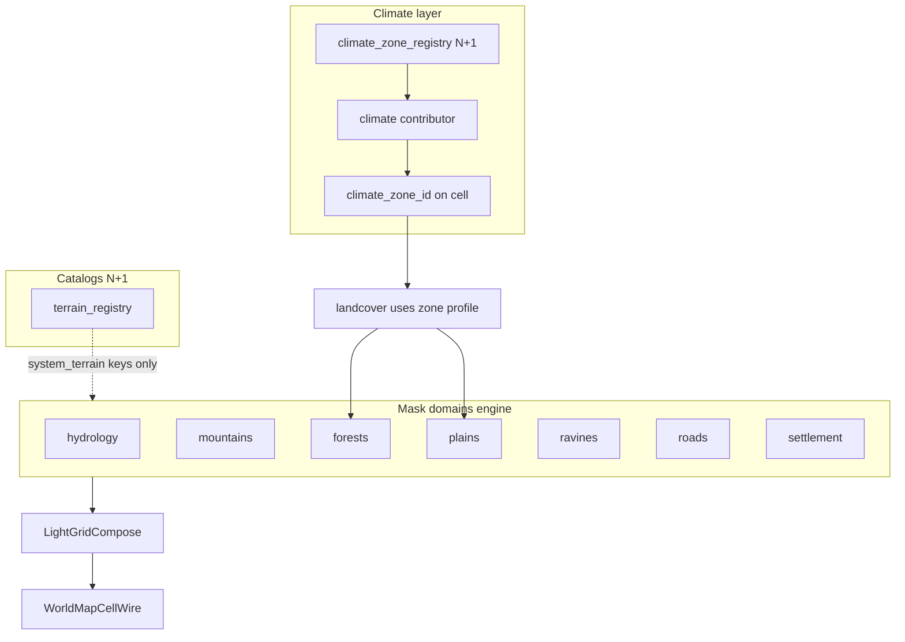
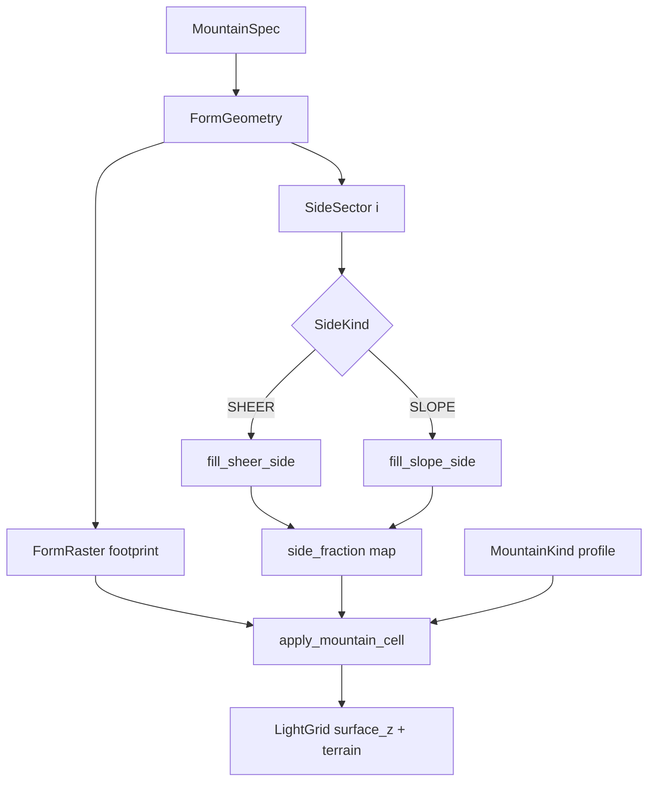
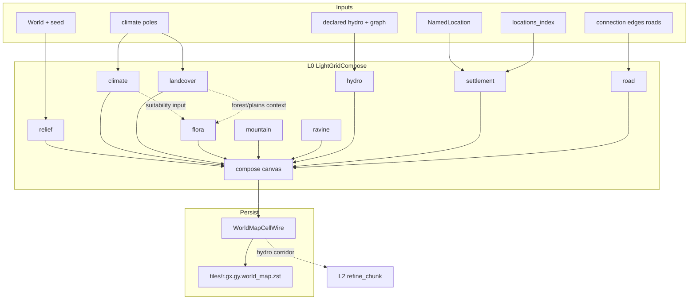

# Map Light Bake (L0 compose)

## Назначение

Зафиксировать **целевую архитектуру и контракты** materialize **light world map** (LOD L0): единый light-grid canvas, contributors по доменам, persist только через `WorldMapCellWire` → `world_map.zst`.

**Продуктовый контекст:** Идея 1 (light bake для корректной world map) и pipeline L0 — [`tz_world_pack_storage.md`](./tz_world_pack_storage.md) § LOD bake / § **Bake modes**.  
**Compose один:** `light_bake` и `full_bake` используют **тот же** L0 canvas pipeline; отличается только **набор macro-tiles** (location tiles vs весь `world_bounds`). Оба — **только L0**; `detailed_bake` / entry — вне этого ТЗ (L2). Job boundaries — [`tz_world_pack_storage.md`](./tz_world_pack_storage.md) § Bake modes.

**Не в scope этого ТЗ:**

- L2 refine / wilderness chunks / location terrain blobs ([`tz_world_pack_storage.md`](./tz_world_pack_storage.md) § Идея 2, WP-13; **module layout** — § «L2 refine module layout»);
- Pack completeness classifier / resume (WP-28) — pack TZ;
- Patch Store / merge priority WP-20;
- DAG wiring;
- план имплементации агента (`.cursor/plans/`).

**Связь с storage TZ:** wire-поля light cell, `world_map_cells_per_tile`, pins/`locations_index` уже описаны в pack storage. Этот документ закрепляет **как** наполнять L0 (compose), а не формат zstd.

---

## Целевое состояние

### Инвариант

На время light bake существует **один** in-memory canvas light cells. Все объекты world map (рельеф, леса/биом, гидро, поселения, climate tint) **укладываются на этот canvas**.  
`WorldMapBakeOrchestrator` **не** семплит hydro / z / pins в обход compose.

### Что не является write-path маски L0

| Слой | Роль |
|---|---|
| `SurfaceTerrainContext.coarse_hydro` | planning / L2; **не** SoT L0 mask |
| `sparse_meter_hydro` / meter carve | fine / L2; **не** write-path L0 |
| Один sample на macro `(gx, gy)` на весь tile | **запрещённый** антипаттерн |

### Extensibility

«Маска» = **общая light-grid raster**, не только гидрология. Новые объекты карты (горы, леса, города/footprints, дороги later) = новый **contributor** в тот же compose, без нового blob-формата и без второго bake pipeline.

---

## Слои и модули (код)

Целевой layout (имена — контракт ответственности):

```text
application/worldData/pack/bake/lightGrid/
  coords.py
  cell.py
  compose.py
  bakeContext.py
  contributor.py
  bake.py
  contributors/
    relief.py
    climate.py
    landcover.py
    ravine.py
    hydro.py
    settlement.py
    road.py

pack/bake/worldMapBakeOrchestrator.py   # thin: compose → writer
```

| Модуль | Делает | Не делает |
|---|---|---|
| `lightGrid/` contributors | наполняют compose | HTTP, SQLite, LLM, L2 carve |
| `landcover` | biome / mountain из climate+relief | z-band stub |
| `ravine` / `road` | овраг / дорога на `system_terrain` | L2 carve / city streets |
| `hydro` contributor | light-rasterize hydro mask | fine bed / column fill |
| `settlement` contributor | pin (+ footprint later) на light cells | `SettlementLayout` / CitySkeleton materialize |
| `WorldMapBakeOrchestrator` | `to_wire` + `write_world_map_tile` | собственный семпл hydro/z |
| `SurfaceTerrainContext` | L2 / fine planning, climate helpers | SoT записи L0 wire |

Каталог: **`pack/bake/lightGrid/`** (утверждено).

---

## Координаты (контракт)

```text
tile_m  = map_cell_size_m
side    = 32                         # WP-10 v2: константа маски (POJO)
light_m = tile_m // side             # масштаб light-cell; плывёт с tile мира

# Абсолютный light index:
lx = floor(xm / light_m)
ly = floor(ym / light_m)

# Macro-tile + local:
gx = lx // side,  gy = ly // side
tx = lx %  side,  ty = ly %  side
```

| Ключ | Назначение |
|---|---|
| Canvas key | `(gx, gy, tx, ty)` (или absolute `(lx, ly)` + view по tile — эквивалент) |
| Bresenham / rasterize hydro | **light indices**, не meters и не macro `(gx, gy)` |
| Центр light cell (climate sample) | `(xm + light_m/2, ym + light_m/2)` |

Cross-ref: [`tz_world_pack_storage.md`](./tz_world_pack_storage.md) § WP-10 v2. `side` — только через POJO [`WorldMapCellsPerTilePolicy`](../backend/app/dataModel/worldPack/worldMapCellsPerTile.py) (default **32**); **не** литерал в bake и **не** ∝-формула от `map_cell_size_m`.

### World mosaic / ASCII frame (утверждено 2026-07-19)

**Форма мира** = `world_bounds` (AABB квадрат/прямоугольник) — [`tz_terrain_generation.md`](./tz_terrain_generation.md) § Охват мира.

| Правило | Норматив |
|---|---|
| Frame SoT | Когда `world_bounds` declared (или resolved v1 AABB) — mosaic/ASCII **предпочтительно** рисует **весь** этот прямоугольник |
| Пустые клетки | ещё не baked (`unmapped` / space) — **не** «обрезка» и не другая форма мира |
| Запрещено (семантика) | считать AABB только запечённых macro-tiles формой мира (smoke `max_tiles` / sparse light) |
| Fill | `light_bake` (location tiles) → `full_bake` (весь `world_bounds`) — [`tz_world_pack_storage.md`](./tz_world_pack_storage.md) § Bake modes |


Impl note: pack ASCII default = **light-mask mosaic** (WP-10); frame от `world_bounds` / pin AABB+padding (MLB-12 ✅). `render_macro` — debug-only, не default `world-map.txt`.

---

## Связь с dataModel (SoT) — утверждено

Правило проекта [`dataModel-no-hardcode`](../.cursor/rules/dataModel-no-hardcode.mdc): **Pydantic в `dataModel/` — единственный контракт** полей, defaults, wire-ключей и enum. Compose/application — тонкий staging и алгоритмы.

### Таблица SoT ↔ bake

| Контракт bake | dataModel SoT | Правило |
|---|---|---|
| Persist light cell / `to_wire_tile` | [`WorldMapCellWire`](../backend/app/dataModel/worldPack/worldMapCellWire.py) | Имена полей, defaults, validators — только отсюда |
| `hydrology_role` / `hydrology_width` | [`WorldMapHydrologyRole`](../backend/app/dataModel/worldPack/hydrologyMaskWire.py), [`HydrologyMaskWire`](../backend/app/dataModel/worldPack/hydrologyMaskWire.py) | Width clamp / `from_wire` — в POJO; merge priority ролей — **метод/helper на enum или POJO**, не `_PRIORITY = {…}` в contributor |
| Pin index / index file | [`LocationsIndexWire`](../backend/app/dataModel/worldPack/locationsIndexWire.py), [`LocationsIndexPin`](../backend/app/dataModel/worldPack/locationsIndexWire.py) | `location_pin` = index в `locations_index.locations[]` |
| `side` / WP-10 v2 | [`WorldMapCellsPerTilePolicy`](../backend/app/dataModel/worldPack/worldMapCellsPerTile.py) | default **32**; optional master override; `light_m = tile_m // side` |
| Bake caps (max tiles, …) | [`PackBakeDefaults`](../backend/app/dataModel/worldPack/packBakeDefaults.py) | Не дублировать в orchestrator |
| Terrain mask domains (enabled / declare / autoresolve) | target `WorldTerrainMasks` (+ existing [`WorldHydrology`](../backend/app/dataModel/hydrology/worldHydrology.py)) | § **Surface mask domains**; `DefaultOnWire`→DB; `IgnoreOnWire` overrides |
| Bake knobs (interim) | [`LightLandcoverPolicy`](../backend/app/dataModel/worldPack/lightLandcoverPolicy.py), [`LightRavinePolicy`](../backend/app/dataModel/worldPack/lightRavinePolicy.py), [`LightRoadPaintPolicy`](../backend/app/dataModel/worldPack/lightRoadPaintPolicy.py) | tech debt → fold under `terrain_masks`; гора не из z-band |
| Declared river/coast path | `dataModel.hydrology` (`DeclaredRiver`, `DeclaredCoastline`, …) | Load через существующие POJO → light rasterize |
| Fine role mapping (L2 constraint) | `WorldMapHydrologyRole.to_fine_role` → [`HydrologyCellRole`](../backend/app/dataModel/hydrology/enums/hydrologyCellRole.py) | Не параллельная таблица в pack/bake |

### Staging vs POJO

| Тип | Слой | Может ли быть SoT? |
|---|---|---|
| `WorldMapCellWire` | `dataModel` | **да** — persist/wire |
| `LightGridCell` | `application/.../bake/light` | **нет** — mutable mirror полей wire на время bake |
| `LightGridCompose` / contributors | application | **нет** — оркестрация; читают typed API POJO |

**Запрещено:**

- параллельный dict defaults в contributor (`"plains"`, `role=2`, `width=15`) если то же на Field/validator POJO;
- новое поле на light cell **сначала** в compose, **потом** в wire — только наоборот: расширить `WorldMapCellWire` (+ `HydrologyMaskWire` при hydro), затем staging;
- второй wire-схемы «LightMaskWire» рядом с `WorldMapCellWire`.

**Обязательно при изменении контракта light cell:** PR трогает `dataModel/worldPack/*` **в том же изменении**, что и compose/orchestrator.

---

## Surface mask domains — единая политика (утверждено 2026-07-16)

Одна логика для **всех** доменов маски L0 (гидрология + terrain-типы + дороги). Паттерн как у hydrology U8/U10; wire policy — [`tz_json_validation.md`](./tz_json_validation.md) § Field policy / `annotationPolicy`.

### Mask domain vs climate / biome vs terrain_registry (утверждено 2026-07-17)

Три разных слоя — **не** смешивать при росте карты:

| Слой | Примеры | SoT | Как растёт |
|---|---|---|---|
| **Climate / biome** | `tundra`, `volcanic`, `temperate`, `arid`… | `ClimateZone` builtins + N+1 `climate_zone_registry` | мастер: новая zone + defaults |
| **Terrain catalog** | `plains`, `forest`, `mountain`, `liquid_body`, optional `swamp`… | N+1 `terrain_registry` | ключ в каталоге **≠** включённая маска |
| **Mask domain** | hydrology, mountains, forests, plains, ravines, roads, settlement | engine: `MaskDomainId` + policy + declare Spec | **только PR движка** |

**Инвариант:** `terrain_registry` / `climate_zone_registry` растут N+1; **домен маски** — как `FloraKind` / `MountainKind`: новый id = PR dataModel + contributor, не JSON мастера.

**Не** mask domain: добавление `swamp` / `volcanic` в registry; новые climate zones; flora type refs ([`tz_flora.md`](./tz_flora.md)); L2 city layout (на L0 settlement = pin/footprint).

Mapping biome → preferred landcover terrain — **policy / climate profile**, не новый `MaskDomainId`.



**Fixed (2026-07-17):** landcover больше не пишет `tundra` как `system_terrain`. Cold zone → `climate_zone_id`; landcover = forest|plains по rainfall.

### Инварианты (все домены)

| # | Правило |
|---|---|
| 1 | **`enabled` default = true** — домен работает, пока мастер явно не поставил `enabled: false` |
| 2 | Пустой declare / нет NamedLocation **≠** выключено; autoresolve всё равно materialize |
| 3 | **`DefaultOnWire` + `Field(default)`** на мировых knobs → **normalize пишет в БД**; generate **только читает** строку мира |
| 4 | Опциональные override / «ignore»-куски — **`IgnoreOnWire`**: ключа нет → не автозаполняем; runtime → default из БД |
| 5 | **Declare** (optional) + **autoresolve** (default) + **opt-out** (`enabled: false`) — три режима на каждый домен |
| 6 | Declare **не перезаписывается** global autoresolve (как реки U27) |
| 7 | `terrain_registry` = каталог ключей (`mountain`, `forest`…); **включение маски** = policy `enabled`, не «ключ есть в registry» |
| 8 | Новый mask domain = PR: `MaskDomainId` + merge/phase slot + policy/declare POJO + contributor — **не** свободный plugin из world JSON |

### Корни JSON (не один mega-blob)

| Корень | Домены | Статус |
|---|---|---|
| `world.hydrology` | реки / озёра / моря / shore / landforms hydro | уже есть (`WorldHydrology`) |
| `world.terrain_masks` | mountains / forests / plains / ravines / roads | **норматив этого §** |
| structure graph (`connection_*`) + policy enable | road | enable в `terrain_masks.default_roads`; geometry — edges |

Не дублировать hydro-флаги вторым деревом: light bake **читает** `world.hydrology.*`. Terrain-типы — отдельный корень с **той же формой category policy**. Не mega-dict доменов: typed fields `default_*` / `declared_*`.

### Шаблон MaskDomain (единственный способ роста)

```text
MaskDomain (engine):
  id: MaskDomainId              # StrEnum — dataModel/masks/enums/maskDomainId.py
  writes: WireFieldSet          # system_terrain | hydrology_* | location_pin | surface_z delta…
  policy: CategoryPolicy        # enabled + autoresolve + knobs (DefaultOnWire)
  declared: list[DomainSpec]    # подход A; typed per domain
  merge: MergeRule              # system_terrain → rank; hydro → role priority; settlement → pin
  materialize: declare ∪ autoresolve → Spec(s) → raster/paint
```

```text
CategoryPolicy:
  enabled: DefaultOnWire[bool] = True
  # knobs — DefaultOnWire → DB
  # optional IgnoreOnWire overlays

# на корне (подход A — как hydrology.declared_*):
declared_*[]    # полные typed Spec
default_<name>  # CategoryPolicy + autoresolve knobs
```

Цепочка resolve:

```text
IgnoreOnWire override (если ключ был в JSON)
  → иначе default-поле мира (материализовано в БД)
    → Field(default) POJO только на normalize-on-import
```

**Запрещено:** generator подставляет `enabled=True` / knobs мимо строки мира после import.  
**Запрещено:** score→paint в contributor в обход Spec (горы — stub до engine).

#### Checklist: новый mask domain (PR)

1. `MaskDomainId` member + slot в `TERRAIN_MERGE_RANK_HIGH_TO_LOW` / `COMPOSE_CONTRIBUTOR_ORDER` (+ `LightContributorId` + factory)
2. Typed `*CategoryPolicy` + `declared_*[]` / Spec POJO на корне (`terrain_masks` или `hydrology`)
3. Contributor в `lightGrid/contributors/` — thin: `category_enabled` → materialize → shared paint
4. Запись в compose contributor registry / `DEFAULT_CONTRIBUTORS` в **нужной phase**, не «в конец наугад»
5. Shared writers only: `may_paint_terrain` / `paint_system_terrain(_cell)` для terrain; hydro — свой role merge
6. Unit: enabled gate + merge rank vs соседний домен; light/full = один pipeline (`ctx.tiles` only)

`light_bake` / `full_bake` — **один** compose; отличается только набор macro-tiles (location tiles vs весь `world_bounds`).

### Declare = Spec в домене; Location — поверх (утверждено 2026-07-16)

**Подход A** (как `world.hydrology.declared_rivers|lakes|…`):

| Правило | |
|---|---|
| SoT declare маски | `terrain_masks.declared_*[]` — **полный** typed entry (Spec / geometry), не disk от location |
| `NamedLocation` | **опционально поверх** объекта маски (имя, якорь сцены, «храм на горе») |
| Location → mask | **запрещено** как declare-path: geographic.mountain/peak/plain **не** рисует маску сам |
| Пустой `declared_*` | ≠ off; autoresolve materialize Specs без имён |
| Optional link | declare entry может иметь `location_uid` (имя), но геометрия живёт в declare Spec |

```text
# правильно
terrain_masks.declared_mountains[] → MountainSpec / RangeSpec → engine → mask
NamedLocation(temple) / NamedLocation(peak name) → поверх / optional link

# запрещено как declare маски
NamedLocation(geographic.mountain) → disk paint  # interim; убрать
```

То же для **всех** поддоменов `terrain_masks` (не только горы).

### Домены terrain_masks (target)

| Поддомен | `system_terrain` | Declare SoT (`declared_*[]`) | Autoresolve (enabled, даже без declare) |
|---|---|---|---|
| **mountains** | `mountain` (+ summit по kind) | `declared_mountains[]`: `MountainSpec` \| `MountainRangeSpec` | placement → Spec → § Mountain engine |
| **forests** | `forest` | `declared_forests[]`: `ForestSpec` | region + [`tz_flora`](./tz_flora.md) → paint forest |
| **plains** | `plains` | `declared_plains[]`: `PlainSpec` (region footprint) | фон суши, где нет выше по rank |
| **ravines** | `ravine` | `declared_ravines[]`: `RavineSpec` (path / polygon) | депрессии → RavineSpec |
| **roads** | `road` | geometry = structure edges; enable в `default_roads` | без edges маска пуста; `enabled: false` запрещает paint |

Каждый `*Spec` — POJO домена (поля footprint/knobs свои); materialize → общий merge/paint.  
Defaults kind/form/… для гор — в `MountainsCategoryPolicy`, не в location.

#### Forest mask → flora (не дублировать домен)

**Лес в light bake** = footprint + `system_terrain=forest` + **per-cell ссылки на типы** flora.  
**Вес, occupancy, инстансы, FloraGenerator, FloraSuitabilityIndex** — [`tz_flora.md`](./tz_flora.md) § Climate suitability / FL3b–FL3c.

**Два правила мира (утверждено):**

| Gate | Смысл | SoT |
|---|---|---|
| **A** | мир **хочет** класс forest | `terrain_masks.default_forests.forest_min_rainfall` (+ enable / declare) |
| **B** | в климате клетки есть eligible **trees** | `FloraSuitabilityIndex.query` ← `tree_registry` ∩ `FloraClimateSuitability` |

`paint forest` = **A ∧ B**. Если A прошло, а B=∅ (все деревья требуют другой rainfall/temp) → **не** красить `forest` (fallback plains), warn в generation log. Запрещены: лес без деревьев, builtin-вид, свой скан реестра в landcover.

**Stub (2026-07-17):** flora index **отложен**; сейчас paint только по A. Target после flora: A∧B + type refs.

| Bake | Mask | Flora на cell |
|---|---|---|
| **light_bake** | footprint → `forest` **только A∧B** | **type refs** (`system_tree` / …) из index — later; stub = terrain only по A |
| **full_bake** | — | chunk flora layer — later (flora TZ) |

Target: forest/landcover зовут **тот же** index + FloraGenerator; списков видов в contributor нет.

**Гидрология** — тот же паттерн A, уже в `world.hydrology` (`declared_*`).

**Гора = поддомен общего `terrain_masks`, не отдельный bake.**  
`MountainKind` / Form / Sides / Range — **алгоритм materialize внутри** `default_mountains` + entries из `declared_mountains[]`.  
Те же: `enabled` / declare / autoresolve / `IgnoreOnWire` / merge rank / `paint_system_terrain`.  
Запрещено: параллельный «mountain pipeline» мимо `WorldTerrainMasks` / `MaskCategoryPolicy`.

### Mountain (engine) — kind / form / sides / range + elevation (утверждено 2026-07-16)

**Гора** — составной engine-объект (не N+1), materialize **поддомена** `terrain_masks`.  
Оси: **kind** (наполнение), **form** (силуэт footprint), **sides** (склоны).  
Отдельно: **горный хребет / range** — протяжённая **система** гор (не одна точка).

```text
# gate + declare — общий домен (подход A)
world.terrain_masks.enabled
world.terrain_masks.default_mountains     # MountainsCategoryPolicy ⊂ MaskCategoryPolicy
world.terrain_masks.declared_mountains[]  # MountainSpec | MountainRangeSpec (полные)

# если category_enabled(default_mountains):
#   declared Specs (не затираются autoresolve)
#   + autoresolve Specs  (ниже)
#   → FormGeometry → FormRaster → SideFill → KindElevation
#   → paint через общий terrain merge (rank mountain)
# NamedLocation — optional поверх (имя пика, храм на горе, …)
```

#### Autoresolve (A + D) — утверждено 2026-07-16

**A:** placement → собрать Spec → **тот же** engine, что declare.  
Запрещён bypass `score → paint` без Spec (M8).

**D** (частный случай A — двухфазный placement):

```text
1. Ridge field (policy knobs: threshold, ridge_cell_m, elev/relief weights)
     → MountainRangeSpec (spine + width + kind/form defaults)
2. Sample peaks along spine
     → MountainSpec[] (origin, radius_m, kind/form/sides from policy defaults)
3. Optional isolated peak candidates (тот же score → MountainSpec)
4. Все Specs → FormGeometry → FormRaster → SideFill → KindElevation → merge
```

| Слой | Ответственность | Knobs |
|---|---|---|
| **Placement** | *где* candidate / spine | `threshold`, `elevation_bias_weight`, `relief_weight`, `ridge_cell_m` |
| **Spec assemble** | *какой* объект | `default_kind`, `default_form`, default sides, `default_radius_m` |
| **Engine** | *как* нарисовать | Kind / Form / Sides pipeline |

`declare_radius_light` (disk от location) — **убрать**; радиус = `MountainSpec.radius_m` / policy `default_radius_m`.  
Declare Specs ∩ autoresolve: declare побеждает / не перезаписывается (domain #6).

#### Иерархия абстракций

```text
MountainKind (Enum + profile)
MountainForm  = MountainFormBySides | StarForm | PeakForm | PlateauForm | …
MountainFormBySides { side_count: int >= 3 }                    # контракт 1
StarForm { rays: int >= 3, inner_ratio: float }                  # контракт 2
PeakForm { side_count: int >= 3 }
PlateauForm { side_count: int >= 3, hat_fraction: float }        # hat ∈ (0,1]
MountainSideKind / MountainSideSpec
MountainSpec  # kind + form: MountainForm + sides[]
MountainRangeSpec
```

```text
# form — sum type, не {side_count, geometry}
MountainFormBySides(side_count=6)
StarForm(rays=5)

MountainRangeSpec
  spine / width
  kind_default
  form_default: MountainForm
  peaks: list[MountainSpec]

MountainsCategoryPolicy
  enabled / autoresolve
  default_kind
  default_form: MountainForm
```

#### Engine kinds (builtin)

| Kind | Смысл | Summit / состав (profile) |
|---|---|---|
| `ROCKY` | каменистая гора | камень / mountain |
| `ICE_PEAK` | основа + лёд/снег наверху | cap snow/ice |
| `VOLCANO` | вулкан | crater; внутри **magma** (L2) |
| `PLATEAU` | плато на вершине | **plains** на summit |
| `FORESTED` | гора с лесами | низкий rise; forest на склонах |

#### Engine forms (два контракта, не плоский `{side_count, geometry}`)

**Неверно:** одно POJO с полями `side_count` + `geometry` рядом.  
**Верно:** два **разных** контракта формы (sum type / discriminated union):

```text
MountainForm  =
  | MountainFormBySides      # контракт 1: произвольная форма по числу сторон
  | MountainFormGeometryObj  # контракт 2: объект геометрии (Star, Peak, …)
```

**Контракт 1 — стороны**

```text
MountainFormBySides
  side_count: int    # >= 3; произвольный контур / N-угольник
```

Только число сторон; геометрия «по умолчанию» = простой контур на N гранях (engine raster for BySides).

**Контракт 2 — объект геометрии**

```text
MountainFormGeometryObj   # engine tagged union
  | StarForm     { rays: int >= 3, inner_ratio: float }   # лучи/стороны внутри Star
  | PeakForm     { side_count: int >= 3 }                 # острый выпуклый N-gon
  | PlateauForm  { side_count: int >= 3, hat_fraction: float }  # широкий контур + доля плоской шляпки
  | …                                                     # новые geometry objects = PR движка
```

| Объект | Параметры внутри объекта (SoT) |
|---|---|
| `StarForm` | `rays` (≥3); `inner_ratio` (R_inner/R_outer; default в POJO) — **не** внешнее `side_count` |
| `PeakForm` | `side_count` (≥3; default часто 3) — выпуклый острый N-gon |
| `PlateauForm` | `side_count` (≥3); `hat_fraction` ∈ (0,1] — доля радиуса плоской вершины (footprint hat); kind `PLATEAU` усиливает материал вершины |

```text
# OK
MountainForm = StarForm(rays=5)
MountainForm = MountainFormBySides(side_count=6)

# FORBIDDEN как контракт формы
MountainFormSpec(side_count=5, geometry=STAR)   # side_count снаружи Star
```

Resolve сторон для `MountainSpec.sides`:

```text
side_count =
  match form
    BySides(n)              → n
    StarForm(rays)          → rays
    PeakForm(side_count)    → side_count
    PlateauForm(side_count) → side_count
len(sides) == side_count
```

Form ⊥ kind: `ICE_PEAK` + `StarForm(rays=5)`, `ROCKY` + `BySides(4)`, …

#### Целевая архитектура apply (не slice)

Один pipeline для одиночной горы и для peak внутри range. Contributor — тонкий caller; вся геометрия в engine-модулях.

```text
MountainSpec | (RangeSpec + peak)
        │
        ▼
┌───────────────────────────────┐
│ 1. FormGeometry               │  vertices + closed polygon + SideSector[]
│    construct_mountain_form()  │  (метры; без light grid)
└───────────────┬───────────────┘
                ▼
┌───────────────────────────────┐
│ 2. FormRaster                 │  polygon → light cells (footprint mask)
│    raster_form_footprint()    │  Pineda (convex) / winding (concave/star)
└───────────────┬───────────────┘
                ▼
┌───────────────────────────────┐
│ 3. SideFill (per side)        │  profile(t) → height fraction на секторе
│    fill_sheer_side |          │  SHEER ≠ SLOPE = разные алгоритмы
│    fill_slope_side            │
└───────────────┬───────────────┘
                ▼
┌───────────────────────────────┐
│ 4. KindElevation + material   │  rise from kind×z_max; summit overlays
│    apply_mountain_cell()      │  z = base + rise * side_fraction
└───────────────────────────────┘
```

| Слой | Ответственность | Не делает |
|---|---|---|
| **FormGeometry** | вершины, рёбра, `SideSector[]` из form | z, soft/hard, terrain id |
| **FormRaster** | occupancy footprint на light grid | профили склонов |
| **SideFill** | `fraction∈[0,1]` по алгоритму стороны | выбор form, kind material |
| **KindElevation** | `rise`, clamp `z_min..z_max`, summit/terrain | геометрия силуэта |
| **Contributor** | scope, policy, вызов pipeline, merge | polygon math, profile math |

Range: spine corridor = тот же SideFill вдоль нормали к spine; peaks = полный pipeline на якорях.



#### FormGeometry + FormRaster (алгоритмы SoT)

```text
MountainFormGeometry
  vertices_m: list[(x,y)]      # замкнутый контур
  sectors: list[SideSector]    # ровно N сторон

SideSector
  index: int
  edge: ((x0,y0),(x1,y1))      # внешнее ребро стороны
  wedge_poly: list[(x,y)]      # сектор: origin → edge
  outward_n: (nx,ny)           # нормаль ребра наружу
```

**Construct (метры):**

| Form | Алгоритм вершин |
|---|---|
| `MountainFormBySides(n)` | правильный N-gon: `(R·cos(2πi/n+φ), R·sin(…))` |
| `StarForm(rays, inner_ratio)` | **isotoxal star**: `2·rays` вершин, чередование `R_outer=R` и `R_inner=R·inner_ratio`; `sides[]` length = `rays` |
| `PeakForm(side_count)` | правильный N-gon (тот же construct, что BySides); семантика «пик» — острый default N + KindElevation |
| `PlateauForm(side_count, hat_fraction)` | внешний N-gon радиуса R + внутренний hat-контур радиуса `R·hat_fraction` (плоская зона вершины для SideFill/elevation) |

**Raster (light cells):** центр клетки ∈ полигон:

| Полигон | Тест |
|---|---|
| выпуклый (`BySides`, plateau, peak) | **Pineda edge functions** |
| вогнутый / star | **winding number** (nonzero; Sunday) |

```text
construct_mountain_form(form, origin_m, radius_m) → MountainFormGeometry
raster_form_footprint(geometry, scale) → set[LightCell]
resolve_mountain_form(form, origin_m, radius_m, scale)
  → (geometry, footprint_cells)
```

| # | Инвариант form |
|---|---|
| R1 | Contributor зовёт facade `resolve_mountain_form` (+ sides/elevation apply) |
| R2 | Новая geometry = variant + construct/raster; не ветка в contributor |
| R3 | `StarForm`: лучи только `form.rays` |
| R4 | Выход = geometry + footprint → вход SideFill |

#### SideFill — отдельные алгоритмы на сторону (SoT)

Число сторон = из form; `len(sides) == N`.  
Мягкость **не** параметр form и **не** свойство горы целиком.

```text
t(p) = clamp( dist_along_outward(p, sector) / sector_width , 0, 1)
side_fraction(p) = profile_side(side, t(p))   # ∈ [0,1]
z(p) = base_z(p) + rise(kind) * side_fraction(p)  # clamp z_min..z_max
```

| `MountainSideKind` | Алгоритм `profile(t)` | Смысл |
|---|---|---|
| `SHEER` | **step**: `1` при `t < 1−ε`, иначе `0` | жёсткий обрыв |
| `SLOPE` | **smooth falloff**: default `1 − smoothstep(0,1,t)`; optional `(1−t)^k` | мягкий склон |

#### POJO defaults (SoT; рекомендация утверждена)

| Поле | Default |
|---|---|
| `MountainsCategoryPolicy.default_kind` | `ROCKY` |
| `default_form` | `MountainFormBySides(side_count=6)` |
| `default_side_kind` (все стороны, если не заданы) | `SLOPE` |
| `default_radius_m` | `500` |
| `StarForm.rays` | `5` |
| `StarForm.inner_ratio` | `0.45` |
| `PeakForm.side_count` | `3` |
| `PlateauForm.side_count` | `6` |
| `PlateauForm.hat_fraction` | `0.45` |
| `SHEER.sheer_band_light` (ε в light cells) | `1` |
| `SLOPE` profile | `smoothstep` (не power) |
| `SLOPE.k` (если profile=`power`) | `2.0` |
| Kind `rise_fraction_of_z_max` | ROCKY `0.35`, ICE_PEAK `0.45`, VOLCANO `0.40`, PLATEAU `0.25`, FORESTED `0.20` |

Все defaults — `DefaultOnWire` / field default на POJO; generate только читает мир.

```text
fill_sheer_side(sector, cells, side) → {(cell, fraction)}
fill_slope_side(sector, cells, side) → {(cell, fraction)}

apply_mountain_sides(geometry, sides[], footprint, kind, z_min, z_max, relief_z)
  for each side i:
    match sides[i].kind → fill_* → merge fractions (sector ownership)
  apply_mountain_cell(... z = base + rise * fraction ...)
```

**Ownership клетки (утверждено: B — nearest edge):**

```text
side_index(p) = argmin_i dist(p, edge_i)   # tie-break: меньший i
t(p), profile — только у sides[side_index]
# запрещено: max(fraction) across sides (SHEER забивает SLOPE)
# запрещено: blend нескольких сторон
```

Plateau hat (`R·hat_fraction`): внутри hat → `fraction = 1` (плоскость), ownership сторон не применяется; снаружи hat → до внешнего контура — B + SideFill.

Один writer на клетку внутри одной `MountainSpec`.  
Новый side-algorithm = новый `MountainSideKind` + `fill_*` (PR движка).

**L0 / L2 — уровни детализации одного контракта, не v1/v2 архитектуры:**

| | L0 (light bake) | L2 (fine) |
|---|---|---|
| FormGeometry / sectors | те же | те же |
| SideFill profile | пишет `surface_z` (+ band) | тот же profile → меш/нормали/3D склон |
| Kind material | `system_terrain` / summit | детализация cap/crater |

#### Горный хребет (range) — тот же pipeline

| | Одиночная гора (`MountainSpec`) | Хребет (`MountainRangeSpec`) |
|---|---|---|
| Протяжённость | компактный footprint | **длина вдоль spine ≫ ширины** |
| Геометрия | FormGeometry | polyline spine + width; `t` = dist to spine / half-width |
| Стороны | `sides[]` на peak form | **2 латерали** (left/right) = SideFill; **optional 2 торца** (start/end) |
| Состав | один kind/form/sides | тело хребта + optional peaks (полный MountainSpec) |
| Declare / autoresolve | peak / isolated | massif / elongated ridge |

```text
# Range sides (утверждено с defaults)
MountainRangeSpec.sides:
  left, right            # обязательны; default SLOPE
  start?, end?           # optional торцы; default SHEER если заданы, иначе открытый хребет
half_width_m: default = default_radius_m  # или отдельное поле policy
```

Ownership на corridor: nearest к left vs right boundary (B); торцы — nearest к end-cap edge, если есть.  
Хребет ≠ значение `MountainForm`. Range = агрегат.

#### Инварианты

| # | Правило |
|---|---|
| M0 | Маска горы проходит **только** через общий домен `terrain_masks` (`MountainsCategoryPolicy`); engine ≠ отдельный корень/bake |
| M0b | Declare = `declared_mountains[]` полные Spec (подход A); `NamedLocation` поверх объекта, не declare-path маски |
| M0c | Autoresolve = A+D: placement → Spec/Range → engine; запрещён score→paint; D = Range + peaks along spine |
| M0d | Ownership клетки = nearest edge (B); не max-fraction / не blend; hat Plateau — fraction=1 внутри |
| M0e | Numeric defaults — таблица POJO defaults (§ SideFill); Range = left/right + optional end caps |
| M1 | Kind / form / side / range — **engine materialize** внутри domain; не N+1 |
| M2 | Нет строковых ветвлений в contributor — только enums / Spec |
| M3 | Form = sum type: `BySides` **или** geometry object; запрещён плоский `{side_count, geometry}` |
| M4 | Range ≠ Form; range = протяжённая система |
| M5 | Elevation по **kind**; mask без подъёма z — запрещена |
| M6 | Новый kind/geometry-object/side/range = PR движка |
| M7 | Мягкость края = **алгоритм SideFill** (`SHEER`/`SLOPE`), не свойство form/горы |
| M8 | Pipeline FormGeometry → FormRaster → SideFill → KindElevation — целевой; не mask-only slice |
| M9 | L0 и L2 потребляют **один** SideFill/Form контракт |

#### Elevation (kind; fraction — от SideFill)

```text
base_z = cell.surface_z          # после relief
rise   = round(z_max * kind.profile.rise_fraction_of_z_max)
z      = min(z_max, max(z_min, base_z + rise * side_fraction))
```

```text
resolve_mountain_z(base_z, z_min, z_max, kind, side_fraction) → int
apply_mountain_cell(..., MountainSpec | range context) → terrain(+summit) + surface_z
```

Writer: **mountain**. Relief — база.

### Merge `system_terrain` (приоритет writers)

При включённых доменах, одна light cell:

```text
road > ravine > mountain > forest > plains
```

| Поле | Merge |
|---|---|
| `surface_z` | relief → **mountain поднимает** (формула выше); later writers не понижают гору без своего контракта |
| `system_terrain` | как таблица приоритета |

(hydro пишет только `hydrology_*`, не затирает terrain; road/ravine **не** красят SEA/LAKE/RIVER.)

Climate contributor пишет только `climate_zone_id` — вход для forest/plains autoresolve, **не** writer горы.

### Tech debt

- ~~Interim LightLandcoverPolicy / mountain-from-z~~ — удалено.  
- **Open:** нет engine `MountainKind`/`Form`/`Sides` + elevation — § Mountain (engine); mountain contributor = stub (disk + score→paint).  
- **Open (2026-07-17):** coarse **relief_objects_z до hydrology** — § Coarse planning ↔ light compose; без этого procedural lakes/rivers на flat z.  
- ~~Debt: landcover `tundra` as terrain~~ — **fixed** (cold = climate_zone_id; landcover forest|plains).  
- **Stub:** flora type refs / FloraGenerator — [`tz_flora.md`](./tz_flora.md).  
- **Edge:** мир без `locations` → bake fail-closed — § Edge case (не silent empty pack).

### Hybrid C — MaskDomainId + merge SoT + contributor registry (утверждено 2026-07-17)

**dataModel SoT**

| Артефакт | Путь / роль |
|---|---|
| `MaskDomainId` | [`maskDomainId.py`](../backend/app/dataModel/masks/enums/maskDomainId.py) — engine enum доменов |
| `LightContributorId` | тот же модуль — `contributor.name` |
| `COMPOSE_CONTRIBUTOR_ORDER` | **единственный** SoT порядка compose |
| `TERRAIN_MERGE_RANK_HIGH_TO_LOW` | порядок доменов, пишущих `system_terrain` |
| `MASK_DOMAIN_CONTRIBUTOR` | domain → contributor id (forests+plains → landcover) |
| `WorldTerrainMasks.merge_rank_order()` | rank → ключи `system_terrain` из policy |
| Корни JSON | typed `default_*` / `declared_*` — не free-form domain map |

**Application**

| Артефакт | Роль |
|---|---|
| `build_default_contributors()` | factory map × `COMPOSE_CONTRIBUTOR_ORDER` → `DEFAULT_CONTRIBUTORS` |
| Contributors | `name = LightContributorId.*.value` |

**Compose phases** (порядок = `COMPOSE_CONTRIBUTOR_ORDER`):

| Phase | Contributors | MaskDomainId? |
|---|---|---|
| 1 Base | `relief` | — |
| 2 Context | `climate` | — |
| 3 Landcover | `landcover` | `FORESTS`, `PLAINS` |
| 4 Structural | `mountain` → `ravine` | `MOUNTAINS`, `RAVINES` |
| 5 Hydro | `hydro` | `HYDROLOGY` |
| 6 Culture | `settlement` → `road` | `SETTLEMENT`, `ROADS` |
| (later) Flora | type refs | — flora TZ |

**Shared paint**

| Shared | Ответственность |
|---|---|
| `may_paint_terrain` / merge | единственный gate `system_terrain` |
| `paint_system_terrain(_cell)` | единственный writer terrain |
| Domain materialize | Spec → cells (+ optional z / hydro side effects) |
| Contributor | оркестрация домена, не второй merge |

---

## Контракты типов

### `LightGridCell` (bake staging)

Mutable dataclass **до** persist. Поля **1:1** с wire SoT [`WorldMapCellWire`](../backend/app/dataModel/worldPack/worldMapCellWire.py) — отдельной persist-схемы «mask» нет. Defaults при `ensure` / `to_wire_tile` — из typed defaults/`model_construct` POJO, не локальные литералы.

| Поле | Тип | Слой-писатель |
|---|---|---|
| `surface_z` | int | relief (база); **mountain** (подъём ≤ `z_max`) |
| `system_terrain` | str \| None | landcover / mountain / ravine / road |
| `dominant_terrain_id` | int | landcover (если используется) |
| `hydrology_role` | `WorldMapHydrologyRole` | hydro |
| `hydrology_width` | int \| None | hydro |
| `climate_zone_id` | int \| None | climate |
| `location_pin` | int \| None | settlement |
| `system_tree` / `system_bush` / `system_grass` / `system_plant` (и т.п.) | str \| None | flora type refs — [`tz_flora`](./tz_flora.md); **только ключи registry**, не инстансы |

Wire/POJO SoT — § **Связь с dataModel** выше. Compose **не** дублирует defaults литералами в обход POJO.

### `LightGridCompose`

```text
LightGridCompose
  side: int
  tile_m: int
  light_m: int
  cells: sparse map (gx, gy, tx, ty) → LightGridCell

  ensure(gx, gy, tx, ty) → LightGridCell
  iter_tile(gx, gy) → (tx, ty, cell)*
  to_wire_tile(gx, gy) → list[WorldMapCellWire]
      # плотный side×side; отсутствующие keys → defaults wire
```

### `LightGridContributor` (protocol)

```text
name: str   # relief|climate|landcover|flora|mountain|ravine|hydro|settlement|road
apply(compose: LightGridCompose, ctx: LightGridBakeContext) → None
```

**Порядок вызова (target; каждый terrain/hydro contributor читает свой `enabled`):**

1. `relief` — `surface_z` (phase Base)
2. `climate` — `climate_zone_id` (**обязательно до landcover/flora**; phase Context — не MaskDomain)
3. `landcover` — plains/forest по climate **если** `terrain_masks.default_forests|plains.enabled` (не biome-as-terrain)
4. `flora` — type refs через FloraGenerator — **stub** / later ([`tz_flora`](./tz_flora.md))
5. `mountain` — declare + autoresolve; target: `system_terrain` **и** `surface_z` (§ Mountain elevation); **сейчас stub**
6. `ravine` — **если** `default_ravines.enabled`
7. `hydro` — `hydrology_*` Path A **если** `hydrology.enabled`
8. `settlement` — `location_pin`
9. `road` — **если** `default_roads.enabled`; не затирает SEA/LAKE/RIVER

Пустой declare при `enabled=true` → autoresolve всё равно materialize (кроме road: нужна geometry edges).  
Порядок = compose phases (§ Hybrid C); merge `system_terrain` = `TERRAIN_MERGE_RANK_HIGH_TO_LOW`.

### `LightGridBakeContext` (caller contract)

| Поле | Назначение |
|---|---|
| `world` | seed, `map_cell_size_m`, flags |
| `locations` | L1 anchors |
| `nodes` / `edges` | connection graph (hydro legs + **roads**) |
| `locations_index` | `LocationsIndexWire`; `location_pin` = **index** в `locations[]` |
| `tiles` | scope bake `list[(gx, gy)]` |
| `surface_planning` | optional `SurfaceTerrainContext` — read-only adjunct; **не** write-path L0 hydro |
| climate / pole accessors | для `climate` / `landcover` |

### Coarse planning ↔ light compose — порядок z (утверждено 2026-07-17)

**Проблема smoke:** light `mountain` красит `system_terrain=mountain` без подъёма z; hydrology на coarse видит почти плоский heightmap → peaks/basins/истоки пустые → нет procedural озёр/рек. Море живёт (edge flood), не через prominence.

**Два контура (не путать):**

```text
# A — SurfaceTerrainContext / coarse planning (до light compose)
run_surface_pass_coarse          # relief base surface_z
  → relief_objects_z             # mountain/ravine materialize z на coarse
                                 # (terrain_masks subdomain; KindElevation / carve;
                                 #  interim OK без полного Form→Star)
  → HydrologyGeneratorService    # Pass 1.5: detect + water carve на УЖЕ поднятом z
  → (gap / further planning)

# B — light compose (COMPOSE_CONTRIBUTOR_ORDER)
relief → climate → landcover → [flora] → mountain → ravine → hydro → settlement → road
```

| Правило | |
|---|---|
| **R1** | Relief objects (mountain / range / ravine) — **поддомен `terrain_masks`**, не отдельный корневой домен |
| **R2** | **Mask без z запрещён** (M5): materialize footprint → `surface_z` (+ terrain paint) |
| **R3** | Coarse **relief_objects_z до** `HydrologyGeneratorService.apply` — иначе detect peaks/basins/sources слепой |
| **R4** | Light mountain/ravine: paint + дожим z на light (или sample coarse); **не** единственный writer z для hydro planning |
| **R5** | Hydro water carve ≠ mountain elevation: hydro углубляет под воду; mountain **поднимает** под маской |
| **R5b** | Light hydro: paint SEA/LAKE/RIVER **и** bathymetry / bed `surface_z` (≤ `z_sea` для open water). Mask без понижения z на open water — **запрещён**. Relief light читает `coarse_relief_z` (pre-1.4); water z пишет **hydro**, не повторный full mountain rise. SoT форм дна океана: [`tz_terrain_hydrology.md`](./tz_terrain_hydrology.md) § **Ocean bathymetry / Depression forms** (U15 shelf + `DepressionSpec`; domain `default_seas`, не `terrain_masks`) |
| **R6** | detailed_bake: абсолютные prominence м (`MIN_*_PROMINENCE_M`) ок; **light/coarse:** отдельные пороги (relative / scale к span z) — не те же 25/50 на z∈−1…7 |

**Light hydro — норматив порядка (R5b):**

```text
1. paint hydrology_role (SEA / LAKE / RIVER)
2. apply bathymetry / bed z
     — sample post-hydro coarse_surface_z и/или
     — U15 bands + DepressionSpec (ocean) / river bed carve
3. запрещено: SEA на light с surface_z как у соседней plains
```

**Сейчас:**

| Слой | Статус |
|---|---|
| Pass 1.4 `relief_objects_z` + light `coarse_relief_z` | ✅ |
| Light mountain rise (interim) | ✅ |
| Light hydro R5b bathymetry stub | ✅ — `apply_coarse_open_water` → `resolve_open_water_surface_z` (`stub_drop_fraction_of_span` / coarse ≤ `z_sea`) |
| Full ocean DepressionForm (Ellipse/Corridor + Kind) | ⬜ — см. [`tz_terrain_hydrology.md`](./tz_terrain_hydrology.md) § Interim stub → target mapping |
| HY-BATH-1 | **partial** (stub floor; forms open) |

**Имплементация (порядок слоёв):**

1. Coarse mountain/ravine z (declare + autoresolve footprint → rise/carve, clamp `z_min..z_max`)
2. Hydrology на этом heightmap (+ light-scale detect thresholds) + ocean bathymetry (coarse carve / U15)
3. Light compose: relief from `coarse_relief_z` + mountain paint/z once; hydro paint **и** water z (R5b stub → later DepressionSpec)
4. Полный Mountain FormGeometry→SideFill→KindElevation / полный Depression Form pipeline — следующими слоями по своим ТЗ

### Edge case: мир без `locations` (зафиксировано 2026-07-17)

**Симптом:** import skeleton OK; `GET …/bootstrap-tiles` / pack bake → **422** `surface terrain context unavailable`.

**Причина (текущий контракт caller):**

```text
prepare_surface_terrain_context(world, locations)
  → pole resolve + run_surface_pass_coarse(world, locations, …)
  → locations == []  ⇒  coarse heightmap None  ⇒  context None  ⇒  fail-closed
```

Без хотя бы одной точки с координатами нет bbox / poles / bootstrap tile set.  
Compose **сам** не задаёт world bounds: tile plan и `SurfaceTerrainContext` — **вход** от locations (+ hydro declare привязан к якорям/edges).

| Что работает | Что нет |
|---|---|
| `POST /worlds/import` без секции `locations` | L0 light / full bake |
| registries, states, races, perks | `bootstrap-tiles`, `pack/bake` |
| | wilderness map «только из world JSON» без якорей |

**Статус:** **edge case / known gap** — не баг compose contributors.  
Fixture-пример: [`fixtures/world_test_gen_noloc.json`](../fixtures/world_test_gen_noloc.json).

**Не путать с:**

- пустой `declared_*` при `enabled=true` (autoresolve всё равно materialize) — это **другой** инвариант mask domain;
- `NamedLocation` ≠ declare-path маски (подход A) — здесь речь про **отсутствие любых** locations как planning input.

**Target (отложено, не в scope текущего light bake):** wilderness bake без locations — явные `world_bounds` / default pole / tile plan из scalars, не fail-closed на `[]`. До target: smoke L0 — fixture с geographic/poles (`world_terrain_test`) или минимальные якоря.

**Приёмка сейчас:** мир без locations → **предсказуемый** 422 (или эквивалент) с текстом context unavailable; не silent empty pack.

---

## Contributors (семантика)

| Contributor | Пишет | Источник (target) |
|---|---|---|
| **relief** | `surface_z` | per `(tx,ty)`; coarse + pole typical + noise |
| **climate** | `climate_zone_id` | pole (+ local) в центре light cell |
| **landcover** | `system_terrain` plains/forest | climate + `terrain_masks` forest/plains policy; **не** гора; **не** biome keys (`tundra`/`volcanic`) |
| **flora** | `system_tree` / bush / grass / plant | FloraGenerator ∩ climate (**после** climate + landcover); [`tz_flora`](./tz_flora.md) |
| **mountain** | `system_terrain=mountain` | declare + autoresolve (`default_mountains`); empty declare ≠ off |
| **ravine** | `system_terrain=ravine` | `default_ravines` + autoresolve; не затирает hydro |
| **hydro** | `hydrology_*` | `world.hydrology` Path A |
| **settlement** | `location_pin` | pin (+ footprint policy) |
| **road** | `system_terrain=road` | edges + `default_roads.enabled`; preserve water |

| Объект UI | Слой |
|---|---|
| Реки / море / озёра | hydro |
| Горы | **mountain** (не landcover) |
| Леса / равнина | landcover |
| Овраг | ravine |
| Дороги | road |
| Города / POI | settlement |

---

## Merge policy (одна light cell)

| Поле | Правило |
|---|---|
| `surface_z` | relief (база) → mountain поднимает по § Mountain elevation (≤ `z_max`) |
| `system_terrain` | road > ravine > mountain > forest > plains; hydro не затирает terrain; road/ravine не затирают SEA/LAKE/RIVER |
| `hydrology_*` | hydro; priority в dataModel |
| `location_pin` | settlement |
| `climate_zone_id` | climate |

---

## Data flow



> **Удалено (2026-07-16):** interim stub `surface_terrain_at_z` bands (`z==1→forest`, `z≥2→tundra`) как SoT L0 landcover.

Параллельно (вне write-path L0 mask):

```text
SurfaceTerrainContext → fine / L2 materialize, meter hydro side-products
```

---

## Hydro Path A (норматив)

1. Перевести declared polyline (метры) → light indices `(lx, ly)`.
2. Rasterize (`bresenham` / `rasterize_segments`) **на light grid**.
3. Проставить `hydrology_role` + optional `hydrology_width` (в light cells).
4. Море/озеро: connected component / fill **на light grid** (не meter carve).
5. Autoresolve coarse — тоже на light (ТЗ pack: «declared + autoresolve coarse»), не через полный fine `HydrologyGeneratorService.apply` как SoT маски.

**Запрещено:** писать в wire один `coarse_hydro[(gx,gy)]` на все `(tx,ty)` tile.

---

## Связь с L2

L0 compose → **wire на диске** (`world_map.zst`) — **чертёж** для Идеи 2.

L2 `refine_chunk` читает parent light **только** через `load_parent_light(gx, gy)`:

- SoT = baked `WorldMapCellWire` в pack blob;
- process-local cache после write/read — latency, не второй SoT; ключ `(world_uid, gx, gy)`;
- cold / другой process → disk.

Алгоритмические контракты refine (upsample / hard hydro corridor / z-band) — [`tz_world_pack_storage.md`](./tz_world_pack_storage.md) § **Parent light refine contracts** · WP-PERF-22.  
Числовые defaults — будущий POJO `ParentLightRefinePolicy` в `dataModel/worldPack/`, не литералы в generators.

Контракт согласованности: corridor `hydrology_role` / forms `surface_z`.  
Пустая hydro-маска на L0 = сломанный контракт world map и constraints L2.

**Антипаттерн:** refine из live `LightGridCompose` или из `SurfaceTerrainContext` в обход baked mask.

Приёмка согласованности карты и сцены (после кода WP-PERF-22): **MLB-8** — river/ridge L2 внутри L0 corridor / z-band (не отмечать done до имплементации).

---

## Логи и диагностика

Per-world generation log: `backend/logs/generation/{world_uid}/` ([`generationLogging`](../backend/app/core/generationLogging.py)).

Bake diagnostics (activity, без `L0`/`L2` в именах — см. pack storage § именование):

| Событие | Ожидание |
|---|---|
| `light_compose_start` / `done` | scope tiles, side, light_m |
| per-contributor summary | non-default cell counts (hydro roles hist, pins, z hist) |
| `world_map_tile_write` | hist из **wire после compose**, не macro-only |
| `world_map_bake_all_flat` | сигнал: compose/hydro не уложили маску |

---

## Приёмка (архитектурная)

| ID | Критерий |
|---|---|
| MLB-1 | Light bake пишет hydro/z/pins **только** через `LightGridCompose` |
| MLB-2 | `hydrology_role ≠ NONE` на light cells вдоль declared rivers (smoke `world_terrain_test`) — не all-NONE |
| MLB-3 | Нет write-path L0 из «один sample на macro tile на весь 32×32» |
| MLB-4 | `location_pin` согласован с `locations_index` indices |
| MLB-5 | `SurfaceTerrainContext` / meter hydro не являются SoT L0 mask |
| MLB-6 | ASCII/pack render world map показывает hydro + pins при валидном fixture (не all plains+NONE при declared rivers) |
| MLB-7 | Новые light-cell поля и hydro merge/defaults живут в `dataModel/worldPack` (+ hydrology enums); application только staging/compose |
| MLB-8 | L2 river/ridge внутри L0 corridor / z-band — unit ✅ (`test_parent_light_refine`); HTTP fixture smoke — backlog |
| MLB-9 | Единая policy всех mask-доменов (`WorldTerrainMasks` + hydrology) — ✅ unit (`test_terrain_masks`, `test_light_grid_compose`) |
| MLB-10 | Mountain domain declare+autoresolve; forest/plains без mountain-from-z — ✅ |
| MLB-11 | Мир **без** `locations`: bake/bootstrap **fail-closed** (422 context unavailable), не empty pack; wilderness-without-anchors — open (§ Edge case) |
| MLB-12 | World mosaic frame = `world_bounds` / resolved AABB; пустые клетки = unmapped внутри прямоугольника, не «кривая» форма мира | ✅ `PackMapGridRender` |

---

## Связанные документы

| Документ | Связь |
|---|---|
| [`tz_world_pack_storage.md`](./tz_world_pack_storage.md) | L0 wire, WP-10, Идея 1/2, WP-PERF-31 |
| [`tz_terrain_hydrology.md`](./tz_terrain_hydrology.md) | declared river/coast, fine roles; **Ocean bathymetry / Depression forms** (R5b) |
| [`tz_terrain_generation.md`](./tz_terrain_generation.md) | surface pass, coarse planning |
| [`tz_climate.md`](./tz_climate.md) | pole / zone sample |
| [`tz_city_generation.md`](./tz_city_generation.md) | L1 skeletons vs L2 layout |

---

## История

| Дата | Изменение |
|---|---|
| 2026-07-20 | Compose scope: light/full = L0 only; L2 = detailed/entry (pack storage Job boundaries) |
| 2026-07-14 | Первая фиксация: LightGridCompose, contributors, Path A hydro, границы vs SurfaceTerrainContext |
| 2026-07-14 | § **Связь с dataModel (SoT)** — таблица wire/POJO ↔ bake; staging ≠ SoT; MLB-7 |
| 2026-07-14 | Каталог кода: **`pack/bake/lightGrid/`** (утверждено) |
| 2026-07-15 | WP-10 v2: `side=32` константа; масштаб = `light_m`; grid builders — обязательный consumer |
| 2026-07-15 | § Связь с L2: Parent light SoT = disk + process cache; MLB-8 (post-code); cross-ref storage Идея 2 |
| 2026-07-15 | Cross-ref Parent light refine contracts (z_band, hard corridor, POJO knobs) |
| 2026-07-16 | Pipeline draft: climate before landcover; убран stub `z==1→forest` |
| 2026-07-16 | § **Surface mask domains** — единая политика enabled/declare/autoresolve/IgnoreOnWire/DefaultOnWire→DB для hydro+terrain+road; гора ≠ landcover-from-z |
| 2026-07-16 | Impl: `WorldTerrainMasks` + shared MaskCategoryPolicy; mountain contributor; deleted Light* interim |
| 2026-07-16 | § **Mountain elevation**: подъём = % от `z_max` над terrain base; clamp ≤ `z_max`; mask-only без z — запрещён |
| 2026-07-16 | § **Mountain (engine)**: Form = sum type `BySides` \| `StarForm(rays…)` (не плоский side_count+geometry); Range; elevation kind×z_max |
| 2026-07-16 | § Mountain: целевой pipeline FormGeometry→FormRaster→SideFill→KindElevation (M8/M9); SHEER/SLOPE = отдельные fill-алгоритмы; не L0-slice |
| 2026-07-16 | Declare подход A: `declared_*[]` полные Spec (горы/леса/равнины/овраги); NamedLocation поверх объекта маски; geographic ≠ declare-path |
| 2026-07-16 | Autoresolve A+D: placement→Spec→engine; Range + peaks along spine; запрещён score→paint |
| 2026-07-16 | Side ownership B: nearest edge; Plateau hat fraction=1 inside |
| 2026-07-16 | POJO defaults (inner_ratio 0.45, ε=1 light, smoothstep, radius 500…); Range left/right + optional caps |
| 2026-07-16 | § Forest/flora: `tree|bush|grass|plant|crops_registry`; forest = tree_mix (+ understory) ∩ climate; crops ⊥ wild forest |
| 2026-07-16 | FloraClimateSuitability (B): rainfall/temp/elev ranges + optional climate_zones; shared across flora registries |
| 2026-07-16 | Forest L0=D (mix на Spec); full_bake=noise occupancy (`full_cell_side` 32, `canopy_noise`; чаща=низкий noise) |
| 2026-07-17 | Flora → отдельное ТЗ [`tz_flora.md`](./tz_flora.md); light bake forests только ссылка + mask knobs |
| 2026-07-17 | light_bake flora: per-cell type refs (`system_tree`/bush/grass/plant); не инстансы |
| 2026-07-17 | § Extensible masks: MaskDomain vs climate/biome vs terrain_registry; hybrid C `MaskDomainId` + merge/phase; checklist нового домена |
| 2026-07-17 | Fixes: no tundra terrain paint; `LightContributorId` + `COMPOSE_CONTRIBUTOR_ORDER` SoT; `build_default_contributors`; domain→policy map |
| 2026-07-17 | Edge case: world without `locations` → surface context unavailable / bake blocked (MLB-11); wilderness-without-anchors deferred |
| 2026-07-17 | Forest birth A∧B: `forest_min_rainfall` ∧ `FloraSuitabilityIndex` eligible trees; empty → no forest paint (см. tz_flora FL3b/FL3c) |
| 2026-07-17 | § **Coarse planning ↔ light compose**: relief → relief_objects_z → hydro; then light compose; R1–R6; Pass 1.4 in hydrology TZ |
| 2026-07-19 | **R5b:** light hydro must write bathymetry/bed `surface_z`; cross-ref ocean Depression forms in tz_terrain_hydrology |
| 2026-07-19 | R5b **stub shipped** (`stub_drop_fraction_of_span`); HY-BATH-1 partial; full DepressionForm still open |
| 2026-07-20 | MLB-12 ✅ / WP-10 consumers: default ASCII = light-mask mosaic; frame = world_bounds \| pin AABB; MACRO AGGREGATE не default |
| 2026-07-19 | § Координаты: mosaic frame prefer `world_bounds`; MLB-12; sparse bake ≠ форма мира |
| 2026-07-19 | Compose tile set: light = location tiles, full = весь bounds (контракт мастера); без wilderness bake stage |
| 2026-07-15 | MLB-8 unit path ✅ via WP-PERF-22 impl |
