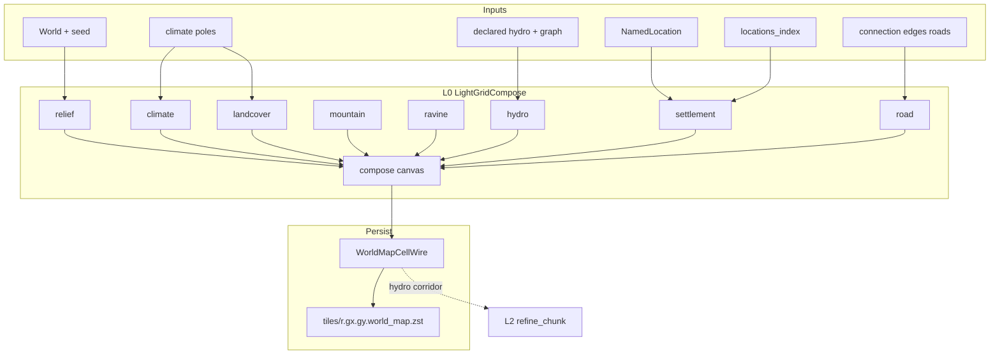

# Map Light Bake (L0 compose)

## Назначение

Зафиксировать **целевую архитектуру и контракты** materialize **light world map** (LOD L0): единый light-grid canvas, contributors по доменам, persist только через `WorldMapCellWire` → `world_map.zst`.

**Продуктовый контекст:** Идея 1 (light bake для корректной world map) и pipeline L0 — [`tz_world_pack_storage.md`](./tz_world_pack_storage.md) § LOD bake / § **Bake modes**.  
**Compose один:** `light_bake` и `full_bake` используют **тот же** L0 canvas pipeline; отличается только **набор macro-tiles** (cap vs все location tiles). `detailed_bake` — вне этого ТЗ (L2).

**Не в scope этого ТЗ:**

- L2 refine / wilderness chunks / location terrain blobs ([`tz_world_pack_storage.md`](./tz_world_pack_storage.md) § Идея 2, WP-13; **module layout** — § «L2 refine module layout»);
- Pack completeness classifier / resume (WP-28) — pack TZ;
- Patch Store / merge priority WP-20;
- DAG wiring;
- план имплементации агента (`.cursor/plans/`).

**Связь с storage TZ:** wire-поля light cell, `world_map_cells_per_tile`, pins/`locations_index` уже описаны в pack storage. Этот документ закрепляет **как** наполнять L0 (compose), а не формат zstd.

---

## Целевое состояние

### Инвариант

На время light bake существует **один** in-memory canvas light cells. Все объекты world map (рельеф, леса/биом, гидро, поселения, climate tint) **укладываются на этот canvas**.  
`WorldMapBakeOrchestrator` **не** семплит hydro / z / pins в обход compose.

### Что не является write-path маски L0

| Слой | Роль |
|---|---|
| `SurfaceTerrainContext.coarse_hydro` | planning / L2; **не** SoT L0 mask |
| `sparse_meter_hydro` / meter carve | fine / L2; **не** write-path L0 |
| Один sample на macro `(gx, gy)` на весь tile | **запрещённый** антипаттерн |

### Extensibility

«Маска» = **общая light-grid raster**, не только гидрология. Новые объекты карты (горы, леса, города/footprints, дороги later) = новый **contributor** в тот же compose, без нового blob-формата и без второго bake pipeline.

---

## Слои и модули (код)

Целевой layout (имена — контракт ответственности):

```text
application/worldData/pack/bake/lightGrid/
  coords.py
  cell.py
  compose.py
  bakeContext.py
  contributor.py
  bake.py
  contributors/
    relief.py
    climate.py
    landcover.py
    ravine.py
    hydro.py
    settlement.py
    road.py

pack/bake/worldMapBakeOrchestrator.py   # thin: compose → writer
```

| Модуль | Делает | Не делает |
|---|---|---|
| `lightGrid/` contributors | наполняют compose | HTTP, SQLite, LLM, L2 carve |
| `landcover` | biome / mountain из climate+relief | z-band stub |
| `ravine` / `road` | овраг / дорога на `system_terrain` | L2 carve / city streets |
| `hydro` contributor | light-rasterize hydro mask | fine bed / column fill |
| `settlement` contributor | pin (+ footprint later) на light cells | `SettlementLayout` / CitySkeleton materialize |
| `WorldMapBakeOrchestrator` | `to_wire` + `write_world_map_tile` | собственный семпл hydro/z |
| `SurfaceTerrainContext` | L2 / fine planning, climate helpers | SoT записи L0 wire |

Каталог: **`pack/bake/lightGrid/`** (утверждено).

---

## Координаты (контракт)

```text
tile_m  = map_cell_size_m
side    = 32                         # WP-10 v2: константа маски (POJO)
light_m = tile_m // side             # масштаб light-cell; плывёт с tile мира

# Абсолютный light index:
lx = floor(xm / light_m)
ly = floor(ym / light_m)

# Macro-tile + local:
gx = lx // side,  gy = ly // side
tx = lx %  side,  ty = ly %  side
```

| Ключ | Назначение |
|---|---|
| Canvas key | `(gx, gy, tx, ty)` (или absolute `(lx, ly)` + view по tile — эквивалент) |
| Bresenham / rasterize hydro | **light indices**, не meters и не macro `(gx, gy)` |
| Центр light cell (climate sample) | `(xm + light_m/2, ym + light_m/2)` |

Cross-ref: [`tz_world_pack_storage.md`](./tz_world_pack_storage.md) § WP-10 v2. `side` — только через POJO [`WorldMapCellsPerTilePolicy`](../backend/app/dataModel/worldPack/worldMapCellsPerTile.py) (default **32**); **не** литерал в bake и **не** ∝-формула от `map_cell_size_m`.

---

## Связь с dataModel (SoT) — утверждено

Правило проекта [`dataModel-no-hardcode`](../.cursor/rules/dataModel-no-hardcode.mdc): **Pydantic в `dataModel/` — единственный контракт** полей, defaults, wire-ключей и enum. Compose/application — тонкий staging и алгоритмы.

### Таблица SoT ↔ bake

| Контракт bake | dataModel SoT | Правило |
|---|---|---|
| Persist light cell / `to_wire_tile` | [`WorldMapCellWire`](../backend/app/dataModel/worldPack/worldMapCellWire.py) | Имена полей, defaults, validators — только отсюда |
| `hydrology_role` / `hydrology_width` | [`WorldMapHydrologyRole`](../backend/app/dataModel/worldPack/hydrologyMaskWire.py), [`HydrologyMaskWire`](../backend/app/dataModel/worldPack/hydrologyMaskWire.py) | Width clamp / `from_wire` — в POJO; merge priority ролей — **метод/helper на enum или POJO**, не `_PRIORITY = {…}` в contributor |
| Pin index / index file | [`LocationsIndexWire`](../backend/app/dataModel/worldPack/locationsIndexWire.py), [`LocationsIndexPin`](../backend/app/dataModel/worldPack/locationsIndexWire.py) | `location_pin` = index в `locations_index.locations[]` |
| `side` / WP-10 v2 | [`WorldMapCellsPerTilePolicy`](../backend/app/dataModel/worldPack/worldMapCellsPerTile.py) | default **32**; optional master override; `light_m = tile_m // side` |
| Bake caps (max tiles, …) | [`PackBakeDefaults`](../backend/app/dataModel/worldPack/packBakeDefaults.py) | Не дублировать в orchestrator |
| Terrain mask domains (enabled / declare / autoresolve) | target `WorldTerrainMasks` (+ existing [`WorldHydrology`](../backend/app/dataModel/hydrology/worldHydrology.py)) | § **Surface mask domains**; `DefaultOnWire`→DB; `IgnoreOnWire` overrides |
| Bake knobs (interim) | [`LightLandcoverPolicy`](../backend/app/dataModel/worldPack/lightLandcoverPolicy.py), [`LightRavinePolicy`](../backend/app/dataModel/worldPack/lightRavinePolicy.py), [`LightRoadPaintPolicy`](../backend/app/dataModel/worldPack/lightRoadPaintPolicy.py) | tech debt → fold under `terrain_masks`; гора не из z-band |
| Declared river/coast path | `dataModel.hydrology` (`DeclaredRiver`, `DeclaredCoastline`, …) | Load через существующие POJO → light rasterize |
| Fine role mapping (L2 constraint) | `WorldMapHydrologyRole.to_fine_role` → [`HydrologyCellRole`](../backend/app/dataModel/hydrology/enums/hydrologyCellRole.py) | Не параллельная таблица в pack/bake |

### Staging vs POJO

| Тип | Слой | Может ли быть SoT? |
|---|---|---|
| `WorldMapCellWire` | `dataModel` | **да** — persist/wire |
| `LightGridCell` | `application/.../bake/light` | **нет** — mutable mirror полей wire на время bake |
| `LightGridCompose` / contributors | application | **нет** — оркестрация; читают typed API POJO |

**Запрещено:**

- параллельный dict defaults в contributor (`"plains"`, `role=2`, `width=15`) если то же на Field/validator POJO;
- новое поле на light cell **сначала** в compose, **потом** в wire — только наоборот: расширить `WorldMapCellWire` (+ `HydrologyMaskWire` при hydro), затем staging;
- второй wire-схемы «LightMaskWire» рядом с `WorldMapCellWire`.

**Обязательно при изменении контракта light cell:** PR трогает `dataModel/worldPack/*` **в том же изменении**, что и compose/orchestrator.

---

## Surface mask domains — единая политика (утверждено 2026-07-16)

Одна логика для **всех** доменов маски L0 (гидрология + terrain-типы + дороги). Паттерн как у hydrology U8/U10; wire policy — [`tz_json_validation.md`](./tz_json_validation.md) § Field policy / `annotationPolicy`.

### Инварианты (все домены)

| # | Правило |
|---|---|
| 1 | **`enabled` default = true** — домен работает, пока мастер явно не поставил `enabled: false` |
| 2 | Пустой declare / нет NamedLocation **≠** выключено; autoresolve всё равно materialize |
| 3 | **`DefaultOnWire` + `Field(default)`** на мировых knobs → **normalize пишет в БД**; generate **только читает** строку мира |
| 4 | Опциональные override / «ignore»-куски — **`IgnoreOnWire`**: ключа нет → не автозаполняем; runtime → default из БД |
| 5 | **Declare** (optional) + **autoresolve** (default) + **opt-out** (`enabled: false`) — три режима на каждый домен |
| 6 | Declare **не перезаписывается** global autoresolve (как реки U27) |
| 7 | `terrain_registry` = каталог ключей (`mountain`, `forest`…); **включение маски** = policy `enabled`, не «ключ есть в registry» |

### Корни JSON (не один mega-blob)

| Корень | Домены | Статус |
|---|---|---|
| `world.hydrology` | реки / озёра / моря / shore / landforms hydro | уже есть (`WorldHydrology`) |
| `world.terrain_masks` (имя POJO — target) | mountain / forest / plains / ravine (+ tundra later) | **норматив этого §** |
| structure graph (`connection_*`) + policy enable | road | enable в `terrain_masks.default_roads` или соседнее поле; geometry — edges |

Не дублировать hydro-флаги вторым деревом: light bake **читает** `world.hydrology.*`. Terrain-типы — отдельный корень с **той же формой category policy**.

### Форма category policy (шаблон на каждый поддомен)

```text
CategoryPolicy:
  enabled: DefaultOnWire[bool] = True          # всегда on, пока не false
  # knobs плотности / пороги / min massif — DefaultOnWire → DB
  # optional IgnoreOnWire: per-region ignore, master overlay without fill

# на корне домена:
declared_*[]   # optional geometry / anchors
default_<name> # CategoryPolicy + autoresolve knobs
```

Цепочка resolve:

```text
IgnoreOnWire override (если ключ был в JSON)
  → иначе default-поле мира (материализовано в БД)
    → Field(default) POJO только на normalize-on-import
```

**Запрещено:** generator подставляет `enabled=True` / knobs мимо строки мира после import.

### Домены terrain_masks (target)

| Поддомен | `system_terrain` (типично) | Declare | Autoresolve (если enabled, даже без declare) |
|---|---|---|---|
| **mountains** | `mountain` (+ summit overlay по kind) | geographic → default `MountainSpec` | placement + elevation + kind/form — § **Mountain (engine)** |
| **forests** | `forest` | optional named forest / bias | climate rainfall / zone policy |
| **plains** | `plains` | `geographic.plain` | фон суши, где нет mountain/forest/ravine/road |
| **ravines** | `ravine` | optional | локальные депрессии vs соседи / noise |
| **roads** | `road` | structure edges | нет «пустых» дорог: без edges маска пуста; `enabled: false` запрещает paint даже при edges |

**Гидрология** — тот же паттерн, уже в `world.hydrology` (`enabled`, `default_rivers|lakes|seas`, `declared_*`).

### Mountain (engine) — kind / form / sides / range + elevation (утверждено 2026-07-16)

**Гора** — составной engine-объект (не N+1). Оси: **kind** (наполнение), **form** (силуэт footprint), **sides** (склоны).  
Отдельно: **горный хребет / range** — протяжённая **система** гор (не одна точка).

#### Иерархия абстракций

```text
MountainKind (Enum + profile)
MountainForm  = MountainFormBySides | StarForm | PeakForm | PlateauForm | …
MountainFormBySides { side_count: int >= 3 }     # контракт 1
StarForm { rays: int >= 3 }                      # контракт 2: стороны внутри объекта
MountainSideKind / MountainSideSpec
MountainSpec  # kind + form: MountainForm + sides[]
MountainRangeSpec
```

```text
# form — sum type, не {side_count, geometry}
MountainFormBySides(side_count=6)
StarForm(rays=5)

MountainRangeSpec
  spine / width
  kind_default
  form_default: MountainForm
  peaks: list[MountainSpec]

MountainsCategoryPolicy
  enabled / autoresolve
  default_kind
  default_form: MountainForm
```

#### Engine kinds (builtin)

| Kind | Смысл | Summit / состав (profile) |
|---|---|---|
| `ROCKY` | каменистая гора | камень / mountain |
| `ICE_PEAK` | основа + лёд/снег наверху | cap snow/ice |
| `VOLCANO` | вулкан | crater; внутри **magma** (L2) |
| `PLATEAU` | плато на вершине | **plains** на summit |
| `FORESTED` | гора с лесами | низкий rise; forest на склонах |

#### Engine forms (два контракта, не плоский `{side_count, geometry}`)

**Неверно:** одно POJO с полями `side_count` + `geometry` рядом.  
**Верно:** два **разных** контракта формы (sum type / discriminated union):

```text
MountainForm  =
  | MountainFormBySides      # контракт 1: произвольная форма по числу сторон
  | MountainFormGeometryObj  # контракт 2: объект геометрии (Star, Peak, …)
```

**Контракт 1 — стороны**

```text
MountainFormBySides
  side_count: int    # >= 3; произвольный контур / N-угольник
```

Только число сторон; геометрия «по умолчанию» = простой контур на N гранях (engine raster for BySides).

**Контракт 2 — объект геометрии**

```text
MountainFormGeometryObj   # engine tagged union
  | StarForm     { rays: int }           # кол-во лучей/сторон УЖЕ внутри Star (≥3; profile default часто 5)
  | PeakForm     { … }                   # параметры пика внутри объекта (в т.ч. стороны, если нужны)
  | PlateauForm  { … }
  | …                                    # новые geometry objects = PR движка
```

| Объект | Параметры внутри объекта (примеры) |
|---|---|
| `StarForm` | `rays` (стороны звезды) — **не** внешнее поле `side_count` |
| `PeakForm` | свои knobs (в т.ч. грани, если есть) |
| `PlateauForm` | свои knobs (размер шляпки, грани, …) |

```text
# OK
MountainForm = StarForm(rays=5)
MountainForm = MountainFormBySides(side_count=6)

# FORBIDDEN как контракт формы
MountainFormSpec(side_count=5, geometry=STAR)   # side_count снаружи Star
```

Resolve сторон для `MountainSpec.sides`:

```text
side_count =
  match form
    BySides(n)     → n
    StarForm(rays) → rays
    PeakForm(…)    → peak.side_count_or_default
    …
len(sides) == side_count
```

Form ⊥ kind: `ICE_PEAK` + `StarForm(rays=5)`, `ROCKY` + `BySides(4)`, …

#### Resolve геометрической формы (метод)

Один entrypoint на sum type — **без** `if geometry == "star"` в contributor:

```text
resolve_mountain_form_footprint(
  form: MountainForm,           # BySides | StarForm | PeakForm | …
  origin_m: (x, y),             # якорь горы (метры)
  radius_m: float,              # габарит footprint (из declare / policy / kind profile)
  scale: LightGridScale,        # → light cells
) → set[(lx, ly)]               # клетки основания на light grid
```

**Как резолвится (dispatch по варианту form):**

| `MountainForm` | Метод / стратегия (engine) |
|---|---|
| `MountainFormBySides` | `raster_regular_polygon(origin, radius, n=side_count)` |
| `StarForm` | `raster_star(origin, radius, rays=form.rays)` — лучи/впадины; N только из `form.rays` |
| `PeakForm` | `raster_peak_footprint(origin, radius, form.…)` |
| `PlateauForm` | `raster_plateau_footprint(origin, radius, form.…)` |

```text
# псевдокод контракта (один модуль masks/mountainFormFootprint.py)
def resolve_mountain_form_footprint(form, origin_m, radius_m, scale) -> set[LightCell]:
    match form:
        case MountainFormBySides(side_count=n):
            return raster_regular_polygon(..., n=n)
        case StarForm(rays=r):
            return raster_star(..., rays=r)      # стороны уже в Star
        case PeakForm() as peak:
            return raster_peak(..., peak)
        case PlateauForm() as plateau:
            return raster_plateau(..., plateau)
```

**Инварианты resolve**

| # | Правило |
|---|---|
| R1 | Contributor зовёт только `resolve_mountain_form_footprint` (+ elevation/apply) |
| R2 | Новая geometry = новый variant + своя `raster_*`; не ветка в contributor |
| R3 | `StarForm`: параметр лучей только `form.rays` — снаружи N не передаётся |
| R4 | Выход — light indices в scope bake; дальше `apply_mountain_cell` на каждую клетку |

#### Горный хребет (range) — отдельный уровень

| | Одиночная гора (`MountainSpec`) | Хребет (`MountainRangeSpec`) |
|---|---|---|
| Протяжённость | компактный footprint | **длина вдоль spine ≫ ширины** |
| Геометрия | form (peak/star/plateau) | polyline spine + width corridor |
| Состав | один kind/form/sides | непрерывное тело хребта + optional peaks вдоль оси |
| Declare | `geographic.peak` / точечный mountain | `geographic.mountain` massif / будущий ridge path |
| Autoresolve | ridge-noise blobs → isolated или short chains | elongated ridge field вдоль seed axes |

Хребет **не** является значением `MountainForm` (STAR/PEAK — про одну гору).  
Хребет = **агрегат** (`MountainRangeSpec`), внутри могут быть несколько `MountainSpec` (вершины) с своими kind/form.

#### Стороны (на `MountainSpec`)

- Число сторон = **из выбранного контракта формы** (`BySides.side_count` / `StarForm.rays` / …); ≥ 3.
- `len(sides) ==` этому числу.
- Каждая сторона: `SHEER` | `SLOPE` — **не** флаг «мягкости горы», а выбор **отдельного алгоритма заполнения этой стороны**.
- Form задаёт только силуэт / разбиение на стороны; мягкость/жёсткость края **не** параметр form.

```text
# per side — свой fill algorithm
apply_mountain_side(
  side_index: int,
  side: MountainSideSpec,     # SHEER | SLOPE (+ knobs стороны)
  sector: SideSector,         # клин/грань из form footprint
  cells: set[LightCell],
) → updates surface_z / slope band на клетках сектора

match side.kind:
  SHEER → fill_sheer_side(...)   # жёсткий обрыв: резкий z-step
  SLOPE → fill_slope_side(...)   # мягкий склон: градиент z к base
```

| Side | Алгоритм заполнения (контракт) |
|---|---|
| `SHEER` | жёсткий край: почти без промежуточных z между peak и base на секторе |
| `SLOPE` | мягкий край: интерполяция / falloff z вдоль нормали стороны |

- L0 может писать z/band по стороне; полный 3D склон — L2.
- Новая сторона-алгоритм = новый `MountainSideKind` + `fill_*` (PR движка).

#### Инварианты

| # | Правило |
|---|---|
| M1 | Kind / form / side / range — **engine**; не N+1 |
| M2 | Нет строковых ветвлений в contributor — только enums / Spec |
| M3 | Form = sum type: `BySides` **или** geometry object (`StarForm` с `rays` внутри); запрещён плоский `{side_count, geometry}` |
| M4 | Range ≠ Form; range = протяжённая система |
| M5 | Elevation по **kind**; mask без подъёма z — запрещена |
| M6 | Новый kind/geometry-object/side/range = PR движка |
| M7 | Мягкость края = **алгоритм fill стороны** (`SHEER`/`SLOPE`), не свойство form/горы целиком |

#### Elevation (одна формула; knobs с **kind**)

```text
base_z = cell.surface_z
rise   = round(z_max * kind.profile.rise_fraction_of_z_max)
z      = min(z_max, max(z_min, base_z + rise))
```

На хребте: та же формула per-cell / per-peak; вдоль spine может быть ниже к краям (profile range), всё ещё ≤ `z_max`.

```text
resolve_mountain_z(base_z, z_min, z_max, kind) → int
apply_mountain_cell(..., MountainSpec | range context) → terrain(+summit) + surface_z
```

Writer: **mountain**. Relief — база.

### Merge `system_terrain` (приоритет writers)

При включённых доменах, одна light cell:

```text
road > ravine > mountain > forest > plains
```

| Поле | Merge |
|---|---|
| `surface_z` | relief → **mountain поднимает** (формула выше); later writers не понижают гору без своего контракта |
| `system_terrain` | как таблица приоритета |

(hydro пишет только `hydrology_*`, не затирает terrain; road/ravine **не** красят SEA/LAKE/RIVER.)

Climate contributor пишет только `climate_zone_id` — вход для forest/plains autoresolve, **не** writer горы.

### Tech debt

- ~~Interim LightLandcoverPolicy / mountain-from-z~~ — удалено.  
- **Open:** нет engine `MountainKind`/`Form`/`Sides` + elevation — § Mountain (engine). План: [`.cursor/plans/surface-masks-clean-architecture.md`](../.cursor/plans/surface-masks-clean-architecture.md).

---

## Контракты типов

### `LightGridCell` (bake staging)

Mutable dataclass **до** persist. Поля **1:1** с wire SoT [`WorldMapCellWire`](../backend/app/dataModel/worldPack/worldMapCellWire.py) — отдельной persist-схемы «mask» нет. Defaults при `ensure` / `to_wire_tile` — из typed defaults/`model_construct` POJO, не локальные литералы.

| Поле | Тип | Слой-писатель |
|---|---|---|
| `surface_z` | int | relief (база); **mountain** (подъём ≤ `z_max`) |
| `system_terrain` | str \| None | landcover / mountain / ravine / road |
| `dominant_terrain_id` | int | landcover (если используется) |
| `hydrology_role` | `WorldMapHydrologyRole` | hydro |
| `hydrology_width` | int \| None | hydro |
| `climate_zone_id` | int \| None | climate |
| `location_pin` | int \| None | settlement |

Wire/POJO SoT — § **Связь с dataModel** выше. Compose **не** дублирует defaults литералами в обход POJO.

### `LightGridCompose`

```text
LightGridCompose
  side: int
  tile_m: int
  light_m: int
  cells: sparse map (gx, gy, tx, ty) → LightGridCell

  ensure(gx, gy, tx, ty) → LightGridCell
  iter_tile(gx, gy) → (tx, ty, cell)*
  to_wire_tile(gx, gy) → list[WorldMapCellWire]
      # плотный side×side; отсутствующие keys → defaults wire
```

### `LightGridContributor` (protocol)

```text
name: str   # relief|climate|landcover|ravine|hydro|settlement|road
apply(compose: LightGridCompose, ctx: LightGridBakeContext) → None
```

**Порядок вызова (target; каждый terrain/hydro contributor читает свой `enabled`):**

1. `relief` — `surface_z`
2. `climate` — `climate_zone_id` (вход для forest/plains)
3. `landcover` — plains/forest (и tundra) по climate **если** `terrain_masks.default_forests|plains.enabled`
4. `mountain` — declare + autoresolve; пишет `system_terrain` **и** поднимает `surface_z` от `z_max` (§ Mountain elevation)
5. `ravine` — **если** `default_ravines.enabled`
6. `hydro` — `hydrology_*` Path A **если** `hydrology.enabled` (+ subtype flags)
7. `settlement` — `location_pin`
8. `road` — **если** `default_roads.enabled`; не затирает SEA/LAKE/RIVER

Пустой declare при `enabled=true` → autoresolve всё равно materialize (кроме road: нужна geometry edges).

### `LightGridBakeContext` (caller contract)

| Поле | Назначение |
|---|---|
| `world` | seed, `map_cell_size_m`, flags |
| `locations` | L1 anchors |
| `nodes` / `edges` | connection graph (hydro legs + **roads**) |
| `locations_index` | `LocationsIndexWire`; `location_pin` = **index** в `locations[]` |
| `tiles` | scope bake `list[(gx, gy)]` |
| `surface_planning` | optional `SurfaceTerrainContext` — read-only adjunct; **не** write-path L0 hydro |
| climate / pole accessors | для `climate` / `landcover` |

---

## Contributors (семантика)

| Contributor | Пишет | Источник (target) |
|---|---|---|
| **relief** | `surface_z` | per `(tx,ty)`; coarse + pole typical + noise |
| **climate** | `climate_zone_id` | pole (+ local) в центре light cell |
| **landcover** | `system_terrain` plains/forest/tundra | climate + `terrain_masks` forest/plains policy; **не** гора |
| **mountain** | `system_terrain=mountain` | declare + autoresolve (`default_mountains`); empty declare ≠ off |
| **ravine** | `system_terrain=ravine` | `default_ravines` + autoresolve; не затирает hydro |
| **hydro** | `hydrology_*` | `world.hydrology` Path A |
| **settlement** | `location_pin` | pin (+ footprint policy) |
| **road** | `system_terrain=road` | edges + `default_roads.enabled`; preserve water |

| Объект UI | Слой |
|---|---|
| Реки / море / озёра | hydro |
| Горы | **mountain** (не landcover) |
| Леса / равнина | landcover |
| Овраг | ravine |
| Дороги | road |
| Города / POI | settlement |

---

## Merge policy (одна light cell)

| Поле | Правило |
|---|---|
| `surface_z` | relief (база) → mountain поднимает по § Mountain elevation (≤ `z_max`) |
| `system_terrain` | road > ravine > mountain > forest > plains; hydro не затирает terrain; road/ravine не затирают SEA/LAKE/RIVER |
| `hydrology_*` | hydro; priority в dataModel |
| `location_pin` | settlement |
| `climate_zone_id` | climate |

---

## Data flow



> **Удалено (2026-07-16):** interim stub `surface_terrain_at_z` bands (`z==1→forest`, `z≥2→tundra`) как SoT L0 landcover.

Параллельно (вне write-path L0 mask):

```text
SurfaceTerrainContext → fine / L2 materialize, meter hydro side-products
```

---

## Hydro Path A (норматив)

1. Перевести declared polyline (метры) → light indices `(lx, ly)`.
2. Rasterize (`bresenham` / `rasterize_segments`) **на light grid**.
3. Проставить `hydrology_role` + optional `hydrology_width` (в light cells).
4. Море/озеро: connected component / fill **на light grid** (не meter carve).
5. Autoresolve coarse — тоже на light (ТЗ pack: «declared + autoresolve coarse»), не через полный fine `HydrologyGeneratorService.apply` как SoT маски.

**Запрещено:** писать в wire один `coarse_hydro[(gx,gy)]` на все `(tx,ty)` tile.

---

## Связь с L2

L0 compose → **wire на диске** (`world_map.zst`) — **чертёж** для Идеи 2.

L2 `refine_chunk` читает parent light **только** через `load_parent_light(gx, gy)`:

- SoT = baked `WorldMapCellWire` в pack blob;
- process-local cache после write/read — latency, не второй SoT; ключ `(world_uid, gx, gy)`;
- cold / другой process → disk.

Алгоритмические контракты refine (upsample / hard hydro corridor / z-band) — [`tz_world_pack_storage.md`](./tz_world_pack_storage.md) § **Parent light refine contracts** · WP-PERF-22.  
Числовые defaults — будущий POJO `ParentLightRefinePolicy` в `dataModel/worldPack/`, не литералы в generators.

Контракт согласованности: corridor `hydrology_role` / forms `surface_z`.  
Пустая hydro-маска на L0 = сломанный контракт world map и constraints L2.

**Антипаттерн:** refine из live `LightGridCompose` или из `SurfaceTerrainContext` в обход baked mask.

Приёмка согласованности карты и сцены (после кода WP-PERF-22): **MLB-8** — river/ridge L2 внутри L0 corridor / z-band (не отмечать done до имплементации).

---

## Логи и диагностика

Per-world generation log: `backend/logs/generation/{world_uid}/` ([`generationLogging`](../backend/app/core/generationLogging.py)).

Bake diagnostics (activity, без `L0`/`L2` в именах — см. pack storage § именование):

| Событие | Ожидание |
|---|---|
| `light_compose_start` / `done` | scope tiles, side, light_m |
| per-contributor summary | non-default cell counts (hydro roles hist, pins, z hist) |
| `world_map_tile_write` | hist из **wire после compose**, не macro-only |
| `world_map_bake_all_flat` | сигнал: compose/hydro не уложили маску |

---

## Приёмка (архитектурная)

| ID | Критерий |
|---|---|
| MLB-1 | Light bake пишет hydro/z/pins **только** через `LightGridCompose` |
| MLB-2 | `hydrology_role ≠ NONE` на light cells вдоль declared rivers (smoke `world_terrain_test`) — не all-NONE |
| MLB-3 | Нет write-path L0 из «один sample на macro tile на весь 32×32» |
| MLB-4 | `location_pin` согласован с `locations_index` indices |
| MLB-5 | `SurfaceTerrainContext` / meter hydro не являются SoT L0 mask |
| MLB-6 | ASCII/pack render world map показывает hydro + pins при валидном fixture (не all plains+NONE при declared rivers) |
| MLB-7 | Новые light-cell поля и hydro merge/defaults живут в `dataModel/worldPack` (+ hydrology enums); application только staging/compose |
| MLB-8 | L2 river/ridge внутри L0 corridor / z-band — unit ✅ (`test_parent_light_refine`); HTTP fixture smoke — backlog |
| MLB-9 | Единая policy всех mask-доменов (`WorldTerrainMasks` + hydrology) — ✅ unit (`test_terrain_masks`, `test_light_grid_compose`) |
| MLB-10 | Mountain domain declare+autoresolve; forest/plains без mountain-from-z — ✅ |

---

## Связанные документы

| Документ | Связь |
|---|---|
| [`tz_world_pack_storage.md`](./tz_world_pack_storage.md) | L0 wire, WP-10, Идея 1/2, WP-PERF-31 |
| [`tz_terrain_hydrology.md`](./tz_terrain_hydrology.md) | declared river/coast, fine roles |
| [`tz_terrain_generation.md`](./tz_terrain_generation.md) | surface pass, coarse planning |
| [`tz_climate.md`](./tz_climate.md) | pole / zone sample |
| [`tz_city_generation.md`](./tz_city_generation.md) | L1 skeletons vs L2 layout |

---

## История

| Дата | Изменение |
|---|---|
| 2026-07-14 | Первая фиксация: LightGridCompose, contributors, Path A hydro, границы vs SurfaceTerrainContext |
| 2026-07-14 | § **Связь с dataModel (SoT)** — таблица wire/POJO ↔ bake; staging ≠ SoT; MLB-7 |
| 2026-07-14 | Каталог кода: **`pack/bake/lightGrid/`** (утверждено) |
| 2026-07-15 | WP-10 v2: `side=32` константа; масштаб = `light_m`; grid builders — обязательный consumer |
| 2026-07-15 | § Связь с L2: Parent light SoT = disk + process cache; MLB-8 (post-code); cross-ref storage Идея 2 |
| 2026-07-15 | Cross-ref Parent light refine contracts (z_band, hard corridor, POJO knobs) |
| 2026-07-16 | Pipeline draft: climate before landcover; убран stub `z==1→forest` |
| 2026-07-16 | § **Surface mask domains** — единая политика enabled/declare/autoresolve/IgnoreOnWire/DefaultOnWire→DB для hydro+terrain+road; гора ≠ landcover-from-z |
| 2026-07-16 | Impl: `WorldTerrainMasks` + shared MaskCategoryPolicy; mountain contributor; deleted Light* interim |
| 2026-07-16 | § **Mountain elevation**: подъём = % от `z_max` над terrain base; clamp ≤ `z_max`; mask-only без z — запрещён |
| 2026-07-16 | § **Mountain (engine)**: Form = sum type `BySides` \| `StarForm(rays…)` (не плоский side_count+geometry); Range; elevation kind×z_max |
| 2026-07-15 | MLB-8 unit path ✅ via WP-PERF-22 impl |
