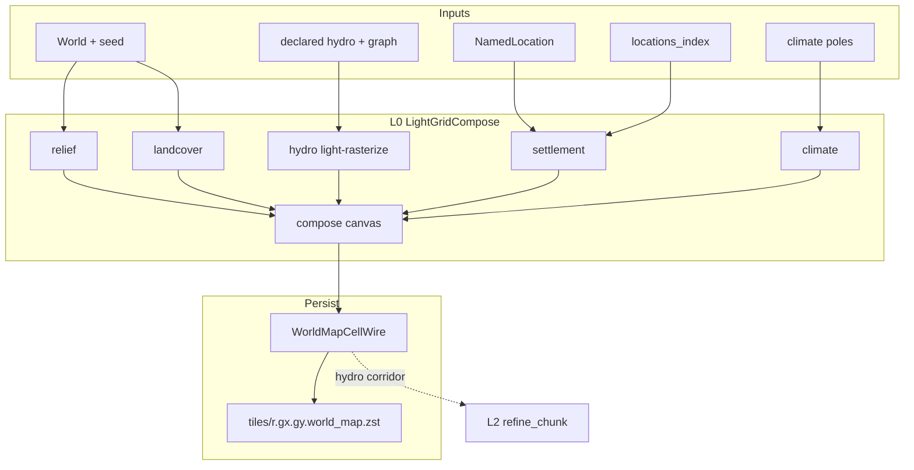

# Map Light Bake (L0 compose)

## Назначение

Зафиксировать **целевую архитектуру и контракты** materialize **light world map** (LOD L0): единый light-grid canvas, contributors по доменам, persist только через `WorldMapCellWire` → `world_map.zst`.

**Продуктовый контекст:** Идея 1 (light bake для корректной world map) и pipeline L0 — [`tz_world_pack_storage.md`](./tz_world_pack_storage.md) § LOD bake / § Идея 1.

**Не в scope этого ТЗ:**

- L2 refine / wilderness chunks / location terrain blobs ([`tz_world_pack_storage.md`](./tz_world_pack_storage.md) § Идея 2, WP-13; **module layout** — § «L2 refine module layout»);
- Patch Store / merge priority WP-20;
- DAG wiring;
- план имплементации агента (`.cursor/plans/`).

**Связь с storage TZ:** wire-поля light cell, `world_map_cells_per_tile`, pins/`locations_index` уже описаны в pack storage. Этот документ закрепляет **как** наполнять L0 (compose), а не формат zstd.

---

## Целевое состояние

### Инвариант

На время light bake существует **один** in-memory canvas light cells. Все объекты world map (рельеф, леса/биом, гидро, поселения, climate tint) **укладываются на этот canvas**.  
`WorldMapBakeOrchestrator` **не** семплит hydro / z / pins в обход compose.

### Что не является write-path маски L0

| Слой | Роль |
|---|---|
| `SurfaceTerrainContext.coarse_hydro` | planning / L2; **не** SoT L0 mask |
| `sparse_meter_hydro` / meter carve | fine / L2; **не** write-path L0 |
| Один sample на macro `(gx, gy)` на весь tile | **запрещённый** антипаттерн |

### Extensibility

«Маска» = **общая light-grid raster**, не только гидрология. Новые объекты карты (горы, леса, города/footprints, дороги later) = новый **contributor** в тот же compose, без нового blob-формата и без второго bake pipeline.

---

## Слои и модули (код)

Целевой layout (имена — контракт ответственности):

```text
application/worldData/pack/bake/lightGrid/
  coords.py
  cell.py
  compose.py
  bakeContext.py
  contributor.py
  bake.py
  contributors/
    relief.py
    landcover.py
    hydro.py
    settlement.py
    climate.py

pack/bake/worldMapBakeOrchestrator.py   # thin: compose → writer
```

| Модуль | Делает | Не делает |
|---|---|---|
| `lightGrid/` contributors | наполняют compose | HTTP, SQLite, LLM, L2 carve |
| `hydro` contributor | light-rasterize hydro mask | fine bed / column fill |
| `settlement` contributor | pin (+ footprint later) на light cells | `SettlementLayout` / CitySkeleton materialize |
| `WorldMapBakeOrchestrator` | `to_wire` + `write_world_map_tile` | собственный семпл hydro/z |
| `SurfaceTerrainContext` | L2 / fine planning, climate helpers | SoT записи L0 wire |

Каталог: **`pack/bake/lightGrid/`** (утверждено).

---

## Координаты (контракт)

```text
tile_m  = map_cell_size_m
side    = 32                         # WP-10 v2: константа маски (POJO)
light_m = tile_m // side             # масштаб light-cell; плывёт с tile мира

# Абсолютный light index:
lx = floor(xm / light_m)
ly = floor(ym / light_m)

# Macro-tile + local:
gx = lx // side,  gy = ly // side
tx = lx %  side,  ty = ly %  side
```

| Ключ | Назначение |
|---|---|
| Canvas key | `(gx, gy, tx, ty)` (или absolute `(lx, ly)` + view по tile — эквивалент) |
| Bresenham / rasterize hydro | **light indices**, не meters и не macro `(gx, gy)` |
| Центр light cell (climate sample) | `(xm + light_m/2, ym + light_m/2)` |

Cross-ref: [`tz_world_pack_storage.md`](./tz_world_pack_storage.md) § WP-10 v2. `side` — только через POJO [`WorldMapCellsPerTilePolicy`](../backend/app/dataModel/worldPack/worldMapCellsPerTile.py) (default **32**); **не** литерал в bake и **не** ∝-формула от `map_cell_size_m`.

---

## Связь с dataModel (SoT) — утверждено

Правило проекта [`dataModel-no-hardcode`](../.cursor/rules/dataModel-no-hardcode.mdc): **Pydantic в `dataModel/` — единственный контракт** полей, defaults, wire-ключей и enum. Compose/application — тонкий staging и алгоритмы.

### Таблица SoT ↔ bake

| Контракт bake | dataModel SoT | Правило |
|---|---|---|
| Persist light cell / `to_wire_tile` | [`WorldMapCellWire`](../backend/app/dataModel/worldPack/worldMapCellWire.py) | Имена полей, defaults, validators — только отсюда |
| `hydrology_role` / `hydrology_width` | [`WorldMapHydrologyRole`](../backend/app/dataModel/worldPack/hydrologyMaskWire.py), [`HydrologyMaskWire`](../backend/app/dataModel/worldPack/hydrologyMaskWire.py) | Width clamp / `from_wire` — в POJO; merge priority ролей — **метод/helper на enum или POJO**, не `_PRIORITY = {…}` в contributor |
| Pin index / index file | [`LocationsIndexWire`](../backend/app/dataModel/worldPack/locationsIndexWire.py), [`LocationsIndexPin`](../backend/app/dataModel/worldPack/locationsIndexWire.py) | `location_pin` = index в `locations_index.locations[]` |
| `side` / WP-10 v2 | [`WorldMapCellsPerTilePolicy`](../backend/app/dataModel/worldPack/worldMapCellsPerTile.py) | default **32**; optional master override; `light_m = tile_m // side` |
| Bake caps (max tiles, …) | [`PackBakeDefaults`](../backend/app/dataModel/worldPack/packBakeDefaults.py) | Не дублировать в orchestrator |
| Declared river/coast path | `dataModel.hydrology` (`DeclaredRiver`, `DeclaredCoastline`, …) | Load через существующие POJO → light rasterize |
| Fine role mapping (L2 constraint) | `WorldMapHydrologyRole.to_fine_role` → [`HydrologyCellRole`](../backend/app/dataModel/hydrology/enums/hydrologyCellRole.py) | Не параллельная таблица в pack/bake |

### Staging vs POJO

| Тип | Слой | Может ли быть SoT? |
|---|---|---|
| `WorldMapCellWire` | `dataModel` | **да** — persist/wire |
| `LightGridCell` | `application/.../bake/light` | **нет** — mutable mirror полей wire на время bake |
| `LightGridCompose` / contributors | application | **нет** — оркестрация; читают typed API POJO |

**Запрещено:**

- параллельный dict defaults в contributor (`"plains"`, `role=2`, `width=15`) если то же на Field/validator POJO;
- новое поле на light cell **сначала** в compose, **потом** в wire — только наоборот: расширить `WorldMapCellWire` (+ `HydrologyMaskWire` при hydro), затем staging;
- второй wire-схемы «LightMaskWire» рядом с `WorldMapCellWire`.

**Обязательно при изменении контракта light cell:** PR трогает `dataModel/worldPack/*` **в том же изменении**, что и compose/orchestrator.

---

## Контракты типов

### `LightGridCell` (bake staging)

Mutable dataclass **до** persist. Поля **1:1** с wire SoT [`WorldMapCellWire`](../backend/app/dataModel/worldPack/worldMapCellWire.py) — отдельной persist-схемы «mask» нет. Defaults при `ensure` / `to_wire_tile` — из typed defaults/`model_construct` POJO, не локальные литералы.

| Поле | Тип | Слой-писатель |
|---|---|---|
| `surface_z` | int | relief |
| `system_terrain` | str \| None | landcover |
| `dominant_terrain_id` | int | landcover |
| `hydrology_role` | `WorldMapHydrologyRole` | hydro |
| `hydrology_width` | int \| None | hydro |
| `climate_zone_id` | int \| None | climate |
| `location_pin` | int \| None | settlement |

Wire/POJO SoT — § **Связь с dataModel** выше. Compose **не** дублирует defaults литералами в обход POJO.

### `LightGridCompose`

```text
LightGridCompose
  side: int
  tile_m: int
  light_m: int
  cells: sparse map (gx, gy, tx, ty) → LightGridCell

  ensure(gx, gy, tx, ty) → LightGridCell
  iter_tile(gx, gy) → (tx, ty, cell)*
  to_wire_tile(gx, gy) → list[WorldMapCellWire]
      # плотный side×side; отсутствующие keys → defaults wire
```

### `LightGridContributor` (protocol)

```text
name: str   # "relief" | "landcover" | "hydro" | "settlement" | "climate"
apply(compose: LightGridCompose, ctx: LightGridBakeContext) → None
```

**Порядок вызова (фиксирован, = pipeline ТЗ pack storage):**

1. `relief`
2. `landcover`
3. `hydro`
4. `settlement`
5. `climate`

### `LightGridBakeContext` (caller contract)

| Поле | Назначение |
|---|---|
| `world` | seed, `map_cell_size_m`, flags |
| `locations` | L1 anchors |
| `nodes` / `edges` | connection graph (declared hydro legs) |
| `locations_index` | `LocationsIndexWire`; `location_pin` = **index** в `locations[]` |
| `tiles` | scope bake `list[(gx, gy)]` (P0/P1/…) |
| `surface_planning` | optional `SurfaceTerrainContext` — **read-only adjunct** для L2/climate helpers; **не** write-path L0 hydro mask |
| climate / pole accessors | для `climate` contributor |

---

## Contributors (семантика)

| Contributor | Пишет | Источник (target) |
|---|---|---|
| **relief** | `surface_z` | surface pass **на light grid** (продуктовый target). Контракт — **per `(tx,ty)`**. Реализация может временно upsample macro→light **без** смены контракта compose. |
| **landcover** | `system_terrain`, `dominant_terrain_id` | biome/terrain с light cell (леса, равнины, «горы» как landcover/высотный класс). |
| **hydro** | `hydrology_role`, `hydrology_width` | **Path A:** declared rivers/coasts (+ **autoresolve coarse** на light) → rasterize в light coords. Без fine bed carve. См. WP-PERF-31 как perf-форма того же контракта. |
| **settlement** | `location_pin` | nearest light cell к `(map_x, map_y)`; index → `locations_index`. **Footprint** (круг/rect в light cells) — тот же compose, отдельный шаг later; v1 контракта — pin обязателен, footprint не блокирует архитектуру. |
| **climate** | `climate_zone_id` | sample climate/pole field в центре light cell. |

Города / горы / леса:

| Объект UI | Слой |
|---|---|
| Реки / море / озёра | hydro |
| Горы / хребты | relief (`surface_z`) + landcover |
| Леса / биом | landcover |
| Города / POI | settlement (`location_pin`, later footprint) |

---

## Merge policy (одна light cell)

| Поле | Правило |
|---|---|
| `surface_z` | единственный writer = relief |
| landcover | landcover; hydro **не** затирает terrain по умолчанию (shore не меняет biome id молча) |
| `hydrology_*` | hydro; при overlap — `WorldMapHydrologyRole` priority helper в **dataModel** (SEA ≥ LAKE ≥ RIVER ≥ SHORE ≥ NONE); не локальная таблица в contributor |
| `location_pin` | один pin на cell; collision → стабильный порядок (меньший index / uid sort — зафиксировать в коде одним правилом) |
| `climate_zone_id` | climate |

---

## Data flow



Параллельно (вне write-path L0 mask):

```text
SurfaceTerrainContext → fine / L2 materialize, meter hydro side-products
```

---

## Hydro Path A (норматив)

1. Перевести declared polyline (метры) → light indices `(lx, ly)`.
2. Rasterize (`bresenham` / `rasterize_segments`) **на light grid**.
3. Проставить `hydrology_role` + optional `hydrology_width` (в light cells).
4. Море/озеро: connected component / fill **на light grid** (не meter carve).
5. Autoresolve coarse — тоже на light (ТЗ pack: «declared + autoresolve coarse»), не через полный fine `HydrologyGeneratorService.apply` как SoT маски.

**Запрещено:** писать в wire один `coarse_hydro[(gx,gy)]` на все `(tx,ty)` tile.

---

## Связь с L2

L0 compose → **wire на диске** (`world_map.zst`) — **чертёж** для Идеи 2.

L2 `refine_chunk` читает parent light **только** через `load_parent_light(gx, gy)`:

- SoT = baked `WorldMapCellWire` в pack blob;
- process-local cache после write/read — latency, не второй SoT; ключ `(world_uid, gx, gy)`;
- cold / другой process → disk.

Алгоритмические контракты refine (upsample / hard hydro corridor / z-band) — [`tz_world_pack_storage.md`](./tz_world_pack_storage.md) § **Parent light refine contracts** · WP-PERF-22.  
Числовые defaults — будущий POJO `ParentLightRefinePolicy` в `dataModel/worldPack/`, не литералы в generators.

Контракт согласованности: corridor `hydrology_role` / forms `surface_z`.  
Пустая hydro-маска на L0 = сломанный контракт world map и constraints L2.

**Антипаттерн:** refine из live `LightGridCompose` или из `SurfaceTerrainContext` в обход baked mask.

Приёмка согласованности карты и сцены (после кода WP-PERF-22): **MLB-8** — river/ridge L2 внутри L0 corridor / z-band (не отмечать done до имплементации).

---

## Логи и диагностика

Per-world generation log: `backend/logs/generation/{world_uid}/` ([`generationLogging`](../backend/app/core/generationLogging.py)).

Bake diagnostics (activity, без `L0`/`L2` в именах — см. pack storage § именование):

| Событие | Ожидание |
|---|---|
| `light_compose_start` / `done` | scope tiles, side, light_m |
| per-contributor summary | non-default cell counts (hydro roles hist, pins, z hist) |
| `world_map_tile_write` | hist из **wire после compose**, не macro-only |
| `world_map_bake_all_flat` | сигнал: compose/hydro не уложили маску |

---

## Приёмка (архитектурная)

| ID | Критерий |
|---|---|
| MLB-1 | Light bake пишет hydro/z/pins **только** через `LightGridCompose` |
| MLB-2 | `hydrology_role ≠ NONE` на light cells вдоль declared rivers (smoke `world_terrain_test`) — не all-NONE |
| MLB-3 | Нет write-path L0 из «один sample на macro tile на весь 32×32» |
| MLB-4 | `location_pin` согласован с `locations_index` indices |
| MLB-5 | `SurfaceTerrainContext` / meter hydro не являются SoT L0 mask |
| MLB-6 | ASCII/pack render world map показывает hydro + pins при валидном fixture (не all plains+NONE при declared rivers) |
| MLB-7 | Новые light-cell поля и hydro merge/defaults живут в `dataModel/worldPack` (+ hydrology enums); application только staging/compose |
| MLB-8 | L2 river/ridge внутри L0 corridor / z-band — unit ✅ (`test_parent_light_refine`); HTTP fixture smoke — backlog |

---

## Связанные документы

| Документ | Связь |
|---|---|
| [`tz_world_pack_storage.md`](./tz_world_pack_storage.md) | L0 wire, WP-10, Идея 1/2, WP-PERF-31 |
| [`tz_terrain_hydrology.md`](./tz_terrain_hydrology.md) | declared river/coast, fine roles |
| [`tz_terrain_generation.md`](./tz_terrain_generation.md) | surface pass, coarse planning |
| [`tz_climate.md`](./tz_climate.md) | pole / zone sample |
| [`tz_city_generation.md`](./tz_city_generation.md) | L1 skeletons vs L2 layout |

---

## История

| Дата | Изменение |
|---|---|
| 2026-07-14 | Первая фиксация: LightGridCompose, contributors, Path A hydro, границы vs SurfaceTerrainContext |
| 2026-07-14 | § **Связь с dataModel (SoT)** — таблица wire/POJO ↔ bake; staging ≠ SoT; MLB-7 |
| 2026-07-14 | Каталог кода: **`pack/bake/lightGrid/`** (утверждено) |
| 2026-07-15 | WP-10 v2: `side=32` константа; масштаб = `light_m`; grid builders — обязательный consumer |
| 2026-07-15 | § Связь с L2: Parent light SoT = disk + process cache; MLB-8 (post-code); cross-ref storage Идея 2 |
| 2026-07-15 | Cross-ref Parent light refine contracts (z_band, hard corridor, POJO knobs) |
| 2026-07-15 | MLB-8 unit path ✅ via WP-PERF-22 impl |
