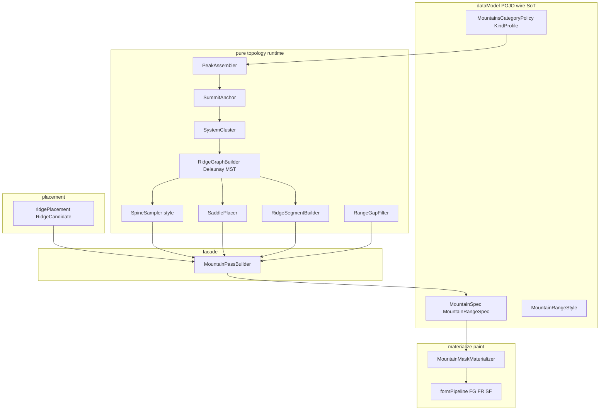

# Mountain architecture (PassBuilder / topology)

## Назначение

Целевая **архитектура классов и topology SoT** для гор L0: `MountainPassBuilder` выше paint (FG→FR→SF), граф вершин (Delaunay→MST), седла, spacing, secondary ridges — **без slice**.

**Не в scope этого ТЗ:**

- MaskDomain materialize lifecycle / light compose canvas — [`tz_map_light_bake.md`](./tz_map_light_bake.md);
- FormGeometry / FormRaster / SideFill алгоритмы сторон — там же § Mountain (engine);
- **SLOPE / SHEER / uphill facing** — домен [`tz_terrain_relief.md`](./tz_terrain_relief.md); горы только переиспользуют;
- DAG-ноды (`application/engine/nodes/`);
- ravine / cliff MaskDomain; slope noise (U8); summit material overlays (U10) — слоты ниже, не PassBuilder;
- план агента (чеклисты PR) — `.cursor/plans/` (ссылка на этот документ).

**Связь:** paint и MaskDomain plugin остаются в light-bake; этот документ — **что** собирает Specs до paint и **как** разложены классы. Terrain grade ≠ topology PassBuilder.

---

## Утверждённый SoT lock (2026-07-24)

Продуктовые решения **закрыты** (мастер согласен). Код PassBuilder — отдельный gate.

| Тема | SoT (кратко) | § |
|---|---|---|
| PassBuilder над FG→FR→SF | topology → Specs only; paint ниже | Слои / PassBuilder |
| Хребет | ≥2 вершины (`summit_anchor`); не ridge-cell count | Вершина |
| Declare immutable | auto не патчит declare Spec/Range | PassBuilder |
| Spine | Delaunay→MST; `MountainRangeStyle` broken\|smooth\|hybrid | Spine / Graph |
| Peak gap (внутри Range) | auto `R×(1−inset)`; inset default `0.30` | Peak spacing |
| **U1** Inter-range gap | `gap_min=max(2R, 0.25L+(1+H_rel)R)`; max=`×1.4`; conflict→drop auto | Между хребтами |
| **U2** Hybrid densify | edge ≥ `1.5×peak_gap_m` → smooth, else broken | Spine hybrid |
| **U3** Saddle (вариант B) | узел Divide Tree; `MountainSaddleSpec` / `saddle_rise_fraction`; default `f=0.65`; в первом paint | Седла |
| **U6 min** Compose | corridor → saddle modulate → peaks max-wins | Седла |
| Secondary | один `RidgeSegmentBuilder`; результат = отдельные RangeSpecs | Secondary |
| Классы | POJO → topology → PassBuilder → formPipeline; anti-slice | Карта классов |

### Ещё open (не SoT до отдельного «взять»)

| # | Улучшение | Примечание |
|---|---|---|
| U4 | Secondary `context → params` | stub params в builder ок для первого ship |
| U5 | Cap `t` = dist to cap-edge | ownership partial — light-bake § Range |
| U7 | Per-kind inset numbers | default `0.30` на все kind до калибровки |
| U8 | Ridge noise → склон | after PassBuilder |
| U9 | Ущелья / cliff Spec | отдельный MaskDomain; deferred |
| U10 | `summit_anchor` overlays | tip/hat/crater/forest later |

---

## Слои и ответственность



| Слой | Делает | Не делает |
|---|---|---|
| **dataModel** | wire/defaults: style, spacing, inset, saddle knobs | алгоритмы |
| **placement** | ridge-cell → `RidgeCandidate` | вершины, хребет |
| **topology** | graph, sample, saddle, secondary segment | paint, LLM, DB |
| **PassBuilder** | orchestration → Specs; declare immutable | FormRaster |
| **formPipeline** | Spec → footprint + z-fraction; compose peak⊕corridor⊕saddle | clustering |
| **Materializer** | collect/merge/apply | topology |

**Принцип:** `MaskDomainMaterializer` не знает MST/седла. PassBuilder выдаёт только Specs. formPipeline только рисует.

**Secondary:** отдельные `MountainRangeSpec` (меньший `width_m`/R) в том же auto-списке; parent **не** содержит nested spurs.

```text
СЕЙЧАС (shipped):
  ridgePlacement → collect 1:1 candidate→MountainSpec → merge → materializer → formPipeline → apply

TARGET:
  ridgePlacement → MountainPassBuilder
    (PeakAssembler → SummitAnchor → SystemCluster → Delaunay/MST
     → SaddlePlacer → SpineSampler → RidgeSegmentBuilder
     → secondary pass → RangeGapFilter)
  → Specs → merge → materializer → formPipeline → apply
```

---

## Карта классов / модулей (target)

База: `backend/app/application/worldData/generators/terrain/mountains/`  
POJO: `backend/app/dataModel/terrainMasks/mountain/`

| Класс / модуль | Слой | Функционал |
|---|---|---|
| `MountainRangeStyle` | dataModel enum | `broken \| smooth \| hybrid` |
| `MountainRangeSpec` +fields | dataModel | `style`, spacing, `saddle_rise_fraction`, `saddles[]` |
| `MountainSaddleSpec` | dataModel | override: peak indices, `t`, `rise_fraction` |
| `MountainsCategoryPolicy` +fields | dataModel | `default_range_style`; hybrid factor; inter-range knobs |
| `MountainKindProfile` +fields | dataModel | `peak_gap_inset_fraction`; `saddle_rise_fraction` |
| `RidgeCandidate` / `ridgePlacement` | placement | **уже есть** — роль без смены |
| `RidgeVertex` / `RidgeEdge` / `RidgeGraph` / `MountainSystem` / `RidgeSegmentContext` | runtime (не wire) | пакет `ridgeGraph/` |
| `PeakAssembler` | topology | candidate + policy → `MountainSpec` |
| `SummitAnchor` | topology | `summit_anchor(spec) → (x,y)` (+ hat) |
| `SystemCluster` | topology | вершины → системы по peak_gap |
| `RidgeGraphBuilder` | topology | Delaunay → MST |
| `SpineSampler` | topology | graph + style → spine polyline |
| `SaddlePlacer` | topology | saddle на MST edge + z-factor |
| `RidgeSegmentBuilder` | topology | `context → MountainRangeSpec`; primary **и** secondary |
| `RangeGapFilter` | topology | inter-range gap; declare не двигаем |
| `MountainPassBuilder` | facade | `build(candidates, policy, seed, reserved) → list[Spec\|Range]` |
| `collect` / `materializer` / `formPipeline` | тонкие | auto = PassBuilder; paint + compose |

### PassBuilder pipeline (полный, не slice)

```text
candidates
  → PeakAssembler → specs
  → SummitAnchor → vertices
  → SystemCluster → systems
  → per system:
       <2 → MountainSpec
       ≥2 → GraphBuilder → SaddlePlacer → SpineSampler
            → RidgeSegmentBuilder(primary) → MountainRangeSpec(+peaks)
  → secondary: RidgeSegmentBuilder(spur|foothill) → extra RangeSpecs
  → RangeGapFilter vs declared+anchors+auto
  → return auto only (merge снаружи)
```

### Порядок имплементации (anti-slice)

1. POJO fields/enums по SoT lock  
2. Runtime graph + builders API  
3. SummitAnchor + PeakAssembler + SystemCluster  
4. PassBuilder facade (+ secondary stub U4 + RangeGap по U1)  
5. collect → PassBuilder  
6. formPipeline compose U6 + saddle B  
7. калибровка U7; U5/U8–U10 later  

**Запрещено:** отдельный pipeline на style; MST в FormRaster; secondary = копия PassBuilder; paint внутри PassBuilder; U8/U9 внутри PassBuilder.

### Вне PassBuilder (слоты)

| Модуль / домен | Когда |
|---|---|
| `slopeNoise` (U8) | после footprint |
| ravine / cliff MaskDomain (U9) | отдельный plugin |
| summit overlays (U10) | поверх KindElevation later |

---

## PassBuilder — продуктовые правила

**A:** placement → собрать Spec → **тот же** engine, что declare.  
Запрещён bypass `score → paint` без Spec.

```text
ridge field → candidates (ridge-cell score)
        │
        ▼
MountainPassBuilder          # topology; не FormRaster
  │  хребет? ≥ 2 вершины/пика
  │  иначе → одна гора
  ▼
MountainRangeSpec (+ peaks)  |  MountainSpec
        │
        ▼
formPipeline / KindElevation   # paint — light-bake
```

| Правило | |
|---|---|
| Хребет | ≥2 вершины; не «много ridge-cell» |
| Одна гора | всегда `MountainSpec`, если хребет не собран |
| Declare | auto **не** модифицирует объявленное |
| Merge | `declared > anchors > auto` по `identity_key` |

**Ridge-cell ≠ вершина**

| | Ridge-cell | Вершина |
|---|---|---|
| Что | квант placement (`ridge_cell_m`) | `summit_anchor` пика |
| Хребет? | нет | да, если ≥2 в системе |

### Нахождение вершины

```text
ridge-cell / mass → MountainSpec(…)
summit_anchor(spec) → vertex_m (+ optional hat)
PassBuilder считает якоря: ≥2 → хребет
```

| Kind / form | Якорь L0 |
|---|---|
| `PeakForm` / острый | tip ≈ `origin` |
| `BySides` / `ROCKY` | ≈ `origin` |
| `StarForm` | ≈ `origin` (лучи ≠ вершины хребта) |
| `PlateauForm` | topology = `origin`; hat = `R·hat_fraction` |
| `VOLCANO` / `ICE_PEAK` / `FORESTED` | ≈ `origin`; overlays later |

Helper рядом с FormGeometry / Kind profile — **не** в ridge score.

### Spine + `MountainRangeStyle`

```text
nodes = vertices (≥2)
edges = Delaunay → MST
spine = sample(graph, style) → MountainRangeSpec.spine
```

| Style | Sample |
|---|---|
| `broken` | мало mid-points |
| `smooth` | densify вдоль рёбер |
| `hybrid` | per-edge: long→smooth, short→broken |

**Hybrid (U2):**

```text
smooth_min_m = peak_gap_m * policy.hybrid_smooth_edge_factor   # default 1.5
length(e) >= smooth_min_m → smooth else broken
```

| Где | Поле |
|---|---|
| Declare | `MountainRangeSpec.style` |
| Autoresolve | `policy.default_range_style` → Range |

PCA **не** SoT. Materialize читает готовую polyline.

### Peak spacing (внутри одной системы)

```text
MountainRangeSpec
  peak_spacing_m: int | null
  peak_spacings_m: list[int]   # len == N_peaks - 1
```

Приоритет: `peak_spacings_m` → `peak_spacing_m` → auto:

```text
peak_gap_m = R * (1 - kind.profile.peak_gap_inset_fraction)  # default inset 0.30
```

### Graph: Delaunay → MST

```text
vertices → Delaunay → MST → sample(style) → spine
```

| Шаг | Смысл |
|---|---|
| Delaunay | рёбра между геометрическими соседями |
| MST | дерево без циклов, min sum length |

### Седла (вариант B — в первом paint)

Orometry Divide Tree / OSM: седло = **узел** между пиками, не отдельная гора / MaskDomain.

```text
MountainSaddleSpec
  peak_a_index, peak_b_index
  t: float = 0.5
  rise_fraction: float | null

MountainRangeSpec
  saddles: list[MountainSaddleSpec] = []
  saddle_rise_fraction: float | null = null
```

Приоритет `f`: SaddleSpec → Range → KindProfile → default **`0.65`**.

```text
rise_saddle = min(rise_A, rise_B) * f
```

Пустой `saddles[]` → auto на каждом MST-ребре (n peaks → n−1 saddles).

**Compose (U6 min):**

```text
1) corridor SideFill
2) modulate к rise_saddle у t
3) peaks max-wins (tip побеждает)
```

### Secondary ridges

```text
RidgeSegmentBuilder(context) → MountainRangeSpec
context = primary_mst_edge | spur_from_peak | foothill
```

Сначала primary MST; secondary — follow-up (меньший R/width). U4 params — open (stub ok).

### Inter-range gap (U1)

Не путать с `peak_gap_m`.

```text
L_m = length(spine)
R = width_m | default_radius_m
H_rel = kind.rise_fraction_of_z_max

gap_min_m = max(2*R, 0.25*L_m + (1.0 + 1.0*H_rel)*R)
gap_max_m = gap_min_m * 1.4
dist = random_uniform(gap_min, gap_max, seed)
```

| Knob | Default |
|---|---|
| `range_gap_length_fraction` | `0.25` |
| `range_gap_height_factor` | `1.0` |
| `range_gap_spread` | `1.4` |

Conflict → **drop** auto; declare не двигать.

### Слои ответственности (сводка)

| Слой | Knobs |
|---|---|
| Placement | threshold, elevation_bias, relief, `ridge_cell_m` |
| PassBuilder | style, peak gap, inter-range, saddles |
| Spec assemble | kind, form, sides, `radius_m` |
| Engine (paint) | Form / SideFill / KindElevation — light-bake |

---

## Разрыв с shipped

| Текущее | Target | Изменение |
|---|---|---|
| `ridgePlacement.RidgeCandidate` | placement | роль **as-is** |
| declare / anchors / merge | collect | **as-is**; PassBuilder → только `auto` |
| `collect` 1:1 → `MountainSpec` | PassBuilder | **rewrite** (light + coarse) |
| `_spec_from_policy` | `PeakAssembler` | вынести |
| `MountainMaskMaterializer` | plugin | почти no-op |
| `formPipeline` + FG/FR/SF | paint | доработка saddle compose / caps |
| `MountainSpec` / Range | wire | + style, spacing, saddle fields |
| `MountainKindProfile` | + inset / saddle | расширение |
| `MountainsCategoryPolicy` | + style / gap / hybrid | расширение |
| — | topology + PassBuilder | **новые модули** |

**Breaking autoresolve:** не N одиночных гор; auto = `MountainSpec | MountainRangeSpec`; вершина ≠ cell center.

**Не в каркасе:** DAG; U8/U9; U7 per-kind числа (default inset ok).

---

## POJO defaults (topology-related)

| Поле | Default |
|---|---|
| `default_range_style` | `broken` |
| `hybrid_smooth_edge_factor` | `1.5` |
| `peak_gap_inset_fraction` | `0.30` |
| `saddle_rise_fraction` | `0.65` |
| `range_gap_length_fraction` / `height_factor` / `spread` | `0.25` / `1.0` / `1.4` |

Form/SideFill/radius defaults — [`tz_map_light_bake.md`](./tz_map_light_bake.md) § POJO defaults.

---

## Debug render (L2 column diagnostics)

`surface_z` / FineTerrain **top** ASCII скрывает вертикальные стены (как у зданий: несколько z).  
Чтобы **вскрывать** проблему на L2, pack renderer пишет доп. levels:

| Level key | Смысл |
|---|---|
| `column_span` | сколько world-z занимает колонка (1 ≈ тонкий top/band) |
| `cliff_delta` | max \|Δz_top\| к 4-соседям |
| summary line | `thin_steep_gap_suspect` = span≤1 и delta≥2 |

HTTP: `GET …/map/render-wilderness-tile-grid` (`include_column_diagnostics` default true; `include_z_slices` = dense occupied z).  
Код: `fineTerrainAsciiKernel` / `WildernessTilePackRenderer` / `LocationTerrainPackRenderer`.

**Инвариант render:** только клетки, уже лежащие в pack FineTerrain / location blob; на каждом `z` — `terrain_at_z` (нет run → пусто). Рендер **не** генерирует mid-z и не чинит gap/`N_eff`.

Это **диагностика**, не SoT объёма — gap fill остаётся в terrain generator (`tz_terrain_generation.md`).

## История

| Дата | Изменение |
|---|---|
| 2026-07-27 | Scope: relief grade → [`tz_terrain_relief.md`](./tz_terrain_relief.md); PassBuilder не SoT grade |
| 2026-07-25 | § Debug render: L2 `column_span` / `cliff_delta` / dense z — вскрыть thin fill vs steep tops |
| 2026-07-24 | Вынесено из [`tz_map_light_bake.md`](./tz_map_light_bake.md): SoT lock, карта классов, PassBuilder topology (MST, saddles B, U1/U2, secondary, gap), разрыв с shipped |
| 2026-07-24 | Источник решений: сессии mountain PassBuilder / orometry saddle / anti-slice class map |
