> **Архитектура нод:** terrain-ноды пишут в `state.terrain_context: TerrainContext`. См. `tz_engine_node_context.md`.

## Назначение

`TerrainGeneratorService` — **pure utility** (без репозиториев, без async).  
Вход: `(World, list[NamedLocation])` → выход: `list[MapCell]`.

**Задача (утверждено 2026-06):** multi-pass **terrain skeleton** — surface + subsurface columns (`z`, `system_terrain`), без climate fields на `generate-surface`. См. § «Multi-pass terrain skeleton».

**Климат** — отдельный модуль и **отдельный pass** в очереди генерации мира (`generate-climate`): `ClimateOrchestratorService` на cells в БД.

### Роли (не путать с «admin»)

| Роль | UI | Что делает с terrain |
|---|---|---|
| **Мастер мира** | JSON-редактор в **настройках мира** (`settings/world`) | import bundle, registries, anchors, pole — **объявляет** мир |
| **Игрок** | выбор мира → персонаж → игра | загружает мир; **материализация** skeleton/climate — через **engine DAG**, если cells ещё нет |

Отдельной роли «admin» в продукте **нет**.

**Production:** материализация мира (S → O → C → CL) — только **engine DAG**; frontend и игрок **не** вызывают HTTP generate-*.

**Debug:** `POST …/map/generate-*` в `map.py` — **постоянный** harness для точечных тестов (curl, изолированный pass). Те же generator/orchestrator функции, что и ноды; маршруты **оставляем**, но это не product path.

**Скриптовые smoke/integration-тесты** passes с persist — **только через HTTP** к running backend (`http://localhost:8000/api`), не через прямой import генераторов. Эталон: `scripts/debug_structure.py`, `scripts/debug_ladder.py`. Подробно — [`tz_world_generation_dag.md`](./tz_world_generation_dag.md) § «Три входа».

> **Код:** ✅ TR-1b + DBG-1 (2026-06). Legacy `assemble_full` — climate-only regen paths.

**Не задача terrain (как отдельного домена):**

- urban footprint и форма города — `SettlementAssembler`, явные `map_cells`, lazy occupancy;
- улицы, здания, заборы — settlement pipeline (см. `tz_city_generation.md`).

**Почему отделено от городов:** поселение может быть построено или уничтожено; климат и elevation региона не должны пересчитываться от списка городов.

**Why utility, not service:** нужен в engine-нодах (production) и в debug harness (`map.py`) без DI-контейнера.

---

## Multi-pass terrain skeleton (утверждено 2026-06)

> **Статус концепции:** ✅ **утверждено.** **Impl в коде:** ✅ TR-1 (2026-06) — § Impl queue, § План реализации.

### Принцип

1. **Мир объявлен мастером** (import bundle: registries, anchors, pole, `z_min`/`z_max`, …) — без этого skeleton **неконсистентен**.
2. **`generate-surface`** — **чистый terrain**: surface skeleton + subsurface strata. Без `temperature_base` / `rainfall`.
3. **Climate** — отдельный pass/API; **читает** terrain, **может модифицировать** верхние слои (см. ниже).
4. **Ores → caves** — отдельные ordered passes; merge rules не дают caves перезаписать ore.
5. **Liquid** — отдельный вопрос; зависит от climate + правил мира (не из `z_to_terrain` напрямую).

### Охват мира: две версии (обе фиксируем)

| Версия | Охват | Когда |
|---|---|---|
| **v1 — anchor bbox** | bbox static anchors ± `padding` | после import bundle мастером |
| **v2 — declared world** | явные границы мира (`world_bounds` / master rect / full grid extent) — **вся** заготовка skeleton | после появления поля границ или lazy chunk map |

**Инвариант v1:** города только расширяют bbox точкой anchor, не footprint.  
**Инвариант v2:** skeleton покрывает **всю** объявленную заготовку — «склад» основных сущностей до gameplay.

Lazy gameplay (`generate_z_slice`) в v2 может генерировать **тот же column API**, но порциями; eager materialization — весь declared extent (или bbox в v1).

### Column semantics (surface + subsurface band)

PK `(world_uid, x, y, z)` — **вертикальная колонка** на `(gx, gy)`:

```
surface_z = f(climate elevation bias, noise, world z clamp)   ← exposed top cell
skeleton column: z = surface_z only on flat ground; cliffs extend down by Δ_cliff (gap compensation)
player/climate band (lazy scene load): отдельный контракт — см. § TR-LAZY-LOAD / `scene_z_below`; **не** дублирует skeleton N_base
magma band (skeleton): локальная глубина до magma horizon — **не** `z_min`; см. § Planet topology
```

**`N_base` (default 0)** — глубина **skeleton band** при `generate-surface`: на ровной местности одна ячейка на колонку; на обрывах `N_eff = max(N_base, Δ_cliff)`. Shallow underground для игрока/climate — **lazy load**, не полный pre-gen subsurface.

**Руды, пещеры, шахты** — **не** заполняются этим band целиком:

| Объект | Когда / где | Глубина |
|---|---|---|
| **Skeleton band** | `generate-surface` | `N_eff ≥ N_base` (cliff compensation) |
| **Ores** | **`generate-ores` — независимо** от skeleton depth | global/procedural pass; не привязан к N_base |
| **Caves / mine tunnels** | **lazy / local** вокруг входа (шахта, dungeon anchor) | target: **~20 cells radius** от точки входа; impl позже |
| **Settlement / cities** | settlement pipeline | не ниже player band без явного master-контракта |

**Решение:** **A — independent columns** ✅ (в пределах skeleton band). **B** — shared horizon — отложено.

### Planet topology: voxel grid, круглая планета (утверждено)

> **Magma + antipode teleport — edge case.** Контракт **зафиксирован**, чтобы не переизобретать; **impl и movement — отложены** (закрыть после core skeleton / climate / lazy geo). **Не блокирует** vertical slice: игрок и climate живут в **N_base band**; до magma большинство сессий не доходит.

**Хранение:** `map_cells` — **voxel grid** `(gx, gy, z)` (WORLD_SURFACE_GRID + elevation z).

**Модель:** планета **круглая** (product semantics). Grid — проекция/развёртка; **нет** «дна мира» на `z_min`.

**Magma (edge case)** — не нижняя граница мира, а **переходный слой** между «этой» стороной и **антиподальной** `(gx', gy')`.

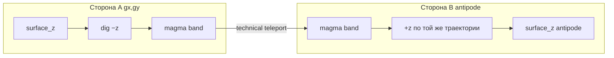

| Конcept | Правило |
|---|---|
| Движение до magma | траектория **вниз** (−z) в колонке `(gx, gy)` |
| **Пересечение magma** | **technical teleport** на **нижнем** z magma band (см. ниже) |
| После teleport | **+z** в `(gx', gy')`, старт с **`z_magma_bottom(gx', gy')`** antipode |
| `z_min` | **не** «конец планеты»; ниже `z_magma_bottom` в колонке cells **нет** |

#### Magma band: толщина и teleport (утверждено направление, edge case)

Magma — **не одна cell**, а **band** из нескольких z-уровней (как shallow terrain, но отдельный тип):

```
column (gx, gy):
  … rock …
  z_magma_top    …  } magma band (thickness ≥ 1, параметр мира)
  …              …  }
  z_magma_bottom …  }  ← deepest magma cell in this column
  (ниже — void в PK; продолжение только через antipode)
```

| Параметр | Смысл |
|---|---|
| `magma_band_thickness` | число z-слоёв magma (или `z_magma_top`…`z_magma_bottom` per column) |
| `z_magma_bottom(gx, gy)` | **нижний** z magma в колонке (max depth into planet at this xy) |
| `z_magma_top(gx, gy)` | верх magma band (граница с rock/solid выше) |

**Teleport (утверждено):** переход **с нижнего слоя magma** на стороне A **на нижний слой magma** antipode B — не с произвольной z внутри band и не «в одну cell».

```
(gx', gy') = antipode_xy(gx, gy)
z'         = z_magma_bottom(gx', gy')

teleport: (gx, gy, z_magma_bottom(gx,gy))  →  (gx', gy', z')
далее:    движение +z через magma band antipode → rock → surface antipode
```

**Пока внутри magma band (до bottom):** движение **−z** в колонке `(gx, gy)` через все magma cells сверху вниз. Teleport — см. **M-3** (movement resolver).

**Skeleton:** на каждой `(gx, gy)` и antipode `(gx', gy')` генерировать **весь magma band** (все z между top и bottom), не одну voxel.

#### M-3: movement resolver (контракт, impl ⬜)

> Детали resolver — [tz_locations.md § Magma antipode](tz_locations.md#magma-antipode-переход-через-планету-m-3). Здесь — триггер и flip ±z.

| Правило | Контракт |
|---|---|
| **Trigger teleport** | Персонаж на `(gx, gy, z_magma_bottom)` и intent **«глубже»** (Δz −1) **или** попытка шага на z без cell (void ниже bottom) → **не** ошибка pathfinding, а `magma_antipode_teleport` |
| **Teleport target** | `(gx', gy', z_magma_bottom(gx', gy'))` — bottom→bottom |
| **±z flip после teleport** | На стороне A «глубже» = **−z**. На стороне B resolver **инвертирует** vertical intent, пока `z ≤ z_magma_top(gx', gy')`: «глубже» → **+z** (к surface antipode); «выше» → **−z**. После выхода из magma band antipode — обычные правила z |
| **A\*** | Void под `z_magma_bottom` **не** edge графа; переход только через спец-правило magma |
| **LLM / UI** | Событие `magma_antipode_crossing` (from/to xy,z); narration — отдельный шаблон, не generic teleport |

**Antipode (контракт, impl TBD):**

```
(gx', gy') = antipode_xy(gx, gy, world_bounds)
```

- **v2 declared world:** противоположная точка на решётке мира (напр. отражение от центра bbox / `(gx + W/2) mod W` — фиксируется при `world_bounds`).
- **v1 anchor bbox:** antipode только если мир объявлен как **closed planet grid**; иначе magma → teleport требует v2 extent.

**Skeleton v1:** solid + **N_base band**; magma band — **опционально до M-2** (edge case, impl queue п.12).

**Закрытие edge case M-1…M-5:** antipode_xy · magma **band** on skeleton · movement: −z через band → teleport **bottom→bottom** · magma heat · v2 closed grid. Impl после TR-1 п.1–7.

**Gameplay / movement (edge case — impl ⬜):** movement resolver — M-3; terrain маркирует voxels `system_terrain: magma`.

### Terrain layers (вертикальная модель — утверждено направление)

Три **разных** семантики по z — не один monolith «subsurface»:

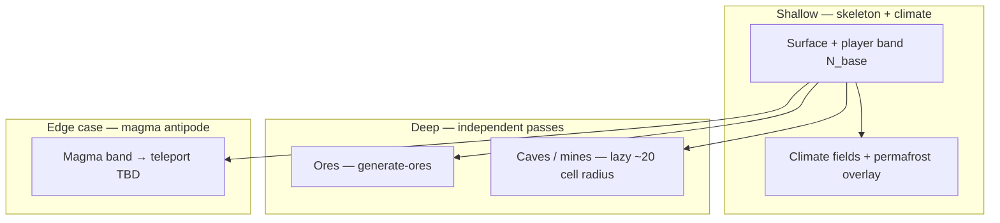

| # | Слой | Когда создаётся | Смысл | Ограничения |
|---|---|---|---|---|
| **1 Magma** *(edge case)* | skeleton *(отложено)* | Переходный band; antipode teleport | Temp ↑; см. § Planet topology | impl ⬜ M-1…M-5 |
| **2 Solid skeleton** | `generate-surface` pass 2 | surface + player/climate band + rock **до** magma band | solid only | без liquid |
| **3 Liquid** | **`generate-climate`** (вместе с climate pass) | Абстрактные **водоносные / fluid** слои (не «вода» буквально) | **Семантика от температуры:** ice / liquid / vapor / … через registry + `temperature_base` | не из `z_to_terrain`; overlay на существующие cells |
| **4 Ores** | `generate-ores` | Независимая генерация | `system_material` / deposit markers | caves не перезаписывают |
| **5 Caves** | lazy / `generate-caves` | Локально ~**20 cells** от входа | carve air/cave terrain; **cave hydrology** (подземные озёра/реки, U12) | после ores; не в magma |

**Magma band (контракт, edge case):** band **толщиной ≥1 z** ниже solid (`magma_band_thickness` / per-column top…bottom). Все cells = `system_terrain: magma`. Teleport: **`z_magma_bottom` → antipode `z_magma_bottom`**. Skeleton v1 может пропустить до M-2.

**Liquid + climate (утверждено):** liquid layer **не** на `generate-surface`; накладывается на **`generate-climate`** (или sub-pass orchestrator), потому что тип fluid **зависит от effective temperature** и правил мира (`precipitation_liquid`, registry). Shallow liquid (море, реки) — те же правила, surface z + climate.

> **Форма водоёмов (моря / озёра / реки как низины):** interim — только `z ≤ 0` overlay; **target** — отдельный домен [`tz_terrain_hydrology.md`](./tz_terrain_hydrology.md) (`HydrologyGeneratorService`, carve **до** column fill).

**Не сейчас:** полная sim магмы; soil transition node; regional shared strata (B).

### Зазоры при крутых перепадах (Δz > N)

При фиксированных N слоях ниже `surface_z` **колонка не дотягивается** до уровня низкого соседа — в PK остаются «дыры» (нет `map_cells` на промежуточных z между обрывом и подошвой соседа).

**Пример** (N=20): колонка A `surface_z=30` → заполнено z=30…10; сосед B `surface_z=5`. На A нет z=9…6 — **зазор** относительно рельефа B, если нужна сплошная подземная масса / cliff volume.

**Поэтому `generate-surface` — двухфазный внутри одного endpoint:**

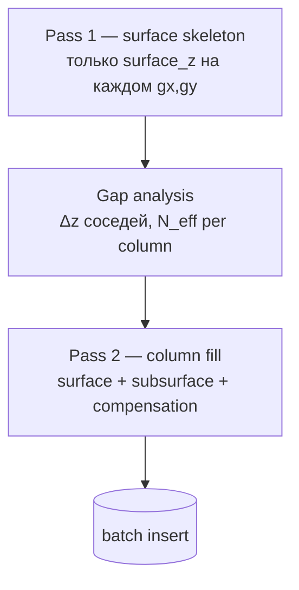

| Фаза | Выход | Зачем |
|---|---|---|
| **1 Surface skeleton** | `SurfaceHeightmap`: `surface_z[gx,gy]`, bbox, без subsurface | заранее видим все кейсы Δz > N |
| **Gap analysis** | `N_eff(gx,gy)` или явный `z_bottom(gx,gy)` | компенсация до согласованного покрытия |
| **2 Column fill** | `list[MapCell]` solid strata | детерминированная порода по z |

**Правило компенсации (утверждено):**

```
N_base = world.map_subsurface_depth ?? 0   # flat ground: one surface cell per column

# на каждой (gx, gy) после pass 1:
Δ_cliff = max(0, surface_z(gx,gy) - min(surface_z соседей))   # 4- или 8-neighborhood
N_eff   = max(N_base, Δ_cliff)   # если сосед ниже больше чем на N — углубляем колонку

z_top    = surface_z(gx, gy)
z_bottom = max(world.z_min, z_top - N_eff)

# заполнить все целые z ∈ [z_bottom, z_top] одной колонкой (PK уникален)
```

Инвариант: после pass 2 **нет «вертикальной дыры»** между `surface_z` соседних колонок, если разница высот ≤ покрытия (при необходимости `N_eff > N_base`). Cliff face на границе колонок — solid rock (`cliff` / `rock` — тип из registry, TBD).

**Лог / master preview (optional):** count ячеек с `N_eff > N_base`, max Δ_cliff — для мастера до ores/caves.

**Не в v1:** горизонтальный «мост» между далёкими колонками (только local neighborhood).

### Terrain ↔ ClimateData (разделение ответственности, физическая связь)

**Выбрано: вариант A** — terrain **физически зависит** от climate-related данных (pole field, `typical_elevation_z`, zone profile), но **модули разделены**:

| Слой | Кто | Пишет |
|---|---|---|
| Elevation bias / surface shape | terrain generator, **input:** `ClimatePoleField.sample` | `z`, base `system_terrain` (solid) |
| Player/climate band + solid to magma | terrain generator (`generate-surface`) | rock/soil до magma horizon |
| **Magma band** | terrain generator (`generate-surface`) | magma voxels; **transition**, antipode link at runtime |
| Climate fields | `ClimateOrchestrator` (`generate-climate`) | `temperature_base`, `rainfall` |
| **Liquid layer** | climate pass (same API) | fluid overlay; semantics from temp |
| **Climate → terrain overlay** | climate pass | permafrost и верхние z |
| **Ores** | `generate-ores` (independent) | deposit markers |
| **Caves / mines** | lazy ~20 radius / `generate-caves` | carve + **cave hydrology** (подземные озёра/реки, U12) |

**Не сейчас:** нода **soil transition** — отдельная фича.

**Убрано из skeleton:** `liquid_body` через `z_to_terrain` — liquid только § Terrain layers п.3.

### Ordered world generation passes (очередь)

**Очередь (строго):** `surface → ores → caves → climate` после того, как мир **объявлен** (import JSON мастером). Сборка — **только engine nodes (DAG)**; генераторы **не** вызывают соседние домены.

**Внутри `generate-surface` (target, Phase 9+ D HY):** Pass 1 → **hydrology (Pass 1.5)** → gap analysis → Pass 2 column fill. См. [`tz_terrain_hydrology.md`](./tz_terrain_hydrology.md).

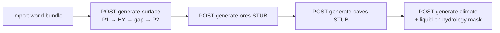

| # | Endpoint | Generator (pure) | Читает | Пишет |
|---|---|---|---|---|
| 1 | `generate-surface` | terrain passes + **hydrology (Pass 1.5)** | `World`, locations; **input:** `ClimatePoleField` от ноды | skeleton; river edges → `ConnectionPersistService` |
| 2 | `generate-ores` | `generate_ores` | `map_cells` | ore markers |
| 3 | `generate-caves` | `generate_caves` | `map_cells` | carve |
| 4 | `generate-climate` | climate passes | `map_cells` + **hydrology metadata** (`liquid_candidate`, role) | temp, rainfall, liquid |

#### Изоляция генераторов (утверждено)

| Правило | Смысл |
|---|---|
| Генераторы не знают друг о друге | нет import/call между `terrain/`, `climate/` passes, `ores`, `caves` |
| Сборка на нодах | pole → surface → persist → ores → caves → climate — deps DAG |
| Shared input | `ClimatePoleField`, bbox — **данные** в аргументах, не скрытый вызов чужого generator |
| Между pass | pass N+1 читает **DB**, не in-memory monolith |

**Код:** ✅ TR-1b (2026-06) — pole resolve в `MapCellService` / `map.py`; generator принимает `pole_field`. ⬜ `debug_settlement` pipeline — HTTP (DBG-1).

**Вне очереди materialization (другие вещи):**

| API | Смысл |
|---|---|
| `POST …/generate-z-slice` | lazy fill **одной колонки** `(gx,gy,z…)` — API ✅, engine node ⬜ |
| Lazy caves ~**20 cells** у входа | gameplay (**impl queue п.8 DEFERRED**) — **не** z-slice |

| Endpoint | Merge |
|---|---|
| `generate-surface` | upsert solid/magma |
| `generate-ores` / `generate-caves` | STUB — layer upsert |
| `generate-climate` | climate + liquid overlay |

> **Debug harness:** handlers `map/generate-*` — path **2**; **production orchestration:** ноды DAG (path **1**). См. [`tz_world_generation_dag.md`](./tz_world_generation_dag.md) § «Три входа».

`INSERT OR IGNORE` **недостаточен** для multi-pass — нужен **selective upsert** / patch по layer kind (terrain vs ore vs cave).

### Объём cells и запись в БД (рекомендация)

**Оценка объёма:**

```
cells ≈ columns × avg_depth
columns = (bbox_width × bbox_height)   # одна колонка = один (gx, gy)
avg_depth ≈ 1 + N_eff_mean             # surface + subsurface; N_eff ≥ N_base
```

Пример: bbox 200×200, N≈22 → до ~880k rows — норма для «заготовки», но не в один INSERT.

**Разделение слоёв (важно):**

| Слой | Где | Параллелизм |
|---|---|---|
| **Pure generator** | `TerrainGeneratorService` / column fill | stateless; chunk rect in → cells out |
| **Orchestrator job** | `MapCellService` / engine node | partition, workers, batch persist |
| **DB** | SQLite `map_cells` | **один writer**; batch `executemany` в транзакции |

Generator **не** знает про threads/SQL — только `(world, locations, rect, surface_heightmap?)`.

**Pass 1 (surface skeleton)** — лёгкий: держим **весь** `surface_z` grid в памяти (`int[gy][gx]`, для 500×500 ≈ 1 MB). Gap analysis — один sweep по grid (или по chunk с halo ±1 для соседей).

**Pass 2 (column fill)** — тяжёлый: **chunked** по rect без загрузки всего мира в RAM.

**Chunking (v1 impl):**

| Параметр | Рекомендация | Заметка |
|---|---|---|
| `chunk_columns` | **32×32** или **64×64** | 64×64 × depth 25 ≈ 100k cells/chunk |
| Halo | **±1 cell** при gap analysis на границе chunk | соседи для `N_eff` на edge |
| Persist | **1 transaction / N chunks** | `executemany` + selective upsert; см. § **TR-PERF** (impl ⬜) |
| Порядок chunks | row-major, deterministic | воспроизводимость |
| **Parallel v1 (текущий код)** | **нет** — sequential chunks | проще отладка; см. § «Многопоточность (TR-PAR)» |
| **Parallel v2 (target)** | `ChunkComputePool` generate + serial `save_pass` | ✅ impl — `TerrainBatchOrchestrator`, `ClimateBatchOrchestrator` |

### Многопоточность (TR-PAR)

> **Статус:** v2 ✅ chunk pool + serial persist (`ChunkComputePool`, `TerrainBatchOrchestrator`, `ClimateBatchOrchestrator`); facade `WorldSurfaceMaterializationOrchestrator`. **DAG wiring** — контракт ниже (impl ⬜).

#### Реализация (v2, код)

| Компонент | Путь | Роль |
|---|---|---|
| `MaterializationContext` | `application/worldData/materializationContext.py` | `free_cores` от caller; **TR-PERF-2:** `chunks_per_commit` (default 8); **TR-PERF-3:** `insert_only` |
| `ParallelPolicy` | `application/worldData/parallelPolicy.py` | `resolve_terrain_workers` / `resolve_climate_workers` |
| `ChunkComputePool` | `application/worldData/chunkComputePool.py` | Thread-pool generate (ProcessPool — backlog) |
| `TerrainBatchOrchestrator` | `terrainBatchOrchestrator.py` | coarse+hydro → fine chunks parallel, persist serial |
| `ClimateBatchOrchestrator` | `climateBatchOrchestrator.py` | anchor serial → weather/overlay parallel, persist serial |
| `WorldSurfaceMaterializationOrchestrator` | `worldSurfaceMaterializationOrchestrator.py` | S→CL, один `ctx` на stack |

**Debug HTTP (interim caller):** `map.py` — `resolve_materialization_context`; если query `free_cores` не передан → stub **`5`** (не probe). Production caller — **DAG** (probe, см. ниже).

#### Текущее поведение (до v2 / устаревшее описание v1)

`TerrainBatchOrchestrator._materialize_fine_tile` (legacy sequential reference):

1. macro-тайлы — **последовательно** (bootstrap: priority list; `mode=full`: весь bbox);
2. внутри тайла — `iter_meter_chunks` row-major, **32×32** fine-колонок (`terrain_chunk_columns`);
3. **v2:** `ChunkComputePool` → `generate_surface_chunk` parallel; `save_pass(terrain)` **strictly serial**;
4. **v1 (до TR-PAR):** синхронный chunk loop без pool.

`TerrainGeneratorService` — **pure sync**, без async и без знания о потоках.

#### Почему не параллелим persist

| Ограничение | Следствие |
|---|---|
| SQLite **single-writer** | параллельные `upsert` из нескольких потоков → lock contention / `database is locked` |
| SQLite **PRAGMA bulk session** | TR-PERF-4 PRAGMA только на `_bootstrap_conn`; OLTP на `_conn`; `asyncio.Lock` — § **TR-PAR-5** |
| Детерминизм smoke/regression | row-major + serial insert = воспроизводимый порядок строк |
| Отладка harness | один chunk за раз — проще bisect при битых cells |

**Инвариант v1:** не более **одного** активного terrain-writer на `world_uid`.

#### Target v2 — разделение generate / persist

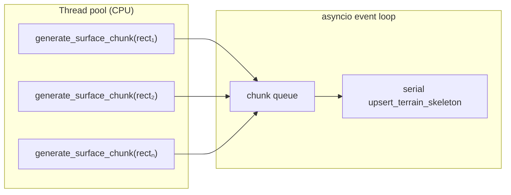

| Слой | Параллелизм v2 | Заметка |
|---|---|---|
| Pass 1 coarse + hydrology planning | **serial** | один `surface_z` / `coarse_hydro` на весь planning scope |
| Gap analysis (`N_eff`) | **serial per tile** | нужен полный `surface_z` тайла (или halo ±1 на границе chunk — допустимо) |
| Pass 2 column fill | **parallel** по `ColumnRect` | `ChunkComputePool` + `ThreadPoolExecutor` (ProcessPool — backlog при GIL) |
| Persist terrain | **strictly serial** | один writer; `save_pass(terrain)` под lock / single consumer |
| Climate cell weather + liquid overlay | **parallel batches** | `ClimateBatchOrchestrator`; persist climate serial |
| Climate pole + anchor | **serial** | global fields / surface index |

**Worker contract:** `(world_uid, rect, heightmap_blob, n_eff_rect, hydrology_rect) → list[MapCell]` — без repos, без RNG от порядка chunk (seed = `f(world_uid, gx, gy, pass_id)`).

**Orchestrator contract (batch facades, не generators):**

- caller передаёт **`MaterializationContext(free_cores=…)`** — число ядер под **generate** (не persist);
- `ParallelPolicy.resolve_*_workers(ctx, world)` → eff из `min(free_cores, parallel_workers_override?, world.terrain_parallel_workers?, world.climate_parallel_workers?)`, clamp ≥ 1;
- `ChunkComputePool(workers)` — partition rects / cell batches → parallel sync compute;
- persist — **один** serial path: `await map_cell_service.save_pass(...)` (bounded in-flight chunks ≈ `2 × workers`);
- progress (debug): `{chunks_done, chunks_total}` в HTTP response; SSE / `job_id` — backlog.

**Инвариант:** `TerrainGeneratorService` / climate passes **не** probe CPU — только orchestrator + `ParallelPolicy`.

#### DAG — передача `free_cores` (утверждено, impl ⬜)

> См. также [`tz_world_generation_dag.md`](./tz_world_generation_dag.md) § «MaterializationContext».

**Кто probe:** **один раз** на входе materialization subgraph (gate-нода или wrapper до `generate_surface`), **не** каждая pass-нода и **не** generators.

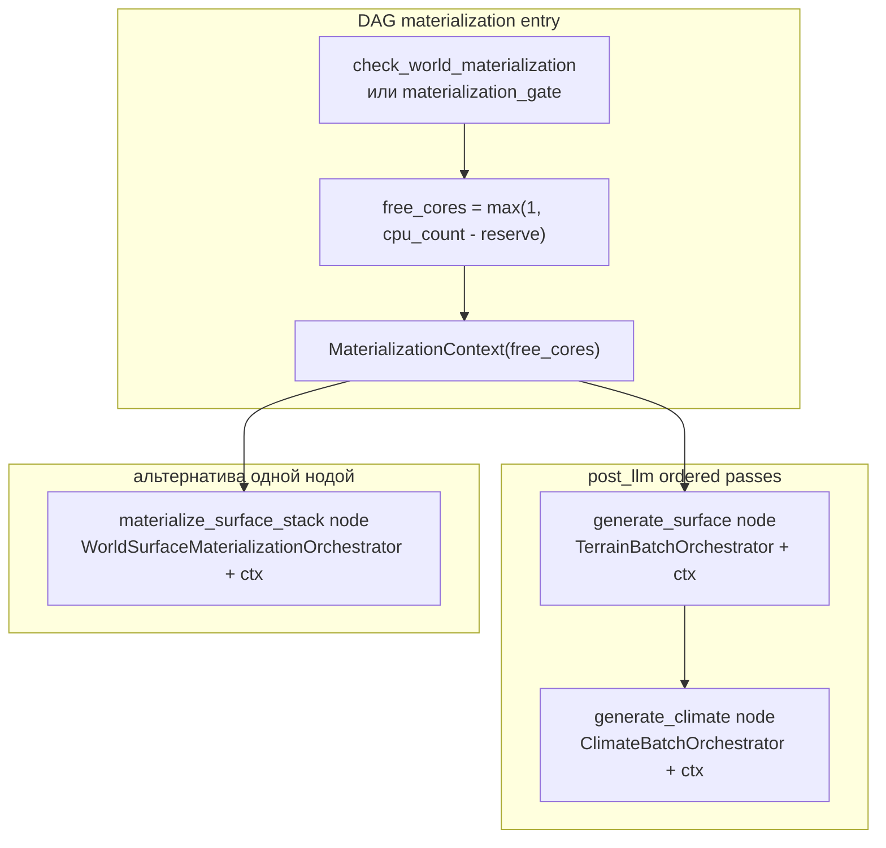

| Правило | Смысл |
|---|---|
| **Один `ctx` на run** | Весь S→CL (или S→O→C→CL) в одном materialization run делит **тот же** `MaterializationContext` |
| **Где хранить между нодами** | `ExecutionState` / `context["materialization_ctx"]`, выставляет gate; downstream ноды **читают**, не пересчитывают `cpu_count` |
| **`reserve`** | ≥ 1 для FastAPI/asyncio event loop; точное значение — настройка engine (не world row) |
| **World caps** | `terrain_parallel_workers`, `climate_parallel_workers` на `worlds` — верхняя граница поверх `free_cores` |
| **Debug override** | Query `parallel_workers` на HTTP — **только debug**; DAG **не** использует query override |
| **Не путать с DAG levels** | `asyncio.gather` на **разных нодах** DAG (chat orchestration) ≠ TR-PAR chunk pool внутри `generate_surface` |

**Target wiring нод (после gate G5 — только с мастером):**

| Node id | Вызывает (target) | `ctx` |
|---|---|---|
| `generate_surface` | `TerrainBatchOrchestrator.save_terrain_batch(..., ctx)` | из gate / parent |
| `generate_climate` | `ClimateBatchOrchestrator.apply_climate_batch(..., ctx)` | **тот же** объект, что surface |
| `materialize_surface` (optional) | `WorldSurfaceMaterializationOrchestrator.materialize_surface_stack(..., ctx)` | gate создаёт; одна нода на весь S→CL |

**Текущий код DAG (interim):** `GenerateClimateNode` ещё вызывает `ClimateOrchestratorService.apply_climate_pass` без `ctx` — **миграция** на `ClimateBatchOrchestrator` + shared `MaterializationContext` в backlog DAG.

**Debug vs DAG:**

| Caller | `free_cores` |
|---|---|
| `POST …/map/generate-*`, `materialize-stack` | stub `5` если query не передан; иначе query |
| Engine DAG (production) | `max(1, os.cpu_count() - reserve)` на gate |

#### Bootstrap и macro-тайлы

| Уровень | v1 | v2 (рекомендация) |
|---|---|---|
| Несколько bootstrap-тайлов | serial | **optional** parallel tiles — только если RAM позволяет (один fine-тайл `cell_m=3000` ≈ сотни MB heightmap + сотни M cells) |
| Chunks внутри одного тайла | serial | **parallel generate**, serial persist |
| `materialize-tile?gx=&gy=` | один тайл, serial | тот же chunk pool |

**Практика для `map_cell_size_m=3000`:** параллелить **chunks внутри тайла**, не весь bbox; bootstrap `max_tiles` ограничивает число тайлов.

#### Что не параллелить

- Coarse hydrology `apply` до fine materialize (единый `coarse_hydro` index).
- Declared meter river carve с глобальным merge в один проход (или partition по basin с merge barrier).
- `generate-climate` liquid overlay — parallel batches в `ClimateBatchOrchestrator` (pole/anchor serial); см. [`tz_climate.md`](./tz_climate.md) § CL-PAR.
- DAG `asyncio.gather` на **разных нодах** — оркестрация чата, не substitute для TR-PAR chunk pool **внутри** `generate_surface`.

#### Impl queue

| ID | Задача | Статус |
|---|---|---|
| **TR-PAR-1** | Chunk pool: `ChunkComputePool` + serial persist in `TerrainBatchOrchestrator` | ✅ |
| **TR-PAR-2** | Progress `{chunks_done, chunks_total}` in debug API response | ✅ |
| **TR-PAR-3** | `MaterializationContext.free_cores` + `terrain_parallel_workers` cap + API override | ✅ |
| **TR-PAR-4** | Stress test: bootstrap 1 tile, `cell_m=3000`, workers=4 vs serial | ⬜ |
| **TR-PAR-5** | Bootstrap DB connection: `_bootstrap_conn` + lock; PRAGMA на bootstrap conn | ✅ |
| **TR-PAR-6** | `BootstrapMapCellWriter` — explicit bulk persist port; убрать ContextVar routing | ✅ |
| **TR-PAR-DAG-1** | Gate probe `free_cores` → `context["materialization_ctx"]`; ноды `generate_surface` / `generate_climate` → batch orchestrators + shared `ctx` | ⬜ **gate** — только с мастером |

#### TR-PAR-5 — Bootstrap DB connection

> **Проблема:** TR-PERF-4 менял PRAGMA на единственном shared connection (§ TR-PERF-DEBT-2). **v1 (interim):** ContextVar routing на `db.conn` — superseded **TR-PAR-6**.

**Постоянная часть (impl):** [`Database`](backend/app/db/database.py) — два connection к одному файлу:

| Connection | PRAGMA | Назначение |
|---|---|---|
| `_conn` (main) | WAL + `foreign_keys` | OLTP: chat, CRUD, gameplay reads |
| `_bootstrap_conn` | + `synchronous=NORMAL`, `temp_store=MEMORY`, `cache_size=-64000` (один раз в `connect`) | bulk materialize через **TR-PAR-6** writer |

**Контракт v2 (TR-PAR-6):** `bulk_write_lock()` — только `asyncio.Lock`; repos получают `bootstrap_conn` **явно** через `BootstrapMapCellWriter`, не через `db.conn` magic.

**Приёмка PAR-5:** dual conn + lock + WAL visibility (см. `test_database_bootstrap_conn.py`).

#### TR-PAR-6 — BootstrapMapCellWriter

> **Проблема:** TR-PAR-5 v1 routing через `ContextVar` — неявный контракт (ambient conn). **Решение:** typed writer port.

**Файл:** [`bootstrapMapCellWriter.py`](backend/app/application/worldData/bootstrapMapCellWriter.py)

| Метод | Контракт |
|---|---|
| `session(*, enabled=True)` | `Database.bulk_write_lock()`; yield `self` |
| `write_terrain(cells, *, insert_only)` | INSERT или upsert на `bootstrap_conn` |
| `write_terrain_chunk_batch(chunks, *, insert_only)` | TR-PERF-2: одна txn на batch чанков |
| `write_climate(cells)` | `upsert_climate_fields` на `bootstrap_conn` |

**Границы:**

| Путь | Persist |
|---|---|
| `materialize-stack` | `BootstrapMapCellWriter` |
| OLTP (`save_z_slice`, lazy, settlement, debug) | `MapCellService` → `main_conn` |

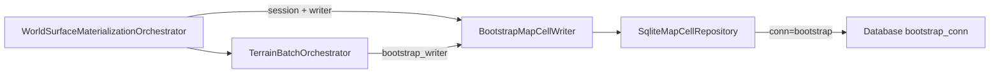

**Инварианты:** `insert_only` resolve до session; writer не трогает `main_conn`; один active lock.

**Приёмка:**

| ID | Критерий |
|---|---|
| PAR-6-1 | materialize не использует ContextVar / ambient `db.conn` routing |
| PAR-6-2 | `write_terrain` на bootstrap conn; main conn PRAGMA стабилен |
| PAR-6-3 | WAL: bootstrap writes видны с `main_conn` |

**Связь:** закрывает TR-PAR-DEBT-1; частично TR-PERF-DEBT-3/6.

--- 

**Приёмка v2:** тот же `world_uid` + seed → **идентичный** набор `(x,y,z, system_terrain, hydrology)` после serial v1 и parallel v2 (order-independent compare).

**Порог «всё в одном batch»:** если `columns × (1+N_base) < ~50_000` — можно один generate + один insert (малые миры / test); parallel v2 **не обязателен**.

**Progress UX (позже):** job id + `{chunks_done, chunks_total, cells_written}`; опционально SSE.

**Детерминизм:** RNG seed = `f(world_uid, gx, gy, pass_id)` — chunk order не влияет на содержимое ячеек.

**Lazy / v2 declared world:** тот же chunk API; eager прогоняет все chunks bbox/world_bounds, lazy — scene volume / column (§ **TR-LAZY-LOAD**).

### World Pack storage (TR-PACK) — target persist

> **Статус:** pack L0 + entry L2 — ✅ path; **light / full / detailed** bake API — ✅; climate fine на detailed — ✅ (tile fine + L2 z). **Продуктовое ТЗ:** [`tz_world_pack_storage.md`](./tz_world_pack_storage.md). **TR-PERF** (ниже) — interim на `map_cells`; для wilderness skeleton **заменяется** TR-PACK.

**Цель:** cold load ≤ 5 min; master offline bake (light / full / detailed) + lazy дозаполнение, если pack partial.

| Было | Станет |
|---|---|
| wilderness terrain → `map_cells` INSERT | **L0/L2** → World Pack (zstd tiles) |
| gameplay patches → `map_cells` | **`map_cell_patches`** SQLite |
| eager full bbox fine grid на bake | **LOD:** L0 world map + L1 pins; **L2** = refine L0 (detailed / entry-first) |

**LOD bake:** § Идея 1 + § Идея 2; `world_map_cells_per_tile = 32` (WP-10). Wire/API modes — ниже § **Bake modes (locations)**. Pack orchestration — [`tz_world_pack_storage.md`](./tz_world_pack_storage.md); L0 compose — [`tz_map_light_bake.md`](./tz_map_light_bake.md).

### Bake modes (locations) — terrain + hydrology + climate

> **Утверждено 2026-07-15.** Три **master/offline** режима генерации поверхности локаций. Runtime background (rings / path) — отдельно, не четвёртый offline case.

| Термин | LOD | Pipeline | Scope |
|---|---|---|---|
| **light_bake** | L0 (+ climate coarse) | surface → hydrology mask → climate coarse на light canvas | Priority tiles: spawn + **subset** named_locations (+ declared hydro). Cap: `PackBakeDefaults.max_tiles_light` |
| **full_bake** | L0 (+ climate coarse) | **Тот же** L0 pipeline, что light_bake | **Все** macro-tiles, покрывающие `named_locations` (без location cap). Hydro/coast tiles — как в bootstrap priority, без artificial cap по локациям |
| **detailed_bake** | L2 `location_terrain` | refine L0 → fine terrain (+ hydro constraints из parent light) + climate fine по territory | **Одна** `location_uid` |

**Инварианты генераторов (все три режима):**

1. Generators pure: materialize geometry/masks; persist — Pack writer / orchestrator ([`layer-boundaries.mdc`](../.cursor/rules/layer-boundaries.mdc)).
2. L2 **не** invents world-map rivers/coast — только refine parent light ([`tz_world_pack_storage.md`](./tz_world_pack_storage.md) § Идея 2; hydrology — [`tz_terrain_hydrology.md`](./tz_terrain_hydrology.md)).
3. Base climate на pack-мире — только через bake; `POST generate-climate` → 422 ([`tz_climate.md`](./tz_climate.md) § World Pack climate).

#### Offline completeness (master package)

| Case | Pack state | Игрок получает |
|---|---|---|
| **1. light_bake complete** | L0 на priority subset; `locations_index` pins | World map с дырами вне P0; L2 — lazy / detailed |
| **2. full_bake complete** | L0 на **все** location tiles (+ hydro as scoped) | Сплошная world map по локациям; L2 всё ещё lazy, если не было detailed |
| **3. full + all detailed_bake complete** | (2) + `location_terrain` на **каждую** pin-локацию | Тёплый старт по локациям; wilderness L2 rings — всё ещё runtime/optional |

**Partial pack — норма:** отсутствие prebake **не** ломает игру; ломает отсутствие resume / lazy path.

| Нехватка | Дозаполнение |
|---|---|
| Missing L0 location tiles (case 1 → 2) | **full_bake** (или incremental full resume) |
| Missing `location_terrain` для uid | **detailed_bake(uid)** offline **или** entry-first / location_entry в runtime (WP-13) |
| Missing wilderness fine chunks | Runtime rings / path queue — **не** обязательный offline case 3 |

#### Detect (нужно для resume)

`tiles_pct` по-прежнему = ready/total **среди manifest.tiles** (после light часто 100%). Offline case — отдельно: `pack_completeness` в `GET …/loading-progress` (`PackCompletenessClassifier`).

| Сигнал | light_complete | full_complete | full_detailed_complete |
|---|---|---|---|
| L0 baked ⊇ expected_light (P0+cap) | ✅ | — | — |
| L0 baked ⊇ expected_full (все location tiles) | — | ✅ | ✅ |
| `location_terrain` готов для всех pins в `locations_index` | — | — | ✅ |

Wire/API и классификатор — [`tz_world_pack_storage.md`](./tz_world_pack_storage.md) § **Bake modes** / § **Pack completeness**. Auto-resume loop (classify → bake) — caller; incremental skip existing L0 на full — ⬜.

#### Impl status (generators path)

| Mode | Status |
|---|---|
| light_bake | ✅ `POST …/map/pack/bake?mode=light` |
| full_bake | ✅ `mode=full` — тот же L0 orchestrator, все location tiles (+ hydro scope) |
| detailed_bake | ✅ `mode=detailed&location_uid=` — L2 territory refine + climate fine (pole+local, L2 z); `l.*.climate.zst` optional v2 |

### Persist performance (TR-PERF)

> **Статус:** ✅ TR-PERF-1…4 impl. **Scope:** bootstrap / `materialize-stack` / `save_terrain_batch` — **не** gameplay patch, **не** parallel persist.

**Проблема (код сейчас):** `SqliteMapCellRepository._upsert_partial` — цикл `execute` **на каждую ячейку** + `commit` после каждого чанка (~21k rows × ~8k commits на тайл 3000×3000 м).

**Цель:** init мира — быстрый bulk-write при сохранении инвариантов TR-PAR (один writer, serial persist, детерминизм содержимого ячеек).

#### TR-PERF-1 — `executemany` в транзакции

| Слой | Контракт |
|---|---|
| `SqliteMapCellRepository._upsert_partial` | один SQL-шаблон; `conn.executemany(sql, rows)`; **не** N×`execute` |
| `insert_bulk_ignore` | то же — `executemany` для lazy/minimal batch |
| Commit | только при выходе из транзакции (см. TR-PERF-2), если не вложенный `Database.transaction()` |

**Sub-batch (опционально):** при `len(cells) > 50_000` — несколько `executemany` по 2–5k строк **внутри одной** транзакции (лимит RAM / WAL).

**Selective upsert** — без изменений: `ON CONFLICT … DO UPDATE SET system_terrain = … WHERE system_building_element IS NULL`.

#### TR-PERF-2 — реже коммитить (multi-chunk transaction)

| Параметр | Default | Где |
|---|---|---|
| `chunks_per_commit` | **8** | `MaterializationContext` или константа orchestrator |
| Область транзакции | до **N** последовательных terrain-chunks (row-major) | `TerrainBatchOrchestrator._materialize_fine_tile` persist loop |
| Commit | 1× на N chunks (~8 × ~21k ≈ **168k rows** при `chunk_columns=32`) | `MapCellService.bulk_persist_session()` → `_in_transaction` |

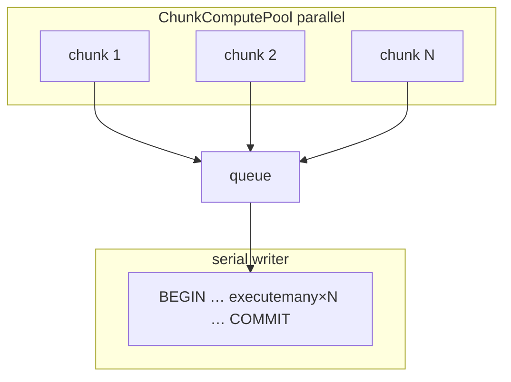

**Не делать:** одна транзакция на весь тайл 3000×3000 (≈189M rows) — риск WAL/RAM/rollback.

**Режим regen** (поверх существующих cells): тот же `executemany` + upsert; `chunks_per_commit` можно уменьшить (4) для короче lock.

#### TR-PERF-3 — init fast path (опционально, после PERF-1/2)

| Условие | SQL | Когда |
|---|---|---|
| `map_cells` для `world_uid` **пуст** (post-clear import) | plain `INSERT` / `executemany` без `ON CONFLICT` | первый `materialize-stack` |
| cells уже есть | `upsert_terrain_skeleton` (selective) | regen, climate overlay, patch |

Флаг: `MaterializationContext.insert_only` — `null` → auto по `has_world_cells`; `true`/`false` — явный override caller.

#### TR-PERF-4 — PRAGMA bulk session

На время `materialize_surface_stack` (один job): `synchronous=NORMAL`, `cache_size=-64000`, `temp_store=MEMORY`. Восстановление PRAGMA на выходе. Query `bulk_pragmas=false` отключает. **Не** `synchronous=OFF`.

#### Приёмка TR-PERF

| ID | Критерий |
|---|---|
| PERF-1 | `_upsert_partial` / `insert_bulk_ignore` используют `executemany` |
| PERF-2 | init tile: commits ≤ `ceil(chunks_total / chunks_per_commit)` |
| PERF-3 | Тот же world+seed → идентичный cell set до/после (как TR-PAR v2) |
| PERF-4 | Smoke: 1 bootstrap tile, `map_cell_size_m=1000`, persist быстрее serial execute (benchmark в TR-PAR-4) |

| ID | Задача | Статус |
|---|---|---|
| **TR-PERF-1** | `executemany` в `_upsert_partial` + `insert_bulk_ignore` | ✅ |
| **TR-PERF-2** | `bulk_persist_session` + `chunks_per_commit` в materialization | ✅ |
| **TR-PERF-3** | `insert_only` fast path для пустого `world_uid` | ✅ |
| **TR-PERF-4** | PRAGMA bulk session на `materialize-stack` | ✅ |

#### TR-PERF backlog (architecture debt)

> Impl TR-PERF-1…4 ✅; ниже — **не блокирует** debug bootstrap. См. также registry [`tz_generator_technical_debt.md`](./tz_generator_technical_debt.md) (TR-6, TR-7).

| ID | Severity | Проблема | Target fix | Код (ссылка) |
|---|---|---|---|---|
| **TR-PERF-DEBT-1** | medium | `MaterializationContext` смешивает caller input (cores), persist tuning (`chunks_per_commit`, PRAGMA), resolved state (`insert_only`) | Split: `MaterializationCallerInput` + `ResolvedMaterializationJob` или вынести persist в `PersistPolicy` / `TerrainPersistScope` | `materializationContext.py` |
| **TR-PERF-DEBT-2** | high (prod) | `Database.bulk_write_session` менял PRAGMA на shared connection | **TR-PAR-5** ✅ | `database.py` |
| **TR-PERF-DEBT-3** | medium | `insert_terrain_bulk` — blind `INSERT` без guard `system_building_element IS NULL`; explicit `insert_only=true` на непустом мире → PK error или перезапись | `TerrainPersistScope.BOOTSTRAP_EMPTY` + validate caller; отдельный `save_terrain_bootstrap()` вместо флага на `save_pass` | `mapCellService.save_pass`, `insert_terrain_bulk` |
| **TR-PERF-DEBT-4** | medium | Три insert-пути terrain (см. § **Insert path matrix** ниже) — исторически разные scope, сейчас дублируют executemany SQL | Единый `bulk_insert_cells(mode)` + scope enum; см. TR-7 | `mapCellRepository`, `mapCellService` |
| **TR-PERF-DEBT-5** | low | `bulk_write_session` на `IMapCellRepository` — infra SQLite, не домен map_cells | **TR-PAR-5** ✅ — только `Database` | `iMapCellRepository.py` |
| **TR-PERF-DEBT-6** | low | `WorldSurfaceMaterializationOrchestrator` получает `MapCellService` повторно (уже внутри `TerrainBatchOrchestrator`) | **TR-PAR-6** partial — writer для persist; `MapCellService` только probes | `worldSurfaceMaterializationOrchestrator.py` |
| **TR-PAR-DEBT-1** | medium | ContextVar ambient conn routing на `db.conn` (TR-PAR-5 v1) | **TR-PAR-6** ✅ — `BootstrapMapCellWriter` + explicit `conn` | `database.py`, repos |

##### Insert path matrix (почему три пути)

Три метода — **не случайное дублирование**, а три разных **persist scope** из § Persist cycle:

| Repo method | SQL | Service entry | Scope (ТЗ) | Семантика при конфликте PK |
|---|---|---|---|---|
| `insert_bulk_ignore` | `INSERT OR IGNORE` | `save_generated` | `minimal_repair` — lazy anchor, 1 cell | **Тихий skip** — idempotent repair, ячейка уже есть |
| `insert_terrain_bulk` | plain `INSERT` | `save_pass(terrain, insert_only=True)` | `surface_skeleton` bootstrap на **пустом** `world_uid` | **Ошибка** (PK violation) — caller обязан гарантировать пустоту |
| `upsert_terrain_skeleton` | `INSERT … ON CONFLICT DO UPDATE` + `WHERE building IS NULL` | `save_pass(terrain)` | regen / partial tile / climate overlay base | **Selective merge** — не трогает building cells |

**Почему не один метод:** `OR IGNORE` скрывает баги bootstrap (думали вставили 21k, вставили 0). Plain `INSERT` быстрее upsert на пустой таблице (TR-PERF-3). Selective upsert нужен при regen поверх settlement/structure.

**Почему smell остаётся:** все три строят SQL из `to_row` + `executemany` вручную; отличается только шаблон SQL. TR-PERF-DEBT-4 — конвергенция в один helper с `BulkInsertMode` enum, не слияние семантики в один SQL.

**DAG bypass:** `lazy_terrain` / `lazy_settlement` вызывают `map_cell_repo.insert_bulk_ignore` **напрямую**, минуя `MapCellService` — четвёртый вход в тот же путь (gate; агент не трогает ноды).

##### TR-PERF-DEBT-2 — PRAGMA на shared connection (история)

> **Target fix:** § **TR-PAR-5**. Ниже — описание проблемы до impl.

`Database` — singleton, одно `aiosqlite` соединение на процесс. `bulk_write_session` на время job выполнял:

```
PRAGMA synchronous=NORMAL
PRAGMA temp_store=MEMORY
PRAGMA cache_size=-64000
```

и восстанавливает прежние значения в `finally`.

**Риск:** FastAPI обрабатывает запросы конкурентно на одном event loop. Два overlapping `materialize-stack` (или materialize + обычный import):

1. Job A сохраняет PRAGMA, ставит NORMAL.
2. Job B сохраняет PRAGMA (уже NORMAL), ставит NORMAL.
3. Job A завершается, **восстанавливает** старые PRAGMA.
4. Job B ещё пишет bulk, но PRAGMA уже сброшены Job A → непредсказуемая durability / perf.

Для **single-user debug** риск низкий. Закрывается **TR-PAR-5** (bootstrap connection + lock).

---

### Gameplay load (TR-LAZY-LOAD)

> **Статус:** ⬜ impl. **Scope:** DAG `check_terrain` / `eager_terrain` / `lazy_terrain` + `MapCellService` read path. HTTP `POST generate-z-slice` уже есть — gameplay должен использовать тот же контракт через service/repo.

**Проблема (код сейчас):**

| Узел | Сейчас | Почему плохо |
|---|---|---|
| `check_terrain` | `has_cells_for_location(location_uid)` | после `materialize-stack` wilderness cells **без** `location_uid` → ложный `has_terrain=False` |
| `eager_terrain` | `get_by_location(location_uid)` | для **blocking** сцены — не scene volume / не «со стороны игрока»; для **фона** соседних локаций — OK (оставить) |
| `lazy_terrain` | `generate_minimal` (1 anchor) | repair OK; не подгружает колонку / scene volume |

#### Scene volume — что грузить в gameplay

**Единица blocking-запроса:** 3D bbox в **meter grid** `(world_uid, x±R, y±R, z_lo…z_hi)` — **со стороны игрока** (entry / ноги), не весь мир.

**Два режима загрузки локации (утверждено):**

| Режим | Единица | Когда |
|---|---|---|
| **Blocking** | `get_scene_volume` / refine от стороны входа | активная сцена игрока — ≤ **10 s** |
| **Фон** | `get_by_location(location_uid)` (вся локация / location terrain blob) | prefetch **соседних** локаций; не блокирует ход |

`get_by_location` **оставить** для фона. Blocking path **не** ждёт полный `location_uid`.

| Параметр | Default | Источник |
|---|---|---|
| `scene_xy_radius` | **20** | `SceneVolumePolicy` (`dataModel/terrain/sceneVolumePolicy.py`) |
| `scene_z_below` | `N_base(world)` | `worldMapSettings.n_base` — subsurface под ногами |
| `scene_z_above` | **6** | от `map_z` вверх (`SceneVolumePolicy.scene_z_above`) |
| `background_expand_radius_m` | **60** | WP-13 / WP-PERF-10: фон enqueue rings, не весь tile |

Центр blocking: `(check_terrain.map_x, map_y, map_z)` из сцены / entry point.

```python
# MapCellService — target API
async def get_scene_volume(
    world_uid: str,
    x: int, y: int, z: int,
    *,
    xy_radius: int = SceneVolumePolicy.canonical_defaults().scene_xy_radius,
    z_below: int | None = None,
    z_above: int = SceneVolumePolicy.canonical_defaults().scene_z_above,
) -> list[MapCell]:
    z_lo = z - (z_below if z_below is not None else n_base(...))
    z_hi = z + z_above
    return await repo.get_z_slice(world_uid, x - R, x + R, y - R, y + R, z_lo, z_hi)
```

**Repo:** `get_z_slice` — PK `(world_uid,x,y,z)`; для bbox запрос достаточен. Индекс `idx_map_cells_location_z` — для settlement-by-location, **не** для wilderness scene load.

#### Проверка «terrain есть»

```python
async def has_column_cells(world_uid: str, x: int, y: int) -> bool:
    """Есть ли хотя бы одна cell в колонке (x,y) — materialized skeleton."""
```

`check_terrain.has_terrain` = `has_column_cells(world, map_x, map_y)` **OR** `has_cells_for_location` (indoor / settlement tagged).

#### Target flow — eager (cells уже в БД)

```
check_terrain → has_terrain=True
eager_terrain → MapCellService.get_scene_volume(world_uid, map_x, map_y, map_z)
terrain_context → cells в shared_context
```

#### Target flow — lazy (колонка пуста, wilderness)

```
check_terrain → has_terrain=False
lazy_terrain:
  1. column = get_z_slice(… одна колонка x,y, z_min…z_max)
  2. if пусто → TerrainGeneratorService.generate_z_slice(…) 
     → MapCellService.save_pass(terrain)  # executemany, 1 commit
  3. else → get_scene_volume(…)  # идемпотентно
  4. if всё ещё пусто → fallback generate_minimal (orphan repair)
```

**`generate_minimal`** остаётся для **orphan location** (нет geometry вообще), не заменяет z_slice для materialized мира.

#### Persist в lazy path

| Scope | Метод | Batch |
|---|---|---|
| `z_slice` | `save_pass(terrain)` | `executemany`, **1 commit** на колонку (~21 cell) |
| `minimal_repair` | `insert_bulk_ignore` | `executemany`, 1 commit |

#### Приёмка TR-LAZY-LOAD

| ID | Критерий |
|---|---|
| LAZY-1 | После `materialize-stack` — `get_scene_volume` через service/debug возвращает > 1 cell |
| LAZY-2 | Пустая колонка — `save_z_slice` / service persist + reload volume |
| LAZY-3 | Orphan — `generate_minimal` (1 cell), без регрессии |
| LAZY-DAG | Ноды terrain chain — **после gate**; приёмка та же, через gameplay DAG |

| ID | Задача | Статус |
|---|---|---|
| **TR-LAZY-LOAD-1** | `has_column_cells` + `get_scene_volume` в repo/service | ✅ |
| **TR-LAZY-LOAD-2** | Debug HTTP `GET has-column` / `scene-volume` + unit tests | ✅ |
| **TR-LAZY-LOAD-DAG** | `check_terrain` / `eager_terrain` / `lazy_terrain` → service API | ⬜ **gate** — только с мастером, после G1–G5 ([`tz_world_generation_dag.md`](./tz_world_generation_dag.md) § Gate) |

**DAG-ноды:** агент **не трогает** `application/engine/nodes/`. Контракт service/repo + debug HTTP — **до** gate; wiring в gameplay — **только совместно с мастером** после полного тестирования генераторов (TR-PERF, TR-LAZY-LOAD-1/2, D HY smoke, TR-PAR-4).

### Impl queue (код vs утверждённое ТЗ)

| # | Задача | Статус |
|---|---|---|
| 1 | Вынести heightmap/strata в `generators/terrain/` | ✅ |
| 2 | `generate-surface` = terrain only (без climate fields) | ✅ |
| 3 | `POST generate-climate` (orchestrator on existing cells) | ✅ |
| 4 | Subsurface **N_base** + **A** + `N_eff`; magma band + **antipode** contract | ✅ core; magma optional |
| 5 | Two-phase skeleton inside `generate-surface` | ✅ |
| 6 | `generate-ores` (independent) + `generate-caves` stubs | ✅ **STUB** |
| 7 | `generate-climate`: fields + **liquid layer** (not separate liquid endpoint) | ✅ |
| 8 | Lazy caves/mines ~20 cell radius | ⬜ **DEFERRED** gameplay (≠ z-slice) |
| 9 | Убрать `liquid_body` из skeleton `z_to_terrain` | ✅ |
| 10 | Chunk orchestration MapCellService | ✅ |
| 11 | `world_bounds` v2 | ✅ |
| 12 | **Edge case M-1…M-5:** magma band + antipode teleport + movement | ✅ skeleton + `antipode_xy`; M-3 movement ⬜ |
| 13 | **TR-PAR** — parallel chunk generate + serial persist (§ «Многопоточность»); DAG `free_cores` — TR-PAR-DAG-1 | ✅ HTTP; ⬜ DAG (**gate**) |
| 14 | **TR-PERF** — `executemany` + multi-chunk commit на init (§ TR-PERF) | ✅ |
| 15 | **TR-LAZY-LOAD** — scene volume load + z_slice lazy path (§ TR-LAZY-LOAD) | ✅ service; ⬜ DAG |

---

## План реализации (код → ТЗ)

> **Статус:** ✅ **Фазы 0–8** (generators + debug API) — 2026-06.  
> **Дальше без DAG:** § Phase 9+ блок «Сейчас». **Engine DAG / ноды** — см. [`tz_world_generation_dag.md`](./tz_world_generation_dag.md) § **Gate: DAG** (только с мастером, после полного теста генераторов).

### Принципы исполнения

1. **Generators first, DAG last** — pure generators до полной цепочки нод.
2. **`generate-surface` без climate fields** — `temperature_base` / `rainfall` только на `generate-climate`.
3. **Two-phase skeleton обязателен** — Pass 1 `surface_z`, gap `N_eff`, Pass 2 column fill.
4. **Multi-pass persist** — selective upsert по layer kind; не `INSERT OR IGNORE` для regen skeleton.
5. **Magma M-1…M-5** — после core (Фазы 0–4); не блокирует split climate.

### Фазы

| Фаза | Содержание | Impl queue | Приёмка |
|---|---|---|---|
| **0** | Модуль `generators/terrain/`; перенос surface/bbox/noise/terrainZ | п.1, часть п.9 | `surfacePass` → `SurfaceHeightmap`; climate heightmap compat |
| **1** | gap + column fill; `map_subsurface_depth`; split `generate-surface` | п.2, п.4 (без magma), п.5 | несколько z на колонку; без climate на surface |
| **2** | `upsert_terrain_skeleton`; `save_terrain_batch` 32×32 | п.10 | regen skeleton без затирания building cells |
| **3** | `POST generate-climate`; liquid overlay | п.3, п.7, п.9 | liquid только после climate pass |
| **4** | `POST generate-ores` / `generate-caves` stubs + merge | п.6 | S → O → C → CL; cave не затирает ore |
| **5** | `generate_z_slice` API + repo `get_z_slice` | *(не impl queue п.8)* | lazy column; engine node ⬜ |
| **6** | `world_bounds` v2 extent | п.11 | skeleton на declared bounds |
| **7** | Magma band + `antipode_xy` (M-1…M-5) | п.12, TR-M | STUB; M-3 movement DEFERRED |
| **8** | DAG: `generate_climate`, … | tz_climate § DAG | ✅ зарегистрировано; **новые ноды / wiring — отложено** (см. § Phase 9+) |

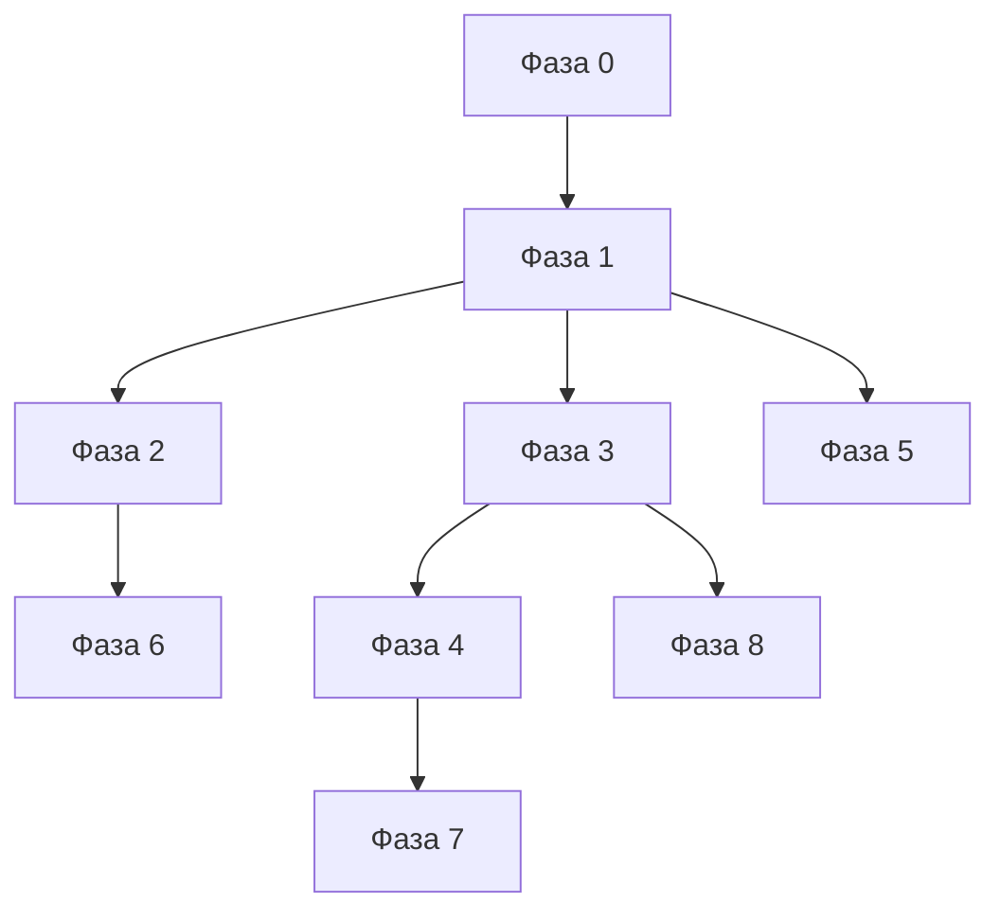

### Материализация мира (очередь passes)

**Target:** игрок загрузил мир → engine DAG прогоняет **S → O → C → CL**, если skeleton/climate ещё нет.

Pass-идентификаторы — те же шаги, что DAG; debug-дубликаты в `map.py` (см. § Роли):

```
POST …/map/generate-surface   ← debug harness only
POST …/map/generate-ores      → STUB
POST …/map/generate-caves     → STUB
POST …/map/generate-climate   ← debug harness only
```

Regen: clear map → снова **S → O → C → CL**.

### Definition of Done

- [x] Очередь **S → O → C → CL** (generators + debug handlers / DAG target)
- [x] Impl queue п.1–11; п.12 partial; п.8 DEFERRED
- [x] TR-1 closed в `tz_generator_technical_debt.md`
- [x] Phase 9+ «Сейчас» — TR-1b, DBG-1 (§ ниже)
- [ ] Phase 9+ **D HY** — surface hydrology H-1…H-7a (§ ниже; **до DAG**)
- [ ] Phase 9+ «DAG» — **gate**; снятие только мастером после полного теста генераторов

---

## Phase 9+ — план (2026-06)

> **Baseline:** generators + `map.py` debug harness ✅.  
> **Решение:** **engine DAG и ноды не трогаем** до gate (§ Gate в `tz_world_generation_dag.md`): полное тестирование генераторов + **явное** снятие gate **мастером**. Сейчас — generators, persist, debug API, smoke-скрипты.  
> **Следующий блок до DAG:** **D HY** — surface hydrology ([`tz_terrain_hydrology.md`](./tz_terrain_hydrology.md)); агент-план — [`.cursor/plans/hydrology-pre-dag.md`](../.cursor/plans/hydrology-pre-dag.md).

### Сейчас (без DAG)

| Фаза | Содержание | Приёмка |
|---|---|---|
| **9 TR-1b** | Pole **вне** `TerrainGeneratorService`: `generate_surface(..., pole_field)`; `build_surface_heightmap` — то же. Caller: **`map.py` / `MapCellService`** (path 2), не нода | mock `ClimatePoleField` in unit; `run_pole_resolve_pass` только в orchestration layer (route/service) |
| **A DBG-1** | `debug_settlement` pipeline smoke → HTTP; `debug_api_helpers.py` | те же asserts; backend running; этalon `debug_structure` / `debug_ladder` **не менять** |
| **D HY** | **Surface hydrology** — pure generators + wire в `generate-surface` + debug route; **без DAG-нод** | см. § «D HY — surface hydrology» ниже |
| **E TR-PERF** | Bulk persist init: `executemany` + `chunks_per_commit` (§ TR-PERF) | benchmark 1 tile; commits ↓; cell set идентичен |
| **F TR-LAZY-LOAD** | Scene volume + z_slice: **service/repo + debug HTTP** (§ TR-LAZY-LOAD-1/2) | LAZY-1…3 без нод |
| **B Ores/caves** *(опционально)* | Замена STUB в `oresGenerator` / `cavesGenerator`; **cave hydrology U12** — вместе с caves, не в D HY | debug `POST generate-ores/caves`; merge rules в repo |
| **C Regen doc** | § «Регенерация при map_cell_size_m» — явный manual path через debug API до DAG | ТЗ + `WorldService` warning; auto re-run — только после DAG |

**Порядок:** `9 TR-1b` ✅ → `A DBG-1` ✅ → **`E TR-PERF`** → **`F TR-LAZY-LOAD`** (service only) → **`D HY`** → smoke G1–G4 → **gate снят мастером** → DAG wiring. **Агент не правит ноды** до явного снятия gate.

### D HY — surface hydrology (до DAG)

> **Scope:** H-1…H-7a из [`tz_terrain_hydrology.md`](./tz_terrain_hydrology.md). **Вне scope:** DAG node `apply_hydrology`, U13 LLM naming, cave hydrology U12 (→ Phase B).

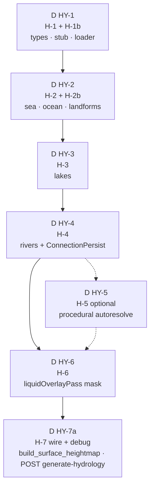

| Подфаза | TZ | Deliverable | DoD / smoke |
|---|---|---|---|
| **D HY-1** | H-1, H-1b | `types`, stub, `load_hydrology_from_world` | unit: policy tabs U16; bands clamp 1–99; loader reads [`world_template.json`](../fixtures/world_template.json) |
| **D HY-2** | H-2, H-2b | `SeaBasinGenerator`, `OceanBasinGenerator`, `CoastalLandformClassifier` | shore + deepening до 20 (sea); declared + autoresolve |
| **D HY-3** | H-3 | `LakeBasinGenerator` + `DeepeningBandCarver` | shoreline profile U15; 1–5 bands |
| **D HY-4** | H-4 | classify + carver + `riverConnectionEmit` | U17/U18; persist in orchestration; declare river = `declared_rivers[]` (U27) |
| **D HY-5** | H-5 *(optional)* | Procedural lakes/rivers при autoresolve ON | deterministic на `world_seed`; skip если все `autoresolve.*: false` |
| **D HY-6** | H-6 | `liquidOverlayPass` + **`map_cells.hydrology`** (U19) | **нет** global `z≤0`; ice/water по temp + C3 river_bed rule |
| **D HY-7a** | H-7 (pre-DAG) | Wire: `build_surface_heightmap` = P1 → `HydrologyGeneratorService.apply` → gap → P2; `MapCellService` передаёт `HydrologyResult` в climate pass | `POST …/map/generate-hydrology?scope=…` preview; full `POST generate-surface` на `world_template` — sea + lake + river bed + liquid после climate |

**Инварианты D HY:**

| Правило | Смысл |
|---|---|
| Pure generators | без repos/async; persist — `MapCellService` / `ConnectionPersistService` |
| Не DAG | ноды `apply_hydrology`, `llm_name_*` — **после** D HY-7a + ревью [`tz_world_generation_dag.md`](./tz_world_generation_dag.md) |
| Не LLM | `materialize_named_locations: false` default; generators не пишут `NamedLocation` |
| Debug path 2 | smoke через HTTP к running backend; этalon `debug_structure` / `debug_ladder` не ломать |
| Реки = connections | bed в heightmap; graph — `ConnectionEdge` (`river`, `mountain_river`) |

**Definition of Done (D HY):**

- [ ] HY-1 closed в [`tz_generator_technical_debt.md`](./tz_generator_technical_debt.md)
- [ ] D HY-1…D HY-7a по таблице выше
- [ ] `generate-surface` debug: P1→HY→gap→P2→persist; `generate-climate`: liquid по mask
- [ ] Smoke: import `world_template` → manual `generate-surface` + `generate-climate` — declared sea/lake/river visible

### Потом — DAG (только с мастером, после gate)

> Спека и impl **только после** § Gate в [`tz_world_generation_dag.md`](./tz_world_generation_dag.md): полное тестирование генераторов (G1–G4) + **явное** снятие gate мастером. Ниже — **target**, не backlog для агента.

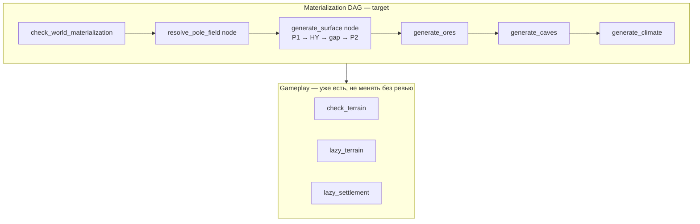

| Блок | Содержание |
|---|---|
| Gate | `check_world_materialization` |
| Nodes | `generate_surface` (внутри HY — impl **D HY**), `generate_ores`, `generate_caves`, chain `generate_climate`; опционально `apply_hydrology` как отдельная нода — **только если** не встроено в `generate_surface` node |
| Wiring | trigger первого входа игрока; deps; `supported_tasks` |
| Regen | auto re-run materialization после `map_cell_size_m` |
| Hydrology LLM (U13) | `collect_geography_naming_candidates` → `llm_name_procedural_locations` — **после DAG gate**, не в D HY |

**Vertical slice (после DAG-сессии):** новый мир → первый chat turn → S→O→C→CL в БД без ручного curl.

### Backlog (не блокирует «Сейчас» / D HY)

| ID | Задача |
|---|---|
| **HY-2 / U12** | Cave hydrology — с Phase B (caves STUB) |
| **HY-3 / U13** | LLM naming autoresolved geography — DAG only |
| impl queue **п.8** | Lazy caves/mines ~20 cells |
| **TR-M / M-3** | Magma movement resolver |
| **NC-1c** | Grid coords в `generate_minimal` |
| **`world_map_version`** | После materialization |
| **`generate_z_slice` node** | Lazy column в gameplay |
| **TR-PAR** | Parallel chunk generate + serial persist — § «Многопоточность»; DAG wiring TR-PAR-DAG-1 |

### Definition of Done

**Сейчас:**

- [x] TR-1b — pole не внутри `TerrainGeneratorService`
- [x] DBG-1 — pipeline smoke через HTTP

**D HY (до DAG):**

- [ ] D HY-1…D HY-7a — см. § «D HY — surface hydrology»

**DAG (после D HY + сессии с мастером):**

- [ ] Очередь S→O→C→CL на path **1**
- [ ] `lazy_terrain` остаётся repair, не подменяет materialization
- [ ] `tz_world_generation_dag.md` — карта нод согласована

---

## Terrain ↔ Climate (разделение процессов)

Eager climate, recalculate и runtime weather — **три разных процесса** ([`tz_climate.md`](./tz_climate.md) § «Три процесса»). Terrain **не пишет** `temperature_base` / `rainfall` на `generate-surface`. После hydrology — partial column resolve в dirty bbox ([`tz_terrain_hydrology.md`](./tz_terrain_hydrology.md) C14); Climate LOD — [`tz_climate.md`](./tz_climate.md) § Climate LOD.

### Утверждённая очередь materialization


Сборка — **engine DAG nodes**, не внутри generator facade.

| Entry | Вызывает | Пишет |
|---|---|---|
| `generate-surface` | terrain two-phase skeleton | `z`, `system_terrain`, subsurface |
| `generate-climate` | `ClimateOrchestrator` on DB heightmap | `temperature_base`, `rainfall`, optional permafrost overlay |
| `lazyTerrainNode` | `generate_minimal` | repair column (отдельный контракт) |

Elevation bias: terrain **читает** `ClimatePoleField.sample` (typical_elevation_z) — физическая связь, разная ответственность (см. § Multi-pass).

### Код vs ТЗ (2026-06 impl)

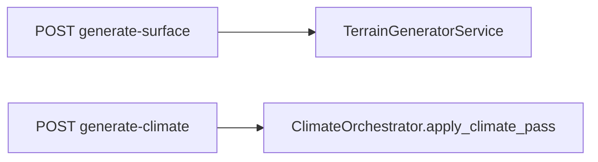

| Entry | Код |
|---|---|
| `TerrainGeneratorService.generate_surface` | surfacePass → gap → columnFill |
| `POST …/map/generate-surface` | `save_terrain_batch` 32×32 upsert |
| `POST …/generate-climate` | `apply_climate_pass` + liquid overlay |
| `POST …/generate-ores` / `generate-caves` | stub generators + layer upsert |
| `lazyTerrainNode` | `generate_minimal` (без изменений) |

Heightmap compat: `heightmapPass` → `terrain.passes.surfacePass`.

### DAG

| Node | Вызывает | Статус |
|---|---|---|
| `generate_climate` | `ClimateOrchestrator.apply_climate_pass` | ✅ |
| `recalculate_climate` | `recalculate(request)` | ✅ |
| `resolve_weather` | `ClimateRuntimeAssembler` | ✅ |

См. [`tz_world_generation_dag.md`](./tz_world_generation_dag.md) (черновик).

### `generate_minimal` — отдельный контракт

**Не** процесс 1 (full eager). Одна anchor-ячейка для repair / lazy bootstrap.

```python
def generate_minimal(world, location, uid_map?) -> list[MapCell]  # len == 1
```

| | `generate_surface` (утверждено) | `generate_surface` (код interim) | `generate_minimal` |
|---|---|---|---|
| Pipeline | terrain two-phase skeleton | `ClimateOrchestrator.full_surface` | `ClimateGeneratorService` напрямую |
| Climate fields | ❌ отдельный pass | ✅ в том же вызове | упрощённый walk-up |
| Pole / tier elevation bias | ✅ input | ✅ | ❌ |
| Caller | engine DAG (production) | `map.py` debug harness | `lazyTerrainNode` |

**Ограничение:** minimal не отражает pole/tier v2 — для orphan repair достаточно; полный климат региона — только eager/recalc.

---

## Расположение в проекте

```
app/application/worldData/generators/
  terrain/                             ← surface skeleton, subsurface, column fill (target)
    terrainGeneratorService.py
  assemblers/climateAssembler/         ← climate passes (heightmapPass → migrate to terrain)
  climate/                             ← pole, tier, precipitation, weather
  coordinates/                         ← convert hub (grid ↔ meters)
  assemblers/settlementAssembler/      ← urban (не terrain)

app/api/routes/map.py                  ← debug harness: POST …/generate-* (не product path)
```

**Tech debt / smells:** `tz_generator_technical_debt.md`  
**Coordinate implementation plan:** `.cursor/plans/coordinate-spaces.md`

---

## Terrain vs Settlement

| Слой | Кто генерирует | Когда | `MapCell` semantics |
|---|---|---|---|
| Terrain skeleton (surface + subsurface) | `TerrainGeneratorService.generate_surface` | `POST generate-surface` | grid; `z`, `system_terrain` only |
| Ores / caves | ordered passes | `POST generate-ores` → `generate-caves` | markers / carve |
| Climate fields | `ClimateOrchestrator` | `POST generate-climate` | `temperature_base`, `rainfall` |
| Climate recalc | `ClimateOrchestrator.recalculate` | DAG ⬜ | partial upsert |
| Anchor repair | `generate_minimal` | `lazy_terrain` | одна cell |
| Urban / settlement | `SettlementAssembler` | `lazy_settlement` | meters + urban |

**Приоритет источников формы города:**

1. **Явные** `map_cells` в БД / fixture — канон (любая форма).
2. **Lazy settlement** — occupancy + geometry при первом входе.
3. **Terrain** — **не** участвует в urban.

`save_generated` использует `INSERT OR IGNORE` — явные ячейки не перезаписываются при повторном `generate-surface`.

---

## Три кейса использования

### 1. Материализация мира (master bake + generation pipeline)

**Мастер** — JSON-редактор в **настройках мира** (`settings/world`): import bundle, registries, anchors. **Не** отдельный «admin»-интерфейс.

**Offline bake (pack, утверждено):** § **Bake modes (locations)** — `light_bake` → optional `full_bake` → optional `detailed_bake` per location. Игрок может получить любой из трёх offline cases; недоделанное дозаполняется resume / lazy.

**Игрок** — выбирает мир → сессия. Если pack partial / нет L2 — **engine DAG** + entry-first (WP-13); legacy `map_cells` skeleton — только до полного cutover.

**Target flow (ноды, после gate):**

```
world_load / first_need
  └─ pack completeness classify → resume light|full|detailed as needed
  └─ pole_resolve_node
  └─ (pack path) entry refine / detailed — не eager full bbox
  └─ (legacy interim) generate_surface → hydrology → climate
```

**Interim (код):** `POST …/map/pack/bake?mode=light|full|detailed` (+ entry refine WP-13); handlers `POST …/map/generate-*` — legacy/debug.

**Pass implementation (generators + MapCellService / Pack writer):**

---

### 2. Lazy init (gameplay) — частично

**Задумка:** при входе в регион — загрузить **scene volume** вокруг `(map_x, map_y, map_z)`; если L2 / колонка нет — refine from L0 (`detailed_bake` semantics) или `generate_z_slice` (legacy).

**Сейчас (код):**

- Pack: entry refine / scene + path (WP-13) — ✅; master `detailed_bake(location_uid)` — ✅ (+ climate fine)
- `check_terrain` → `has_cells_for_location` (не видит wilderness skeleton)
- `eager_terrain` → `get_by_location` (не scene volume)
- `lazy_terrain` → `generate_minimal` (только orphan repair)
- HTTP `POST …/generate-z-slice` + `TerrainBatchOrchestrator.save_z_slice` — ✅ есть, gameplay **не** wired

**Целевой flow:** § **TR-LAZY-LOAD** + pack entry-first — сначала service/debug; ноды — после gate.

```
check_terrain → has_column_cells OR has_cells_for_location OR pack chunk present
eager_terrain → get_scene_volume(…)          # blocking: со стороны игрока
             → optional bg: get_by_location  # соседние локации целиком
lazy_terrain  → refine/generate_z_slice if empty → get_scene_volume
             → generate_minimal fallback (orphan)
lazy_settlement → без изменений (SettlementGeneratorService)
```

---

### 3. Broken location repair (gameplay)

**Триггер:** named_location без единой `map_cell` / без pack L2 (orphan-tolerant design, `tz_locations.md`).

**Flow:** `lazyTerrainNode` → `generate_minimal` → upsert одной anchor cell.  
Climate: **не** full eager — `resolve_climate` + `weather_at_elevation` (см. § «generate_minimal»).
На pack-мире предпочтителен **detailed_bake** / entry refine от L0, а не orphan minimal, если parent light есть.

---

## Алгоритм `generate_surface` (утверждённая модель)

> **Код:** пока делегирует в `ClimateOrchestrator.full_surface` — см. § «Код vs ТЗ». Ниже — **утверждённое** ТЗ + legacy noise из текущего `HeightmapPass`.

### Двухфазный pipeline (утверждено)

См. § «Multi-pass terrain skeleton» — Pass 1 `surface_z`, gap `N_eff`, Pass 2 column fill, chunked persist.

### Surface elevation (Pass 1)

1. **Anchors** — `static_map_anchors`; bbox ± `padding` (v1) или `world_bounds` (v2).
2. **`surface_z(gx,gy)`** — pole `typical_elevation_z` + детерминированный noise + clamp `[z_min, z_max]`.
3. **Gap analysis** — `N_eff = max(N_base, Δ_cliff)`; см. § «Зазоры».

### Noise (из текущего impl, переносится в terrain)

```python
h = (world_seed ^ (gx * 73856093) ^ (gy * 19349663)) & 0xFFFFFFFF
noise = (h % (2 * amplitude + 1)) - amplitude  # amplitude=1
z = clamp(base_z + noise, z_min, z_max)
```

### Terrain от z (skeleton — solid only)

| z (relative / band) | terrain (приоритет) |
|---|---|
| surface | forest / plains / tundra по elevation |
| subsurface | rock / soil (registry TBD) |

**Утверждено:** `liquid_body` **не** из skeleton `z_to_terrain` — liquid pass отдельно.

**Legacy (код interim):** `z ≤ −1 → liquid_body` в `climate/terrainZ.py` — удалить при impl queue п.7.

### Climate (отдельный pass — не generate-surface)

`temperature_base`, `rainfall`, permafrost overlay — [`tz_climate.md`](./tz_climate.md) + `POST generate-climate`.

---

## `generate_minimal` (отдельный контракт)

Одна anchor cell для repair. Координаты: **`map_x`, `map_y`, `map_z` как в БД**.

```python
climate_zone   = ClimateGeneratorService.resolve_climate(world, uid_map, location)
temp, rainfall = weather_at_elevation(world, climate_zone, z)
system_terrain = z_to_terrain(z, terrain_registry)
```

Wilderness `system_terrain` от z — **не urban**. Urban — settlement или explicit import.

| Свойство | Значение |
|---|---|
| Pipeline | без `ClimateOrchestratorService` |
| Pole / tier | не используется |
| Use case | orphan location repair (`lazy_terrain`) |
| vs `full_surface` | не заменяет eager generate региона |

**Ограничения:** NC-1c (grid index vs raw anchor); климат упрощённый — для pole/tier мира см. eager/recalc.

---

## Система координат

### Три оси (не смешивать)

| Ось | Суть |
|---|---|
| `measurement_system` | imperial/metric — **только display/LLM**; generators не ветвятся |
| `INTERIOR_CELL_SIZE_M = 1` | fine step = 1 m — **константа движка**, не настройка мира |
| **Coordinate spaces** | разная семантика одного `int` в разных слоях |

### Coordinate spaces (v1)

```
┌─────────────────────────────────────────────────────────────┐
│  WORLD_SURFACE_GRID                                          │
│  MapCell.x/y при eager terrain + occupancy                 │
│  gx, gy = индекс coarse tile (0, 1, 2, …)                   │
│  один tile покрывает cell_m × cell_m метров на земле          │
└─────────────────────────────────────────────────────────────┘
         │  gx = map_x // cell_m     (convert hub)
         ▼
┌─────────────────────────────────────────────────────────────┐
│  WORLD_LOCAL_METERS                                          │
│  NamedLocation.map_x/y — anchor на карте (поселение, гора, озеро, …) │
│  Settlement: districts, streets, gates, barriers, buildings  │
│  ConnectionNode.x/y — метры                                  │
└─────────────────────────────────────────────────────────────┘
```

### Кто пишет какие координаты

| Generator | x/y space | z | Notes |
|---|---|---|---|
| `generate_surface` (wilderness) | grid index | meters (elevation) | zone climate |
| `plan_footprint_occupancy_cells` | grid index | surface | urban occupancy |
| `SettlementAssembler` geometry | world local meters | meters | after translate |
| `generate_minimal` | raw anchor (repair) | anchor map_z | NC-1c |
| `_non_surface_anchor_cells` (climate eager) | **world meters** (`map_x`, `map_y`) ❌ | anchor `map_z` | **NC-1c bug** — см. § Smoke regression |

---

## Smoke regression — `world_test_all` (2026-07)

**Fixture:** [`fixtures/world_test_all.json`](../fixtures/world_test_all.json) (`world-test-all-001`) — merge gameplay + template; `map_cells: []` at import; surface via `initialize_world.py` → `POST …/map/pack/bake`.

**Прогон (2026-07):** import → `generate-surface` → `generate-hydrology` (stub) → `generate-climate`.

| Метрика | Значение |
|---|---|
| Terrain skeleton cells | 5460 — `x/y` в **WORLD_SURFACE_GRID** (≈ −2…17 при `map_cell_size_m: 3000`) |
| Extra anchor cells | **2** — `x/y` в **WORLD_LOCAL_METERS** (6000, 42000) |
| Surface tops (grid) | 260 columns, z≈3…7, `tundra` |
| False `liquid_body` | 2 — только extra anchors; overworld без воды |

### NC-1c — подтверждённый дефект координат

**Симптом:** в одной таблице `map_cells` coexisting grid index и meter anchors на том же PK `(world_uid, x, y, z)`.

**Источник:** `ClimateSurfaceAssembler._non_surface_anchor_cells` пишет:

```python
x=anchor.map_x, y=anchor.map_y, z=anchor.map_z  # meters
```

Skeleton `run_column_fill` пишет `x=gx, y=gy` (grid index). Конверсия `meters_to_grid_x/y` **не** применяется.

**Триггер в fixture:** единственные локации с `map_z != 0` — dungeon (`map_z: -1`) и underground city (`map_z: -3`). Остальные anchors `map_z: 0` → extra cell не создаётся.

**Target fix (NC-1c):**

- Либо **не persist** point-anchor в `map_cells` (weather-only / volume layer TBD),
- Либо grid-normalize: `x=meters_to_grid_x(map_x)*cell_m` **или** хранить grid `(gx, gy)` с явным `coordinate_space` (NC-1a),
- Либо отдельный контракт «repair cell» только для `generate_minimal` / lazy, без merge в eager surface batch.

**Cross-ref:** interim `liquid_body` на этих ячейках — [`tz_terrain_hydrology.md`](./tz_terrain_hydrology.md) § Interim bug; climate pass — [`tz_climate.md`](./tz_climate.md) § Smoke regression.

---

## Named locations — роль в terrain

**`NamedLocation`** — optional overlay для имени и declare. География существует в `map_cells` / connections **без** location (`location_uid = null` на cells и edges — норма). См. [`tz_locations.md`](./tz_locations.md) § «Именованные объекты карты».

| Поле | Terrain usage |
|---|---|
| `display_name` | LLM / glossary; «Гора Белая», «Степь Кyzyl» |
| `map_x/y` | anchor → grid index для bbox; zone → Voronoi center |
| `map_z` | `0` = surface (wilderness loop); `!= 0` → extra anchor cell |
| `system_location_type` | `geographic.*` → hydrology/relief declare; zone types → climate Voronoi; settlements → bbox point |
| `system_location_subtype` | `peak`, `plain`, `lake`, `sea`, … — routing в generator loaders |
| `system_climate_zone` | на zone / в иерархии для `_resolve_climate` |
| `parent_location_uid` | walk-up для climate на non-surface anchors |
| `is_mobile` | true → static anchor не создаётся |

### Якорная cell (minimal / non-surface)

```python
if location.map_z is not None and not location.is_mobile:
    if map_z != 0:
        create anchor at (map_x, map_y, map_z)
```

| Локация | `map_z` | Terrain |
|---|---|---|
| Город на поверхности | `0` | wilderness tile в bbox (urban — settlement) |
| Шахта | `-20` | ✓ extra anchor |
| Подземный город | `-1000` | ✓ extra anchor |

---

## DB — индексы

```sql
CREATE INDEX idx_map_cells_location_z ON map_cells (world_uid, location_uid, z);
```

PK `(world_uid, x, y, z)` — точечные запросы; индекс по location — lazy load / scene.

---

## Persist cycle & DAG modification (terrain)

**Контракт:** `MapCellService` — persist-слой terrain (аналог `SettlementPersistService` для города).  
`TerrainGeneratorService` / `ClimateOrchestrator` — **только generate**; DAG и debug API вызывают **одни и те же** persist-методы; DAG — **в обход HTTP**.

> **Два режима.** (1) **Bootstrap / materialization** — S→O→C→CL на declared bbox / `full` init (широкий, но не «перегенерить весь мир каждый ход»). (2) **Runtime modification** — **строго локальный patch** в явных границах; см. § «Локальная модификация» ниже.

#### Связь с доменными ТЗ

| Тема | Где описано |
|---|---|
| Multi-pass skeleton S→O→C→CL | § Multi-pass terrain skeleton; [tz_world_generation_dag.md](./tz_world_generation_dag.md) § три входа |
| Selective upsert по layer kind | § Multi-pass persist; `save_pass(layer)` |
| Climate recalc (partial) | [tz_climate.md](./tz_climate.md) — `recalculate_climate`; **`output_bbox` обязателен**; snapshot vs column resolve (C9); hydrology → C14 |
| Дорога меняет terrain cells | [tz_structure_connections.md](./tz_structure_connections.md) §3.5, `connection_edge_cells` — **коридор ребра**, не весь мир |
| Excavation / construction | [tz_world_generation_dag.md](./tz_world_generation_dag.md) — `excavate`; [tz_construction.md](./tz_construction.md) |
| Катаклизмы → мутация карты | [project_data_storage_tz.md](./project_data_storage_tz.md) — `world_history`, `system_event_type=cataclysm` |
| Settlement vs terrain | § Terrain vs Settlement — urban не перезаписывает explicit cells |

#### Scopes — bootstrap (широкий контекст)

| Scope | Generate | Persist | DAG / debug | Примечание |
|---|---|---|---|---|
| `surface_skeleton` | `generate_surface` (+ pole caller) | `save_terrain_batch` | `generate_surface`; `POST generate-surface` | bbox / world_bounds при init |
| `ores` | `generate_ores` | `save_pass(ore)` | `generate_ores` | pass по существующим cells |
| `caves` | `generate_caves` | `save_pass(cave)` | `generate_caves` | pass; lazy gameplay — local radius |
| `climate` | `apply_climate_pass` | `save_pass(climate)` | `generate_climate` ✅ | eager на materialization |
| `z_slice` | `generate_z_slice(gx,gy,z…)` | `save_pass(terrain)` | `generate_z_slice` ✅ HTTP; gameplay ⬜ TR-LAZY-LOAD | **одна колонка** — lazy wilderness |
| `minimal_repair` | `generate_minimal` | `insert_bulk_ignore` (`executemany`) | `lazy_terrain` ✅ | **одна anchor cell** — orphan only |

Удобная обёртка `persist_materialization(world)` = S→O→C→CL — только **`full` init / world load**, не gameplay loop.

#### Локальная модификация (runtime — event / action driven)

**Инвариант:** gameplay **не** вызывает `generate-surface` на весь мир. Меняются только ячейки в **`patch_bounds`** (bbox, radius, corridor polyline, z-band).

| Триггер | Пример | `patch_kind` | Типичные bounds | DAG node (target) |
|---|---|---|---|---|
| **Катаклизм** | метеорит, наводнение, вулкан | `cataclysm` | `center + radius_cells` из event payload | `modify_terrain` ← EventBus / `world_history` |
| **Бой** | взрыв, обвал, magic crater | `combat` | bbox сцены / radius вокруг impact | `modify_terrain` ← combat post_llm |
| **Раскопки** | игрок / NPC копает, туннель | `excavate` | column или small 3D box | `excavate` → `modify_terrain` |
| **Стройка дороги** | bed под `ConnectionEdge` | `road_bed` | polyline + `width_cells` коридор | `connect_road` + local terrain patch |
| **Климат (regional)** | pole shift, локальный эффект | `climate_recalc` | `ClimateRecalcRequest.output_bbox` | `recalculate_climate` |

Запись в историю: patch persist сопровождается `world_history` / action ref ([project_data_storage_tz.md](./project_data_storage_tz.md)).

**Контракт generate (target):**

```python
@dataclass
class TerrainPatchRequest:
    patch_kind:   str          # cataclysm | combat | excavate | road_bed | …
    bounds:       SurfaceGridRect | MeterRect   # обязательно; whole-world запрещён в gameplay
    event_uid:    str | None   # world_history / EventBus
    actor_uid:    str | None   # player / NPC action
    z_lo: int | None = None    # excavate / combat depth
    z_hi: int | None = None

class TerrainPatchGeneratorService:
    def apply_patch(
        self,
        world: World,
        existing: list[MapCell],   # только cells в bounds (loader)
        request: TerrainPatchRequest,
    ) -> list[MapCell]:
        """Pure. Возвращает **только изменённые** cells ⊆ bounds."""
```

**Контракт persist:**

```python
# MapCellService
async def persist_terrain_patch(
    self,
    cells: list[MapCell],
    *,
    bounds: SurfaceGridRect,     # guard: reject if len(cells) >> bounds area
    patch_kind: str,
) -> ImportResult:
    """Upsert только patch cells; skip building_element; idempotent by (world_uid,x,y,z)."""
```

Debug harness: `POST …/map/patch-terrain` с телом `TerrainPatchRequest` — mirror DAG `modify_terrain` (TBD).

#### Scopes — modification (локальный patch)

| Scope | Generate | Persist | DAG |
|---|---|---|---|
| `terrain_patch` | `TerrainPatchGeneratorService.apply_patch` | `persist_terrain_patch` | `modify_terrain`, `excavate` |

#### Idempotency

- Bootstrap regen: selective upsert по layer kind — **не** blind `INSERT OR IGNORE` для multi-pass ([§ Multi-pass persist](#multi-pass-terrain-skeleton)).
- `minimal_repair`: `INSERT OR IGNORE` (1 cell).
- **`terrain_patch`:** upsert **только** cells из `apply_patch`; `building_element` — skip; повтор event с тем же `event_uid` — idempotent merge.

#### Debug API (harness)

`map.py` `POST …/generate-*` — path **2**; те же scopes, что DAG path **1**. См. [tz_world_generation_dag.md](./tz_world_generation_dag.md) § «Три входа».

#### Checklist (terrain persist для DAG)

- [x] `save_pass` / `save_terrain_batch` — partial impl
- [ ] **TR-PERF** — `executemany` + multi-chunk transaction + insert_only + bulk PRAGMA (§ TR-PERF) ✅
- [ ] **TR-LAZY-LOAD** — `get_scene_volume`, `has_column_cells`, debug smoke (§ TR-LAZY-LOAD-1/2)
- [ ] **TR-LAZY-LOAD-DAG** — gameplay ноды — **gate**, только с мастером
- [ ] `TerrainPersistScope` enum + единый `persist(cells, scope)` facade
- [ ] DAG nodes: `generate_surface`, `generate_ores`, `generate_caves`, `generate_z_slice` (wire к service)
- [ ] `TerrainPatchGeneratorService` + `TerrainPatchRequest` (local bounds only)
- [ ] `persist_terrain_patch` — guard по bounds
- [ ] `modify_terrain` / `excavate` — cataclysm, combat, dig (event/action driven)
- [ ] DAG wire — **gate G5**, только с мастером после G1–G4

---

## Реализовано / не покрыто

| Элемент | Статус |
|---|---|
| **Концепция multi-pass terrain skeleton** | ✅ утверждено + impl 2026-06 |
| Two-phase skeleton + N_eff gap | ✅ |
| `generate-surface` terrain-only | ✅ |
| `POST generate-climate` / ores / caves | ✅ |
| Chunked persist + selective upsert | ✅ TR-PERF-1…4 |
| TR-PERF bulk init (`executemany`, multi-chunk commit, insert_only, PRAGMA) | ✅ § TR-PERF |
| TR-LAZY-LOAD service + debug (без нод) | ✅ § TR-LAZY-LOAD-1/2 |
| TR-LAZY-LOAD-DAG (gameplay ноды) | ⬜ gate — только с мастером |
| Liquid pass on `generate-climate` | ✅ |
| `generate_z_slice` API | ✅ `POST …/generate-z-slice` |
| `world_bounds` v2 | ✅ `world.world_bounds` |
| Magma band + `antipode_xy` (M-1,M-2) | ✅ optional `magma_band_thickness` |
| M-3 movement resolver | ⬜ см. tz_locations |
| Lazy caves/mines ~20 cell radius | ⬜ gameplay |
| `generate_minimal`, lazy_terrain, lazy_settlement | ✅ |
| Pole/tier elevation bias in surface pass | ✅ |
| Terrain decoupled from cities | ✅ |
| Coordinate convert hub | ✅ |
| DAG: `generate_climate`, `recalculate_climate`, `resolve_weather` | ✅ |
| NC-1c minimal grid coords | ⬜ **подтверждено** smoke `world_test_all` (2026-07) |
| `world_map_version` после generate | ⬜ |

---

## Многопоточность

Без изменений: детерминизм + upsert-семантика + IRepository. Generators pure, без SQL.

---

## Регенерация при изменении `map_cell_size_m`

**Триггер:** `WorldService.update()` — старое ≠ новое.

**Поведение (не реализовано полностью):** предупреждение → `MapCellService.clear` → повторный `generate-surface`.

---

## Открытые вопросы

- `generate_z_slice` API: bounds vs `location_uid + z`.
- Non-city anchors: grid index vs meter anchor на surface PK.
- Zone без `map_x/y`: только `default_climate_zone` для Voronoi (нет полигонов).
- Option B: normalize all surface cells to meter corners `(gx * cell_m, gy * cell_m)`.

---

## Changelog

| Дата | Изменение |
|---|---|
| 2026-07-16 | Bake modes / TR-PACK **impl status sync:** light/full/detailed ✅; classifier detect ✅; climate fine на detailed ⬜; incremental skip / auto-resume ⬜ |
| 2026-07-15 | § **Bake modes (locations):** light / full / detailed; offline cases; detect+resume; TR-PACK status sync |
| 2026-06 | § Persist cycle — **локальная** runtime modification (cataclysm, combat, excavate); bootstrap vs patch |
| 2026-06 | § Phase 9+ **D HY** — surface hydrology H-1…H-7a в план до DAG |
| 2026-06 | § Phase 9+ — production DAG materialization (план после TR-1) |
| 2026-06 | § Роли: production DAG vs debug harness vs script tests через HTTP |
| 2026-06 | § План реализации (код → ТЗ) + TR-1 impl (Фазы 0–8) |
| 2026-06 | **M-3:** movement resolver — trigger на bottom/void, **±z flip** на antipode; см. tz_locations |
| 2026-06 | Magma band: thickness ≥1 z; teleport **z_magma_bottom → antipode z_magma_bottom** (edge case) |
| 2026-06 | Magma/antipode — **edge case**, контракт зафиксирован, impl отложено (M-1…M-5) |
| 2026-06 | Planet topology: round planet on voxel grid; magma ≠ world bottom |
| 2026-06 | Terrain layers: N_base vs deep geology; liquid with climate; ores independent |
| 2026-06 | **Утверждена** multi-pass terrain skeleton; ordered world generation passes |
| 2026-06 | Climate split; Terrain ↔ Climate interim documented |
| 2026-07 | § «Многопоточность (TR-PAR)» — v2 impl; § DAG `free_cores` / `MaterializationContext` (TR-PAR-DAG-1) |
| 2026-07 | § Smoke regression `world_test_all`: NC-1c meter vs grid в `_non_surface_anchor_cells` |
| 2026-06 | NC-1 coordinate spaces rework |

---

## Связанные документы

- [`tz_world_pack_storage.md`](./tz_world_pack_storage.md) — Pack L0/L2; **Bake modes** light / full / detailed
- [`tz_world_generation_dag.md`](./tz_world_generation_dag.md) — generators ↔ DAG (lazy terrain, generate_climate target)
- [`tz_terrain_hydrology.md`](./tz_terrain_hydrology.md) — моря / озёра / реки как carve heightmap (target)
- [`tz_climate.md`](./tz_climate.md) — три процесса, orchestrator, recalc contracts, **Climate LOD**
- `tz_city_generation.md` — settlement, occupancy, urban
- `tz_locations.md` — named_location fields
- `tz_generator_technical_debt.md` — NC-1, smells
- [`tz_map_light_bake.md`](./tz_map_light_bake.md) — L0 light-grid compose |
- `project_data_storage_tz.md` — map_cells schema
