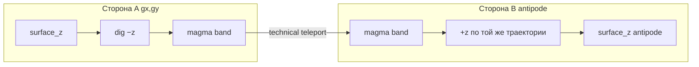
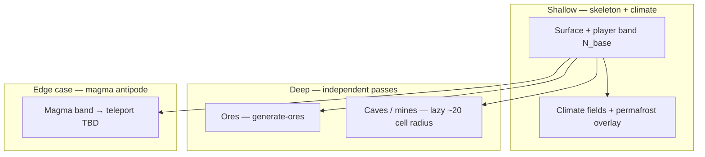
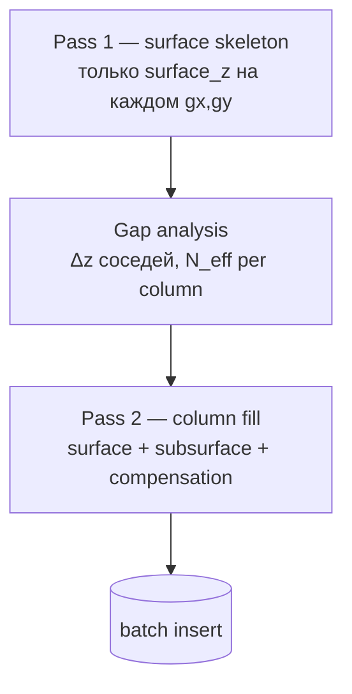
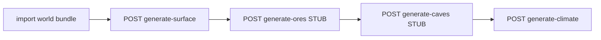
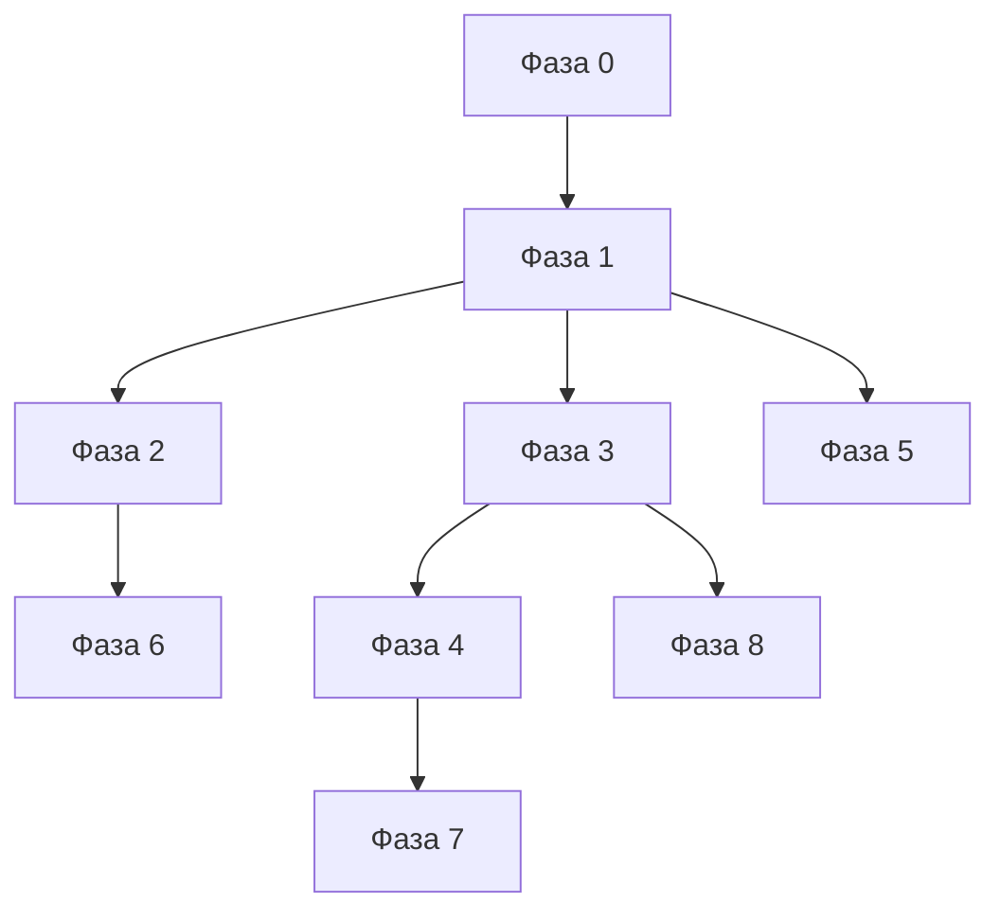
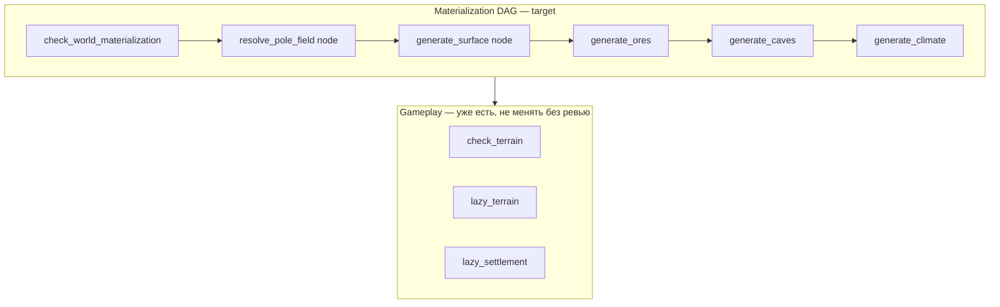
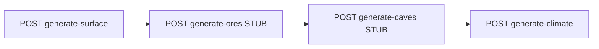
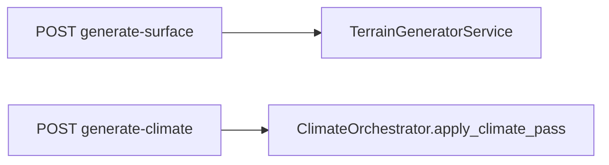

> **Архитектура нод:** terrain-ноды пишут в `state.terrain_context: TerrainContext`. См. `tz_engine_node_context.md`.

## Назначение

`TerrainGeneratorService` — **pure utility** (без репозиториев, без async).  
Вход: `(World, list[NamedLocation])` → выход: `list[MapCell]`.

**Задача (утверждено 2026-06):** multi-pass **terrain skeleton** — surface + subsurface columns (`z`, `system_terrain`), без climate fields на `generate-surface`. См. § «Multi-pass terrain skeleton».

**Климат** — отдельный модуль и **отдельный pass** в очереди генерации мира (`generate-climate`): `ClimateOrchestratorService` на cells в БД.

### Роли (не путать с «admin»)

| Роль | UI | Что делает с terrain |
|---|---|---|
| **Мастер мира** | JSON-редактор в **настройках мира** (`settings/world`) | import bundle, registries, anchors, pole — **объявляет** мир |
| **Игрок** | выбор мира → персонаж → игра | загружает мир; **материализация** skeleton/climate — через **engine DAG**, если cells ещё нет |

Отдельной роли «admin» в продукте **нет**.

**Production:** материализация мира (S → O → C → CL) — только **engine DAG**; frontend и игрок **не** вызывают HTTP generate-*.

**Debug:** `POST …/map/generate-*` в `map.py` — **постоянный** harness для точечных тестов (curl, изолированный pass). Те же generator/orchestrator функции, что и ноды; маршруты **оставляем**, но это не product path.

**Скриптовые smoke/integration-тесты** passes с persist — **только через HTTP** к running backend (`http://localhost:8000/api`), не через прямой import генераторов. Эталон: `scripts/debug_structure.py`, `scripts/debug_ladder.py`. Подробно — [`tz_world_generation_dag.md`](./tz_world_generation_dag.md) § «Три входа».

> **Код:** ✅ TR-1b + DBG-1 (2026-06). Legacy `assemble_full` — climate-only regen paths.

**Не задача terrain (как отдельного домена):**

- urban footprint и форма города — `SettlementAssembler`, явные `map_cells`, lazy occupancy;
- улицы, здания, заборы — settlement pipeline (см. `tz_city_generation.md`).

**Почему отделено от городов:** поселение может быть построено или уничтожено; климат и elevation региона не должны пересчитываться от списка городов.

**Why utility, not service:** нужен в engine-нодах (production) и в debug harness (`map.py`) без DI-контейнера.

---

## Multi-pass terrain skeleton (утверждено 2026-06)

> **Статус концепции:** ✅ **утверждено.** **Impl в коде:** ✅ TR-1 (2026-06) — § Impl queue, § План реализации.

### Принцип

1. **Мир объявлен мастером** (import bundle: registries, anchors, pole, `z_min`/`z_max`, …) — без этого skeleton **неконсистентен**.
2. **`generate-surface`** — **чистый terrain**: surface skeleton + subsurface strata. Без `temperature_base` / `rainfall`.
3. **Climate** — отдельный pass/API; **читает** terrain, **может модифицировать** верхние слои (см. ниже).
4. **Ores → caves** — отдельные ordered passes; merge rules не дают caves перезаписать ore.
5. **Liquid** — отдельный вопрос; зависит от climate + правил мира (не из `z_to_terrain` напрямую).

### Охват мира: две версии (обе фиксируем)

| Версия | Охват | Когда |
|---|---|---|
| **v1 — anchor bbox** | bbox static anchors ± `padding` | после import bundle мастером |
| **v2 — declared world** | явные границы мира (`world_bounds` / master rect / full grid extent) — **вся** заготовка skeleton | после появления поля границ или lazy chunk map |

**Инвариант v1:** города только расширяют bbox точкой anchor, не footprint.  
**Инвариант v2:** skeleton покрывает **всю** объявленную заготовку — «склад» основных сущностей до gameplay.

Lazy gameplay (`generate_z_slice`) в v2 может генерировать **тот же column API**, но порциями; eager materialization — весь declared extent (или bbox в v1).

### Column semantics (surface + subsurface band)

PK `(world_uid, x, y, z)` — **вертикальная колонка** на `(gx, gy)`:

```
surface_z = f(climate elevation bias, noise, world z clamp)   ← exposed top cell
player/climate band: z = surface_z−1 … surface_z−N_base
magma band (skeleton): локальная глубина до magma horizon — **не** `z_min`; см. § Planet topology
```

**`N_base` (~20)** — **минимум** для игрока (поверхность + shallow underground) и **climate/volume** (permafrost overlay, shallow temperature field). **Не** полная глубина геологии.

**Руды, пещеры, шахты** — **не** заполняются этим band целиком:

| Объект | Когда / где | Глубина |
|---|---|---|
| **Skeleton band** | `generate-surface` | `N_eff ≥ N_base` (cliff compensation) |
| **Ores** | **`generate-ores` — независимо** от skeleton depth | global/procedural pass; не привязан к N_base |
| **Caves / mine tunnels** | **lazy / local** вокруг входа (шахта, dungeon anchor) | target: **~20 cells radius** от точки входа; impl позже |
| **Settlement / cities** | settlement pipeline | не ниже player band без явного master-контракта |

**Решение:** **A — independent columns** ✅ (в пределах skeleton band). **B** — shared horizon — отложено.

### Planet topology: voxel grid, круглая планета (утверждено)

> **Magma + antipode teleport — edge case.** Контракт **зафиксирован**, чтобы не переизобретать; **impl и movement — отложены** (закрыть после core skeleton / climate / lazy geo). **Не блокирует** vertical slice: игрок и climate живут в **N_base band**; до magma большинство сессий не доходит.

**Хранение:** `map_cells` — **voxel grid** `(gx, gy, z)` (WORLD_SURFACE_GRID + elevation z).

**Модель:** планета **круглая** (product semantics). Grid — проекция/развёртка; **нет** «дна мира» на `z_min`.

**Magma (edge case)** — не нижняя граница мира, а **переходный слой** между «этой» стороной и **антиподальной** `(gx', gy')`.



| Конcept | Правило |
|---|---|
| Движение до magma | траектория **вниз** (−z) в колонке `(gx, gy)` |
| **Пересечение magma** | **technical teleport** на **нижнем** z magma band (см. ниже) |
| После teleport | **+z** в `(gx', gy')`, старт с **`z_magma_bottom(gx', gy')`** antipode |
| `z_min` | **не** «конец планеты»; ниже `z_magma_bottom` в колонке cells **нет** |

#### Magma band: толщина и teleport (утверждено направление, edge case)

Magma — **не одна cell**, а **band** из нескольких z-уровней (как shallow terrain, но отдельный тип):

```
column (gx, gy):
  … rock …
  z_magma_top    …  } magma band (thickness ≥ 1, параметр мира)
  …              …  }
  z_magma_bottom …  }  ← deepest magma cell in this column
  (ниже — void в PK; продолжение только через antipode)
```

| Параметр | Смысл |
|---|---|
| `magma_band_thickness` | число z-слоёв magma (или `z_magma_top`…`z_magma_bottom` per column) |
| `z_magma_bottom(gx, gy)` | **нижний** z magma в колонке (max depth into planet at this xy) |
| `z_magma_top(gx, gy)` | верх magma band (граница с rock/solid выше) |

**Teleport (утверждено):** переход **с нижнего слоя magma** на стороне A **на нижний слой magma** antipode B — не с произвольной z внутри band и не «в одну cell».

```
(gx', gy') = antipode_xy(gx, gy)
z'         = z_magma_bottom(gx', gy')

teleport: (gx, gy, z_magma_bottom(gx,gy))  →  (gx', gy', z')
далее:    движение +z через magma band antipode → rock → surface antipode
```

**Пока внутри magma band (до bottom):** движение **−z** в колонке `(gx, gy)` через все magma cells сверху вниз. Teleport — см. **M-3** (movement resolver).

**Skeleton:** на каждой `(gx, gy)` и antipode `(gx', gy')` генерировать **весь magma band** (все z между top и bottom), не одну voxel.

#### M-3: movement resolver (контракт, impl ⬜)

> Детали resolver — [tz_locations.md § Magma antipode](tz_locations.md#magma-antipode-переход-через-планету-m-3). Здесь — триггер и flip ±z.

| Правило | Контракт |
|---|---|
| **Trigger teleport** | Персонаж на `(gx, gy, z_magma_bottom)` и intent **«глубже»** (Δz −1) **или** попытка шага на z без cell (void ниже bottom) → **не** ошибка pathfinding, а `magma_antipode_teleport` |
| **Teleport target** | `(gx', gy', z_magma_bottom(gx', gy'))` — bottom→bottom |
| **±z flip после teleport** | На стороне A «глубже» = **−z**. На стороне B resolver **инвертирует** vertical intent, пока `z ≤ z_magma_top(gx', gy')`: «глубже» → **+z** (к surface antipode); «выше» → **−z**. После выхода из magma band antipode — обычные правила z |
| **A\*** | Void под `z_magma_bottom` **не** edge графа; переход только через спец-правило magma |
| **LLM / UI** | Событие `magma_antipode_crossing` (from/to xy,z); narration — отдельный шаблон, не generic teleport |

**Antipode (контракт, impl TBD):**

```
(gx', gy') = antipode_xy(gx, gy, world_bounds)
```

- **v2 declared world:** противоположная точка на решётке мира (напр. отражение от центра bbox / `(gx + W/2) mod W` — фиксируется при `world_bounds`).
- **v1 anchor bbox:** antipode только если мир объявлен как **closed planet grid**; иначе magma → teleport требует v2 extent.

**Skeleton v1:** solid + **N_base band**; magma band — **опционально до M-2** (edge case, impl queue п.12).

**Закрытие edge case M-1…M-5:** antipode_xy · magma **band** on skeleton · movement: −z через band → teleport **bottom→bottom** · magma heat · v2 closed grid. Impl после TR-1 п.1–7.

**Gameplay / movement (edge case — impl ⬜):** movement resolver — M-3; terrain маркирует voxels `system_terrain: magma`.

### Terrain layers (вертикальная модель — утверждено направление)

Три **разных** семантики по z — не один monolith «subsurface»:



| # | Слой | Когда создаётся | Смысл | Ограничения |
|---|---|---|---|---|
| **1 Magma** *(edge case)* | skeleton *(отложено)* | Переходный band; antipode teleport | Temp ↑; см. § Planet topology | impl ⬜ M-1…M-5 |
| **2 Solid skeleton** | `generate-surface` pass 2 | surface + player/climate band + rock **до** magma band | solid only | без liquid |
| **3 Liquid** | **`generate-climate`** (вместе с climate pass) | Абстрактные **водоносные / fluid** слои (не «вода» буквально) | **Семантика от температуры:** ice / liquid / vapor / … через registry + `temperature_base` | не из `z_to_terrain`; overlay на существующие cells |
| **4 Ores** | `generate-ores` | Независимая генерация | `system_material` / deposit markers | caves не перезаписывают |
| **5 Caves** | lazy / `generate-caves` | Локально ~**20 cells** от входа | carve air/cave terrain | после ores; не в magma |

**Magma band (контракт, edge case):** band **толщиной ≥1 z** ниже solid (`magma_band_thickness` / per-column top…bottom). Все cells = `system_terrain: magma`. Teleport: **`z_magma_bottom` → antipode `z_magma_bottom`**. Skeleton v1 может пропустить до M-2.

**Liquid + climate (утверждено):** liquid layer **не** на `generate-surface`; накладывается на **`generate-climate`** (или sub-pass orchestrator), потому что тип fluid **зависит от effective temperature** и правил мира (`precipitation_liquid`, registry). Shallow liquid (море, реки) — те же правила, surface z + climate.

**Не сейчас:** полная sim магмы; soil transition node; regional shared strata (B).

### Зазоры при крутых перепадах (Δz > N)

При фиксированных N слоях ниже `surface_z` **колонка не дотягивается** до уровня низкого соседа — в PK остаются «дыры» (нет `map_cells` на промежуточных z между обрывом и подошвой соседа).

**Пример** (N=20): колонка A `surface_z=30` → заполнено z=30…10; сосед B `surface_z=5`. На A нет z=9…6 — **зазор** относительно рельефа B, если нужна сплошная подземная масса / cliff volume.

**Поэтому `generate-surface` — двухфазный внутри одного endpoint:**



| Фаза | Выход | Зачем |
|---|---|---|
| **1 Surface skeleton** | `SurfaceHeightmap`: `surface_z[gx,gy]`, bbox, без subsurface | заранее видим все кейсы Δz > N |
| **Gap analysis** | `N_eff(gx,gy)` или явный `z_bottom(gx,gy)` | компенсация до согласованного покрытия |
| **2 Column fill** | `list[MapCell]` solid strata | детерминированная порода по z |

**Правило компенсации (утверждено):**

```
N_base = world.map_subsurface_depth ?? 20

# на каждой (gx, gy) после pass 1:
Δ_cliff = max(0, surface_z(gx,gy) - min(surface_z соседей))   # 4- или 8-neighborhood
N_eff   = max(N_base, Δ_cliff)   # если сосед ниже больше чем на N — углубляем колонку

z_top    = surface_z(gx, gy)
z_bottom = max(world.z_min, z_top - N_eff)

# заполнить все целые z ∈ [z_bottom, z_top] одной колонкой (PK уникален)
```

Инвариант: после pass 2 **нет «вертикальной дыры»** между `surface_z` соседних колонок, если разница высот ≤ покрытия (при необходимости `N_eff > N_base`). Cliff face на границе колонок — solid rock (`cliff` / `rock` — тип из registry, TBD).

**Лог / master preview (optional):** count ячеек с `N_eff > N_base`, max Δ_cliff — для мастера до ores/caves.

**Не в v1:** горизонтальный «мост» между далёкими колонками (только local neighborhood).

### Terrain ↔ ClimateData (разделение ответственности, физическая связь)

**Выбрано: вариант A** — terrain **физически зависит** от climate-related данных (pole field, `typical_elevation_z`, zone profile), но **модули разделены**:

| Слой | Кто | Пишет |
|---|---|---|
| Elevation bias / surface shape | terrain generator, **input:** `ClimatePoleField.sample` | `z`, base `system_terrain` (solid) |
| Player/climate band + solid to magma | terrain generator (`generate-surface`) | rock/soil до magma horizon |
| **Magma band** | terrain generator (`generate-surface`) | magma voxels; **transition**, antipode link at runtime |
| Climate fields | `ClimateOrchestrator` (`generate-climate`) | `temperature_base`, `rainfall` |
| **Liquid layer** | climate pass (same API) | fluid overlay; semantics from temp |
| **Climate → terrain overlay** | climate pass | permafrost и верхние z |
| **Ores** | `generate-ores` (independent) | deposit markers |
| **Caves / mines** | lazy ~20 radius / `generate-caves` | carve |

**Не сейчас:** нода **soil transition** — отдельная фича.

**Убрано из skeleton:** `liquid_body` через `z_to_terrain` — liquid только § Terrain layers п.3.

### Ordered world generation passes (очередь)

**Очередь (строго):** `surface → ores → caves → climate` после того, как мир **объявлен** (import JSON мастером). Сборка — **только engine nodes (DAG)**; генераторы **не** вызывают соседние домены.



| # | Endpoint | Generator (pure) | Читает | Пишет |
|---|---|---|---|---|
| 1 | `generate-surface` | terrain passes | `World`, locations; **input:** `ClimatePoleField` от ноды | skeleton |
| 2 | `generate-ores` | `generate_ores` | `map_cells` | ore markers |
| 3 | `generate-caves` | `generate_caves` | `map_cells` | carve |
| 4 | `generate-climate` | climate passes | `map_cells` | temp, rainfall, liquid |

#### Изоляция генераторов (утверждено)

| Правило | Смысл |
|---|---|
| Генераторы не знают друг о друге | нет import/call между `terrain/`, `climate/` passes, `ores`, `caves` |
| Сборка на нодах | pole → surface → persist → ores → caves → climate — deps DAG |
| Shared input | `ClimatePoleField`, bbox — **данные** в аргументах, не скрытый вызов чужого generator |
| Между pass | pass N+1 читает **DB**, не in-memory monolith |

**Код:** ✅ TR-1b (2026-06) — pole resolve в `MapCellService` / `map.py`; generator принимает `pole_field`. ⬜ `debug_settlement` pipeline — HTTP (DBG-1).

**Вне очереди materialization (другие вещи):**

| API | Смысл |
|---|---|
| `POST …/generate-z-slice` | lazy fill **одной колонки** `(gx,gy,z…)` — API ✅, engine node ⬜ |
| Lazy caves ~**20 cells** у входа | gameplay (**impl queue п.8 DEFERRED**) — **не** z-slice |

| Endpoint | Merge |
|---|---|
| `generate-surface` | upsert solid/magma |
| `generate-ores` / `generate-caves` | STUB — layer upsert |
| `generate-climate` | climate + liquid overlay |

> **Debug harness:** handlers `map/generate-*` — path **2**; **production orchestration:** ноды DAG (path **1**). См. [`tz_world_generation_dag.md`](./tz_world_generation_dag.md) § «Три входа».

`INSERT OR IGNORE` **недостаточен** для multi-pass — нужен **selective upsert** / patch по layer kind (terrain vs ore vs cave).

### Объём cells и запись в БД (рекомендация)

**Оценка объёма:**

```
cells ≈ columns × avg_depth
columns = (bbox_width × bbox_height)   # одна колонка = один (gx, gy)
avg_depth ≈ 1 + N_eff_mean             # surface + subsurface; N_eff ≥ N_base
```

Пример: bbox 200×200, N≈22 → до ~880k rows — норма для «заготовки», но не в один INSERT.

**Разделение слоёв (важно):**

| Слой | Где | Параллелизм |
|---|---|---|
| **Pure generator** | `TerrainGeneratorService` / column fill | stateless; chunk rect in → cells out |
| **Orchestrator job** | `MapCellService` / engine node | partition, workers, batch persist |
| **DB** | SQLite `map_cells` | **один writer**; batch `executemany` в транзакции |

Generator **не** знает про threads/SQL — только `(world, locations, rect, surface_heightmap?)`.

**Pass 1 (surface skeleton)** — лёгкий: держим **весь** `surface_z` grid в памяти (`int[gy][gx]`, для 500×500 ≈ 1 MB). Gap analysis — один sweep по grid (или по chunk с halo ±1 для соседей).

**Pass 2 (column fill)** — тяжёлый: **chunked** по rect без загрузки всего мира в RAM.

**Chunking (v1 impl):**

| Параметр | Рекомендация | Заметка |
|---|---|---|
| `chunk_columns` | **32×32** или **64×64** | 64×64 × depth 25 ≈ 100k cells/chunk |
| Halo | **±1 cell** при gap analysis на границе chunk | соседи для `N_eff` на edge |
| Persist | **1 transaction / chunk** | `insert_bulk` или upsert terrain layer |
| Порядок chunks | row-major, deterministic | воспроизводимость |
| Parallel v1 | **нет** — sequential chunks | проще отладка |
| Parallel v2 | thread pool **generate**; **insert serial** на asyncio loop | SQLite single-writer |

**Порог «всё в одном batch»:** если `columns × (1+N_base) < ~50_000` — можно один generate + один insert (малые миры / test).

**Progress UX (позже):** job id + `{chunks_done, chunks_total, cells_written}`; опционально SSE.

**Детерминизм:** RNG seed = `f(world_uid, gx, gy, pass_id)` — chunk order не влияет на содержимое ячеек.

**Lazy / v2 declared world:** тот же chunk API; eager прогоняет все chunks bbox/world_bounds, lazy — один chunk вокруг `location_uid`.

### Impl queue (код vs утверждённое ТЗ)

| # | Задача | Статус |
|---|---|---|
| 1 | Вынести heightmap/strata в `generators/terrain/` | ✅ |
| 2 | `generate-surface` = terrain only (без climate fields) | ✅ |
| 3 | `POST generate-climate` (orchestrator on existing cells) | ✅ |
| 4 | Subsurface **N_base** + **A** + `N_eff`; magma band + **antipode** contract | ✅ core; magma optional |
| 5 | Two-phase skeleton inside `generate-surface` | ✅ |
| 6 | `generate-ores` (independent) + `generate-caves` stubs | ✅ **STUB** |
| 7 | `generate-climate`: fields + **liquid layer** (not separate liquid endpoint) | ✅ |
| 8 | Lazy caves/mines ~20 cell radius | ⬜ **DEFERRED** gameplay (≠ z-slice) |
| 9 | Убрать `liquid_body` из skeleton `z_to_terrain` | ✅ |
| 10 | Chunk orchestration MapCellService | ✅ |
| 11 | `world_bounds` v2 | ✅ |
| 12 | **Edge case M-1…M-5:** magma band + antipode teleport + movement | ✅ skeleton + `antipode_xy`; M-3 movement ⬜ |

---

## План реализации (код → ТЗ)

> **Статус:** ✅ **Фазы 0–8** (generators + debug API) — 2026-06.  
> **Дальше без DAG:** § Phase 9+ блок «Сейчас». **Engine DAG / ноды — отдельная сессия с мастером**, код не трогаем до согласования.

### Принципы исполнения

1. **Generators first, DAG last** — pure generators до полной цепочки нод.
2. **`generate-surface` без climate fields** — `temperature_base` / `rainfall` только на `generate-climate`.
3. **Two-phase skeleton обязателен** — Pass 1 `surface_z`, gap `N_eff`, Pass 2 column fill.
4. **Multi-pass persist** — selective upsert по layer kind; не `INSERT OR IGNORE` для regen skeleton.
5. **Magma M-1…M-5** — после core (Фазы 0–4); не блокирует split climate.

### Фазы

| Фаза | Содержание | Impl queue | Приёмка |
|---|---|---|---|
| **0** | Модуль `generators/terrain/`; перенос surface/bbox/noise/terrainZ | п.1, часть п.9 | `surfacePass` → `SurfaceHeightmap`; climate heightmap compat |
| **1** | gap + column fill; `map_subsurface_depth`; split `generate-surface` | п.2, п.4 (без magma), п.5 | несколько z на колонку; без climate на surface |
| **2** | `upsert_terrain_skeleton`; `save_terrain_batch` 32×32 | п.10 | regen skeleton без затирания building cells |
| **3** | `POST generate-climate`; liquid overlay | п.3, п.7, п.9 | liquid только после climate pass |
| **4** | `POST generate-ores` / `generate-caves` stubs + merge | п.6 | S → O → C → CL; cave не затирает ore |
| **5** | `generate_z_slice` API + repo `get_z_slice` | *(не impl queue п.8)* | lazy column; engine node ⬜ |
| **6** | `world_bounds` v2 extent | п.11 | skeleton на declared bounds |
| **7** | Magma band + `antipode_xy` (M-1…M-5) | п.12, TR-M | STUB; M-3 movement DEFERRED |
| **8** | DAG: `generate_climate`, … | tz_climate § DAG | ✅ зарегистрировано; **новые ноды / wiring — отложено** (см. § Phase 9+) |



### Материализация мира (очередь passes)

**Target:** игрок загрузил мир → engine DAG прогоняет **S → O → C → CL**, если skeleton/climate ещё нет.

Pass-идентификаторы — те же шаги, что DAG; debug-дубликаты в `map.py` (см. § Роли):

```
POST …/map/generate-surface   ← debug harness only
POST …/map/generate-ores      → STUB
POST …/map/generate-caves     → STUB
POST …/map/generate-climate   ← debug harness only
```

Regen: clear map → снова **S → O → C → CL**.

### Definition of Done

- [x] Очередь **S → O → C → CL** (generators + debug handlers / DAG target)
- [x] Impl queue п.1–11; п.12 partial; п.8 DEFERRED
- [x] TR-1 closed в `tz_generator_technical_debt.md`
- [x] Phase 9+ «Сейчас» — TR-1b, DBG-1 (§ ниже)
- [ ] Phase 9+ «DAG» — **отложено**, проектируем отдельно с мастером

---

## Phase 9+ — план (2026-06)

> **Baseline:** generators + `map.py` debug harness ✅.  
> **Решение:** **engine DAG и ноды не трогаем** до отдельной сессии проектирования с мастером. Сейчас — generators, persist, debug API, smoke-скрипты.

### Сейчас (без DAG)

| Фаза | Содержание | Приёмка |
|---|---|---|
| **9 TR-1b** | Pole **вне** `TerrainGeneratorService`: `generate_surface(..., pole_field)`; `build_surface_heightmap` — то же. Caller: **`map.py` / `MapCellService`** (path 2), не нода | mock `ClimatePoleField` в unit; `run_pole_resolve_pass` только в orchestration layer (route/service) |
| **A DBG-1** | `debug_settlement` pipeline smoke → HTTP; `debug_api_helpers.py` | те же asserts; backend running; этalon `debug_structure` / `debug_ladder` **не менять** |
| **B Ores/caves** *(опционально)* | Замена STUB в `oresGenerator` / `cavesGenerator` | debug `POST generate-ores/caves`; merge rules в repo |
| **C Regen doc** | § «Регенерация при map_cell_size_m» — явный manual path через debug API до DAG | ТЗ + `WorldService` warning; auto re-run — только после DAG |

**Порядок:** `9 TR-1b` → `A DBG-1` параллельно после 9; B/C по приоритету продукта.

### Потом — DAG (отдельно с мастером, код не трогаем)

> Спека и impl **только после совместного ревью** [`tz_world_generation_dag.md`](./tz_world_generation_dag.md). Ниже — **target**, не backlog для агента.



| Блок | Содержание |
|---|---|
| Gate | `check_world_materialization` |
| Nodes | `generate_surface`, `generate_ores`, `generate_caves`, chain `generate_climate` |
| Wiring | trigger первого входа игрока; deps; `supported_tasks` |
| Regen | auto re-run materialization после `map_cell_size_m` |

**Vertical slice (после DAG-сессии):** новый мир → первый chat turn → S→O→C→CL в БД без ручного curl.

### Backlog (не блокирует «Сейчас»)

| ID | Задача |
|---|---|
| impl queue **п.8** | Lazy caves/mines ~20 cells |
| **TR-M / M-3** | Magma movement resolver |
| **NC-1c** | Grid coords в `generate_minimal` |
| **`world_map_version`** | После materialization |
| **`generate_z_slice` node** | Lazy column в gameplay |
| Parallel chunks v2 | Perf |

### Definition of Done

**Сейчас:**

- [x] TR-1b — pole не внутри `TerrainGeneratorService`
- [x] DBG-1 — pipeline smoke через HTTP

**DAG (после сессии с мастером):**

- [ ] Очередь S→O→C→CL на path **1**
- [ ] `lazy_terrain` остаётся repair, не подменяет materialization
- [ ] `tz_world_generation_dag.md` — карта нод согласована

---

## Terrain ↔ Climate (разделение процессов)

Eager climate, recalculate и runtime weather — **три разных процесса** ([`tz_climate.md`](./tz_climate.md) § «Три процесса», черновик). Terrain **не пишет** `temperature_base` / `rainfall` на `generate-surface`.

### Утверждённая очередь materialization



Сборка — **engine DAG nodes**, не внутри generator facade.

| Entry | Вызывает | Пишет |
|---|---|---|
| `generate-surface` | terrain two-phase skeleton | `z`, `system_terrain`, subsurface |
| `generate-climate` | `ClimateOrchestrator` on DB heightmap | `temperature_base`, `rainfall`, optional permafrost overlay |
| `lazyTerrainNode` | `generate_minimal` | repair column (отдельный контракт) |

Elevation bias: terrain **читает** `ClimatePoleField.sample` (typical_elevation_z) — физическая связь, разная ответственность (см. § Multi-pass).

### Код vs ТЗ (2026-06 impl)



| Entry | Код |
|---|---|
| `TerrainGeneratorService.generate_surface` | surfacePass → gap → columnFill |
| `POST …/map/generate-surface` | `save_terrain_batch` 32×32 upsert |
| `POST …/generate-climate` | `apply_climate_pass` + liquid overlay |
| `POST …/generate-ores` / `generate-caves` | stub generators + layer upsert |
| `lazyTerrainNode` | `generate_minimal` (без изменений) |

Heightmap compat: `heightmapPass` → `terrain.passes.surfacePass`.

### DAG

| Node | Вызывает | Статус |
|---|---|---|
| `generate_climate` | `ClimateOrchestrator.apply_climate_pass` | ✅ |
| `recalculate_climate` | `recalculate(request)` | ✅ |
| `resolve_weather` | `ClimateRuntimeAssembler` | ✅ |

См. [`tz_world_generation_dag.md`](./tz_world_generation_dag.md) (черновик).

### `generate_minimal` — отдельный контракт

**Не** процесс 1 (full eager). Одна anchor-ячейка для repair / lazy bootstrap.

```python
def generate_minimal(world, location, uid_map?) -> list[MapCell]  # len == 1
```

| | `generate_surface` (утверждено) | `generate_surface` (код interim) | `generate_minimal` |
|---|---|---|---|
| Pipeline | terrain two-phase skeleton | `ClimateOrchestrator.full_surface` | `ClimateGeneratorService` напрямую |
| Climate fields | ❌ отдельный pass | ✅ в том же вызове | упрощённый walk-up |
| Pole / tier elevation bias | ✅ input | ✅ | ❌ |
| Caller | engine DAG (production) | `map.py` debug harness | `lazyTerrainNode` |

**Ограничение:** minimal не отражает pole/tier v2 — для orphan repair достаточно; полный климат региона — только eager/recalc.

---

## Расположение в проекте

```
app/application/worldData/generators/
  terrain/                             ← surface skeleton, subsurface, column fill (target)
    terrainGeneratorService.py
  assemblers/climateAssembler/         ← climate passes (heightmapPass → migrate to terrain)
  climate/                             ← pole, tier, precipitation, weather
  coordinates/                         ← convert hub (grid ↔ meters)
  assemblers/settlementAssembler/      ← urban (не terrain)

app/api/routes/map.py                  ← debug harness: POST …/generate-* (не product path)
```

**Tech debt / smells:** `tz_generator_technical_debt.md`  
**Coordinate implementation plan:** `.cursor/plans/coordinate-spaces.md`

---

## Terrain vs Settlement

| Слой | Кто генерирует | Когда | `MapCell` semantics |
|---|---|---|---|
| Terrain skeleton (surface + subsurface) | `TerrainGeneratorService.generate_surface` | `POST generate-surface` | grid; `z`, `system_terrain` only |
| Ores / caves | ordered passes | `POST generate-ores` → `generate-caves` | markers / carve |
| Climate fields | `ClimateOrchestrator` | `POST generate-climate` | `temperature_base`, `rainfall` |
| Climate recalc | `ClimateOrchestrator.recalculate` | DAG ⬜ | partial upsert |
| Anchor repair | `generate_minimal` | `lazy_terrain` | одна cell |
| Urban / settlement | `SettlementAssembler` | `lazy_settlement` | meters + urban |

**Приоритет источников формы города:**

1. **Явные** `map_cells` в БД / fixture — канон (любая форма).
2. **Lazy settlement** — occupancy + geometry при первом входе.
3. **Terrain** — **не** участвует в urban.

`save_generated` использует `INSERT OR IGNORE` — явные ячейки не перезаписываются при повторном `generate-surface`.

---

## Три кейса использования

### 1. Материализация мира (generation pipeline)

**Мастер** — JSON-редактор в **настройках мира** (`settings/world`): import bundle, registries, anchors. **Не** отдельный «admin»-интерфейс.

**Игрок** — выбирает мир → сессия. Если `map_cells` для skeleton ещё нет — **engine DAG** прогоняет очередь passes (target).

**Target flow (ноды):**

```
world_load / first_need
  └─ pole_resolve_node
  └─ generate_surface_node → persist
  └─ generate_ores_node   → STUB
  └─ generate_caves_node  → STUB
  └─ generate_climate_node → persist
```

**Interim (код):** handlers `POST …/map/generate-*` — те же passes, вызываются вручную/dev; **player flow** пока в основном `lazy_terrain` (repair), полная очередь на load — ⬜.

**Pass implementation (generators + MapCellService):**

---

### 2. Lazy init (gameplay) — частично

**Задумка:** z-срез при первом входе игрока в регион без cells.

**Сейчас:** `generate_z_slice` **не реализован**. В gameplay:

- `lazy_terrain` → `generate_minimal` (repair anchor)
- `lazy_settlement` → полная геометрия поселения (`SettlementGeneratorService`)

**Целевой flow (отложен):**

```
MovementNode / AreaLoadNode
  └─ map_cell_repo.get_z_slice(…) → пусто?
  └─ TerrainGeneratorService.generate_z_slice(…)   ← API TBD
  └─ map_cell_repo.upsert_bulk(cells)
```

---

### 3. Broken location repair (gameplay)

**Триггер:** named_location без единой `map_cell` (orphan-tolerant design, `tz_locations.md`).

**Flow:** `lazyTerrainNode` → `generate_minimal` → upsert одной anchor cell.  
Climate: **не** full eager — `resolve_climate` + `weather_at_elevation` (см. § «generate_minimal»).

---

## Алгоритм `generate_surface` (утверждённая модель)

> **Код:** пока делегирует в `ClimateOrchestrator.full_surface` — см. § «Код vs ТЗ». Ниже — **утверждённое** ТЗ + legacy noise из текущего `HeightmapPass`.

### Двухфазный pipeline (утверждено)

См. § «Multi-pass terrain skeleton» — Pass 1 `surface_z`, gap `N_eff`, Pass 2 column fill, chunked persist.

### Surface elevation (Pass 1)

1. **Anchors** — `static_map_anchors`; bbox ± `padding` (v1) или `world_bounds` (v2).
2. **`surface_z(gx,gy)`** — pole `typical_elevation_z` + детерминированный noise + clamp `[z_min, z_max]`.
3. **Gap analysis** — `N_eff = max(N_base, Δ_cliff)`; см. § «Зазоры».

### Noise (из текущего impl, переносится в terrain)

```python
h = (world_seed ^ (gx * 73856093) ^ (gy * 19349663)) & 0xFFFFFFFF
noise = (h % (2 * amplitude + 1)) - amplitude  # amplitude=1
z = clamp(base_z + noise, z_min, z_max)
```

### Terrain от z (skeleton — solid only)

| z (relative / band) | terrain (приоритет) |
|---|---|
| surface | forest / plains / tundra по elevation |
| subsurface | rock / soil (registry TBD) |

**Утверждено:** `liquid_body` **не** из skeleton `z_to_terrain` — liquid pass отдельно.

**Legacy (код interim):** `z ≤ −1 → liquid_body` в `climate/terrainZ.py` — удалить при impl queue п.7.

### Climate (отдельный pass — не generate-surface)

`temperature_base`, `rainfall`, permafrost overlay — [`tz_climate.md`](./tz_climate.md) + `POST generate-climate`.

---

## `generate_minimal` (отдельный контракт)

Одна anchor cell для repair. Координаты: **`map_x`, `map_y`, `map_z` как в БД**.

```python
climate_zone   = ClimateGeneratorService.resolve_climate(world, uid_map, location)
temp, rainfall = weather_at_elevation(world, climate_zone, z)
system_terrain = z_to_terrain(z, terrain_registry)
```

Wilderness `system_terrain` от z — **не urban**. Urban — settlement или explicit import.

| Свойство | Значение |
|---|---|
| Pipeline | без `ClimateOrchestratorService` |
| Pole / tier | не используется |
| Use case | orphan location repair (`lazy_terrain`) |
| vs `full_surface` | не заменяет eager generate региона |

**Ограничения:** NC-1c (grid index vs raw anchor); климат упрощённый — для pole/tier мира см. eager/recalc.

---

## Система координат

### Три оси (не смешивать)

| Ось | Суть |
|---|---|
| `measurement_system` | imperial/metric — **только display/LLM**; generators не ветвятся |
| `INTERIOR_CELL_SIZE_M = 1` | fine step = 1 m — **константа движка**, не настройка мира |
| **Coordinate spaces** | разная семантика одного `int` в разных слоях |

### Coordinate spaces (v1)

```
┌─────────────────────────────────────────────────────────────┐
│  WORLD_SURFACE_GRID                                          │
│  MapCell.x/y при eager terrain + occupancy                 │
│  gx, gy = индекс coarse tile (0, 1, 2, …)                   │
│  один tile покрывает cell_m × cell_m метров на земле          │
└─────────────────────────────────────────────────────────────┘
         │  gx = map_x // cell_m     (convert hub)
         ▼
┌─────────────────────────────────────────────────────────────┐
│  WORLD_LOCAL_METERS                                          │
│  NamedLocation.map_x/y — anchor поселения в метрах           │
│  Settlement: districts, streets, gates, barriers, buildings  │
│  ConnectionNode.x/y — метры                                  │
└─────────────────────────────────────────────────────────────┘
```

### Кто пишет какие координаты

| Generator | x/y space | z | Notes |
|---|---|---|---|
| `generate_surface` (wilderness) | grid index | meters (elevation) | zone climate |
| `plan_footprint_occupancy_cells` | grid index | surface | urban occupancy |
| `SettlementAssembler` geometry | world local meters | meters | after translate |
| `generate_minimal` | raw anchor (repair) | anchor map_z | NC-1c |

---

## Named locations — роль в terrain

| Поле | Terrain usage |
|---|---|
| `map_x/y` | anchor → grid index для bbox; zone → Voronoi center |
| `map_z` | `0` = surface (wilderness loop); `!= 0` → extra anchor cell |
| `system_location_type` | zone types → climate Voronoi; cities → только bbox point |
| `system_climate_zone` | на zone / в иерархии для `_resolve_climate` |
| `parent_location_uid` | walk-up для climate на non-surface anchors |
| `is_mobile` | true → static anchor не создаётся |

### Якорная cell (minimal / non-surface)

```python
if location.map_z is not None and not location.is_mobile:
    if map_z != 0:
        create anchor at (map_x, map_y, map_z)
```

| Локация | `map_z` | Terrain |
|---|---|---|
| Город на поверхности | `0` | wilderness tile в bbox (urban — settlement) |
| Шахта | `-20` | ✓ extra anchor |
| Подземный город | `-1000` | ✓ extra anchor |

---

## DB — индексы

```sql
CREATE INDEX idx_map_cells_location_z ON map_cells (world_uid, location_uid, z);
```

PK `(world_uid, x, y, z)` — точечные запросы; индекс по location — lazy load / scene.

---

## Реализовано / не покрыто

| Элемент | Статус |
|---|---|
| **Концепция multi-pass terrain skeleton** | ✅ утверждено + impl 2026-06 |
| Two-phase skeleton + N_eff gap | ✅ |
| `generate-surface` terrain-only | ✅ |
| `POST generate-climate` / ores / caves | ✅ |
| Chunked persist + selective upsert | ✅ |
| Liquid pass on `generate-climate` | ✅ |
| `generate_z_slice` API | ✅ `POST …/generate-z-slice` |
| `world_bounds` v2 | ✅ `world.world_bounds` |
| Magma band + `antipode_xy` (M-1,M-2) | ✅ optional `magma_band_thickness` |
| M-3 movement resolver | ⬜ см. tz_locations |
| Lazy caves/mines ~20 cell radius | ⬜ gameplay |
| `generate_minimal`, lazy_terrain, lazy_settlement | ✅ |
| Pole/tier elevation bias in surface pass | ✅ |
| Terrain decoupled from cities | ✅ |
| Coordinate convert hub | ✅ |
| DAG: `generate_climate`, `recalculate_climate`, `resolve_weather` | ✅ |
| NC-1c minimal grid coords | ⬜ |
| `world_map_version` после generate | ⬜ |

---

## Многопоточность

Без изменений: детерминизм + upsert-семантика + IRepository. Generators pure, без SQL.

---

## Регенерация при изменении `map_cell_size_m`

**Триггер:** `WorldService.update()` — старое ≠ новое.

**Поведение (не реализовано полностью):** предупреждение → `MapCellService.clear` → повторный `generate-surface`.

---

## Открытые вопросы

- `generate_z_slice` API: bounds vs `location_uid + z`.
- Non-city anchors: grid index vs meter anchor на surface PK.
- Zone без `map_x/y`: только `default_climate_zone` для Voronoi (нет полигонов).
- Option B: normalize all surface cells to meter corners `(gx * cell_m, gy * cell_m)`.

---

## Changelog

| Дата | Изменение |
|---|---|
| 2026-06 | § Phase 9+: DAG отложен (сессия с мастером); «Сейчас» = TR-1b + DBG-1 |
| 2026-06 | § Phase 9+ — production DAG materialization (план после TR-1) |
| 2026-06 | § Роли: production DAG vs debug harness vs script tests через HTTP |
| 2026-06 | § План реализации (код → ТЗ) + TR-1 impl (Фазы 0–8) |
| 2026-06 | **M-3:** movement resolver — trigger на bottom/void, **±z flip** на antipode; см. tz_locations |
| 2026-06 | Magma band: thickness ≥1 z; teleport **z_magma_bottom → antipode z_magma_bottom** (edge case) |
| 2026-06 | Magma/antipode — **edge case**, контракт зафиксирован, impl отложено (M-1…M-5) |
| 2026-06 | Planet topology: round planet on voxel grid; magma ≠ world bottom |
| 2026-06 | Terrain layers: N_base vs deep geology; liquid with climate; ores independent |
| 2026-06 | **Утверждена** multi-pass terrain skeleton; ordered world generation passes |
| 2026-06 | Climate split; Terrain ↔ Climate interim documented |
| 2026-06 | NC-1 coordinate spaces rework |

---

## Связанные документы

- [`tz_world_generation_dag.md`](./tz_world_generation_dag.md) — generators ↔ DAG (lazy terrain, generate_climate target)
- [`tz_climate.md`](./tz_climate.md) — три процесса, orchestrator, recalc contracts
- `tz_city_generation.md` — settlement, occupancy, urban
- `tz_locations.md` — named_location fields
- `tz_generator_technical_debt.md` — NC-1, smells
- `project_data_storage_tz.md` — map_cells schema
