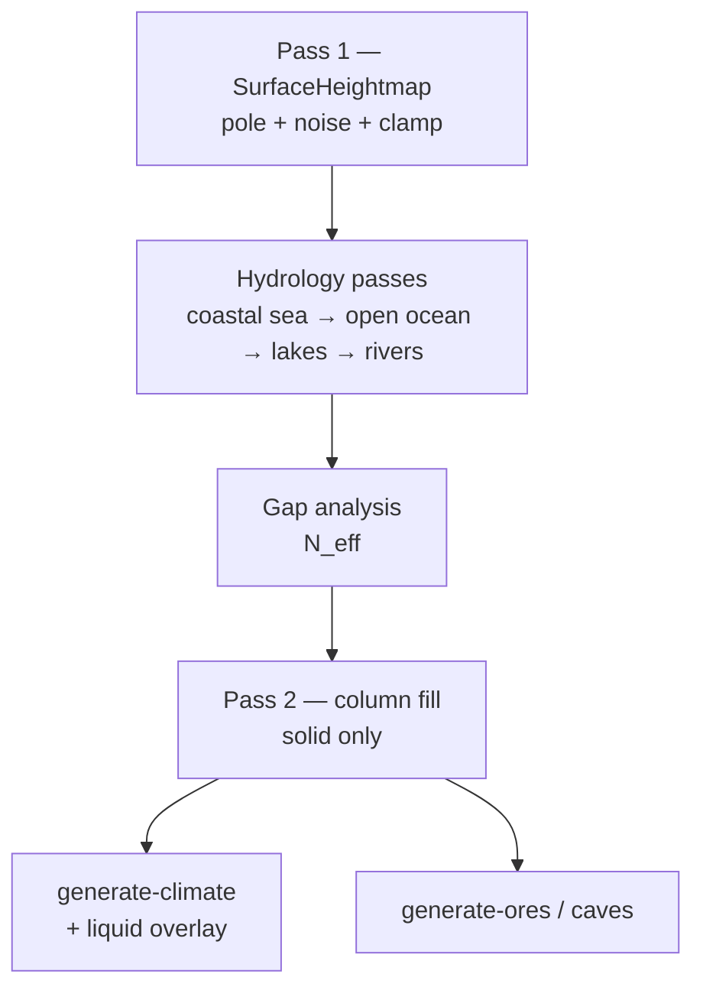
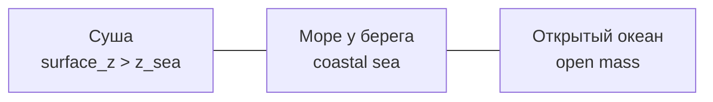
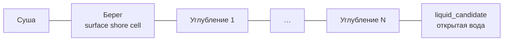
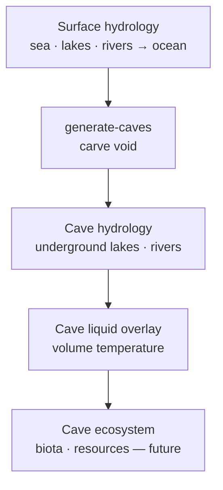
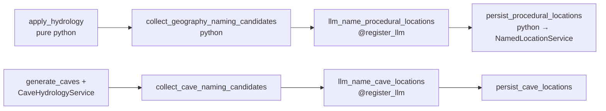

> **Статус:** семантика **утверждена** (2026-06) · **Impl:** ⬜ (H-0…H-7).  
> **Связь:** дополняет [`tz_terrain_generation.md`](./tz_terrain_generation.md) § Terrain layers п.3; **не** заменяет climate liquid overlay.

## Утверждено (2026-06)

| # | Решение |
|---|---|
| U1 | Гидрология — **отдельный домен** pure-generators между Pass 1 и gap analysis |
| U2 | **Море** = coastal sea («большое у берега»); **океан** = coastal ring + open ocean mass; один `liquid_body`, роли в metadata |
| U3 | **Озеро** ≠ море: локальная впадина на суше; **inland_sea** = master mask на `z_sea`, окружён сушей |
| U4 | **Остров / полуостров** — топология после carve (`CoastalLandformClassifier`) |
| U5 | **Река:** возвышенность → устье в море/океан; **горная река** — исток на peak/mountain |
| U6 | **Русло** — bootstrap carve; **поток / оттепель** — runtime (`season_changed`), без regen heightmap |
| U7 | `liquid_body` — climate overlay на `liquid_candidate` из hydrology, **не** глобальный `z≤0` |
| U8 | **Declare (optional):** водоёмы / рельеф — **`NamedLocation`** только если мастер объявляет; иначе autoresolve без location |
| U9 | **Реки** — **connections** (bed + graph); **`NamedLocation` optional** — только для имени (`location_uid` на edge может быть `null`) |
| U10 | **Default: autoresolve** если в template не объявлено; **отключение** — `hydrology.enabled` или `default_<category>.enabled: false` |
| U11 | **`NamedLocation`** — optional: geometry **не требует** location; master declare — всегда вручную |
| U12 | **Подземные реки и озёра** — в **cave systems** (`generate-caves`), **не** surface hydrology; **своя экосистема** (volume climate, без surface rain/pole) |
| U13 | **`materialize_named_locations`** в **шаблоне мира** (default **OFF**); при **ON** — отдельная **LLM-нода DAG** придумывает `display_name` из контекста; python-нода persist |
| U14 | **Река — polyline как connection** (длина, ширина, повороты); **max turn ≤ 45°** между соседними сегментами — острые углы запрещены; planner/validator **smooth** |
| U15 | **Берег + bands:** N из **`default_<category>.bands`** (1…99); shore — **`default_shore`**; local `hydrology_profile` → **warning** |
| U16 | **Именование `default_*`:** baseline мира (`default_rivers`, `default_lakes`, …), переопределяемый локально; **`hydrology.enabled`** — global без префикса |

## Назначение

Зафиксировать **отдельный домен гидрологии** в генерации terrain: **surface** — моря, озёра и реки на heightmap; **caves** — подземные озёра и реки внутри cave volume (отдельный pass, отдельная экосистема).

**Проблема текущего interim (код):**

| Объект | Сейчас | Должно быть |
|---|---|---|
| Море | `z ≤ 0` + climate overlay | **Coastal sea** — «большое у берега» (carve + mask) |
| Океан | то же | **Open ocean mass** + coastal ring; не отдельный terrain type |
| Остров / полуостров | не моделируются | Топология суша vs water после carve (`CoastalLandformClassifier`) |
| Озеро | побочный эффект шума elevation | Локальная впадина заданной формы |
| Река | нет terrain-impl | Узкий канал (bed) от истока к устью / морю |
| Подземное озеро / река | не моделируются | В cave volume после `generate-caves`; volume hydrology + ecosystem |

**Не задача этого ТЗ:** gameplay-симуляция стока, erosion over time, dams — только **bootstrap materialization** мира (eager / declared extent).

---

## Принципы

1. **Hydrology — pure generators** (как `TerrainGeneratorService`): без repos, без async. Persist — `MapCellService` / DAG.
2. **Модифицирует shape до column fill:** hydrology работает на **`SurfaceHeightmap`** (Pass 1 output), **до** gap analysis + column fill — низина = реально более низкий `surface_z`, не только смена `system_terrain`.
3. **Liquid semantics — climate pass:** после carve hydrology выставляет **кандидатов** (`liquid_candidate` / metadata); **`liquid_body` на cells** — по температуре в `generate-climate` (см. [`tz_climate.md`](./tz_climate.md)).
4. **Детерминизм:** `world_seed(world)` + `(gx, gy, pass_id)` — как в terrain noise.
5. **`NamedLocation` optional (U11).** Generators — только geometry. Master **declare** → location из import. **Autoresolve** → без location. **U13:** `materialize_named_locations: true` в **world template** → цепочка DAG: collect candidates → **`llm_name_procedural_locations`** → persist (generators pure).
6. **Connections отдельно:** persist графа — [`tz_structure_connections.md`](./tz_structure_connections.md) + `ConnectionPersistService`; hydrology **materialize** bed + выдаёт polyline для edges.
7. **Surface ≠ caves:** U1–U11 — **surface** heightmap (Pass 1.5). Подземная вода — **cave hydrology** в `generate-caves` (U12); не смешивать masks и invariants.

---

## Место в pipeline



| Этап | Класс / entry | Мутирует | Persist layer |
|---|---|---|---|
| 1 | `run_surface_pass` | `SurfaceHeightmap.surface_z` | — |
| **1.5** | **`HydrologyGeneratorService.apply`** | **`surface_z`, hydrology metadata** | — |
| 1.6 | `run_gap_analysis` | `N_eff` | — |
| 2 | `run_column_fill` | `MapCell[]` solid | `save_terrain_batch` |
| 3 | `ClimateOrchestrator` + `liquidOverlayPass` | `liquid_body` where allowed | `save_pass climate` |

**Инвариант:** после hydrology сосед с `surface_z=2` и озером `surface_z=0` — gap analysis видит **Δz=2** и углубляет колонку берега при необходимости.

---

## Концептуальная модель

### Таксономия воды (утверждено семантически)

Один физический объект — **водная поверхность на `z_sea`**, но **две продуктовые роли**:

| Термин | Смысл | Геометрия (target) |
|---|---|---|
| **Море (sea, coastal)** | «Большое **у берега**» — прибрежная полоса воды у суши | Ячейки `liquid_candidate`, **соседствующие с сушей** (`surface_z > z_sea`); мелководье, заливы, проливы |
| **Океан (ocean, open)** | **Море у берега** + **большой массив воды** вглубь | Connected component: **coastal ring** + **open ocean mass** (дальше от суши, та же `z_sea`, может быть глубже carve) |

**Не два несвязанных типа terrain.** Океан **включает** прибрежное море; «море без океана» — замкнутое **внутреннее море** (окружённое сушей, как большое озеро на `z_sea` — см. ниже).



**Единый `system_terrain`:** `liquid_body` на всех водных ячейках. Различие sea vs ocean — **metadata** (`HydrologyCellRole`: `coastal_sea` | `open_ocean` | `inland_sea`), не отдельный terrain type в registry v1.

**Озеро vs море:** озеро — **локальная впадина суши** (`surface_z` ниже соседей, **не** на глобальном `z_sea`). Море/океан — **глобальный горизонт воды** `z_sea`. Внутреннее море (Каспий) — master mask на `z_sea`, окружённое сушей → role `inland_sea`.

### Sea level (reference)

- **`z_sea`** — эталон уровня моря для мира; **v1:** `0` (как [`tz_locations.md`](./tz_locations.md)).
- Все моря и океаны делят **один** `z_sea`; «глубина» open ocean — optional **`z_floor`** ниже `z_sea` в column fill (v2), не смена surface reference.
- Не путать: interim «всё `z ≤ z_sea` = вода» vs target «вода только там, где hydrology вырезала basin + mask».

### Суша, острова, полуострова

Появляются **после** carve моря/океана и **до** climate overlay — из топологии **суша vs `liquid_candidate`**:

| Форма | Определение (grid, 4/8-neighborhood) |
|---|---|
| **Суша (land)** | `surface_z > z_sea` **или** ячейка вне `liquid_candidate` |
| **Остров** | connected component **суши**, не касающийся «материковой» суши (outer bbox land или master `mainland_mask`) |
| **Полуостров** | суша, connected к материку, с **≥3 сторон** — `coastal_sea` / `open_ocean` (не считая diagonal-only v1: 4-neighbor) |
| **Материк** | largest land component (или master `mainland_mask`) |

**Зачем в hydrology:** порты (`adjacent_terrain: liquid_body`), `river_linear` layout, LLM («островная крепость»), world routes (`sea_route` только по water cells), auto anchors.

**Класс (target):** `CoastalLandformClassifier` — read-only на `SurfaceHeightmap` + `HydrologyResult` → `islands[]`, `peninsulas[]`, `coastline_polylines[]`. **Не** mutates heightmap.

**Мастер:** явные `island` / `coast` NamedLocation anchors переопределяют auto-detect для narrative; geometry всё равно из heightmap.

### Берег и углубление (U15 — утверждено)

Поперечный профиль водоёма / русла — **не** «радиус от точки», а **линия берега + полосы углубления** перпендикулярно границе суша–вода (или к оси реки — в обе стороны от channel).



| Понятие | Смысл |
|---|---|
| **Берег (shore)** | Первая surface-ячейка на контакте с сушей. **`system_terrain` + `system_material`** — из **`world.hydrology.default_shore`** **или** override на edge / spec / `hydrology_profile` |
| **Углубление (deepening band)** | Следующие **1…N** ячеек **от берега внутрь** воды: каждая band **ниже** `surface_z` предыдущей; семантика **всё ещё берег** (тот же terrain/material profile, role `HydrologyCellRole.shore` + `deepening_index`) |
| **Открытая вода** | После последней band — `liquid_candidate`, `surface_z` at basin floor / `z_sea` (climate → `liquid_body`) |

**N по контексту (U15 + U16):** **`world.hydrology.default_<category>.bands`**. Validator: `1 ≤ min ≤ max ≤ 99`.

| Контекст | Ключ в template | Зависимость ширины |
|---|---|---|
| **Река** | `default_rivers.bands` | `river_width_cells` → N в `[min, max]` |
| **Озеро** | `default_lakes.bands` | ширина basin / сегмента берега |
| **Море / океан** | `default_seas.bands` | мелководье (shelf) перед open water |

**Локальный override (U16):** на **`NamedLocation`**, `ConnectionEdge.metadata` или spec declare — поле `hydrology_profile.bands` (или `hydrology_override.bands`). Применяется **вместо** world default для **этой** фичи; orchestration layer пишет **`logger.warning`** (`hydrology bands overridden for <uid>`). Clamp к `[1, 99]`.

**Override shore:** `hydrology_profile.shore` / `ConnectionEdge.metadata.shore` — аналогично, optional warning если меняет terrain/material мира.

**Классы (target):** `ShoreProfile`, `DeepeningBandCarver` — общий для `RiverBedCarver`, `LakeBasinGenerator`, `SeaBasinGenerator`; не дублировать логику disk/radius.

**Column fill:** shore + deepening bands — **solid** surface cells с shore material; `liquid_candidate` только на open water cells после profile. Gap analysis видит ступенчатый склон берега.

### Lake

- **Lake basin** — локальный минимум `surface_z` **на суше** (выше или ниже `z_sea` — отдельный `target_depth`; **не** open ocean).
- **Профиль (U15):** от линии берега basin → deepening bands **1–5** → open water в центре; **не** `radius_cells` disk как единственная модель.
- **Endorheic lake** — без outflow; река не обязана.
- Река **может** впадать в озеро; из озера **может** выходить река к морю (outlet) — v2; v1 достаточно lake **или** sea sink.

### River

**Инвариант (утверждено):** река течёт **из возвышенности → в море или океан** (terminal sink).

| Узел | Правило |
|---|---|
| **Исток (source)** | **Горная река:** peak / mountain cell (`RiverKind.mountain`). **Lowland v2:** local max на равнине |
| **Русло** | monotonic non-increasing `surface_z` вдоль polyline (D8 v1) |
| **Повороты (U14)** | **Плавные:** угол между соседними сегментами polyline **≤ 45°**; **> 45° запрещён** (declare и autoresolve). При необходимости — цепочка waypoint + дуга (см. [`tz_structure_connections.md`](./tz_structure_connections.md) § river curve) |
| **Устье (mouth)** | первая ячейка `coastal_sea` / `open_ocean` / `inland_sea`; **не** произвольная низина без связи с морем |
| **Озеро** | side sink (впадает, может остановиться); **не** заменяет море как финальная цель world-scale river network v1 |

- **River bed** — carve вдоль polyline: channel + **U15 shore/deepening** перpendicular к оси (обе стороны).
- **Geometry** — **`ConnectionEdge` polyline** (как дорога: длина, ширина, повороты); **не** disk/radius от anchor. `NamedLocation` (`geographic.river`) — optional **имя**; форма и shore override — edges.
- **Order:** `COASTAL_SEA` → `OPEN_OCEAN` → `LAKES` → `RIVERS` → optional `LANDFORMS`.

### Горные реки (mountain rivers)

**Семантика:** горная река — река с **истоком на горе**. Русло **геометрически** проложено при bootstrap; **объём воды в русле** — сезонный/runtime слой.

| | Bootstrap (hydrology) | Runtime (climate / season) |
|---|---|---|
| **Что фиксируется** | polyline bed peak → sea; `RiverKind.mountain` | `flow_level`, лёд/вода в русле |
| **Когда** | world init / regen hydrology | смена сезона, оттепель |
| **Кто** | `RiverNetworkPlanner`, `RiverBedCarver` | `recalculate_climate` + `resolve_weather` |

**Классификация истока (v1):**

1. Master: `river_polylines` с tag `kind: mountain`.
2. Auto: `TerrainFeaturePoint` kind=`peak` (prominence ≥ `river_min_source_prominence_m`).
3. Auto v2: `surface_z ≥ mountain_z_threshold` на хребте.

**Инвариант:** горная река **не** начинается на равнине; равнинные притоки — `RiverKind.lowland` (v2).

**Путь:** steep descent → `coastal_sea` / `open_ocean`; на горном участке bed глубже (`mountain_river_depth_factor`).

### Сезон, оттепель и сток (не bootstrap)

**Постоянное русло ≠ постоянный поток.** При **оттепели** (spring, положительный `season_temp_offsets` на горных ячейках) «лишняя» вода **логически** стекает по **уже вырезанным** горным рекам к морю — **без** перегенерации heightmap.

**Смена сезона — `ClimateChangeEvent(kind="season_changed")`** → нода `recalculate_climate` (partial weather) + опционально v2 `flow_level` на `river_cells` из [`tz_climate.md`](./tz_climate.md).

| Сезон | Эффект на горные реки (target) |
|---|---|
| Зима | dry bed / ice на `mountain_cells` |
| Оттепель | melt → `flow_level` ↑ |
| Лето | базовый сток + rainfall на peaks |

**Граница слоёв:** hydrology **не** слушает season; climate **не** carve bed.

---

## Подземная гидрология (cave systems) — U12

**Утверждено:** реки и озёра **могут существовать под землёй** внутри **cave systems** — отдельно от surface hydrology (U1–U7). Там **своя экосистема**: иной климат, нет прямого surface rain/pole, отдельные правила жидкости и биоты (future).

### Два домена

| | **Surface hydrology** | **Cave hydrology** |
|---|---|---|
| **Когда** | Pass 1.5 — между surface pass и gap analysis | **`generate-caves`** — после carve air/cave cells |
| **Где** | `SurfaceHeightmap`, `z ≈ surface`, open ocean `z_sea` | Ячейки **внутри cave volume** (`z < surface_z`, carved void) |
| **Озеро** | Basin на heightmap / `z_sea` horizon | **Подземное озеро** — локальная низина **пола пещеры** |
| **Река** | Исток → устье в **море/океан** (U5) | **Подземная река** — по floor cave; устье в **подземное озеро**, sump, или **выход** (spring/sinkhole) |
| **Mask** | `liquid_candidate` (surface sidecar) | **`cave_liquid_candidate`** — не merge с surface mask |
| **Climate** | pole + `liquidOverlayPass` на surface field | **Volume climate** — см. [`tz_climate.md`](./tz_climate.md) § volume; без pole Voronoi по `(gx,gy)` |
| **NamedLocation** | optional (U8, U11) | optional; чаще без имени |



**Инвариант:** surface river network **не обязан** продолжаться в caves. Связь surface ↔ cave — **optional** (sinkhole, underground spring, flooded tunnel) — declare master или autoresolve v2.

### Cave ecosystem (граница доменов)

Подземная вода — часть **cave system**, не поверхностной биомы:

| Аспект | Surface | Cave system |
|---|---|---|
| Осадки | rainfall, melt с peaks | **нет** прямого rain; пополнение: springs, seepage, optional link с surface |
| Температура | pole + lapse + season | **стабильнее**; geothermal / depth; volume resolver |
| `liquid_body` | surface `liquid_candidate` + temp | **`cave_liquid_candidate`** + volume temp |
| Flora / fauna / ресурсы | terrain + climate zones | **отдельный набор** (glow fungi, blind fish, …) — future TZ / registry |
| Lazy extent | eager surface bbox | **~20 cells** от входа в пещеру + connected cave volume ([`tz_terrain_generation.md`](./tz_terrain_generation.md)) |

Climate **не** применяет surface `liquidOverlayPass` к cave water cells «по z»; нужен **cave liquid pass** (или volume branch в `run_liquid_overlay`) после cave hydrology.

### Declare · autoresolve · opt-out (caves)

Аналог U10, scope **`worlds.caves.hydrology`** (draft):

```json
{
  "caves": {
    "hydrology": {
      "autoresolve": {
        "underground_lakes":  true,
        "underground_rivers": true
      },
      "materialize_named_locations": false
    }
  }
}
```

- **Declared:** master polyline / basin в cave template или `NamedLocation` (optional) + cave connection spec.
- **Autoresolve:** `CaveHydrologyGenerator` внутри lazy cave radius.
- **Disabled:** явный `autoresolve.*: false`.
- **`materialize_named_locations`:** в **world template**; default **false**; при **true** — LLM-нода DAG + persist (U13).

### Connections (подземные реки)

- Bed carve в cave floor cells.
- Graph: `ConnectionEdge` с metadata **`hydrology_domain: cave`** (или `graph_level: cave` — TBD в connections TZ).
- Types v1: reuse `river` + domain tag; v2 optional `underground_river` в registry.
- Persist: тот же `ConnectionPersistService`; subgraph не смешивается с world highways без portal/sinkhole link.

### Target classes (cave pass)

```
generators/terrain/caves/
  caveHydrology/
    types.py                 # CaveLakeSpec, CaveRiverPolyline, CaveHydrologyResult
    caveLakeGenerator.py
    caveRiverPlanner.py
    caveRiverBedCarver.py
    caveHydrologyService.py  # apply after void carve, before cave liquid overlay
```

**Wire:** `generate_caves` → carve void → **`CaveHydrologyService.apply`** → cave liquid overlay → (future) cave ecosystem markers.

**Вне scope H-1…H-7:** surface hydrology impl. Cave hydrology — **Phase C** вместе с заменой caves STUB ([`tz_terrain_generation.md`](./tz_terrain_generation.md) Phase B).

---

## Расположение кода (target)

```
generators/terrain/
  passes/
    surfacePass.py              # existing
    gapAnalysisPass.py          # existing
    columnFillPass.py           # existing
  hydrology/
    types.py                    # HydrologyMask, RiverPolyline, LakeSpec, HydrologyResult, HydrologyCellRole, ShoreProfile, DeepeningBand
    seaLevelPolicy.py           # z_sea resolve
    seaBasinGenerator.py          # Coastal sea — «большое у берега»
    oceanBasinGenerator.py        # Open ocean mass (+ inland_sea mask)
    coastalLandformClassifier.py  # islands, peninsulas, coastline (read-only)
    lakeBasinGenerator.py       # Local lake carve (inland, not z_sea horizon)
    riverNetworkPlanner.py      # high → sea/ocean mouth
    riverBedCarver.py           # Channel + ShoreProfile / DeepeningBandCarver (U15)
    deepeningBandCarver.py        # Shared shore + deepening (river, lake, sea)
    hydrologyGeneratorService.py  # Orchestrator (sync facade)
```

**Facade (контракт):**

```python
class HydrologyGeneratorService:
    """Pure sync — mutates SurfaceHeightmap in place or returns new instance."""

    def apply(
        self,
        world: World,
        locations: list[NamedLocation],
        heightmap: SurfaceHeightmap,
        *,
        master: HydrologyMasterInput | None = None,
        scopes: frozenset[HydrologyScope] = HYDROLOGY_BOOTSTRAP_SCOPES,
    ) -> HydrologyResult:
        ...
```

---

## Классы (ответственность)

### `SeaLevelPolicy`

| Метод | Назначение |
|---|---|
| `resolve_z_sea(world) -> int` | v1: `0`; v2: `world.sea_level_z` если поле добавят |
| `is_land(surface_z, z_sea) -> bool` | `surface_z > z_sea` после carve |

### `SeaBasinGenerator` (coastal sea)

**Смысл:** «большое у берега» — прибрежная полоса воды вдоль **границы суша–вода**.

**Вход:** `SurfaceHeightmap`, `world`, optional master `coastline_polylines` / `sea_mask`.  
**Выход:** `coastal_sea_mask`, mutated `surface_z`, **shore/deepening bands (U15, max 20)** → `liquid_candidate`.

| Режим | Поведение |
|---|---|
| **Master** | Polyline coastline → shore line + deepening bands **1–20** (мелководье) → `z_sea` open water |
| **Procedural v1** | Flood from land boundary: shore cell на контакте, deepening внутрь до 20 cells, затем coastal sea |

**Role tag:** все ячейки этого pass → `HydrologyCellRole.coastal_sea`.

### `OceanBasinGenerator` (open ocean + inland sea)

**Смысл:** **open ocean mass** — большой массив воды **за** coastal sea; плюс **inland_sea** (мастер mask, суша вокруг, `z_sea`).

**Вход:** `SurfaceHeightmap`, `coastal_sea_mask`, optional `open_ocean_mask`, `inland_sea_mask`.  
**Выход:** `liquid_candidate` union, `open_ocean_mask`, mutated `surface_z`.

| Режим | Поведение |
|---|---|
| **Open ocean** | Connected expansion от coastal sea в «открытую» сторону (away from mainland / toward bbox edge) |
| **Inland sea** | Master-only closed mask на `z_sea`, не connected to open ocean |
| **Procedural v1** | bbox edge flood минус land → open mass; merge с coastal ring |

**Role tags:** `open_ocean` | `inland_sea`.  
**Не делает:** temperature, `liquid_body` — только geometry + metadata.

### `CoastalLandformClassifier`

**Read-only** после sea + ocean passes.

```python
@dataclass
class CoastalLandforms:
    islands:           list[LandComponent]   # uid, cells, bbox
    peninsulas:        list[LandComponent]
    mainland_uid:      str | None
    coastline_edges:   list[tuple[tuple[int,int], tuple[int,int]]]  # land–water
```

Используется: settlement port probe, debug preview, LLM payload (DAG, позже).

### `LakeBasinGenerator`

**Вход:** `SurfaceHeightmap`, `list[LakeSpec]`.  
**LakeSpec:** `{ shoreline: polyline|mask, target_depth_m, shore_profile?, deepening_cells? }` — из master **или** auto-detect basins (`detect_terrain_features` kind=`basin`).

**Алгоритм v1 (U15):**

```
from shoreline inward (perpendicular or distance transform):
  band 0 = shore cell (terrain/material from defaults or spec)
  bands 1..N = deepening (N ∈ [1, 5], from width context)
  center = open water (liquid_candidate, lowest surface_z)
```

**Idempotency:** повторный apply с тем же spec — тот же результат (deterministic).

**Deprecated draft:** `radius_cells` disk-only — fallback autoresolve v0, не целевая семантика.

### `RiverNetworkPlanner`

**Вход:** `SurfaceHeightmap`, `liquid_candidate` + roles (`coastal_sea`, `open_ocean`), `lake_masks`, `world`.  
**Выход:** `list[RiverPolyline]` — ordered path **source (peak) → mouth (sea/ocean cell)**.

| v1 | v2 (отложено) |
|---|---|
| D8 descent от peaks к **nearest coastal_sea/open_ocean** cell | Accumulation map |
| Reject path if mouth not on `liquid_candidate` | Lake outlet chains |
| **Turn constraint (U14):** каждый шаг polyline — deflection **≤ 45°** от предыдущего сегмента; иначе insert waypoint / arc subdivide | Meander noise |
| Max N rivers per bbox | — |

**Post-process (U14):** сырой D8-path с 90° изломами **не** persist — `smooth_river_polyline(max_turn_deg=45)` перед `RiverBedCarver` и emit edges. Master declare: validator отклоняет или auto-smooth (impl choice: **reject in import**, smooth in autoresolve).

**Sources:** master polylines (reverse) → auto **peaks / mountain cells** (`RiverKind.mountain`) → lowland sources v2.  
**Sinks (priority):** `coastal_sea` → `open_ocean` → `inland_sea`; озеро — optional branch, не terminal для main trunk v1.

### `RiverBedCarver`

**Вход:** `SurfaceHeightmap`, `list[RiverPolyline]`, `RiverCarveParams`, optional per-edge shore override.  
**Параметры (world registry или defaults):**

```json
{
  "river_width_cells": 1,
  "channel_depth_step_m": 1,
  "max_turn_angle_deg": 45
}
```

`bands` и `shore` — из **`world.hydrology.default_rivers`** / **`default_shore`** + optional local override (U16).

**Metadata:** `HydrologyResult.river_cells`, `shore_cells`, `deepening_cells` для downstream.

### `HydrologyGeneratorService`

Оркестратор scopes (аналог `SettlementPersistScope`):

```python
class HydrologyScope(StrEnum):
    COASTAL_SEA = "coastal_sea"   # «море у берега»
    OPEN_OCEAN  = "open_ocean"    # массив воды + inland_sea masks
    LAKES       = "lakes"
    RIVERS      = "rivers"
    LANDFORMS   = "landforms"      # classify only, no carve

HYDROLOGY_BOOTSTRAP_SCOPES = frozenset({
    HydrologyScope.COASTAL_SEA,
    HydrologyScope.OPEN_OCEAN,
    HydrologyScope.LAKES,
    HydrologyScope.RIVERS,
})
```

**Порядок внутри `apply`:** `COASTAL_SEA` → `OPEN_OCEAN` → `LAKES` → `RIVERS` → optional `LANDFORMS`.

**Alias scope `ocean` (debug):** `COASTAL_SEA` + `OPEN_OCEAN`.

---

## World template (N+1) — утверждено

### Принцип: `default_*` · global off · declare · autoresolve · bands · materialize

**Именование (U16):** ключи с префиксом **`default_`** — baseline мира, **переопределяемый** локально (`hydrology_profile`, edge metadata). Без префикса — **только global policy**, не override per feature: `enabled`, `materialize_named_locations`.

**Kill switches** — в **`world.hydrology`**:

| Флаг | Эффект |
|---|---|
| **`hydrology.enabled: false`** | **Вся surface-вода** — skip `HydrologyGeneratorService.apply` |
| **`default_rivers.enabled: false`** | Нет autoresolve рек; declared edges — carve |
| **`default_lakes.enabled: false`** | Нет autoresolve озёр; declared specs — carve |
| **`default_seas.enabled: false`** | Нет autoresolve морей/океанов; declared — carve |

`default_<category>.enabled: true` + `autoresolve: false` → только declare, без procedural.

**Bands (U15)** — внутри каждого **`default_<category>`**:

```json
"bands": { "min": 1, "max": 99 }
```

Validator: `1 ≤ min ≤ max ≤ 99`. Эталон: `default_rivers` / `default_lakes` `max: 5`, `default_seas` `max: 20`.

**Две независимые оси** (не путать):

| Ось | Кто | Default | Настройка |
|---|---|---|---|
| **Geometry** | pure generators | `default_*` **enabled** + **autoresolve** ON | `hydrology.default_rivers` … |
| **`NamedLocation`** | LLM DAG + persist | не создавать | `materialize_named_locations: false` |

| Режим | Когда | Geometry | `NamedLocation` |
|---|---|---|---|
| **Declared** | Мастер положил location / connection в import | из template | **из template** (master) |
| **Autoresolve** | Нет declare; category autoresolve ON | procedural (deterministic seed) | **нет** (default U11) |
| **Autoresolve + materialize (U13)** | geometry autoresolve ON **и** `materialize_named_locations: true` в template | procedural | **LLM names** → persist `NamedLocation` |
| **Disabled** | `hydrology.enabled: false` **или** `default_<category>.enabled: false` | категория не autoresolve | — |

**Default:** geometry autoresolve ON; **`materialize_named_locations: false`** в шаблоне мира. Generators **никогда** не пишут в `named_locations` и **не** вызывают LLM.

**DAG (target)** — только если `materialize_named_locations: true` в **world template** (import JSON):



| Нода | Тип | Роль |
|---|---|---|
| `collect_*_naming_candidates` | python | Собрать unnamed features из `HydrologyResult` / cave pass; **skip** если `materialize_named_locations: false` |
| **`llm_name_procedural_locations`** | **llm** | Batch-imena: `display_name` (+ optional `display_description`) **из контекста мира** |
| `llm_name_cave_locations` | **llm** | То же для подземных озёр/рек (U12); отдельная нода или scope в одной — impl choice |
| `persist_*` | python | Upsert `NamedLocation`, link `ConnectionEdge.location_uid`; **не** перезаписывает master declare |

**LLM payload (draft):** world glossary, `state_uid`, climate zone, соседние declared locations, feature kind (`lake`, `peak`, `river`, `underground_lake`, …), anchor, размер/роль (`coastal_sea`, `mountain_river`), polyline summary для рек. **Не** сырой `map_cells` grid.

**Контракт LLM-ноды:** `contract_json` + validator (`feature_id` ref, non-empty `display_name`, unique в batch) + repair loop — см. [`tz_engine_flow.md`](./tz_engine_flow.md).

**Debug path 2:** без LLM — persist **не** runs (или placeholder `display_name` только в smoke — не product).

### World template — `hydrology` / `caves` (draft JSON)

Настройка **только в шаблоне мира** (import bundle / editor мастера), не hardcode в generators.

```json
{
  "hydrology": {
    "enabled": true,
    "default_shore": {
      "system_terrain": "shore",
      "system_material": "sand"
    },
    "default_rivers": {
      "enabled": true,
      "autoresolve": true,
      "bands": { "min": 1, "max": 5 }
    },
    "default_lakes": {
      "enabled": true,
      "autoresolve": true,
      "bands": { "min": 1, "max": 5 }
    },
    "default_seas": {
      "enabled": true,
      "autoresolve_coastal_sea": true,
      "autoresolve_open_ocean": true,
      "bands": { "min": 1, "max": 20 }
    },
    "default_landforms": {
      "enabled": true,
      "autoresolve": true
    },
    "materialize_named_locations": false
  },
  "caves": {
    "hydrology": {
      "enabled": true,
      "autoresolve": {
        "underground_lakes":  true,
        "underground_rivers": true
      },
      "materialize_named_locations": false
    }
  }
}
```

**Локальный override (на declare-объекте):**

```json
{
  "location_uid": "loc-template-lake-declared",
  "system_location_subtype": "lake",
  "hydrology_profile": {
    "bands": { "min": 2, "max": 12 },
    "shore": { "system_terrain": "shore", "system_material": "gravel" }
  }
}
```

Loader: `resolve_hydrology_bands(category, world, local?)` → `world.hydrology.default_<category>.bands`; local `hydrology_profile` → **warning**.

`materialize_named_locations` — не `default_*`: world-wide, не override per location.

**Эталон bundle:** [`fixtures/world_template.json`](../fixtures/world_template.json).

### Именованные объекты на карте

Единая модель **`NamedLocation`** — см. [`tz_locations.md`](./tz_locations.md) § «Именованные объекты карты». Ниже — типы, которые читает hydrology / terrain.

| `system_location_type` / subtype | Роль | Generator |
|---|---|---|
| `geographic.mountain` | Массив / хребет; narrative + optional elevation bias | terrain surface (future), river source context |
| `geographic.peak` | Вершина; исток **горной реки** | `RiverNetworkPlanner` source bind |
| `geographic.plain` | Именованная равнина; flat bias / zone label | terrain surface (future) |
| `geographic.lake` | Inland lake basin | `LakeBasinGenerator` |
| `geographic.sea` | Coastal sea / залив у берега | `SeaBasinGenerator` |
| `geographic.ocean` | Open ocean mass | `OceanBasinGenerator` |
| `geographic.inland_sea` | Замкнутое море на `z_sea` | `SeaBasinGenerator` + role `inland_sea` |
| `geographic.island` / `coast` | Narrative override landform classifier | `CoastalLandformClassifier` |
| `geographic.river` | **Имя** русла (geometry — connection) | link → `ConnectionEdge` |

`map_x`, `map_y`, optional footprint / polygon ref — anchor + bounds. Hydrology pass materialize carve из declared location; autoresolve не runs для **этого** объекта.

**Loader:** filter `locations` where `system_location_type == "geographic"` (или legacy top-level `sea`/`lake` до миграции registry) → split by subtype into `HydrologyMasterInput` lists.

### Реки — connections + имя

1. **Terrain:** `RiverBedCarver` (bed в heightmap).
2. **Graph:** `ConnectionNode` + `ConnectionEdge`, persist `ConnectionPersistService`.
3. **Declare:** `ConnectionEdge` list (polyline + width); **не** disk/radius от anchor. **Autoresolve:** `RiverNetworkPlanner` → smooth (U14) → emit edges.
4. **Types:** `river`, `mountain_river` в `connection_type_registry`.
5. **Название (optional):** `NamedLocation` (`geographic.river`) **или** `ConnectionEdge.location_uid`; оба могут быть `null` — безымянная река.
6. **Повороты (U14):** между соседними сегментами **≤ 45°**; см. connections TZ § river curve.

См. § «Связь с settlement и connections» ниже.

### Loader → `HydrologyMasterInput`

```python
@dataclass
class HydrologyCategoryPolicy:
    enabled:    bool = True
    autoresolve: bool = True          # rivers / lakes / landforms
    bands:      tuple[int, int] = (1, 5)  # (min, max), validator 1..99

@dataclass
class HydrologySeasPolicy:
    enabled:                 bool = True
    autoresolve_coastal_sea: bool = True
    autoresolve_open_ocean:  bool = True
    bands:                   tuple[int, int] = (1, 20)

@dataclass
class HydrologyWorldPolicy:
    enabled:          bool = True          # global; not default_* — not overridable per feature
    default_shore:    dict = field(default_factory=lambda: {
        "system_terrain": "shore", "system_material": "sand",
    })
    default_rivers:   HydrologyCategoryPolicy = field(default_factory=HydrologyCategoryPolicy)
    default_lakes:    HydrologyCategoryPolicy = field(default_factory=lambda: HydrologyCategoryPolicy(bands=(1, 5)))
    default_seas:     HydrologySeasPolicy = field(default_factory=HydrologySeasPolicy)
    default_landforms: HydrologyCategoryPolicy = field(
        default_factory=lambda: HydrologyCategoryPolicy(bands=(1, 1)),
    )

@dataclass
class HydrologyLocalProfile:
    bands: tuple[int, int] | None = None
    shore: dict | None = None

@dataclass
class HydrologyNamedLocationPolicy:
    materialize_autoresolved: bool = False   # U13

@dataclass
class HydrologyMasterInput:
    world_policy:         HydrologyWorldPolicy = field(default_factory=HydrologyWorldPolicy)
    named_locations:      HydrologyNamedLocationPolicy = field(default_factory=HydrologyNamedLocationPolicy)
    declared_geographic:  list[NamedLocation] = field(default_factory=list)
    declared_river_edges: list[ConnectionEdge] = field(default_factory=list)
    declared_river_names: list[NamedLocation] = field(default_factory=list)
    local_profiles:       dict[str, HydrologyLocalProfile] = field(default_factory=dict)  # uid → override
```

**Deprecated:** flat `autoresolve.*`, nested `defaults.shore`, keys `rivers`/`lakes`/`seas`/`landforms` without `default_` prefix.

**Resolve bands:**

```python
def resolve_hydrology_bands(
    category: Literal["rivers", "lakes", "seas"],  # maps to hydrology.default_<category>
    world_policy: HydrologyWorldPolicy,
    local: HydrologyLocalProfile | None,
    *,
    log: logging.Logger,
    feature_ref: str,
) -> tuple[int, int]:
    """World default → clamp 1..99; local override → same clamp + log warning."""
```

---

## Связь с climate (liquid overlay)

| Слой | Кто решает «это вода» геометрически | Кто решает «жидкость vs лёд» |
|---|---|---|
| Hydrology | carve + `liquid_candidate` mask | — |
| Climate | — | `liquid_precipitation_mult(temperature)` |

**Изменение `liquidOverlayPass` (target):**

- **Было:** `z ≤ 0` AND temp OK → `liquid_body`
- **Станет:** `(gx,gy) in hydrology.liquid_candidate` OR `(cell flagged in MapCell metadata TBD)` AND temp OK → `liquid_body`

**Frozen / vapor:** та же material registry; overlay может ставить `system_material=ice` без смены carve depth.

**Cross-ref:** [`tz_terrain_generation.md`](./tz_terrain_generation.md) § Terrain layers п.3; [`tz_climate.md`](./tz_climate.md) § precipitation liquid.

---

## Связь с settlement и connections

| Потребитель | Что читает |
|---|---|
| `SettlementAssembler` port / `adjacent_terrain: liquid_body` | top surface cells после full pipeline |
| `DistrictAssembler` `river_linear` layout | соседство с `river_cells` / `liquid_body` |
| **`ConnectionPersistService`** | **`ConnectionEdge`** `river` / `mountain_river` после hydrology (U9) |
| `WorldRouteGenerator` `sea_route` | connected `liquid_body` (море), не substitute реки |
| `detect_terrain_features` | `liquid_body` **после** climate — anchors only |

**Persist cycle (rivers, target):**

```
HydrologyGeneratorService (bed + emit edges)
  → ConnectionPersistService.persist_graph(nodes, edges)
  → SettlementPersistService / map_cells (bed geometry)
```

Declared river в template = declared `ConnectionEdge` в bundle **до** autoresolve planner.

**Порядок bootstrap мира (DAG target, утверждено):**

```
run_surface_pass (P1)
  → apply_hydrology (coastal_sea → open_ocean → lakes → rivers)
  → run_gap_analysis + run_column_fill (P2)
  → generate-ores / generate-caves
  → generate_climate (cell_weather + liquid overlay)
```

Settlement outdoor persist — **после** regional terrain exists (как сейчас lazy terrain).

---

## Persist и debug

| Scope | Generate | Persist |
|---|---|---|
| `hydrology` (metadata only) | `HydrologyResult` in memory / debug JSON | ⬜ optional `world_hydrology` table — **не v1** |
| `map_cells` geometry | lower `surface_z` in column fill | existing `save_terrain_batch` |
| `liquid_body` | climate overlay | existing `save_pass climate` |

**Debug harness (target):**

```
POST /api/worlds/{world_uid}/map/generate-hydrology?scope=ocean|lakes|rivers|full
```

Тонкая оболочка: `run_surface_pass` → `HydrologyGeneratorService.apply` → gap + fill → return preview JSON (heightmap diff + river polylines). **Не product path** — mirror DAG.

---

## DAG nodes (контракт, impl отложено)

| Node id | Phase | Calls |
|---|---|---|
| `generate_surface_skeleton` | pre_llm / world init | `run_surface_pass` |
| `apply_hydrology` | после skeleton | `HydrologyGeneratorService.apply` |
| `fill_terrain_columns` | после hydrology | gap + `run_column_fill` + persist |
| `generate_climate` | после fill | orchestrator + liquid overlay |

Deps: `apply_hydrology` → `fill_terrain_columns` → `generate_climate`.

---

## Фазы реализации

> **План до DAG:** Phase **D HY** (D HY-1…D HY-7a) — [`tz_terrain_generation.md`](./tz_terrain_generation.md) § Phase 9+ «D HY»; агент — [`.cursor/plans/hydrology-pre-dag.md`](../.cursor/plans/hydrology-pre-dag.md).  
> **После DAG:** H-7b (`apply_hydrology` node), U13 LLM naming, cave hydrology U12 (Phase B caves).

| Фаза | Deliverable | DoD | Pre-DAG |
|---|---|---|---|
| **H-0** | Этот документ + cross-links | ✅ семантика U1–U13 | — |
| **H-1** | `types`, `SeaLevelPolicy`, `HydrologyGeneratorService` stub | unit: z_sea resolve | **D HY-1** |
| **H-1b** | `load_hydrology_from_world` + `HydrologyAutoresolvePolicy` | declared locations + autoresolve flags | **D HY-1** |
| **H-2** | `SeaBasinGenerator` + `OceanBasinGenerator` | declared `sea`/`ocean` locations + autoresolve | **D HY-2** |
| **H-2b** | `CoastalLandformClassifier` | island / peninsula detect on fixture | **D HY-2** |
| **H-3** | `LakeBasinGenerator` + master `lake_specs` | 1 lake in fixture world | **D HY-3** |
| **H-4** | `RiverNetworkPlanner` + `RiverBedCarver` + **edge emit** | peak → sea; `ConnectionPersistService` | **D HY-4** |
| **H-5** | Procedural lakes/rivers (optional) | deterministic on `world_seed` | **D HY-5** *(optional)* |
| **H-6** | `liquidOverlayPass` reads hydrology mask | no global `z≤0` rule | **D HY-6** |
| **H-7a** | Wire in `build_surface_heightmap` + `POST generate-hydrology` | full surface pipeline via debug API | **D HY-7a** |
| **H-7b** | DAG node `apply_hydrology` | wiring materialization path **1** | ⬜ **после DAG** |

**Вне H-1…H-7a:** dynamic hydrology (cataclysm flood), [`tz_terrain_generation.md`](./tz_terrain_generation.md) § local terrain patch.  
**U12 cave hydrology:** Phase B (caves STUB), не D HY. **U13 LLM naming:** H-7b / DAG only.

---

## Открытые вопросы

| # | Вопрос | Решение (утверждено) |
|---|---|---|
| Q1 | `z_sea` per-world vs const `0` | const `0` v1 |
| Q2 | River width meters vs grid cells | grid cells v1 |
| Q3 | `liquid_candidate` storage | sidecar v1; MapCell metadata v2 |
| Q4 | Underwater subsurface terrain | dry rock band v1; **cave water** — отдельный домен U12, не surface hydrology |
| Q5 | Closed planet ocean wrap | defer |
| Q6 | `inland_sea` vs large lake | declared `inland_sea` location vs `lake`; autoresolve distinguishes by mask |
| Q7 | Peninsula neighbor rule | 4-neighbor v1 |
| Q8 | Mountain source detection | peak feature v1 |
| Q9 | Melt flow storage | sidecar v1; `cell_states` v2 |
| ~~Q10~~ | Declare vs autoresolve vs disable | **U10/U16:** global `enabled`; `default_<category>.enabled`; declare when bundle explicit |
| ~~Q11~~ | River data model | **connections** like roads; `river` / `mountain_river` types |
| Q12 | Footprint format for sea/lake on map | **U15:** shoreline + deepening bands; река — polyline (U14). Override shore на edge/spec |
| Q13 | Surface ↔ cave water link | optional sinkhole/spring v2; default isolated cave hydrology |
| ~~Q14~~ | Имена для materialize | **U13:** LLM-нода DAG из контекста; не name pool / seed |

---

## Checklist

### Семантика (утверждено)

- [x] TZ reviewed — семантика 2026-06
- [x] Sea / ocean: coastal sea + open ocean mass
- [x] Islands / peninsulas via `CoastalLandformClassifier`
- [x] Mountain river: bootstrap bed vs seasonal flow boundary
- [x] Template policy: declare on map · autoresolve default · explicit opt-out
- [x] Rivers as connections (persist cycle)
- [x] NamedLocation optional for geography (unnamed autoresolve OK)
- [x] U13: `materialize_named_locations` in world template → LLM DAG node + persist; default OFF
- [x] U16: `default_*` naming; global `enabled` without prefix; local override + warning
- [x] U15: shore + bands from world category settings; local override
- [x] Cave hydrology U12: underground lakes/rivers, separate ecosystem

### Impl

- [ ] `HydrologyGeneratorService` + scopes
- [ ] `SeaBasinGenerator` + `OceanBasinGenerator`
- [ ] `CoastalLandformClassifier` (islands, peninsulas)
- [ ] `LakeBasinGenerator`
- [ ] `RiverNetworkPlanner` + `RiverBedCarver`
- [ ] Integrate between surface pass and gap analysis
- [ ] Update `liquidOverlayPass` contract
- [ ] `CaveHydrologyService` + cave liquid overlay (U12)
- [ ] `collect_geography_naming_candidates` + **`llm_name_procedural_locations`** + `persist_procedural_locations` (U13)
- [ ] Cave chain: `llm_name_cave_locations` + persist (U12 + U13)
- [ ] Debug route + smoke script
- [ ] Wire in `build_surface_heightmap` + `POST generate-hydrology` (H-7a / D HY-7a)
- [ ] DAG node `apply_hydrology` (H-7b — **после DAG**)
- [ ] Cross-update `tz_terrain_generation.md` liquid § (remove interim `z≤0` as final)

---

## Changelog

| Дата | Изменение |
|---|---|
| 2026-06 | **U16:** rename to `default_rivers` / `default_lakes` / `default_seas` / `default_shore` / `default_landforms` |
| 2026-06 | **U15:** shore + bands; world template defaults |
| 2026-06 | **U14:** river turns ≤ 45° per segment; polyline = connection geometry; Q12 split river vs lake/sea |
| 2026-06 | Initial draft — классы hydrology, pipeline между P1 и gap analysis, границы climate/connections |
| 2026-06 | Sea vs ocean semantics: coastal sea + open ocean mass; rivers peak→sea; islands/peninsulas |
| 2026-06 | Mountain rivers: peak sources, seasonal melt via `season_changed` (runtime, not carve) |
| 2026-06 | U8–U10: template declare (map locations), rivers=connections, autoresolve default, explicit opt-out |
| 2026-06 | U11: NamedLocation optional — geometry without name; declare only when master adds location |
| 2026-06 | U12: underground lakes/rivers in cave systems; separate volume ecosystem; not surface hydrology |
| 2026-06 | U13: world template `materialize_named_locations`; LLM DAG node names features from context; python persist |

---

## Связанные документы

| Документ | Роль |
|---|---|
| [`tz_terrain_generation.md`](./tz_terrain_generation.md) | Multi-pass skeleton, gap analysis, layers |
| [`tz_climate.md`](./tz_climate.md) | Liquid overlay, temperature phase |
| [`tz_structure_connections.md`](./tz_structure_connections.md) | `sea_route`, world routes |
| [`tz_city_generation.md`](./tz_city_generation.md) | Port, `river_linear`, `adjacent_terrain` |
| [`tz_locations.md`](./tz_locations.md) | `z=0` sea level, coordinates |
| [`tz_generator_technical_debt.md`](./tz_generator_technical_debt.md) | Registry smells (interim liquid overlay) |
| `.cursor/rules/layer-boundaries.mdc` | generate ≠ persist ≠ LLM |
