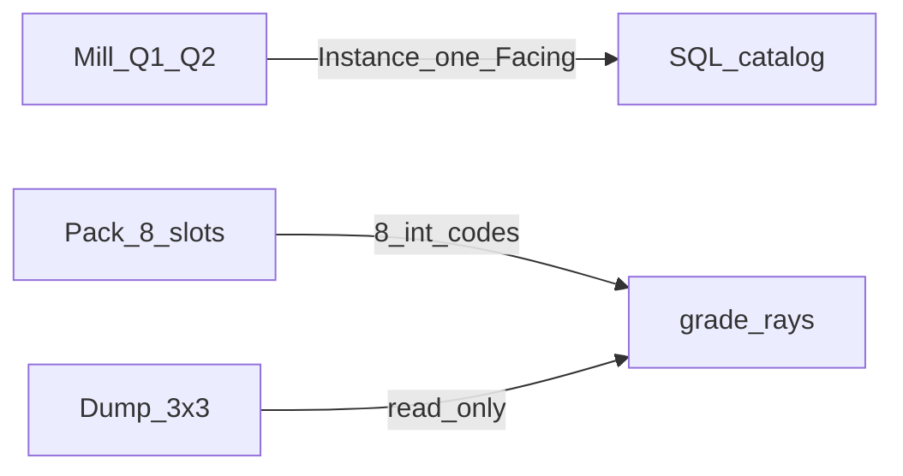

# Terrain relief grade — generate

**Статус:** SoT **generate** (очереди, mill/pack, шаблоны/pick, canal/obstacle, SQL catalog). Writer sidecar (`pack_cell_slots` → `SCH-GRADE-CELL-SLOTS`) **есть**. Dump читает `slots[8]`. Persist occupancy-validator (`validate_grade_cell_slots`) — **только dev** (`DEBUG_GRADE_SLOT_VALIDATE=1`); product bake не обходит. Не закрыт **набор клеток** обхода на тайле ([`tz_generator_technical_debt.md`](./tz_generator_technical_debt.md) **R41-T-25**). Старый `rays[]` I/O жив для locked-тестов — [`tz_terrain_relief_technical_debt.md`](./tz_terrain_relief_technical_debt.md) **RELIEF-TD-4**.

| Документ | Роль |
|---|---|
| Этот файл | mill Q1/Q2, pack-слоты, стрелки, шаблоны/pick, canal/obstacle, SQL DDL + R43 |
| [`tz_terrain_relief_consume.md`](./tz_terrain_relief_consume.md) | dump 3×3, sidecar paths, LLM-чтение |
| [`tz_terrain_relief_technical_debt.md`](./tz_terrain_relief_technical_debt.md) | техдолг **кода** (dual sidecar, жирные классы, хардкоды). Не generate SoT |
| [`tz_terrain_relief_v1_superseded.md`](./tz_terrain_relief_v1_superseded.md) | архив: R36 bake (u–w), R37 envelope подробно, L2 volume, C29, примеры JSON pick |

**Не трогать:** L0→L2 parent-light ([`tz_world_pack_storage.md`](./tz_world_pack_storage.md) § Идея 2); DAG; Occupancy v1; `0002_*.sql`.



---

## Граница слоёв

| Слой | Делает | Не делает |
|---|---|---|
| **Mill** | вершина → фронт → **Instance** (один θ, один `Facing` **строка**) | 8 Instance с тела; pack-коды; глиф ASCII |
| **Pack** | 8 слотов клетки: позиция края + **один int** (§ Pack-слот) | новый Grade; Unicode в sidecar |
| **Dump** | глиф из кода: луч / `.` / `┃` / `+` | invent слот из z; пустой край как норму |
| **Валидатор** | ERROR в лог, generate не abort | дописывать слоты; закрывать из z |

Dump и контракт 3×3 — consume. Envelope длинного mill-луча (plains θ≤45°, L min 20) — архив **R37**; knobs шаблона не круче/короче пола. **Не** применять порог 45° к leftover-паре L=1 как «иначе SHEER».

---

## Угол (θ)

θ = `atan(h/L)` (архив R36d). Клетка куб. Этот файл — **grade открытой местности** (mill/pack leftover).

**У местности** knobs шаблона + конверт (этот § Шаблоны; пол — архив R37). **Отдельные объекты** (уже: холм — helper Δz, не Grade, [`tz_world_pack_storage.md`](./tz_world_pack_storage.md) § L2 open-land hills) живут на host и **наследуют поведение родителя**, не подменяют leftover pack.

**90° у grade местности не бывает.** Geom-A с L≥1 даёт θ ∈ **(0, 90)**.

| θ (местность) | Kind (по умолчанию) | Dump |
|---|---|---|
| (0, 80) | **SLOPE** (Instance) | dump: глиф `GradeOctant` (поток) |
| [80, 90) | **SHEER** (Instance + pack `GradeSheer`) | `┃` |

Писать **честный** θ на Instance. Не omit угол у SHEER. Не называть SHEER всё, что круче 45°. Код leftover-пары L=1: `LEFTOVER_SHEER_MIN_DEG` / `LEFTOVER_PAIR_LENGTH_CELLS` в `gradeLeftoverPair` — **не** конверт plains 45°.

**Нависание (θ ≥ 90, в т.ч. > 90)** — не слот leftover открытой клетки. Это **онтология отдельных объектов** (нависающий обрыв, пещера): углы там могут быть нависающими. Объект наследует поведение родителя (местность, на которой сидит). Не смешивать с mill/pack этого файла. Схема пещеры/обрыва **не** в этом ТЗ.

Архив R36e (`facing=none`, angle N/A, «θ≈90») — **не** generate SoT leftover.

---

## Шаблоны и настройки (мир / локация)

Мастер **не** красит SHEER/SLOPE по клеткам (архив **R10**). Настройки — шаблон + pick. Точечный `sides[].kind` — только сторона горы (сектор form), не клетка карты.

**Два слоя (не смешивать с leftover pack § Угол):** mill Instance / ribbon читает **шаблон + конверт**. Kind leftover-пары L=1 — по θ, не по `|Δz|` и не по `slope_outcome` 45°. **Δz сам не выбирает** SHEER vs SLOPE для mill (**R14**): knobs + seeded noise (**R15**).

### Библиотека и мир

Как здания: глобальная библиотека + per-world pointers (**R11**). Тела **не** внутри `world` JSON (**R35**).

| Где | Что |
|---|---|
| Диск | корень **`relief_templates/`** (не `structures_templates/`). Пак `{pack_name}/{system_name}.json`; stem = `system_name`; иначе **reject** (**R29**) |
| SQL library | плоский ряд `relief_templates` после import |
| Мир | `relief_template_registry` (uid, display, `context`, imported_at) + `relief_pick_policy` |
| Bundle | top-level секция `relief_templates` (тела) + pointers/policy в `world`. Import: library ← секция, registry/policy ← `world` |

Мастер: **(A)** файл/пак → library → registry и/или **(B)** world bundle (**R18**).

У шаблона **ровно один** `context` (**R17**), не список. v1: `mountain` \| `open_land` \| `shore` \| `road_shoulder` \| `ravine` (**R13**). Приоритет context на клетке: `road_shoulder > shore > mountain > ravine > open_land` (один шаблон, не blend).

### Pick: мир → локация / объект

На **каждый** context — `fixed` \| `random` \| `round_robin` (**R19**). `fixed` требует `default_template_uid` в registry.

| Уровень | Wire | Роль |
|---|---|---|
| **Мир** | `worlds.relief_pick_policy` | default на весь мир per context |
| **Объект** (в т.ч. **локация**) | `ObjectReliefPickPolicy` partial | перекрывает мир (**R31**). Низина локации — `ravine`; берег — один слот `shore` |
| **Сторона горы** | `sides[i].relief_pick_policy` | target; **v1 shipped = world → object only** (side — deferred, **RELIEF-T-5**) |

`effective = merge(world, object?)`; для гор target ещё `side[i]?`. Нет policy на объекте → мир.

Шум pick/kind **детерминирован**: `world_seed` + `(context, template_uid, x, y [, edge])` (**R15**). Пустой candidates / битый `fixed` / дыра schedule → **warn + soft fallback**, не abort (**R21**). Не путать с **R34 skip**.

### Conditions (местность в шаблоне)

Не-mountain: `conditions[]`. ≤1 блок на `ReliefConditionTerrain`. На terrain — **ровно три** policy: `slope_none` / `slope_down` / `slope_up` (**R26**).

**XOR Mode A \| B** на весь шаблон (**R32**), не смешивать с Geom-A/B/C:

| | Wire |
|---|---|
| **A** | у каждого case один `delta_z`; нет `bands` |
| **B** | у down/up `bands[]` (`delta_z_min >= 1`, опц. `delta_z_max`); у none `bands: []`; нет `delta_z` |

`ReliefConditionTerrain` ↔ `system_terrain` 1:1 по имени (**R34**). Берег: `shore_river` \| `shore_mountain_river` \| `shore_lake` \| `shore_sea` (не один `shore`). Клетка вне таблицы / без condition → **skip grade**, не «левый SLOPE» (R21). Import шаблона может upsert **missing** ключи `terrain_registry` (canonical, не затирать); N+1 правит API мира.

`slope_weight + sheer_weight == 1` (±eps), иначе **reject** шаблона (**R27**).

Geom knobs на case/band: `slope_length_cells` XOR `target_angle_deg` (omit L → 1). Невалидный geom → WARN + 20°, не reject import (архив **R36b**). Политика задаёт порог/knobs, не высоту карты (`h` = measured `|dz|`). Пресеты UI — не backend (**R30**).

**Mountain:** `side_recipe` XOR weights \| pattern \| fixed kind; пусто → seeded random per side (**R33**). Непустые Mode A/B `conditions` на `context: mountain` → **reject**. Не-mountain + `side_recipe` → **reject**. `MountainKind` ≠ grade preset.

`road_shoulder`: typed conditions; left/right выводит движок (**R25**). Полотно `road` не SHEER (**R20**).

Холм **не** `ReliefTemplate`. Примеры Mode A/B JSON — архив § «Шаблоны рельефа».

### Canal (R28 / R36p / R36q)

Runtime: `EarthenCanal` XOR `StructureCanal` (`dataModel/terrain/relief/canal.py`). Materialize built — BAR-1. Terrain: `draw_canal` / `build_canal`.

**Knobs на case/band (нормальный path, места хватает):**

| | |
|---|---|
| `earthen_canal` | optional bool; omit = не задан |
| `structure_canal` | optional `system_type` ∈ `worlds.canal_template_registry` |
| оба заданы | **reject** |
| оба omit | без canal на этом path |

Плоский `structure_refs` на knobs с earthen = BAR-1 fence, не тело canal.

**`worlds.canal_template_registry`** (не inline в каждом case):

| Поле | |
|---|---|
| `system_type` | ключ; цель `structure_canal` / `canal_ref` |
| `earthen_canal` | omit ок |
| `structure.structure_refs[]` | каждый ∈ `barrier_template_registry` |

Запрещено: unknown refs; полный barrier outline в canal entry; canal body в правиле obstacle.

**`canal_obstacle_policy`** — в том же JSON, что `relief_pick_policy` (не в registry). Смотреть **только если grade не вмещается** (`L_eff` < requested). Места хватает → политика **игнор**; canal ← knobs XOR.

`CanalObstacleEntity`: `road` \| `mountain` \| `forest` \| `plains` \| `shore` \| `all`. `shore` = любой `shore_*`. `road` ≠ `road_shoulder`; `plains` ≠ `open_land`.

| Поле | |
|---|---|
| `to_canal_cut_enable` | bool, обязателен |
| `entities` | непустой |
| `canal_ref` | при enable true — опц. ∈ registry (omit = earthen-only cut); при false — omit (иначе reject) |

```text
if L_eff >= requested:
    canal ← knobs XOR; policy ИГНОР
else:
    match = rules where entity ∈ entities OR "all" ∈ entities
    0 match → canal ВЫКЛ
    enable ← false if any match.enable=false else true   # false wins
    if not enable → no canal
    else → canal_ref from true-rules (все заданные canal_ref должны совпадать; иначе reject)
```

Canal-cut при укорочении — исключение «не мутировать якорь», когда земля упирается в footprint (**R36t**). Не T-15. Нормальный path якоря не трогает. **Запрещено:** silent canal без match; читать policy когда вмещается.

Unknown canal/barrier ref на generate → R21 warn+fallback; на import unknown → reject.

### Obstacle clearance (R36m / R36n)

**Мир:** `worlds.relief_grade_obstacle_policy`. Не на object/side (v1). Generate читает setting; без silent смены режима. Default **`truncate_skip`** (NULL в SQL → POJO).

| Значение | `L_eff` | |
|---|---|---|
| **`truncate_skip`** | `min(L, gap − 1)` | ≥1 свободная клетка до footprint |
| **`allow_flush`** | `min(L, gap)` | можно вплотную |

`gap` = свободные клетки наружу до obstacle (0, если сосед — footprint). Obstacles = building / other_road / barrier / structure. **Никогда** не затирать footprint. `L_eff < 1` → **skip** + WARN. Не включает earthen (это R36p / knobs). Устарело: silent auto `earthen_canal` при collision.

```text
1) gap = free cells until obstacle
2) L_eff по policy
3) never enter obstacle
4) L_eff < 1 → skip
5) иначе materialize на L_eff
6) canal: вмещается → knobs XOR; нет → R36p
```

---

## SQL catalog (R43)

Schema — только [`0001_initial.sql`](../backend/app/db/migrations/0001_initial.sql). **`0002_*.sql` запрещены.** Геометрия — pack column + `system_grade_uid`; SQL — каталог Instance/System, **не** dual-write сетки.

### Колонки мира (JSON)

`worlds`: `relief_template_registry`, `canal_template_registry`, `relief_pick_policy` (context + опц. `canal_obstacle_policy`), `relief_grade_obstacle_policy` (`truncate_skip` \| `allow_flush`). `connection_edges.relief_pick_policy` — object overlay (дорога).

### DDL (как в 0001)

```sql
CREATE TABLE IF NOT EXISTS relief_templates (
    template_uid   TEXT PRIMARY KEY,
    system_name    TEXT NOT NULL UNIQUE,
    display_name   TEXT NOT NULL,
    context        TEXT NOT NULL,
    version        TEXT NOT NULL DEFAULT '1.0',
    data           TEXT NOT NULL,
    source_file    TEXT
);

CREATE TABLE IF NOT EXISTS relief_grade_systems (
    grade_system_uid TEXT PRIMARY KEY,
    world_uid        TEXT NOT NULL,
    grade_instance_uids TEXT NOT NULL,
    created_at       TEXT NOT NULL,
    owner_uid        TEXT,
    display_name     TEXT,
    FOREIGN KEY (world_uid) REFERENCES worlds(world_uid)
);

CREATE TABLE IF NOT EXISTS relief_grade_instances (
    grade_uid        TEXT PRIMARY KEY,
    world_uid        TEXT NOT NULL,
    kind             TEXT NOT NULL,
    height_cells     INTEGER NOT NULL,
    length_cells     INTEGER NOT NULL,
    cell_refs        TEXT NOT NULL,
    created_at       TEXT NOT NULL,
    angle_deg        REAL,
    facing           TEXT,
    earthen_canal    INTEGER NOT NULL DEFAULT 0,
    structure_refs   TEXT,
    structure_canal  TEXT,
    template_uid     TEXT,
    owner_uid        TEXT,
    site_id          TEXT,
    grade_system_uid TEXT,
    FOREIGN KEY (world_uid)        REFERENCES worlds(world_uid),
    FOREIGN KEY (template_uid)     REFERENCES relief_templates(template_uid),
    FOREIGN KEY (grade_system_uid) REFERENCES relief_grade_systems(grade_system_uid)
);
```

Зерно: Instance = один θ, один Facing, SLOPE **или** SHEER. System = ≥2 Instance (T-3c одно тело **или** бок-attach Q2). 1 фронт → строки System **нет** (`grade_system_uid` NULL), **кроме** бок-attach. Клетка → Instance, не System. Нет таблицы очереди Q3.

`angle_deg` / `facing` в 0001 исторически NULL для SHEER. Generate SoT § Угол: писать честный θ и для SHEER [80, 90); смена колонки — только правка 0001 по явной просьбе.

Удаление шаблона из library: RESTRICT, если мир ссылается через registry.

### Persist (bake-writer)

Один application-caller: `persist_relief_grades`. Три оркестратора (`detailed_bake` / entry / L0 если есть instances) — `replace_world=False` (**не** `True` на light/full: иначе wipe detailed). Оркестраторы SQL сами не пишут.

| Слой | Контракт |
|---|---|
| Repo | `upsert_instances` / `upsert_systems` (`[]` = no-op); `list_instances_by_uids`; `persist_session()` = `Database.transaction()` |
| SQLite | одна txn на persist-pass (systems + instances + optional wipe = **один COMMIT**). Внутри — `app.db.bulkSql.executemany_rows` (`EXECUTEMANY_BATCH_SIZE`). `IN (uids)` — `iter_batches` ~400 |
| Порядок | merge prior → bulk systems (FK) → bulk instances |

**Запрещено:** `list_instances_for_world` на пути persist; N×`execute`+`commit` на строку; occupancy v1. Поштучный `upsert_*` без session **должен** коммитить (patch/DAG).

Heartbeat: `packBakeLog` start/progress/done. Detailed: `generation_world_log(..., mode="detailed")`. Бок-attach — те же таблицы (`side_parent_slot` — bake-имя, не колонка и не очередь seed).

---

## Две очереди seed (mill)

Тот же `ReliefVertices`. Третьей очереди seed **нет**. Не leftover pack и не тело×8 как SLOPE/SHEER.

**Станок** (после любого seed, не копировать): plugin тела → flood 8 same-z → фронты SLOPE (lockstep W×L до упора) / SHEER L=1 → шов C41 → paint Instance. Равная z mill leftover **не** пишет.

| Семья | Ключ | Содержимое |
|---|---|---|
| Q1 leftover | `(z, unset)` | ещё не сеянные клетки этой высоты (C39) |
| Q1 claimed | `(z, uid)` | тело уже посеянной вершины |
| Q2 | `(z_q1, uid)` | посадка SHEER и бок SLOPE-коридора **этой** вершины |

**Цикл, пока есть leftover Q1:** `z_top = max`; Q1 только этот z; mill; посадка/бок → Q2 `(z_top, uid)`; drain Q2 этой волны; снять `z_top`. Не `OR` предикатов Q1 и Q2. Не сеять продолжение той же прямой новой вершиной. Пол рампы не seed.

**C41 (mill):** луч уникален по `(кромка, Facing)` и `(посадка, Facing)`. Клетка ∈ следов разных Facing → шов, не 4 Instance. Пустой уникальный коридор → **skip фронта** (дырка 1×1: нет Grade на дно). Это skip **Instance**, не skip pack-слотов.

**Бок Q2:** новый слот станка; Instance входит в System ближайшего по `|Δz|` склона (бок-attach). Не T-3c (разная z). SQL — § SQL catalog.

Каскад в одну сторону: один outward, Q2 вниз. Не тело×8 Instance.

Подробности вёдер / `side_parent` / emit T-3c — архив § «Две очереди seed».

---

## Итерации leftover (набор обхода)

Не шов макротайлов (C29). Не «вселенная».

**Один проход:** клетки, у которых уже есть leftover SLOPE/SHEER, плюс их **исходные** 8-соседи в `z_height_map` этого bake. Набор **не** растёт внутри прохода, если pack дописал leftover на соседа. Дальняя равнина тайла не входит.

**Следующий проход:** leftover берём снова.

Код `leftover_plus_halo` / валидатор R44 — **interim**; конечный обход на тайле 1e6 — открыто (новый валидатор).

---

## Pack-слот (коды)

Глифы 3×3 — **только dump**. Generate/persist/валидатор хранят **int**. Mill `Facing` (StrEnum, SQL/`system_facing`) **не** меняем.

Слот = `(клетка, позиция края)` + **один код**. Позиции краёв — порядок 3×3 dump: NW N NE W E SW S SE (индекс 0…7). Стык двух клеток = **два** слота. На каждой клетке обхода **ровно 8 кодов**. Нет кода — **ERROR**, не шов.

**Четыре `IntEnum`, не один.** Общая нумерация только на wire, чтобы LLM/код не путал сторону и шов в одном списке. Имя члена = то, что репрезентирует (не `VAL_8`, не глиф).

| Enum | Член | Wire |
|---|---|---|
| **`GradeOctant`** | `NORTHWEST` `NORTH` `NORTHEAST` `WEST` `EAST` `SOUTHWEST` `SOUTH` `SOUTHEAST` | **0…7** |
| **`GradeSeam`** | `SEAM` | **8** |
| **`GradeSheer`** | `SHEER` | **9** |
| **`GradeCouple`** | `COUPLE` | **10** |

`GradeOctant` **и есть** луч SLOPE: код = **поток** (куда течёт), не «эта грань клетки». Отдельного члена `SLOPE` нет. Имена сторон — как у mill `Facing`; значения — порядок dump, не порядок объявления `Facing`. На границе mill↔pack: `Facing.EAST` ↔ `GradeOctant.EAST`.

Тип слота в коде: `GradeOctant | GradeSeam | GradeSheer | GradeCouple`. Разбор по типу/диапазону, не по всем членам одного enum.

Яма `(0,1)=4` (имена, не глифы): `SEAM, COUPLE, COUPLE, SEAM, EAST, SEAM, COUPLE, COUPLE`. Посадка в `(1,1)` на WEST — тоже `EAST` (тот же поток).

Тело файла — consume § **Тело sidecar**. Не 8 JSON-лучей `{facing, kind}`.

**Запрещено:** один enum на 0…10; глиф в sidecar; omit SEAM («нет ключа = шов»); `opposite(Facing)` как глиф посадки.

## Правила стрелок (pack)

Правила пары → **какой код** писать. Визуализация — consume.

| Сосед в `z_height_map` | Pack (оба конца, кроме шва) |
|---|---|
| ключа нет | **`GradeSeam.SEAM`** (явная запись; валидно) |
| та же `surface_z` | **`GradeCouple.COUPLE`** оба конца. Один конец — ERROR |
| другая z, θ ∈ (0, 80) | **`GradeOctant.<поток>`** оба конца; поток **один** (к нижней клетке) |
| другая z, θ ∈ [80, 90) | **`GradeSheer.SHEER`** оба конца |

Kind leftover (Octant vs Sheer) — по **θ** шага L=1 (§ Угол), не по сырому `|Δz|` и не по порогу plains 45°. Примеры L=1: `|dz|=1` → 45° → Octant; `|dz|=2` → ≈63.4° → Octant.

Луч/SHEER побеждает COUPLE на той же `(клетка, позиция)`. First-wins: занятый слот не затирают.

Dump читает код → глиф; градусы не печатает. Сравнивать z в рендере **запрещено**. Код `slope_outcome(|Δz|, L=1)` с порогом 45° → SHEER — **не** SoT pack. Шов края ≠ шов лучей C41.

---

## Карты-эталоны (приёмка)

Карты для валидации мастером. В код этого шага **не** переносить. Центр 3×3 = z (поверхность, не тип связи). Края — dump-глифы кодов § Pack-слот.

### Яма `4` вокруг `2`

Пул — только эти 9 клеток (сторон снаружи **нет**). Mill: skip Instance (C41 пустой коридор). Pack: слоты по правилам пары. Край пула — **шов** `.`, не сцепление.

```
     (0,2)=4          (1,2)=4          (2,2)=4

     .  .  .          .  .  .          .  .  .
     .  4  +          +  4  +          +  4  .
     .  +  ↘          +  ↓  +          ↙  +  .


     (0,1)=4          (1,1)=2          (2,1)=4

     .  +  +          ↘  ↓  ↙          +  +  .
     .  4  →          →  2  ←          ←  4  .
     .  +  +          ↗  ↑  ↖          +  +  .


     (0,0)=4          (1,0)=4          (2,0)=4

     .  +  ↗          +  ↑  +          ↖  +  .
     .  4  +          +  4  +          +  4  .
     .  .  .          .  .  .          .  .  .
```

Стык 4|2: θ≈63° SLOPE. Уход с кольца в яму; на дне **тот же** глиф. `+` только между клетками кольца **внутри** пула (оба конца). `|dz|=1` (`4` вокруг `3`) — те же направления, θ=45°.

Яма **рядом со склоном** (дно = 8-сосед leftover уступа): тот же pack-контракт; отдельный exception occupancy нет.

### Пул 3×3: склон `4|3|2` на восток

Только эти 9 клеток. Край пула — **шов** `.`. Mill: один EAST, не 8 Instance. Pack: восьмёрка по правилам пары; луч виден на уходе и на посадке.

```
     (0,2)=4          (1,2)=3          (2,2)=2

     .  .  .          .  .  .          .  .  .
     .  4  →          →  3  →          →  2  .
     .  +  ↘          ↗  +  ↘          ↗  +  .


     (0,1)=4          (1,1)=3          (2,1)=2

     .  +  ↗          ↘  +  ↗          ↘  +  .
     .  4  →          →  3  →          →  2  .
     .  +  ↘          ↗  +  ↘          ↗  +  .


     (0,0)=4          (1,0)=3          (2,0)=2

     .  +  ↗          ↘  +  ↗          ↘  +  .
     .  4  →          →  3  →          →  2  .
     .  .  .          .  .  .          .  .  .
```

`(0,2)` EAST `→` приходит в `(1,2)` WEST тем же `→`. Диагональ `↘` с `(0,2)` — в `(1,1)`. `↗` с верхней кромки в пул не существует (нет `y=3`) — шов.

### Прямой W×L

Mill: один EAST с кромки, не 8 Instance. Pack: эталон — § Пул 3×3. Узкий dump «только outward + `+`» — после полного fill, не вместо.

### Каскад вниз

Mill: один SOUTH, Q2 вниз, не тело×8. Pack: клетка занята с 8 сторон по правилам пары (как пул выше, ось может быть SOUTH).

---

## Дырка 1×1

| | Mill | Pack |
|---|---|---|
| Кольцо в одну `2`/`3` | skip фронтов, нет Instance | слоты по правилам пары |
| Валидатор | — | не закрывать тем, что leftover пуст и обхода нет |

«Хранить яму» отдельной сущностью не нужно: heightmap + pack-слоты.

---

## Открыто (не этот документ закрывает)

- **Набор клеток** sidecar / кто в обходе на тайле 1e6 — **R41-T-25** (не тело файла: consume § Тело sidecar locked; persist сейчас пишет все ключи `meter_surface_z` как stand-in).
- Конечный валидатор набора: не 1e6 равнин vs не дыры из-за пустого leftover. Persist occupancy-validator (`validate_grade_cell_slots`) не закрывает из z; на persist **только** при `DEBUG_GRADE_SLOT_VALIDATE=1`. R44 `leftover_plus_halo` — interim.
- Forest `|dz|=1` (mill skip stamp vs pack-слот).
- Узкий dump прямой склон = только outward + `+`.
- Пещера / нависающий обрыв: отдельный объект, inherit родителя, нависающие θ — не leftover pack.

- Запахи кода (dual `rays[]`/`slots[8]`, хардкоды, жирные классы) — [`tz_terrain_relief_technical_debt.md`](./tz_terrain_relief_technical_debt.md).

---

## История

| Дата | Изменение |
|---|---|
| 2026-08-27 | **Dump `slots[8]`:** consume ASCII читает sidecar коды (**RELIEF-TD-1**). Occupancy набора клеток — **R41-T-25**. |
| 2026-08-27 | **Leftover L=1 в коде:** `LEFTOVER_SHEER_MIN_DEG` / `LEFTOVER_PAIR_LENGTH_CELLS` (`gradeLeftoverPair`), не конверт 45°. |
| 2026-08-26 | **θ местности:** (0, 90), **90° нет**; SHEER **[80, 90)**; нависание — отдельные объекты (как холм), inherit родителя, не leftover pack. |
| 2026-08-26 | **SoT generate сжат:** очереди Q1/Q2, итерация leftover, правила стрелок, эталоны ямы/W×L/каскад. Bake R36/R43 — [`tz_terrain_relief_v1_superseded.md`](./tz_terrain_relief_v1_superseded.md). Алгоритм и валидатор — следующая разработка. |
