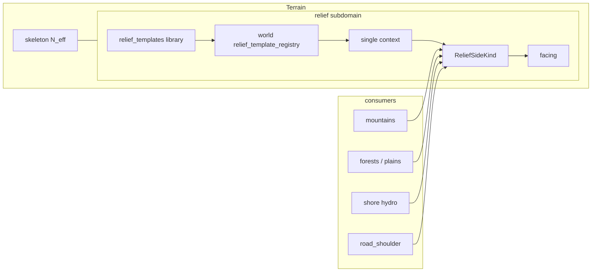

> **Статус:** ownership **утверждён** (2026-07-27) · **world outdoor grade + templates** — утверждено (2026-07-29) · **storage 1:1 buildings** — утверждено (2026-07-29) · **mountain preset / side_recipe (R33)** — утверждено (2026-07-30) · **terrain map R34** (import upsert ∥ world API) — утверждено (2026-07-30) · **bundle R35** (`relief_templates` section) — утверждено (2026-07-30) · **Impl:** shared `terrain/relief` + column facing persist — ✅ extract; **templates / world pass** — ⬜.  
> **Связь:** SoT grade; **поддомен Terrain** — [`tz_terrain_generation.md`](./tz_terrain_generation.md); **не** MaskDomain SoT.

# Terrain relief grade (поддомен Terrain)

## Назначение

Поддомен **рельефной грани (grade)** внутри Terrain: проходимый склон vs отвес + направление подъёма на весь outdoor-мир.

Нужен **не только горам**, а любому месту с высотным перепадом / берегом / врезкой:

| Контекст | Примеры |
|---|---|
| `mountain` | грани massif / range |
| `open_land` | plains / forest при Δz |
| `shore` | берег озера / реки / моря |
| `road_shoulder` | **обочины** дороги (две стороны), когда есть Δz между полотном и соседним рельефом |

**Не** landcover (`system_terrain`) и **не** topology хребтов (PassBuilder).  
**Не** построение полотна дороги ([`tz_structure_connections.md`](./tz_structure_connections.md)): context `road_shoulder` ≠ «как кладётся `road`».

| Владеет | Не владеет |
|---|---|
| `ReliefSideKind` (SLOPE \| SHEER) | `system_terrain` biome keys (`mountain`, `plains`, `forest`, `road`, …) |
| profile(t) → `side_fraction` | FormGeometry / MaskDomain paint merge |
| uphill **facing** (cardinal) | PassBuilder / MST / saddles |
| **Relief templates** + context pick + seeded noise | hydrology roles, flora types |
| контракт mid-band ↔ grade | column `N_eff` / gap volume |

---

## Утверждено

### Ownership / kind (2026-07-27)

| # | Решение |
|---|---|
| R1 | Relief grade — **поддомен Terrain** (рядом со skeleton / hydrology); SoT **не** в MaskDomain |
| R2 | `SLOPE` = проходимый grade (smooth profile); `SHEER` = отвес (step profile) |
| R3 | Uphill **facing** — смысл как `system_facing` у лестниц ([`tz_locations.md`](./tz_locations.md)) |
| R4 | **Запрещено** `system_terrain=slope` как biome |
| R5 | Горы / shore / open land / road_shoulder / later cliff — только **consumers** shared API |
| R6 | Shipped mountain SideFill — **адаптер**/consumer; shared API в `generators/terrain/relief/` |
| R7 | Column gap / `N_eff` — [`tz_terrain_generation.md`](./tz_terrain_generation.md); grade = *проходимость*, skeleton = *объём* |
| R8 | Логирование: *почему* SLOPE vs SHEER и *какой* facing (или `facing=none` на SHEER) |

### World outdoor + templates (2026-07-29)

| # | Решение |
|---|---|
| R9 | Grade — **слой всего outdoor**, не plugin только гор |
| R10 | Мастер **не** задаёт SHEER/SLOPE **поклеточно** / paint по карте. Допустимо: шаблоны + pick; **точечный** declare `sides[].kind` на **стороне горы** (= сектор form / один большой объект Spec, **не** клетка) |
| R11 | Хранение шаблонов — **1:1 как здания**: глобальная библиотека + per-world pointer registry ([`tz_building_generator.md`](./tz_building_generator.md) §5–6) |
| R12 | **Context + pick policy** выбирают шаблон; **внутри** шаблона — `side_recipe` (mountain) или schedule/`classify(dz)` (ribbon) + **seeded** noise (R15). Не «только шум» и не «Δz без шаблона» |
| R13 | Контексты v1: `mountain` \| `open_land` \| `shore` \| `road_shoulder` (приоритет — § Context priority) |
| R14 | **Δz сам по себе не выбирает** SHEER vs SLOPE; шаблон + noise (пороги/веса — knobs шаблона) |
| R15 | Шум **детерминирован** от `world_seed(world)` + `(context, template_uid, x, y [, edge])` — воспроизводим recreate |
| R16 | Persist facing: column `system_facing` / FineTerrain column wire (как outdoor grade); stairs — по-прежнему per-cell |
| R17 | У шаблона **ровно один** `context` (не список): knobs и смысл сильно зависят от контекста |
| R18 | Мастер: (A) импорт шаблона из глобальной библиотеки в мир **и/или** (B) `relief_template_registry` (+ тела шаблонов) входит в **world bundle** |
| R19 | Pick policy **на каждый context**: `fixed` (default uid) \| `random` \| `round_robin` — см. § Pick policy |
| R20 | `road_shoulder` = grade **обочин** при Δz дорога↔рельеф (2 стороны). **Не** layout/строительство полотна. Полотно `road` **не** получает SHEER (противоречит замыслу дороги) |
| R21 | Пустой candidates / битый `fixed` uid → **warn + fallback** (общая политика resolve); не silent, не hard-fail generate |
| R22 | Ширина обочины default = **1 клетка** от полотна; в поселениях обочина **optional** (может отсутствовать); шаблон может задать другую ширину |
| R23 | `round_robin` seq — на **pick site**; для `road_shoulder` site = **segment × slope policy**, не целый edge / left\|right мастера |
| R24 | Persist grade SoT = **column** (`system_facing` / kind на колонке). Edge-level storage — **не** нужен, пока gameplay не потребует грань как отдельную сущность |
| R25 | Шаблоны `road_shoulder`: **typed conditions**; left\|right выводит движок; мастер сторону не назначает |
| R26 | Conditions: enums + POJO; ≤1 condition на `terrain`; на terrain — **ровно три** policy (`slope_none` / `slope_down` / `slope_up`); wire mode — **XOR A\|B** (R32), не «только bands» |
| R27 | `slope_weight + sheer_weight == 1` (±eps); иначе **reject** — шаблон не в библиотеку/мир (без silent normalize) |
| R28 | Built → `structure_refs[]` = **`barrier_template_registry.system_type`** (stub wire); materialize **не** в relief. **Земляной canal** → `earthen_canal` (relief). Полный consumer shoulder→barrier — **tech debt** [`tz_generator_technical_debt.md`](./tz_generator_technical_debt.md) § RELIEF-BAR-1 + [`tz_locations.md`](./tz_locations.md) barrier registry |
| R29 | **FS layout:** корень библиотеки **`relief_templates/`** (не смешивать с buildings/иным). Пак: `{pack_name}/` внутри корня; файлы `{system_name}.json` (stem == `system_name`); иначе **reject**. Одиночный файл — тоже под `relief_templates/`. Конвенция — `.cursor/rules/template-pack-layout.mdc` |
| R30 | Пресеты / подсказки весов и `delta_z` — **только UI-модуль** (редактор миров); backend хранит и validate сырой контракт, **не** генерирует пресеты |
| R31 | `relief_pick_policy`: **мир** → **объект** → (для гор) **сторона**; более специфичный уровень перезаписывает; см. § Pick policy |
| R32 | Условия terrain — **XOR двух режимов** (не смешивать): **(A)** `slope_none`/`slope_down`/`slope_up` + один `delta_z` **или** **(B)** bands `{delta_z_min, delta_z_max?}` на down/up; `delta_z_min >= 1` |
| R33 | **Mountain preset** = `ReliefTemplate` с `context: mountain` в той же library/packs (R29). Тело — **side recipe** (не Mode A/B `conditions` дорог). XOR режимов раскладки сторон: **(A)** weights \| **(B)** pattern \| **(C)** fixed kind; **пусто / ничего не указано** → **seeded random** per side (R15). `MountainKind` ≠ preset (elevation/content). R30 не про это — UI-only для shoulder/`delta_z` чисел |
| R34 | **G2:** `ReliefConditionTerrain` ↔ `system_terrain` — 1:1 по имени. Клетка вне таблицы / без condition → **skip grade**. **Запрещено** R21 «левый SLOPE» для unknown N+1. Два **независимых** пути каталога: (1) **import relief** — upsert missing keys из `conditions` (canonical, не затирать существующие); (2) **API настройки мира** — мастер/редактор правит любые N+1 (`PUT /worlds/…`). R21 — только битый pick/template/дыра schedule |
| R35 | **G4 / bundle:** тела шаблонов **не** в `world` JSON. В мире — только `relief_template_registry` + `relief_pick_policy`. Self-contained bundle: top-level секция **`relief_templates`** (массив полных тел) + pointers/policy внутри `world`. Import: upsert SQL library ← секция + registry/policy ← `world`. Имя ключа = `BundleSection.RELIEF_TEMPLATES` (`"relief_templates"`). API — тонкий слой |

---

## Три слоя (не смешивать)

| Слой | Вопрос | SoT |
|---|---|---|
| Landcover / mask | *что* на поверхности | [`tz_map_light_bake.md`](./tz_map_light_bake.md) MaskDomain |
| Hydrology | вода / shore role | [`tz_terrain_hydrology.md`](./tz_terrain_hydrology.md) |
| **Relief grade** | склон или обрыв + facing | **этот документ** (поддомен Terrain) |
| Column skeleton | сколько solid-z | [`tz_terrain_generation.md`](./tz_terrain_generation.md) `N_eff` |

```text
Terrain umbrella
├── skeleton (N_eff / surface_z)
├── hydrology
└── relief ← этот ТЗ

surface_z + landcover + hydro
        │
        ▼
Relief grade (context → template + seeded noise)
  → SLOPE | SHEER + facing
        │
        ▼
consumers stamp / SideFill / gameplay later
```

---

## Шаблоны рельефа (master) — storage 1:1 buildings

Образец: [`tz_building_generator.md`](./tz_building_generator.md) §5–6.

### Глобальная библиотека — `relief_templates`

Не привязана к миру. Полный JSON outline шаблона.

```sql
CREATE TABLE IF NOT EXISTS relief_templates (
    template_uid   TEXT PRIMARY KEY,   -- uuid5(NAMESPACE_DNS, system_name)
    system_name    TEXT NOT NULL UNIQUE,
    display_name   TEXT NOT NULL,
    context        TEXT NOT NULL,      -- ровно один: mountain | open_land | shore | road_shoulder
    version        TEXT NOT NULL DEFAULT '1.0',
    data           TEXT NOT NULL,      -- JSON blob (полный ReliefTemplate)
    source_file    TEXT
);
```

| Операция | Как |
|---|---|
| Корень библиотеки | **`relief_templates/`** на бэке/диске автора — **не** класть сюда buildings / barrier / иные домены |
| Загрузить | JSON / пак под этим корнем → validate → upsert SQL `relief_templates` |
| Одиночный файл | `relief_templates/{system_name}.json` или `relief_templates/{pack_name}/{system_name}.json` |
| Пак (R29) | `relief_templates/{pack_name}/` + `{system_name}.json`…; имя папки пакета = `pack_name`; mismatch → **reject** |
| Удаление | RESTRICT, если мир ссылается через registry |
| Замена | update in-place; предупреждение мирам |

```text
# доменные корни (не смешивать пакеты разных библиотек):
structures_templates/              # здания (building library FS)
  medieval_inns/
    tavern_1.json
relief_templates/                  # этот домен
  mountain_shoulders/              # pack_name
    cliff_edge.json                # system_name
    cut_uphill.json
```

Логическая группировка UI: **по `context`** и/или `pack_name`; SQL после import — плоский ряд. `source_file` ≈ `relief_templates/{pack_name}/{system_name}.json`.

### Per-world реестр — `worlds.relief_template_registry`

JSON-массив на мире (как `building_template_registry`):

```json
[
  {
    "system_template_uid": "<uuid5>",
    "display_template_name": "Пологий берег",
    "context": "shore",
    "imported_at": "2026-07-29T00:00:00Z"
  }
]
```

Генератор: читает uid из registry → полный outline из `relief_templates` (или из bundle snapshot — § Bundle).

### Pick policy (мастер)

На **каждый** `ReliefContext` — режим выбора среди candidates registry с этим `context`:

| Режим | Ключ | Поведение |
|---|---|---|
| **1. Default uid** | `fixed` | Всегда `default_template_uid` (должен быть в registry) |
| **2. Случайный** | `random` | Seeded hash → index среди candidates |
| **3. По очереди** | `round_robin` | `occurrence_seq % len(candidates)` по порядку registry |

#### Два / три уровня (R31)

| Уровень | Где | Примеры |
|---|---|---|
| **World** | `worlds.relief_pick_policy` | default на весь мир per context |
| **Object** | на объекте мира | гора (Spec), дорога (`ConnectionEdge`), … |
| **Side** (горы) | на **каждой стороне** `sides[i]` | разные стороны одной горы — разный pick |

Гора — **сложный объект**: grade/pick смотрят **контекст стороны**, не только «эта гора целиком».

```text
# дорога / простой объект:
effective = merge(world, object?)

# гора (side index / facing из form):
effective = merge(world, mountain.object?, side[i]?)
# side задал mountain-context → side
# иначе object
# иначе world
```

```text
ReliefContextPickPolicy
  mode: fixed | random | round_robin
  default_template_uid?: str   # обязателен при fixed

WorldReliefPickPolicy
  mountain / open_land / shore / road_shoulder: ReliefContextPickPolicy

ObjectReliefPickPolicy          # partial на объекте
  mountain?: …
  road_shoulder?: …
  …

# на стороне горы — тот же partial (обычно только mountain):
SideReliefPickPolicy = ObjectReliefPickPolicy
```

| Режим | `default_template_uid` |
|---|---|
| `fixed` | **обязателен** на effective; нет в registry → R21 |
| `random` / `round_robin` | не для выбора |

**Запрещено:** путать object-level и side-level (одна policy на всю гору без sides — только если мастер так хочет на object; стороны всё равно могут перебить).  
Мастер: world defaults; редкие исключения на объекте; точечно — на стороне.

#### Wire JSON

**Мир** — `worlds.relief_pick_policy` (полный набор context v1):

```json
{
  "mountain": {
    "mode": "fixed",
    "default_template_uid": "a1b2c3d4-…"
  },
  "open_land": { "mode": "random" },
  "shore": { "mode": "round_robin" },
  "road_shoulder": {
    "mode": "fixed",
    "default_template_uid": "e5f6…-intercity_shoulder_pack"
  }
}
```

При `mode: "random"` | `"round_robin"` — `default_template_uid` не задаётся.  
При `mode: "fixed"` — обязателен.

**Дорога** (object, без sides):

```json
{
  "connection_uid": "…",
  "connection_type": "road",
  "relief_pick_policy": {
    "road_shoulder": { "mode": "random" }
  }
}
```

**Гора** — object + **per-side** (контекст стороны):

```json
{
  "system_name": "white_peak",
  "relief_pick_policy": {
    "mountain": { "mode": "random" }
  },
  "sides": [
    {
      "kind": "sheer",
      "relief_pick_policy": {
        "mountain": {
          "mode": "fixed",
          "default_template_uid": "…-rocky_scarps"
        }
      }
    },
    {
      "kind": "slope"
    },
    {
      "kind": "slope",
      "relief_pick_policy": {
        "mountain": { "mode": "round_robin" }
      }
    }
  ]
}
```

| Сторона | Effective pick |
|---|---|
| `sides[0]` | **side** fixed → rocky_scarps |
| `sides[1]` | нет side policy → **object** random |
| `sides[2]` | **side** round_robin |

`kind` на side (declare SLOPE/SHEER) — по-прежнему точечный override **grade kind**; `relief_pick_policy` на side — какой **шаблон** тянуть, если идём через template path. Оба могут сосуществовать: явный `kind` wins над kind из template (как declare sides vs template — уже в ТЗ).

Нет `relief_pick_policy` на side/object → выше по цепочке.

### Warn + fallback (R21 — общая политика)

При невозможности взять шаблон «как задумано»:

```text
1. WARN в generation log (context, mode, why, chosen_fallback)
2. fallback order:
   a) первый candidate в registry для этого context (порядок registry)
   b) иначе engine builtin default для context (если есть в библиотеке/seed)
   c) иначе SLOPE + facing=none (безопасный grade) + WARN
3. generate pass НЕ abort
```

То же для `fixed` с отсутствующим/чужим uid.

### `round_robin` — что такое seq (R23)

**Не** `+1` на каждую клетку обочины/берега (получится полосатый «зебра»-шаблон вдоль дороги).

`occurrence_seq` += 1 на **один pick site**; выбранный шаблон **штампуется на все клетки** этого site.

| Context | Pick site (v1) |
|---|---|
| `road_shoulder` | **segment** × выбранная **slope policy** — не целый edge, не left/right мастера |
| `shore` | один contiguous shore-run / band segment |
| `mountain` | одна сторона Spec (`side` index) или один massif side |
| `open_land` | один contiguous patch клеток с этим context |

Порядок обхода pick sites в pass — **стабильный** (sorted by uid / coords), иначе recreate ломается.

### Outline шаблона

```text
ReliefTemplate
  system_name: str
  display_name: str
  context: ReliefContext              # ровно один
  conditions: list[ReliefTerrainCondition] = []   # R26; для road_shoulder/open_land/shore
  # root defaults (если conditions пуст или case не переопределил):
  shoulder_width_cells: int = 1
  slope_weight / sheer_weight / sheer_band / noise …
  earthen_canal: bool = false
  structure_refs: list[str] = []          # barrier_template_registry
  # mountain only — § Mountain side recipe (R33):
  side_recipe?: MountainSideRecipe      # отсутствует / пустой = seeded random
```

**Запрещено:** `contexts: [...]`; `side: left|right`; freeform condition strings; legacy `features: [canal|…]` без R28.  
**`context: mountain`:** непустые `conditions` (Mode A/B dz) → **reject** (другая геометрия — сектора form, не лента Δz).  
**Не-mountain:** `side_recipe` задан → **reject**.

### Mountain side recipe (R33) — SoT mountain preset

Mountain preset — обычный `ReliefTemplate` в `relief_templates/` packs; расширяется пакетами мастера без PR на `MountainKind`.

`MountainKind` (`rocky` / `ice_peak` / …) — **elevation/content** ([`tz_map_light_bake.md`](./tz_map_light_bake.md)); grade sides — только relief preset + declare.

Pick — уже существующий `relief_pick_policy` context `mountain` (world → object → side).  
Пустой `MountainSpec.sides[]` → materialize из выбранного preset’а → `N = form_side_count` kinds.  
Явный `sides[i].kind` wins (как § Declare sides vs template).

#### Side recipe XOR

В одном mountain-template — **один** режим. Смешение → **reject**.

| Режим | Wire | Поведение |
|---|---|---|
| **A. Weights** | `slope_weight` + `sheer_weight` (==1, R27) | seeded roll **на каждую** сторону |
| **B. Pattern** | `side_kinds: [SLOPE\|SHEER, …]` (непустой) | цикл / truncate до N из form |
| **C. Fixed** | `default_side_kind: SLOPE\|SHEER` | все N одинаковые |
| **D. Empty (default)** | нет `side_recipe` / пустой объект / ни A, ни B, ни C | **seeded random** kind на каждую сторону |

**D — обязательно воспроизводимо (R15):**

```text
kind[i] = roll(world_seed, template_uid, mountain_identity, side_index)
# 50/50 SLOPE|SHEER (или равносильный детерминированный choice)
# recreate того же seed → те же стороны
```

Detect A/B/C: ровно один из блоков заполнен; иначе если всё пусто → **D**; иначе → **reject**.

```json
// A — weights
{ "context": "mountain", "system_name": "rocky_scarps",
  "side_recipe": { "slope_weight": 0.25, "sheer_weight": 0.75 } }

// B — pattern (N form может ≠ len; цикл)
{ "context": "mountain", "system_name": "scarped_ring",
  "side_recipe": { "side_kinds": ["SHEER", "SLOPE", "SHEER", "SLOPE"] } }

// C — fixed
{ "context": "mountain", "system_name": "gentle_dome",
  "side_recipe": { "default_side_kind": "SLOPE" } }

// D — пусто: только identity шаблона; стороны рандомятся по seed
{ "context": "mountain", "system_name": "wild_massif" }
```

**Слои гибкости**

```text
pack preset (side_recipe A|B|C|D)
  → world pick policy (fixed|random|round_robin)
    → object / side pick override
      → declare sides[].kind
```

Optional later (не v1 SoT): soft hint `preferred_template_uid` на category/object по `MountainKind` — не хардкод в `MountainKindProfile`.

**≠ R30:** UI-пресеты weights/`delta_z` для shoulder — только редактор. Mountain preset — **данные library**, backend validate + materialize.

### Conditions contract (R26) — SoT типы

Закрытые enums (расширение = PR движка + POJO, не world free keys):

```text
ReliefConditionTerrain   # corridor landcover/mask class
  = mountain | plains | forest | ravine | shore

ReliefSlopePolicy        # три политики на каждый terrain
  = slope_down | slope_up | slope_none

# НЕ enum «всё в features»:
# built → barrier/structure ref (R28)
# земляной кювет → relief-native
```

#### `system_terrain` ↔ `ReliefConditionTerrain` (R34 / G2)

`terrain_registry` — N+1 ([`project_data_storage_tz.md`](./project_data_storage_tz.md)); `ReliefConditionTerrain` — закрытый enum движка. Мост:

| `system_terrain` | `ReliefConditionTerrain` |
|---|---|
| `plains` | `plains` |
| `forest` | `forest` |
| `mountain` | `mountain` |
| `ravine` | `ravine` |
| `shore` | `shore` |
| `road` | — (обычно context `road_shoulder`; не open_land-key) |
| `liquid_body`, `open_space`, indoor (`floor`/…) | — **skip** grade-site |
| прочий N+1 (`swamp`, …) без строки выше | — **skip** grade-site |

**Каталог мира — два независимых механизма (оба валидны):**

| # | Механизм | Зачем (продукт) | Поведение |
|---|---|---|---|
| 1 | **Import relief** (library→мир / bundle) | Игрок/мастер взял мир (или шаблон) и **добавляет свой пресет** → хочет сразу сгенерировать новый мир. **Минимум действий:** импорт шаблона сам закрывает дыру каталога | нет ключа в `terrain_registry` из `conditions` → **upsert canonical**; существующую запись **не** затирать |
| 2 | **API настройки мира** | Ошибочно добавили запись / хотят **удалить или поправить** N+1 вручную (редактор) | `GET`/`PUT /worlds/{uid}` — тонкий HTTP-слой: validate → service/repo → DTO. **Не** generate, не upsert-логика import, не дубль application. Бизнес-правки реестров — в service; routes только делегируют. Узкие `…/registries/{name}` — later, optional, тот же принцип |

Не подменять: (1) ≠ «тихий костыль вместо редактора»; (2) ≠ «обязательный ручной шаг перед каждым import».  
Import — **добавление** с минимальным friction; API — **управление** (в т.ч. удаление). **API всегда тонкий слой** (см. `.cursor/rules/layer-boundaries.mdc`).

**Generate:** нет строки таблицы или нет condition-блока → **skip** grade-site.  
**Не** R21 «безопасный SLOPE» для unknown N+1 на клетке.  
R21 по-прежнему: пустой pick / битый `fixed` uid / дыра schedule.

`ReliefContext.open_land` = *когда* брать open_land-шаблон; таблица = *какой* блок `conditions` внутри.
#### Conditions mode XOR (R32)

На **каждый** `ReliefConditionTerrain` — **ровно три** case (`slope_none` / `slope_down` / `slope_up`).

Пусть `dz = z_road − z_adjacent`.

**Два режима — ИЛИ, не И.** В одном `ReliefTerrainCondition` (и во всём `ReliefTemplate`) — **один** режим. Смешение → **reject**.

| Режим | Wire | Зачем |
|---|---|---|
| **A. Policy + `delta_z`** | у каждого case `delta_z`; **нет** `bands` | простой порог на none/down/up |
| **B. Bands** | у down/up — `bands[]`; у none — `bands: []`; **нет** `delta_z` | несколько интервалов Δz → разный kind |

Detect: все три case с `delta_z` и без `bands` → **A**; down/up с непустым `bands`, none с `bands: []`, нигде нет `delta_z` → **B**; иначе → **reject**.

##### Mode A — один `delta_z` на policy

| Policy | Когда | `delta_z` |
|---|---|---|
| `slope_none` | `abs(dz) <= delta_z` | `>= 0` |
| `slope_down` | `dz >= delta_z` | `>= 1` |
| `slope_up` | `−dz >= delta_z` | `>= 1` |

```text
1. abs(dz) <= none.delta_z → slope_none
2. dz >= down.delta_z      → slope_down
3. -dz >= up.delta_z       → slope_up
4. иначе → R21
```

```json
{
  "terrain": "plains",
  "cases": [
    { "policy": "slope_down", "delta_z": 1, "slope_weight": 0.8, "sheer_weight": 0.2 },
    { "policy": "slope_up", "delta_z": 1, "slope_weight": 1.0, "sheer_weight": 0.0 },
    { "policy": "slope_none", "delta_z": 0, "slope_weight": 1.0, "sheer_weight": 0.0 }
  ]
}
```

##### Mode B — bands (`delta_z_min` / optional `delta_z_max`)

| Policy | Когда |
|---|---|
| `slope_none` | `abs(dz) < 1`; `bands: []` |
| `slope_down` | `dz >= 1` → band по `dz` |
| `slope_up` | `−dz >= 1` → band по `−dz` |

```text
ReliefDeltaBand
  delta_z_min: int          # >= 1 (иначе reject)
  delta_z_max: int | null   # нет = без верхней границы
  slope_weight / sheer_weight  # R27
  …
```

Match inclusive; первый в списке; overlap → **reject**; дыра → R21.

```json
{
  "policy": "slope_down",
  "bands": [
    { "delta_z_min": 1, "delta_z_max": 2, "slope_weight": 1.0, "sheer_weight": 0.0 },
    { "delta_z_min": 3, "slope_weight": 0.0, "sheer_weight": 1.0 }
  ]
}
```

```json
{ "policy": "slope_down", "delta_z": 2, "bands": [ … ] }  // ❌ reject — смешение A+B
```

**Runtime abstraction (I8):** wire A|B только на parse/validate.  
`normalize(condition) → ReliefDeltaSchedule` (общие интервалы + knobs);  
`classify(dz, schedule)` — **одна** функция. Consumers **не** ветвятся `if mode==A`.  
Детали: [`.cursor/plans/relief-templates-implementation.md`](../.cursor/plans/relief-templates-implementation.md) § Abstraction.

#### Features / attachments (R28) — stub + tech debt

| Что | Домен | Wire |
|---|---|---|
| Земляной canal / кювет | **relief** | `earthen_canal: true` на case/band |
| Забор, стена, облицованный canal, rock reinforcement | **barrier / structures** | `structure_refs: string[]` = **`system_type`** из `worlds.barrier_template_registry` |

```text
# ✅ stub contract
structure_refs: ["wooden_fence", "retaining_wall_stone"]  # system_type
# ❌ uid / freeform feature enums without registry
```

| Слой | Сейчас | Later (RELIEF-BAR-1) |
|---|---|---|
| Validate на import в мир | ref ∈ `barrier_template_registry` (если registry непуст); unknown → **reject** | то же |
| Generate / stamp | **emit refs only** (в GradeDecision / metadata); **не** строить barrier cells в relief | barrier consumer читает refs → cells по [`tz_locations.md`](./tz_locations.md) |
| Global barrier library / pack root | **нет** (только world N+1) | если появится 1:1 buildings — отдельный epic; refs могут остаться `system_type` |

**Tech debt:** [`tz_generator_technical_debt.md`](./tz_generator_technical_debt.md) **RELIEF-BAR-1** — связь этого ТЗ ↔ barrier registry / shoulder materialize.

**POJO (target `dataModel/terrain/relief/`):**

```text
ReliefDeltaBand                         # только mode B
  delta_z_min: int                      # >= 1
  delta_z_max: int | None = None
  shoulder_width_cells / weights / earthen_canal / structure_refs …

ReliefRoleCase
  policy: ReliefSlopePolicy
  # XOR на уровне condition (R32):
  delta_z?: int                         # mode A only
  bands?: list[ReliefDeltaBand]         # mode B only
  # + knobs на case (mode A) или на band (mode B): weights, earthen_canal, …

ReliefTerrainCondition
  terrain: ReliefConditionTerrain
  cases: list[ReliefRoleCase]           # length == 3; mode A|B единообразно

ReliefTemplate.conditions
  : list[ReliefTerrainCondition]        # все conditions одного режима
```

**Инварианты validate:**

| Правило | При нарушении |
|---|---|
| Дубликат `terrain` | **reject** |
| Не ровно три `cases` / не полный набор policy | **reject** |
| В одном case и `delta_z`, и `bands` | **reject** (смешение A+B) |
| Condition: часть case mode A, часть B | **reject** |
| Template: разные conditions в разных режимах | **reject** |
| **Mode A:** нет `delta_z` / down\|up с `delta_z < 1` / none с `delta_z < 0` | **reject** |
| **Mode B:** down\|up `bands` пуст; none с непустым `bands`; `delta_z_min < 1`; overlap | **reject** |
| weights sum ≠ 1 | **reject** (R27) |
| `structure_refs` unknown в мире | **reject** |
| Имя файла ≠ `system_name` (R29) | **reject** |
| `context: mountain` + непустые `conditions` | **reject** (R33) |
| не-mountain + `side_recipe` | **reject** (R33) |
| mountain `side_recipe`: смешение A+B+C / weights ≠1 / пустой pattern | **reject**; всё пусто → **D** OK |

**Match / classify (I8 — единый path):**

```text
# wire A|B только здесь:
validate(condition) → mode A XOR B
schedule = normalize(condition)   # → ReliefDeltaSchedule (интервалы + knobs)
decision = classify(dz, schedule) # одна функция; не if mode==A
# none → нет site; иначе knobs → kindRoll(weights) → SLOPE|SHEER
```

JSON мастера **не** меняется: Mode A = `delta_z` на policy; Mode B = `bands`.  
`ReliefDeltaSchedule` — runtime-only, не поле wire.

**Пример mode B** — forest bands (как выше в § Mode B).  
**Пример mode A** — plains с одним `delta_z` на policy (как выше в § Mode A).

### Как мастер задаёт библиотеку (два пути, R18)

| Путь | Действие |
|---|---|
| **A. Library → мир** | Файл или **пак** → `relief_templates` (R29) → `relief_template_registry` + **R34**(1) upsert missing `terrain_registry` keys |
| **B. World bundle** | registry + тела; import upsert library/registry + **R34**(1) terrain keys |

Оба пути валидны; bundle не обязан ссылаться на «чужую» библиотеку хоста без копирования тел.

#### Bundle wire (R35 / G4)

```text
# top-level world JSON bundle
world:                      # BundleSection.WORLD — обязателен
  relief_template_registry  # pointers only (uid, display, context, imported_at)
  relief_pick_policy        # per-context pick
  terrain_registry          # N+1 catalog (R34)
  … прочие поля мира
relief_templates: [         # BundleSection.RELIEF_TEMPLATES — полные тела
  { system_name, display_name, context, side_recipe? | conditions?, … }
]
races / perks / locations / …   # как сейчас
# ❌ полные тела внутри world.relief_template_registry
# ❌ map_cells в skeleton/registry import
```

Import level: секция `relief_templates` обрабатывается вместе со skeleton/self-contained export (точный allowlist — [`tz_world_pack_storage.md`](./tz_world_pack_storage.md) + `BundleSection`); route только делегирует в bundle service.

### Pick + noise (целевой поток I8)

Единый pipeline для любого `ReliefContext` (в т.ч. `road_shoulder`).  
Wire Mode A|B **не** ветвит этот поток — только `normalize`.

```text
1. context = resolve_context(cell|edge)     # priority: road_shoulder > shore > mountain > open_land
2. terrain = local ReliefConditionTerrain  # corridor / patch landcover class
3. dz      = z_ref - z_adjacent            # road: z_road; open_land: neighbor pair — consumer
4. effective_pick = merge(                 # R31
       world.relief_pick_policy,
       object?.relief_pick_policy,
       side?.relief_pick_policy)           # side только для гор
5. candidates = world.relief_template_registry
       .filter(context == that ∧ template has condition for terrain)
       # пусто → R21 warn + fallback (не abort)
6. template = pick_by_policy(candidates, effective_pick[context], world_seed, site_id|seq)
       # fixed | random | round_robin (R19); seed — R15
7. schedule = normalize(template.conditions[terrain])
       # Mode A|B wire → ReliefDeltaSchedule (I8); JSON не меняется
8. decision = classify(dz, schedule)       # одна функция; none | knobs
9. if decision is none → skip stamp (нет grade-site)
   else:
     kind   = kindRoll(slope_weight, sheer_weight, hash(world_seed, context, template_uid, site_id))
     facing = resolve_facing(…)            # R3 / R8; SHEER → facing=none OK
     stamp column grade + earthen_canal
     emit structure_refs → barrier consumer (не relief materialize)
```

| Шаг | Владеет | Не владеет |
|---|---|---|
| 1–3 | consumer + relief helpers | MaskDomain paint |
| 4–6 | pick policy / registry | conditions Δz |
| 7–8 | normalize + classify | pick mode fixed/random |
| 9 | kindRoll + facing + stamp | barrier cells |

**Seed (R15):** `hash(world_seed, context, template_uid, site_id)` — для `random` pick и для `kindRoll`; без глобального `Random()`.

**R21** срабатывает на шагах 5–6 (нет candidates / битый fixed uid) и на шаге 8 (дыра в schedule) — warn + fallback, generate не abort.

| Запрещено | |
|---|---|
| Freeform / неполные 3 policy / `weights sum ≠ 1` | reject на import (R26/R27) |
| Смешение A+B / `delta_z_min < 1` / overlap | reject (R32) |
| `if mode==A` в classify / consumer | I8 |
| `classify(..., cases)` минуя `normalize` | I8 / C3 |
| Мастер left\|right | R25 |
| Недетерминированный `random()` | R15 |

### Context priority (conflict)

На одной клетке/ребре может быть несколько сигналов. Порядок v1:

```text
road_shoulder > shore > mountain > open_land
```

(один context → один шаблон; не blend kind’ов.)

### Context `road_shoulder` (R20, R22, R23, R25–R28)

```text
длинный edge
  ├─ segment terrain=mountain
  │     dz=+3 → slope_down (+ earthen_canal? + structure_refs wall)
  │     dz=−2 → slope_up (width 3 + structure_refs reinforcement)
  │     dz=0  → slope_none (нет site)
  ├─ segment terrain=plains
  │     … свои delta_z
  └─ …
```

| | |
|---|---|
| **Где grade** | обочины при `slope_down` / `slope_up` |
| **Сегменты** | split при смене corridor `terrain` |
| **Стороны** | engine считает `dz`; classify через **schedule** (I8), не left/right мастера |
| **Ширина** | default 1; override на knobs case/band |
| **Поселения** | обочина optional (`slope_none`) |
| **Conditions** | R26 + R32 XOR; attachments R28 |

#### Attachments (R28)

- `earthen_canal` — relief (земляной кювет)
- `structure_refs` — barrier/fence/wall/lined canal из [`tz_locations.md`](./tz_locations.md) `barrier_template_registry`
- materialize built — structure consumer; не дублировать в relief |

---

## Понятия

| Термин | Значение |
|---|---|
| **SLOPE** | Graded face: можно подняться вдоль facing |
| **SHEER** | Vertical face: grade-прохода нет (climb-only / blocked — gameplay later) |
| **Facing** | Cardinal uphill (к более высокому / к origin стороны / к spine / к берегу — по consumer) |
| **side_fraction** | `profile(kind, t) ∈ [0,1]` — вход elevation / footprint fill (горы) |
| **t** | Нормированная дистанция вдоль outward стороны footprint **или** edge (open land) |
| **ReliefContext** | Ключ выбора шаблона |

```text
# footprint consumers (горы) — как shipped SideFill:
t(p) = clamp(dist_along_outward(p, sector) / sector_width, 0, 1)
side_fraction(p) = profile(kind, t(p))
# SLOPE: smoothstep; SHEER: step (1 if inside outer−ε else 0)
```

Defaults profile: SHEER `ε` = `sheer_band_light` (default 1 light cell); SLOPE = `smoothstep`.

---

## Logging (R8)

| Уровень | Что писать |
|---|---|
| **INFO** | template_uid, context, sides/kind summary, identity |
| **DEBUG** (sample) | `kind`, `t`/`Δz`, `fraction`, **`reason`**, **`facing`** или `facing=none` |
| **Запрещено** | silent grade без reason при диагностике |

```text
relief_grade_cell | context=shore template=beach_gentle
  kind=SLOPE t=0.41 frac=0.62 facing=east
  reason=template_weights+noise
relief_grade_cell | context=mountain template=rocky_scarps
  kind=SHEER facing=none
  reason=side.kind=SHEER step→0
```

---

## Границы с другими доменами



| Документ | Роль |
|---|---|
| [`tz_terrain_generation.md`](./tz_terrain_generation.md) | `surface_z`, gap, column fill; **не** SoT grade |
| [`tz_mountain_architecture.md`](./tz_mountain_architecture.md) | PassBuilder topology; grade — только через relief |
| [`tz_map_light_bake.md`](./tz_map_light_bake.md) | MaskDomain paint (mountain/forest/plains/road); SideFill → relief |
| [`tz_terrain_hydrology.md`](./tz_terrain_hydrology.md) | shore / bands / liquid; **береговой grade** → relief template `shore` |
| [`tz_flora.md`](./tz_flora.md) | деревья / forest eligibility; landcover `forest` ≠ grade |
| [`tz_structure_connections.md`](./tz_structure_connections.md) | полотно / lanes / sidewalk; **не** SoT `road_shoulder` grade |
| [`tz_locations.md`](./tz_locations.md) | эталон facing (stairs); registry UX |
| [`tz_building_generator.md`](./tz_building_generator.md) | **образец storage:** global library + world registry + import/bundle |

**Анти-паттерны**

- ❌ `MountainSideKind` как параллельный SoT вне relief  
- ❌ `system_terrain=slope`  
- ❌ Grade SoT только в mountains / только в hydro / только в roads  
- ❌ PassBuilder / ridge noise вместо grade  
- ❌ Per-cell ручной SHEER как основной UX мастера  
- ❌ `contexts: list` на одном шаблоне (R17)  
- ❌ Полные тела relief внутри `world` / registry entry (R35 — секция `relief_templates`) |
- ❌ Context как «строительство дороги» вместо обочин (R20)  
- ❌ SHEER на travel-полотне дороги  
- ❌ Мастер задаёт left\|right / ручная сторона edge (R25)  
- ❌ Один шаблон на весь длинный edge без segment split  
- ❌ Freeform conditions / неполные 3 policy / два `terrain` duplicate (R26)  
- ❌ `ReliefSideRole` / cliff_edge|… — заменено на `ReliefSlopePolicy` + `delta_z`  
- ❌ `features: ["canal"|"fence"|…]` в relief без R28 split (built должны быть `structure_refs`)  
- ❌ Пресеты weights/`delta_z` в backend/generator (R30 — UI only)  
- ❌ `MountainKindProfile` как SoT grade sides (R33 — только elevation; sides = relief preset)  
- ❌ Mode A/B `conditions` на `context: mountain`  
- ❌ Пустой mountain recipe → silent all-SLOPE (нужен **D** seeded random) |
- ❌ R21 «левый SLOPE» для `system_terrain` вне G2-таблицы (R34 — skip; каталог: import upsert и/или API) |

---

## Consumers (контракт)

```text
context = …
template = pick_by_policy(…)                    # R19/R31
# road_shoulder / open_land / shore:
schedule = normalize(condition)                 # I8; A|B wire → schedule
decision = classify(dz, schedule)
grade = kindRoll + facing                       # relief
# mountain footprint path (R33):
recipe = side_recipe_or_empty(template)         # A|B|C|D
for i in 0..N-1:                                # N = form_side_count
  if declare.sides[i].kind set: kind = declare
  else: kind = materialize_side(recipe, seed, i)  # D = seeded random
  fractions |= fill_side(…, kind)
# stamp facing on column (R24)
→ domain paint (system_terrain) — вне relief
# structure_refs → barrier consumer (не relief)
```

### Declare `sides[]` vs template (пример)

Мир: policy `mountain.mode = fixed`, `default_template_uid = rocky_scarps`  
→ template **side_recipe** → N сторон `SHEER / SLOPE / …` (A weights / B pattern / C fixed / **D seeded random** если recipe пуст).

| Ситуация | Что побеждает |
|---|---|
| Declare горы **без** `sides[]` (или empty) | **template** → materialize sides (R33) |
| Declare с явным `sides[]` | **declare** на этой горе; template мира не затирает точечный override |
| Template mountain без side_recipe | **D:** seeded random per side (R15) — не all-SLOPE silent |
| Нет template / R21 fallback | warn + fallback sides (часто all SLOPE), не abort |

```text
# мир: fixed → rocky_scarps (weights SHEER-heavy или pattern)
# мастер точечно:
MountainSpec "Белая"
  sides: [ SLOPE, SLOPE, SLOPE, SLOPE ]   # override только этой горы

# другая гора без sides → materialize из rocky_scarps
# wild_massif без recipe → те же стороны при том же world_seed
```

**Default path мира** = mountain preset (R33); declare `sides[]` = точечный override мастера, не «дизайн всего мира».

### Persist (R24)

SoT = **колонка** (`system_facing` / grade на column wire).  
Отдельное хранение «ребро между (x,y) и соседом» — **не** в scope, пока gameplay не потребует грань как сущность. Вопроса «edge vs column» как открытого продуктового — нет.

---

## Target layout (код)

```text
dataModel/terrain/relief/
  enums.py              # ReliefSideKind, ReliefContext,
                        # ReliefConditionTerrain, ReliefSlopePolicy
  specs.py
  reliefRoleCase.py     # policy + delta_z + earthen_canal + structure_refs
  reliefTerrainCondition.py
  reliefTemplate.py
  worldReliefTemplateRegistry.py

db/ — relief_templates
generators/terrain/relief/
  profiles / facing / sideGradeDecision   # ✅
  slopeClassify.py      # classify(dz, ReliefDeltaSchedule) only
  conditionNormalize.py # Mode A|B wire → ReliefDeltaSchedule
  conditionMatch.py / templatePick.py / kindRoll.py / gradePass.py
```

Wire: column facing — ✅ SoT (R24). Validate A XOR B + normalize — library/bundle.

---

## Порядок имплементации (anti-slice)

1. ✅ Relief extract (profiles, facing, mountain shim, column facing)  
2. ⬜ POJO R26 (`ReliefSlopePolicy` + `delta_z` ×3 на terrain) + SQL library + registry  
3. ⬜ Validate: unique terrain; ровно 3 policy; `delta_z >= 0`  
4. ⬜ Classify `dz` → policy; pick; R21 fallback  
5. ⬜ Mountains R33: `side_recipe` A\|B\|C\|D + materialize sides; declare wins  
6. ⬜ road_shoulder segments + per-terrain deltas | 

**Вне каркаса backend:** gameplay climb; U8 ridge noise; cliff Spec paint; edge-grade persist (R24 не нужен).  
**UI-модуль (не backend):** пресеты / подсказки weights и `delta_z` для shoulder (R30) — **не** путать с mountain library presets (R33).

---

## Связанные документы

| Документ | Связь |
|---|---|
| [`tz_terrain_generation.md`](./tz_terrain_generation.md) | skeleton / `N_eff`; pointer на этот поддомен |
| [`tz_mountain_architecture.md`](./tz_mountain_architecture.md) | topology; не SideKind |
| [`tz_map_light_bake.md`](./tz_map_light_bake.md) | mountains / forests / plains / roads paint |
| [`tz_terrain_hydrology.md`](./tz_terrain_hydrology.md) | shore / liquid; consumer `shore` |
| [`tz_flora.md`](./tz_flora.md) | forest flora; не grade |
| [`tz_structure_connections.md`](./tz_structure_connections.md) | road ribbon; не `road_shoulder` |
| [`tz_locations.md`](./tz_locations.md) | facing stairs; **barrier_template_registry** для `structure_refs` |
| [`tz_building_generator.md`](./tz_building_generator.md) | library + world registry + import образец |
| [`tz_world_pack_storage.md`](./tz_world_pack_storage.md) | world bundle levels; relief registry/bodies в bundle |

---

## История

| Дата | Изменение |
|---|---|
| 2026-07-30 | **T1 closed:** R14 OK — sheer_weight=1 deterministic is intentional knobs |
| 2026-07-30 | **T3 closed:** R12 = context+pick → template; inside = recipe/schedule + seeded noise |
| 2026-07-30 | **R34:** no silent terrain upsert; master edits N+1 via world API (`PUT /worlds`); relief import reject missing keys; skip unknown grade |
| 2026-07-30 | **R34 / G2 closed:** 1:1 map ReliefConditionTerrain↔system_terrain; import upsert missing terrain_registry; unknown N+1 → skip grade (no R21 fake SLOPE) |
| 2026-07-30 | R29: domain root `relief_templates/`; packs not mixed with `structures_templates/`; rule updated |
| 2026-07-30 | R29: pack folder name = pack_name; files `{system_name}.json`; rule `template-pack-layout.mdc` |
| 2026-07-30 | C3: § Pick + noise — полный целевой поток 1–9 (I8); без classify(cases) |
| 2026-07-30 | Consistency C2+C3: Match + Pick+noise → I8 normalize/schedule/classify; C1 R26↔R32 |
| 2026-07-30 | Consistency: R26 aligned with R32 XOR A\|B (C1) |
| 2026-07-30 | I8/plan: A\|B wire XOR → normalize → единый `ReliefDeltaSchedule` + `classify` |
| 2026-07-30 | R32: XOR mode A (`delta_z` на policy) **или** mode B (bands); смешение reject |
| 2026-07-30 | **R32:** bands `delta_z_min`≥1 + optional `delta_z_max`; forest example; single `delta_z` снят |
| 2026-07-30 | R31: pick policy world → object → **side** (горы); wire JSON examples |
| 2026-07-30 | **R31:** relief_pick_policy world + object override (гора/дорога/…); object wins |
| 2026-07-30 | **R30:** presets weights/delta_z — UI only, not backend |
| 2026-07-30 | **R29:** packs OK; filename stem == `system_name` else reject |
| 2026-07-30 | **R28:** earthen_canal = relief; fence/wall/lined canal = `structure_refs` → barrier; classify order explained |
| 2026-07-30 | R27 + пример JSON: weights sum==1 на каждом case (plains тоже явные sheer_weight) |
| 2026-07-30 | `ReliefSlopePolicy` + `delta_z` ×3 на terrain; `canal` feature; SideRole снят |
| 2026-07-30 | **R26:** typed conditions — ≤1 terrain; cases = slope policies |
| 2026-07-30 | R25 + R23: road_shoulder conditions + segments; no left/right UX |
| 2026-07-30 | R21–R24: warn+fallback; shoulder width 1 / settlements optional; round_robin pick site; column SoT persist |
| 2026-07-29 | R20: `road` → `road_shoulder` — grade обочин при Δz; полотно без SHEER; не construction |
| 2026-07-29 | R19: pick policy per context — `fixed` / `random` / `round_robin` |
| 2026-07-29 | R11/R17/R18: storage **1:1 buildings** (`relief_templates` + world registry); `context` singular; library import **и/или** bundle; R1 = поддомен Terrain |
| 2026-07-29 | R9–R16: outdoor grade + templates by context; seed-deterministic noise; links hydro/forest/roads |
| 2026-07-27 | R8 + § Logging |
| 2026-07-27 | Домен вынесен: SoT SLOPE/SHEER/facing; mountains = consumer |
