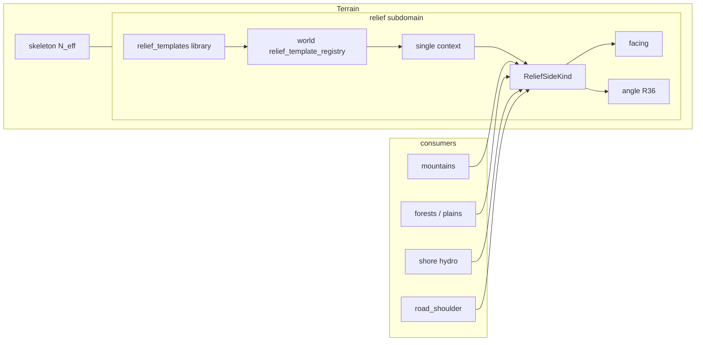

> **Статус:** ownership **утверждён** · templates R33–R35 ✅ · **R36 core (§7–9/8c) ✅** · **canal R36p/q wire+bake ✅** · bake SRP **T-30/T-52 ✅** · **Wave B–D ✅** (open_land/shore + polish).  
> **Next:** § [Порядок имплементации](#порядок-имплементации-anti-slice) → **Wave E** later (R36s / R36r / R36o / gameplay).  
> **Связь:** SoT grade; **поддомен Terrain** — [`tz_terrain_generation.md`](./tz_terrain_generation.md); **не** MaskDomain SoT. · Agent pointer: [`.cursor/plans/relief-dev-plan.md`](../.cursor/plans/relief-dev-plan.md)

# Terrain relief grade (поддомен Terrain)

## Назначение

Поддомен **рельефной грани (grade)** внутри Terrain: проходимый склон vs отвес + направление подъёма на весь outdoor-мир.

Нужен **не только горам**, а любому месту с высотным перепадом / берегом / врезкой:

| Контекст | Примеры |
|---|---|
| `mountain` | грани massif / range |
| `open_land` | plains / forest при Δz |
| `shore` | берег озера / реки / моря |
| `road_shoulder` | **обочины** дороги (две стороны), когда есть Δz между полотном и соседним рельефом |

**v1 bake consumers (shipped):** `mountain` (SideFill) · `road_shoulder` · `open_land` · `shore`.  
Ribbon shared: `ribbonGradeApply` + `contextRibbonApply` / `ribbonSampleUtil`; intents → `ctx.ribbon_intents`; BAR-1 **once** after compose contributors.

| Владеет | Не владеет |
|---|---|
| `ReliefSideKind` (SLOPE \| SHEER) | `system_terrain` biome keys (`mountain`, `plains`, `forest`, `road`, …) |
| profile(t) → `side_fraction` | FormGeometry / MaskDomain paint merge |
| uphill **facing** (`Facing` enum; **v1** cardinal / **later** 8-way — R36s) | PassBuilder / MST / saddles |
| **SLOPE geometry** — `h`/`L`/`θ` (R36); materialize объёма грани | gameplay climb resolver (читает angle) |
| **Relief templates** + context pick + seeded noise | hydrology roles, flora types |
| контракт mid-band ↔ grade | column gap fill / `N_eff` (skeleton исполняет объём) |

---

## Утверждено

### Ownership / kind (2026-07-27)

| # | Решение |
|---|---|
| R1 | Relief grade — **поддомен Terrain** (рядом со skeleton / hydrology); SoT **не** в MaskDomain |
| R2 | `SLOPE` = проходимый grade (smooth profile); `SHEER` = отвес (step profile) |
| R3 | Uphill **facing** — смысл как `system_facing` у лестниц ([`tz_locations.md`](./tz_locations.md)); wire = `dataModel.spatial.facing.Facing`. **Объём направлений** — R36s (v1 cardinal / later 8-way) |
| R4 | **Запрещено** `system_terrain=slope` как biome |
| R5 | Горы / shore / open land / road_shoulder / later cliff — только **consumers** shared API |
| R6 | Shipped mountain SideFill — **адаптер**/consumer; shared API в `generators/terrain/relief/` |
| R7 | Column gap / `N_eff` — [`tz_terrain_generation.md`](./tz_terrain_generation.md); skeleton = *исполнение объёма* колонки. Relief (R36) задаёт **контракт** materialize грани (закрыть `h`/`L`); grade kind/angle = *проходимость* |
| R8 | Логирование: *почему* SLOPE vs SHEER, facing (или `facing=none` на SHEER), для SLOPE — **`angle`** (R36) |

### World outdoor + templates (2026-07-29)

| # | Решение |
|---|---|
| R9 | Grade — **слой всего outdoor**, не plugin только гор |
| R10 | Мастер **не** задаёт SHEER/SLOPE **поклеточно** / paint по карте. Допустимо: шаблоны + pick; **точечный** declare `sides[].kind` на **стороне горы** (= сектор form / один большой объект Spec, **не** клетка) |
| R11 | Хранение шаблонов — **1:1 как здания**: глобальная библиотека + per-world pointer registry ([`tz_building_generator.md`](./tz_building_generator.md) §5–6) |
| R12 | **Context + pick policy** выбирают шаблон; **внутри** шаблона — `side_recipe` (mountain) или schedule/`classify(dz)` (ribbon) + **seeded** noise (R15). Не «только шум» и не «Δz без шаблона» |
| R13 | Контексты v1: `mountain` \| `open_land` \| `shore` \| `road_shoulder` (приоритет — § Context priority) |
| R14 | **Δz сам по себе не выбирает** SHEER vs SLOPE; шаблон + noise (пороги/веса — knobs шаблона) |
| R15 | Шум **детерминирован** от `world_seed(world)` + `(context, template_uid, x, y [, edge])` — воспроизводим recreate |
| R16 | Persist facing: column `system_facing` / FineTerrain column wire (как outdoor grade); stairs — по-прежнему per-cell |
| R17 | У шаблона **ровно один** `context` (не список): knobs и смысл сильно зависят от контекста |
| R18 | Мастер: (A) импорт шаблона из глобальной библиотеки в мир **и/или** (B) `relief_template_registry` (+ тела шаблонов) входит в **world bundle** |
| R19 | Pick policy **на каждый context**: `fixed` (default uid) \| `random` \| `round_robin` — см. § Pick policy |
| R20 | `road_shoulder` = grade **обочин** при Δz дорога↔рельеф (2 стороны). **Не** layout/строительство полотна. Полотно `road` **не** получает SHEER (противоречит замыслу дороги) |
| R21 | Пустой candidates / битый `fixed` uid / дыра schedule / unknown canal\|barrier ref → **warn + soft fallback** (общая политика resolve); не silent, не hard-fail generate. **Wire event:** `EVENT_RESOLVE_FALLBACK` = `"resolve_fallback"` (`reliefEvents.py`). Не путать с R34 skip |
| R22 | **Длина наклона (slope)** обочины: omit → default **1** клетка (`slope_length_cells`); explicit **`0` allowed** (нет XY-колонок обочины / пустой ring — не silent clamp к 1). В поселениях обочина **optional**; см. R36. **`shoulder_width_cells` — убрать** (не alias, не wire) |
| R23 | `round_robin` seq — на **pick site**; для `road_shoulder` site = **segment × slope policy**, не целый edge / left\|right мастера |
| R24 | Persist grade = **сущность** SLOPE\|SHEER + **двусторонние ссылки** (R36h/j). На клетке — только ref (`system_grade_uid`, omit если нет) + при необходимости `system_facing` для совместимости stairs. **Не** дублировать h/L/angle на каждой клетке |
| R25 | Шаблоны `road_shoulder`: **typed conditions**; left\|right выводит движок; мастер сторону не назначает |
| R26 | Conditions: enums + POJO; ≤1 condition на `terrain`; на terrain — **ровно три** policy (`slope_none` / `slope_down` / `slope_up`); wire mode — **XOR A\|B** (R32), не «только bands» |
| R27 | `slope_weight + sheer_weight == 1` (±eps); иначе **reject** — шаблон не в библиотеку/мир (без silent normalize) |
| R28 | **Canal — XOR kinds + world canal registry.** Runtime SoT: ``EarthenCanal`` \| ``StructureCanal`` (`dataModel/terrain/relief/canal.py`). Wire knobs: optional **`earthen_canal`** (bool; omit ок) XOR **`structure_canal`** = ref → **`worlds.canal_template_registry`**. Registry entry: **`earthen_canal: true` XOR `structure`** (не оба, не пусто). Structure materials → `barrier_template_registry`. Плоский `structure_refs` на knobs с earthen = BAR-1 fence (не canal body). Clearance-путь → R36p. Materialize built — BAR-1. Terrain: один `draw_canal` + `build_canal` handlers |
| R29 | **FS layout:** корень библиотеки **`relief_templates/`** (не смешивать с buildings/иным). Пак: `{pack_name}/` внутри корня; файлы `{system_name}.json` (stem == `system_name`); иначе **reject**. Одиночный файл — тоже под `relief_templates/`. Конвенция — `.cursor/rules/template-pack-layout.mdc` |
| R30 | Пресеты / подсказки weights, `delta_z`, **`slope_length_cells` / `target_angle_deg`** (Geom-A\|B\|C калькулятор) — **только UI-модуль**; backend хранит и validate сырой контракт, **не** генерирует пресеты |
| R31 | `relief_pick_policy`: **мир** → **объект** → (для гор) **сторона**; более специфичный уровень перезаписывает; см. § Pick policy |
| R32 | Условия terrain — **XOR двух режимов** (не смешивать): **(A)** `slope_none`/`slope_down`/`slope_up` + один `delta_z` **или** **(B)** bands `{delta_z_min, delta_z_max?}` на down/up; `delta_z_min >= 1` |
| R33 | **Mountain preset** = `ReliefTemplate` с `context: mountain` в той же library/packs (R29). Тело — **side recipe** (не Mode A/B `conditions` дорог). XOR режимов раскладки сторон: **(A)** weights \| **(B)** pattern \| **(C)** fixed kind; **пусто / ничего не указано** → **seeded random** per side (R15). `MountainKind` ≠ preset (elevation/content). R30 не про это — UI-only для shoulder/`delta_z` чисел |
| R34 | **G2:** `ReliefConditionTerrain` ↔ `system_terrain` — 1:1 по имени. Клетка вне таблицы / без condition → **skip grade**. **Запрещено** R21 «левый SLOPE» для unknown N+1. Два **независимых** пути каталога: (1) **import relief** — upsert missing keys из `conditions` (canonical, не затирать существующие); (2) **API настройки мира** — мастер/редактор правит любые N+1 (`PUT /worlds/…`). R21 — только битый pick/template/дыра schedule |
| R35 | **G4 / bundle:** тела **relief**-шаблонов **не** в `world` JSON. В мире — `relief_template_registry` + `relief_pick_policy` (в т.ч. **`canal_obstacle_policy`**, R36p) + **`relief_grade_obstacle_policy`** (R36n) + **`canal_template_registry`** (R36q). Self-contained bundle: top-level **`relief_templates`** + pointers/policy (+ canal registry) внутри `world`. Import: upsert SQL library ← секция + registry/policy ← `world`. Имя ключа relief = `BundleSection.RELIEF_TEMPLATES` (`"relief_templates"`). API — тонкий слой |

### SLOPE geometry / materialize (2026-07-31)

| # | Решение |
|---|---|
| R36 | **SLOPE** = прямоугольный треугольник **высота × длина → угол** (rise/run). Materialize закрывает **весь** измеренный `dz` (объём грани, не facing-only stamp). **SHEER** = отвес на всю `dz` (θ ≈ 90°, grade-проход нет). Политики (R32) — *когда* case/band и knobs; угол — *после* resolve геометрии. См. § SLOPE geometry (R36) |
| R36a | **h (height)** в generate = **measured** `|dz|` сайта (дорога↔сосед / эквивалент consumer). Политика **не** задаёт высоту карты |
| R36b | Wire knobs на case/band — **XOR Geom:** либо **`slope_length_cells`** (длина наклона L, **`>= 0`**), либо **`target_angle_deg`**; оба сразу → **reject**. Omit L → default **1**. Explicit **`0`** = нет наружных колонок (ring expand → empty). **Materialize** при `h ≥ 1`: `geom_resolve` / `partition_height` требуют **`L_eff ≥ 1`** (иначе skip / не строить клин) — не путать с wire `0`. Третий параметр — derived. **`shoulder_width_cells` удалён** |
| R36c | Три режима треугольника (клетка кубическая: `cell_xy_m == cell_z_m`): **Geom-A** `h+L→θ`; **Geom-B** `θ+h→L`; **Geom-C** `L+θ→h` — только UI (R30), **не** override карты. **Не путать** с **Mode A\|B** (R32: `delta_z` vs bands) — разные XOR |
| R36d | Формулы: `θ = atan(h/L)`; `L = ceil(h / tan(θ))` (min 1); `h = L · tan(θ)`. Пример: `h=1`, `L=1` → **45°** |
| R36e | **SHEER + длина:** `slope_length_cells` (L) = **как строим** отвес по XY (сколько колонок наружу от дороги) — параметр стройки, **не** угол и не «толщина дороги». **`L = 0`** → нет колонок. На каждой из L>0 колонок solid на **все h** z-клеток дельты. `facing=none`, angle N/A. Угол/`target_angle_deg` — только **SLOPE** |
| R36f | Позиция персонажа = `(x,y,surface_z)`. Movement/LLM: клетка → `system_grade_uid` → сущность grade (`length_cells`, `angle_deg`, `kind`, …) |
| R36k | **Pathfinding:** граф = **grid** (шаги клетка↔клетка по `surface_z` / walkability). **Slope/SHEER не отдельные ноды пути** — один **Grade object**; cost/block берётся с entity по `system_grade_uid` (один `angle_deg` / kind на весь объект). Не считать независимый `atan(Δz)` на каждом ребре, расходящийся с grade. Impl pathfinding — later; контракт — этот |
| R36g | **Устарело:** facing-only stamp; **устарело:** дублировать L/angle/h на каждой клетке пандуса. Target: materialize R36i + **Grade instance** R36j |
| R36h | **`h`/`dz` на клетке не хранить.** На клетке — **`system_grade_uid`** (omit если клетка не в grade). L/angle/h/kind/facing grade — на **сущности**. См. R36j |
| R36i | **Materialize на всю `h=\|dz\|`:** SLOPE ramp / SHEER L×h solid. Без void. Затем создать Grade instance + проставить ссылки (R36j) |
| R36j | **Grade = один составной объект** (аналог **одной горы** `MountainSpec`). Состоит из grid-клеток; `cell_refs[]` ↔ `system_grade_uid` подтверждают состав. Поля: `grade_uid`, `kind`, `height_cells`, `length_cells`, **`angle_deg` (одно место; omit SHEER)**, `facing` (omit SHEER), resolved canal flat columns из **`Canal`** (`EarthenCanal`\|`StructureCanal`) через `build_canal`/`draw_canal` — **тот же cut**, что на Intent.`canal`. **Запрещено:** несколько углов в одном Grade |
| R36l | **Иерархия как у гор** ([`tz_mountain_architecture.md`](./tz_mountain_architecture.md): хребет ↔ ≥2 вершины). **Один** постоянный угол → один `ReliefGradeInstance`. **Ломаный / смена крутизны** → **`ReliefGradeSystem`** (аналог `MountainRangeSpec`): упорядоченный **`grade_instance_uids`** (≥2 → `ReliefGradeInstance.grade_uid`). **1 Grade** → система **не** создаётся. Клетка → **свой** Instance (`system_grade_uid`), не System. Persist: package + DB |
| R36m | **Obstacle clearance (мир) + truncate/skip.** Длину grade до footprint задаёт **`worlds.relief_grade_obstacle_policy`** (R36n). Оба режима: footprint **не** затирать; `L_eff < 1` → **skip** (+ WARN). **Не** включает earthen (это R36p / knobs). **Устарело:** silent auto `earthen_canal` при collision без knobs и без `canal_obstacle_policy` |
| R36n | **Wire (мир):** `relief_grade_obstacle_policy`: **`truncate_skip`** \| **`allow_flush`**. Default = **`truncate_skip`**. Не на object/side (v1). Generate читает setting и ветвится; без silent fallback на другой режим. См. § Obstacle policy |
| R36o | **Junction smooth (later):** модификатор сглаживания **стыка** прямой Grade с другим объектом (road / platform / соседний Grade / barrier footprint). **Не** меняет инвариант «один Grade = одна прямая / один θ». Не profile `smoothstep` (SideFill). Не `ReliefGradeSystem` (ломаный = ≥2 прямых). Не obstacle policy (clearance режет `L`). Wire-эскиз на knobs/grade: `junction_smooth`: **`none`** (default) \| **`chamfer`** \| **`fillet`**; опц. `junction_smooth_cells` ≥ 1 при режиме ≠ none. Materialize: после ядра ramp/sheer — переходные колонки на стыке. **v1 R36:** не impl |
| R36p | **Canal-by-world-rule — только если grade не вмещается.** Нормальный path: knobs XOR `earthen_canal` \| `structure_canal` (R28/R36q). Спец-ключ **`canal_obstacle_policy`**: `{ to_canal_cut_enable, entities, canal_ref? }`. Enum entities: `road` \| `mountain` \| `forest` \| `plains` \| `shore` \| `all`. Смотреть **только** если не вмещается; match → cut по enable; при `enable: true` опц. **`canal_ref`** → `canal_template_registry` (omit ref = earthen-only cut). Overlap enable: **false wins**. Места хватает → политика игнор. См. § Canal obstacle policy |
| R36q | **`worlds.canal_template_registry`.** Переиспользуемые canal-описания мира (не новый объект на каждом case). Entry: `system_type` + optional `earthen_canal` + optional `structure.structure_refs[]` (каждый ref ∈ `barrier_template_registry`). Grade knobs: `structure_canal` = `system_type`. Unknown ref → reject import / R21 warn+fallback на generate. См. § Canal template registry |
| R36r | **Diagonal ribbon + width (candidate, later; зависит от R36s):** при intercardinal outward — materialize как **thick line on grid**: core ray вдоль outward (`L` = Chebyshev steps) + поперечный fill ширины `W` с **теми же** steps/θ → **один** Grade (R36j). Clearance — на core. **Не** voxel corner/shim / Minecraft stair shapes (mesh; стыки → R36o). Источник: [Murphy’s Modified Bresenham](http://www.zoo.co.uk/murphy/thickline/). **v1:** не impl (нет диагонального outward) |
| R36s | **Facing scope — locked.** Wire/entity: `Facing` (`north`…`west` + `north_east`…`south_west`). **SLOPE:** uphill на Grade entity; **SHEER:** omit / `none`. **v1 (сейчас):** только **cardinal** (`CARDINAL_FACINGS`); outward = ortho `(±1,0)\|(0,±1)` из `CARDINAL_WALL_OUTWARD_DELTA` / bake `ribbonSampleUtil.CARDINAL_ORTHO_DELTAS`; resolve snap к cardinal (`uphill_facing_toward`). **Later (target):** полный **8-way** — Grade.`facing` ∈ cardinal ∪ intercardinal; outward delta `(±1,0)\|(0,±1)\|(±1,±1)`; длина шага = **Chebyshev 1** (диагональ ≠ √2) — [GoRogue Chebyshev](https://github.com/Chris3606/GoRogue/wiki/Measuring-Distance). Диагональный ribbon materialize → **R36r**. **Запрещено:** параллельный relief-facing enum / литералы сторон вне `Facing`. Stairs per-cell — по [`tz_locations.md`](./tz_locations.md); outdoor grade facing — на entity (C10) |

### Locked checklist (master, 2026-08-01)

Выводы сессии — **утверждены**; расхождение кода (facing-only) = debt до impl.

| # | Вывод | Статус |
|---|---|---|
| C1 | Facing-only stamp без правки высот — **неверная** impl для ribbon SLOPE/SHEER | locked (R36g) |
| C2 | `h` = measured `\|dz\|` сайта; политики R32 — порог/knobs, не «градусы в JSON» | locked (R36a) |
| C3 | Угол SLOPE: `θ = atan(h/L)` (куб. клетка: `h=1,L=1` → 45°). Geom-A/B bake; Geom-C UI only | locked (R36c–d) |
| C4 | Wire XOR: `slope_length_cells` **или** `target_angle_deg`; L **`>= 0`** (omit→1); **`shoulder_width_cells` убрать** | locked (R36b) |
| C5 | **Mode A\|B** (R32 bands) ≠ **Geom-A\|B\|C** (треугольник) | locked (R36c) |
| C6 | Materialize закрывает **всю** дельту z (`sum(steps)==h` / solid × h); нет void | locked (R36i) |
| C7 | **SLOPE:** L = длина пандуса XY; steps по z; facing uphill на **grade entity** | locked |
| C8 | **SHEER:** L = длина стройки XY; solid × h; facing/angle на entity omit/`none` | locked (R36e) |
| C9 | Позиция: `(x,y,surface_z)`; клетка — часть grade через **`system_grade_uid`** | locked (R36f/j) |
| C10 | `system_facing` stairs — per-cell как сейчас; outdoor grade facing — на **Grade entity** (клетка может кэшировать omit) | locked path |
| C11 | Grade — **составной объект**; угол/`length`/`h` только на нём; клетка — только `system_grade_uid` (omit) | locked |
| C12 | Длина сегмента вдоль дороги ≠ `length_cells` grade (наружу) | locked |
| C13 | LLM/игрок ← сущность Grade (`length_cells`, `angle_deg`), не скан клеток | locked |
| C14 | Pathfinding = **grid**; cost/block slope ← **один** Grade object по uid | locked (R36k) |
| C15 | **Один угол на один Grade** (как одна гора). Ломаный → **`ReliefGradeSystem` ≥2 Grade** (как хребет ≥2 вершины); 1 Grade → без системы | locked (R36l) |
| C16 | Expand → obstacles: по **`relief_grade_obstacle_policy`**; `L_eff < 1` → skip; не overwrite; silent auto-canal без политики/knobs — запрещён | locked (R36m/n) |
| C17 | **R28/R36q:** knobs XOR `earthen_canal` \| `structure_canal`→`canal_template_registry`; structure materials → `barrier_template_registry`. Clearance-path → R36p | locked (R28+R36p+R36q) |
| C18 | Два режима мира: **`truncate_skip`** (default, ≥1 free между grade и объектом) \| **`allow_flush`** (последняя free OK) | locked (R36n) |
| C19 | **Junction smooth** — опциональный модификатор стыка; ядро Grade остаётся прямой; v1 = `none` / не impl (R36o) | locked direction (R36o) |
| C20 | **Нормальный canal:** knobs XOR. **Не вмещается:** `canal_obstacle_policy` `{to_canal_cut_enable, entities, canal_ref?}`; overlap false wins (R36p/q) | locked (R36p/q) |
| C21 | **`canal_template_registry`** на мире; `structure_canal` / `canal_ref` = `system_type` entry (R36q) | locked (R36q) |
| C22 | **Diagonal + W:** candidate = thick-line (Murphy) + Chebyshev; **не** corner/shim; стыки → R36o; только после R36s later | locked direction (R36r); v1 out of scope |
| C23 | **Facing:** v1 = 4 cardinals; later = 8-way полный `Facing`; шаг diag = Chebyshev 1; wire = `Facing` only | locked (R36s); later impl |

---

## Три слоя (не смешивать)

| Слой | Вопрос | SoT |
|---|---|---|
| Landcover / mask | *что* на поверхности | [`tz_map_light_bake.md`](./tz_map_light_bake.md) MaskDomain |
| Hydrology | вода / shore role | [`tz_terrain_hydrology.md`](./tz_terrain_hydrology.md) |
| **Relief grade** | склон или обрыв + facing | **этот документ** (поддомен Terrain) |
| Column skeleton | сколько solid-z | [`tz_terrain_generation.md`](./tz_terrain_generation.md) `N_eff` |

```text
Terrain umbrella
├── skeleton (N_eff / surface_z)
├── hydrology
└── relief ← этот ТЗ

surface_z + landcover + hydro
        │
        ▼
Relief grade (context → template + seeded noise)
  → SLOPE | SHEER + facing
        │
        ▼
consumers stamp / SideFill / gameplay later
```

---

## Шаблоны рельефа (master) — storage 1:1 buildings

Образец: [`tz_building_generator.md`](./tz_building_generator.md) §5–6.

### Глобальная библиотека — `relief_templates`

Не привязана к миру. Полный JSON outline шаблона.

```sql
CREATE TABLE IF NOT EXISTS relief_templates (
    template_uid   TEXT PRIMARY KEY,   -- uuid5(NAMESPACE_DNS, system_name)
    system_name    TEXT NOT NULL UNIQUE,
    display_name   TEXT NOT NULL,
    context        TEXT NOT NULL,      -- ровно один: mountain | open_land | shore | road_shoulder
    version        TEXT NOT NULL DEFAULT '1.0',
    data           TEXT NOT NULL,      -- JSON blob (полный ReliefTemplate)
    source_file    TEXT
);
```

| Операция | Как |
|---|---|
| Корень библиотеки | **`relief_templates/`** на бэке/диске автора — **не** класть сюда buildings / barrier / иные домены |
| Загрузить | JSON / пак под этим корнем → validate → upsert SQL `relief_templates` |
| Одиночный файл | `relief_templates/{system_name}.json` или `relief_templates/{pack_name}/{system_name}.json` |
| Пак (R29) | `relief_templates/{pack_name}/` + `{system_name}.json`…; имя папки пакета = `pack_name`; mismatch → **reject** |
| Удаление | RESTRICT, если мир ссылается через registry |
| Замена | update in-place; предупреждение мирам |

```text
# доменные корни (не смешивать пакеты разных библиотек):
structures_templates/              # здания (building library FS)
  medieval_inns/
    tavern_1.json
relief_templates/                  # этот домен
  mountain_shoulders/              # pack_name
    cliff_edge.json                # system_name
    cut_uphill.json
```

Логическая группировка UI: **по `context`** и/или `pack_name`; SQL после import — плоский ряд. `source_file` ≈ `relief_templates/{pack_name}/{system_name}.json`.

### Per-world реестр — `worlds.relief_template_registry`

JSON-массив на мире (как `building_template_registry`):

```json
[
  {
    "system_template_uid": "<uuid5>",
    "display_template_name": "Пологий берег",
    "context": "shore",
    "imported_at": "2026-07-29T00:00:00Z"
  }
]
```

Генератор: читает uid из registry → полный outline из `relief_templates` (или из bundle snapshot — § Bundle).

### Pick policy (мастер)

На **каждый** `ReliefContext` — режим выбора среди candidates registry с этим `context`:

| Режим | Ключ | Поведение |
|---|---|---|
| **1. Default uid** | `fixed` | Всегда `default_template_uid` (должен быть в registry) |
| **2. Случайный** | `random` | Seeded hash → index среди candidates |
| **3. По очереди** | `round_robin` | `occurrence_seq % len(candidates)` по порядку registry |

#### Два / три уровня (R31)

| Уровень | Где | Примеры |
|---|---|---|
| **World** | `worlds.relief_pick_policy` | default на весь мир per context |
| **Object** | на объекте мира | гора (Spec), дорога (`ConnectionEdge`), … |
| **Side** (горы) | на **каждой стороне** `sides[i]` | разные стороны одной горы — разный pick |

**v1 shipped:** merge **world → object** only. Side-level wire на `ReliefSideSpec` / `sides[i].relief_pick_policy` — **deferred** (см. `tz_generator_technical_debt.md` **RELIEF-T-5**). API `side_policy` в pick зарезервирован, consumers не передают.

Гора — **сложный объект**: grade/pick смотрят **контекст стороны**, не только «эта гора целиком» (target; v1 — object/world).

```text
# дорога / простой объект:
effective = merge(world, object?)

# гора (side index / facing из form):
effective = merge(world, mountain.object?, side[i]?)
# side задал mountain-context → side
# иначе object
# иначе world
```

```text
ReliefContextPickPolicy
  mode: fixed | random | round_robin
  default_template_uid?: str   # обязателен при fixed

WorldReliefPickPolicy
  mountain / open_land / shore / road_shoulder: ReliefContextPickPolicy

ObjectReliefPickPolicy          # partial на объекте
  mountain?: …
  road_shoulder?: …
  …

# на стороне горы — тот же partial (обычно только mountain):
SideReliefPickPolicy = ObjectReliefPickPolicy
```

| Режим | `default_template_uid` |
|---|---|
| `fixed` | **обязателен** на effective; нет в registry → R21 |
| `random` / `round_robin` | не для выбора |

**Запрещено:** путать object-level и side-level (одна policy на всю гору без sides — только если мастер так хочет на object; стороны всё равно могут перебить).  
Мастер: world defaults; редкие исключения на объекте; точечно — на стороне.

#### Wire JSON

**Мир** — `worlds.relief_pick_policy` (context v1 + опц. `canal_obstacle_policy`, R36p):

```json
{
  "mountain": {
    "mode": "fixed",
    "default_template_uid": "a1b2c3d4-…"
  },
  "open_land": { "mode": "random" },
  "shore": { "mode": "round_robin" },
  "road_shoulder": {
    "mode": "fixed",
    "default_template_uid": "e5f6…-intercity_shoulder_pack"
  },
  "canal_obstacle_policy": [
    {
      "to_canal_cut_enable": true,
      "entities": ["forest"],
      "canal_ref": "forest_ditch"
    },
    {
      "to_canal_cut_enable": false,
      "entities": ["mountain"]
    }
  ]
}
```

При `mode: "random"` | `"round_robin"` — `default_template_uid` не задаётся.  
При `mode: "fixed"` — обязателен.  
Ключи context и **`canal_obstacle_policy`** — в одном JSON; canal bodies — в **`canal_template_registry`** (R36q), не inline в правиле.

#### Canal template registry (R36q) — locked

**Где:** `worlds.canal_template_registry` (массив entries на мире).

```json
{
  "canal_template_registry": [
    {
      "system_type": "forest_ditch",
      "earthen_canal": true
    },
    {
      "system_type": "lined_shoulder_cut",
      "structure": {
        "structure_refs": ["lined_canal_stone"]
      }
    }
  ]
}
```

| Поле | Обязательность | Смысл |
|---|---|---|
| `system_type` | да | ключ; цель `structure_canal` / `canal_ref` |
| `earthen_canal` | нет (omit ок) | земляной кювет |
| `structure` | нет | объект; `structure_refs[]` → каждый ∈ `barrier_template_registry` |

**Запрещено:** unknown `structure_refs`; дублировать полный barrier outline в canal entry; canal body inline в каждом grade case вместо registry.

#### Canal knobs на grade-шаблоне (R28) — locked

На case/band — **XOR**:

```json
{ "policy": "slope_down", "delta_z": 2, "slope_weight": 1.0, "sheer_weight": 0.0, "earthen_canal": true }
```

```json
{ "policy": "slope_down", "delta_z": 2, "slope_weight": 1.0, "sheer_weight": 0.0, "structure_canal": "lined_shoulder_cut" }
```

| | |
|---|---|
| `earthen_canal` | optional bool; omit = не задан |
| `structure_canal` | optional `system_type` ∈ `canal_template_registry` |
| оба заданы | **reject** |
| оба omit | без canal на нормальном path |

#### Canal obstacle policy (R36p) — locked

| Путь | Когда | Где |
|---|---|---|
| **Нормальный grade** | `L_eff` ≥ requested | knobs XOR `earthen_canal` \| `structure_canal` |
| **Не вмещается** | `L_eff` < requested / skip-кандидат | `canal_obstacle_policy` |

Политика **не читается**, пока grade вмещается.

**Где:** `worlds.relief_pick_policy.canal_obstacle_policy`.

**`CanalObstacleEntity`:** `road` \| `mountain` \| `forest` \| `plains` \| `shore` \| `all`  
(`road` ≠ `road_shoulder`; `plains` ≠ `open_land`)

| Поле правила | Тип | Смысл |
|---|---|---|
| `to_canal_cut_enable` | `bool` | обязателен |
| `entities` | `CanalObstacleEntity[]` | непустой |
| `canal_ref` | `str?` | при `enable: true` — опц. ∈ `canal_template_registry`; omit = earthen-only cut. При `enable: false` — omit (иначе reject) |

```text
if L_eff >= requested:
    canal ← knobs XOR; policy ИГНОР
else:
    match = rules where entity ∈ entities OR "all" ∈ entities
    0 match → canal ВЫКЛ
    enable ← false if any match.enable=false else true   # false wins
    if not enable → no canal
    else → canal_ref from true-rules (все заданные canal_ref должны совпадать; иначе reject validate)
```

**Overlap enable:** **false wins**.

| Намерение | Как |
|---|---|
| Обычный earthen | knobs `earthen_canal: true` |
| Обычный lined | knobs `structure_canal` + entry в `canal_template_registry` |
| Не влез у forest → cut | `enable: true`, `entities: ["forest"]`, `canal_ref: "forest_ditch"` |
| Не влез у mountain → не резать | `enable: false`, `entities: ["mountain"]` |

**Запрещено:** silent canal без match; читать policy когда вмещается; omit `to_canal_cut_enable`; freeform entities; inline canal object вместо `canal_ref` / registry.

**Дорога** (object, без sides):

```json
{
  "connection_uid": "…",
  "connection_type": "road",
  "relief_pick_policy": {
    "road_shoulder": { "mode": "random" }
  }
}
```

**Гора** — object + **per-side** (контекст стороны):

```json
{
  "system_name": "white_peak",
  "relief_pick_policy": {
    "mountain": { "mode": "random" }
  },
  "sides": [
    {
      "kind": "sheer",
      "relief_pick_policy": {
        "mountain": {
          "mode": "fixed",
          "default_template_uid": "…-rocky_scarps"
        }
      }
    },
    {
      "kind": "slope"
    },
    {
      "kind": "slope",
      "relief_pick_policy": {
        "mountain": { "mode": "round_robin" }
      }
    }
  ]
}
```

| Сторона | Effective pick |
|---|---|
| `sides[0]` | **side** fixed → rocky_scarps |
| `sides[1]` | нет side policy → **object** random |
| `sides[2]` | **side** round_robin |

`kind` на side (declare SLOPE/SHEER) — по-прежнему точечный override **grade kind**; `relief_pick_policy` на side — какой **шаблон** тянуть, если идём через template path. Оба могут сосуществовать: явный `kind` wins над kind из template (как declare sides vs template — уже в ТЗ).

Нет `relief_pick_policy` на side/object → выше по цепочке.

### Warn + fallback (R21 — общая политика)

При невозможности взять шаблон «как задумано» (пустой pick / битый `fixed` / дыра schedule / unknown canal|barrier ref):

```text
1. WARN в generation log (context, mode, why, chosen_fallback)
2. fallback order:
   a) первый candidate в registry для этого context (порядок registry)
   b) иначе engine builtin default для context (если есть в библиотеке/seed)
   c) иначе SLOPE + facing=none (безопасный grade) + WARN
3. generate pass НЕ abort
```

То же для `fixed` с отсутствующим/чужим uid.

**Wire / code SoT** (`generators/terrain/relief/reliefEvents.py`):

| Политика / ситуация | Event / reason token | Wire string |
|---|---|---|
| R21 warn + soft fallback (общий) | `EVENT_RESOLVE_FALLBACK` | `resolve_fallback` |
| Schedule hole → safe SLOPE (не silent skip) | `REASON_SCHEDULE_HOLE_SAFE_SLOPE` + why `WHY_SCHEDULE_HOLE` | `schedule_hole_safe_slope` / `schedule_hole` |
| Ribbon grade apply / BAR-1 | `EVENT_RIBBON_GRADE_APPLY` / `EVENT_RIBBON_BARRIER` | `ribbon_grade_apply` / `ribbon_barrier` |
| Grade column height &lt; 1 | `WHY_HEIGHT_LT_1` | `height_lt_1` |
| Нет abutment / footprint cells | `WHY_NO_REF_CELLS` | `no_ref_cells` |

**Ribbon skip (RELIEF-T-66)** — event = **слой**, `why=` = причина (всегда из `WHY_*`). Монотокен `ribbon_skip` **удалён**.

| Event | Wire | Допустимые `why` |
|---|---|---|
| `EVENT_RIBBON_SKIP_APPLY` | `ribbon_skip_apply` | `no_ref_cells`, `no_templates`, `empty_sample` |
| `EVENT_RIBBON_SKIP_GRADE` | `ribbon_skip_grade` | `no_template_body` |
| `EVENT_RIBBON_SKIP_MATERIALIZE` | `ribbon_skip_materialize` | `height_lt_1`, `no_edge_road_anchor`, `no_unique_outward`, `clearance_L_eff`, `empty_plan`, `stamp_obstacle_break`, `stamp_column_fail`, `empty_stamp` |

`WHY_NOT_STAMPED` — aggregate Intent reason, **не** обязательный event `ribbon_skip_*`.  
`EVENT_GRADE_SKIP` — classify skip (no_condition / slope_none), **не** ribbon_skip_*.

**Не** wire-имена: `r21_fallback`, `schedule_hole_r21_slope`, `road_shoulder_barrier`, `h_lt_1`, legacy aliases (`EVENT_R21_FALLBACK`, `EVENT_ROAD_SHOULDER_*`, `WHY_NO_ROAD_CELLS`). R21 в тексте ТЗ = **правило**, не строка лога.

### `round_robin` — что такое seq (R23)

**Не** `+1` на каждую клетку обочины/берега (получится полосатый «зебра»-шаблон вдоль дороги).

`occurrence_seq` += 1 на **один pick site**; выбранный шаблон **штампуется на все клетки** этого site.

| Context | Pick site (v1) |
|---|---|
| `road_shoulder` | **segment** × выбранная **slope policy** — не целый edge, не left/right мастера |
| `shore` | один contiguous shore-run / band segment |
| `mountain` | одна сторона Spec (`side` index) или один massif side |
| `open_land` | один contiguous patch клеток с этим context |

Порядок обхода pick sites в pass — **стабильный** (sorted by uid / coords), иначе recreate ломается.

### Outline шаблона

```text
ReliefTemplate
  system_name: str
  display_name: str
  context: ReliefContext              # ровно один
  conditions: list[ReliefTerrainCondition] = []   # R26; для road_shoulder/open_land/shore
  # root defaults (если conditions пуст или case не переопределил):
  # R36 Geom XOR на case/band (и root default): slope_length_cells XOR target_angle_deg
  slope_length_cells: int | None = None  # omit → default 1; explicit 0 = no outward columns
  # target_angle_deg: float             # XOR с slope_length_cells (R36b)
  # ❌ shoulder_width_cells — removed; rename to slope_length_cells
  slope_weight / sheer_weight / sheer_band / noise …
  # Canal XOR on case/band (R28/R36q): earthen_canal? XOR structure_canal?
  earthen_canal?: bool                    # optional; omit ok
  structure_canal?: str                   # → canal_template_registry.system_type
  # ❌ both set; legacy flat structure_refs on knobs for canal — not canonical
  # mountain only — § Mountain side recipe (R33):
  side_recipe?: MountainSideRecipe      # отсутствует / пустой = seeded random
```

**Запрещено:** `contexts: [...]`; `side: left|right`; freeform condition strings; legacy `features: [canal|…]` без R28; **оба** `slope_length_cells` и `target_angle_deg` на одном case/band (R36b).  
**`context: mountain`:** непустые `conditions` (Mode A/B dz) → **reject** (другая геометрия — сектора form, не лента Δz).  
**Не-mountain:** `side_recipe` задан → **reject**.

### Mountain side recipe (R33) — SoT mountain preset

Mountain preset — обычный `ReliefTemplate` в `relief_templates/` packs; расширяется пакетами мастера без PR на `MountainKind`.

`MountainKind` (`rocky` / `ice_peak` / …) — **elevation/content** ([`tz_map_light_bake.md`](./tz_map_light_bake.md)); grade sides — только relief preset + declare.

Pick — уже существующий `relief_pick_policy` context `mountain` (world → object → side).  
Пустой `MountainSpec.sides[]` → materialize из выбранного preset’а → `N = form_side_count` kinds.  
Явный `sides[i].kind` wins (как § Declare sides vs template).

#### Side recipe XOR

В одном mountain-template — **один** режим. Смешение → **reject**.

| Режим | Wire | Поведение |
|---|---|---|
| **A. Weights** | `slope_weight` + `sheer_weight` (==1, R27) | seeded roll **на каждую** сторону |
| **B. Pattern** | `side_kinds: [SLOPE\|SHEER, …]` (непустой) | цикл / truncate до N из form |
| **C. Fixed** | `default_side_kind: SLOPE\|SHEER` | все N одинаковые |
| **D. Empty (default)** | нет `side_recipe` / пустой объект / ни A, ни B, ни C | **seeded random** kind на каждую сторону |

**D — обязательно воспроизводимо (R15):**

```text
kind[i] = roll(world_seed, template_uid, mountain_identity, side_index)
# 50/50 SLOPE|SHEER (или равносильный детерминированный choice)
# recreate того же seed → те же стороны
```

Detect A/B/C: ровно один из блоков заполнен; иначе если всё пусто → **D**; иначе → **reject**.

```json
// A — weights
{ "context": "mountain", "system_name": "rocky_scarps",
  "side_recipe": { "slope_weight": 0.25, "sheer_weight": 0.75 } }

// B — pattern (N form может ≠ len; цикл)
{ "context": "mountain", "system_name": "scarped_ring",
  "side_recipe": { "side_kinds": ["SHEER", "SLOPE", "SHEER", "SLOPE"] } }

// C — fixed
{ "context": "mountain", "system_name": "gentle_dome",
  "side_recipe": { "default_side_kind": "SLOPE" } }

// D — пусто: только identity шаблона; стороны рандомятся по seed
{ "context": "mountain", "system_name": "wild_massif" }
```

**Слои гибкости**

```text
pack preset (side_recipe A|B|C|D)
  → world pick policy (fixed|random|round_robin)
    → object / side pick override
      → declare sides[].kind
```

Optional later (не v1 SoT): soft hint `preferred_template_uid` на category/object по `MountainKind` — не хардкод в `MountainKindProfile`.

**≠ R30:** UI-пресеты weights/`delta_z` для shoulder — только редактор. Mountain preset — **данные library**, backend validate + materialize.

### Conditions contract (R26) — SoT типы

Закрытые enums (расширение = PR движка + POJO, не world free keys):

```text
ReliefConditionTerrain   # corridor landcover/mask class
  = mountain | plains | forest | ravine | shore

ReliefSlopePolicy        # три политики на каждый terrain
  = slope_down | slope_up | slope_none

# НЕ enum «всё в features»:
# built → barrier/structure ref (R28)
# земляной кювет → relief-native
```

#### `system_terrain` ↔ `ReliefConditionTerrain` (R34 / G2)

`terrain_registry` — N+1 ([`project_data_storage_tz.md`](./project_data_storage_tz.md)); `ReliefConditionTerrain` — закрытый enum движка. Мост:

| `system_terrain` | `ReliefConditionTerrain` |
|---|---|
| `plains` | `plains` |
| `forest` | `forest` |
| `mountain` | `mountain` |
| `ravine` | `ravine` |
| `shore` | `shore` |
| `road` | — (обычно context `road_shoulder`; не open_land-key) |
| `liquid_body`, `open_space`, indoor (`floor`/…) | — **skip** grade-site |
| прочий N+1 (`swamp`, …) без строки выше | — **skip** grade-site |

**Каталог мира — два независимых механизма (оба валидны):**

| # | Механизм | Зачем (продукт) | Поведение |
|---|---|---|---|
| 1 | **Import relief** (library→мир / bundle) | Игрок/мастер взял мир (или шаблон) и **добавляет свой пресет** → хочет сразу сгенерировать новый мир. **Минимум действий:** импорт шаблона сам закрывает дыру каталога | нет ключа в `terrain_registry` из `conditions` → **upsert canonical**; существующую запись **не** затирать |
| 2 | **API настройки мира** | Ошибочно добавили запись / хотят **удалить или поправить** N+1 вручную (редактор) | `GET`/`PUT /worlds/{uid}` — тонкий HTTP-слой: validate → service/repo → DTO. **Не** generate, не upsert-логика import, не дубль application. Бизнес-правки реестров — в service; routes только делегируют. Узкие `…/registries/{name}` — later, optional, тот же принцип |

Не подменять: (1) ≠ «тихий костыль вместо редактора»; (2) ≠ «обязательный ручной шаг перед каждым import».  
Import — **добавление** с минимальным friction; API — **управление** (в т.ч. удаление). **API всегда тонкий слой** (см. `.cursor/rules/layer-boundaries.mdc`).

**Generate:** нет строки таблицы или нет condition-блока → **skip** grade-site.  
**Не** R21 «безопасный SLOPE» для unknown N+1 на клетке.  
R21 по-прежнему: пустой pick / битый `fixed` uid / дыра schedule.

`ReliefContext.open_land` = *когда* брать open_land-шаблон; таблица = *какой* блок `conditions` внутри.
#### Conditions mode XOR (R32)

На **каждый** `ReliefConditionTerrain` — **ровно три** case (`slope_none` / `slope_down` / `slope_up`).

Пусть `dz = z_road − z_adjacent`.

**Два режима — ИЛИ, не И.** В одном `ReliefTerrainCondition` (и во всём `ReliefTemplate`) — **один** режим. Смешение → **reject**.

| Режим | Wire | Зачем |
|---|---|---|
| **A. Policy + `delta_z`** | у каждого case `delta_z`; **нет** `bands` | простой порог на none/down/up |
| **B. Bands** | у down/up — `bands[]`; у none — `bands: []`; **нет** `delta_z` | несколько интервалов Δz → разный kind |

Detect: все три case с `delta_z` и без `bands` → **A**; down/up с непустым `bands`, none с `bands: []`, нигде нет `delta_z` → **B**; иначе → **reject**.

##### Mode A — один `delta_z` на policy

| Policy | Когда | `delta_z` |
|---|---|---|
| `slope_none` | `abs(dz) <= delta_z` | `>= 0` |
| `slope_down` | `dz >= delta_z` | `>= 1` |
| `slope_up` | `−dz >= delta_z` | `>= 1` |

```text
1. abs(dz) <= none.delta_z → slope_none
2. dz >= down.delta_z      → slope_down
3. -dz >= up.delta_z       → slope_up
4. иначе → R21
```

```json
{
  "terrain": "plains",
  "cases": [
    {
      "policy": "slope_down",
      "delta_z": 1,
      "slope_weight": 0.8,
      "sheer_weight": 0.2,
      "slope_length_cells": 1
    },
    {
      "policy": "slope_up",
      "delta_z": 1,
      "slope_weight": 1.0,
      "sheer_weight": 0.0,
      "slope_length_cells": 2
    },
    {
      "policy": "slope_none",
      "delta_z": 0,
      "slope_weight": 1.0,
      "sheer_weight": 0.0
    }
  ]
}
```

Geom knobs (`slope_length_cells` XOR `target_angle_deg`) — на case/band, не путать с Mode A\|B порогами `delta_z` (R36c).

##### Mode B — bands (`delta_z_min` / optional `delta_z_max`)

| Policy | Когда |
|---|---|
| `slope_none` | `abs(dz) < 1`; `bands: []` |
| `slope_down` | `dz >= 1` → band по `dz` |
| `slope_up` | `−dz >= 1` → band по `−dz` |

```text
ReliefDeltaBand
  delta_z_min: int          # >= 1 (иначе reject)
  delta_z_max: int | null   # нет = без верхней границы
  slope_weight / sheer_weight  # R27
  slope_length_cells XOR target_angle_deg  # R36b Geom
  …
```

Match inclusive; первый в списке; overlap → **reject**; дыра → R21.

```json
{
  "policy": "slope_down",
  "bands": [
    {
      "delta_z_min": 1,
      "delta_z_max": 2,
      "slope_weight": 1.0,
      "sheer_weight": 0.0,
      "target_angle_deg": 30
    },
    {
      "delta_z_min": 3,
      "slope_weight": 0.2,
      "sheer_weight": 0.8,
      "slope_length_cells": 1
    }
  ]
}
```

```json
{ "policy": "slope_down", "delta_z": 2, "bands": [ … ] }  // ❌ reject — смешение A+B
```

**Runtime abstraction (I8):** wire A|B только на parse/validate.  
`normalize(condition) → ReliefDeltaSchedule` (общие интервалы + knobs);  
`classify(dz, schedule)` — **одна** функция. Consumers **не** ветвятся `if mode==A`.  
Детали: [`.cursor/plans/relief-templates-implementation.md`](../.cursor/plans/relief-templates-implementation.md) § Abstraction.

#### Features / attachments (R28 + R36q) — locked

| Трек | Домен | Wire на grade case/band | SoT материалов |
|---|---|---|---|
| **A. Земляной** | relief | `earthen_canal?: bool` (omit ок) | landform; не registry |
| **B. Structure canal** | barrier/structures | `structure_canal?: system_type` | → `canal_template_registry` → `structure.structure_refs` → `barrier_template_registry` |

**XOR** A\|B на одном case/band (оба заданы → reject). Оба omit → без canal.

```text
# ✅ clearance L → relief_grade_obstacle_policy (R36n)
# ✅ нормальный canal → knobs XOR earthen_canal | structure_canal
# ✅ не вмещается → canal_obstacle_policy (+ optional canal_ref)
# ✅ canal bodies → worlds.canal_template_registry (R36q)
# ✅ barrier materials → barrier_template_registry
# ❌ earthen_canal + structure_canal вместе
# ❌ читать canal_obstacle_policy когда L_eff хватает
# ❌ silent canal в clearance-пути без match
# ❌ плоский structure_refs на grade knobs вместо structure_canal (для canal)
# ❌ забор / built внутри земляной канавы
# ❌ materialize barrier cells в generators/terrain/relief (BAR-1 → bake consumer)
```

| Слой | A earthen | B structure_canal |
|---|---|---|
| SoT | knobs / canal registry earthen flag | `canal_template_registry` + barrier registry |
| Validate | POJO | `structure_canal` ∈ canal registry; refs ∈ barrier registry |
| Generate | landform в relief | **emit refs**; cells — BAR-1 ✅ bake consumer |
| vs obstacles | R36m + R36p | R36m: grade не в barrier cells |

**Tech debt:** [`tz_generator_technical_debt.md`](./tz_generator_technical_debt.md) **RELIEF-BAR-1 ✅**; canal/bake/Wave B **T-42…T-65** ✅; Wave D polish ✅; open opt **T-66**; residual naming `RoadShoulder*`.

**POJO (target `dataModel/terrain/relief/`):**

```text
ReliefDeltaBand                         # только Mode B (R32)
  delta_z_min: int                      # >= 1
  delta_z_max: int | None = None
  # Geom XOR (R36b): slope_length_cells XOR target_angle_deg
  # + weights / earthen_canal / structure_refs …
  # ❌ no shoulder_width_cells

ReliefRoleCase
  policy: ReliefSlopePolicy
  # XOR Mode A|B на уровне condition (R32) — не путать с Geom-A|B (R36):
  delta_z?: int                         # Mode A only
  bands?: list[ReliefDeltaBand]         # Mode B only
  # + knobs на case (Mode A) или на band (Mode B):
  #   weights, Geom XOR, earthen_canal, …

ReliefTerrainCondition
  terrain: ReliefConditionTerrain
  cases: list[ReliefRoleCase]           # length == 3; Mode A|B единообразно

ReliefTemplate.conditions
  : list[ReliefTerrainCondition]        # все conditions одного Mode (R32)
```

**Инварианты validate:**

| Правило | При нарушении |
|---|---|
| Дубликат `terrain` | **reject** |
| Не ровно три `cases` / не полный набор policy | **reject** |
| В одном case и `delta_z`, и `bands` | **reject** (смешение A+B) |
| Condition: часть case mode A, часть B | **reject** |
| Template: разные conditions в разных режимах | **reject** |
| **Mode A:** нет `delta_z` / down\|up с `delta_z < 1` / none с `delta_z < 0` | **reject** |
| **Mode B:** down\|up `bands` пуст; none с непустым `bands`; `delta_z_min < 1`; overlap | **reject** |
| weights sum ≠ 1 | **reject** (R27) |
| на case/band **оба** `slope_length_cells` и `target_angle_deg` | **reject** (R36b Geom XOR) |
| `structure_refs` unknown в мире | **reject** |
| Имя файла ≠ `system_name` (R29) | **reject** |
| `context: mountain` + непустые `conditions` | **reject** (R33) |
| не-mountain + `side_recipe` | **reject** (R33) |
| mountain `side_recipe`: смешение A+B+C / weights ≠1 / пустой pattern | **reject**; всё пусто → **D** OK |

**Match / classify (I8 — единый path):**

```text
# wire A|B только здесь:
validate(condition) → mode A XOR B
schedule = normalize(condition)   # → ReliefDeltaSchedule (интервалы + knobs)
decision = classify(dz, schedule) # одна функция; не if mode==A
# none → нет site; иначе knobs → kindRoll(weights) → SLOPE|SHEER
```

JSON мастера **не** меняется: Mode A = `delta_z` на policy; Mode B = `bands`.  
`ReliefDeltaSchedule` — runtime-only, не поле wire.

**Пример mode B** — forest bands (как выше в § Mode B).  
**Пример mode A** — plains с одним `delta_z` на policy (как выше в § Mode A).

### Как мастер задаёт библиотеку (два пути, R18)

| Путь | Действие |
|---|---|
| **A. Library → мир** | Файл или **пак** → `relief_templates` (R29) → `relief_template_registry` + **R34**(1) upsert missing `terrain_registry` keys |
| **B. World bundle** | registry + тела; import upsert library/registry + **R34**(1) terrain keys |

Оба пути валидны; bundle не обязан ссылаться на «чужую» библиотеку хоста без копирования тел.

#### Bundle wire (R35 / G4)

```text
# top-level world JSON bundle
world:                      # BundleSection.WORLD — обязателен
  relief_template_registry  # pointers only (uid, display, context, imported_at)
  relief_pick_policy        # per-context pick
  terrain_registry          # N+1 catalog (R34)
  … прочие поля мира
relief_templates: [         # BundleSection.RELIEF_TEMPLATES — полные тела
  { system_name, display_name, context, side_recipe? | conditions?, … }
]
races / perks / locations / …   # как сейчас
# ❌ полные тела внутри world.relief_template_registry
# ❌ map_cells в skeleton/registry import
```

Import level: секция `relief_templates` обрабатывается вместе со skeleton/self-contained export (точный allowlist — [`tz_world_pack_storage.md`](./tz_world_pack_storage.md) + `BundleSection`); route только делегирует в bundle service.

### Pick + noise (целевой поток I8)

Единый pipeline для любого `ReliefContext` (в т.ч. `road_shoulder`).  
Wire Mode A|B **не** ветвит этот поток — только `normalize`.

```text
1. context = resolve_context(cell|edge)     # priority: road_shoulder > shore > mountain > open_land
2. terrain = local ReliefConditionTerrain  # corridor / patch landcover class
3. dz      = z_ref - z_adjacent            # road: z_road; open_land: neighbor pair — consumer
4. effective_pick = merge(                 # R31
       world.relief_pick_policy,
       object?.relief_pick_policy,
       side?.relief_pick_policy)           # side только для гор
5. candidates = world.relief_template_registry
       .filter(context == that ∧ template has condition for terrain)
       # пусто → R21 warn + fallback (не abort)
6. template = pick_by_policy(candidates, effective_pick[context], world_seed, site_id|seq)
       # fixed | random | round_robin (R19); seed — R15
7. schedule = normalize(template.conditions[terrain])
       # Mode A|B wire → ReliefDeltaSchedule (I8); JSON не меняется
8. decision = classify(dz, schedule)       # одна функция; none | knobs
9. if decision is none → skip stamp (нет grade-site)
   else:
     kind   = kindRoll(slope_weight, sheer_weight, hash(world_seed, context, template_uid, site_id))
     facing = resolve_facing(…)            # R3 / R8; SHEER → facing=none OK
     L_eff = apply world.relief_grade_obstacle_policy (R36n); if L_eff < 1 → skip
     stamp column grade (+ earthen_canal only if knobs)
     emit structure_refs → barrier consumer (не relief materialize)
```

| Шаг | Владеет | Не владеет |
|---|---|---|
| 1–3 | consumer + relief helpers | MaskDomain paint |
| 4–6 | pick policy / registry | conditions Δz |
| 7–8 | normalize + classify | pick mode fixed/random |
| 9 | kindRoll + facing + stamp | barrier cells |

**Seed (R15):** `hash(world_seed, context, template_uid, site_id)` — для `random` pick и для `kindRoll`; без глобального `Random()`.

**R21** срабатывает на шагах 5–6 (нет candidates / битый fixed uid) и на шаге 8 (дыра в schedule) — warn + fallback, generate не abort.

| Запрещено | |
|---|---|
| Freeform / неполные 3 policy / `weights sum ≠ 1` | reject на import (R26/R27) |
| Смешение A+B / `delta_z_min < 1` / overlap | reject (R32) |
| `if mode==A` в classify / consumer | I8 |
| `classify(..., cases)` минуя `normalize` | I8 / C3 |
| Мастер left\|right | R25 |
| Недетерминированный `random()` | R15 |

### Context priority (conflict)

На одной клетке/ребре может быть несколько сигналов. Порядок v1:

```text
road_shoulder > shore > mountain > open_land
```

(один context → один шаблон; не blend kind’ов.)

### Context `road_shoulder` (R20, R22, R23, R25–R28, R36)

```text
длинный edge
  ├─ segment terrain=mountain
  │     dz=+3 → slope_down → resolve (h=3, L from knobs) → θ → materialize volume
  │     dz=−2 → slope_up (slope_length / target_angle knobs + structure_refs)
  │     dz=0  → slope_none (нет site)
  ├─ segment terrain=plains
  │     … свои delta_z
  └─ …
```

| | |
|---|---|
| **Где grade** | обочины при `slope_down` / `slope_up` |
| **Сегменты** | split при смене corridor `terrain` |
| **Стороны** | engine считает `dz`; classify через **schedule** (I8), не left/right мастера |
| **Высота h** | measured `\|dz\|` (R36a) |
| **Длина L / угол** | knobs Geom-A или Geom-B (R36b); omit → default `1`; explicit `0` = нет XY-колонок (ring empty) |
| **Materialize** | закрыть весь `dz` по XY×Z; без void в клине (R36) |
| **Поселения** | обочина optional (`slope_none`) |
| **Conditions** | R26 + R32 XOR; attachments R28 |

#### Attachments (R28)

- `earthen_canal` — relief (земляной кювет)
- `structure_refs` — barrier/fence/wall/lined canal из [`tz_locations.md`](./tz_locations.md) `barrier_template_registry`
- materialize built — structure consumer; не дублировать в relief |

---

## SLOPE geometry (R36)

Прямоугольный треугольник grade (directed rise/run; не Horn 3×3 DEM):

```text
h = height (z-cells)              # generate: measured |dz|
L = slope length (xy-cells)       # slope_length_cells
θ = angle (degrees)               # incline from horizontal

θ = atan(h / L) * 180/π
L = ceil(h / tan(θ_rad))   # min 1
h = L * tan(θ_rad)         # Geom-C / UI only
```

При `cell_xy_m == cell_z_m`: **`h=1`, `L=1` → θ = 45°**.

**Имена XOR (не смешивать):**

| Префикс | Документ | Смысл |
|---|---|---|
| **Mode A \| B** | R32 | пороги classify: `delta_z` vs `bands` |
| **Geom-A \| B \| C** | R36 | треугольник `h`/`L`/`θ` |

### Режимы (теория → wire)

| Режим | Задано | Derived | Bake / UI |
|---|---|---|---|
| **Geom-A** | `h` (сайт) + `slope_length_cells` | `θ` | **основной** generate |
| **Geom-B** | `h` (сайт) + `target_angle_deg` | `L = ceil(h/tan θ)` | generate (лимит крутизны) |
| **Geom-C** | `slope_length_cells` + `target_angle_deg` | `h` | **только UI** (R30); не пишем высоту карты |

Wire на одном case/band (и root default шаблона): **ровно один** из `{slope_length_cells, target_angle_deg}` (R36b).  
**`shoulder_width_cells`:** убрать из POJO/wire/шаблонов; при имплементации §7 — rename на `slope_length_cells` (не держать alias / silent map).

### Связь с политиками (R32)

```text
R32 classify(dz)     →  slope_none | slope_down | slope_up + knobs (weights, Geom, attachments)
kindRoll             →  SLOPE | SHEER
if SHEER:            materialize vertical face на всю h; facing=none; angle N/A
if SLOPE:            resolve (h,L,θ) по Geom-A|B → materialize ramp volume → persist kind/facing/angle
```

`delta_z` / bands — **порог входа** в case (какой knobs-набор), не «магические градусы».  
Длина (или target angle) в политике = **косвенное** задание угла (Geom-A / Geom-B).

### Примеры

| Сайт `dz` | Knobs | Resolve | θ |
|---|---|---|---|
| 1 | `slope_length_cells=1` | Geom-A | **45°** |
| 2 | `slope_length_cells=2` | Geom-A | **45°** |
| 2 | `target_angle_deg=30` | Geom-B → `L≈4` | **30°** |
| 3 | `slope_length_cells=1` | Geom-A | **~71.6°** (часто band → чаще SHEER) |
| любой | kind=SHEER | vertical fill `h` | N/A (~90°) |

### Materialize (R36i) — на всю дельту z

**Инвариант:** после materialize вертикальный перепад сайта **полностью закрыт**:  
`sum(Δz_steps) == h` и между полотном и дальним краем grade **нет void** (воздушной дыры в клине).  
Facing-only stamp без изменения высот/fill — **не** materialize.

#### Вход

```text
h      = |dz|                         # R36a, целое ≥ 1
L, θ   = resolve Geom-A|B             # R36b; wire L ≥ 0; materialize L_eff ≥ 1 when h ≥ 1
kind   = SLOPE | SHEER
z_road = surface_z полотна
sign   = −1 если slope_down (наружу ниже); +1 если slope_up (наружу выше)
outward = ortho unit от дороги к seed обочины
```

**Wire vs materialize (L=0):** knobs/`expand_shoulder_ring` honor explicit `slope_length_cells=0` (пустой footprint). Клин volume (`partition_height`) при `h ≥ 1` требует `L_eff ≥ 1` — иначе skip site, не silent bump `0→1` на wire.

#### SHEER — стройка отвеса (L = длина по XY)

`L` из knobs (`slope_length_cells` или derived из angle **не** применяется: для SHEER Geom-B бессмысленен → нужен `slope_length_cells`, иначе default L=1).

```text
# L колонок наружу от дороги; на каждой — solid на все h по z
z_top = max(z_road, z_road + sign*h)   # верх грани
z_bot = min(z_road, z_road + sign*h)   # низ (surface за обрывом)
for k in 1..L:
  cell = seed + k * outward
  for z in (z_bot+1 .. z_top):         # ровно h клеток solid по вертикали
    solid(cell, z)
# Grade entity (R36j): kind=SHEER, h, L, cell_refs; angle omit; facing omit/none
for each face cell: system_grade_uid = grade_uid
```

Пример: road `(10,5) z=12`, `h=6`, `L=2`, outward +x →  
`(11,5)` и `(12,5)`: solid на `z=7..12`; за гранью низ `z=6`.

#### SLOPE — discrete ramp на всю h

```text
# 1) Разбить h на L положительных целых шагов: sum(steps) == h
steps = partition_height(h, L)   # детерминированно; см. ниже

# 2) Идти наружу от полотна
z = z_road
for k in 1..L:
  cell = seed + k * outward          # не заходить на road_cells
  z = z + sign * steps[k-1]          # накопленный surface_z
  set surface_z(cell) = z            # relief пишет высоту пандуса
  ensure_column_solid(cell)          # skeleton/N_eff: нет void к соседям
# 3) Дальний край: z == z_road + sign * h  (перепад закрыт целиком)
# 4) Grade entity + refs (R36j)
create Grade(kind=SLOPE, h, L, angle=θ, facing=uphill, cell_refs=[...])
for each cell in ramp: cell.system_grade_uid = grade_uid  # omit keys if none
```

**`partition_height(h, L)` (канон):** базовый шаг `q = h // L`, остаток `r = h % L`; первые `r` шагов = `q+1`, остальные = `q` (все ≥ 1 при `h ≥ L`; если `h < L` — первые `h` шагов = 1, остальные клетки всё ещё в ring с тем же `θ`, но Δz=0 → либо clamp `L = min(L,h)` при resolve, **предпочтительно:** `L_eff = min(L, h)` чтобы не плодить плоские хвосты).

**Предпочтение resolve:** `L_eff = min(resolved_L, h)` для Geom-A; для Geom-B сначала `L = ceil(h/tanθ)`, затем тот же clamp. Итог: каждый шаг пандуса несёт ≥1 z, пока `h` не исчерпан — **вся дельта z использована**.

#### Пример

| h | L (knob) | L_eff | steps | θ (куб. клетка) |
|---|---|---|---|---|
| 1 | 1 | 1 | `[1]` | 45° |
| 4 | 2 | 2 | `[2,2]` | 45° |
| 5 | 2 | 2 | `[3,2]` | `atan(5/2)≈68.2°` |
| 3 | 5 | **3** | `[1,1,1]` | 45° (clamp L→h) |
| 4 | SHEER L=2 | 2 | 2 колонки × solid×4 по z | N/A |

```text
дорога z=10, slope_down h=4, L_eff=2, outward → +x
  (road) z=10
  cell+1  z=8   SLOPE angle=45  steps[0]=2
  cell+2  z=6   SLOPE angle=45  steps[1]=2   # == z_road - h
```

#### Obstacle policy (R36m / R36n)

**Мир (wire):** `worlds.relief_grade_obstacle_policy`

| Значение | Поведение |
|---|---|
| **`truncate_skip`** (default) | ≥1 свободная клетка между grade и obstacle. `gap` = число free cells до footprint; `L_eff = min(L, gap - 1)`; `L_eff < 1` → **skip** |
| **`allow_flush`** | Grade может занять последнюю free у объекта. `L_eff = min(L, gap)`; `L_eff < 1` → **skip** |

```text
obstacles = building | other_road | barrier | structure footprints
clearance = world.relief_grade_obstacle_policy   # R36n; default truncate_skip
canal     = world.relief_pick_policy.canal_obstacle_policy  # R36p; optional

1) gap = free cells outward until obstacle (0 if next cell is obstacle)
2) L_eff = min(L, gap-1) if truncate_skip else min(L, gap)
3) never enter / overwrite obstacle
4) if L_eff < 1 → skip (+ WARN)
5) else materialize на L_eff (R36i) + Grade (R36j)
6) canal: if вмещается → knobs XOR earthen|structure_canal;
   if не вмещается → R36p enable + optional canal_ref → canal_template_registry
```

```json
{
  "relief_grade_obstacle_policy": "truncate_skip"
}
```

Clearance (R36n) считает `L_eff`; R36p — только ветка «не вмещается».

**Пример** (`gap=1`, объект на y=3, free y=2):

```text
truncate_skip → L_eff = 0 → skip
allow_flush   → L_eff = 1 → grade на y=2 (flush к объекту)
```

**POJO (target):** `ReliefGradeObstaclePolicy` enum + field на world model / `canonical_defaults()` → `TRUNCATE_SKIP`.

**Устарело:** silent auto `earthen_canal` при collision без knobs и без `canal_obstacle_policy`; хардкод clearance без чтения setting.

#### Запрещено

- Stamp facing без `sum(steps)==h` (после normalize — от `L_eff`)  
- Оставить void между `z_road` и дальним `z` при SLOPE/SHEER  
- Дублировать h/L/angle на клетке (R36h); multi-angle в одном Grade  
- Geom-C в bake (только UI)  
- Затирать building/road при expand

#### Impl order (R36 product — см. § Порядок)

1. ✅ **§7** Geom XOR POJO  
2. ✅ **§8a** `geomResolve` + `partition_height` + rich `RibbonGradeDecision`  
3. ✅ **§8b / §9** volume + clearance phases (`edgeRoadAnchor`)  
4. ✅ **§8c** Grade + `system_grade_uid` (tables + pack wire + bake)  
5. ✅ **Canal R36p/q** knobs XOR + registry + clearance-path resolve + Intent.`canal`  
6. ✅ **Bake split** T-30/T-52 (sample / materialize / stamp / intent)  
7. ✅ **Q6** sample = outer ring of `road_cells` (не walk по `ordered`)
8. ✅ **Wave B2/B3** T-60/T-56 (`reliefEvents` + silent logs)  
9. ✅ **Wave B4** T-54/T-64 (Intent omit + honest skip_why)  
10. ✅ **Wave B5** T-59…T-63/T-65 polish (T-66 deferred)  
11. ✅ **Wave C** RELIEF-BAR-1 (`ribbonBarrierApply` + `ribbonFence`)
12. ✅ **Wave D** open_land + shore (`ribbonGradeApply`)
13. ✅ **Wave D polish** — `contextRibbonApply` / `ribbonSampleUtil`; `ribbon_intents` + `ref_cells`; BAR-1 once in `compose_light_grid`
14. → **Wave E** later (см. § Порядок)

### Open (не блокер checklist; при normalize/impl)

| # | Вопрос | Черновик default |
|---|---|---|
| Q1 | ~~angle field on cell~~ | **superseded:** angle на **Grade entity** (`angle_deg`) |
| Q2 | ~~L+angle on cell~~ | **locked R36j:** Grade entity + `system_grade_uid` на клетке; h/L/angle **не** на клетке |
| Q3 | ~~Expand → building/road~~ | **locked R36m/n + R36p/q:** clearance = `L_eff`; knobs XOR canal; policy only if не вмещается; `canal_template_registry` |
| Q4 | Mountain SideFill + R36 angle | later; v1 = `road_shoulder` |
| Q5 | Max `L` / max θ clamp | later; v1 `L_eff = min(L,h)` для SLOPE; SHEER L без clamp к h |
| Q6 | ~~Shoulder sample при dilate~~ | **locked Wave B1:** seeds = ortho exterior of `road_cells` (footprint edge); `dz` с abutment; stable sort; apply не принимает `ordered`. Не смешивать с `edgeRoadAnchor` |

#### Bake ribbon anchor (locked direction, 2026-08-05)

Полотно = `ordered` (ось) ± optional dilate → `road_cells`. Grade цепляется к **краю footprint**.

```text
outward = unique_outward(seed, road_cells)
edgeRoadAnchor.xy     = seed - outward     # ∈ road_cells; иначе skip seed
edgeRoadAnchor.z      = surface_z(xy)
edgeRoadAnchor.center = light_cell_center_m(xy)
edgeRoadAnchor.outward = outward
```

Один `edgeRoadAnchor` на seed; stamp читает якорь (не global Manhattan nearest на каждую колонку).  
Не путать с осевой `ordered`.

#### Bake ribbon phases (locked, 2026-08-05)

Per seed после `RibbonGradeDecision` (не skipped):

```text
1) resolve_seed_clearance   # outward + free_gap + world policy → L_eff | skip
2) edgeRoadAnchor           # abutment = seed − outward; z/center с клетки полотна
3) plan volume              # reuse decision.geom если L==L_eff; иначе geom_for_cleared_length
4) stamp columns            # surface_z + facing; obstacle = is_grade_obstacle_light
```

Orchestrator: `roadShoulderMaterialize.materialize_segment` — тонкий loop; логика в pure helpers.

#### `RibbonGradeDecision` (runtime, pre-clearance)

```text
template_uid, policy?, kind?, reason, skipped
requested_length: int     # pre-clearance L (= geom.L); не финальный L_eff bake
h: int                    # |dz|
geom: ResolvedGeom | None # pre-clearance; None если skipped
earthen_canal, structure_refs
```

Bake укорачивает через §9; при `L_eff == geom.L` — reuse `geom`, иначе re-resolve Geom-A forced length.

#### Obstacle predicate v1

`is_grade_obstacle_light(cell, road_cells, cell_blocked)`:
- road ∈ `road_cells`
- `cell_blocked` (bake): OOB / missing / `location_pin`
- barrier cells — **BAR-1 ✅** (light `wall` along ribbon; bake `cell_blocked_light` treats wall/gate as obstacle)

---

## Понятия

| Термин | Значение |
|---|---|
| **SLOPE** | Graded face на всю `h`; проходим вдоль facing; **angle** = `atan(h/L)` (R36) |
| **SHEER** | Отвес: L колонок XY × solid на всю `h` по z; `facing=none`; grade-проход нет |
| **h / L / θ** | высота; **длина стройки** наружу (`slope_length_cells`); угол только у SLOPE |
| **Facing** | SLOPE: uphill на Grade (`Facing`); SHEER: `none`. **v1** = cardinal only; **later** = 8-way (R36s). Клетка может кэшировать `system_facing` для stairs-совместимости (C10) |
| **Outward** | Единичный шаг от abutment/seed вдоль facing: v1 ortho; later 8-way delta. Длина шага всегда **1 клетка** (Chebyshev) |
| **Intercardinal** | `north_east` / `north_west` / `south_east` / `south_west` — later Grade facing; ribbon → R36r |
| **edgeRoadAnchor** | Край footprint: `seed − outward` ∈ `road_cells`; z + center для volume/facing |
| **requested_length** | Pre-clearance L на `RibbonGradeDecision` (не путать с bake `L_eff`) |
| **side_fraction** | `profile(kind, t) ∈ [0,1]` — вход elevation / footprint fill (горы) |
| **t** | Нормированная дистанция вдоль outward стороны footprint **или** edge (open land) |
| **ReliefContext** | Ключ выбора шаблона |

```text
# footprint consumers (горы) — как shipped SideFill:
t(p) = clamp(dist_along_outward(p, sector) / sector_width, 0, 1)
side_fraction(p) = profile(kind, t(p))
# SLOPE: smoothstep; SHEER: step (1 if inside outer−ε else 0)
```

Defaults profile (mountain SideFill): SHEER `ε` = `sheer_band_light` (default 1) — **не** путать с ribbon `slope_length_cells` (C8). SLOPE profile = `smoothstep`.

---

## Logging (R8)

| Уровень | Что писать |
|---|---|
| **INFO** | template_uid, context, sides/kind summary, identity; **`grade_system_create`** — `why` + `grade_instance_uids` / kinds / angles |
| **DEBUG** (sample) | `kind`, `h`/`L`/`angle` (R36) или `t`/`Δz`/`fraction`, **`reason`**, **`facing`** или `facing=none`; **`grade_instance_create`** — базовые поля Instance; **`grade_system_members`** — детали частей |
| **Запрещено** | silent grade без reason при диагностике; System из 1 Grade |

```text
relief_grade_cell | context=road_shoulder template=intercity_plains
  kind=SLOPE h=1 L=1 angle=45 facing=east
  reason=geom_a+template_weights
relief_grade_cell | context=mountain template=rocky_scarps
  kind=SHEER facing=none angle=n/a
  reason=side.kind=SHEER step→0
```

---

## Границы с другими доменами



| Документ | Роль |
|---|---|
| [`tz_terrain_generation.md`](./tz_terrain_generation.md) | `surface_z`, gap, column fill; **не** SoT grade |
| [`tz_mountain_architecture.md`](./tz_mountain_architecture.md) | PassBuilder topology; grade — только через relief |
| [`tz_map_light_bake.md`](./tz_map_light_bake.md) | MaskDomain paint (mountain/forest/plains/road); SideFill → relief |
| [`tz_terrain_hydrology.md`](./tz_terrain_hydrology.md) | shore / bands / liquid; **береговой grade** → relief template `shore` |
| [`tz_flora.md`](./tz_flora.md) | деревья / forest eligibility; landcover `forest` ≠ grade |
| [`tz_structure_connections.md`](./tz_structure_connections.md) | полотно / lanes / sidewalk; **не** SoT `road_shoulder` grade |
| [`tz_locations.md`](./tz_locations.md) | эталон facing (stairs); registry UX |
| [`tz_building_generator.md`](./tz_building_generator.md) | **образец storage:** global library + world registry + import/bundle |

**Анти-паттерны**

- ❌ `MountainSideKind` как параллельный SoT вне relief  
- ❌ `system_terrain=slope`  
- ❌ Grade SoT только в mountains / только в hydro / только в roads  
- ❌ PassBuilder / ridge noise вместо grade  
- ❌ Per-cell ручной SHEER как основной UX мастера  
- ❌ `contexts: list` на одном шаблоне (R17)  
- ❌ Полные тела relief внутри `world` / registry entry (R35 — секция `relief_templates`) |
- ❌ Context как «строительство дороги» вместо обочин (R20)  
- ❌ SHEER на travel-полотне дороги  
- ❌ Мастер задаёт left\|right / ручная сторона edge (R25)  
- ❌ Один шаблон на весь длинный edge без segment split  
- ❌ Freeform conditions / неполные 3 policy / два `terrain` duplicate (R26)  
- ❌ `ReliefSideRole` / cliff_edge|… — заменено на `ReliefSlopePolicy` + `delta_z`  
- ❌ `features: ["canal"|"fence"|…]` в relief без R28 split (built должны быть `structure_refs`)  
- ❌ Пресеты weights/`delta_z` в backend/generator (R30 — UI only)  
- ❌ `MountainKindProfile` как SoT grade sides (R33 — только elevation; sides = relief preset)  
- ❌ Mode A/B `conditions` на `context: mountain`  
- ❌ Пустой mountain recipe → silent all-SLOPE (нужен **D** seeded random) |
- ❌ R21 «левый SLOPE» для `system_terrain` вне G2-таблицы (R34 — skip; каталог: import upsert и/или API) |

---

## Consumers (контракт)

```text
context = …
template = pick_by_policy(…)                    # R19/R31
# road_shoulder / open_land / shore (ribbon + R36):
schedule = normalize(condition)                 # I8; Mode A|B → schedule
decision = classify(dz, schedule)               # + knobs (Geom XOR)
grade = kindRoll                                # SLOPE | SHEER
if SLOPE:
  resolve (h, L, θ); L_eff = min(L, h)          # Geom-A|B; R36i
  materialize ramp: partition_height → surface_z # sum(steps)==h, no void
  create Grade + cell.system_grade_uid          # R36j
if SHEER:
  materialize vertical face на всю h            # R36i
  create Grade(SHEER) + refs                    # R36j
# mountain footprint path (R33):
recipe = side_recipe_or_empty(template)         # recipe A|B|C|D
for i in 0..N-1:                                # N = form_side_count
  if declare.sides[i].kind set: kind = declare
  else: kind = materialize_side(recipe, seed, i)
  fractions |= fill_side(…, kind)
  # facing (+ angle later if mountain ribbon needs R36)
→ domain paint (system_terrain) — вне relief
# structure_refs → barrier consumer (не relief)
```

### Declare `sides[]` vs template (пример)

Мир: policy `mountain.mode = fixed`, `default_template_uid = rocky_scarps`  
→ template **side_recipe** → N сторон `SHEER / SLOPE / …` (A weights / B pattern / C fixed / **D seeded random** если recipe пуст).

| Ситуация | Что побеждает |
|---|---|
| Declare горы **без** `sides[]` (или empty) | **template** → materialize sides (R33) |
| Declare с явным `sides[]` | **declare** на этой горе; template мира не затирает точечный override |
| Template mountain без side_recipe | **D:** seeded random per side (R15) — не all-SLOPE silent |
| Нет template / R21 fallback | warn + fallback sides (часто all SLOPE), не abort |

```text
# мир: fixed → rocky_scarps (weights SHEER-heavy или pattern)
# мастер точечно:
MountainSpec "Белая"
  sides: [ SLOPE, SLOPE, SLOPE, SLOPE ]   # override только этой горы

# другая гора без sides → materialize из rocky_scarps
# wild_massif без recipe → те же стороны при том же world_seed
```

**Default path мира** = mountain preset (R33); declare `sides[]` = точечный override мастера, не «дизайн всего мира».

**Range laterals (v1):** `MountainRangeSpec.sides` (`MountainRangeSides` left/right/caps) — **declare-only**; relief stamp materializes only `peaks[]` via R33. Corridor laterals из mountain template — **не** в v1 (tech debt **RELIEF-T-23**).

### Persist (R24) / Grade entity (R36h–j)

**Аналогия с горами** ([`tz_mountain_architecture.md`](./tz_mountain_architecture.md)):

| Горы | Relief grade |
|---|---|
| `MountainSpec` (одна вершина) | `ReliefGradeInstance` (один угол) |
| `MountainRangeSpec` (**≥2** peaks) | `ReliefGradeSystem` (**≥2** grades) |
| 1 вершина → **не** хребет | 1 grade → **не** система |
| peak ∈ range | grade_uid ∈ system.grades[] |
| клетка формы / paint | клетка grid → `system_grade_uid` |

```text
ReliefGradeInstance                 # ≈ MountainSpec
  grade_uid, kind, height_cells, length_cells
  angle_deg?                        # одно место; omit SHEER
  facing?
  earthen_canal?: bool              # только R28 knobs; не auto collision
  cell_refs[]                       # состав (grid)

ReliefGradeSystem                   # ≈ MountainRangeSpec; только если len(grade_instance_uids) ≥ 2
  grade_system_uid: str
  grade_instance_uids: list[str]    # → ReliefGradeInstance.grade_uid; упорядочено (≥2)
  # optional: owner_uid, site_id, display

Cell
  system_grade_uid?: str            # ссылка на ReliefGradeInstance (не на System)
```

| Что | Где | Не туда |
|---|---|---|
| Угол, h, L | **Grade** (одно место) | Клетка; multi-angle в одном Grade |
| Состав клеток | `cell_refs` ↔ `system_grade_uid` | |
| Ломаный склон | **GradeSystem ≥2** | Ломаный угол в одном Grade; System из 1 |
| Pathfinding | Grid; cost с Grade | Path-нода = System |
| Стык / сглаживание угла | **Junction smooth** (R36o, later) | Ломать θ Grade; путать с System / clearance / SideFill smoothstep |
| Facing directions | **R36s** — v1 cardinal / later 8-way `Facing` | Параллельный enum; √2 длина шага; SHEER с uphill facing |
| Диагональный ribbon + ширина | **Thick line** (R36r, later; после R36s) | Voxel corner/shim / stair shapes; Euclidean √2 step; несколько θ в одном Grade |

**Инвариант:** двусторонние ссылки клетка↔Grade; System содержит ≥2 существующих grade_uid.  
Смена крутизны = новый Grade (+ System, если частей ≥2).

#### Facing scope (R36s) — locked; later = 8-way

| | v1 (shipped / current) | Later (target, locked) |
|---|---|---|
| Допустимый `Facing` на SLOPE Grade | `north` `south` `east` `west` | + `north_east` `north_west` `south_east` `south_west` |
| Outward Δxy | `(±1,0)` / `(0,±1)` — `CARDINAL_WALL_OUTWARD_DELTA` / `_ORTHO` | те же + `(±1,±1)` для intercardinal |
| Resolve uphill | snap к cardinal (`uphill_facing_toward`) | 8-way (ближайший из 8; точная формула — при impl) |
| Длина одного шага ray | 1 клетка | 1 клетка (**Chebyshev**; diag ≠ √2) |
| SHEER | `facing` omit / `none` | без изменений |
| Materialize diag ribbon | N/A | **R36r** (thick-line + optional W) |
| Wire SoT | `app.dataModel.spatial.facing.Facing` | то же; **не** второй enum в relief |

```text
Facing (wire) ──► Grade.facing (SLOPE) | omit/none (SHEER)
       │
       ├─ v1: CARDINAL only ──► ortho outward ──► R36 volume (как сейчас)
       └─ later: 8-way ──► outward 8-delta ──► if intercardinal: R36r ribbon
                                              else: ortho volume (как v1)
```

**Метрика:** [GoRogue — Measuring Distance (Chebyshev)](https://github.com/Chris3606/GoRogue/wiki/Measuring-Distance) — на 8-connected grid диагональный ход = cardinal cost → `L` в клетках однороден для N и NE.

**Не путать:** stairs `system_facing` per-cell ([`tz_locations.md`](./tz_locations.md)) vs outdoor grade facing на **entity** (C10). R36s не меняет stairs SoT.

#### Junction smooth (R36o) — направление, не v1

```text
Grade (прямая, θ) ──materialize──► voxel ramp/sheer
                                      │
                    junction_smooth ≠ none
                                      ▼
                         + transition cells at abutment
                         (road edge / neighbor grade / platform)
```

| Не путать | Почему |
|---|---|
| SideFill `smoothstep` | Профиль заполнения стороны горы |
| `ReliefGradeSystem` | Несколько прямых с **разными** θ |
| `relief_grade_obstacle_policy` | Сколько L влезает до препятствия |
| Geom-A\|B | Задают θ/L **ядра**, не fillet |
| R36r thick-line width | Ширина **ядра** ribbon при диагонали; не fillet стыка |

Default wire: omit / `none`. Impl — после §8b–8c + §9.

#### Diagonal ribbon + width (R36r) — candidate; после R36s later

**Предусловие:** R36s later (8-way facing / intercardinal outward) уже в коде.

**Проблема:** диагональный луч `W=1` даёт тонкий footprint; нужна поперечная ширина без ломания «один Grade = один θ» (R36j).

**Возможное решение (candidate):**

```text
outward (intercardinal) ──► core ray  (L Chebyshev steps)
                                 │
                                 + transverse fill (width W, same steps/θ)
                                 ▼
                           one Grade (R36j); clearance on core only
```

| Решение | Детали |
|---|---|
| Thick line on grid | Core = Murphy outer loop; width = perpendicular segments на каждом шаге |
| Шаг | как R36s: **Chebyshev 1**, не √2 |
| Width `W` | Поперечный fill; те же `h`/steps/`θ` → один `ReliefGradeInstance` |
| Clearance | Только core ray; side cells не расширяют obstacle probe |
| Corner / shim | **Out of scope** для cell Grade. Стык → **R36o** |

**Источник (внешний):** [Murphy’s Modified Bresenham Line Algorithm](http://www.zoo.co.uk/murphy/thickline/) — outer + perpendicular; на 45° — phase / *double square* против дыр в width.

**Не брать:** voxel corner shim / Minecraft stair shapes (mesh). Pathfinding — entity (R36k).

Порядок impl: **R36s later** (8-way facing + deltas) → затем R36r (width). Optional knobs ширины — отдельно; **не** путать с удалённым `shoulder_width_cells` (= длина наклона, R36b).

---

## Target layout (код)

```text
dataModel/terrain/relief/
  enums.py              # ReliefSideKind, ReliefContext, … + ReliefGradeObstaclePolicy ✅
  specs.py / reliefRoleCase / reliefTerrainCondition / reliefTemplate ✅
  worldReliefTemplateRegistry / worldReliefPickPolicy ✅
  worldReliefGradeObstacle ✅   # R36n scalars
  # R36b Geom XOR: slope_length_cells | target_angle_deg ✅; shoulder_width_cells removed
  reliefGradeInstance / reliefGradeSystem ✅

db/
  relief_templates ✅
  relief_grade_instances / relief_grade_systems ✅
  map_cell_patches.system_grade_uid ✅
  WorldMapCellWire.system_grade_uid ✅

generators/terrain/relief/
  profiles / facing / sideGradeDecision   # ✅
  slopeClassify / conditionNormalize / templatePick / kindRoll / gradePass  # ✅
  # gradePass → RibbonGradeDecision(requested_length, h, geom, …)
  shoulderWidth / ribbonGrade / ribbonSegmentize ✅
  geomResolve / freeGap / volumeMaterialize ✅
  obstacleClearance / gradeObstacleLight / ribbonSeedResolve / edgeRoadAnchor ✅
  gradeInstanceFactory ✅

pack/bake/.../roadShoulder{Apply,Sample,Materialize,Stamp}.py  # road facades ✅
pack/bake/.../ribbonIntent.py · ribbonBarrierApply.py  # shared Intent + BAR-1 ✅
pack/bake/.../ribbonGradeApply.py · contextRibbonApply.py · ribbonSampleUtil.py  # Wave D + polish ✅
generators/.../ribbonGrade.py · ribbonSegmentize.py ✅
pack/bake/.../{openLand,shore}{Apply,Sample}.py ✅
generators/barrier/ribbonFence.py ✅
application/worldData/persistReliefGrades.py ✅
```

Wire: facing + volume + **Grade uid** ✅.  
R36n clearance ✅. Ribbon phases ✅; dilate sample **Q6** ✅. BAR-1 wall ✅ (once after compose).  
Bake DTO list: `LightGridBakeContext.ribbon_intents` (`RibbonIntent`; `owner_uid`). Grade/SQL `owner_uid` (same; no FK to connection_edges).

---

## Порядок имплементации (anti-slice)

**SoT очереди.** Agent pointer: [`.cursor/plans/relief-dev-plan.md`](../.cursor/plans/relief-dev-plan.md).  
Debt IDs: [`tz_generator_technical_debt.md`](./tz_generator_technical_debt.md).

```text
Wave A–C (shipped)     Wave D + polish (shipped)              Wave E (later)
templates → R36 → BAR-1 →  open_land + shore ✅               →  R36s 8-way / R36r / R36o / Q4 / gameplay
                           ribbonGradeApply / contextRibbon       R36f/k · UI R30
                           ribbon_intents · BAR-1 once
```

### Wave A — shipped (не переоткрывать)

**A0 Templates / mountain**

1. ✅ Relief extract (profiles, facing, mountain shim, column facing)  
2. ✅ POJO R26 + SQL library + registry + validate  
3. ✅ Classify / pick / R21  
4. ✅ Mountains R33 `side_recipe`  
5. ✅ road_shoulder segmentize + grade path (facing-only → volume)

**A1 R36 / R36n ribbon** (locked 2026-08-05; deps **7 → 8a → (9 ∥ 8b) → 8c**)

| # | Шаг | Статус |
|---|---|---|
| **7** | Geom knobs XOR (R36b); `shoulder_width_cells` removed | ✅ |
| **8a** | `geomResolve` + `partition_height` + rich `RibbonGradeDecision` | ✅ |
| **8b** | Volume materialize `road_shoulder` (anchor → plan → stamp) | ✅ |
| **8c** | Grade entity + `system_grade_uid` + persist | ✅ |
| **9** | R36n bake clearance (`L_eff` / skip+WARN) | ✅ |

**A2 Canal + bake SRP**

| # | Шаг | Статус |
|---|---|---|
| **canal** | R36p/q: knobs XOR, `canal_template_registry`, policy only if не вмещается, Intent.`canal`, single resolve | ✅ |
| **T-30/T-52** | bake split: Sample / Materialize / Stamp / Intent + thin Apply | ✅ |

```text
7 → 8a → (9 ∥ 8b) → 8c → canal → bake split
```

### Wave B — road_shoulder correctness + observability

Делать **до** BAR-1 и новых consumers. Не смешивать stamp/canal «заодно».

| # | Шаг | P | Debt | Done when |
|---|---|---|---|---|
| **B1** | **Q6** dilate sample: seeds с края footprint, не ortho от осевой `ordered` | P1 product | Q6 | ✅ thick dilate → outer ring; unit + apply smoke |
| **B2** | Silent bake paths → `relief_warning`/`relief_debug` | P2 | **T-60** | ✅ early-exit / empty sample / stamp break / empty plan logged |
| **B3** | Shared relief event tokens (bake+grade) | P2 | **T-56** | ✅ `reliefEvents.py`; call sites на tokens |
| **B4** | Intent surface (два шага) | P2 | **T-54**, **T-64** | ✅ B4a+B4b |
| **B4a** | Skipped Intent: omit canal ≠ silent False | P2 | **T-54** | ✅ `earthen_canal` omit=`None`; no knobs synthesize when skipped |
| **B4b** | Honest skip reason when `not stamped` | P2 | **T-64** | ✅ `skip_why` / `WHY_NOT_STAMPED` (не всегда `clearance_skip`) |
| **B5** | P3 polish | P3 | **T-59…T-63**, **T-65** | ✅ adapters; Facing ortho; `project_canal_draw`; empty-sample apply-only; `json_list_col` |

**Порядок Wave B:** **B1–B5 ✅** → Wave C. **T-66** deferred.  
**B4 schedule (historical):** [`tz_generator_technical_debt.md`](./tz_generator_technical_debt.md) § B4 schedule.

### Wave C — RELIEF-BAR-1 (structure / fence cells) ✅

| # | Шаг | Done when | Статус |
|---|---|---|---|
| **C1** | Consumer: Intent `structure_refs` (+ structure canal) → light `wall` along ribbon | cells вне `generators/terrain/relief`; validate refs on import; no overwrite road/grade/pin/hydro; bake treats wall as grade obstacle | ✅ |

**Impl:** `generators/barrier/ribbonFence.py` (pure) + `paintBarrier.stamp_barrier_terrain` (write-only) + `ribbonBarrierApply`. **Call site (Wave D polish):** **один** проход в `compose_light_grid` после всех mask contributors (не из каждого ribbon Apply / не из `RoadContributor`). Placement predicate once (`_may_place_fence`); stamp keys ← `WorldTerrainRegistry`. Unknown ref → R21 / `EVENT_RESOLVE_FALLBACK` warn+skip. **v1 multi-ref:** один footprint; material log = first resolved; wire без `system_material`. **Не** canal resolve в Apply.

### Wave D — новые bake consumers ✅

| # | Шаг | Done when | Статус |
|---|---|---|---|
| **D1** | `open_land` — Δz plains/forest → ribbon | `OpenLandContributor` after hydro; shared `ribbonGradeApply` | ✅ |
| **D2** | `shore` — `hydrology_role=SHORE` landward seeds | `ShoreContributor`; hydro SoT не трогаем | ✅ |
| **D3** | polish (post-review) | shared facade / sample util; rename surface; BAR-1 once; road early-exit dedupe | ✅ |

**Impl (D1–D2):** sample (`openLandSample` / `shoreSample`) → `apply_context_ribbon` → `apply_ribbon_grades(context=…)`. Compose order: `… hydro → open_land → shore → settlement → road → road_shoulder` (priority road > shore > open_land; shoulder after paint). Abutment / footprint = `ref_cells` (uphill / SHORE role / road).

**Polish locked (D3, 2026-08-06):**

| Контракт | SoT |
|---|---|
| open_land / shore Apply | thin → `contextRibbonApply.apply_context_ribbon` (без BAR-1 внутри) |
| Sample DRY | `ribbonSampleUtil`: `CARDINAL_ORTHO_DELTAS`, `iter_compose_cells`, landward/skip helpers |
| Intents bag | `LightGridBakeContext.ribbon_intents` (не `road_shoulder_intents`) |
| Materialize / stamp / anchor API | `ref_cells=` (road footprint остаётся `road_cells` только на road sample/apply boundary) |
| Events | `EVENT_RIBBON_SKIP_APPLY` / `_GRADE` / `_MATERIALIZE` + why; `EVENT_RIBBON_GRADE_APPLY` / `EVENT_RIBBON_BARRIER` / `EVENT_RESOLVE_FALLBACK` — § Warn + fallback (R21) |
| Owner uid | `ReliefContext.OPEN_LAND.value` / `.SHORE.value` |
| BAR-1 | once in `compose_light_grid` after contributors |
| Early-exit | только в `apply_ribbon_grades` (road Apply не дублирует) |

**Residual (не Wave D / не gate E):** road-facade module names (`RoadShoulderContributor`, `apply_road_shoulder_grades`, materialize/sample/stamp). Shared path + Grade wire: `owner_uid` ✅.

### Wave E — later (контракт locked, код не сейчас)

| Вне | Почему |
|---|---|
| Gameplay climb / travel penalty (**R36f**) | later |
| Pathfinding cost от Grade (**R36k**) | later; контракт locked |
| **Facing 8-way (R36s later)** | полный `Facing` + intercardinal outward Δ; Chebyshev step=1; v1 остаётся cardinal |
| **Diagonal ribbon + width (R36r)** | после R36s later; candidate Murphy thick-line; не corner/shim |
| **Junction smooth (R36o)** | после стабильного volume+Grade; v1 = `none` |
| Mountain SideFill + R36 angle (**Q4**) | v1 ribbon = `road_shoulder` |
| UI Geom-C / пресеты (**R30**) | UI-only; ≠ mountain library R33 |
| SOLID / JV **T-28…T-41** | engineering parallel; **T-28…T-41** ✅ (excl. deferred **T-66**) |
| U8 ridge noise; cliff Spec paint | вне relief grade checklist |

### Gates (все waves)

- DAG nodes **не** трогать без мастера  
- Schema только `0001_initial.sql` + `db/models/`  
- Generators pure (нет HTTP/LLM payload)  
- Stamp/adapters bake — в `pack/bake/lightGrid/`, не в `generators/terrain`  
- Canal kinds / resolve — не размазывать обратно в Apply  

**UI-модуль (не backend):** пресеты weights / `delta_z` / Geom-A\|B\|C калькулятор (R30) — **не** путать с mountain library presets (R33).

---


## Связанные документы

| Документ | Связь |
|---|---|
| [`tz_terrain_generation.md`](./tz_terrain_generation.md) | skeleton / `N_eff`; pointer на этот поддомен |
| [`tz_mountain_architecture.md`](./tz_mountain_architecture.md) | topology; не SideKind |
| [`tz_map_light_bake.md`](./tz_map_light_bake.md) | mountains / forests / plains / roads paint |
| [`tz_terrain_hydrology.md`](./tz_terrain_hydrology.md) | shore / liquid; consumer `shore` |
| [`tz_flora.md`](./tz_flora.md) | forest flora; не grade |
| [`tz_structure_connections.md`](./tz_structure_connections.md) | road ribbon; не `road_shoulder` |
| [`tz_locations.md`](./tz_locations.md) | facing stairs; **barrier_template_registry** для `structure_refs` |
| [`tz_building_generator.md`](./tz_building_generator.md) | library + world registry + import образец |
| [`tz_world_pack_storage.md`](./tz_world_pack_storage.md) | world bundle levels; relief registry/bodies в bundle |
| [`tz_generator_technical_debt.md`](./tz_generator_technical_debt.md) | open IDs; backlog sync с Wave B–E |
| [`.cursor/plans/relief-dev-plan.md`](../.cursor/plans/relief-dev-plan.md) | agent pointer на § Порядок |

---

## История

| Дата | Изменение |
|---|---|
| 2026-08-10 | **RELIEF-T-66:** ribbon skip → `ribbon_skip_apply` \| `_grade` \| `_materialize` + closed `why` sets; drop monotoken `ribbon_skip`; clearance WHY → `WHY_NO_UNIQUE_OUTWARD` / `WHY_CLEARANCE_L_EFF` |
| 2026-08-10 | **L=0 lock (T-38):** wire `slope_length_cells >= 0`; omit→1; explicit 0 = no outward columns / empty ring; materialize `L_eff≥1` when h≥1 (partition) — R22/R36b/e/C4/§8a sync |
| 2026-08-10 | **P2 SOLID/DRY:** T-33…T-36, T-34A flat, T-39 — [`tz_generator_technical_debt.md`](./tz_generator_technical_debt.md) |
| 2026-08-07 | **reliefEvents rename SoT:** `EVENT_RESOLVE_FALLBACK` / `EVENT_RIBBON_BARRIER` / `REASON_SCHEDULE_HOLE_SAFE_SLOPE` / `WHY_HEIGHT_LT_1`; drop legacy `r21_*` / `road_shoulder_barrier` / `h_lt_1` aliases — § Warn + fallback (R21) |
| 2026-08-06 | **RELIEF-T-31/T-32:** `ribbonSegmentize`; ROAD paint → `painted_road_edges` → `RoadShoulderContributor`; compose `… → road → road_shoulder` |
| 2026-08-07 | **Grade `owner_uid`:** POJO/SQL/db `edge_uid`→`owner_uid`; drop FK to `connection_edges` (owner ≠ always edge); bake handoff aligned |
| 2026-08-07 | **Ribbon residual naming:** `RibbonIntent` / `RibbonGradeResult` / `grade_ribbon_segments` / `apply_ribbon_barriers`; Intent.`owner_uid` |
| 2026-08-06 | **Wave D polish locked:** `contextRibbonApply` / `ribbonSampleUtil`; `ribbon_intents` + `ref_cells`; BAR-1 once in `compose_light_grid`; events `EVENT_RIBBON_*` |
| 2026-08-06 | **Wave D shipped:** `open_land` + `shore` contributors; shared `ribbonGradeApply`; compose order hydro→open_land→shore→road |
| 2026-08-06 | **Wave C / RELIEF-BAR-1 shipped:** `ribbonFence` + `roadShoulderBarrierApply` → light `wall`; call site later → once after compose (D3) |
| 2026-08-06 | **R36s / C23:** facing scope locked — v1 = 4 cardinals; later = 8-way полный `Facing` + Chebyshev step; R3/ownership/понятия sync |
| 2026-08-06 | **R36r / C22:** diagonal ribbon + width — candidate thick-line ([Murphy Bresenham](http://www.zoo.co.uk/murphy/thickline/)); после R36s later; corner/shim out of scope; стыки → R36o |
| 2026-08-06 | **Wave B5 shipped:** T-65/63/62/61/59; Wave B complete; next C BAR-1 |
| 2026-08-06 | **Wave B4 shipped:** T-54 omit=`None`; T-64 `SeedMaterializeSkip` + `skip_why` |
| 2026-08-06 | **B4 schedule:** B4a T-54 → B4b T-64 (один PR или два подряд до B5/C) — debt § B4 schedule |
| 2026-08-06 | **Post-B2/B3 review → debt:** T-64…T-66 + map B4/B5 — [`tz_generator_technical_debt.md`](./tz_generator_technical_debt.md) |
| 2026-08-06 | **Wave B2/B3 shipped:** T-60 silent logs + T-56 `reliefEvents` tokens |
| 2026-08-06 | **Wave B1 / Q6 shipped:** `sample_shoulder_cells` = outer ring of `road_cells`; apply без `ordered`; unit + apply smoke |
| 2026-08-06 | **План разработки уточнён:** Wave A shipped; **Wave B** (Q6→T-60/T-56→T-54) → **C BAR-1** → **D consumers** → **E later**; pointer [`.cursor/plans/relief-dev-plan.md`](../.cursor/plans/relief-dev-plan.md) |
| 2026-08-06 | **Post-split review → T-60…T-63** (logs / SRP glue / `_ORTHO` / `EMPTY_DRAW`) — [`tz_generator_technical_debt.md`](./tz_generator_technical_debt.md) |
| 2026-08-06 | **T-30/T-52 bake split shipped** (sample / materialize / stamp / intent + thin apply) — [`tz_generator_technical_debt.md`](./tz_generator_technical_debt.md) § roadShoulderApply split |
| 2026-08-06 | **T-30/T-52 bake split plan locked** (phases 0–5) — [`tz_generator_technical_debt.md`](./tz_generator_technical_debt.md) § roadShoulderApply split |
| 2026-08-06 | **Canal kinds lock:** `EarthenCanal` \| `StructureCanal`; registry entry XOR; terrain `draw_canal` + `build_canal` handlers; Intent.`canal` (T-53) — [`tz_generator_technical_debt.md`](./tz_generator_technical_debt.md) |
| 2026-08-06 | **Tech debt post-fix smell:** **T-53…T-59** (Intent.`structure_canal`, skipped coerce, earthen const, event tokens, R21 DRY, alias/mapper); T-52→medium — [`tz_generator_technical_debt.md`](./tz_generator_technical_debt.md) |
| 2026-08-05 | **Tech debt R36p/q fix wave:** T-43…T-51 resolved; **T-52**=T-30 open — [`tz_generator_technical_debt.md`](./tz_generator_technical_debt.md) |
| 2026-08-05 | **Tech debt R36p/q re-audit:** T-50/T-51 logged; statuses later → fix wave |
| 2026-08-05 | **Tech debt R36p/q impl:** [`tz_generator_technical_debt.md`](./tz_generator_technical_debt.md) **RELIEF-T-42…T-49** (первая волна fix) |
| 2026-08-05 | **R36q / C21:** `worlds.canal_template_registry`; knobs XOR `earthen_canal`\|`structure_canal`; structure via `structure.structure_refs` → barrier registry |
| 2026-08-05 | **R36p wire:** `{ to_canal_cut_enable, entities, canal_ref? }`; only if не вмещается; overlap enable → false wins |
| 2026-08-05 | **R36p entities enum:** `road\|mountain\|forest\|plains\|shore\|all` |
| 2026-08-05 | **R36p / C20:** canal paths — knobs vs clearance policy (no knobs↔policy conflict) |
| 2026-08-05 | **Rename:** `ReliefGradeSystem.grade_uids` → **`grade_instance_uids`** (→ Instance.grade_uid); TZ sketch `system_uid` → `grade_system_uid` |
| 2026-08-05 | **§8c done:** SQL grade tables + `system_grade_uid` wire/patches; bake factory + persist |
| 2026-08-05 | **TZ sync:** phases / `RibbonGradeDecision` / obstacle helper / target layout / notions; Q6 open |
| 2026-08-05 | **Refactor apply:** phases + `edgeRoadAnchor` + obstacle helper; `RibbonGradeDecision` +geom/h; Q6 open |
| 2026-08-05 | **edgeRoadAnchor** locked (seed−outward); Q6 dilate sample open |
| 2026-08-05 | **§8b+§9 done:** volume `surface_z` stamp; bake free_gap clearance (road/pin); §8c still open |
| 2026-08-05 | **R36o / C19:** junction smooth (chamfer\|fillet + cells) — direction lock; v1 out of scope |
| 2026-08-05 | **§8a done:** `geomResolve` + `partition_height`; Geom-A/B; SHEER L; `gradePass.width` ← resolved L |
| 2026-08-05 | **§7 done:** `slope_length_cells` XOR `target_angle_deg`; `shoulder_width_cells` removed (reject); rename in POJO/normalize/gradePass |
| 2026-08-05 | **R36b clarify:** `shoulder_width_cells` **убрать** (не alias); канон только `slope_length_cells` = длина наклона |
| 2026-08-05 | **План R36 locked:** § Порядок 7 / 8a–8c / 9 + deps + out-of-scope; sync R36 Impl order |
| 2026-08-04 | **Impl checklist sync:** пункты 2–5 → ✅ (templates wave); status/target layout; пункт 9 = R36n bake ⬜ |
| 2026-08-01 | **R36n / C18:** world `relief_grade_obstacle_policy` = `truncate_skip` \| `allow_flush` (default truncate_skip) |
| 2026-08-01 | **R36m:** obstacle handling via world setting; both modes truncate+skip; no auto-canal |
| 2026-08-01 | **R28+C17:** earthen=relief (knobs only); lined/structure_refs=structures; collision ≠ canal |
| 2026-08-01 | ~~R36m canal-on-collision~~ superseded by obstacle policy |
| 2026-08-01 | **R36l:** Grade hierarchy like mountains — System (≥2 Grade) ≈ Range (≥2 peaks); 1 Grade ≈ MountainSpec |
| 2026-08-01 | **R36j/C15:** Grade = composite object; angle property once; broken slope = system of Grades |
| 2026-08-01 | **R36k / C14:** pathfinding = grid; slope cost from one Grade object (not per-edge atan) |
| 2026-08-01 | **R36j:** Grade entity + bidirectional refs; cell=`system_grade_uid` only; h/L/angle on entity (Q2 supersede) |
| 2026-08-01 | ~~Q1/Q2 cell fields~~ superseded by R36j |
| 2026-08-01 | **Locked checklist C1–C12:** SHEER L=стройка XY; facing SLOPE vs none; позиция=surface_z; Mode≠Geom |
| 2026-08-01 | **R36i/e:** materialize на всю h; SHEER = L колонок × solid×h (не ignore L) |
| 2026-08-01 | **R36 polish:** sync names (`slope_length_cells`); Mode≠Geom; examples/POJO/consumers/logging/mermaid/persist |
| 2026-08-01 | **R36:** wire rename `run_cells` → **`slope_length_cells`** (длина slope); alias `shoulder_width_cells` |
| 2026-08-01 | **R36h:** angle на клетке = package wire → DB `map_cells` (как facing); Geom knobs только в template |
| 2026-07-31 | **R36:** SLOPE triangle h/L/θ; Geom-A\|B bake + Geom-C UI; materialize volume; `slope_length_cells` XOR `target_angle_deg`; facing-only устарело |
| 2026-07-30 | **T1 closed:** R14 OK — sheer_weight=1 deterministic is intentional knobs |
| 2026-07-30 | **T3 closed:** R12 = context+pick → template; inside = recipe/schedule + seeded noise |
| 2026-07-30 | **R34:** no silent terrain upsert; master edits N+1 via world API (`PUT /worlds`); relief import reject missing keys; skip unknown grade |
| 2026-07-30 | **R34 / G2 closed:** 1:1 map ReliefConditionTerrain↔system_terrain; import upsert missing terrain_registry; unknown N+1 → skip grade (no R21 fake SLOPE) |
| 2026-07-30 | R29: domain root `relief_templates/`; packs not mixed with `structures_templates/`; rule updated |
| 2026-07-30 | R29: pack folder name = pack_name; files `{system_name}.json`; rule `template-pack-layout.mdc` |
| 2026-07-30 | C3: § Pick + noise — полный целевой поток 1–9 (I8); без classify(cases) |
| 2026-07-30 | Consistency C2+C3: Match + Pick+noise → I8 normalize/schedule/classify; C1 R26↔R32 |
| 2026-07-30 | Consistency: R26 aligned with R32 XOR A\|B (C1) |
| 2026-07-30 | I8/plan: A\|B wire XOR → normalize → единый `ReliefDeltaSchedule` + `classify` |
| 2026-07-30 | R32: XOR mode A (`delta_z` на policy) **или** mode B (bands); смешение reject |
| 2026-07-30 | **R32:** bands `delta_z_min`≥1 + optional `delta_z_max`; forest example; single `delta_z` снят |
| 2026-07-30 | R31: pick policy world → object → **side** (горы); wire JSON examples |
| 2026-07-30 | **R31:** relief_pick_policy world + object override (гора/дорога/…); object wins |
| 2026-07-30 | **R30:** presets weights/delta_z — UI only, not backend |
| 2026-07-30 | **R29:** packs OK; filename stem == `system_name` else reject |
| 2026-07-30 | **R28:** earthen_canal = relief; fence/wall/lined canal = `structure_refs` → barrier; classify order explained |
| 2026-07-30 | R27 + пример JSON: weights sum==1 на каждом case (plains тоже явные sheer_weight) |
| 2026-07-30 | `ReliefSlopePolicy` + `delta_z` ×3 на terrain; `canal` feature; SideRole снят |
| 2026-07-30 | **R26:** typed conditions — ≤1 terrain; cases = slope policies |
| 2026-07-30 | R25 + R23: road_shoulder conditions + segments; no left/right UX |
| 2026-07-30 | R21–R24: warn+fallback; shoulder width 1 / settlements optional; round_robin pick site; column SoT persist |
| 2026-07-29 | R20: `road` → `road_shoulder` — grade обочин при Δz; полотно без SHEER; не construction |
| 2026-07-29 | R19: pick policy per context — `fixed` / `random` / `round_robin` |
| 2026-07-29 | R11/R17/R18: storage **1:1 buildings** (`relief_templates` + world registry); `context` singular; library import **и/или** bundle; R1 = поддомен Terrain |
| 2026-07-29 | R9–R16: outdoor grade + templates by context; seed-deterministic noise; links hydro/forest/roads |
| 2026-07-27 | R8 + § Logging |
| 2026-07-27 | Домен вынесен: SoT SLOPE/SHEER/facing; mountains = consumer |
