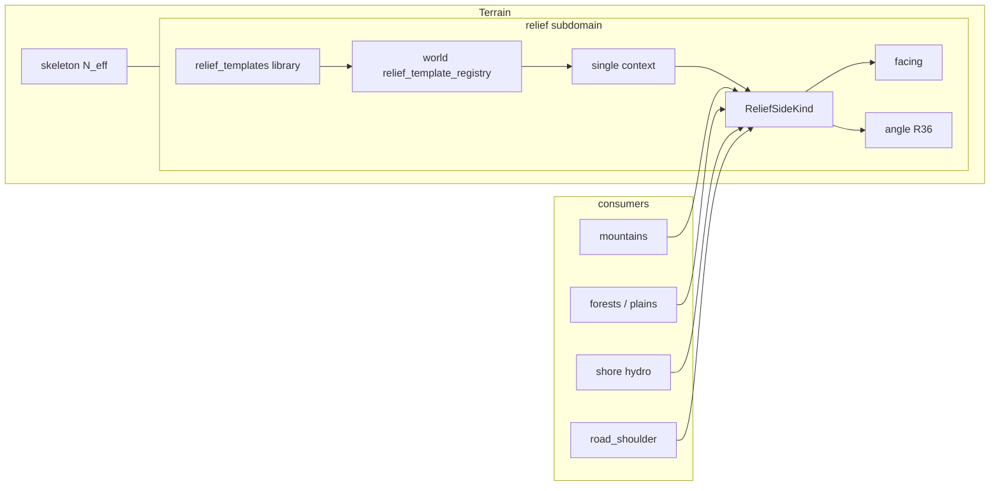

> **Статус:** ownership **утверждён** · templates R33–R35 ✅ · **R36 geom/entity/clearance** ✅ · **canal R36p/q ✅** · **R36u–w** writer/pool/каталог ✅ · **R37** envelope ✅ · **R41/R42 pipeline v2 = SoT** (меса 8, фронт W×L, контекст = тело вершины, `ReliefVertices` сетка). **R38–R40 v1 — deprecated** (не параллельная норма). Шов `full_bake` · halo `grid_neighbor` · T-10 ✅.  
> **Код vs SoT:** sample пиков до пула + `compute_rect` stamp+fill — **долг**, не контракт. **Next:** impl v2 (discover в воркере на готовом z). Wave E later (R36r thick diag / R36o / gameplay). BAR-1 вне. L0 `world-grade` ASCII omit (PAR-G5).  
> **Связь:** SoT grade; **поддомен Terrain** — [`tz_terrain_generation.md`](./tz_terrain_generation.md); **не** MaskDomain SoT. · ASCII — [`tz_pack_ascii_render.md`](./tz_pack_ascii_render.md). · L2 — [`tz_world_pack_storage.md`](./tz_world_pack_storage.md) § Идея 2. · Agent: [`.cursor/plans/relief-dev-plan.md`](../.cursor/plans/relief-dev-plan.md)

**Scope lock (R36u):** меняется **только outdoor relief grade** (`system_grade_uid`, SLOPE/SHEER geometry). **Не трогать** L0→L2 parent-light контракты ([`tz_world_pack_storage.md`](./tz_world_pack_storage.md) § Идея 2):

| Контракт | Поле | ≠ |
|---|---|---|
| **Terrain mask carry** | `system_terrain` nearest | hydro / z / facing / grade |
| Hydro hard corridor | `hydrology_role` → fine | landcover stamp |
| Facing upsample | `system_facing` nearest | terrain mask carry |
| `surface_z` upsample | WP-PERF-22 height | terrain mask carry |

`system_grade_uid` **не** mask carry и **не** nearest-carry с L0.

### R36u — legacy path → detailed fix locus

| Legacy (снять) | Target fix | Note |
|---|---|---|
| L0 `openLand` / `shore` / `roadShoulder` + `ribbonGradeApply` | [`pack/refine/detailedGradeGenerate.py`](../backend/app/application/worldData/pack/refine/detailedGradeGenerate.py) | grade ribbon, не mask; **deleted** (T-8) |
| `upsample_grade_uid_from_parent_light` | — | **deleted** (T-8); не deprecated; grade uid **не** с parent light |
| L0 `world-grade` ASCII | omit ([`tz_pack_ascii_render.md`](./tz_pack_ascii_render.md) PAR-G5) | |
| L2 `fineTerrainAsciiKernel` | consumer — без изменений | |
| Tile-wide `generate_detailed_grade` до pool | per-rect в `FineChunkRunner` worker (**R36v** / стык **R36w**) | не новый оркестратор |
| `road_shoulder` на detailed | **R36u-T-10** ✅ | sample + stamp; context = `ReliefContext.ROAD_SHOULDER`; `PaintedRoadEdge` в dataModel; тот же каталог / `PackJobUid` |
| `ravine` на detailed | ✅ | `sample_ravine_meter`; context = `ReliefContext.RAVINE`; mask cell = seed, bank = ref; не open_land downhill |

Полная таблица: [`tz_generator_technical_debt.md`](./tz_generator_technical_debt.md) § Legacy L0 grade inventory.

# Terrain relief grade (поддомен Terrain)

## Назначение

Поддомен **рельефной грани (grade)** внутри Terrain: проходимый склон vs отвес + направление подъёма на весь outdoor-мир.

Нужен **не только горам**, а любому месту с высотным перепадом / берегом / врезкой:

| Контекст | Примеры |
|---|---|
| `mountain` | грани massif / range |
| `open_land` | plains / forest при Δz |
| `shore` | берег озера / реки / моря |
| `road_shoulder` | **обочины** дороги (две стороны), когда есть Δz между полотном и соседним рельефом |
| `ravine` | **низина** (depression mask); grade стен/пола уже построенной высоты |

**Grade writer (R36u):** outdoor SLOPE/SHEER geometry создаётся в **геометрии `detailed_bake`** (FineTerrain / L2 refine). Исключение из L0-carry ([§ Идея 2](./tz_world_pack_storage.md)): grade **не** несётся с parent light; writer = detailed.  
**Generate (R36v / R36w / R41):** тот же пайплайн `detailed_bake` / entry — **внутри chunk worker**. Каталог `face_key` — serial **до** пула. Discover вершин/фронтов и paint — **в воркере** на готовом `heightmap` (не sample-all до пула). Стык рельефа по uid — **после** сформированных чанков. Runtime patch — **тот же** helper (bounds + halo). **Запрещено:** L0 Δz как кандидаты; отдельный «grade bake» оркестратор.  
**Контексты generate (T-10 ✅):** `open_land`, `shore`, `road_shoulder`, `ravine`. Discover — **R41** (одна конструкция, plugin тела вершины).  
**Template+pick:** `ravine` (`ReliefContext.RAVINE`; низина = mask). `mountain` — library/pick; SideFill Q4 later.  
**Persist:** detailed / entry / patch upsert `relief_grade_instances` (`replace_world=False`). L0 light/full **не** `replace_world=True` — иначе wipe detailed outdoor grades.  
**L0 (light/full):** может красить высоты/маски (ravine z, mountain paint, terrain/hydro/facing …); **запрещено** materialize/stamp outdoor grade (`system_grade_uid` / Grade instance / ribbon grade apply как writer).  

**Legacy (Wave B–D shipped, superseded by R36u-T-8):** L0 outdoor `open_land` / `shore` / `road_shoulder` contributors + `ribbonGradeApply` / BAR-1 intents — **deleted**. `PaintedRoadEdge` — dataModel handoff; detailed sample = meter `road_key` + Δz. Mountain SideFill ≠ this outdoor ribbon stack.

| Владеет | Не владеет |
|---|---|
| `ReliefSideKind` (SLOPE \| SHEER) | `system_terrain` biome keys (`mountain`, `plains`, `forest`, `road`, …) |
| profile(t) → `side_fraction` | FormGeometry / MaskDomain paint merge |
| uphill **facing** (`Facing` enum; discover 8-way — R36s / R41) | PassBuilder / MST / saddles |
| **SLOPE geometry** — `h`/`L`/`θ` (R36); materialize объёма грани | gameplay climb resolver (читает angle) |
| **Relief templates** + context pick + seeded noise | hydrology roles, flora types |
| **Ontology envelope** (R37) — пол L/θ/плато по `ReliefConditionTerrain` | world JSON override конверта (v1 later); stamp facing cache |
| контракт mid-band ↔ grade | column gap fill / `N_eff` (skeleton исполняет объём) |

---

## Утверждено

### Ownership / kind (2026-07-27)

| # | Решение |
|---|---|
| R1 | Relief grade — **поддомен Terrain** (рядом со skeleton / hydrology); SoT **не** в MaskDomain |
| R2 | `SLOPE` = проходимый grade (smooth profile); `SHEER` = отвес (step profile) |
| R3 | Uphill **facing** — смысл как `system_facing` у лестниц ([`tz_locations.md`](./tz_locations.md)); wire = `dataModel.spatial.facing.Facing`. **Объём направлений** — R36s (discover 8-way; volume day-1 орто + W=1 Chebyshev) |
| R4 | **Запрещено** `system_terrain=slope` как biome |
| R5 | Горы / shore / open land / road_shoulder / ravine / later cliff — только **consumers** shared API |
| R6 | Shipped mountain SideFill — **адаптер**/consumer; shared API в `generators/terrain/relief/` |
| R7 | Column gap / `N_eff` — [`tz_terrain_generation.md`](./tz_terrain_generation.md); skeleton = *исполнение объёма* колонки. Relief (R36) задаёт **контракт** materialize грани (закрыть `h`/`L`); grade kind/angle = *проходимость* |
| R8 | Логирование: *почему* SLOPE vs SHEER, facing (или `facing=none` на SHEER), для SLOPE — **`angle`** (R36) |

### World outdoor + templates (2026-07-29)

| # | Решение |
|---|---|
| R9 | Grade — **слой всего outdoor**, не plugin только гор |
| R10 | Мастер **не** задаёт SHEER/SLOPE **поклеточно** / paint по карте. Допустимо: шаблоны + pick; **точечный** declare `sides[].kind` на **стороне горы** (= сектор form / один большой объект Spec, **не** клетка) |
| R11 | Хранение шаблонов — **1:1 как здания**: глобальная библиотека + per-world pointer registry ([`tz_building_generator.md`](./tz_building_generator.md) §5–6) |
| R12 | **Context + pick policy** выбирают шаблон; **внутри** шаблона — `side_recipe` (mountain) или schedule/`classify(dz)` (ribbon) + **seeded** noise (R15). Не «только шум» и не «Δz без шаблона» |
| R13 | Контексты v1: `mountain` \| `open_land` \| `shore` \| `road_shoulder` \| `ravine` (приоритет — § Context priority) |
| R14 | **Δz сам по себе не выбирает** SHEER vs SLOPE; шаблон + noise (пороги/веса — knobs шаблона) |
| R15 | Шум **детерминирован** от `world_seed(world)` + `(context, template_uid, x, y [, edge])` — воспроизводим recreate |
| R16 | Persist facing: column `system_facing` / FineTerrain column wire (как outdoor grade); stairs — по-прежнему per-cell |
| R17 | У шаблона **ровно один** `context` (не список): knobs и смысл сильно зависят от контекста |
| R18 | Мастер: (A) импорт шаблона из глобальной библиотеки в мир **и/или** (B) `relief_template_registry` (+ тела шаблонов) входит в **world bundle** |
| R19 | Pick policy **на каждый context**: `fixed` (default uid) \| `random` \| `round_robin` — см. § Pick policy |
| R20 | `road_shoulder` = grade **обочин** при Δz дорога↔рельеф (2 стороны). **Не** layout/строительство полотна. Полотно `road` **не** получает SHEER (противоречит замыслу дороги) |
| R21 | Пустой candidates / битый `fixed` uid / дыра schedule / unknown canal\|barrier ref → **warn + soft fallback** (общая политика resolve); не silent, не hard-fail generate. **Wire event:** `EVENT_RESOLVE_FALLBACK` = `"resolve_fallback"` (`reliefEvents.py`). Не путать с R34 skip |
| R22 | **Длина наклона (slope)** обочины: omit → default **1** клетка (`slope_length_cells`) — **валидно**. Explicit **`0` / невалидный geom** — не empty ring: **WARN + fallback 20°** (R36b), не silent clamp и не skip. В поселениях обочина **optional** = `slope_none` / нет site, **не** `L=0`. **`shoulder_width_cells` — убрать** (не alias, не wire) |
| R23 | `round_robin` seq — на **pick site**; для `road_shoulder` site = **segment × slope policy**, не целый edge / left\|right мастера |
| R24 | Persist grade = **сущность** SLOPE\|SHEER + **двусторонние ссылки** (R36h/j). На клетке — только ref (`system_grade_uid`, omit если нет) + при необходимости `system_facing` для совместимости stairs. **Не** дублировать h/L/angle на каждой клетке |
| R25 | Шаблоны `road_shoulder`: **typed conditions**; left\|right выводит движок; мастер сторону не назначает |
| R26 | Conditions: enums + POJO; ≤1 condition на `terrain`; на terrain — **ровно три** policy (`slope_none` / `slope_down` / `slope_up`); wire mode — **XOR A\|B** (R32), не «только bands» |
| R27 | `slope_weight + sheer_weight == 1` (±eps); иначе **reject** — шаблон не в библиотеку/мир (без silent normalize) |
| R28 | **Canal — XOR kinds + world canal registry.** Runtime SoT: ``EarthenCanal`` \| ``StructureCanal`` (`dataModel/terrain/relief/canal.py`). Wire knobs: optional **`earthen_canal`** (bool; omit ок) XOR **`structure_canal`** = ref → **`worlds.canal_template_registry`**. Registry entry: **`earthen_canal: true` XOR `structure`** (не оба, не пусто). Structure materials → `barrier_template_registry`. Плоский `structure_refs` на knobs с earthen = BAR-1 fence (не canal body). Clearance-путь → R36p. Materialize built — BAR-1. Terrain: один `draw_canal` + `build_canal` handlers |
| R29 | **FS layout:** корень библиотеки **`relief_templates/`** (не смешивать с buildings/иным). Пак: `{pack_name}/` внутри корня; файлы `{system_name}.json` (stem == `system_name`); иначе **reject**. Одиночный файл — тоже под `relief_templates/`. Конвенция — `.cursor/rules/template-pack-layout.mdc` |
| R30 | Пресеты / подсказки weights, `delta_z`, **`slope_length_cells` / `target_angle_deg`** (Geom-A\|B\|C калькулятор) — **только UI-модуль**; backend хранит и validate сырой контракт, **не** генерирует пресеты |
| R31 | `relief_pick_policy`: **мир** → **объект** → (для гор) **сторона**; более специфичный уровень перезаписывает; см. § Pick policy |
| R32 | Условия terrain — **XOR двух режимов** (не смешивать): **(A)** `slope_none`/`slope_down`/`slope_up` + один `delta_z` **или** **(B)** bands `{delta_z_min, delta_z_max?}` на down/up; `delta_z_min >= 1` |
| R33 | **Mountain preset** = `ReliefTemplate` с `context: mountain` в той же library/packs (R29). Тело — **side recipe** (не Mode A/B `conditions` дорог). XOR режимов раскладки сторон: **(A)** weights \| **(B)** pattern \| **(C)** fixed kind; **пусто / ничего не указано** → **seeded random** per side (R15). `MountainKind` ≠ preset (elevation/content). R30 не про это — UI-only для shoulder/`delta_z` чисел |
| R34 | **G2:** `ReliefConditionTerrain` ↔ `system_terrain` — 1:1 по имени. Клетка вне таблицы / без condition → **skip grade**. **Запрещено** R21 «левый SLOPE» для unknown N+1. Два **независимых** пути каталога: (1) **import relief** — upsert missing keys из `conditions` (canonical, не затирать существующие); (2) **API настройки мира** — мастер/редактор правит любые N+1 (`PUT /worlds/…`). R21 — только битый pick/template/дыра schedule |
| R35 | **G4 / bundle:** тела **relief**-шаблонов **не** в `world` JSON. В мире — `relief_template_registry` + `relief_pick_policy` (в т.ч. **`canal_obstacle_policy`**, R36p) + **`relief_grade_obstacle_policy`** (R36n) + **`canal_template_registry`** (R36q). Self-contained bundle: top-level **`relief_templates`** + pointers/policy (+ canal registry) внутри `world`. Import: upsert SQL library ← секция + registry/policy ← `world`. Имя ключа relief = `BundleSection.RELIEF_TEMPLATES` (`"relief_templates"`). API — тонкий слой |

### SLOPE geometry / materialize (2026-07-31)

| # | Решение |
|---|---|
| R36 | **SLOPE** = прямоугольный треугольник **высота × длина → угол** (rise/run). Materialize закрывает **весь** измеренный `dz` (объём грани, не facing-only stamp). **SHEER** = отвес на всю `dz` (θ ≈ 90°, grade-проход нет). Политики (R32) — *когда* case/band и knobs; угол — *после* resolve геометрии. См. § SLOPE geometry (R36) |
| R36a | **h (height)** в generate = **measured** `|dz|` сайта (дорога↔сосед / эквивалент consumer). Политика **не** задаёт высоту карты |
| R36b | Wire knobs на case/band — **предпочтительно XOR Geom:** либо **`slope_length_cells`** (длина наклона L), либо **`target_angle_deg`**. Omit L → default **1** (валидно). **kind=SLOPE ⇒ L ≥ 1.** Невалидный geom (**не reject** import/generate): оба ключа; `L < 1` (в т.ч. explicit **0**); θ ∉ (0, 90) → **WARN** + fallback Geom-B **θ = 20°**, `L = min(ceil(h / tan 20°), free_gap)` (луч наружу, R36m). Устарело: explicit 0 = no-wedge / empty ring. Третий параметр — derived. **`shoulder_width_cells` удалён**. Частные случаи — § SLOPE geometry |
| R36c | Три режима треугольника (клетка кубическая: `cell_xy_m == cell_z_m`): **Geom-A** `h+L→θ`; **Geom-B** `θ+h→L`; **Geom-C** `L+θ→h` — только UI (R30), **не** override карты. **Не путать** с **Mode A\|B** (R32: `delta_z` vs bands) — разные XOR |
| R36d | Формулы: `θ = atan(h/L)`; `L = ceil(h / tan(θ))` (min 1); `h = L · tan(θ)`. Пример: `h=1`, `L=1` → **45°** |
| R36e | **SHEER + длина:** отвес — **одна** XY-колонка (`L = 1`) на ribbon-фасаде (R37 `canonical_sheer_length_cells`). На смешанном case (`slope_weight` + `sheer_weight`) wire L/θ — **только SLOPE**; kind=SHEER **игнорирует** knobs L и ставит 1. Inner `geom_resolve` без фасада ещё читает knobs L. Solid на **все h**. `facing=none`, angle N/A |
| R36f | Позиция персонажа = `(x,y,surface_z)`. Movement/LLM: клетка → `system_grade_uid` → сущность grade (`length_cells`, `angle_deg`, `kind`, …) |
| R36k | **Pathfinding:** граф = **grid** (шаги клетка↔клетка по `surface_z` / walkability), **в том числе через технический шов чанка/тайла (C29)**. **Slope/SHEER не отдельные ноды пути** — один **Grade object**; cost/block берётся с entity по `system_grade_uid` (один `angle_deg` / kind на весь объект). Не считать независимый `atan(Δz)` на каждом ребре, расходящийся с grade. Шов pack **не** нода пути и не отказ шага. Impl pathfinding — later; контракт — этот |
| R36g | **Устарело:** facing-only stamp; **устарело:** дублировать L/angle/h на каждой клетке пандуса. Target: materialize R36i + **Grade instance** R36j |
| R36h | **`h`/`dz` на клетке не хранить.** На клетке — **`system_grade_uid`** (omit если клетка не в grade). L/angle/h/kind/facing grade — на **сущности**. См. R36j |
| R36i | **Materialize на всю `h=\|dz\|`:** SLOPE ramp / SHEER L×h solid. Без void. Затем создать Grade instance + проставить ссылки (R36j). Якоря верх/низ — **R36t** (не мутировать; canal-исключение при укорочении — R36p). **Apply = Post-R36w `GradeWriteSet` ✅** |
| R36j | **Grade = один составной объект** (аналог **одной горы** `MountainSpec`). Состоит из grid-клеток; `cell_refs[]` ↔ `system_grade_uid` подтверждают состав. Поля: `grade_uid`, `kind`, `height_cells`, `length_cells`, **`angle_deg` (одно место; omit SHEER)**, `facing` (omit SHEER), resolved canal flat columns из **`Canal`** (`EarthenCanal`\|`StructureCanal`) через `build_canal`/`draw_canal` — **тот же cut**, что на Intent.`canal`. **Запрещено:** несколько углов в одном Grade |
| R36l | **Иерархия как у гор** ([`tz_mountain_architecture.md`](./tz_mountain_architecture.md): хребет ↔ ≥2 вершины). **Один** постоянный угол / **один фронт (сторона)** → один `ReliefGradeInstance`. Несколько сторон одной вершины или излом θ → **`ReliefGradeSystem`** (`grade_instance_uids` ≥ 2). **1 грань (один луч/фронт)** → строку `relief_grade_systems` **не** пишем (FK: `Instance.grade_system_uid` тогда NULL). Рабочий slot вершины на bake ≠ строка БД. Клетка → **Instance** (`system_grade_uid`), не System. Persist: package + DB |
| R36m | **Obstacle clearance (мир) + truncate/skip.** Длину grade до footprint задаёт **`worlds.relief_grade_obstacle_policy`** (R36n). Оба режима: footprint **не** затирать; `L_eff < 1` → **skip** (+ WARN). **Не** включает earthen (это R36p / knobs). **Устарело:** silent auto `earthen_canal` при collision без knobs и без `canal_obstacle_policy` |
| R36n | **Wire (мир):** `relief_grade_obstacle_policy`: **`truncate_skip`** \| **`allow_flush`**. Default = **`truncate_skip`**. Не на object/side (v1). Generate читает setting и ветвится; без silent fallback на другой режим. См. § Obstacle policy |
| R36o | **Junction smooth (later):** модификатор сглаживания **стыка** прямой Grade с другим объектом (road / platform / соседний Grade / barrier footprint). **Не** меняет инвариант «один Grade = одна прямая / один θ». Не profile `smoothstep` (SideFill). Не `ReliefGradeSystem` (ломаный = ≥2 прямых). Не obstacle policy (clearance режет `L`). Wire-эскиз на knobs/grade: `junction_smooth`: **`none`** (default) \| **`chamfer`** \| **`fillet`**; опц. `junction_smooth_cells` ≥ 1 при режиме ≠ none. Materialize: после ядра ramp/sheer — переходные колонки на стыке. **v1 R36:** не impl |
| R36p | **Canal-by-world-rule — только если grade не вмещается.** Нормальный path: knobs XOR `earthen_canal` \| `structure_canal` (R28/R36q). Спец-ключ **`canal_obstacle_policy`**: `{ to_canal_cut_enable, entities, canal_ref? }`. Enum entities: `road` \| `mountain` \| `forest` \| `plains` \| `shore` \| `all`. Смотреть **только** если не вмещается; match → cut по enable; при `enable: true` опц. **`canal_ref`** → `canal_template_registry` (omit ref = earthen-only cut). Overlap enable: **false wins**. Места хватает → политика игнор. См. § Canal obstacle policy |
| R36q | **`worlds.canal_template_registry`.** Переиспользуемые canal-описания мира (не новый объект на каждом case). Entry: `system_type` + optional `earthen_canal` + optional `structure.structure_refs[]` (каждый ref ∈ `barrier_template_registry`). Grade knobs: `structure_canal` = `system_type`. Unknown ref → reject import / R21 warn+fallback на generate. См. § Canal template registry |
| R36r | **Diagonal ribbon + width (candidate, later; зависит от R36s / **R42**):** при intercardinal outward — materialize как **thick line on grid**: core вдоль outward (`L` = Chebyshev steps) + поперечный fill ширины `W` с **теми же** steps/θ → **один** Grade (R36j). Алгоритм-основа: [Murphy’s Modified Bresenham](http://www.zoo.co.uk/murphy/thickline/) ([IBM TDB 1978](http://homepages.enterprise.net/murphy/thickline/); семья [Bresenham](https://en.wikipedia.org/wiki/Bresenham%27s_line_algorithm)). **Кардинальный фронт и SoT ширины — R42** (lockstep, не веер). Clearance — на полосе. **Не** voxel corner/shim / Minecraft stair shapes (стыки → R36o). **v1:** не impl (нет диагонального outward) |
| R36s | **Facing scope — locked.** Wire/entity: `Facing` (cardinal + intercardinal). **SLOPE:** uphill на Grade; **SHEER:** omit / `none`. **Discover v2:** 8 кандидатов с кромки. **Volume day-1:** орто W×L + нитка W=1 Chebyshev `(±1,±1)` на повороте (тот же `outward_columns`). Толстый диагональный фронт → **R36r** later. Шаг = Chebyshev 1 — [GoRogue](https://github.com/Chris3606/GoRogue/wiki/Measuring-Distance). **Запрещено:** параллельный facing enum. Stairs — [`tz_locations.md`](./tz_locations.md); outdoor facing — на entity (C10) |
| R36t | **Bake formation anchors (SLOPE\|SHEER) — locked.** При **формировании** грани на bake всегда есть **верхняя** и **нижняя** точка перепада (якоря сайта / measured `dz`). Grade materialize + stamp **только между** якорями (коридор грани), **не** заливка региона. **Строго запрещено мутировать** клетки верхней и нижней точки (высота, материал, `system_grade_uid`, facing cache — не трогать якоря). **Не** правило entity R36j (состав объекта); это контракт **bake-формирования** (writer = **detailed_bake geometry**, R36u). **Исключение:** **canal** при **укорочении** slope (`L_eff` < requested / не вмещается) — cut у укороченного конца по **R36p** (+ knobs XOR на нормальном path, R28/R36q); см. § Canal obstacle policy. Без canal-ветки якоря остаются неприкосновенны. **Запрещено:** трактовать бровку/дно как «весь объект = SHEER» только из‑за membership flood. Вершины/низины известны по готовому `heightmap` до paint — **R41** |
| R36u | **Grade generate locus — locked.** Исключение из [§ Идея 2](./tz_world_pack_storage.md) (L0-carry): outdoor grade **не** несётся с L0. Single-writer **геометрии** = фаза **создания геометрии `detailed_bake`** (FineTerrain column + Grade entity + refs). **Не** L0 light/full ribbon. **Не** «контракт L0→L2 propagate uid». **Запрещено:** stamp/`system_grade_uid` на L0 world-map cells как SoT grade; nearest-carry grade uid с parent light как источник membership (**PAR-G8 superseded**). L0 остаётся landcover/height/mask; detailed geometry — единственный writer SLOPE\|SHEER. Термины вроде «метровая сетка» **не** SoT — говорить **detailed_bake geometry / FineTerrain**. Anchors — R36t. ASCII — [`tz_pack_ascii_render.md`](./tz_pack_ascii_render.md). **Как** крутить generate (pool / sample / patch) — **R36v**; **как стыковать чанки** — **R36w** |
| R36v | **Grade generate schedule — locked (v2 = R41, расписание A).** Outdoor grade **вшит** в `detailed_bake` / `FineChunkRunner`, не отдельный процесс. **Пул:** одно задание на `ColumnRect` в том же `ChunkComputePool`. **Каталог `face_key` / job uid — serial до пула** (R36w). Discover/paint **не** pre-pool sample. **z:** `TileSurfaceState.heightmap` готов в prep (`generate_chunk_cells_sync` z **не** пишет). **На ядре (A):** discover+paint на этом z → **один** column fill (parent⊕overlay). Не два fill. Не fill∥relief. Не второй пул. Не рельеф тайла параллельно с чанками. Не tile-wide materialize. Не pool task на `face_key`. Halo = чтение `max(L_tpl, envelope floor)`. **Контракт z после paint:** column fill не меняет `surface_z`. Если будущий writer **меняет z колонки после paint** — **он** обновляет relief (или пишет z **до** paint). Relief не подписывается на чужие мутации z; это не повод на два fill. **Код:** sample до пула + stamp+fill — **долг**. World mod: тот же helper. Persist `replace_world=False`. Бюджет: tile-wide serial materialize — reject. См. § Grade в detailed_bake · § Relief pipeline v2 |
| R36w | **Grade chunk stitch — locked (каталог ✅; T-3b graph stitch ✅; T-3c System later).** Стык = **уникальные грани chunk-сетки**, не first-lock-wins и не serial **materialize** всех семян. На **старте** refine/`detailed_bake` по размеру тайла и `terrain_chunk_columns` строится каталог граней: общая ребро двух чанков — **одна** грань (east A ≡ west B). Каждой грани **заранее** выдаётся воспроизводимый `grade_uid` = hash(`world_seed` \| `tile_gx` \| `tile_gy` \| `face_key`) (R15). **`tile` / `chunk` / `tile_edge`** — uid джобов (очередь/лог), не дерево `tile→chunk` и не uid Grade/climate/hydro. Ключ чанка содержит координаты тайла (адресация). **Родители `face_key` в этом bake** = chunk job uid **этого** тайла (internal 2, rim 1): **гейт старта** (не все bake сразу; 1 = сосед не в вызове, процесс можно запускать) + clearance (`< 2` → void не C18). Шов мира (антагонисты AABB) — `full_bake` L0, не этот каталог. Граф ленты **ссылается на `face_key` uid**; ребро графа uid **не** минтит. Пустая грань — uid в каталоге есть, instance **не** создаётся. `seed ∈ rect` для интерьера. Порядок rect не SoT. **Пул = один task на `ColumnRect`** (discover+paint, **затем один** fill, то же ядро — R41). Общая грань — один catalog uid; discover пишет **owner-чанк**, сосед только штампует. **Запрещено:** mint от порядка воркеров; два uid на одну общую грань; remap после persist; pool task на `face_key`; tile-wide materialize. Каталог до пула — **C28**; discover в воркере — **R41**. См. § Grade в detailed_bake · § Topology → entity → stamp |
| R37 | **Ontology envelope — locked.** Relief **дополняет** маску, не подменяет. Конверт (`ReliefConditionTerrain`) — пол в `dataModel` (`ReliefOntologyEnvelopes`); шаблон не круче/короче пола. Bake → `grade_constrained` → inner `grade_from_template`. Volume / R36i inner **не** переписывать под равнину. Q5 supersede. **Каркас discover/фронтов — R41.** Ширина — **R42**. Исторический v1 (origins/mesa/ray) — R38–R40, **не SoT**. См. § Ontology envelope |
| R38 | **Sparse origins — deprecated (v1).** Исторический запрет второго stencil «все локальные max» и 8×N с клетки **остаётся** (бюджет R36v). **SoT вершин/кромок — R41** (кромка = спуск в 8; не hunt пиков). Не читать этот пункт как 4-связность или fill→relief. См. § Sparse origins (historical) |
| R39 | **Mesa union — deprecated (v1, 4-связность).** Идея «тело ≠ Grade; лучи только с кромки наружу» **остаётся**. **SoT членства — R41: 8-связное** то же целое z при наличии кромки спуска. Диагональный `4` к плато той же z — та же вершина. Не читать «диагональ не членство». См. § Mesa union (historical) · § Relief pipeline v2 |
| R40 | **Ray walk / fill→relief — deprecated (v1).** Запреты fill∥relief, второго пула, рельефа тайла параллельно с чанками — **остаются**. Порядок writer высот **не** «column fill затем discover»: z уже в `heightmap` (prep). **SoT — R41:** discover+paint → один fill. Стоп θ / каскад террас / не мутировать якоря — R41 + R36t. См. § Ray walk (historical) |
| R41 | **Relief pipeline v2 — locked (SoT).** Одна конструкция: вершина → кромка → непересекающиеся фронты → `GradePaintSpec` → L2 paint. Контекст = тело вершины. Членство 8-связное при rim. `ReliefVertices` + **`occ` коридора**. Покрытие: фронт вниз пока θ; остаток = незатопленные кромки (**C39**: bucket[z] сверху, не полный CC). **1 фронт = 1 Instance;** System row при ≥2. Каталог до пула; discover+paint → один fill; стык после чанков. Stamp `|dz|=1` нет (R37). Ширина — **R42**. См. § Relief pipeline v2 · § Ray width |
| R42 | **Ray width — lockstep front — locked.** Луч = **фронт**, не нитка в 1 клетку. `W` = сплошной run кромки месы с одним `Facing` и одним первым спуском. Весь фронт шагает наружу **вместе** (Chebyshev 1 — [GoRogue](https://github.com/Chris3606/GoRogue/wiki/Measuring-Distance)). Орто: прямоугольник `W × L`. Диагональ: та же полоса; fill — [Murphy thick line](http://www.zoo.co.uk/murphy/thickline/) (R36r later). **Не** веер. Разный dz/θ вдоль `W` → резать Grade (C15). Опц. сужение `W`, если край полосы упёрся, а середина ещё идёт (Murphy taper) — не захват чужой низины. Не dilation/GIS-buffer, не per-cell stairs. См. § Ray width |

### Locked checklist (master, 2026-08-01)

Выводы сессии — **утверждены**; расхождение кода (facing-only) = debt до impl.

| # | Вывод | Статус |
|---|---|---|
| C1 | Facing-only stamp без правки высот — **неверная** impl для ribbon SLOPE/SHEER | locked (R36g); apply = Post-R36w ✅ |
| C2 | `h` = measured `\|dz\|` сайта; политики R32 — порог/knobs, не «градусы в JSON» | locked (R36a) |
| C3 | Угол SLOPE: `θ = atan(h/L)` (куб. клетка: `h=1,L=1` → 45°). Geom-A/B bake; Geom-C UI only | locked (R36c–d) |
| C4 | Wire: предпочтительно XOR `slope_length_cells` **или** `target_angle_deg`; omit→1; **SLOPE L ≥ 1**; невалидный geom → **WARN + θ=20° / луч**, не reject; **`shoulder_width_cells` убрать** | locked (R36b) |
| C5 | **Mode A\|B** (R32 bands) ≠ **Geom-A\|B\|C** (треугольник) | locked (R36c) |
| C6 | Materialize закрывает **всю** дельту z (`sum(steps)==h` / solid × h); нет void | locked (R36i); apply = Post-R36w ✅ |
| C7 | **SLOPE:** L = длина пандуса XY; steps по z; facing uphill на **grade entity** | locked |
| C8 | **SHEER:** L = 1 колонка XY (R37); solid × h; facing/angle на entity omit/`none` | locked (R36e/R37) |
| C9 | Позиция: `(x,y,surface_z)`; клетка — часть grade через **`system_grade_uid`** | locked (R36f/j) |
| C10 | `system_facing` stairs — per-cell как сейчас; outdoor grade facing — на **Grade entity** (клетка может кэшировать omit) | locked path |
| C11 | Grade — **составной объект**; угол/`length`/`h` только на нём; клетка — только `system_grade_uid` (omit) | locked |
| C12 | Длина сегмента вдоль дороги ≠ `length_cells` grade (наружу) | locked |
| C13 | LLM/игрок ← сущность Grade (`length_cells`, `angle_deg`), не скан клеток | locked |
| C14 | Pathfinding = **grid**; cost/block slope ← **один** Grade object по uid | locked (R36k) |
| C15 | **Один угол / один фронт = один Grade (Instance).** Несколько сторон вершины или излом → System ≥2 Instance. **1 фронт** → строку `relief_grade_systems` **не** пишем (`Instance.grade_system_uid` NULL). Клетка → Instance, не System. Рабочий slot вершины ≠ строка БД | locked (R36l) |
| C16 | Expand → obstacles: по **`relief_grade_obstacle_policy`**; `L_eff < 1` → skip; не overwrite; silent auto-canal без политики/knobs — запрещён | locked (R36m/n) |
| C17 | **R28/R36q:** knobs XOR `earthen_canal` \| `structure_canal`→`canal_template_registry`; structure materials → `barrier_template_registry`. Clearance-path → R36p. Wire+resolve ✅; detailed apply = поля Grade в том же Formation | locked (R28+R36p+R36q); apply = Post-R36w ✅ |
| C18 | Два режима мира: **`truncate_skip`** (default, ≥1 free между grade и объектом) \| **`allow_flush`** (последняя free OK) | locked (R36n) |
| C19 | **Junction smooth** — опциональный модификатор стыка; ядро Grade остаётся прямой; v1 = `none` / не impl (R36o) | locked direction (R36o) |
| C20 | **Нормальный canal:** knobs XOR. **Не вмещается:** `canal_obstacle_policy` `{to_canal_cut_enable, entities, canal_ref?}`; overlap false wins (R36p/q) | locked (R36p/q) |
| C21 | **`canal_template_registry`** на мире; `structure_canal` / `canal_ref` = `system_type` entry (R36q) | locked (R36q) |
| C22 | **Diagonal + W:** candidate = thick-line (Murphy) + Chebyshev; **не** corner/shim; стыки → R36o. Discover 8-way и нитка W=1 — **R41/R36s**. Толстый диагональный фронт W>1 — **R36r** later. Кардинальный фронт — **R42** | locked direction (R36r); width SoT = R42 |
| C23 | **Facing:** discover 8-way (`Facing`); шаг diag = Chebyshev 1; volume day-1 = орто W×L + нитка W=1 Chebyshev; thick diag → R36r; wire = `Facing` only | locked (R36s) |
| C24 | **Bake anchors:** верх/низ точки перепада при формировании SLOPE\|SHEER; **запрет мутации** якорей; единственное исключение — **canal при укорочении** slope (R36p) | locked (R36t) |
| C25 | **Grade writer = detailed_bake geometry** (не L0); нет L0→L2 grade-uid carry как SoT. Исключение из [§ Идея 2](./tz_world_pack_storage.md) | locked (R36u) |
| C26 | **Grade = pool (ядра)** + **сшивка после чанков**. Каталог uid до пула — **C28**. Discover+paint в worker на готовом heightmap, затем **один** fill — **R41**. Тот же helper на patch. **Не** L0-кандидаты; **не** новый оркестратор; не fill∥relief; не второй пул; не sample-all до пула | locked (R36v/R41) |
| C27 | **Стык = каталог граней**; uid заранее `world_seed`+tile+`face_key` (R15); граф ссылается; шов sample по тому же uid; не mint в воркере. Job uid: `tile` / `chunk` / `tile_edge` — ключи очереди, не дерево `tile→chunk`. **Родители грани в этом bake** = chunk job uid этого тайла (2 internal / 1 rim) — **гейт старта** (не все bake сразу) и clearance (`< 2` → void ≠ C18). **Шов мира** (антагонисты AABB) — **`full_bake` L0 на макро-тайлах**, не каталог `detailed_bake`. **Пул = `ColumnRect`**. **Два `detailed_bake` смежных (grid) тайлов** — не ждут друг друга; лента вдоль шва = один uid + upsert. Halo читает z `WorldBounds.grid_neighbor` (не `antagonist_tile`). `road_shoulder` — тот же каталог (`ReliefContext.ROAD_SHOULDER`). Не uid Grade/climate/hydro | locked (R36w) ✅ |
| C28 | **Каталог → discover → paint → fill.** Каталог `face_key` = identity ребра / job, uid **до** пула. Discover вершин/фронтов — в worker на heightmap, **не** serial sample-all семян до пула. Прямая `(kind, outward, θ)` = один Instance. ≥2 Instance одной вершины → System row. 1 Instance → System **не** пишем. Клетка → Instance, не System. Rim-canonical на шве — **C29**. Apply (z/canal/fill) не переписывать | locked (R36w catalog; R41 discover); T-3c System row при ≥2 |
| C29 | **Шов технический.** `face_key` / chunk / tile rim / `ColumnRect` / job uid — нарезка работы и pack, **не** граница мира. Через шов непрерывны: климат, дороги, шаг (later), **локация / город** (territory может лежать на ребре). Запрещено делать из шва стену, обрыв поселения, второй `location_uid` «из‑за тайла», смену зоны или ноду пути | locked; writers локации/города не в relief |
| C30 | **Конверт онтологии** (`ReliefConditionTerrain`) ≥ knobs шаблона. Фасад `grade_constrained`; inner без `if plains`. Plains `open_land`: `|dz|=1` без stamp; `|dz|≥2` луч до вокселя; θ≤20° → SLOPE, иначе SHEER L=1. Короткий L=2 knobs **запрещён** как потолок (конверт поднимает). Каркас — **C36 / R41**; ширина — **C37 / R42**; коллекция — **C38** | locked (R37) |
| C31 | **Смешанный case:** L/θ knobs → SLOPE; SHEER всегда L=1. Невалидный geom (0 / оба ключа / θ вне (0,90)) → не reject: WARN + 20° и L до первой клетки луча. `L_eff < 1` после луча → skip stamp (R36m), не abort шаблона | locked (R36b/e) |
| C32 | **Вершины не stencil сетки.** Layout + кромки спуска на готовом z. Кандидатные направления — 8. Второй полный обход volume (location bake) — reject. **SoT — C36 / R41.** Исторический R38 — запрет hunt пиков | locked (R41); R38 historical |
| C33 | **Вершина = одна псевдосущность.** 8-связные клетки той же z **с кромкой спуска** не сеют 8×N. Лучи только наружу с кромки. Rim-run / фронт с одним outward и тем же первым dz — один Grade. **SoT — R41.** Исторический R39 4-neigh — снят | locked (R41) |
| C34 | **Фронт = один θ до упора или смены угла.** Швы — `grade_uid` (R36w). Нижняя терраса — вершина **только если не покрыта** коридором сверху (C39). Излом θ → новый Grade (C15). `|dz|=1` не stamp. **SoT — R41** | locked (R41) |
| C35 | **Расписание A locked:** discover+paint → один fill. Heightmap готов в prep. Не fill∥relief. Не второй пул. Не два column fill. **Кто меняет z колонки после paint — тот же обновляет relief** (или пишет z до paint). См. **R41** | locked (R41) |
| C36 | **Relief pipeline v2.** Одна конструкция. Каталог uid → discover+paint → один fill → стык после чанков. **Покрытие:** фронт вниз пока θ; донашивание только непокрытых кромок, не каждая клетка. Ширина — **C37**. Коллекция — **C38**. Остаток — **C39**. См. **R41** | locked (R41) |
| C37 | **Луч = фронт W×L.** Lockstep по Chebyshev; орто = прямоугольник; диагональ day-1 = нитка W=1; Murphy W>1 — R36r. Не веер, не dilation, не stairs по клетке. Разный dz вдоль W → резать. См. **R42** | locked (R42) |
| C38 | **`ReliefVertices` на hot path.** `at_grid` слот вершины; **`occ` коридор фронта**; `members[slot]` = `dict[(x,y), z]`; `uids[slot]` отдельно. Запрещено: uuid в сетке; list в members. Reconcile: выкинуть клетку в чужом `occ`, не всю вершину | locked (R41) |
| C39 | **Незатопленные кромки — bucket[z] + `occ`, не поиск дыр.** Сетка = `ColumnRect`+halo. `occ` = коридор фронта; `at_grid` = слот вершины. Ведра по целой z, сверху вниз. Seed только если `occ==0` ∧ `at_grid==0` ∧ есть 8-сосед ниже с `occ==0`. 8-flood тела — **от этой кромки**. Не полный CC same-z; не Priority-Flood ямы; не heap на клетку; не второй обход тайла. Пол рампы не сеет. См. **R41** § Покрытие | locked (R41) |

---

## Grade в detailed_bake (R36v / R36w)

**Не новый пайплайн.** Locus остаётся R36u. R36v — *когда и по какому объёму*. R36w — *каталог граней chunk-сетки + заранее uid; граф только связывает их*. C28 — *когда считать граф и как резать entity*.

**Код на 2026-08-17:** каталог граней до пула; **T-3b ✅** stitch → `ctx.planned`; пул/`compute_rect` = stamp+fill **в одном шаге** на уже готовом heightmap. **Долг vs R41:** sample/stitch семян **до** пула; discover не в воркере. Runner — тонкий оркестратор.  
**Post-R36w apply ✅:** `MeterGradeSurface` read-only z; write-set = `DetailedGradeResult.surface_z` + uid + instances. Fill = rect-local heightmap.  
**T-3c later:** emit `ReliefGradeSystem` при ≥2 прямых в компоненте.

### Расписание чанков (не SoT стыка)

Один и тот же runner получает **разный набор и порядок** `ColumnRect`. Стык **не** вправе требовать юго-западную волну.

| Режим | Откуда rects | Порядок |
|---|---|---|
| Offline `detailed` wilderness | все chunk макро-тайла | `iter_meter_chunks` (ряд) |
| Offline `detailed` location | rects ∩ territory; **вершины — R41** (не stencil volume) | как покрывают volume |
| Entry P0 scene | кольцо scene volume от якоря (ноги / spawn / entry) | distance от anchor |
| Фон колец | `schedule_tile_background` | distance; runtime часто **≤ 1** active chunk |
| Path corridor | `select_path_corridor_rects` + path-ahead | полоса по heading; соседний тайл с якорем на границе |
| Patch (⬜ DAG) | `patch_bounds` | bounds + halo |

### Контракт R36w

**Единица стыка — грань chunk-сетки, не «кто первый взял lock».**

На старте `refine_rects` / `detailed_bake` (до пула) известны `map_cell_size_m`, `terrain_chunk_columns`, макро-тайл `(gx, gy)`. Из этого строится полный каталог:

| Объект | Сколько | Uid |
|---|---|---|
| Макро-тайл `(gx, gy)` | 1 | **uid джоба L0** — wire [`PackJobUid.tile_uid`](../backend/app/dataModel/worldPack/packJobUid.py); seed [`pack_job_seed`](../backend/app/application/worldData/pack/bake/macroTileUid.py). **Не** джоба `detailed_bake` |
| Чанк `(cx, cy)` | `n_cx × n_cy` | **uid джоба detailed** — [`PackJobUid.chunk_uid`](../backend/app/dataModel/worldPack/packJobUid.py). Persist unit — не SoT Grade. **Родитель `face_key`** на этом тайле |
| **Уникальная грань** | общие рёбра + границы тайла | **заранее** `make_grade_uid` от ключа ниже — **SoT grade** |
| **Ребро макро-тайла** `tile_edge` | 4 стороны | wire [`PackJobUid.tile_edge_uid`](../backend/app/dataModel/worldPack/packJobUid.py); owner/канон. сторона — [`detailedJobUid.py`](../backend/app/application/worldData/pack/refine/detailedJobUid.py). Не wrap AABB |

Общая грань двух чанков **один раз** в каталоге: east `(cx,cy)` ≡ west `(cx+1,cy)`.

**Ключ uid (воспроизводимый, R15):** wire SoT = [`PackJobUid`](../backend/app/dataModel/worldPack/packJobUid.py). Namespace seed = [`pack_job_seed`](../backend/app/application/worldData/pack/bake/macroTileUid.py) (interim = `world_uid` до колонки seed). **Не** climate `world_seed()` (int) и **не** relief `bake_seed` как SoT pack-ключей. Persist-колонка instance по-прежнему `world_uid`.

```text
world_seed | tile:{gx},{gy} | face:{V|H}|{cx}|{cy}
```

| `face_key` | Геометрия |
|---|---|
| `V\|{cx}\|cy` | вертикальный шов между `(cx,cy)` и `(cx+1,cy)`; `cx ∈ -1 … n_cx-1` (`-1` / `n_cx-1` — запад/восток тайла) |
| `H\|{cx}\|cy` | горизонтальный шов между `(cx,cy)` и `(cx,cy+1)`; `cy ∈ -1 … n_cy-1` |

`make_grade_uid` для грани: `site_id` = `tile:{gx},{gy}|face:…`; в hash входит **`world_seed`**. Кортеж клетки `(x,y)` **не** якорь ленты (можно `(gx, gy)` / `(0,0)` — SoT = строка ключа). **Запрещён** uid от `site_id` первой клетки ленты / порядка воркеров.

Сейчас `world_seed(world)` / `bake_seed` = f(`world_uid`) (interim, колонки seed нет). Когда появится seed мира ([`tz_json_validation.md`](./tz_json_validation.md) § world_seed) — тот же helper, без смены формулы ключа. Два мира с **одним** seed в одной БД: `grade_uid` сейчас **глобальный PK** → не опираться на совпадение seed между мирами.

**Граница макро-тайлов:** один и тот же шов в мире не должен получить два uid. Owner = тайл с меньшим `(gx, gy)` (для вертикального межтайлового шва — западный тайл, ключ `V|{n_cx-1}|{cy}`). Сосед считает **тот же** ключ/owner, не свой `gx`.

**Edge: два `detailed_bake`, одна лента (обязательный кейс / тест).** Хребет или склон **вдоль** ребра двух макро-тайлов — безшовная геометрия мира, технически **две** джобы (`scope=wilderness` по тайлу, location vs wilderness, entry vs offline). Джобы **не** ждут и **не** лочат друг друга. Сшивка = тот же catalog uid + persist `replace_world=False` (upsert `cell_refs`).

| Кейс | Контракт | Тест |
|---|---|---|
| Δz **вдоль** шва, семена на колонках owner-грани (край vs шаг внутрь на **этом** тайле) | оба bake штампуют **один** `grade_uid`. Грань с **< 2 chunk-родителями** на этом тайле (rim: один `chunk` uid) — пустота за шагом **не** obstacle C18; внутреннее ребро (2 чанка) с дырой z — по-прежнему policy | два независимых generate/refine соседних `(gx,gy)` → одинаковый uid (`test_two_tile_bakes_along_seam_one_uid`) |
| Δz **через** шов (верх на тайле A, низ на B) | uid грани тот же. Halo читает z grid-соседа через `WorldBounds.grid_neighbor` (`Facing`) — L0 parent light (и/или уже fine); **не** `antagonist_tile`; не ждать чужой detailed | `test_across_seam_halo_reads_neighbor_z` |
| Дорога через шов | **C29:** полотно — [`tz_structure_connections.md`](./tz_structure_connections.md) / L0 paint (мировое ребро, не R36w). **Обочина** — `ReliefContext.ROAD_SHOULDER`, тот же каталог | `test_two_tile_road_shoulder_along_seam_one_uid` |

Привязка семени к uid (клетка на нескольких гранях chunk-сетки): ось sample = ortho seed↔ref (`V` восток-запад / `H` север-юг). Порядок: **rim этой оси** (семя на колонке owner-грани соседнего тайла) → иначе **грань этой оси** (internal stitch; incidental rim другой оси не режет шов) → иначе любая rim → `min(face_key)`. Угол двух rim без однозначной оси — `min`. Unittest: `test_two_tile_bakes_along_seam_one_uid` (Δz на колонках шва, не на `y_min`/`y_max` тайла).

**Uid джобов** (очередь / лог / pool task) — не identity Grade/climate/hydro и **не дерево** `tile → chunk → tile_edge` (нет FK, нет «сначала parent»). Считаются по формуле. Группировка «чанки этого тайла» / «грани этой стороны» — префикс ключа или геометрия.

**Родители грани ≠ дерево джобов.** Два слоя, не смешивать:

| Слой | Кто родители | Когда 2 | Роль |
|---|---|---|---|
| **Этот bake** (каталог тайла) | chunk job uid **этого** тайла на `face_key` | оба чанка в **этом** вызове | **гейт старта** + clearance. Не все bake одновременно — 1 = вторая сторона не в этой джобе, процесс **можно** запускать |
| **Мир** (`full_bake` L0) | макро-тайлы; сосед = `WorldBounds.grid_neighbor`; край → `antagonist_tile` (`Facing`) | оба тайла шва в pack | шов мира на макро-тайлах. Identity = `PackJobUid.tile_uid`. **Не** `face_key`, не grade uid, не гейт detailed |

Слой bake **остаётся**. **Запрещено** тащить шов мира (wrap/антагонисты) в каталог граней `detailed_bake` / `_owner_site`. Смежные по **сетке** тайлы (`gx` и `gx+1` внутри AABB, без wrap) — по-прежнему R36w.

| Грань (этот bake) | Chunk-родители | Старт джобы | Clearance |
|---|---|---|---|
| Internal (два чанка тайла) | 2 | оба чанка в этом refine — стык внутри вызова | дыра z = obstacle / world policy |
| Rim макро-тайла (`cx=-1` / `n_cx-1`, …) | 1 | соседний тайл **не** в этом bake — **стартовать всё равно** (uid с каталога; сосед догонит upsert) | шаг в пустоту **не** C18 |

`chunk_parent_count < 2` → этот вызов не содержит вторую сторону: не блокер старта; flush void. Не очередь parent/child и не SoT Grade. Шов мира (`full_bake`) **не** подменяет этот счётчик.

```text
world_seed | tile:{gx},{gy}                         # L0 (full_bake / light)
world_seed | tile:{gx},{gy} | chunk:{cx},{cy}       # detailed = тот же tile uid + suffix
world_seed | tile_edge:{owner_gx},{owner_gy}|{N|E|S|W}
```

| Job uid | Что группирует | Не является |
|---|---|---|
| `tile` | L0 макро-тайл `(gx, gy)` на `full_bake` / light | джоба `detailed_bake`; SoT Grade / climate / hydro; pack blob `r.{gx}.{gy}` |
| `chunk` | detailed `ColumnRect`; ключ = L0 `tile` uid + `chunk:{cx},{cy}`; родитель `face_key` (1 или 2) | SoT Grade; pack-path `c.{cx}.{cy}`; child в дереве джобов |
| `tile_edge` | `face_key` одной стороны макро-тайла; owner + каноническая сторона (E/N) — [`detailedJobUid.py`](../backend/app/application/worldData/pack/refine/detailedJobUid.py) | `system_grade_uid`, climate field, hydro body; второй родитель rim-грани в этом bake |

Общая грань двух чанков: **один** catalog `face_key` (SoT grade). Sample — owner-чанк; сосед только штампует. Ни один не владеет гранью как своим grade uid.

**Не путать:** interior grade uid `…\|chunk:{cx},{cy}\|interior|{k}` — это **SoT сегмента** (изолированная лента внутри rect), не job uid чанка.

Climate/hydro **не пишет** relief. Job uid (`tile` / `tile_edge` / `chunk`) — не identity climate field, hydro body и **не** `location_uid`. **Непрерывность** климата / дорог / локации / шага через технический шов — **C29**.

**Пул (скорость + один writer):** единица task = **`ColumnRect`** (`chunk` job uid), тот же `ChunkComputePool`, что column fill. Каталог граней и `tile_edge` — ключи/лог, **не** отдельные задания пула.

Sample общей грани — **один** чанк-owner:

| Грань | Owner sample | Сосед |
|---|---|---|
| `V\|{cx}\|{cy}` между `(cx,cy)` и `(cx+1,cy)` | чанк `(cx, cy)` | `(cx+1, cy)` штампует catalog uid |
| `H\|{cx}\|{cy}` между `(cx,cy)` и `(cx,cy+1)` | чанк `(cx, cy)` | `(cx, cy+1)` штампует |
| Owner-чанк **нет** в этом refine (частичный / только соседний тайл) | единственный смежный чанк в вызове семплирует (halo = parent light / уже запечённый сосед) | всё ещё один writer на грань в вызове |

Halo — чтение. Два чанка в одном вызове **не** дублируют sample одной грани.

**Отклонено:** pool task на каждую `face_key` (+ барьер «сначала грани, потом интерьеры») — больше очереди (~2× task на тайл), зависимости, второй путь при runtime ≤1 chunk.

**Шов как job (межтайловый / у локаций):** грань (`face_key`) с заранее известным uid можно **семплировать** из owner-чанка (или единственного смежного в вызове), не дожидаясь интерьера соседнего тайла и не дожидаясь `detailed` соседней локации. `tile_edge` — ключ группы в логе, не extra task.

| Шов | Каталог | Sample |
|---|---|---|
| Два чанка одного тайла | одна грань, один uid | sample — owner-чанк; сосед штампует |
| Два макро-тайла **смежных по сетке** (`gx`,`gx+1` в AABB, не wrap) | owner-тайл + тот же `face_key` | sample из owner-чанка или единственного смежного в вызове; **до** полного refine второго тайла |
| Край `world_bounds` / антагонисты | **не** R36w | шов мира — [`tz_world_pack_storage.md`](./tz_world_pack_storage.md) `full_bake` L0 |
| Локация ∩ тайл / город на шве / две локации на ребре тайла или чанка | **C29:** тот же face uid (`world_seed`+tile+грань), **не** `location_uid`. Одна локация на двух тайлах = один uid поселения. Persist WP-19 — **куда писать клетки**, не какой uid и не разрез layout | sample шва; `l.{uid}.terrain` на весь volume |
| Граница двух локаций **внутри** чанка, не на грани сетки | не face-каталог | интерьер (`seed ∈ rect`) |

**Нельзя:** второй uid «для локации» на той же грани; ждать полный `detailed` соседа, чтобы узнать uid шва; резать каталог по `location_uid`.

**Граф** (узлы = уже выданные face uid; рёбра **не** создают uid) — **C28 T-3b ✅**. Черновик «компонента = один Instance + min(face_key)» **superseded**: компонента = топология склона; прямые режутся отдельно; rim-canonical — **C29** (один объект мира на двух джобах), не продукт «шов». System ≥2 прямых — **T-3c**. Полный контракт — § Topology → entity → stamp.

**Интерьер** (fine-грань целиком внутри rect, не на chunk-грани): `seed ∈ rect`. Если лента касается каталожной грани — stamp **канонического uid компоненты**. Если изолирована от всех граней чанка — uid = hash(`world_seed` \| `tile:{gx},{gy}` \| `chunk:{cx},{cy}` \| `interior|{k}`), `k` = индекс локального сегмента в стабильном порядке `min(xy)` — гонки между чанками нет.

```text
FineChunkRunner.refine_rects                    # оркестратор; не god-method
  prepare_fine_tile → FineTileContext           # serial: parent, surface, halo, catalog, existing uids
  # v2 SoT: каталог только; НЕ sample-all семян / stitch графа до пула
  ChunkComputePool                              # task = ColumnRect; не task на грань
    compute_rect(ctx, rect)                     # 1) discover+paint на heightmap  2) один fill parent⊕overlay
  FineChunkPersist.persist_rect                 # write lock; partition + wilderness; не generate
  flush location_terrain
  merge instances + persist systems             # System row только при ≥2 Instance одной вершины
```

**Код сейчас (долг vs R41):** sample всех rect + stitch до пула; `compute_rect` = stamp planned + fill. System (T-3c) не emit.

### FineChunkRunner слои (SRP)

`refine_rects` **не** держит шесть фаз и вложенные closures. **Не** новый grade orchestrator. **Не** второй пул. **Не** pool task на `face_key`.

Stamp + fill **остаются** в `ColumnRect` worker, **последовательно:** discover+paint, затем **один** fill (R41). Каталог uid — serial на тайле **до** пула (C28). Не «рельеф целиком параллельно с чанками». Не второй пул.

| Слой | Контракт | Делает | Не делает |
|---|---|---|---|
| **`FineTileContext`** | frozen dataclass | prep + `planned` (T-3b) → compute/persist: `surface_state`, `catalog`, `grade_halo`, `existing_uids`, `templates`, bbox, workers | persist; mint uid |
| **`prepare_fine_tile`** | один helper до sample | parent light, surface, halo + `refresh_tile_gaps`, catalog, existing uids (тот же `WorldPackReader`), workers | sample/stamp; pool; stitch |
| **sample + stitch** | serial до пула: **только каталог / job uid** (C28) | identity граней; uid шва заморожен | materialize; fill; discover по z (это **в worker**, R41); persist; mint; System row |
| **`compute_rect`** | `(ctx, rect) → ChunkComputeResult` | **сначала** discover+paint на heightmap, **потом** один column fill (parent⊕overlay) | persist; mint uid; второй пул; второй fill overlay |
| **`FineChunkPersist`** | write lock здесь | partition, wilderness write, location flush, grade_acc, counters | generate; второй grade pipeline |
| **`refine_rects`** | thin map | empty → prep → catalog → serial/pool `compute` → persist → `FineRefineResult` | тела фаз |

Фасад `generate_detailed_grade` остаётся pack-IO-free (`halo_neighbors`). Persist **не** в `generators/`.

Параллель: два чанка, общая грань — **один** catalog uid; discover один раз (owner). Lock на mint не нужен. Стык рельефа — **после** чанков (R41); не union-find семян до пула.

**Поздний / частичный refine:** каталог считается так же (полная сетка тайла из bbox + chunk_size), даже если в вызове один rect. Соседний тайл уже запечён → колонки на owner-грани несут тот же uid. Допечка — upsert, не второй объект.

| Caller | Объём | Когда |
|---|---|---|
| **A** `FineChunkRunner` (wilderness / location `detailed_bake`, entry scene/path/background) | `ColumnRect` + halo; uid с каталога (C28) | discover+paint, **затем** один fill в том же worker (R41) |
| **B** `TerrainPatchGeneratorService` / DAG `modify_terrain` (⬜) | `patch_bounds` + halo; каталог по chunk-сетке, покрывающей bounds | после изменения z/terrain; **не** `pack/bake`; persist = Patch Store |

| Можно | Нельзя |
|---|---|
| Каталог граней + uid **до** пула; общая грань = один uid; sample = owner-чанк | Mint uid в воркере; два sample одной грани в одном вызове |
| Sample шва между тайлами/локациями по catalog uid, не дожидаясь интерьера соседа | Второй uid от `location_uid`; ждать полный detailed соседа ради uid шва |
| Граф ссылается на заранее выданные uid | Invent uid на ребре графа |
| Halo = чтение `max(L_tpl, envelope floor)`; writer `seed ∈ rect`; вершины — **R41** | L0 Δz-кандидаты; полный land-dict тайла; **второй обход сетки** «локальные max»; 8×N с каждой клетки плато; fill∥relief; второй пул; рельеф тайла целиком параллельно с чанками; два column fill; менять z колонки после paint без обновления relief |
| Пустая грань → нет instance | Instance «на всякий случай» на все грани сетки |
| DEBUG: face_key, catalog uid, `cpu_core` | Tile-wide **materialize**; remap после persist; pool task на каждую грань |
| `FineTileContext` + каталог до пула + `compute_rect` discover→fill; не новый класс оркестратора | Второй пул; persist в generators; fill∥relief |
| Каталог uid **до** пула (C28) | Serial **materialize** всего макро-тайла; ждать sample соседнего **тайла** ради uid; собирать **весь** рельеф до/вместо fill чанков |

**Отклонено (не target):**

| Вариант | Почему нет |
|---|---|
| Serial **materialize** всех семян тайла (interim R36v-T) | простой ядер; бюджет |
| Новый grade orchestrator / второй пул / pool task на `face_key` | очередь ~2×; stamp остаётся в `compute_rect` |
| First-lock-wins mint (черновик E) | не R15; uid от гонки |
| Стык в конце + remap | второй writer |
| SW-волна как SoT порядка | кольца / путь / 1 chunk |
| `tile` / `chunk` / `tile_edge` как дерево очереди (FK, «сначала parent») | адресация в ключе; группировка = префикс / геометрия. Счётчик chunk-родителей **грани** (1\|2) — гейт старта + clearance, не дерево джобов |
| Wrap/антагонисты `world_bounds` в каталоге `detailed_bake` | шов мира = `full_bake` L0 на макро-тайлах; R36w только grid-смежные тайлы |
| `tile` / `chunk` / `tile_edge` job uid как SoT Grade, climate или hydro | только **uid джобов**; SoT grade — `face_key` (+ interior `{k}`) |
| Namespace uid от `world_uid` в обход `world_seed` | R15; сейчас seed = f(uid) interim |
| Отдельный pool task на каждую `face_key` | очередь ~2×; барьер граней; лишний путь при 1 chunk |
| Компонента графа = один Instance при разном kind/θ | ломает R36j / R36l; System как раз для этого |
| Canonical = `min(face_key)` даже когда в прямой есть tile-rim | ломает шов двух тайлов (сосед штампует rim uid) |
| System из 1 прямой; клетка → `grade_system_uid` | R36l |
| Stamp face uid сейчас, remap uid на persist | второй writer; T-12 врёт |
| Второй `location_uid` / второй city skeleton из‑за границы тайла | C29: поселение в мировых координатах |
| Сдвигать город, чтобы не попасть на шов | шов технический, не продукт |

**Код сейчас:** R36w каталог + T-3b stitch семян до пула (**долг vs R41**); `compute_rect` = stamp+fill **вместе** на готовом heightmap (это ближе к SoT порядка writer, чем «fill затем relief»). T-3c System row later. `_plan_tile_grade` убран.

---

## Три слоя (не смешивать)

| Слой | Вопрос | SoT |
|---|---|---|
| Landcover / mask | *что* на поверхности | [`tz_map_light_bake.md`](./tz_map_light_bake.md) MaskDomain |
| Hydrology | вода / shore role | [`tz_terrain_hydrology.md`](./tz_terrain_hydrology.md) |
| **Relief grade** | склон или обрыв + facing | **этот документ** (поддомен Terrain) |
| Column skeleton | сколько solid-z | [`tz_terrain_generation.md`](./tz_terrain_generation.md) `N_eff` |

```text
Terrain umbrella
├── skeleton (N_eff / surface_z)
├── hydrology
└── relief ← этот ТЗ

surface_z + landcover + hydro
        │
        ▼
Relief grade (context → template + seeded noise)
  → SLOPE | SHEER + facing
        │
        ▼
consumers stamp / SideFill / gameplay later
```

---

## Шаблоны рельефа (master) — storage 1:1 buildings

Образец: [`tz_building_generator.md`](./tz_building_generator.md) §5–6.

### Глобальная библиотека — `relief_templates`

Не привязана к миру. Полный JSON outline шаблона.

```sql
CREATE TABLE IF NOT EXISTS relief_templates (
    template_uid   TEXT PRIMARY KEY,   -- uuid5(NAMESPACE_DNS, system_name)
    system_name    TEXT NOT NULL UNIQUE,
    display_name   TEXT NOT NULL,
    context        TEXT NOT NULL,      -- ровно один: mountain | open_land | shore | road_shoulder | ravine
    version        TEXT NOT NULL DEFAULT '1.0',
    data           TEXT NOT NULL,      -- JSON blob (полный ReliefTemplate)
    source_file    TEXT
);
```

| Операция | Как |
|---|---|
| Корень библиотеки | **`relief_templates/`** на бэке/диске автора — **не** класть сюда buildings / barrier / иные домены |
| Загрузить | JSON / пак под этим корнем → validate → upsert SQL `relief_templates` |
| Одиночный файл | `relief_templates/{system_name}.json` или `relief_templates/{pack_name}/{system_name}.json` |
| Пак (R29) | `relief_templates/{pack_name}/` + `{system_name}.json`…; имя папки пакета = `pack_name`; mismatch → **reject** |
| Удаление | RESTRICT, если мир ссылается через registry |
| Замена | update in-place; предупреждение мирам |

```text
# доменные корни (не смешивать пакеты разных библиотек):
structures_templates/              # здания (building library FS)
  medieval_inns/
    tavern_1.json
relief_templates/                  # этот домен
  mountain_shoulders/              # pack_name
    cliff_edge.json                # system_name
    cut_uphill.json
```

Логическая группировка UI: **по `context`** и/или `pack_name`; SQL после import — плоский ряд. `source_file` ≈ `relief_templates/{pack_name}/{system_name}.json`.

### Per-world реестр — `worlds.relief_template_registry`

JSON-массив на мире (как `building_template_registry`):

```json
[
  {
    "system_template_uid": "<uuid5>",
    "display_template_name": "Пологий берег",
    "context": "shore",
    "imported_at": "2026-07-29T00:00:00Z"
  }
]
```

Генератор: читает uid из registry → полный outline из `relief_templates` (или из bundle snapshot — § Bundle).

### Pick policy (мастер)

На **каждый** `ReliefContext` — режим выбора среди candidates registry с этим `context`:

| Режим | Ключ | Поведение |
|---|---|---|
| **1. Default uid** | `fixed` | Всегда `default_template_uid` (должен быть в registry) |
| **2. Случайный** | `random` | Seeded hash → index среди candidates |
| **3. По очереди** | `round_robin` | `occurrence_seq % len(candidates)` по порядку registry |

#### Два / три уровня (R31)

| Уровень | Где | Примеры |
|---|---|---|
| **World** | `worlds.relief_pick_policy` | default на весь мир per context |
| **Object** | на объекте мира | гора (Spec), дорога (`ConnectionEdge`), … |
| **Side** (горы) | на **каждой стороне** `sides[i]` | разные стороны одной горы — разный pick |

**v1 shipped:** merge **world → object** only. Side-level wire на `ReliefSideSpec` / `sides[i].relief_pick_policy` — **deferred** (см. `tz_generator_technical_debt.md` **RELIEF-T-5**). API `side_policy` в pick зарезервирован, consumers не передают.

Гора — **сложный объект**: grade/pick смотрят **контекст стороны**, не только «эта гора целиком» (target; v1 — object/world).

```text
# дорога / простой объект:
effective = merge(world, object?)

# гора (side index / facing из form):
effective = merge(world, mountain.object?, side[i]?)
# side задал mountain-context → side
# иначе object
# иначе world
```

```text
ReliefContextPickPolicy
  mode: fixed | random | round_robin
  default_template_uid?: str   # обязателен при fixed

WorldReliefPickPolicy
  mountain / open_land / shore / road_shoulder / ravine: ReliefContextPickPolicy

ObjectReliefPickPolicy          # partial на объекте (в т.ч. локация-низина)
  mountain?: …
  road_shoulder?: …
  ravine?: …
  …

# на стороне горы — тот же partial (обычно только mountain):
SideReliefPickPolicy = ObjectReliefPickPolicy
```

| Режим | `default_template_uid` |
|---|---|
| `fixed` | **обязателен** на effective; нет в registry → R21 |
| `random` / `round_robin` | не для выбора |

**Запрещено:** путать object-level и side-level (одна policy на всю гору без sides — только если мастер так хочет на object; стороны всё равно могут перебить).  
Мастер: world defaults; редкие исключения на объекте; точечно — на стороне.

#### Wire JSON

**Мир** — `worlds.relief_pick_policy` (context v1 + опц. `canal_obstacle_policy`, R36p):

```json
{
  "mountain": {
    "mode": "fixed",
    "default_template_uid": "a1b2c3d4-…"
  },
  "open_land": { "mode": "random" },
  "shore": { "mode": "round_robin" },
  "road_shoulder": {
    "mode": "fixed",
    "default_template_uid": "e5f6…-intercity_shoulder_pack"
  },
  "ravine": {
    "mode": "fixed",
    "default_template_uid": "67fdb229-…-ravine_soft"
  },
  "canal_obstacle_policy": [
    {
      "to_canal_cut_enable": true,
      "entities": ["forest"],
      "canal_ref": "forest_ditch"
    },
    {
      "to_canal_cut_enable": false,
      "entities": ["mountain"]
    }
  ]
}
```

При `mode: "random"` | `"round_robin"` — `default_template_uid` не задаётся.  
При `mode: "fixed"` — обязателен.  
Ключи context и **`canal_obstacle_policy`** — в одном JSON; canal bodies — в **`canal_template_registry`** (R36q), не inline в правиле.

#### Canal template registry (R36q) — locked

**Где:** `worlds.canal_template_registry` (массив entries на мире).

```json
{
  "canal_template_registry": [
    {
      "system_type": "forest_ditch",
      "earthen_canal": true
    },
    {
      "system_type": "lined_shoulder_cut",
      "structure": {
        "structure_refs": ["lined_canal_stone"]
      }
    }
  ]
}
```

| Поле | Обязательность | Смысл |
|---|---|---|
| `system_type` | да | ключ; цель `structure_canal` / `canal_ref` |
| `earthen_canal` | нет (omit ок) | земляной кювет |
| `structure` | нет | объект; `structure_refs[]` → каждый ∈ `barrier_template_registry` |

**Запрещено:** unknown `structure_refs`; дублировать полный barrier outline в canal entry; canal body inline в каждом grade case вместо registry.

#### Canal knobs на grade-шаблоне (R28) — locked

На case/band — **XOR**:

```json
{ "policy": "slope_down", "delta_z": 2, "slope_weight": 1.0, "sheer_weight": 0.0, "earthen_canal": true }
```

```json
{ "policy": "slope_down", "delta_z": 2, "slope_weight": 1.0, "sheer_weight": 0.0, "structure_canal": "lined_shoulder_cut" }
```

| | |
|---|---|
| `earthen_canal` | optional bool; omit = не задан |
| `structure_canal` | optional `system_type` ∈ `canal_template_registry` |
| оба заданы | **reject** |
| оба omit | без canal на нормальном path |

#### Canal obstacle policy (R36p) — locked

| Путь | Когда | Где |
|---|---|---|
| **Нормальный grade** | `L_eff` ≥ requested | knobs XOR `earthen_canal` \| `structure_canal` |
| **Не вмещается** | `L_eff` < requested / skip-кандидат | `canal_obstacle_policy` |

Политика **не читается**, пока grade вмещается.

**Связь с R36t / C24:** canal-cut при укорочении — **единственное** разрешённое исключение из «не мутировать нижнюю/верхнюю точку» bake-формирования грани (якорь у укороченного конца может быть затронут cut’ом). Нормальный path (места хватает) якоря не трогает через canal policy (policy игнор).

**Где:** `worlds.relief_pick_policy.canal_obstacle_policy`.

**`CanalObstacleEntity`:** `road` \| `mountain` \| `forest` \| `plains` \| `shore` \| `all`  
(`road` ≠ `road_shoulder`; `plains` ≠ `open_land`)

| Поле правила | Тип | Смысл |
|---|---|---|
| `to_canal_cut_enable` | `bool` | обязателен |
| `entities` | `CanalObstacleEntity[]` | непустой |
| `canal_ref` | `str?` | при `enable: true` — опц. ∈ `canal_template_registry`; omit = earthen-only cut. При `enable: false` — omit (иначе reject) |

```text
if L_eff >= requested:
    canal ← knobs XOR; policy ИГНОР
else:
    match = rules where entity ∈ entities OR "all" ∈ entities
    0 match → canal ВЫКЛ
    enable ← false if any match.enable=false else true   # false wins
    if not enable → no canal
    else → canal_ref from true-rules (все заданные canal_ref должны совпадать; иначе reject validate)
```

**Overlap enable:** **false wins**.

| Намерение | Как |
|---|---|
| Обычный earthen | knobs `earthen_canal: true` |
| Обычный lined | knobs `structure_canal` + entry в `canal_template_registry` |
| Не влез у forest → cut | `enable: true`, `entities: ["forest"]`, `canal_ref: "forest_ditch"` |
| Не влез у mountain → не резать | `enable: false`, `entities: ["mountain"]` |

**Запрещено:** silent canal без match; читать policy когда вмещается; omit `to_canal_cut_enable`; freeform entities; inline canal object вместо `canal_ref` / registry.

**Дорога** (object, без sides):

```json
{
  "connection_uid": "…",
  "connection_type": "road",
  "relief_pick_policy": {
    "road_shoulder": { "mode": "random" }
  }
}
```

**Гора** — object + **per-side** (контекст стороны):

```json
{
  "system_name": "white_peak",
  "relief_pick_policy": {
    "mountain": { "mode": "random" }
  },
  "sides": [
    {
      "kind": "sheer",
      "relief_pick_policy": {
        "mountain": {
          "mode": "fixed",
          "default_template_uid": "…-rocky_scarps"
        }
      }
    },
    {
      "kind": "slope"
    },
    {
      "kind": "slope",
      "relief_pick_policy": {
        "mountain": { "mode": "round_robin" }
      }
    }
  ]
}
```

| Сторона | Effective pick |
|---|---|
| `sides[0]` | **side** fixed → rocky_scarps |
| `sides[1]` | нет side policy → **object** random |
| `sides[2]` | **side** round_robin |

`kind` на side (declare SLOPE/SHEER) — по-прежнему точечный override **grade kind**; `relief_pick_policy` на side — какой **шаблон** тянуть, если идём через template path. Оба могут сосуществовать: явный `kind` wins над kind из template (как declare sides vs template — уже в ТЗ).

Нет `relief_pick_policy` на side/object → выше по цепочке.

### Warn + fallback (R21 — общая политика)

При невозможности взять шаблон «как задумано» (пустой pick / битый `fixed` / дыра schedule / unknown canal|barrier ref):

```text
1. WARN в generation log (context, mode, why, chosen_fallback)
2. fallback order:
   a) первый candidate в registry для этого context (порядок registry)
   b) иначе engine builtin default для context (если есть в библиотеке/seed)
   c) иначе SLOPE + facing=none (безопасный grade) + WARN
3. generate pass НЕ abort
```

То же для `fixed` с отсутствующим/чужим uid.

**Wire / code SoT** (`generators/terrain/relief/reliefEvents.py`):

| Политика / ситуация | Event / reason token | Wire string |
|---|---|---|
| R21 warn + soft fallback (общий) | `EVENT_RESOLVE_FALLBACK` | `resolve_fallback` |
| Schedule hole → safe SLOPE (не silent skip) | `REASON_SCHEDULE_HOLE_SAFE_SLOPE` + why `WHY_SCHEDULE_HOLE` | `schedule_hole_safe_slope` / `schedule_hole` |
| Ribbon grade apply / BAR-1 | `EVENT_RIBBON_GRADE_APPLY` / `EVENT_RIBBON_BARRIER` | `ribbon_grade_apply` / `ribbon_barrier` |
| Grade column height &lt; 1 | `WHY_HEIGHT_LT_1` | `height_lt_1` |
| Невалидный geom knobs (R36b) | WARN generate / import не reject | `invalid_geom` (token при impl) |
| Нет abutment / footprint cells | `WHY_NO_REF_CELLS` | `no_ref_cells` |

**Ribbon skip (RELIEF-T-66)** — event = **слой**, `why=` = причина (всегда из `WHY_*`). Монотокен `ribbon_skip` **удалён**.

| Event | Wire | Допустимые `why` |
|---|---|---|
| `EVENT_RIBBON_SKIP_APPLY` | `ribbon_skip_apply` | `no_ref_cells`, `no_templates`, `empty_sample` |
| `EVENT_RIBBON_SKIP_GRADE` | `ribbon_skip_grade` | `no_template_body` |
| `EVENT_RIBBON_SKIP_MATERIALIZE` | `ribbon_skip_materialize` | `height_lt_1`, `no_edge_road_anchor`, `no_unique_outward`, `clearance_L_eff`, `empty_plan`, `stamp_obstacle_break`, `stamp_column_fail`, `empty_stamp` |

`WHY_NOT_STAMPED` — aggregate Intent reason, **не** обязательный event `ribbon_skip_*`.  
`EVENT_GRADE_SKIP` — classify skip (no_condition / slope_none), **не** ribbon_skip_*.

**Не** wire-имена: `r21_fallback`, `schedule_hole_r21_slope`, `road_shoulder_barrier`, `h_lt_1`, legacy aliases (`EVENT_R21_FALLBACK`, `EVENT_ROAD_SHOULDER_*`, `WHY_NO_ROAD_CELLS`). R21 в тексте ТЗ = **правило**, не строка лога.

### `round_robin` — что такое seq (R23)

**Не** `+1` на каждую клетку обочины/берега (получится полосатый «зебра»-шаблон вдоль дороги).

`occurrence_seq` += 1 на **один pick site**; выбранный шаблон **штампуется на все клетки** этого site.

| Context | Pick site (v1) |
|---|---|
| `road_shoulder` | **segment** × выбранная **slope policy** — не целый edge, не left/right мастера |
| `shore` | один contiguous shore-run / band segment |
| `mountain` | одна сторона Spec (`side` index) или один massif side |
| `open_land` | один contiguous patch клеток с этим context |

Порядок обхода pick sites в pass — **стабильный** (sorted by uid / coords), иначе recreate ломается.

### Outline шаблона

```text
ReliefTemplate
  system_name: str
  display_name: str
  context: ReliefContext              # ровно один
  conditions: list[ReliefTerrainCondition] = []   # R26; для road_shoulder/open_land/shore
  # root defaults (если conditions пуст или case не переопределил):
  # R36 Geom: предпочтительно slope_length_cells XOR target_angle_deg
  slope_length_cells: int | None = None  # omit → default 1 (валидно); 0 = невалидный geom (R36b)
  # target_angle_deg: float             # XOR с slope_length_cells; оба / θ вне (0,90) → WARN+20°
  # ❌ shoulder_width_cells — removed; rename to slope_length_cells
  slope_weight / sheer_weight / sheer_band / noise …
  # Canal XOR on case/band (R28/R36q): earthen_canal? XOR structure_canal?
  earthen_canal?: bool                    # optional; omit ok
  structure_canal?: str                   # → canal_template_registry.system_type
  # ❌ both set; legacy flat structure_refs on knobs for canal — not canonical
  # mountain only — § Mountain side recipe (R33):
  side_recipe?: MountainSideRecipe      # отсутствует / пустой = seeded random
```

**Запрещено:** `contexts: [...]`; `side: left|right`; freeform condition strings; legacy `features: [canal|…]` без R28.  
**Geom оба ключа / L < 1 / θ вне (0, 90):** не reject — WARN + fallback 20° (R36b).  
**`context: mountain`:** непустые `conditions` (Mode A/B dz) → **reject** (другая геометрия — сектора form, не лента Δz).  
**Не-mountain:** `side_recipe` задан → **reject**.

### Mountain side recipe (R33) — SoT mountain preset

Mountain preset — обычный `ReliefTemplate` в `relief_templates/` packs; расширяется пакетами мастера без PR на `MountainKind`.

`MountainKind` (`rocky` / `ice_peak` / …) — **elevation/content** ([`tz_map_light_bake.md`](./tz_map_light_bake.md)); grade sides — только relief preset + declare.

Pick — уже существующий `relief_pick_policy` context `mountain` (world → object → side).  
Пустой `MountainSpec.sides[]` → materialize из выбранного preset’а → `N = form_side_count` kinds.  
Явный `sides[i].kind` wins (как § Declare sides vs template).

#### Side recipe XOR

В одном mountain-template — **один** режим. Смешение → **reject**.

| Режим | Wire | Поведение |
|---|---|---|
| **A. Weights** | `slope_weight` + `sheer_weight` (==1, R27) | seeded roll **на каждую** сторону |
| **B. Pattern** | `side_kinds: [SLOPE\|SHEER, …]` (непустой) | цикл / truncate до N из form |
| **C. Fixed** | `default_side_kind: SLOPE\|SHEER` | все N одинаковые |
| **D. Empty (default)** | нет `side_recipe` / пустой объект / ни A, ни B, ни C | **seeded random** kind на каждую сторону |

**D — обязательно воспроизводимо (R15):**

```text
kind[i] = roll(world_seed, template_uid, mountain_identity, side_index)
# 50/50 SLOPE|SHEER (или равносильный детерминированный choice)
# recreate того же seed → те же стороны
```

Detect A/B/C: ровно один из блоков заполнен; иначе если всё пусто → **D**; иначе → **reject**.

```json
// A — weights
{ "context": "mountain", "system_name": "rocky_scarps",
  "side_recipe": { "slope_weight": 0.25, "sheer_weight": 0.75 } }

// B — pattern (N form может ≠ len; цикл)
{ "context": "mountain", "system_name": "scarped_ring",
  "side_recipe": { "side_kinds": ["SHEER", "SLOPE", "SHEER", "SLOPE"] } }

// C — fixed
{ "context": "mountain", "system_name": "gentle_dome",
  "side_recipe": { "default_side_kind": "SLOPE" } }

// D — пусто: только identity шаблона; стороны рандомятся по seed
{ "context": "mountain", "system_name": "wild_massif" }
```

**Слои гибкости**

```text
pack preset (side_recipe A|B|C|D)
  → world pick policy (fixed|random|round_robin)
    → object / side pick override
      → declare sides[].kind
```

Optional later (не v1 SoT): soft hint `preferred_template_uid` на category/object по `MountainKind` — не хардкод в `MountainKindProfile`.

**≠ R30:** UI-пресеты weights/`delta_z` для shoulder — только редактор. Mountain preset — **данные library**, backend validate + materialize.

### Conditions contract (R26) — SoT типы

Закрытые enums (расширение = PR движка + POJO, не world free keys):

```text
ReliefConditionTerrain   # corridor landcover/mask class
  = mountain | plains | forest | ravine | shore

ReliefSlopePolicy        # три политики на каждый terrain
  = slope_down | slope_up | slope_none

# НЕ enum «всё в features»:
# built → barrier/structure ref (R28)
# земляной кювет → relief-native
```

#### `system_terrain` ↔ `ReliefConditionTerrain` (R34 / G2)

`terrain_registry` — N+1 ([`project_data_storage_tz.md`](./project_data_storage_tz.md)); `ReliefConditionTerrain` — закрытый enum движка. Мост:

| `system_terrain` | `ReliefConditionTerrain` |
|---|---|
| `plains` | `plains` |
| `forest` | `forest` |
| `mountain` | `mountain` |
| `ravine` | `ravine` |
| `shore` | `shore` |
| `road` | — (обычно context `road_shoulder`; не open_land-key) |
| `liquid_body`, `open_space`, indoor (`floor`/…) | — **skip** grade-site |
| прочий N+1 (`swamp`, …) без строки выше | — **skip** grade-site |

**Каталог мира — два независимых механизма (оба валидны):**

| # | Механизм | Зачем (продукт) | Поведение |
|---|---|---|---|
| 1 | **Import relief** (library→мир / bundle) | Игрок/мастер взял мир (или шаблон) и **добавляет свой пресет** → хочет сразу сгенерировать новый мир. **Минимум действий:** импорт шаблона сам закрывает дыру каталога | нет ключа в `terrain_registry` из `conditions` → **upsert canonical**; существующую запись **не** затирать |
| 2 | **API настройки мира** | Ошибочно добавили запись / хотят **удалить или поправить** N+1 вручную (редактор) | `GET`/`PUT /worlds/{uid}` — тонкий HTTP-слой: validate → service/repo → DTO. **Не** generate, не upsert-логика import, не дубль application. Бизнес-правки реестров — в service; routes только делегируют. Узкие `…/registries/{name}` — later, optional, тот же принцип |

Не подменять: (1) ≠ «тихий костыль вместо редактора»; (2) ≠ «обязательный ручной шаг перед каждым import».  
Import — **добавление** с минимальным friction; API — **управление** (в т.ч. удаление). **API всегда тонкий слой** (см. `.cursor/rules/layer-boundaries.mdc`).

**Generate:** нет строки таблицы или нет condition-блока → **skip** grade-site.  
**Не** R21 «безопасный SLOPE» для unknown N+1 на клетке.  
R21 по-прежнему: пустой pick / битый `fixed` uid / дыра schedule.

`ReliefContext.open_land` = *когда* брать open_land-шаблон; таблица = *какой* блок `conditions` внутри.  
`ReliefContext.ravine` = *когда* брать шаблон низины; `ReliefConditionTerrain.ravine` = блок на клетках маски `system_terrain=ravine`.

### Ontology envelope (R37)

Relief **дополняет** онтологию маски (`system_terrain` / `ReliefConditionTerrain`), **не** подменяет её. Volume по-прежнему пишет `surface_z` на рампе (R36i); меняется **кто** считается seed и **с какими L/θ/kind**. Knobs шаблона (`delta_z`, `L=2`, weights) **не** имеют права распилить plains-плато в пилу из ступенек 6–12 м.

**Два слоя (не смешивать):**

| Слой | Где | Что может |
|---|---|---|
| **Ontology envelope** | `dataModel` `ReliefOntologyEnvelopes` keyed by `ReliefConditionTerrain` | пол: θ max / L min / sheer allowed; *как* идти по лучу |
| **Pipeline v2** | **R41** | вершина/кромка/фронт; `ReliefVertices`+`occ`; bucket[z] остаток кромок (**C39**); discover+paint → один fill |
| **Ray width** | **R42** | фронт W×L lockstep; Murphy W>1 later; не веер |
| **Sparse origins / mesa / ray (v1)** | **R38–R40** | **deprecated**; читать только как историю запретов (не stencil, не 8×N, не fill∥relief) |
| **Template knobs** | library JSON `conditions[]` (R26) | только **внутри** конверта; мягче пола — да; круче/короче — нет |

Не SoT: `open_land_soft.json`, литералы в `geom_resolve` / volume. World JSON override конверта — **later** (v1 = `canonical_defaults()`).

```text
system_terrain → ReliefConditionTerrain (R34)
       ↓
envelope = ontology[terrain]          # пол движка
       ↓
if context ∉ envelope.apply_in_contexts → pass-through (inner как есть)
# worker: fill rect, затем:
origins = R38 …
mesas  = R39 …
cascade high z → low                     # R40; не только пики
лучи с кромки месы наружу (Facing)       # свой θ на сторону
# стоп: упор (R37/R36m) или смена θ (R40) или первый шаг в ту же месу
# клетка излома / незанятая нижняя терраса — новая вершина
knobs' = clamp(template, envelope, L_ray)
       ↓
grade_from_template(template', …)     # classify → kindRoll → geom_resolve
       ↓
optional restore L > h on decision.geom   # только если envelope.allow_l_gt_h
if kind == SHEER: L = 1                   # всегда; knobs L остаются для SLOPE
       ↓
volume materialize                    # без изменений
```

**Фасад:** `grade_constrained` в `pick/`. **Inner** `grade_from_template` не знает про равнину (без `if plains`). Вызов inner в обход фасада — ок для unit geom / unconstrained. Bake ribbon (`grade_ribbon_segments`) — **только** через фасад.

**`geom_resolve` / `partition_height` / R36i inner не меняем.** После clamp plains L knobs ≥ `ceil(h/tan 20°)` и ≥ 20, если луч длиннее; иначе L = L_ray. Inner по-прежнему `L_eff = min(L,h)` (без плоских хвостов на unconstrained path).

**Исключение конверта vs R36i tails:** пологий SLOPE онтологии требует `L > h` (`θ = atan(h/L) ≤ θmax`). Inner срежет L до h → θ ≥ 45°. Если `allow_l_gt_h`, фасад **после** inner ставит на `RibbonGradeDecision.geom` `partition_height(h, L_envelope)` (шаги 0 на хвосте допустимы) и `requested_length = L_envelope`, чтобы `plan_seed_volume` reuse geom при совпадении L. Clearance, если укоротит L, по-прежнему re-resolve через R36i. Volume / `geom_resolve` код **не** трогать.

**Plains (locked, `open_land` only):** `apply_in_contexts = (open_land)`. Клетка кубическая: `tan θ = h/L`. **Вершины — R38** (§ Sparse origins). **Связное плато — R39**. **Луч / террасы — R40:** не только пики `4`; оставшийся `3` — вершина своей террасы.

| | |
|---|---|
| Первый шаг `|dz| = 1` (4→3) | **нет seed** — высота уже ок (45° на L=1) |
| Первый шаг `|dz| ≥ 2` | луч до вокселя: стоп если клетка отсутствует, `z ≥ z_peak` или `z ≥ z_prev`, **упор** (R36m), **смена θ** (R40) |
| L_ray | число свободных клеток луча (включая seed); шаг = Chebyshev 1 (R36s) |
| h | `z_crest − z_end` |
| θ max | **20°** |
| L min | **20**, если луч позволяет; **без L max** |
| L knobs | `L = min(L_ray, max(L_template, ceil(h / tan 20°), 20))` |
| влезает | `atan(h/L) ≤ 20°` → SLOPE |
| не влезает (напр. 4→2, L=1, ≈63°) | SHEER (`L=1`) |
| `allow_l_gt_h` | **true** |

Примеры: h=4, луч длинный → L=20, θ≈11°; h=10 → L=28, θ≈20°; h=12 → L=33, θ≈20° → SLOPE. 4→2 при L_ray=1 → SHEER.

**Forest (locked, `open_land` only):** тот же пол SLOPE, что plains (θ≤20°, L min 20 без крышки, `allow_l_gt_h`). **Каркас — R41.** Отличие kind: **SHEER допустим**, если `|dz| ≥ sheer_min_abs_dz` (**4**) — тогда kindRoll может выбрать отвес; L SHEER всегда **1**. `|dz| < 4` (и луч позволяет 20°) → только SLOPE. Не влезает в 20° на L_ray → SHEER L=1.

**SHEER L=1 (все ribbon через фасад):** `ReliefTerrainEnvelope.canonical_sheer_length_cells()`. Даже pass-through (`road_shoulder` / ravine / …). Inner без фасада не трогаем.

**Прочие строки (v1):** `mountain` / `ravine` / `shore` = **pass-through** (не копия plains/forest). `road_shoulder` / `shore` / `ravine` **контексты** не берут open_land-конверт (`apply_in_contexts`).

**Вне scope R37:** stamp `surface_facing` на `TileSurfaceState` (dump SLOPE как `┃`) — отдельный apply-баг, не онтология.

#### Sparse origins (R38) — deprecated (v1)

> **SoT: R41.** Ниже — история: запрет второго stencil «локальные max» и 8×N с клетки **остаётся**. Не читать как критерий вершины или 4-связность.

**Зачем (исторически):** 8 лучей с вершины нужны. **Откуда** вершины — не «ещё один полный проход сетки». На bake локации второй stencil — лишние **минуты**. Уже запрещено бюджетом **R36v** / **C26**.

**Связь:** лучи и `Facing` — **R36s** (8 сторон, шаг Chebyshev 1; диагональ ≠ √2). Диагональный **stamp volume** — **R36r** (later). *Как* стоп/θ/L — конверт строки **R37** + излом **R40**. Связное плато — **R39**. Локация/город как геометрия мира — **C29**, [`tz_locations.md`](./tz_locations.md), [`tz_city_generation.md`](./tz_city_generation.md). Volume локации в pack — [`tz_world_pack_storage.md`](./tz_world_pack_storage.md) (`detailed_bake` `scope=location`).

| | |
|---|---|
| Вершина | Sparse: кромка layout **или** `|dz| ≥ 2` с writer’а `surface_z` в `ColumnRect` **или** нижняя терраса после каскада (**R40**) |
| Не stamp | Плоский двор / пол здания; первый шаг `|dz| = 1` (4→3, 3→2) — Grade нет (R37) |
| С вершины | Кандидатные **8** сторон (`Facing`). Тело месы не сеет — **R39** |
| Занятость | Клетка, по которой луч уже прошёл, с другой **месы** не пересчитывается |
| Единственный O(n) | Проход fill чанка, который **уже** есть. Union мес в этом `ColumnRect` (**R39**). Шов — uid (**R40**). Второй проход «все локальные max» — нет |
| Локация | Origins из layout поселения, не hunt пиков шума по `territory_volume` |

**Запрещено**

| | |
|---|---|
| Отдельный полный обход сетки / volume локации «найти локальные max» | reject; на location bake = минуты |
| Повтор stencil на каждый facing, каждый домен (`plains`/`forest`/…), каждый seed | то же |
| Полный land-dict тайла или `location_terrain` как кандидат-каталог | уже R36v |
| 8 лучей с **каждой** клетки | не sparse; для плато — ещё **R39** |
| Иерархия/квадродерево вместо вершин layout, чтобы «не пропустить шум» | пропускает нужное или снова O(n) |

**Не путать:** R38 = *кто может быть вершиной*. **R39** = *смежные одной высоты — одна меса*. **R40** = *то же ядро fill→relief; стоп θ; каскад террас; шов uid*. R36m = *упор в footprint* — после pick. R37 = *θ/L/kind* по террейну.

#### Mesa union (R39) — deprecated (v1, 4-связность)

> **SoT: R41.** Идея «тело ≠ Grade; лучи только с кромки» **остаётся**. Членство **8-связное**. Кейс gy 901: диагональный `4` к плато той же z — **та же** вершина (строка «не 4-связна» ниже — v1).

**Зачем (исторически):** с вершины нужны лучи наружу. Связный ряд одной высоты (`4 4 4`) — **одна** возвышенность. 8 лучей с каждой четвёрки, в том числе **внутрь** ряда — лишняя работа.

**Кейс (gy 901, фрагмент `surface_z`):**

```text
901 |  4  4  4  2  4
900 |  4  4  4  4  3
```

| | |
|---|---|
| Меса A | три `4` на 901 (и дальше на юг, пока орто-сосед тоже `4`) |
| Не в A | `2` на 901 — другая высота |
| Меса B | крайняя `4` на 901: орто-соседи `2` и `3`, к A **не** 4-связна (диагональ к `4` на 900 **не** членство) |

**Членство**

| | |
|---|---|
| Одна меса | одинаковая **целая** z; **4-связность** (N/E/S/W) |
| Не сливать | разная z; только диагональный контакт (8-way — шаг **луча**, R36s, не CC) |
| Layout | площадка/улица/терраса константной z **уже** меса; не взрывать в звезду на клетку |
| Объём union | **После fill** в том же worker / ядре (R40). Не вместе с fill. Не второй обход сетки. Шов — R36w uid. Через шов другого макро-тайла — не ждать соседний `detailed_bake` (C29) |

**Лучи**

| | |
|---|---|
| Интерьер | все 4 орто-соседа в той же месе → **0** лучей |
| Первый шаг в ту же месу | луча нет (внутрь тела / вдоль ряда `4→4`) |
| Кромка | орто- или диагональный первый шаг **вне** месы; seed только если `|dz| ≥ 2` (R38) или кромка layout |
| Rim-run | смежные клетки кромки, один `Facing` outward, тот же первый `dz` → **один** Grade (один pick/geom; ширина гребня = длина run). Разный первый `dz` / излом → резать (C15) |
| Между месами | занятость R38: клетка луча не пересчитывается с другой месы |

Восток месы A в кейсе: только восточная `4` ряда (сосед `2`). Западные две `4` **не** стреляют на восток. Север ряда 901, если сосед на 900 тоже `4`, — тот же шаг в месу A, луча нет; северная кромка всей месы дальше.

**Не путать**

| | |
|---|---|
| Меса | псевдосущность **тела** (origins) |
| Grade | по-прежнему **одна прямая сторона** (R36j / C15): не один Grade на всю месу со всех сторон |
| R36w `face_key` | каталог рёбер **chunk-сетки**, не id месы |

**Запрещено:** 8 лучей с каждой клетки плато; BFS/flood «собрать месы» вторым проходом сетки; склеивать диагональные пики в одну месу; считать интерьер двора вершиной (уже R38); **только пики** и игнор нижней террасы (**R40**).

#### Ray walk (R40) — deprecated (v1, «fill затем relief»)

> **SoT: R41.** Запреты fill∥relief / второго пула / рельефа тайла параллельно с чанками **остаются**. Порядок writer: `heightmap` уже полный в prep; discover+paint **до** единственного column fill. Формула «сначала fill колонок, потом relief» ниже — ошибка про источник z, не норма.

**Зачем (исторически):** ядро, которое считало чанк, считает и рельеф этого rect. Мутировать только коридор грани. Шов — `grade_uid`. Каждый фронт — свой θ до упора или смены угла (C15).

**Почему «fill сначала» звучало (исторически, не SoT)**

| | |
|---|---|
| Вершины и низины | Известны **до** лучей: по готовому z rect (+ halo read). Не искать их 8 сканами |
| Лучи | Только с уже собранных кромок мес / layout (R38/R39), не «проверить каждую клетку на все стороны» |
| Не мутировать | Якоря верха и низа перепада (**R36t**); интерьер месы; `|dz|=1`; занятые лучом клетки; плоский двор |
| Низина | Нижний якорь / локальный пол — **не** stamp как вершина; луч в неё упирается или заканчивает Grade, клетку низины не переписываем |
| Если fill∥relief | z ещё дырявый → ложные вершины, повторные проходы, мутации «на всякий случай» |

**Порядок на ядре**

| | |
|---|---|
| 1 | Column fill этого `ColumnRect` (z готов) |
| 2 | На **том же** ядре / том же pool task: меса, лучи, stamp |
| Каталог uid | По-прежнему **до** пула (не нужен z) |
| Другие ядра | Могут в это время fill **другой** чанк — это не fill∥relief **этого** rect |
| Не | fill и relief одновременно на одном rect; второй пул «на рельеф»; собрать рельеф всего тайла параллельно с чанками |

**Чанк + uid**

| | |
|---|---|
| Где строить | Тот же worker `ColumnRect`, **после** fill (R36v / C35) |
| Halo | Чтение z соседа (`max L`), не writer соседа |
| Шов | По **`grade_uid` / `face_key`**: какие Grade попали на грань. Не второй id месы, не ждать полный bake соседа |
| Не | Tile-wide mesa graph до fill; новый шов-оркестратор |

**Стоп луча**

| | |
|---|---|
| Упор | Нет клетки; footprint (R36m); занятость (клетка уже на луче другой месы) |
| Смена θ | Фактический `surface_z` следующей клетки **не лежит на рампе** этого Grade (прогноз из текущего h/L/θ). **Не** ступеньки `partition_height` / R36i (нули и единицы на той же прямой) |
| Итог смены | Этот Grade кончается. Клетка излома — **новая вершина**. ≥2 прямых → `ReliefGradeSystem` (R36l / C15) |
| Стороны | 8 кандидатов с кромки; **у каждой стороны свой θ** (восток SHEER, север SLOPE — норма) |

**Не только пики (террасы)**

После мес z=4 лучи заняли свои клетки. Оставшийся локальный гребень **ниже** — всё ещё вершина **для своих** соседей, не «мусор после пиков».

```text
895 |  3  4  3  2  3
894 |  2  4  2  3  2
893 |  4  3  2  2  2
```

| | |
|---|---|
| Пик / меса `4` | 895–894 col1 (связные `4`); отдельно 893 col0 |
| Луч с `4` на 894 col1 на восток | сразу `2` — **не** проходит через `3` на col3 |
| `3` на 894 col3 | своя меса z=3 (орто-соседи `2`); **не пик**, но вершина террасы для этих `2` |
| Порядок | сначала выше (z=4), потом ниже по незанятым кромкам |
| Stamp | `|dz|=1` (3→2) по-прежнему **нет** Grade (R37/R38). Вершина есть, чтобы не терять террасу и чтобы `|dz|≥2` / излом θ с этой клетки работали |

**Запрещено:** записать только локальные max и остановиться; продолжать один Grade после смены профиля; считать ступеньки рампы сменой θ; отдельный проход сетки «найти все террасы»; fill∥relief; второй пул на рельеф; рельеф тайла целиком параллельно с чанками.

#### Relief pipeline v2 (R41)

**SoT** каркаса, членства, uid и расписания (2026-08-17). R38–R40 — **deprecated**; расхождения — **этот** пункт побеждает. Конверт θ/L/kind — **R37**. Каталог `face_key` — **R36w**. Якоря не мутировать — **R36t**. L2 volume (`plan_ribbon_volume` / `GradeFormation`) **не** переписывать: вход = `GradePaintSpec`.

Суть: готовый `heightmap` чанка → вершины с кромкой спуска → непересекающиеся фронты → Grade только в коридоре → **один** column fill (parent⊕overlay) → стык швов по uid между **уже сформированными** чанками. Не рельеф тайла параллельно с чанками и не fill∥relief. **Расписание A locked** (не путать с caller A = `FineChunkRunner` vs patch).

##### Одна конструкция, plugin тела

Не «plains v2 + road v1». Вершина → кромка → фронты → `GradePaintSpec` → существующий L2 paint. Прямая дорога без поворотов — **частный случай** v2 (два орто-фронта), не второй пайплайн.

| Контекст | Тело вершины | Куда стрелять |
|---|---|---|
| `open_land` | 8-связные клетки той же целой z (меса); интерьер в теле, не сеет | Наружу с кромки (сосед ниже); не в тело |
| `road_shoulder` | Связные клетки **полотна = одна вершина** | Обе обочины (R20); не в полотно и не вдоль дороги в следующий якорь. Прямая = 2 орто-фронта. **Поворот: 8-way**; внутренний угол: клетка ≤ одного фронта |
| `shore` / `ravine` | Тот же каркас; геометрия тела — при impl | К суше / в маску; без перекрёстных лучей |

##### Членство (locked)

Компонента 8-связных клеток той же целой z попадает в `members` **только если есть кромка спуска** (хотя бы один 8-сосед ниже). Интерьер без спуска входит в тело, не сеет. Плоский двор без перепада — **не** вершина. Низина / подножие — якорь низа, не тело. Не каждая клетка чанка — вершина.

##### `ReliefVertices` (скорость, locked)

Координаты локальные: `lx = x − x0`, `ly = y − y0`, rect+halo (~32²).

```text
ReliefVertices
  at_grid: array[int]           # w*h; 0 empty; иначе 1-based slot вершины
  occ:     array[int]           # w*h; 0 free; иначе занят коридором фронта (не тело бровки)
  members: list[dict[(x,y), z]] # slot-1 → клетки тела; dict, не list
  uids:    list[str]            # slot-1 → grade_system_uid (пусто, пока нет System row)
```

**Запрещено на hot path:** `dict[(x,y), uuid]`; list клеток в `members`; uuid в сетке. `idx_of` — только если uuid уже есть до persist.

**Reconcile** после каскада сверху вниз: клетка остаётся в слоте, если она в `members` **и** `at_grid == slot` **и** не лежит в коридоре **другой** вершины (`occ` чужого фронта). Выкидывать **клетку**, не всю вершину. Пустой `members` → дроп вершины.

##### Покрытие / незатопленные кромки (locked, C39)

Сетка = **этот** `ColumnRect` + halo (`terrain_chunk_columns` типично 32, не макро-тайл 1000²). Отдельный поиск дыр по тайлу — нет.

**Массивы (рядом, локальные индексы `lx,ly`):**

| Массив | 0 | ≠ 0 |
|---|---|---|
| `at_grid` | клетка не в вершине | слот вершины (бровка/тело; uid на тело не штампуем — R36t) |
| `occ` | не коридор | клетка **коридора** фронта (затоплена склоном) |

Тело вершины **не** ставит `occ`. Пол/якорь низа **не** сеет и в `occ` не обязан попадать.

**Предикат seed (незатопленная кромка):**

`occ[i]==0` ∧ `at_grid[i]==0` ∧ ∃ 8-сосед `n`: `z[n] < z[i]` ∧ `occ[n]==0`

**Алгоритм (SoT, не Priority-Flood ямы):**

1. Один проход: разложить клетки в `bucket[z]` (целая высота, counting/bucket — не heap).
2. `z` от max к min. Для каждой клетки ведра: если предикат ложен → skip (уже склон / уже бровка / стрелять некуда).
3. Иначе это кромка-остаток: 8-flood **только отсюда** по той же целой z через `occ==0` → `members` + `at_grid`. Интерьер без спуска входит в тело, не сеет новые фронты.
4. Фронты с кромки вниз, пока держится θ (R42). Коридор → `occ`. Излом / упор → этот Grade кончается; новая кромка только если предикат ещё истинен.
5. Ниже по z занятые коридором отваливаются на `occ` — не Instance.

После каскада список хвостов (излом, боковой уступ, выбоина вне рампы) = тот же предикат линейно по rect+halo, не второй stencil тайла.

**Запрещено:** полный 8-CC всех same-z, потом вычесть коридор; Priority-Flood / Barnes fill низин; heap/`priority_queue` на каждую клетку как SoT; второй обход макро-тайла; Instance на каждую ступень; сеять с пола рампы.

Stamp `|dz|=1` на plains — нет (R37). Later SHEER-entity на единице — **только** клетки, прошедшие предикат после каскада, не все `|dz|=1` рёбра.

##### UID

| Слой | Что |
|---|---|
| Рабочий id bake | индекс слота в `members` (1-based в `at_grid`) |
| `grade_system_uid` | uuid **отдельно** в `uids[slot]`; mint при persist OK |
| Один фронт / сторона | один `ReliefGradeInstance.grade_uid` (фронт W×L, не нитка 1 клетки) |
| Клетка `system_grade_uid` | всегда **Instance**, никогда System (R36l / C11) |
| Тело вершины | **не** штамповать uid (якоря R36t) |
| `Instance.grade_system_uid` | uuid вершины **только если** есть строка System |

**Одна грань = один фронт = один Instance** (один θ, один `Facing`). У вершины может быть 1–8 фронтов. **1 фронт → строки `relief_grade_systems` нет.** SQL FK: `grade_system_uid` на Instance ссылается на `relief_grade_systems`; NULL допустим. **Не** писать uuid на Instance без строки System. Рабочий слот у холма с одной стороной есть; persist System — только при ≥2 Instance.

##### `GradePaintSpec` (шов L2)

Единственный вход в materialize: knobs pick + occupancy (outward, фронт W, якоря, `grade_uid`). `plan_ribbon_volume` остаётся 1D; повторить `z[k]` по ширине фронта. Discover **не** пишет `z`/`uid`.

Day-1: орто W×L + диагональ W=1 Chebyshev `(±1,±1)` через существующий `outward_columns` (поворот дороги). Толстый диагональный фронт — R36r later.

##### L с шаблона

`slope_length_cells` = **L_tpl** (XOR `target_angle_deg`). Smoke-шаблоны сейчас L=2.

| Контекст | Envelope |
|---|---|
| `road_shoulder` / `shore` / `ravine` | **не** применяется; L_tpl + R36m `free_gap` |
| `open_land` plains/forest | `L = min(L_ray, max(L_tpl, ceil(h/tan 20°), 20))` — шаблон 2 **поднимается**, не «режется до 2» |

Halo = `max(L_tpl, envelope floor)`, не JSON-2.

##### Три такта

| # | Когда | Что |
|---|---|---|
| 1 | **До пула** | Каталог: общее ребро двух `ColumnRect` = один `face_key`. Адрес шва и кто сосед. Склон не строится. Второй uid на грань запрещён. Другой макро-тайл не ждать |
| 2 | **Пул, то же ядро, один task на rect** | Discover+paint на готовом `heightmap` **этого** rect (+ halo **чтение**). Затем **один** column fill (parent⊕overlay). Чужое ядро может fill другой чанк; на **этом** rect fill∥relief нет. Не два fill (сначала скелет колонок, потом overlay) |
| 3 | **После того как чанки сформированы** | По uid: какие чанки соседи и какие сущности на общей грани → **соединить** рельеф (тот же `grade_uid`; разный θ/kind/outward → несколько Instance / System). Каталог ≠ стык. Пока сосед этого вызова не готов — шов не выдумывать. Допечка / соседний тайл — upsert в выданный uid |

**Расписание A — locked.** `generate_chunk_cells_sync` z **не** пишет; читает `surface_state.heightmap`. Heightmap готов в prep. Discover на этом z, затем один fill с overlay — тот же порядок writer, что у текущего `compute_rect` (stamp затем fill), только discover переезжает в воркер. «Fill колонок → discover → второй fill overlay» — не SoT.

**Контракт z после paint:** paint видит тот heightmap, который затем потребляет column fill (⊕ overlay). Fill колонок **не** writer `surface_z` и **не** обязан пересчитывать relief. Если будущий writer **меняет z колонки после paint** (в generate или другом шаге того же task) — **его** ответственность: обновить relief на затронутых клетках **или** писать z **до** paint. Relief не следит за чужими мутациями z. Это не хрупкость A и не аргумент за два fill.

##### Вершина (кромка) — не абсолютный max

Клетка — кромка, если среди **8** соседей есть хотя бы один **ниже** (`Δz ≤ −1`).

| Сосед | |
|---|---|
| `4 → 3` | спуск — кромка |
| `3 → 4` | взгляд **вверх** — не кромка (низина / подножие) |
| `4 → 4` | нет перепада — **луча нет**; клетки одной группы |

Низина = нижний якорь. Не штамповать как гребень, не мутировать. Мутировать только коридор между верхом и низом (R36t).

##### Меса / тело

Из кромки в 8 сторон всё с **той же** целой z входит в тело (включая интерьер без спуска). Интерьер не сеет. Лучи только с клеток, у которых есть сосед **ниже**. Членство **8-связное**. Диагональный `4` к плато той же z — та же вершина. Layout-площадка константной z — тело **если** есть кромка спуска; иначе не вершина. Тело ≠ Grade: одна прямая сторона = один Instance (C15).

`4 4 4 2 4`: три `4` — одно тело, внутрь не стрелять; восток — с восточной `4` на `2`. Крайняя `4` через `2` — другое тело, если нет 8-соседа той же z.

##### Фронты

До 8 сторон с кромки, только **вниз** и не в то же тело. У стороны свой θ до упора или пока z не сойдёт с рампы. **Ширина — R42**. Излом → новый Grade / кромка **если клетка ещё не покрыта**. Каскад сверху вниз по z. Stamp `|dz|=1` — **нет** (R37). Диагональный thick volume — R36r later; шаг = Chebyshev 1 (R36s).

##### v2 снимает из v1

| v1 | v2 |
|---|---|
| Вершина ≈ пик / `|dz|≥2` как единственный критерий кромки | Кромка = спуск в 8 соседях; не max тайла |
| Меса 4-связная; диагональ не членство | Тело **8-связное** той же z при rim |
| Sample семян до пула; стык = каталог | Каталог = ключ шва; discover в worker; **стык после чанков** |
| «Fill колонок затем relief» | **A locked:** heightmap готов → paint → **один** fill. Кто потом меняет z колонки — тот обновляет relief |
| «все ступени = Grade» | Фронт покрывает склон; **остаток** = непокрытые кромки (C39) |
| Дорога = отдельный ribbon v1 | Полотно = одна вершина; поворот 8-way |

**Запрещено:** fill∥relief; второй пул на рельеф; рельеф тайла целиком параллельно с чанками; 8 ниток с каждой клетки / `4→4`; заливка низин (не Priority-Flood); второй stencil «все пики»; Grade на каждую ступень/клетку с Δz (покрытие = фронт + остаток кромок, C39); стык шва до готового соседа выдуманным uid; uid System на клетке; stamp uid на тело вершины; два column fill overlay; менять z колонки после paint **без** обновления relief (обязанность того writer’а).

**Код:** T-3b sample/stitch до пула и пики × 4 — долг vs R41, не SoT. `compute_rect` stamp+fill одним шагом на готовом heightmap — порядок writer верный, источник семян нет.

#### Ray width (R42)

Луч — **фронт**, не нитка в одну клетку. Длина `L` — наружу по `Facing`. Ширина `W` — вдоль кромки месы.

**Основа (адаптировать, не копировать GIS/stairs)**

| | Роль | Ссылка |
|---|---|---|
| **Lockstep front** | SoT шага: весь run кромки идёт вместе | этот пункт; шаг = Chebyshev 1 — [GoRogue Measuring Distance](https://github.com/Chris3606/GoRogue/wiki/Measuring-Distance) |
| **Murphy thick line** | Fill диагональной полосы без дыр; опц. taper | [Murphy 1978](http://www.zoo.co.uk/murphy/thickline/) ([зеркало](http://homepages.enterprise.net/murphy/thickline/); IBM TDB Vol.20 No.12); семья [Bresenham](https://en.wikipedia.org/wiki/Bresenham%27s_line_algorithm) · **R36r** |
| Не брать | Per-cell stairs / splat по клетке | 8×N |
| Не брать | GIS buffer / raster dilation линии | веер, нет стопа по θ |

На орто (`N/E/S/W`) Bresenham не нужен: коридор = прямоугольник `W × L`. На диагонали тот же lockstep в Chebyshev (`(±1,±1)`); Murphy — как закраска полосы, не замена каркаса.

```text
кромка W=3    4  4  4     якоря, не мутировать
шаг 1            2  2  2     один Grade, если первый dz тот же
L →              .  .  .
```

`4→4` вдоль ряда ширину не строит (тело месы). Три четвёрки на восток — один фронт, не три луча.

**Шаг фронта**

Весь фронт +1 Chebyshev наружу. На шаге смотрим полосу из `W` клеток.

| Полоса | |
|---|---|
| Все на рампе того же θ | `L += 1`, `W` тот же |
| Часть сошла / другой dz | резать Grade (C15) |
| Упор (нет клетки, footprint, занято) | Grade кончается |

**Не веер:** если внизу земля шире кромки — не захватывать (низина / чужая терраса). Опц. **сужение** `W`, если край полосы упёрся, а середина ещё идёт (Murphy taper) — не расширение.

Угол месы: север и восток — два фронта. NE — третья сторона, если спуск только диагональный.

Stamp `|dz|=1`: фронт-кромка есть, объём грани нет (R37).

**Запрещено:** 8 ниток с каждой клетки кромки; веер; dilation/buffer как SoT ширины; менять якоря кромки и низа.

#### Conditions mode XOR (R32)

На **каждый** `ReliefConditionTerrain` — **ровно три** case (`slope_none` / `slope_down` / `slope_up`).

Пусть `dz = z_road − z_adjacent`.

**Два режима — ИЛИ, не И.** В одном `ReliefTerrainCondition` (и во всём `ReliefTemplate`) — **один** режим. Смешение → **reject**.

| Режим | Wire | Зачем |
|---|---|---|
| **A. Policy + `delta_z`** | у каждого case `delta_z`; **нет** `bands` | простой порог на none/down/up |
| **B. Bands** | у down/up — `bands[]`; у none — `bands: []`; **нет** `delta_z` | несколько интервалов Δz → разный kind |

Detect: все три case с `delta_z` и без `bands` → **A**; down/up с непустым `bands`, none с `bands: []`, нигде нет `delta_z` → **B**; иначе → **reject**.

##### Mode A — один `delta_z` на policy

| Policy | Когда | `delta_z` |
|---|---|---|
| `slope_none` | `abs(dz) <= delta_z` | `>= 0` |
| `slope_down` | `dz >= delta_z` | `>= 1` |
| `slope_up` | `−dz >= delta_z` | `>= 1` |

```text
1. abs(dz) <= none.delta_z → slope_none
2. dz >= down.delta_z      → slope_down
3. -dz >= up.delta_z       → slope_up
4. иначе → R21
```

```json
{
  "terrain": "plains",
  "cases": [
    {
      "policy": "slope_down",
      "delta_z": 1,
      "slope_weight": 0.8,
      "sheer_weight": 0.2,
      "slope_length_cells": 1
    },
    {
      "policy": "slope_up",
      "delta_z": 1,
      "slope_weight": 1.0,
      "sheer_weight": 0.0,
      "slope_length_cells": 2
    },
    {
      "policy": "slope_none",
      "delta_z": 0,
      "slope_weight": 1.0,
      "sheer_weight": 0.0
    }
  ]
}
```

Geom knobs (`slope_length_cells` XOR `target_angle_deg`, предпочтительно) — на case/band, не путать с Mode A\|B порогами `delta_z` (R36c). Невалидный geom → R36b, не reject.

##### Mode B — bands (`delta_z_min` / optional `delta_z_max`)

| Policy | Когда |
|---|---|
| `slope_none` | `abs(dz) < 1`; `bands: []` |
| `slope_down` | `dz >= 1` → band по `dz` |
| `slope_up` | `−dz >= 1` → band по `−dz` |

```text
ReliefDeltaBand
  delta_z_min: int          # >= 1 (иначе reject)
  delta_z_max: int | null   # нет = без верхней границы
  slope_weight / sheer_weight  # R27
  slope_length_cells XOR target_angle_deg  # R36b; оба/L<1/θ bad → WARN+20°
  …
```

Match inclusive; первый в списке; overlap → **reject**; дыра → R21.

```json
{
  "policy": "slope_down",
  "bands": [
    {
      "delta_z_min": 1,
      "delta_z_max": 2,
      "slope_weight": 1.0,
      "sheer_weight": 0.0,
      "target_angle_deg": 30
    },
    {
      "delta_z_min": 3,
      "slope_weight": 0.2,
      "sheer_weight": 0.8,
      "slope_length_cells": 1
    }
  ]
}
```

```json
{ "policy": "slope_down", "delta_z": 2, "bands": [ … ] }  // ❌ reject — смешение A+B
```

**Runtime abstraction (I8):** wire A|B только на parse/validate.  
`normalize(condition) → ReliefDeltaSchedule` (общие интервалы + knobs);  
`classify(dz, schedule)` — **одна** функция. Consumers **не** ветвятся `if mode==A`.  
Детали: [`.cursor/plans/relief-templates-implementation.md`](../.cursor/plans/relief-templates-implementation.md) § Abstraction.

#### Features / attachments (R28 + R36q) — locked

| Трек | Домен | Wire на grade case/band | SoT материалов |
|---|---|---|---|
| **A. Земляной** | relief | `earthen_canal?: bool` (omit ок) | landform; не registry |
| **B. Structure canal** | barrier/structures | `structure_canal?: system_type` | → `canal_template_registry` → `structure.structure_refs` → `barrier_template_registry` |

**XOR** A\|B на одном case/band (оба заданы → reject). Оба omit → без canal.

```text
# ✅ clearance L → relief_grade_obstacle_policy (R36n)
# ✅ нормальный canal → knobs XOR earthen_canal | structure_canal
# ✅ не вмещается → canal_obstacle_policy (+ optional canal_ref)
# ✅ canal bodies → worlds.canal_template_registry (R36q)
# ✅ barrier materials → barrier_template_registry
# ❌ earthen_canal + structure_canal вместе
# ❌ читать canal_obstacle_policy когда L_eff хватает
# ❌ silent canal в clearance-пути без match
# ❌ плоский structure_refs на grade knobs вместо structure_canal (для canal)
# ❌ забор / built внутри земляной канавы
# ❌ materialize barrier cells в generators/terrain/relief (BAR-1 → bake consumer)
```

| Слой | A earthen | B structure_canal |
|---|---|---|
| SoT | knobs / canal registry earthen flag | `canal_template_registry` + barrier registry |
| Validate | POJO | `structure_canal` ∈ canal registry; refs ∈ barrier registry |
| Generate | landform в relief | **emit refs**; cells — BAR-1 ✅ bake consumer |
| vs obstacles | R36m + R36p | R36m: grade не в barrier cells |

**Tech debt:** [`tz_generator_technical_debt.md`](./tz_generator_technical_debt.md) **RELIEF-BAR-1 ✅**; canal/bake/Wave B **T-42…T-65** ✅; Wave D polish ✅; open opt **T-66**; residual naming `RoadShoulder*`.

**POJO (target `dataModel/terrain/relief/`):**

```text
ReliefDeltaBand                         # только Mode B (R32)
  delta_z_min: int                      # >= 1
  delta_z_max: int | None = None
  # Geom (R36b): предпочтительно slope_length_cells XOR target_angle_deg
  # невалидный geom → WARN + 20° / луч, не reject
  # + weights / earthen_canal / structure_refs …
  # ❌ no shoulder_width_cells

ReliefRoleCase
  policy: ReliefSlopePolicy
  # XOR Mode A|B на уровне condition (R32) — не путать с Geom-A|B (R36):
  delta_z?: int                         # Mode A only
  bands?: list[ReliefDeltaBand]         # Mode B only
  # + knobs на case (Mode A) или на band (Mode B):
  #   weights, Geom XOR, earthen_canal, …

ReliefTerrainCondition
  terrain: ReliefConditionTerrain
  cases: list[ReliefRoleCase]           # length == 3; Mode A|B единообразно

ReliefTemplate.conditions
  : list[ReliefTerrainCondition]        # все conditions одного Mode (R32)
```

**Инварианты validate:**

| Правило | При нарушении |
|---|---|
| Дубликат `terrain` | **reject** |
| Не ровно три `cases` / не полный набор policy | **reject** |
| В одном case и `delta_z`, и `bands` | **reject** (смешение A+B) |
| Condition: часть case mode A, часть B | **reject** |
| Template: разные conditions в разных режимах | **reject** |
| **Mode A:** нет `delta_z` / down\|up с `delta_z < 1` / none с `delta_z < 0` | **reject** |
| **Mode B:** down\|up `bands` пуст; none с непустым `bands`; `delta_z_min < 1`; overlap | **reject** |
| weights sum ≠ 1 | **reject** (R27) |
| на case/band **оба** `slope_length_cells` и `target_angle_deg`; `L < 1`; θ ∉ (0, 90) | **не reject** — WARN + fallback θ=20° / луч (R36b) |
| `structure_refs` unknown в мире | **reject** |
| Имя файла ≠ `system_name` (R29) | **reject** |
| `context: mountain` + непустые `conditions` | **reject** (R33) |
| не-mountain + `side_recipe` | **reject** (R33) |
| mountain `side_recipe`: смешение A+B+C / weights ≠1 / пустой pattern | **reject**; всё пусто → **D** OK |

**Match / classify (I8 — единый path):**

```text
# wire A|B только здесь:
validate(condition) → mode A XOR B
schedule = normalize(condition)   # → ReliefDeltaSchedule (интервалы + knobs)
decision = classify(dz, schedule) # одна функция; не if mode==A
# none → нет site; иначе knobs → kindRoll(weights) → SLOPE|SHEER
```

JSON мастера **не** меняется: Mode A = `delta_z` на policy; Mode B = `bands`.  
`ReliefDeltaSchedule` — runtime-only, не поле wire.

**Пример mode B** — forest bands (как выше в § Mode B).  
**Пример mode A** — plains с одним `delta_z` на policy (как выше в § Mode A).

### Как мастер задаёт библиотеку (два пути, R18)

| Путь | Действие |
|---|---|
| **A. Library → мир** | Файл или **пак** → `relief_templates` (R29) → `relief_template_registry` + **R34**(1) upsert missing `terrain_registry` keys |
| **B. World bundle** | registry + тела; import upsert library/registry + **R34**(1) terrain keys |

Оба пути валидны; bundle не обязан ссылаться на «чужую» библиотеку хоста без копирования тел.

#### Bundle wire (R35 / G4)

```text
# top-level world JSON bundle
world:                      # BundleSection.WORLD — обязателен
  relief_template_registry  # pointers only (uid, display, context, imported_at)
  relief_pick_policy        # per-context pick
  terrain_registry          # N+1 catalog (R34)
  … прочие поля мира
relief_templates: [         # BundleSection.RELIEF_TEMPLATES — полные тела
  { system_name, display_name, context, side_recipe? | conditions?, … }
]
races / perks / locations / …   # как сейчас
# ❌ полные тела внутри world.relief_template_registry
# ❌ map_cells в skeleton/registry import
```

Import level: секция `relief_templates` обрабатывается вместе со skeleton/self-contained export (точный allowlist — [`tz_world_pack_storage.md`](./tz_world_pack_storage.md) + `BundleSection`); route только делегирует в bundle service.

### Pick + noise (целевой поток I8)

Единый pipeline для любого `ReliefContext` (в т.ч. `road_shoulder`).  
Wire Mode A|B **не** ветвит этот поток — только `normalize`.

```text
1. context = resolve_context(cell|edge)     # priority: road_shoulder > shore > mountain > open_land
2. terrain = local ReliefConditionTerrain  # corridor / patch landcover class
3. dz      = z_ref - z_adjacent            # road: z_road; open_land: neighbor pair — consumer
4. effective_pick = merge(                 # R31
       world.relief_pick_policy,
       object?.relief_pick_policy,
       side?.relief_pick_policy)           # side только для гор
5. candidates = world.relief_template_registry
       .filter(context == that ∧ template has condition for terrain)
       # пусто → R21 warn + fallback (не abort)
6. template = pick_by_policy(candidates, effective_pick[context], world_seed, site_id|seq)
       # fixed | random | round_robin (R19); seed — R15
6a. envelope = ontology[terrain]            # R37; pass-through если unconstrained / context не в apply_in_contexts
    if |dz| ≤ plateau → skip (как slope_none)
    template' = clamp knobs to envelope     # L/θ пол; SLOPE overflow → SHEER weights
7. schedule = normalize(template'.conditions[terrain])
       # Mode A|B wire → ReliefDeltaSchedule (I8); JSON не меняется
8. decision = classify(dz, schedule)       # одна функция; none | knobs
   inner = grade_from_template             # kindRoll + geom_resolve как есть
   if envelope.allow_l_gt_h: restore L on geom if inner clipped
9. if decision is none → skip stamp (нет grade-site)
   else:
     kind   = kindRoll(slope_weight, sheer_weight, hash(world_seed, context, template_uid, site_id))
     facing = resolve_facing(…)            # R3 / R8; SHEER → facing=none OK
     L_eff = apply world.relief_grade_obstacle_policy (R36n); if L_eff < 1 → skip
     stamp column grade (+ earthen_canal only if knobs)
     emit structure_refs → barrier consumer (не relief materialize)
```

| Шаг | Владеет | Не владеет |
|---|---|---|
| 1–3 | consumer + relief helpers | MaskDomain paint |
| 4–6 | pick policy / registry | conditions Δz |
| 7–8 | normalize + classify | pick mode fixed/random |
| 9 | kindRoll + facing + stamp | barrier cells |

**Seed (R15):** `hash(world_seed, context, template_uid, site_id)` — для `random` pick и для `kindRoll`; без глобального `Random()`.

**R21** срабатывает на шагах 5–6 (нет candidates / битый fixed uid) и на шаге 8 (дыра в schedule) — warn + fallback, generate не abort.

| Запрещено | |
|---|---|
| Freeform / неполные 3 policy / `weights sum ≠ 1` | reject на import (R26/R27) |
| Смешение A+B / `delta_z_min < 1` / overlap | reject (R32) |
| `if mode==A` в classify / consumer | I8 |
| `classify(..., cases)` минуя `normalize` | I8 / C3 |
| Мастер left\|right | R25 |
| Недетерминированный `random()` | R15 |

### Context priority (conflict)

На одной клетке/ребре может быть несколько сигналов. Порядок v1:

```text
road_shoulder > shore > mountain > ravine > open_land
```

(один context → один шаблон; не blend kind’ов.)

### Context `ravine`

`ravine` = **низина** (depression). Высоту ямы строит маска/`system_terrain=ravine` (L0/terrain). Relief **не** автор landform: только SLOPE/SHEER на уже существующих клетках маски.

| | |
|---|---|
| **Где grade** | клетки `system_terrain=ravine` у берега (стены); плоский пол без Δz — не site |
| **Не** | downhill-sample `open_land` (seed на дне ямы) |
| **Conditions** | Mode A/B; первичный блок `terrain: ravine` (R26/R34); нет `side_recipe` (R33) |
| **World → location** | мир: `relief_pick_policy.ravine`; частные правила локации — `ObjectReliefPickPolicy.ravine` (R31) |
| **Generate** | `sample_ravine_meter` — bank = ref, mask cell = seed; `_CONTEXT_SAMPLES` |

### Context `road_shoulder` (R20, R22, R23, R25–R28, R36)

```text
длинный edge
  ├─ segment terrain=mountain
  │     dz=+3 → slope_down → resolve (h=3, L from knobs) → θ → materialize volume
  │     dz=−2 → slope_up (slope_length / target_angle knobs + structure_refs)
  │     dz=0  → slope_none (нет site)
  ├─ segment terrain=plains
  │     … свои delta_z
  └─ …
```

| | |
|---|---|
| **Где grade** | обочины при `slope_down` / `slope_up` |
| **Сегменты** | split при смене corridor `terrain` |
| **Стороны** | engine считает `dz`; classify через **schedule** (I8), не left/right мастера |
| **Высота h** | measured `\|dz\|` (R36a) |
| **Длина L / угол** | knobs Geom-A или Geom-B (R36b); omit → default `1`; невалидный geom → WARN + 20° / луч, не empty ring |
| **Materialize** | закрыть весь `dz` по XY×Z; без void в клине (R36) |
| **Поселения** | обочина optional (`slope_none`) |
| **Conditions** | R26 + R32 XOR; attachments R28 |

#### Attachments (R28)

- `earthen_canal` — relief (земляной кювет)
- `structure_refs` — barrier/fence/wall/lined canal из [`tz_locations.md`](./tz_locations.md) `barrier_template_registry`
- materialize built — structure consumer; не дублировать в relief |

---

## SLOPE geometry (R36)

Прямоугольный треугольник grade (directed rise/run; не Horn 3×3 DEM):

```text
h = height (z-cells)              # generate: measured |dz|
L = slope length (xy-cells)       # slope_length_cells
θ = angle (degrees)               # incline from horizontal

θ = atan(h / L) * 180/π
L = ceil(h / tan(θ_rad))   # min 1
h = L * tan(θ_rad)         # Geom-C / UI only
```

При `cell_xy_m == cell_z_m`: **`h=1`, `L=1` → θ = 45°**.

**Имена XOR (не смешивать):**

| Префикс | Документ | Смысл |
|---|---|---|
| **Mode A \| B** | R32 | пороги classify: `delta_z` vs `bands` |
| **Geom-A \| B \| C** | R36 | треугольник `h`/`L`/`θ` |

### Режимы (теория → wire)

| Режим | Задано | Derived | Bake / UI |
|---|---|---|---|
| **Geom-A** | `h` (сайт) + `slope_length_cells` | `θ` | **основной** generate |
| **Geom-B** | `h` (сайт) + `target_angle_deg` | `L = ceil(h/tan θ)` | generate (лимит крутизны) |
| **Geom-C** | `slope_length_cells` + `target_angle_deg` | `h` | **только UI** (R30); не пишем высоту карты |

Wire на одном case/band (и root default шаблона): **предпочтительно ровно один** из `{slope_length_cells, target_angle_deg}` (R36b). Оба / L < 1 / θ вне диапазона — **не reject**, см. частные случаи ниже.  
**`shoulder_width_cells`:** убрать из POJO/wire/шаблонов; при имплементации §7 — rename на `slope_length_cells` (не держать alias / silent map).

### Частные случаи geom (R36b / R36e) — locked

Один case, одно поле L/θ. После kindRoll исходы **разные**. Веса (R27) по-прежнему **reject**, если сумма ≠ 1 — это не geom.

| Случай | Результат |
|---|---|
| Смешанный case (`slope_weight` + `sheer_weight`) | L/θ knobs — **только SLOPE**. kind=SHEER **игнорирует** knobs L |
| kind=**SLOPE** | **L ≥ 1**. Нуля как рампы нет |
| kind=**SHEER** | **L = 1** всегда (`canonical_sheer_length_cells`). Фасад, все ribbon-контексты |
| Omit L и omit θ | **валидно** → default L=1 (R22) |
| Explicit `slope_length_cells: 0` | **невалидный geom**, не no-wedge / empty ring |
| `L < 0` | **невалидный geom** |
| Оба `slope_length_cells` и `target_angle_deg` | **невалидный geom** (не XOR-reject) |
| `target_angle_deg` ∉ (0, 90) | **невалидный geom** |
| Невалидный geom | **не reject** шаблон (import и generate). **WARN**. Fallback: θ = **20°**, `L_req = ceil(h / tan 20°)` (Geom-B, min 1). Луч: `L = min(L_req, free_gap)` — рамп **упирается** в первую блокирующую клетку, внутрь не заходит (R36m) |
| После fallback `free_gap ≥ L_req` | SLOPE при θ = 20° (дальше может сработать конверт R37) |
| `1 ≤ free_gap < L_req` | obstacle clearance (R36m): укоротить L; **open_land R37** после луча: `atan(h/L) > 20°` → SHEER L=1, не оставлять крутой SLOPE |
| `free_gap < 1` (`L_eff < 1`) | **skip stamp** + WARN (R36m / `clearance_L_eff`). Не abort generate, не reject шаблона. SHEER тоже нужен 1 столбец — тот же skip |
| Конверт R37 (plains/forest `open_land`) | Discover: кромка × фронт (R41), не пики × facing. Pick: `L = min(L_ray, max(L_tpl, ceil(h/tan 20°), 20))`; overflow угла → SHEER L=1. R36m obstacle — отдельно, после |
| Поселения, нет обочины | `slope_none` / нет site — **не** `L=0` |

**Порядок:** detect invalid → WARN → `L_req` из 20° → (если applies) clamp R37 → kindRoll → SHEER форсит L=1 → clearance `min(requested, free_gap)`.

**Import:** сырой JSON с невалидным geom **принимать** (WARN); формула луча — только generate (`h` и `free_gap` с сайта). Не silent. Token лога `invalid_geom` — при impl (`reliefEvents.py`).

**Устарело (2026-08-10 T-38 / hybrid D):** explicit 0 = нет колонок; `geom=None` / `requested_length=0` как задуманный skip; XOR оба ключа → reject.

### Связь с политиками (R32)

```text
R32 classify(dz)     →  slope_none | slope_down | slope_up + knobs (weights, Geom, attachments)
kindRoll             →  SLOPE | SHEER
if SHEER:            materialize vertical face на всю h; facing=none; angle N/A
if SLOPE:            resolve (h,L,θ) по Geom-A|B → materialize ramp volume → persist kind/facing/angle
```

`delta_z` / bands — **порог входа** в case (какой knobs-набор), не «магические градусы».  
Длина (или target angle) в политике = **косвенное** задание угла (Geom-A / Geom-B).

### Примеры

| Сайт `dz` | Knobs | Resolve | θ |
|---|---|---|---|
| 1 | `slope_length_cells=1` | Geom-A | **45°** |
| 2 | `slope_length_cells=2` | Geom-A | **45°** |
| 2 | `target_angle_deg=30` | Geom-B → `L≈4` | **30°** |
| 3 | `slope_length_cells=1` | Geom-A | **~71.6°** (часто band → чаще SHEER) |
| любой | kind=SHEER | vertical fill `h` | N/A (~90°) |

### Materialize (R36i) — на всю дельту z

**Инвариант:** после materialize вертикальный перепад сайта **полностью закрыт**:  
`sum(Δz_steps) == h` и между полотном и дальним краем grade **нет void** (воздушной дыры в клине).  
Facing-only stamp без изменения высот/fill — **не** materialize.

#### Вход

```text
h      = |dz|                         # R36a, целое ≥ 1
L, θ   = resolve Geom-A|B             # R36b; SLOPE L ≥ 1; невалидный geom → 20° + луч
kind   = SLOPE | SHEER
z_road = surface_z полотна
sign   = −1 если slope_down (наружу ниже); +1 если slope_up (наружу выше)
outward = ortho unit от дороги к seed обочины
```

**Невалидный geom vs луч (R36b):** explicit `0` / оба ключа / θ вне (0, 90) → не skip и не reject: WARN + θ=20° + `L = min(ceil(h/tan 20°), free_gap)`. Omit L → default 1. `partition_height` только при L≥1. `L_eff < 1` после луча → skip stamp (R36m). Helper `expand_shoulder_ring(width=0)→∅` — unit/ring utility, **не** bake SoT и **не** способ выключить обочину.

#### Bake anchors — верх / низ (R36t)

При формировании **SLOPE** или **SHEER** на bake:

```text
high = верхняя точка перепада (якорь)
low  = нижняя точка перепада (якорь)
grade corridor = клетки строго МЕЖДУ high и low вдоль outward (L колонок стройки)
```

| Правило | |
|---|---|
| Materialize / stamp | только corridor; **не** заливка региона |
| Клетки `high` и `low` | **не мутировать** (z, terrain, `system_grade_uid`, facing) |
| ≠ R36j | это bake-formation, не «состав Grade entity» |
| Writer | **detailed_bake geometry** (R36u), не L0 |
| **Исключение** | **canal** когда slope **укорачивается** (`L_eff` < requested / не вмещается) → cut у укороченного конца по **R36p** (и knobs XOR на нормальном canal path). Без этой ветки якоря неприкосновенны |

#### SHEER — стройка отвеса (L = 1 колонка XY)

Knobs `slope_length_cells` / `target_angle_deg` **не** задают длину отвеса (R36e). Фасад: `L = canonical_sheer_length_cells()` = **1**. Geom-B для SHEER бессмысленен. Inner без фасада ещё может прочитать knobs L — bake ribbon туда не ходит.

```text
# 1 колонка наружу от дороги; solid на все h по z
z_top = max(z_road, z_road + sign*h)   # верх грани
z_bot = min(z_road, z_road + sign*h)   # низ (surface за обрывом)
cell = seed + 1 * outward
for z in (z_bot+1 .. z_top):         # ровно h клеток solid по вертикали
  solid(cell, z)
# Grade entity (R36j): kind=SHEER, h, L=1, cell_refs; angle omit; facing omit/none
system_grade_uid = grade_uid
```

Пример: road `(10,5) z=12`, `h=6`, outward +x →  
`(11,5)`: solid на `z=7..12`; за гранью низ `z=6`. `free_gap < 1` → skip (R36m).

#### SLOPE — discrete ramp на всю h

```text
# 1) Разбить h на L положительных целых шагов: sum(steps) == h
steps = partition_height(h, L)   # детерминированно; см. ниже

# 2) Идти наружу от полотна
z = z_road
for k in 1..L:
  cell = seed + k * outward          # не заходить на road_cells
  z = z + sign * steps[k-1]          # накопленный surface_z
  set surface_z(cell) = z            # relief пишет высоту пандуса
  ensure_column_solid(cell)          # skeleton/N_eff: нет void к соседям
# 3) Дальний край: z == z_road + sign * h  (перепад закрыт целиком)
# 4) Grade entity + refs (R36j)
create Grade(kind=SLOPE, h, L, angle=θ, facing=uphill, cell_refs=[...])
for each cell in ramp: cell.system_grade_uid = grade_uid  # omit keys if none
```

**Код vs R36i (2026-08-14):** `plan_seed_volume` → overlay в `DetailedGradeResult.surface_z`; fill из rect-local heightmap; canal поля на instance в том же apply. `n_eff` не пересчитывать (parent gap).

**`partition_height(h, L)` (канон):** базовый шаг `q = h // L`, остаток `r = h % L`; первые `r` шагов = `q+1`, остальные = `q` (все ≥ 1 при `h ≥ L`; если `h < L` — первые `h` шагов = 1, остальные клетки всё ещё в ring с тем же `θ`, но Δz=0 → либо clamp `L = min(L,h)` при resolve, **предпочтительно:** `L_eff = min(L, h)` чтобы не плодить плоские хвосты).

**Предпочтение resolve:** `L_eff = min(resolved_L, h)` для Geom-A; для Geom-B сначала `L = ceil(h/tanθ)`, затем тот же clamp. Итог: каждый шаг пандуса несёт ≥1 z, пока `h` не исчерпан — **вся дельта z использована**.

#### Пример

| h | L (knob) | L_eff | steps | θ (куб. клетка) |
|---|---|---|---|---|
| 1 | 1 | 1 | `[1]` | 45° |
| 4 | 2 | 2 | `[2,2]` | 45° |
| 5 | 2 | 2 | `[3,2]` | `atan(5/2)≈68.2°` |
| 3 | 5 | **3** | `[1,1,1]` | 45° (clamp L→h) |
| 4 | SHEER L=2 | 2 | 2 колонки × solid×4 по z | N/A |

```text
дорога z=10, slope_down h=4, L_eff=2, outward → +x
  (road) z=10
  cell+1  z=8   SLOPE angle=45  steps[0]=2
  cell+2  z=6   SLOPE angle=45  steps[1]=2   # == z_road - h
```

#### Obstacle policy (R36m / R36n)

**Мир (wire):** `worlds.relief_grade_obstacle_policy`

| Значение | Поведение |
|---|---|
| **`truncate_skip`** (default) | ≥1 свободная клетка между grade и obstacle. `gap` = число free cells до footprint; `L_eff = min(L, gap - 1)`; `L_eff < 1` → **skip** |
| **`allow_flush`** | Grade может занять последнюю free у объекта. `L_eff = min(L, gap)`; `L_eff < 1` → **skip** |

```text
obstacles = building | other_road | barrier | structure footprints
clearance = world.relief_grade_obstacle_policy   # R36n; default truncate_skip
canal     = world.relief_pick_policy.canal_obstacle_policy  # R36p; optional

1) gap = free cells outward until obstacle (0 if next cell is obstacle)
2) L_eff = min(L, gap-1) if truncate_skip else min(L, gap)
3) never enter / overwrite obstacle
4) if L_eff < 1 → skip (+ WARN)
5) else materialize на L_eff (R36i) + Grade (R36j)
6) canal: if вмещается → knobs XOR earthen|structure_canal;
   if не вмещается → R36p enable + optional canal_ref → canal_template_registry
```

```json
{
  "relief_grade_obstacle_policy": "truncate_skip"
}
```

Clearance (R36n) считает `L_eff`; R36p — только ветка «не вмещается».

**Пример** (`gap=1`, объект на y=3, free y=2):

```text
truncate_skip → L_eff = 0 → skip
allow_flush   → L_eff = 1 → grade на y=2 (flush к объекту)
```

**POJO (target):** `ReliefGradeObstaclePolicy` enum + field на world model / `canonical_defaults()` → `TRUNCATE_SKIP`.

**Устарело:** silent auto `earthen_canal` при collision без knobs и без `canal_obstacle_policy`; хардкод clearance без чтения setting.

#### Запрещено

- Stamp facing без `sum(steps)==h` (после normalize — от `L_eff`)  
- Оставить void между `z_road` и дальним `z` при SLOPE/SHEER  
- Дублировать h/L/angle на клетке (R36h); multi-angle в одном Grade  
- Geom-C в bake (только UI)  
- Затирать building/road при expand

#### Impl order (R36 product — см. § Порядок)

1. ✅ **§7** Geom XOR POJO  
2. ✅ **§8a** `geomResolve` + `partition_height` + rich `RibbonGradeDecision`  
3. ✅ **§8b / §9** volume + clearance phases (`edgeRoadAnchor`)  
4. ✅ **§8c** Grade + `system_grade_uid` (tables + pack wire + bake)  
5. ✅ **Canal R36p/q** knobs XOR + registry + clearance-path resolve + Intent.`canal`  
6. ✅ **Bake split** T-30/T-52 (sample / materialize / stamp / intent)  
7. ✅ **Q6** sample = outer ring of `road_cells` (не walk по `ordered`)
8. ✅ **Wave B2/B3** T-60/T-56 (`reliefEvents` + silent logs)  
9. ✅ **Wave B4** T-54/T-64 (Intent omit + honest skip_why)  
10. ✅ **Wave B5** T-59…T-63/T-65 polish (T-66 deferred)  
11. ✅ **Wave C** RELIEF-BAR-1 (`ribbonBarrierApply` + `ribbonFence`)
12. ✅ **Wave D** open_land + shore (`ribbonGradeApply`) — **historical**; L0 writers **removed** (R36u-T-8)
13. ✅ **Wave D polish** — L0 `contextRibbonApply` / `ribbon_intents` — **historical** (T-8)
14. ✅ **R36u** writer = detailed_bake geometry; L0 outdoor ribbon deleted
15. ✅ **R36v** per-chunk grade в `FineChunkRunner` pool (T-11); patch caller — тот же helper (DAG ⬜)
16. ✅ **R36w** каталог граней + uid до пула (не bag+lock); face-graph union-find — later, не этот apply
17. ✅ **Post-R36w** GradeFormation apply (z overlay + canal + fill) — [план](../.cursor/plans/detailed-grade-volume-canal.md)
18. → **Wave E** later (см. § Порядок)

### Open (не блокер checklist; при normalize/impl)

| # | Вопрос | Черновик default |
|---|---|---|
| Q1 | ~~angle field on cell~~ | **superseded:** angle на **Grade entity** (`angle_deg`) |
| Q2 | ~~L+angle on cell~~ | **locked R36j:** Grade entity + `system_grade_uid` на клетке; h/L/angle **не** на клетке |
| Q3 | ~~Expand → building/road~~ | **locked R36m/n + R36p/q:** clearance = `L_eff`; knobs XOR canal; policy only if не вмещается; `canal_template_registry` |
| Q4 | Mountain SideFill + R36 angle | later; v1 = `road_shoulder` |
| Q5 | ~~Max `L` / max θ clamp~~ | **superseded R37:** clamp = ontology envelope (не later knob на inner). Inner R36i `L_eff = min(L,h)` остаётся; фасад restore L>h только если `allow_l_gt_h` |
| Q6 | ~~Shoulder sample при dilate~~ | **locked Wave B1:** seeds = ortho exterior of `road_cells` (footprint edge); `dz` с abutment; stable sort; apply не принимает `ordered`. Не смешивать с `edgeRoadAnchor` |

#### Bake ribbon anchor (locked direction, 2026-08-05)

Полотно = `ordered` (ось) ± optional dilate → `road_cells`. Grade цепляется к **краю footprint**.

```text
outward = unique_outward(seed, road_cells)
edgeRoadAnchor.xy     = seed - outward     # ∈ road_cells; иначе skip seed
edgeRoadAnchor.z      = surface_z(xy)
edgeRoadAnchor.center = light_cell_center_m(xy)
edgeRoadAnchor.outward = outward
```

Один `edgeRoadAnchor` на seed; stamp читает якорь (не global Manhattan nearest на каждую колонку).  
Не путать с осевой `ordered`.

#### Bake ribbon phases (locked, 2026-08-05)

Per seed после `RibbonGradeDecision` (не skipped):

```text
1) resolve_seed_clearance   # outward + free_gap + world policy → L_eff | skip
2) edgeRoadAnchor           # abutment = seed − outward; z/center с клетки полотна
3) plan volume              # reuse decision.geom если L==L_eff; иначе geom_for_cleared_length
4) stamp columns            # surface_z + facing; obstacle = is_grade_obstacle_light
```

Orchestrator: `roadShoulderMaterialize.materialize_segment` — тонкий loop; логика в pure helpers.

#### `RibbonGradeDecision` (runtime, pre-clearance)

```text
template_uid, policy?, kind?, reason, skipped
requested_length: int     # pre-clearance L (= geom.L); не финальный L_eff bake
h: int                    # |dz|
geom: ResolvedGeom | None # pre-clearance; None если skipped
earthen_canal, structure_refs
```

Bake укорачивает через §9; при `L_eff == geom.L` — reuse `geom`, иначе re-resolve Geom-A forced length.

#### Obstacle predicate v1

`is_grade_obstacle_light(cell, road_cells, cell_blocked)`:
- road ∈ `road_cells`
- `cell_blocked` (bake): OOB / missing / `location_pin`
- barrier cells — **BAR-1 ✅** (light `wall` along ribbon; bake `cell_blocked_light` treats wall/gate as obstacle)

---

## Понятия

| Термин | Значение |
|---|---|
| **SLOPE** | Graded face на всю `h`; проходим вдоль facing; **angle** = `atan(h/L)` (R36) |
| **SHEER** | Отвес: **1** колонка XY × solid на всю `h`; `facing=none`; knobs L не читает (R36e) |
| **h / L / θ** | высота; **длина стройки** наружу (`slope_length_cells`); угол только у SLOPE |
| **Facing** | SLOPE: uphill на Grade (`Facing`); SHEER: `none`. Discover 8-way (R36s / R41). Volume day-1: орто + W=1 Chebyshev. Клетка может кэшировать `system_facing` для stairs-совместимости (C10) |
| **Outward** | Единичный шаг от abutment/seed вдоль facing: v1 ortho; later 8-way delta. Длина шага всегда **1 клетка** (Chebyshev) |
| **Intercardinal** | `north_east` / `north_west` / `south_east` / `south_west` — later Grade facing; ribbon → R36r |
| **edgeRoadAnchor** | Край footprint: `seed − outward` ∈ `road_cells`; z + center для volume/facing |
| **requested_length** | Pre-clearance L на `RibbonGradeDecision` (не путать с bake `L_eff`) |
| **side_fraction** | `profile(kind, t) ∈ [0,1]` — вход elevation / footprint fill (горы) |
| **t** | Нормированная дистанция вдоль outward стороны footprint **или** edge (open land) |
| **ReliefContext** | Ключ выбора шаблона |

```text
# footprint consumers (горы) — как shipped SideFill:
t(p) = clamp(dist_along_outward(p, sector) / sector_width, 0, 1)
side_fraction(p) = profile(kind, t(p))
# SLOPE: smoothstep; SHEER: step (1 if inside outer−ε else 0)
```

Defaults profile (mountain SideFill): SHEER `ε` = `sheer_band_light` (default 1) — **не** путать с ribbon `slope_length_cells` (C8). SLOPE profile = `smoothstep`.

---

## Logging (R8)

| Уровень | Что писать |
|---|---|
| **INFO** | template_uid, context, sides/kind summary, identity; **`grade_system_create`** — `why` + `grade_instance_uids` / kinds / angles |
| **DEBUG** (sample) | `kind`, `h`/`L`/`angle` (R36) или `t`/`Δz`/`fraction`, **`reason`**, **`facing`** или `facing=none`; **`grade_instance_create`** — базовые поля Instance; **`grade_system_members`** — детали частей; **R36w:** `detailed_grade_sample_rect` / `detailed_grade_materialize_rect` / `grade_uid_inherit` + **`cpu_core`** / `worker_thread` |
| **Запрещено** | silent grade без reason при диагностике; System из 1 Grade |

```text
relief_grade_cell | context=road_shoulder template=intercity_plains
  kind=SLOPE h=1 L=1 angle=45 facing=east
  reason=geom_a+template_weights
relief_grade_cell | context=mountain template=rocky_scarps
  kind=SHEER facing=none angle=n/a
  reason=side.kind=SHEER step→0
```

---

## Границы с другими доменами



| Документ | Роль |
|---|---|
| [`tz_terrain_generation.md`](./tz_terrain_generation.md) | `surface_z`, gap, column fill; **не** SoT grade |
| [`tz_mountain_architecture.md`](./tz_mountain_architecture.md) | PassBuilder topology; grade — только через relief |
| [`tz_map_light_bake.md`](./tz_map_light_bake.md) | MaskDomain paint (mountain/forest/plains/road); SideFill → relief |
| [`tz_terrain_hydrology.md`](./tz_terrain_hydrology.md) | shore / bands / liquid; **береговой grade** → relief template `shore` |
| [`tz_flora.md`](./tz_flora.md) | деревья / forest eligibility; landcover `forest` ≠ grade |
| [`tz_structure_connections.md`](./tz_structure_connections.md) | полотно / lanes / sidewalk; **не** SoT `road_shoulder` grade |
| [`tz_locations.md`](./tz_locations.md) | эталон facing (stairs); registry UX |
| [`tz_building_generator.md`](./tz_building_generator.md) | **образец storage:** global library + world registry + import/bundle |

**Анти-паттерны**

- ❌ `MountainSideKind` как параллельный SoT вне relief  
- ❌ `system_terrain=slope`  
- ❌ Grade SoT только в mountains / только в hydro / только в roads  
- ❌ PassBuilder / ridge noise вместо grade  
- ❌ Per-cell ручной SHEER как основной UX мастера  
- ❌ `contexts: list` на одном шаблоне (R17)  
- ❌ Полные тела relief внутри `world` / registry entry (R35 — секция `relief_templates`) |
- ❌ Context как «строительство дороги» вместо обочин (R20)  
- ❌ SHEER на travel-полотне дороги  
- ❌ Мастер задаёт left\|right / ручная сторона edge (R25)  
- ❌ Один шаблон на весь длинный edge без segment split  
- ❌ Freeform conditions / неполные 3 policy / два `terrain` duplicate (R26)  
- ❌ Шаблон круче/короче ontology envelope (R37) — knobs не бьют пол `ReliefConditionTerrain`  
- ❌ `ReliefSideRole` / cliff_edge|… — заменено на `ReliefSlopePolicy` + `delta_z`  
- ❌ `features: ["canal"|"fence"|…]` в relief без R28 split (built должны быть `structure_refs`)  
- ❌ Пресеты weights/`delta_z` в backend/generator (R30 — UI only)  
- ❌ `MountainKindProfile` как SoT grade sides (R33 — только elevation; sides = relief preset)  
- ❌ Mode A/B `conditions` на `context: mountain`  
- ❌ Пустой mountain recipe → silent all-SLOPE (нужен **D** seeded random) |
- ❌ R21 «левый SLOPE» для `system_terrain` вне G2-таблицы (R34 — skip; каталог: import upsert и/или API) |

---

## Consumers (контракт)

```text
context = …
template = pick_by_policy(…)                    # R19/R31
# road_shoulder / open_land / shore / ravine (ribbon + R36):
decision = grade_constrained(template, terrain, dz, envelope)  # R37
  # path_length cap | clamp knobs | grade_from_template | optional L restore
schedule / classify / kindRoll / geom_resolve   # inner, без if plains
if SLOPE:
  resolve (h, L, θ); inner L_eff = min(L, h)    # Geom-A|B; R36i
  materialize ramp: partition_height → surface_z # sum(steps)==h, no void
  create Grade + cell.system_grade_uid          # R36j
if SHEER:
  materialize vertical face на всю h            # R36i
  create Grade(SHEER) + refs                    # R36j
# mountain footprint path (R33):
recipe = side_recipe_or_empty(template)         # recipe A|B|C|D
for i in 0..N-1:                                # N = form_side_count
  if declare.sides[i].kind set: kind = declare
  else: kind = materialize_side(recipe, seed, i)
  fractions |= fill_side(…, kind)
  # facing (+ angle later if mountain ribbon needs R36)
→ domain paint (system_terrain) — вне relief
# structure_refs → barrier consumer (не relief)
```

### Declare `sides[]` vs template (пример)

Мир: policy `mountain.mode = fixed`, `default_template_uid = rocky_scarps`  
→ template **side_recipe** → N сторон `SHEER / SLOPE / …` (A weights / B pattern / C fixed / **D seeded random** если recipe пуст).

| Ситуация | Что побеждает |
|---|---|
| Declare горы **без** `sides[]` (или empty) | **template** → materialize sides (R33) |
| Declare с явным `sides[]` | **declare** на этой горе; template мира не затирает точечный override |
| Template mountain без side_recipe | **D:** seeded random per side (R15) — не all-SLOPE silent |
| Нет template / R21 fallback | warn + fallback sides (часто all SLOPE), не abort |

```text
# мир: fixed → rocky_scarps (weights SHEER-heavy или pattern)
# мастер точечно:
MountainSpec "Белая"
  sides: [ SLOPE, SLOPE, SLOPE, SLOPE ]   # override только этой горы

# другая гора без sides → materialize из rocky_scarps
# wild_massif без recipe → те же стороны при том же world_seed
```

**Default path мира** = mountain preset (R33); declare `sides[]` = точечный override мастера, не «дизайн всего мира».

**Range laterals (v1):** `MountainRangeSpec.sides` (`MountainRangeSides` left/right/caps) — **declare-only**; relief stamp materializes only `peaks[]` via R33. Corridor laterals из mountain template — **не** в v1 (tech debt **RELIEF-T-23**).

### Persist (R24) / Grade entity (R36h–j)

**Аналогия с горами** ([`tz_mountain_architecture.md`](./tz_mountain_architecture.md)):

| Горы | Relief grade |
|---|---|
| `MountainSpec` (одна вершина) | `ReliefGradeInstance` (один угол) |
| `MountainRangeSpec` (**≥2** peaks) | `ReliefGradeSystem` (**≥2** grades) |
| 1 вершина → **не** хребет | 1 grade → **не** система |
| peak ∈ range | grade_uid ∈ system.grades[] |
| клетка формы / paint | клетка grid → `system_grade_uid` |

```text
ReliefGradeInstance                 # ≈ MountainSpec
  grade_uid, kind, height_cells, length_cells
  angle_deg?                        # одно место; omit SHEER
  facing?
  earthen_canal?: bool              # только R28 knobs; не auto collision
  cell_refs[]                       # состав (grid)

ReliefGradeSystem                   # ≈ MountainRangeSpec; только если len(grade_instance_uids) ≥ 2
  grade_system_uid: str
  grade_instance_uids: list[str]    # → ReliefGradeInstance.grade_uid; упорядочено (≥2)
  # optional: owner_uid, site_id, display

Cell
  system_grade_uid?: str            # ссылка на ReliefGradeInstance (не на System)
```

| Что | Где | Не туда |
|---|---|---|
| Угол, h, L | **Grade** (одно место) | Клетка; multi-angle в одном Grade |
| Состав клеток | `cell_refs` ↔ `system_grade_uid` | |
| Ломаный склон | **GradeSystem ≥2** | Ломаный угол в одном Grade; System из 1 |
| Pathfinding | Grid; cost с Grade | Path-нода = System |
| Стык / сглаживание угла | **Junction smooth** (R36o, later) | Ломать θ Grade; путать с System / clearance / SideFill smoothstep |
| Facing directions | **R36s / R41** — discover 8-way; volume day-1 орто + W=1 Chebyshev; thick W>1 → R36r | Параллельный enum; √2 длина шага; SHEER с uphill facing |
| Диагональный ribbon + ширина | **R42** орто; W=1 Chebyshev day-1; **R36r** thick later | Voxel corner/shim / stair shapes; Euclidean √2 step; несколько θ в одном Grade |

**Инвариант:** двусторонние ссылки клетка↔Grade; System содержит ≥2 существующих grade_uid.  
Смена крутизны = новый Grade (+ System, если частей ≥2).

#### Facing scope (R36s) — locked; discover 8-way = SoT (R41)

| | Код сейчас (долг) | SoT (R41) |
|---|---|---|
| Допустимый `Facing` на SLOPE Grade | `north` `south` `east` `west` | + `north_east` `north_west` `south_east` `south_west` |
| Outward Δxy | `(±1,0)` / `(0,±1)` | те же + `(±1,±1)` для intercardinal (W=1 day-1) |
| Resolve uphill | snap к cardinal (`uphill_facing_toward`) | 8-way (ближайший из 8; точная формула — при impl) |
| Длина одного шага ray | 1 клетка | 1 клетка (**Chebyshev**; diag ≠ √2) |
| SHEER | `facing` omit / `none` | без изменений |
| Materialize diag ribbon | N/A | W=1 Chebyshev day-1; **R36r** thick W>1 later |
| Wire SoT | `app.dataModel.spatial.facing.Facing` | то же; **не** второй enum в relief |

```text
Facing (wire) ──► Grade.facing (SLOPE) | omit/none (SHEER)
       │
       ├─ discover: 8 кандидатов с кромки (R41)
       ├─ volume орто: W×L (R42)
       ├─ volume diag day-1: W=1 Chebyshev via outward_columns
       └─ volume diag W>1: R36r Murphy (later)
```

**Метрика:** [GoRogue — Measuring Distance (Chebyshev)](https://github.com/Chris3606/GoRogue/wiki/Measuring-Distance) — на 8-connected grid диагональный ход = cardinal cost → `L` в клетках однороден для N и NE.

**Не путать:** stairs `system_facing` per-cell ([`tz_locations.md`](./tz_locations.md)) vs outdoor grade facing на **entity** (C10). R36s не меняет stairs SoT.

#### Junction smooth (R36o) — направление, не v1

```text
Grade (прямая, θ) ──materialize──► voxel ramp/sheer
                                      │
                    junction_smooth ≠ none
                                      ▼
                         + transition cells at abutment
                         (road edge / neighbor grade / platform)
```

| Не путать | Почему |
|---|---|
| SideFill `smoothstep` | Профиль заполнения стороны горы |
| `ReliefGradeSystem` | Несколько прямых с **разными** θ |
| `relief_grade_obstacle_policy` | Сколько L влезает до препятствия |
| Geom-A\|B | Задают θ/L **ядра**, не fillet |
| R36r thick-line width | Ширина **ядра** ribbon при диагонали; не fillet стыка |

Default wire: omit / `none`. Impl — после §8b–8c + §9.

#### Diagonal ribbon + width (R36r) — candidate; после W=1 Chebyshev (R41)

**Предусловие:** discover 8-way и нитка W=1 на `(±1,±1)` уже в коде (R36s / R41).

**Проблема:** диагональный луч `W=1` даёт тонкий footprint; нужна поперечная ширина без ломания «один Grade = один θ» (R36j).

**Возможное решение (candidate):**

```text
outward (intercardinal) ──► core ray  (L Chebyshev steps)
                                 │
                                 + transverse fill (width W, same steps/θ)
                                 ▼
                           one Grade (R36j); clearance on core only
```

| Решение | Детали |
|---|---|
| Thick line on grid | Core = Murphy outer loop; width = perpendicular segments на каждом шаге |
| Шаг | как R36s: **Chebyshev 1**, не √2 |
| Width `W` | Поперечный fill; те же `h`/steps/`θ` → один `ReliefGradeInstance` |
| Clearance | Только core ray; side cells не расширяют obstacle probe |
| Corner / shim | **Out of scope** для cell Grade. Стык → **R36o** |

**Источник (внешний):** [Murphy’s Modified Bresenham Line Algorithm](http://www.zoo.co.uk/murphy/thickline/) — outer + perpendicular; на 45° — phase / *double square* против дыр в width.

**Не брать:** voxel corner shim / Minecraft stair shapes (mesh). Pathfinding — entity (R36k).

Порядок impl: **R41** (8-way discover + W=1 Chebyshev) → затем R36r (thick W). Optional knobs ширины — отдельно; **не** путать с удалённым `shoulder_width_cells` (= длина наклона, R36b).

---

## Target layout (код)

```text
dataModel/terrain/relief/
  enums.py              # ReliefSideKind, ReliefContext, … + ReliefGradeObstaclePolicy ✅
  specs.py / reliefRoleCase / reliefTerrainCondition / reliefTemplate ✅
  worldReliefTemplateRegistry / worldReliefPickPolicy ✅
  worldReliefGradeObstacle ✅   # R36n scalars
  # R36b Geom: предпочтительно XOR L|θ; невалидный → WARN+20°; shoulder_width_cells removed
  reliefGradeInstance / reliefGradeSystem ✅

db/
  relief_templates ✅
  relief_grade_instances / relief_grade_systems ✅
  map_cell_patches.system_grade_uid ✅   # runtime patch / membership
  # WorldMapCellWire.system_grade_uid — legacy field; **не** L0 writer (R36u)

generators/terrain/relief/
  profiles / facing / sideGradeDecision   # ✅
  slopeClassify / conditionNormalize / templatePick / kindRoll / gradePass  # ✅
  shoulderWidth / ribbonGrade / ribbonSegmentize ✅
  geomResolve / freeGap / volumeMaterialize ✅
  obstacleClearance / ribbonSeedResolve / edgeRoadAnchor ✅
  gradeInstanceFactory ✅
  ribbonSiteSample ✅   # shared downhill / landward (R36u-T-7)

pack/refine/
  detailedGradeGenerate / detailedGradeSample / detailedGradeMaterialize  # R36u; **R36v** rect-scoped; **R36w** catalog uid ✅
  detailedGradeCatalog     # R36w face catalog + job uid keys
  meterGradeSurface        # READ z; write-set = DetailedGradeResult.surface_z ✅
  fineChunkRunner          # one pool: sample+materialize+fill per ColumnRect (**R36w**) ✅

application/worldData/persistReliefGrades.py ✅

# L0 outdoor grade stack — deleted (R36u-T-8):
#   openLand* / shore* / roadShoulder* Apply/Sample, ribbonGradeApply,
#   contextRibbonApply, ribbonIntent, paintBarrier, ribbon_intents
# painted_road_edges → dataModel PaintedRoadEdge (R36u-T-10)
```

Wire: FineTerrain column `system_grade_uid` + Grade entity ✅.  
R36n clearance ✅. Pure ribbon (`ribbonGrade` / `ribbonSegmentize`) reuse on detailed.  
Grade/SQL `owner_uid` (no FK to connection_edges). L0 `ribbon_intents` — **gone**.

---

## Порядок имплементации (anti-slice)

**SoT очереди.** Agent pointer: [`.cursor/plans/relief-dev-plan.md`](../.cursor/plans/relief-dev-plan.md).  
Текущий план: [`.cursor/plans/detailed-grade-volume-canal.md`](../.cursor/plans/detailed-grade-volume-canal.md).  
Debt IDs: [`tz_generator_technical_debt.md`](./tz_generator_technical_debt.md) § R36i-T · post-impl **R36i-T-4…T-15** ✅.

```text
Wave A–D (shipped / L0 historical)   R36u/v/w ✅     Post-R36w ✅                    Wave E (later)
templates → R36; L0 ribbon deleted   writer+pool     GradeFormation apply           R36s / R36r / R36o
                                     catalog uid     (z + canal + fill, one set)    R36f/k · UI R30
```

### Wave A — shipped (не переоткрывать)

**A0 Templates / mountain**

1. ✅ Relief extract (profiles, facing, mountain shim, column facing)  
2. ✅ POJO R26 + SQL library + registry + validate  
3. ✅ Classify / pick / R21  
4. ✅ Mountains R33 `side_recipe`  
5. ✅ road_shoulder segmentize + grade path (facing-only → volume)

**A1 R36 / R36n ribbon** (locked 2026-08-05; deps **7 → 8a → (9 ∥ 8b) → 8c**)

| # | Шаг | Статус |
|---|---|---|
| **7** | Geom knobs XOR (R36b); `shoulder_width_cells` removed | ✅ |
| **8a** | `geomResolve` + `partition_height` + rich `RibbonGradeDecision` | ✅ |
| **8b** | Volume materialize: `plan_seed_volume` (якорь → plan) | ✅ plan + apply write-set |
| **8c** | Grade entity + `system_grade_uid` + persist | ✅ |
| **9** | R36n bake clearance (`L_eff` / skip+WARN) | ✅ |

**A2 Canal + bake SRP**

| # | Шаг | Статус |
|---|---|---|
| **canal** | R36p/q: knobs XOR, registry, policy if не вмещается, `resolve_seed_canal` | ✅ wire+resolve + detailed Formation apply |
| **T-30/T-52** | bake split: Sample / Materialize / Stamp / Intent + thin Apply | ✅ |

```text
7 → 8a → (9 ∥ 8b) → 8c → canal → bake split
```

### Wave B — road_shoulder correctness + observability

Делать **до** BAR-1 и новых consumers. Не смешивать stamp/canal «заодно».

| # | Шаг | P | Debt | Done when |
|---|---|---|---|---|
| **B1** | **Q6** dilate sample: seeds с края footprint, не ortho от осевой `ordered` | P1 product | Q6 | ✅ thick dilate → outer ring; unit + apply smoke |
| **B2** | Silent bake paths → `relief_warning`/`relief_debug` | P2 | **T-60** | ✅ early-exit / empty sample / stamp break / empty plan logged |
| **B3** | Shared relief event tokens (bake+grade) | P2 | **T-56** | ✅ `reliefEvents.py`; call sites на tokens |
| **B4** | Intent surface (два шага) | P2 | **T-54**, **T-64** | ✅ B4a+B4b |
| **B4a** | Skipped Intent: omit canal ≠ silent False | P2 | **T-54** | ✅ `earthen_canal` omit=`None`; no knobs synthesize when skipped |
| **B4b** | Honest skip reason when `not stamped` | P2 | **T-64** | ✅ `skip_why` / `WHY_NOT_STAMPED` (не всегда `clearance_skip`) |
| **B5** | P3 polish | P3 | **T-59…T-63**, **T-65** | ✅ adapters; Facing ortho; `project_canal_draw`; empty-sample apply-only; `json_list_col` |

**Порядок Wave B:** **B1–B5 ✅** → Wave C. **T-66** deferred.  
**B4 schedule (historical):** [`tz_generator_technical_debt.md`](./tz_generator_technical_debt.md) § B4 schedule.

### Wave C — RELIEF-BAR-1 (structure / fence cells) ✅ — **historical**

L0 call site (`compose_light_grid` / `paintBarrier`) **removed** с outdoor ribbon (R36u-T-8). Pure `ribbonFence` остаётся; outdoor grade writer — detailed (R36u/v). Не читать этот подраздел как текущий compose order.

| # | Шаг | Done when | Статус |
|---|---|---|---|
| **C1** | Consumer: Intent `structure_refs` (+ structure canal) → light `wall` along ribbon | cells вне `generators/terrain/relief`; validate refs on import; no overwrite road/grade/pin/hydro; bake treats wall as grade obstacle | ✅ |

**Impl (historical L0):** `ribbonFence.py` (pure) + then-`paintBarrier` / `ribbonBarrierApply` once after compose. **Снято** с L0 (T-8). Не текущий call site.

### Wave D — L0 bake consumers ✅ — **superseded (R36u-T-8)**

Ниже — хроника shipped Wave D. **Не** текущий writer. `OpenLandContributor` / `ShoreContributor` / `ribbonGradeApply` / `contextRibbonApply` / `ribbon_intents` — **deleted**. Target: `detailedGradeGenerate` на FineTerrain (**R36v** per-chunk).

| # | Шаг | Done when | Статус |
|---|---|---|---|
| **D1** | `open_land` — Δz plains/forest → ribbon | `OpenLandContributor` after hydro; shared `ribbonGradeApply` | ✅ |
| **D2** | `shore` — `hydrology_role=SHORE` landward seeds | `ShoreContributor`; hydro SoT не трогаем | ✅ |
| **D3** | polish (post-review) | shared facade / sample util; rename surface; BAR-1 once; road early-exit dedupe | ✅ |

**Impl (D1–D2, historical L0):** sample → `apply_context_ribbon` → `apply_ribbon_grades`. Compose then: `… hydro → open_land → shore → settlement → road → road_shoulder`. **Не** актуальный pipeline.

**Polish (D3, 2026-08-06) — historical wire, не SoT после T-8:**

| Контракт | SoT |
|---|---|
| open_land / shore Apply | thin → `contextRibbonApply.apply_context_ribbon` (без BAR-1 внутри) |
| Sample DRY | `ribbonSampleUtil`: `CARDINAL_ORTHO_DELTAS`, `iter_compose_cells`, landward/skip helpers |
| Intents bag | `LightGridBakeContext.ribbon_intents` (не `road_shoulder_intents`) |
| Materialize / stamp / anchor API | `ref_cells=` (road footprint остаётся `road_cells` только на road sample/apply boundary) |
| Events | `EVENT_RIBBON_SKIP_APPLY` / `_GRADE` / `_MATERIALIZE` + why; `EVENT_RIBBON_GRADE_APPLY` / `EVENT_RIBBON_BARRIER` / `EVENT_RESOLVE_FALLBACK` — § Warn + fallback (R21) |
| Owner uid | `ReliefContext.OPEN_LAND.value` / `.SHORE.value` / `.ROAD_SHOULDER.value` / `.RAVINE.value` |
| BAR-1 | once in `compose_light_grid` after contributors |
| Early-exit | только в `apply_ribbon_grades` (road Apply не дублирует) |

**Residual:** L0 road-facade names — **deleted** с T-8. `PaintedRoadEdge` (dataModel) + `ReliefContext.ROAD_SHOULDER` sample на detailed — **T-10** ✅. Shared Grade wire: `owner_uid` ✅.

### Post-R36w — shipped (GradeFormation apply)

**План:** [`.cursor/plans/detailed-grade-volume-canal.md`](../.cursor/plans/detailed-grade-volume-canal.md). **Код ✅ 2026-08-14.**

Один apply на `ColumnRect` worker. Materialize возвращает **write-set** (`GradeFormation.to_write_set` → `DetailedGradeResult`). Сшивка = `merged_with`; домен uid/z = `clipped_to_rect`; оба заканчиваются **`reconcile`** (**R36i-T-12** ✅). Volume corridor отдельно от canal-cut. Fill читает **rect-local** heightmap = parent z ⊕ overlay. Shared `TileSurfaceState.heightmap` из пула **не** мутировать. Домен overlay = домен uid (`rect_contains` ∩ corridor).

`MeterGradeSurface` — **read** parent z; uid bag — `apply_grade_uids` из write-set (не factory; bag ≠ `cell_refs`). Canal: `resolve_seed_canal` → `draw_canal` / `build_canal` → поля instance. Voxel-ditch writer **запрещён**. R36t: fit-path якоря неприкосновенны; not-fit + canal enable → `r36t_include_cut_end`. Entity `h/L/θ` внутри formation — longest seed plan (max `L`); между writer — last-wins как SQL upsert. `n_eff` — parent gap.

**Write-set R36j (locked, T-12):** uid-домен — состав Grade на этом результате. `cell_refs` = клетки с этим uid; нет висячих refs за пределами uid. Полный объект на шове чанков/тайлов — persist upsert (`apply_prior_cell_refs`), не коридор соседнего rect в instance этого чанка. **Запрещено** оставлять в instance клетки, которые этот write-set на колонках не ставил. **`height_cells` / `length_cells` — геометрия formation, не `len(cell_refs)`**; clip жмёт только membership. Публичный write-set — `DetailedGradeResult.of` / merge / clip (сырой ctor не обещает R36j). `apply_grade_uids` до clip — clearance bag, не состав Grade.

**Вне apply (этот подраздел):** BAR-1 detailed fence (T-2); R36o; patch helper / DAG; Wave E. Граф + System — **C28** (соседний подраздел), не этот apply. L0 `world-grade` ASCII — omit (PAR-G5).

**Post-impl (не Wave E):** [`tz_generator_technical_debt.md`](./tz_generator_technical_debt.md) **R36i-T-4…T-15** ✅.

### Topology → entity → stamp (C28) — каталог ✅; discover = R41; T-3c System row

**Аналог гор:** graph → `MountainRangeSpec` → paint. Здесь: каталог швов → discover в worker → Instance(±System) → `GradePaintSpec` → GradeFormation apply. **Apply не переписывать** (z / canal / fill / T-12). **Не** T-2 fence. **Не** R36o.

Долг: [`tz_generator_technical_debt.md`](./tz_generator_technical_debt.md) ~~**R36i-T-3b**~~ ✅ → **T-3c** (System row при ≥2 Instance). **T-3a** L0 ASCII = omit.

```text
каталог face uid                    # identity ребра / job; уже есть (R36w); до пула
  → pool compute_rect               # discover вершин/фронтов на heightmap (R41)
  → GradePaintSpec → stamp          # текущий apply + один fill по uid фронта
  → после чанков                    # стык швов; T-3c: ≥2 Instance одной вершины → System row
```

Каталог — **serial** на тайле до пула. Worker = discover+paint + fill. **Не** serial sample-all семян до пула. **Не** новый класс оркестратора. **Не** второй пул. **Не** task на грань.

**Код T-3b ✅ (долг vs R41):** `detailedGradeGraph.stitch_planned_segments`; `plan_grade_for_rects` после concat rect; `FineChunkRunner` пишет `ctx.planned` до пула; `compute_rect` не sample. Rim-canonical = `catalog.uid_for_faces`. **Не** emit `ReliefGradeSystem`.

#### Шов технический (C29)

`face_key`, ребро чанка, rim макро-тайла, `ColumnRect`, job uid — **где режется работа и pack**. Это не склон, не климатическая зона, не конец дороги, не край города и не барьер для шага.

Мир на клетке слева и справа от ребра — **тот же непрерывный мир**. Две джобы / два blob — допустимы. Стена, скачок field, обрыв полотна, разрез поселения, «нельзя шагнуть, потому что другой чанк» — нет.

**Локация / город на шве — норма, не edge-case.** `territory_volume` / `SettlementLayout` живут в мировых `(x,y,z)`. Макро-тайл и chunk **не** клеят и **не** режут поселение. Одна `named_location` / один город, даже если volume пересекает `gx|gx+1` или грань чанка. Не сдвигать город «чтобы не попасть на шов».

| Домен | Через шов (инвариант) | Запрещено на шве | Кто пишет |
|---|---|---|---|
| **Grade** | одна прямая = один Instance (rim-canonical + upsert `cell_refs`); uid **не** от `location_uid` | два uid на одну прямую из‑за границы джобы или «uid для локации» | relief (C28) |
| **Дороги** | одно `ConnectionEdge` (мировые координаты); полотно едет через ребро; обочина — тот же catalog, `ROAD_SHOULDER` | резать ребро по тайлу; SHEER на travel-полотне (R20) | [`tz_structure_connections.md`](./tz_structure_connections.md) / L0 paint; обочина — relief |
| **Климат** | `SurfaceClimateField` непрерывен в XY: sample по разные стороны ребра отличается только полюсами/якорями, не partition | tile/chunk как climate wall; job uid = identity field | [`tz_climate.md`](./tz_climate.md) — **не** relief |
| **Локация / город** | один `location_uid`, один `territory_volume`, один layout; улицы/здания/периметр продолжаются через ребро | второй uid «потому что другой тайл»; обрезать layout по `ColumnRect`; дыра wilderness внутри volume на соседнем тайле | [`tz_locations.md`](./tz_locations.md) · [`tz_city_generation.md`](./tz_city_generation.md); persist WP-19 |
| **Передвижение** | шаг клетка↔клетка через ребро (в т.ч. внутри города на шве); cost/block с **того же** Grade | нода пути = шов; отказ шага из‑за pack partition | **todo** — R36k / WP-16 |

Две **разные** локации, чьи volume случайно встречаются у ребра тайла — граница продукта = их `territory_volume` (WP-21), не `face_key`. Совпадение с техническим швом ничего не значит. Grade на общем ребре — всё ещё один catalog uid (не два «по локациям»).

**Не путать с швом мира** (`full_bake` антагонисты AABB): это топология тора bounds, не каталог `detailed_bake`. Внутри AABB сосед = `grid_neighbor`. Wrap — отдельный neighbor, тоже не «стена края карты» для климата/дорог/локации/шага (movement later).

Relief **не** имплементирует climate / полотно / settlement layout / pathfinding. C28 rim-uid и один `face_key` — чтобы эти домены **могли** пройти шов. Артефакт Grade на ребре чанка, из‑за которого климат/дорога/город/шаг ломаются — баг C29.

Halo читает z соседа (`grid_neighbor`) как продолжение мира, не как чужой уровень. WP-19 (wilderness vs `location_terrain`) — **куда писать клетку** (`l.{uid}.terrain` vs chunk тайла). Локация на двух тайлах → **один** location file, mask wilderness на **каждом** пересечённом тайле. Не разрыв инварианта.

#### Топология (граф)

| | Правило |
|---|---|
| Узел | catalog `face_key`; **активен**, если ≥1 семя этой грани **в этом вызове** |
| Ребро (исторический T-3b) | грани сходятся в вершине chunk-сетки **и** есть смежные семена; **SoT склона — R41 фронты**, не этот граф семян |
| Не ребро | разный terrain; нет общей вершины; пустая грань; грань без семян в этом вызове |
| Δz / kind | **не** рвут граф — это нарезка entity |
| Пустая грань | узел каталога есть, instance нет |
| Частичный refine | граф только по семенам **этого** вызова; не ждать соседний тайл |

Интерьер: лента касается каталожной грани → член компоненты этой грани. Изолирована от всех граней чанка → `interior|{k}` как сейчас (порядок `min(xy)`).

#### Entity (прямые + System)

Компонента графа = **склон** (сайт), не обязательно один Grade.

**Прямая** = один `(kind, outward, angle_deg)`. `angle_deg` — как на planned segment (omit SHEER). `outward` — cardinal volume corridor; у SLOPE совпадает с uphill `facing`. Поворот на углу (тот же θ, другой outward) = **две** прямые.

| В компоненте | Entity |
|---|---|
| Одна прямая / один фронт | один `ReliefGradeInstance`; **без** строки System |
| ≥2 прямых (смена kind / θ / outward; несколько сторон вершины) | N Instance + один `ReliefGradeSystem`; `grade_instance_uids` упорядочены |
| 1 Grade | система **не** создаётся (R36l). Рабочий слот вершины на bake ≠ строка БД |

Клетка несёт `system_grade_uid` → **Instance**, никогда System. `ReliefGradeInstance.grade_system_uid` заполняется только у членов системы.

#### Canonical uid (механизм C29 для Grade)

Граф **не** выдаёт новый uid. Каждая прямая берёт uid из каталога своих граней. Rim на оси sample побеждает `min(face_key)` **чтобы** соседний тайл штамповал тот же объект мира (климат/дорога/город/шаг видят один склон), а не потому что шов — сущность.

1. Если в прямой есть **tile-rim** на оси sample — uid этой rim-грани (несколько rim → `min` среди них).
2. Иначе uid = `min(face_key)` граней **этой прямой**.

**Запрещено** брать `min` по всей компоненте, если из-за этого rim-прямая получит внутренний uid (вторая джоба не узнает объект — разрыв C29).

Не remap после persist. T-12: uid-домен write-set = состав Instance на этом rect; полный объект на двух сторонах ребра — SQL upsert.

#### Порядок имплементации

1. ~~**T-3b**~~ ✅ — граф + сшивка одного `(kind, outward, θ)` (анти-спам; rim-canonical = C29).
2. **T-3c** — System, когда stitch видит ≥2 прямых.
3. T-2 / climate writer / settlement layout / pathfinding impl / Wave E / DAG — не этот трек (C29 для них — контракт, не код здесь).

#### Не путать

| Это | Не это |
|---|---|
| Ребро графа (непрерывные семена) | Junction smooth (R36o) |
| Две прямые в System | Несколько θ в одном Instance |
| Serial sample+stitch вызова | Tile-wide materialize; ждать bake соседа |
| Rim-canonical | `min(face_key)` всей компоненты вслепую |
| Технический шов (C29) | Шов мира (антагонисты); climate/road/`location_uid` = job uid; две половины города |

### Wave E — later (контракт locked, код не сейчас)

| Вне | Почему |
|---|---|
| Gameplay climb / travel penalty (**R36f**) | later |
| Pathfinding cost от Grade (**R36k**) | later; контракт locked; через технический шов — **C29** |
| **Facing 8-way discover (R41)** | SoT; код cardinal volume — долг |
| **Diagonal thick W>1 (R36r)** | после W=1 Chebyshev; candidate Murphy; не corner/shim |
| **Junction smooth (R36o)** | после стабильного volume+Grade; v1 = `none` |
| Mountain SideFill + R36 angle (**Q4**) | later; не L0 `road_shoulder` writer |
| UI Geom-C / пресеты (**R30**) | UI-only; ≠ mountain library R33 |
| SOLID / JV **T-28…T-41** | engineering parallel; **T-28…T-41** ✅ (excl. deferred **T-66**) |
| U8 ridge noise; cliff Spec paint | вне relief grade checklist |

### Gates (все waves)

- DAG nodes **не** трогать без мастера  
- Schema только `0001_initial.sql` + `db/models/`  
- Generators pure (нет HTTP/LLM payload)  
- Outdoor grade generate — в `FineChunkRunner` / `pack/refine/detailedGrade*` (R36v), не L0 `lightGrid` contributors  
- Pure geom/sample — `generators/terrain/relief/`; persist — `persistReliefGrades`  
- Canal kinds / resolve — не размазывать в L0 Apply (стека больше нет)  

**UI-модуль (не backend):** пресеты weights / `delta_z` / Geom-A\|B\|C калькулятор (R30) — **не** путать с mountain library presets (R33).

---


## Связанные документы

| Документ | Связь |
|---|---|
| [`tz_terrain_generation.md`](./tz_terrain_generation.md) | skeleton / `N_eff`; pointer; **patch → тот же grade helper (R36v)** |
| [`tz_mountain_architecture.md`](./tz_mountain_architecture.md) | topology; не SideKind |
| [`tz_map_light_bake.md`](./tz_map_light_bake.md) | mountains / forests / plains / roads paint |
| [`tz_terrain_hydrology.md`](./tz_terrain_hydrology.md) | shore / liquid; consumer `shore` |
| [`tz_flora.md`](./tz_flora.md) | forest flora; не grade |
| [`tz_climate.md`](./tz_climate.md) | `SurfaceClimateField` через технический шов (**C29**); relief климат не пишет |
| [`tz_structure_connections.md`](./tz_structure_connections.md) | полотно — мировые рёбра через шов (**C29**); не `road_shoulder` |
| [`tz_locations.md`](./tz_locations.md) | facing stairs; **barrier_template_registry**; локация на шве (**C29**); **R38** вершины layout; **R39** площадка = меса |
| [`tz_city_generation.md`](./tz_city_generation.md) | `SettlementLayout` мировые координаты; город на шве (**C29**); **R38** кромки террас/улиц; **R39** терраса = меса |
| [`tz_building_generator.md`](./tz_building_generator.md) | library + world registry + import образец |
| [`tz_world_pack_storage.md`](./tz_world_pack_storage.md) | pack partition ≠ продукт; шов мира vs технический (**C29**); **modification** = Patch Store; `detailed_bake` location — **R38** (не stencil volume); пайплайн v2 — **R41** (стык швов после чанков) |
| [`tz_pack_ascii_render.md`](./tz_pack_ascii_render.md) | pack ASCII: L0 map/height **без** outdoor grade (**R36u**); L2 `surface_grade` / `grade_{n}`; FineTerrain `system_grade_uid`→Instance (PAR-G7/G10); ~~PAR-G8~~ superseded |
| [`tz_generator_technical_debt.md`](./tz_generator_technical_debt.md) | open IDs; **R36i-T-2** fence; **T-3a** ASCII omit; **T-3b** graph ✅; **T-3c** System; **C29** шов; post-impl **R36i-T-4…T-15** ✅ |
| [`.cursor/plans/relief-dev-plan.md`](../.cursor/plans/relief-dev-plan.md) | agent pointer на § Порядок |
| [`.cursor/plans/detailed-grade-volume-canal.md`](../.cursor/plans/detailed-grade-volume-canal.md) | Post-R36w GradeFormation apply; код по «делай» архитектуру |

---

## История

| Дата | Изменение |
|---|---|
| 2026-08-17 | **C39 незатопленные кромки:** `occ` + `at_grid` + `bucket[z]` сверху вниз; seed-предикат; 8-flood только от кромки. Не полный CC, не Priority-Flood ямы, не heap, не обход тайла |
| 2026-08-17 | **TZ = v2 SoT.** R38–R40 deprecated. R41: одна конструкция + plugin тела; членство 8 + rim; `ReliefVertices`; 1 фронт = 1 Instance без System row; discover+paint на heightmap → один fill; дорога = вершина. C38. Код sample-до-пула = долг |
| 2026-08-17 | **R42 ray width:** lockstep-фронт W×L (Chebyshev); орто = прямоугольник; диагональ = Murphy thick line. Не веер. C37. Ссылки: Murphy 1978, GoRogue Chebyshev, Bresenham |
| 2026-08-17 | **R41 relief pipeline v2 (первая фиксация):** каталог uid → worker → стык швов после чанков. Кромка = спуск в 8; меса 8-связная; `4→4` без луча. C36. Позже в тот же день: fill→relief снят (z уже в heightmap) |
| 2026-08-17 | **R39 mesa union (v1, later deprecated):** связное плато той же z (тогда 4-neigh) = одна псевдосущность; лучи только с кромки. SoT членства — R41 8-связность |
| 2026-08-17 | **R38 sparse origins (v1, later deprecated):** запрет второго обхода сетки (location bake = минуты). SoT вершин — R41 |
| 2026-08-17 | **R37 open_land ray geom:** `|dz|=1` без stamp; `|dz|≥2` L до вокселя; без L max 30; 4→2 L=1 → SHEER; h=12 → L=33 SLOPE. Origins — не stencil пиков × 4 (R41) |
| 2026-08-16 | **R36b частные случаи:** смешанный case L→SLOPE, SHEER L=1; SLOPE L≥1; невалидный geom не reject — WARN + θ=20° и L до первой клетки луча; explicit 0 / XOR-reject устарели. C31 |
| 2026-08-16 | **R37 ontology envelope:** `ReliefOntologyEnvelopes` + фасад `grade_constrained` вокруг `grade_from_template`; plains θ≤20° / L 20–30 / плато `2·z_band`; Q5 superseded |
| 2026-08-16 | **Modification ≠ bake:** patch caller B пишет Patch Store; не `pack/bake` на complete tile |
| 2026-08-16 | **`ReliefContext.ravine` sampler:** `sample_ravine_meter` — bank=ref, mask=seed; не open_land downhill. Template `ravine_soft` (smoke_003) + pick |
| 2026-08-16 | **`ReliefContext.ravine`:** низина = mask; world template `ravine_soft` (smoke_003) + pick; object override слот; detailed sampler later |
| 2026-08-15 | **C28 T-3b shipped:** face-graph stitch; rim-canonical uid; sample до пула; `compute_rect` = stamp+fill. System = T-3c. Apply без изменений |
| 2026-08-15 | **C29:** шов технический; климат / дороги / шаг / **локация·город** на ребре — норма. Rim-uid = механизм непрерывности |
| 2026-08-15 | **C28 TZ lock:** topology → entity → stamp; rim-canonical; прямая = `(kind, outward, θ)`; System ≥2 прямых. Apply без изменений |
| 2026-08-15 | **R36i-T-13…T-15:** `of()`; h/L ≠ membership; debug drop; sorted `cell_refs` — [`tz_generator_technical_debt.md`](./tz_generator_technical_debt.md) |
| 2026-08-15 | **R36i-T-12 shipped:** `reconciled()` — uid-домен = состав Grade; clip режет `cell_refs`; merge last-wins как upsert — [`tz_generator_technical_debt.md`](./tz_generator_technical_debt.md) |
| 2026-08-14 | **FineChunkRunner слои:** `FineTileContext` + `prepare_fine_tile` + `compute_rect` + `FineChunkPersist`; grade остаётся в `ColumnRect` worker; не новый оркестратор |
| 2026-08-14 | **Шов мира:** антагонисты AABB (min x ↔ max x / min y ↔ max y) — `full_bake` L0 на макро-тайлах; **не** `detailed_bake` / не R36w `face_key`. Magma antipode ≠ этот шов |
| 2026-08-14 | **R36w edge:** два `detailed_bake` **grid-смежных** тайлов, лента вдоль шва = один uid; bind: rim оси sample; job: не дерево `tile→chunk`; родители грани **в этом bake** = chunk uid (гейт старта + `< 2` → void ≠ C18); unittest `test_two_tile_bakes_along_seam_one_uid` |
| 2026-08-14 | **R36w швы:** межтайловая/межлокационная грань — тот же catalog uid; sample шва без ожидания интерьера соседа; persist WP-19 ≠ uid |
| 2026-08-13 | **R36v-T-8…T-13 resolved:** SampleCell; bag = rect cells; unique-neighbor inherit; Facing on corridor; `_plan_tile_grade`; `apply_prior_cell_refs` — [`tz_generator_technical_debt.md`](./tz_generator_technical_debt.md) |
| 2026-08-13 | **R36v-T-1…T-7 resolved:** shared plan/materialize helpers; SeedCorridor; `blocks_grade_seed`; ColumnBounds; merge_cell_refs — [`tz_generator_technical_debt.md`](./tz_generator_technical_debt.md) |
| 2026-08-13 | **R36v-T pointer:** post-impl smells T-1…T-7 — [`tz_generator_technical_debt.md`](./tz_generator_technical_debt.md) |
| 2026-08-13 | **R36v / C26:** grade generate = per-chunk в `FineChunkRunner` pool; sample только fine-грани (+ halo); тот же helper на `modify_terrain`; L0-кандидаты запрещены; Wave D / Target layout помечены superseded |
| 2026-08-11 | **Pack ASCII SoT:** [`tz_pack_ascii_render.md`](./tz_pack_ascii_render.md) — L0 grade locked; L2 location target; **PAR-G7** = FineTerrain `system_grade_uid` следствие R16+R24 |
| 2026-08-10 | **RELIEF-T-66:** ribbon skip → `ribbon_skip_apply` \| `_grade` \| `_materialize` + closed `why` sets; drop monotoken `ribbon_skip`; clearance WHY → `WHY_NO_UNIQUE_OUTWARD` / `WHY_CLEARANCE_L_EFF` |
| 2026-08-10 | **L=0 hybrid D:** ~~explicit 0 = no wedge~~ — **superseded 2026-08-16 C31** (WARN + 20° / луч) |
| 2026-08-10 | **L=0 lock (T-38):** ~~explicit 0 = empty ring~~ — **superseded 2026-08-16 C31** |
| 2026-08-10 | **P2 SOLID/DRY:** T-33…T-36, T-34A flat, T-39 — [`tz_generator_technical_debt.md`](./tz_generator_technical_debt.md) |
| 2026-08-13 | **R36u-T-8:** L0 outdoor ribbon files + enum leftover + `upsample_grade_uid` removed; `painted_road_edges` kept for T-10 |
| 2026-08-13 | **R36t / C24:** bake anchors верх/низ для SLOPE\|SHEER; запрет мутации якорей; исключение = canal при укорочении (R36p) |
| 2026-08-07 | **reliefEvents rename SoT:** `EVENT_RESOLVE_FALLBACK` / `EVENT_RIBBON_BARRIER` / `REASON_SCHEDULE_HOLE_SAFE_SLOPE` / `WHY_HEIGHT_LT_1`; drop legacy `r21_*` / `road_shoulder_barrier` / `h_lt_1` aliases — § Warn + fallback (R21) |
| 2026-08-06 | **RELIEF-T-31/T-32:** `ribbonSegmentize`; ROAD paint → `painted_road_edges` → `RoadShoulderContributor`; compose `… → road → road_shoulder` |
| 2026-08-07 | **Grade `owner_uid`:** POJO/SQL/db `edge_uid`→`owner_uid`; drop FK to `connection_edges` (owner ≠ always edge); bake handoff aligned |
| 2026-08-07 | **Ribbon residual naming:** `RibbonIntent` / `RibbonGradeResult` / `grade_ribbon_segments` / `apply_ribbon_barriers`; Intent.`owner_uid` |
| 2026-08-06 | **Wave D polish locked:** `contextRibbonApply` / `ribbonSampleUtil`; `ribbon_intents` + `ref_cells`; BAR-1 once in `compose_light_grid`; events `EVENT_RIBBON_*` |
| 2026-08-06 | **Wave D shipped:** `open_land` + `shore` contributors; shared `ribbonGradeApply`; compose order hydro→open_land→shore→road |
| 2026-08-06 | **Wave C / RELIEF-BAR-1 shipped:** `ribbonFence` + `roadShoulderBarrierApply` → light `wall`; call site later → once after compose (D3) |
| 2026-08-06 | **R36s / C23:** facing scope locked — v1 = 4 cardinals; later = 8-way полный `Facing` + Chebyshev step; R3/ownership/понятия sync |
| 2026-08-06 | **R36r / C22:** diagonal ribbon + width — candidate thick-line ([Murphy Bresenham](http://www.zoo.co.uk/murphy/thickline/)); после R36s later; corner/shim out of scope; стыки → R36o |
| 2026-08-06 | **Wave B5 shipped:** T-65/63/62/61/59; Wave B complete; next C BAR-1 |
| 2026-08-06 | **Wave B4 shipped:** T-54 omit=`None`; T-64 `SeedMaterializeSkip` + `skip_why` |
| 2026-08-06 | **B4 schedule:** B4a T-54 → B4b T-64 (один PR или два подряд до B5/C) — debt § B4 schedule |
| 2026-08-06 | **Post-B2/B3 review → debt:** T-64…T-66 + map B4/B5 — [`tz_generator_technical_debt.md`](./tz_generator_technical_debt.md) |
| 2026-08-06 | **Wave B2/B3 shipped:** T-60 silent logs + T-56 `reliefEvents` tokens |
| 2026-08-06 | **Wave B1 / Q6 shipped:** `sample_shoulder_cells` = outer ring of `road_cells`; apply без `ordered`; unit + apply smoke |
| 2026-08-06 | **План разработки уточнён:** Wave A shipped; **Wave B** (Q6→T-60/T-56→T-54) → **C BAR-1** → **D consumers** → **E later**; pointer [`.cursor/plans/relief-dev-plan.md`](../.cursor/plans/relief-dev-plan.md) |
| 2026-08-06 | **Post-split review → T-60…T-63** (logs / SRP glue / `_ORTHO` / `EMPTY_DRAW`) — [`tz_generator_technical_debt.md`](./tz_generator_technical_debt.md) |
| 2026-08-06 | **T-30/T-52 bake split shipped** (sample / materialize / stamp / intent + thin apply) — [`tz_generator_technical_debt.md`](./tz_generator_technical_debt.md) § roadShoulderApply split |
| 2026-08-06 | **T-30/T-52 bake split plan locked** (phases 0–5) — [`tz_generator_technical_debt.md`](./tz_generator_technical_debt.md) § roadShoulderApply split |
| 2026-08-06 | **Canal kinds lock:** `EarthenCanal` \| `StructureCanal`; registry entry XOR; terrain `draw_canal` + `build_canal` handlers; Intent.`canal` (T-53) — [`tz_generator_technical_debt.md`](./tz_generator_technical_debt.md) |
| 2026-08-06 | **Tech debt post-fix smell:** **T-53…T-59** (Intent.`structure_canal`, skipped coerce, earthen const, event tokens, R21 DRY, alias/mapper); T-52→medium — [`tz_generator_technical_debt.md`](./tz_generator_technical_debt.md) |
| 2026-08-05 | **Tech debt R36p/q fix wave:** T-43…T-51 resolved; **T-52**=T-30 open — [`tz_generator_technical_debt.md`](./tz_generator_technical_debt.md) |
| 2026-08-05 | **Tech debt R36p/q re-audit:** T-50/T-51 logged; statuses later → fix wave |
| 2026-08-05 | **Tech debt R36p/q impl:** [`tz_generator_technical_debt.md`](./tz_generator_technical_debt.md) **RELIEF-T-42…T-49** (первая волна fix) |
| 2026-08-05 | **R36q / C21:** `worlds.canal_template_registry`; knobs XOR `earthen_canal`\|`structure_canal`; structure via `structure.structure_refs` → barrier registry |
| 2026-08-05 | **R36p wire:** `{ to_canal_cut_enable, entities, canal_ref? }`; only if не вмещается; overlap enable → false wins |
| 2026-08-05 | **R36p entities enum:** `road\|mountain\|forest\|plains\|shore\|all` |
| 2026-08-05 | **R36p / C20:** canal paths — knobs vs clearance policy (no knobs↔policy conflict) |
| 2026-08-05 | **Rename:** `ReliefGradeSystem.grade_uids` → **`grade_instance_uids`** (→ Instance.grade_uid); TZ sketch `system_uid` → `grade_system_uid` |
| 2026-08-05 | **§8c done:** SQL grade tables + `system_grade_uid` wire/patches; bake factory + persist |
| 2026-08-05 | **TZ sync:** phases / `RibbonGradeDecision` / obstacle helper / target layout / notions; Q6 open |
| 2026-08-05 | **Refactor apply:** phases + `edgeRoadAnchor` + obstacle helper; `RibbonGradeDecision` +geom/h; Q6 open |
| 2026-08-05 | **edgeRoadAnchor** locked (seed−outward); Q6 dilate sample open |
| 2026-08-05 | **§8b+§9 done:** volume `surface_z` stamp; bake free_gap clearance (road/pin); §8c still open |
| 2026-08-05 | **R36o / C19:** junction smooth (chamfer\|fillet + cells) — direction lock; v1 out of scope |
| 2026-08-05 | **§8a done:** `geomResolve` + `partition_height`; Geom-A/B; SHEER L; `gradePass.width` ← resolved L |
| 2026-08-05 | **§7 done:** `slope_length_cells` XOR `target_angle_deg`; `shoulder_width_cells` removed (reject); rename in POJO/normalize/gradePass |
| 2026-08-05 | **R36b clarify:** `shoulder_width_cells` **убрать** (не alias); канон только `slope_length_cells` = длина наклона |
| 2026-08-05 | **План R36 locked:** § Порядок 7 / 8a–8c / 9 + deps + out-of-scope; sync R36 Impl order |
| 2026-08-04 | **Impl checklist sync:** пункты 2–5 → ✅ (templates wave); status/target layout; пункт 9 = R36n bake ⬜ |
| 2026-08-01 | **R36n / C18:** world `relief_grade_obstacle_policy` = `truncate_skip` \| `allow_flush` (default truncate_skip) |
| 2026-08-01 | **R36m:** obstacle handling via world setting; both modes truncate+skip; no auto-canal |
| 2026-08-01 | **R28+C17:** earthen=relief (knobs only); lined/structure_refs=structures; collision ≠ canal |
| 2026-08-01 | ~~R36m canal-on-collision~~ superseded by obstacle policy |
| 2026-08-01 | **R36l:** Grade hierarchy like mountains — System (≥2 Grade) ≈ Range (≥2 peaks); 1 Grade ≈ MountainSpec |
| 2026-08-01 | **R36j/C15:** Grade = composite object; angle property once; broken slope = system of Grades |
| 2026-08-01 | **R36k / C14:** pathfinding = grid; slope cost from one Grade object (not per-edge atan) |
| 2026-08-01 | **R36j:** Grade entity + bidirectional refs; cell=`system_grade_uid` only; h/L/angle on entity (Q2 supersede) |
| 2026-08-01 | ~~Q1/Q2 cell fields~~ superseded by R36j |
| 2026-08-01 | **Locked checklist C1–C12:** SHEER L=стройка XY; facing SLOPE vs none; позиция=surface_z; Mode≠Geom |
| 2026-08-01 | **R36i/e:** materialize на всю h; SHEER = L колонок × solid×h (не ignore L) |
| 2026-08-01 | **R36 polish:** sync names (`slope_length_cells`); Mode≠Geom; examples/POJO/consumers/logging/mermaid/persist |
| 2026-08-01 | **R36:** wire rename `run_cells` → **`slope_length_cells`** (длина slope); alias `shoulder_width_cells` |
| 2026-08-01 | **R36h:** angle на клетке = package wire → DB `map_cells` (как facing); Geom knobs только в template |
| 2026-07-31 | **R36:** SLOPE triangle h/L/θ; Geom-A\|B bake + Geom-C UI; materialize volume; `slope_length_cells` XOR `target_angle_deg`; facing-only устарело |
| 2026-07-30 | **T1 closed:** R14 OK — sheer_weight=1 deterministic is intentional knobs |
| 2026-07-30 | **T3 closed:** R12 = context+pick → template; inside = recipe/schedule + seeded noise |
| 2026-07-30 | **R34:** no silent terrain upsert; master edits N+1 via world API (`PUT /worlds`); relief import reject missing keys; skip unknown grade |
| 2026-07-30 | **R34 / G2 closed:** 1:1 map ReliefConditionTerrain↔system_terrain; import upsert missing terrain_registry; unknown N+1 → skip grade (no R21 fake SLOPE) |
| 2026-07-30 | R29: domain root `relief_templates/`; packs not mixed with `structures_templates/`; rule updated |
| 2026-07-30 | R29: pack folder name = pack_name; files `{system_name}.json`; rule `template-pack-layout.mdc` |
| 2026-07-30 | C3: § Pick + noise — полный целевой поток 1–9 (I8); без classify(cases) |
| 2026-07-30 | Consistency C2+C3: Match + Pick+noise → I8 normalize/schedule/classify; C1 R26↔R32 |
| 2026-07-30 | Consistency: R26 aligned with R32 XOR A\|B (C1) |
| 2026-07-30 | I8/plan: A\|B wire XOR → normalize → единый `ReliefDeltaSchedule` + `classify` |
| 2026-07-30 | R32: XOR mode A (`delta_z` на policy) **или** mode B (bands); смешение reject |
| 2026-07-30 | **R32:** bands `delta_z_min`≥1 + optional `delta_z_max`; forest example; single `delta_z` снят |
| 2026-07-30 | R31: pick policy world → object → **side** (горы); wire JSON examples |
| 2026-07-30 | **R31:** relief_pick_policy world + object override (гора/дорога/…); object wins |
| 2026-07-30 | **R30:** presets weights/delta_z — UI only, not backend |
| 2026-07-30 | **R29:** packs OK; filename stem == `system_name` else reject |
| 2026-07-30 | **R28:** earthen_canal = relief; fence/wall/lined canal = `structure_refs` → barrier; classify order explained |
| 2026-07-30 | R27 + пример JSON: weights sum==1 на каждом case (plains тоже явные sheer_weight) |
| 2026-07-30 | `ReliefSlopePolicy` + `delta_z` ×3 на terrain; `canal` feature; SideRole снят |
| 2026-07-30 | **R26:** typed conditions — ≤1 terrain; cases = slope policies |
| 2026-07-30 | R25 + R23: road_shoulder conditions + segments; no left/right UX |
| 2026-07-30 | R21–R24: warn+fallback; shoulder width 1 / settlements optional; round_robin pick site; column SoT persist |
| 2026-07-29 | R20: `road` → `road_shoulder` — grade обочин при Δz; полотно без SHEER; не construction |
| 2026-07-29 | R19: pick policy per context — `fixed` / `random` / `round_robin` |
| 2026-07-29 | R11/R17/R18: storage **1:1 buildings** (`relief_templates` + world registry); `context` singular; library import **и/или** bundle; R1 = поддомен Terrain |
| 2026-07-29 | R9–R16: outdoor grade + templates by context; seed-deterministic noise; links hydro/forest/roads |
| 2026-07-27 | R8 + § Logging |
| 2026-07-27 | Домен вынесен: SoT SLOPE/SHEER/facing; mountains = consumer |
