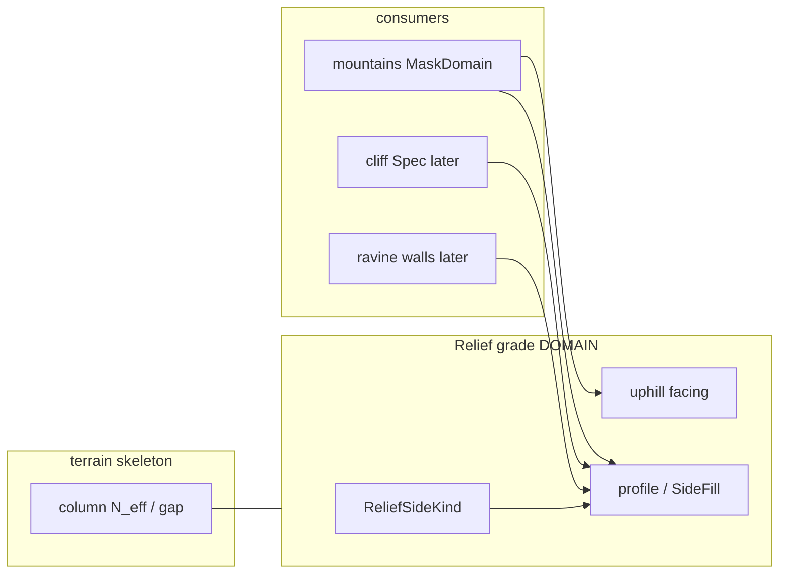

> **Статус:** ownership **утверждён** (2026-07-27) · **Impl extract:** ⬜ (код ещё под `mountains/`; target — shared relief).  
> **Связь:** дополняет [`tz_terrain_generation.md`](./tz_terrain_generation.md) (column / `N_eff` / gap); **не** MaskDomain `mountains` SoT.

# Terrain relief grade (домен)

## Назначение

Домен **рельефной грани** (grade): проходимый склон vs отвес + направление подъёма.

Нужен всем, кто пишет **высотный перепад между соседями / по стороне footprint**: горы, later cliff Spec, ravine walls, любые graded faces.  
**Не** landcover и **не** topology хребтов.

| Владеет | Не владеет |
|---|---|
| `ReliefSideKind` (SLOPE \| SHEER) | `system_terrain` biome keys (`mountain`, `plains`, `ravine`, …) |
| profile(t) → `side_fraction` | FormGeometry / FormRaster footprint горы |
| uphill **facing** (cardinal chain) | PassBuilder / MST / saddles |
| контракт mid-band ↔ grade | paint merge rank MaskDomain |

---

## Утверждено (2026-07-27)

| # | Решение |
|---|---|
| R1 | Relief grade — **отдельный домен** terrain; SoT **не** в MaskDomain `mountains` |
| R2 | `SLOPE` = проходимый grade (mid-band / smooth profile); `SHEER` = отвес (step profile) |
| R3 | Uphill **facing** — тот же смысл, что `system_facing` у лестниц ([`tz_locations.md`](./tz_locations.md) § staircase chain): куда «вверх» |
| R4 | **Запрещено** `system_terrain=slope` как biome; slope ≠ ravine/mountain landcover |
| R5 | Горы / range SideFill / later cliff — только **consumers** shared API |
| R6 | Shipped `MountainSideKind` / `fill_*_side` в `generators/terrain/mountains/` — **адаптер**; target: вынести в relief module |
| R7 | Column gap / `N_eff` / thin-span diagnostics — [`tz_terrain_generation.md`](./tz_terrain_generation.md); grade объясняет *проходимость*, skeleton — *объём колонки* |
| R8 | **Логирование решений:** каждый bake Spec / sampled cell — *почему* SLOPE vs SHEER и *какой* uphill facing (или `facing=none` на SHEER); см. § Logging |

---

## Logging (обязательный контракт диагностики)

Цель: в логах bake видно **причину**, а не только итог.

| Уровень | Что писать |
|---|---|
| **INFO** (per Spec / range) | `sides`: index→kind; source (declare / default SLOPE); sheer_band; identity Spec |
| **DEBUG** (sample cells) | `kind`, `sector`, `t`, `fraction`, **`reason`**, **`facing`** (cardinal uphill) или `facing=none` если SHEER |
| **Запрещено** | silent SideFill без reason на DEBUG при диагностике рельефа |

```text
# пример DEBUG
relief_grade_cell | kind=SLOPE sector=2 t=0.41 frac=0.62
  reason=nearest_sector side.kind=SLOPE profile=smoothstep
  facing=north  # uphill toward origin / higher grade
relief_grade_cell | kind=SHEER sector=0 t=0.97 frac=0.0
  reason=side.kind=SHEER dist_origin>=outer-band step→0
  facing=none
```

Facing v1 (пока не persist): **вывод** — uphill = к origin стороны / против градиента `t` (radial). Target persist = stair `system_facing`.

---

## Понятия

| Термин | Значение |
|---|---|
| **SLOPE** | Graded face: можно подняться вдоль facing |
| **SHEER** | Vertical face: grade-прохода нет (climb-only / blocked — gameplay later) |
| **Facing** | Cardinal uphill (к более высокому / к origin стороны); на углах цепь может ломаться, как у лестниц |
| **side_fraction** | `profile(kind, t) ∈ [0,1]` → вход KindElevation / column height |
| **t** | Нормированная дистанция вдоль outward стороны footprint |

```text
t(p) = clamp(dist_along_outward(p, sector) / sector_width, 0, 1)
side_fraction(p) = profile(kind, t(p))
# SLOPE: smooth falloff (default smoothstep)
# SHEER: step (1 if t < 1−ε else 0)
```

Defaults profile (пока совпадают с light-bake):  
SHEER `ε` = `sheer_band_light` (default 1 light cell); SLOPE = `smoothstep` (не power).

---

## Границы с другими доменами



| Домен | Роль относительно relief |
|---|---|
| [`tz_terrain_generation.md`](./tz_terrain_generation.md) | column fill, `N_eff`, gap; читает последствия grade |
| [`tz_map_light_bake.md`](./tz_map_light_bake.md) § Mountain | Form→Raster→**SideFill(relief)**→KindElevation→paint |
| [`tz_mountain_architecture.md`](./tz_mountain_architecture.md) | PassBuilder topology; **не** SideKind |
| [`tz_locations.md`](./tz_locations.md) | эталон facing-chain (stairs) |
| Hydrology / ravine MaskDomain | later: стены низин через тот же ReliefSideKind |

**Анти-паттерны**

- ❌ Новый `MountainSideKind` SoT, параллельный terrain kind  
- ❌ `system_terrain=slope`  
- ❌ Facing только «внутри горного paint» без общего контракта  
- ❌ PassBuilder / ridge noise как замена SideFill grade  

---

## Target layout (код — после явного impl)

```text
dataModel/terrain/relief/
  enums.py          # ReliefSideKind
  specs.py          # ReliefSideSpec { kind, sheer_band_*, … }
application/worldData/generators/terrain/relief/
  sideFill.py       # fill_slope_side / fill_sheer_side (shared)
  facing.py         # uphill facing from grade / chain

# mountains/ — тонкий shim:
#   MountainSideSpec.kind → ReliefSideKind
#   import relief.sideFill
```

Wire на FineTerrain / cell (facing persist) — отдельный gate после SoT ownership; v1 может **выводить** facing из Δz соседей, target — хранить как stair `system_facing`.

---

## Consumers (контракт)

```text
# любой consumer footprint + sides:
for side in sides:
  fractions |= fill_side(sector, cells, side.kind)   # relief API
# optional: stamp uphill facing on graded cells
→ domain paint (system_terrain / materials) — вне relief
```

Mountain Spec `sides[]` остаётся на горе (какие грани какого kind), но **алгоритм kind** — relief.

---

## Связанные документы

| Документ | Связь |
|---|---|
| [`tz_terrain_generation.md`](./tz_terrain_generation.md) | skeleton column; pointer на этот домен |
| [`tz_map_light_bake.md`](./tz_map_light_bake.md) | SideFill usage в mountain plugin |
| [`tz_mountain_architecture.md`](./tz_mountain_architecture.md) | topology only |
| [`tz_locations.md`](./tz_locations.md) | facing / staircase analogy |
| [`tz_terrain_hydrology.md`](./tz_terrain_hydrology.md) | образец «отдельный домен» рядом с skeleton |

---

## История

| Дата | Изменение |
|---|---|
| 2026-07-27 | R8 + § Logging: reason SLOPE/SHEER + facing в bake logs |
| 2026-07-27 | Домен вынесен: SoT SLOPE/SHEER/facing; mountains = consumer; shipped mountain SideFill = адаптер |
