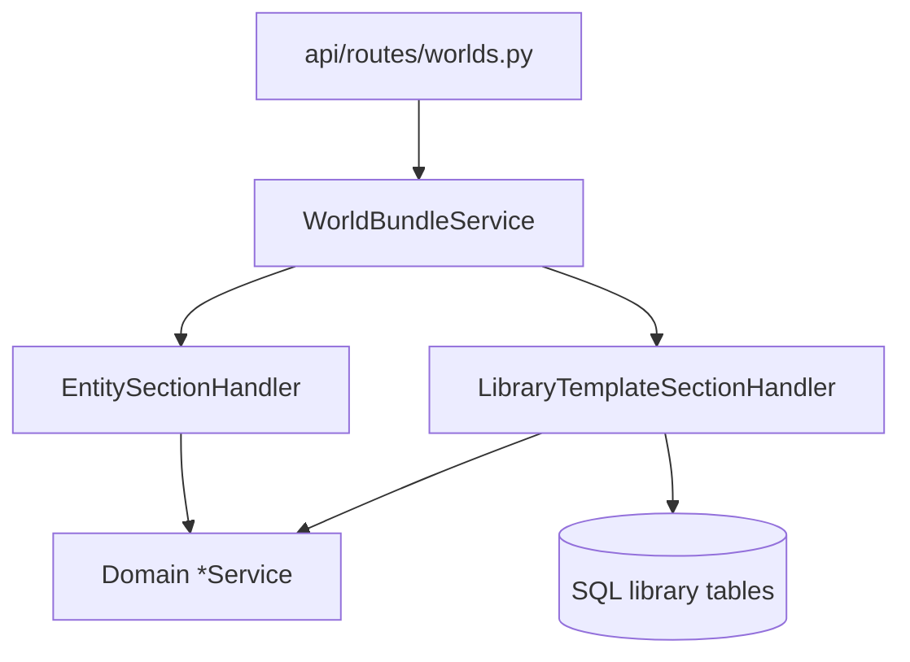

> **Статус:** **Implemented** (2026-07-30) — handlers facade + library race/perk/building/relief. Domains confirmed; Q1–Q3 locked below. Local DB: **recreate** after `0001_initial.sql` change.  
> **Уровни импорта (registry / skeleton) и Pack:** [`tz_world_pack_storage.md`](./tz_world_pack_storage.md) § WP-24.  
> **Ключи секций:** `dataModel/worldBundle/bundleSections.py` (`BundleSection`).  
> **Remap:** BUNDLE-1 — `bundleRemapService.py`.  
> **Relief R35:** [`tz_terrain_relief.md`](./tz_terrain_relief.md).  
> **Building templates:** [`tz_building_generator.md`](./tz_building_generator.md) §5–6.  
> **Smell:** [`tz_generator_technical_debt.md`](./tz_generator_technical_debt.md) § BUNDLE-2.  
> **План имплементации (после утверждения):** [`.cursor/plans/bundle-2-section-handlers.md`](../.cursor/plans/bundle-2-section-handlers.md).

## Назначение

Целевая **оркестрация** world JSON bundle (не Pack):

- один HTTP facade;
- тонкий `WorldBundleService` (validate → normalize → remap → transaction → порядок);
- секции = handlers двух родов (entity / library-template);
- **self-contained skeleton** возит pointers в `world` + **тела** всех library-backed шаблонов top-level секциями.

**Не slice:** не проектируем «сначала только то, что уже в коде». Каркас handlers и allowlist описывают **полный** целевой skeleton; имплементация идёт **слоями архитектуры** (errors → protocol → kinds → все handlers), не «v1 без building_templates».

**Вне scope:** Pack zip/bake; PC/NPC/starter_characters; RELIEF-BAR-1 materialize cells; DAG; interior map blobs.

---

## Критерий: library vs entity

| Kind | Смысл | Примеры |
|---|---|---|
| **Library-template** | Переиспользуемое определение мастера; одно тело → много миров через pointer | race, building, relief (и аналоги) |
| **Entity** | Экземпляр **этого** мира: граф, география, политика | locations, connections, states |

**Правило:** если контент = «шаблон/контракт, который мастер авторствует и подключает к миру» — это **library**, даже если сегодня лежит world-scoped таблицей. Разницы с building templates по продукту нет.

---

## Целевые домены (skeleton)

### A. Entity-секции (экземпляры **этого** мира)

| # | Ключ | Домен | Persist |
|---|---|---|---|
| 1 | `world` | World row + **pointer/scalar** registries (в т.ч. `*_template_registry`) | `worlds` |
| 2 | `states` | государства (политика/территория мира) | `states` |
| 3 | `locations` | named locations — **граф мест мира** | `named_locations` |
| 4 | `connection_nodes` | узлы графа | connection nodes |
| 5 | `connection_edges` | рёбра графа | connection edges |

**Locations = entity (утверждено мастером):** не «шаблон места», а узлы пространства мира (parent, coords, типы). См. § Location transfer.

### Location transfer (между мирами) — не library

**Сценарий:** мастер хочет взять локацию (или поддерево) из мира A в мир B.

Локация — **экземпляр**: `location_uid`, parent, якорь, тип; часто связанные `connection_nodes` / `connection_edges`, иногда pack pins. Это **не** pointer в library (в отличие от race/perk/building/relief).

| Вариант | Суть | Статус в архитектуре |
|---|---|---|
| **A — Subgraph import** | Export выбранных `locations[]` (+ нужные `connection_*`) из A → import в B с **remap UID** (тот же механизм, что BUNDLE-1 при дубликате мира) | **Целевой способ** переноса экземпляра; отдельная операция/API later, не смешивать с library-секциями |
| **B — Location template** | Мастер сохраняет *тип/чертёж* места в library; в мире создаётся **новый** instance | Только если появится отдельный продукт `location_templates` — новый library-ключ по WB-2; **не** текущий `named_locations` |
| **C — Clone / merge мира** | Большой кусок или весь skeleton | Редко; тяжёлый path |

**Инварианты:**

- ❌ Не делать все `named_locations` library «чтобы шарить между мирами» — смешивает шаблон и конкретный город с детьми/дорогами.  
- ✅ Перенос конкретного места = **A** (subgraph + remap).  
- ✅ Повторное *размещение типа* места = **B** (будущий library-домен), не clone uid из другого мира.  
- Pack/L0–L2 клетки локации — не в JSON bundle; после subgraph import может понадобиться rebake / pack attach (вне этого ТЗ).

**WB-15** этим не отменяется: locations в skeleton bundle остаются entity-секцией; transfer — оркестрация копирования подграфа, не `LibraryTemplateSectionHandler`.

### B. Library-template секции (G4-паттерн)

Тела **не** в `world.*_registry` и **не** как world-scoped full rows.  
Registry на world = pointers; top-level секция = полные тела → upsert **глобальной** SQL library + sync pointers.

Цель — **простой перенос определений между мирами**: один раз библиотека, в мире только pointers (+ тела в self-contained bundle).

| # | Ключ (цель) | Library SQL (цель) | World pointer registry | Product SoT / gap |
|---|---|---|---|---|
| 6 | `relief_templates` | `relief_templates` | `relief_template_registry` | R35 ✅ wire уже есть |
| 7 | `building_templates` | `building_templates` | `building_template_registry` | [`tz_building_generator.md`](./tz_building_generator.md) §5–6; bundle section ⬜ |
| 8 | `race_templates` | global race library (**без** `world_uid` на теле) | `race_template_registry` | [`tz_races.md`](./tz_races.md): сегодня world-scoped `races` + `races[]` — **мигрировать** |
| 9 | `perk_templates` | global perk library | `perk_template_registry` | сегодня world-scoped perks + section `perks` — **мигрировать** (WB-14); удобный import между мирами |

```text
# ✅ self-contained skeleton (цель)
world:
  race_template_registry:     [ { system_template_uid, display_… } ]
  perk_template_registry:     [ … ]
  building_template_registry: [ … ]
  relief_template_registry:   [ … ]
race_templates:     [ { full contract… }, … ]
perk_templates:     [ { full perk… }, … ]
building_templates: [ … ]
relief_templates:   [ … ]

# ❌ world-scoped full rows races/perks как «entity секции»
# ❌ тела внутри world registry JSON
# ❌ в bundle одни pointers без секции bodies
```

**Wire rename (канон):** `race_templates`, `perk_templates` (симметрия с `building_templates` / `relief_templates`). Legacy `races` / `perks` — только optional transitional alias; в чистой архитектуре один канон.

### C. Пока не library-секции

| Данные | Почему |
|---|---|
| `barrier_template_registry` | Inline bodies на world; optional global barrier library = отдельный epic |
| `district_template_registry` и прочие inline N+1 | Нет SQL library 1:1 |
| `map_cells` | Reject → Pack |
| **locations** | Entity (утверждено); не library |

---

## Races / perks: gap сейчас → цель

Одинаковый G4-переход (перенос определений между мирами без копипасты entity-строк):

| | Сейчас | Цель (library) |
|---|---|---|
| Races body | `races` + `world_uid` | global race library |
| Perks body | `world_perks` + `world_uid` | global perk library |
| Привязка к миру | факт строки | `race_template_registry` / `perk_template_registry` на world |
| Bundle | `races` / `perks` full rows | `race_templates` / `perk_templates` bodies + pointers в `world` |
| Handler | EntitySection | `LibraryTemplateSectionHandler` instances |
| Character refs | `character_perks.perk_uid` → world_perks | ref → library uid (или world pointer uid = library uid); sync schema + character TZ при impl |

BUNDLE-2 **не** целевая, пока races/perks остаются entity «потому что так в коде».

---

## Два рода handlers (единый protocol)

```text
IBundleSectionHandler
  key: str
  async export_section(world_uid, *, world=None) -> Any | None
  async import_section(world_uid, data) -> ImportResult
```

| Kind | Примеры | Контракт |
|---|---|---|
| **EntitySectionHandler** | locations, connection_*, states | list/dict rows ↔ domain `*Service`; preprocess (topo_sort) **внутри** handler |
| **LibraryTemplateSectionHandler** | relief, building, race, **perk** | export: pointers → bodies (miss → WARNING); import: upsert library + sync/validate world registry |

Один каркас library-handler, **N instance** (relief / building / race / perk); не копипаста секций.



---

## Решения (draft)

| ID | Решение |
|---|---|
| **WB-1** | Section handlers (вариант A). Отдельные HTTP `*BundleService` на домен — антипаттерн. |
| **WB-2** | Ключ секции только через `BundleSection` + allowlist level + handler + remap spec при необходимости. |
| **WB-3** | Facade без `fastapi` / `HTTPException`; domain errors → route. |
| **WB-4** | `ImportResult` SoT = `application/importResult.py`. |
| **WB-5** | Одна transaction на весь import. |
| **WB-6** | Один ordered registry на export и import. |
| **WB-7** | Preprocess только внутри handler. |
| **WB-8** | Connections = два ключа / два handler’а (nodes → edges). |
| **WB-9** | Library domains = один kind; relief / building / race / **perk** — равноправные instance. |
| **WB-10** | `map_cells` → domain reject. |
| **WB-11** | Skeleton include все library-секции: `relief_templates`, `building_templates`, `race_templates`, `perk_templates`. |
| **WB-12** | Имплементация по **слоям**, не slice. |
| **WB-13** | **Races = library** — global library + pointer registry + `race_templates`; sync [`tz_races.md`](./tz_races.md) + schema. |
| **WB-14** | **Perks = library** (тот же мотив: import между мирами) — global library + `perk_template_registry` + `perk_templates`; sync perk/character schema. |
| **WB-15** | **Locations = entity** (граф мира). Не library. Перенос между мирами = subgraph import + remap (§ Location transfer), не pointer registry. |

---

## Порядок секций (цель)

| # | Key | Kind |
|---|---|---|
| 1 | `world` | entity (обязателен) |
| 2 | `states` | entity |
| 3 | `locations` | entity (+ topo_sort) |
| 4 | `connection_nodes` | entity |
| 5 | `connection_edges` | entity |
| 6 | `relief_templates` | library |
| 7 | `building_templates` | library |
| 8 | `race_templates` | library |
| 9 | `perk_templates` | library |

`registry` level: только `#1`.  
`skeleton` level: полный список выше.

Library после `world`. Порядок library: relief → building → race → perk.

---

## Слои

| Слой | Делает | Не делает |
|---|---|---|
| Route | upload → dict; HTTP map | upsert, library IO |
| `WorldBundleService` | level, normalize, remap, tx, loop | знать SQL library / topo_sort |
| Handlers | одна секция | своя transaction; чужие секции |
| Domain / library services | CRUD | HTTP; полный bundle |

---

## Размещение классов и модулей (цель)

Корень orchestration: `backend/app/application/worldData/bundle/`.  
Domain CRUD остаётся в существующих `*Service` / library services рядом с `worldData/` (не переносить в `bundle/`).

```text
application/worldData/
  worldBundleService.py          # facade only (WB-3)
  bundleRemapService.py          # BUNDLE-1 — без изменений контракта
  bundle/
    __init__.py
    errors.py                    # BundleValidationError (+ optional aliases)
    handler.py                   # Protocol IBundleSectionHandler
    order.py                     # BUNDLE_IMPORT_ORDER: tuple[str, ...]
    registry.py                  # build_bundle_handlers(deps) -> list[IBundleSectionHandler]
    entity/
      worldSection.py            # WorldSectionHandler
      statesSection.py           # StatesSectionHandler
      locationsSection.py        # LocationsSectionHandler (topo_sort inside)
      connectionNodesSection.py  # ConnectionNodesSectionHandler
      connectionEdgesSection.py  # ConnectionEdgesSectionHandler
    library/
      libraryTemplateSection.py  # LibraryTemplateSectionHandler (shared kind)
      adapters.py                # LibrarySectionAdapter / dataclasses wiring
                                 #   ReliefAdapter, BuildingAdapter, RaceAdapter, PerkAdapter
  # existing domain (handlers delegate here — не дублировать CRUD)
  reliefTemplateLibraryService.py
  reliefWorldImportService.py
  bundle/reliefSection.py        # → thin helpers или absorb into ReliefAdapter (не второй engine)
  # target (new or evolve from world-scoped):
  # raceTemplateLibraryService.py / perkTemplateLibraryService.py / building* library+import
  worldService.py
  stateService.py
  namedLocationService.py
  connectionGraphService.py

dataModel/worldBundle/
  bundleSections.py              # BundleSection keys + SKELETON/REGISTRY allowlists

api/routes/worlds.py             # HTTP map only

core/container.py                # wires deps → build_bundle_handlers → WorldBundleService
```

### Классы (контракт)

| Класс / символ | Файл | Роль |
|---|---|---|
| `BundleValidationError` | `bundle/errors.py` | domain error; route → 422 |
| `IBundleSectionHandler` | `bundle/handler.py` | Protocol: `key`, `export_section`, `import_section` |
| `BUNDLE_IMPORT_ORDER` | `bundle/order.py` | канон порядка ключей |
| `build_bundle_handlers` | `bundle/registry.py` | фабрика ordered list |
| `WorldSectionHandler` … | `bundle/entity/*.py` | entity kind |
| `LibraryTemplateSectionHandler` | `bundle/library/libraryTemplateSection.py` | один kind, N adapters |
| `LibrarySectionAdapter` | `bundle/library/adapters.py` | `section_key`, `list_registry_uids(world)`, `load_body(uid)`, `upsert_bodies(world_uid, bodies) → ImportResult` |
| `WorldBundleService` | `worldBundleService.py` | validate → normalize → remap → tx → `for h in handlers` |

### Wiring (Container)

```text
Container.world_bundle_service()
  handlers = build_bundle_handlers(
      world_service=…,
      state_service=…,
      location_service=…,
      connection_graph_service=…,
      relief_library=…, relief_import=…,
      building_library=…, building_import=…,   # target
      race_library=…, race_import=…,           # target
      perk_library=…, perk_import=…,           # target
  )
  return WorldBundleService(db=…, world_service=…, handlers=handlers)
```

Facade **не** держит 8–10 domain services для inline `if section` — только deps, нужные для normalize/remap/tx + `handlers`.

### Запрещено класть сюда

| Путь | Почему |
|---|---|
| `generators/**` | не bundle orchestration |
| `api/routes/*Bundle*.py` per domain | антипаттерн WB-1 |
| Толстый CRUD внутри `bundle/entity|library` | только delegate в `*Service` |
| Второй `ImportResult` в `api.schemas` как SoT | WB-4 |

---

## Domain errors

| Ошибка | Route |
|---|---|
| `BundleValidationError` | 422 |
| `ImportValidationError` | 422 |
| Library-template domain errors (relief/building/race/perk) | 422 |
| failed `ImportResult` counts | rollback + 207 как сейчас |

---

## Gap сейчас → цель

| | Сейчас | Цель |
|---|---|---|
| Orchestration | inline if/dict + HTTP | handlers loop, no HTTP |
| `relief_templates` | section + functions ✅ | library handler instance |
| `building_templates` | SQL library + world registry; bundle section ⬜ | skeleton key + library handler |
| `races` / `perks` | world-scoped full rows | `race_templates` / `perk_templates` + pointer registries |
| `locations` | entity ✅ | остаётся entity (WB-15) |
| Barriers | inline на world | без изменений (C) |

---

## Антипаттерны

- ❌ Считать races/perks entity «потому что таблица с world_uid»  
- ❌ Тащить locations в library без продукта location-templates  

- ❌ Slice без `building_templates` / `race_templates` как целевая архитектура  
- ❌ Тела library-доменов только pointers в bundle  
- ❌ Полные bodies внутри world `*_registry`  
- ❌ Отдельный HTTP на домен вместо section  
- ❌ Transaction в handler; FastAPI в application  
- ❌ Handlers в generators  

---

## Done when (после утверждения + impl)

1. `BundleSection.SKELETON` включает `relief_templates`, `building_templates`, `race_templates`, `perk_templates`.  
2. Races + perks: global libraries + pointer registries + library handlers (TZ + schema sync).  
3. Locations остаются entity.  
4. Facade = loop; нет FastAPI.  
5. Один library kind, N instances; self-contained round-trip.  
6. HY-S-2 закрыт; BUNDLE-2 → resolved.

---

## Locked answers (Q1–Q3) — для impl

| # | Решение |
|---|---|
| Q1 | **Breaking rename only:** `races`→`race_templates`, `perks`→`perk_templates`. No legacy alias in allowlist. |
| Q2 | World registries: `race_template_registry`, `perk_template_registry` (list pointer entries, как relief). |
| Q3 | `character_perks.perk_uid` → FK на **global** `perk_templates.template_uid` (library uid напрямую). |

---

## Changelog

| Дата | Изменение |
|---|---|
| 2026-07-30 | § Размещение классов и модулей: bundle/ tree, handler/adapter classes, Container wiring |
| 2026-07-30 | § Location transfer: subgraph import (A) vs future location_templates (B); WB-15 уточнён |
| 2026-07-30 | Master confirm: perks library + locations entity (WB-14/15) |
| 2026-07-30 | Draft v4: **perks → library** (WB-14); locations = entity (WB-15) |
| 2026-07-30 | Draft v3: races → library (WB-13) |
| 2026-07-30 | Draft v2: building_templates; anti-slice |
| 2026-07-30 | Draft v1: superseded |
