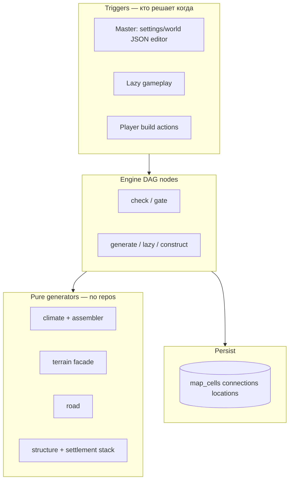
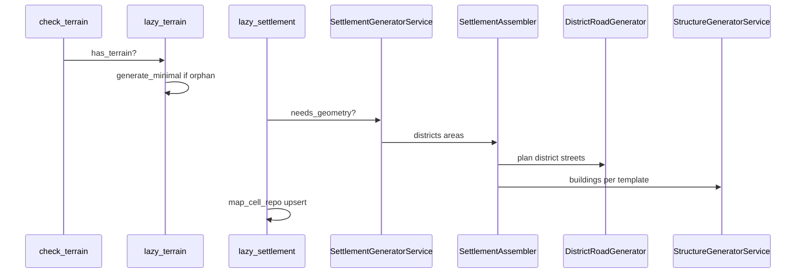

> **Статус документа:** **черновик — не утверждён.** Карта нод, trigger paths (master / lazy / player), player build и interim→target миграция — рабочая спека до ревью; не является обязательным контрактом для реализации.

## Назначение

Отдельное ТЗ на **стык** `worldData/generators/` и **engine DAG**.

| Документ | О чём |
|---|---|
| **Этот TZ** | Какие generator-модули существуют, **какие ноды** их вызывают, **когда** (master / lazy / player) |
| [`tz_engine_flow.md`](./tz_engine_flow.md) | Pass loop, repair, PatchApplier — **механика движка** |
| [`tz_engine_node_context.md`](./tz_engine_node_context.md) | `TerrainContext`, `StructureContext` — типизированный state |
| Domain TZ | climate, terrain, building, city, roads, connections |

**Не цель:** дублировать алгоритмы pole/tier, layout комнат, gridLayout дорог — см. domain TZ.

---

## Принцип: Generator library + DAG callers



**Инварианты:**

1. **Generator** — pure: `(World, …) → cells / layout / graph`. Без async, без SQL, без `ExecutionState`.
2. **Node** — routing, repos, `pending_patches`, **когда** вызывать какой модуль.
3. **Один generator — много callers:** master eager, lazy first visit, player construction — **разные ноды**, один `StructureGeneratorService.generate_from_template`.
4. **Не Dwarf Fortress:** игрок не designation'ит tile; действие → **node** → **кусок generator API** → patch.

---

## Модули генераторов (4 домена)

```
app/application/worldData/generators/
  climate/ + assemblers/climateAssembler/     ← surface field, recalc, runtime weather
  terrain/                                    ← two-phase skeleton, ores/caves stubs
    terrainGeneratorService.py
    passes/surfacePass.py, gapAnalysisPass.py, columnFillPass.py
  road/                                       ← district road graph, layouts, width policy
  structure/                                  ← interior box from template
  assemblers/settlementAssembler/             ← city skeleton → district → area → structure
  assemblers/districtAssembler/               ← district + DistrictRoadGenerator
```

| Домен | Generator entry | Выход | Domain TZ |
|---|---|---|---|
| **Climate** | `ClimateOrchestratorService`, `ClimateRuntimeAssembler` | surface `temperature_base`, `rainfall`; runtime `WeatherSnapshot` | [`tz_climate.md`](./tz_climate.md) |
| **Terrain** | `TerrainGeneratorService` | multi-pass skeleton ✅ impl | [`tz_terrain_generation.md`](./tz_terrain_generation.md) |
| **Road** | `DistrictRoadGenerator`, layouts | `ConnectionNode` / `ConnectionEdge` graph | [`tz_structure_connections.md`](./tz_structure_connections.md), [`tz_city_generation.md`](./tz_city_generation.md) |
| **Structure** | `StructureGeneratorService`, `StructureAreaAssembler`, … | `StructureLayout` (cells, levels, passages, rooms) | [`tz_building_generator.md`](./tz_building_generator.md), [`tz_assembler_hierarchy.md`](./tz_assembler_hierarchy.md) |
| **Settlement** | `SettlementGeneratorService` → `SettlementAssembler` | occupancy + full city geometry (roads inside stack) | [`tz_city_generation.md`](./tz_city_generation.md) |

**Road** — отдельный пакет, не подмножество `structure/`. Settlement **компонует** road + area + building.

---

## Три trigger-path (кто вызывает DAG)

| Path | Когда | Типичные ноды / entry | Persist |
|---|---|---|---|
| **Master** | JSON-редактор **настроек мира**; import bundle | world generation nodes (target) | bulk upsert / chunked |
| **Player** | выбор мира → сессия | lazy + materialization DAG | upsert по мере входа |
| **Lazy gameplay** | Первый вход в локацию без geometry | `check_terrain` → `lazy_terrain` → `lazy_settlement` | `map_cell_repo` insert/upsert |
| **Player build** | Intent «построить», blueprint, repair | **planned:** `place_building`, `construct_building`, `excavate`, `connect_road` | patches после post_llm |

Master и player используют **те же** generator functions, что lazy — отличается только **graph нод** и preconditions.

---

## Карта нод ↔ generators

### Реализовано (engine)

| id | phase | deps | Generator / service | Persist |
|---|---|---|---|---|
| `check_terrain` | pre_llm | `check_scene` | repos only | — |
| `eager_terrain` | pre_llm | `check_terrain` | load cells | — |
| `lazy_terrain` | pre_llm | `check_terrain` | `TerrainGeneratorService.generate_minimal` | insert cells |
| `lazy_settlement` | pre_llm | `check_terrain`, `lazy_terrain` | `SettlementGeneratorService.generate_and_collect` | upsert cells + connections |
| `terrain_context` | pre_llm | terrain chain | aggregate → `TerrainContext` | — |
| `terrain_summary` | pre_llm | … | read-only для LLM payload | — |

**Lazy settlement chain** (gameplay vertical slice):



### Debug API (`map.py`) — оставить, не product path

Точечное тестирование passes без полного DAG: `debug_settlement.py`, curl, ручной regen. **Не** вызывается из frontend / player flow.

| Endpoint | Generator / persist | Production caller (DAG) |
|---|---|---|
| `POST …/map/generate-surface` | `TerrainGeneratorService` + `save_terrain_batch` | `generate_surface` node ⬜ |
| `POST …/map/generate-ores` | `generate_ores` + `save_pass` | ores pass node ⬜ |
| `POST …/map/generate-caves` | `generate_caves` + `save_pass` | caves pass node ⬜ |
| `POST …/map/generate-climate` | `apply_climate_pass` + `save_pass` | `generate_climate` node ✅ |
| `POST …/map/generate-z-slice` | `generate_z_slice` + `save_pass` | lazy / volume node ⬜ |

CRUD (`GET/POST/DELETE …/map`) — import/export для мастера и debug; отдельно от очереди materialization.

### Запланировано (контракт нод)

#### Climate ([`tz_climate.md`](./tz_climate.md) § три процесса)

| id | phase | Generator | Trigger |
|---|---|---|---|
| `generate_climate` | post_llm | `apply_climate_pass` | ✅ impl |
| `recalculate_climate` | post_llm | `recalculate(ClimateRecalcRequest)` | master patch; routing `ClimateChangeEvent` → request **в ноде** |
| `resolve_weather` | pre_llm | `ClimateRuntimeAssembler.resolve_weather` | scene / tick |

#### Settlement / world (master)

| id | phase | Generator | Trigger |
|---|---|---|---|
| `generate_settlement_skeleton` | post_llm | `SettlementGeneratorService.plan_occupancy_only` | world create phase 1 |
| `generate_settlement_geometry` | post_llm | full `SettlementAssembler` | explicit regen (не lazy) |

#### Structure — процедура + игрок

| id | phase | Generator | Trigger |
|---|---|---|---|
| `generate_building` | post_llm | `StructureGeneratorService` + `StructureAssembler` | lazy area slot / editor |
| `place_building` | pre_llm / llm | validation footprint, template ref | player intent |
| `construct_building` | post_llm | same `generate_from_template`; `under_construction` gate | player action complete |
| `repair_building` | post_llm | partial regen / patch nodes | `under_repair` |

Игрок **не** получает отдельный «DF dig generator» — только nodes, которые дергают **существующие** API (`generate_from_template`, `foundationBuilder`, road layout helpers).

#### Road — отдельно от structure cell pass

| id | phase | Generator | Trigger |
|---|---|---|---|
| `plan_district_roads` | internal to settlement | `DistrictRoadGenerator` | district assemble (уже в stack) |
| `connect_road` | post_llm | road layout + `ConnectionEdge` patch | player / master extend graph |
| `repair_road` | post_llm | edge condition update | gameplay |

#### Volume climate (после settlement / terrain)

| id | phase | Generator | Trigger |
|---|---|---|---|
| `resolve_volume_climate` | post_llm | `resolve_volume_climate(VolumeClimateContext)` ⬜ | tunnels (A), hive z-band (B), co-located (C) |

См. [`tz_climate.md`](./tz_climate.md) § Surface vs volume — **после** placement, не в `full_surface` pole pass.

---

## Settlement stack в DAG (как сходятся road + structure)

Один вызов `lazy_settlement` / `generate_settlement_geometry` оркестрирует **внутри** assembler hierarchy — **не** отдельные DAG-ноды на каждый слой в v1:

```
SettlementAssembler
  → DistrictAssembler
       → DistrictRoadGenerator     ← road/
       → StructureAreaAssembler
            → StructureAssembler
                 → StructureGeneratorService   ← structure/
```

**Правило v1:** road + building geometry для города — **одна post-нода** (lazy или master), unless partial regen TZ появится позже.

**Правило v2 (player):** отдельные ноды могут вызывать **узкие** функции road/structure (новый участок улицы, одно здание по template) без полного `SettlementAssembler`.

---

## Player build vs procedural (общая модель)

| Шаг | Node responsibility | Generator chunk |
|---|---|---|
| 1 Gate | template exists? footprint free? tier/materials? | read registries |
| 2 Plan | LLM or fixed blueprint → `template_uid`, anchor, facing | — |
| 3 Generate | `under_construction=true` skip interior or scaffold-only | `StructureGeneratorService` / road layout |
| 4 Commit | post_llm patch | same cells as lazy path |
| 5 Complete | clear `under_construction` | optional regen interior pass |

[`tz_building_generator.md`](./tz_building_generator.md) §14 — флаги `under_construction` / `under_repair`.  
Excavation — **отдельная node** + material `hardness` ([`tz_materials.md`](./tz_materials.md)), не climate lapse.

---

## Coordinate spaces (граница нод)

| Space | Generators | DAG note |
|---|---|---|
| `WORLD_SURFACE_GRID` | climate eager, wilderness terrain | `generate_climate` |
| `WORLD_LOCAL_METERS` | settlement streets, building geometry after translate | `lazy_settlement`, player build |
| Interior 1m | `StructureGeneratorService` | never run `CellWeatherPass` on interior |

Ноды обязаны передавать в generator **правильный space** — см. [`tz_terrain_generation.md`](./tz_terrain_generation.md) § coordinate spaces.

---

## Domain contexts (ExecutionState)

Ноды домена пишут в типизированные поля, не в произвольный dict:

| Context | Writers | Readers |
|---|---|---|
| `TerrainContext` | `check_terrain`, `lazy_terrain`, `terrain_context` | movement, scene, LLM payload |
| `StructureContext` | structure/settlement nodes ⬜ | narration, build validation |

Детали: [`tz_engine_node_context.md`](./tz_engine_node_context.md).

---

## Приоритет реализации нод

| P | Ноды | Зависимость |
|---|---|---|
| **done** | `check_terrain`, `lazy_terrain`, `lazy_settlement` | vertical slice gameplay |
| **P1** | `generate_climate`, `recalculate_climate`, `resolve_weather` | climate generator impl |
| **P2** | `generate_building`, `place_building`, `construct_building` | player build TZ economy |
| **P3** | `connect_road`, `resolve_volume_climate` | roads player + hive/tunnels |

Generator-side work **может** опережать ноды (как climate eager без `generate_climate`). Ноды — **последняя очередь** регистрации, не последняя в разработке алгоритмов.

---

## Связанные документы

- [`tz_climate.md`](./tz_climate.md) — три процесса, `ClimateRecalcRequest`, volume A/B/C
- [`tz_terrain_generation.md`](./tz_terrain_generation.md) — multi-pass terrain skeleton ✅; world generation pass order
- [`tz_assembler_hierarchy.md`](./tz_assembler_hierarchy.md) — settlement → structure layers
- [`tz_building_generator.md`](./tz_building_generator.md) — templates, construction flags
- [`tz_city_generation.md`](./tz_city_generation.md) — skeleton vs lazy phase 2
- [`tz_structure_connections.md`](./tz_structure_connections.md) — ConnectionNode graph
- [`tz_engine_flow.md`](./tz_engine_flow.md) — engine phases only
- [`tz_generator_technical_debt.md`](./tz_generator_technical_debt.md) — MR/LC/FM smells

---

## Changelog

| Дата | Изменение |
|---|---|
| 2026-06 | v1 — generator library pattern; 4 domains; node map; player build model; debug `map.py` harness vs DAG production (**черновик, не утверждён**) |
