> **План имплементации агента:** [`.cursor/plans/world-data-storage-migration.md`](../.cursor/plans/world-data-storage-migration.md)

## Назначение

Зафиксировать **целевую архитектуру хранения** procedural мира и переход с монолитной таблицы `map_cells`.

**Цели продукта:**

| Цель | Метрика |
|---|---|
| Cold load сессии | **≤ 5 мин** (attach pack + DB; **не** ожидание L2) |
| **Первый ход игрока (WP-14)** | **≤ 30 s** от spawn (цель **≤ 15 s**); § **UX: время до gameplay** |
| Bake light world map + скелеты локаций | **≤ 2 мин** на типичном мире |
| Offline full bake | допустим часы; **только** master/CI, не gameplay |
| Детализация при приближении | chunk lazy от точки входа; **фон**, без блокировки чата |

### UX: время до gameplay (непереговорно)

**Текстовая RPG:** игрок пришёл **играть**, а не ждать materialize мира. Держать его **20–30 минут** (или даже **5+ минут**) на blocking генерации — **непростительно** и **запрещено** в gameplay path.

| Фаза | Допустимое ожидание UI | Запрещено |
|---|---|---|
| Cold load сессии | ≤ 5 min | decode всех L2 tiles; wilderness INSERT |
| **Старт / spawn → первый ответ LLM** | **≤ 30 s** (p95); цель ≤ 15 s | blocking refine **целого** macro-tile |
| Переход macro-tile | **≤ 10 s** blocking (scene volume) | ждать полный соседний tile |
| Вход в локацию | **≤ 10 s** (scene + entry) | eager `SettlementLayout` всего города |
| Фон | не блокирует input | — |

**Пока L2 chunk не готов:** narration и механика опираются на **L0 + L1 + patches** (грубая геометрия); уточнение подгружается **без** остановки сессии.

**Единственный допустимый «долгий» путь:** offline `bake --mode tile|full` у мастера / в CI — **никогда** в hot path игрока.

**Антипаттерн (hard reject):** `ensure_tile(entire_tile)` blocking; bootstrap `materialize-stack` на gameplay spawn; любой UX «генерация мира… 45%» дольше **30 s** без возможности играть.

**Не в scope этого ТЗ:** world history / civ simulation (см. сравнение с DF в § «Почему медленно сейчас»); DAG wiring — [`tz_world_generation_dag.md`](./tz_world_generation_dag.md) § Gate.

### Обязательный переход (не опциональная оптимизация)

**Без миграции Pack + Patch Store цель load ≤ 5 min недостижима** — ни при каком LOD.

| Подход | Cold load | Почему |
|---|---|---|
| `map_cells` + TR-PERF (текущий interim) | **часы** | даже 1 tile = миллионы INSERT; attach БД ≠ быстрый старт |
| LOD «только меньше tiles», но persist в SQLite | **всё ещё долго** | L2 lazy tile = снова ~9M rows INSERT на tile |
| **World Pack + Patch Store** | **≤ 5 min** | mmap manifest + L0 ~1 MB; L2 по запросу в zstd, не OLTP |
| Pack + LOD bake | **≤ 5 min** старт + lazy L2 | **целевое состояние** |

**LOD** — стратегия *что* materialize на bake; **Pack** — *как* хранить и грузить. Оба входят в один переход; LOD без Pack не заменяет архитектуру.

**TR-PERF** (`executemany`, `chunks_per_commit`) — временный долг на legacy path; **не продлеваем** как основной путь после старта TR-PACK.

---

## Проблема текущей модели

Весь terrain skeleton (миллионы–миллиарды ячеек) пишется в OLTP `map_cells`:

| Проблема | Следствие |
|---|---|
| Fine grid 1 m × macro-tile 3000 m → **9M колонок/tile** | bootstrap 16 tiles ≈ **144M SQL rows** |
| ~20 колонок на row, большинство NULL | раздувание БД, медленный INSERT |
| Persist serial после generate | **~60%** времени — SQLite, не генератор |
| **Blocking eager tile** | **20–30 мин** до gameplay — **неприемлемо** для текстовой RPG (→ WP-14) |
| Climate per-cell upsert | второй полный проход по rows |
| Нет distributable артефакта | нельзя «скопировать мир» за минуты |

### Почему Dwarf Fortress быстрее на «географии»

| | DF worldgen | Наш `materialize-stack` (сейчас) |
|---|---|---|
| Разрешение карты мира | **~17k region cells** (Medium 129×129) — 2D поля | **144M+** fine columns (bootstrap) |
| 3D voxels на весь мир | **нет** — только при embark | eager fine skeleton |
| Хранение geography | in-memory heightmap → save | **SQLite INSERT** per cell |
| Долгий этап | **история** (симуляция лет) | **persist** (у нас истории нет) |

**Вывод:** узкое место — **масштаб materialization + SQLite**, не качество алгоритма рельефа. **Обязательный** выход — **World Pack + Patch Store**; LOD bake — часть того же перехода, не замена.

---

## Целевая архитектура: Pack + Patches

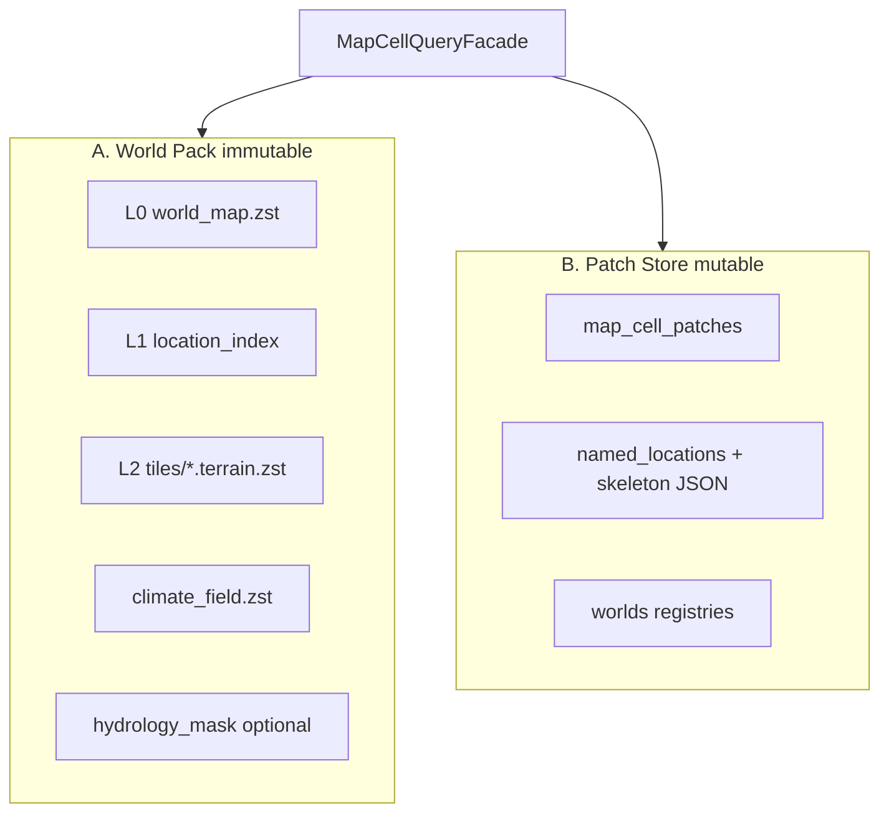

| Хранилище | Содержимое | Мутации |
|---|---|---|
| **World Pack** | L0–L2 skeleton, climate field, hydro mask | bake / version bump |
| **Patch Store** | structures, settlement layout, gameplay deltas, ore/cave lazy | каждый ход |
| **Derived** | tile LRU, merge view | RAM |

**Единая точка чтения:** `MapCellQueryFacade` → `merge_layers` (WP-20: patch → player scene → path → location → wilderness → L0).

### Инварианты

| ID | Правило |
|---|---|
| WP-1 | Generators **не** пишут в pack/SQLite — только typed layout на выходе pass |
| WP-2 | Persist skeleton — **только** `WorldPackWriter` на границе orchestrator |
| WP-3 | Persist gameplay — **только** `PatchStoreService` / `save_pass(layer_kind)` |
| WP-4 | Patch **>** pack на `(world_uid,x,y,z)`; `system_building_element IS NOT NULL` не затирается regen |
| WP-5 | Climate read: `field.sample(x,y)` + patch override |
| WP-6 | `world_snapshots` хранит `pack_content_hash` + patch revision, **не** дублирует L2 blob |
| WP-7 | Determinism: world + seed + pack_version → идентичный bake |

---

## Продуктовые идеи (утверждено)

Две связанные идеи задают LOD bake и отличают продукт от «eager fine grid на весь мир».

### Идея 1 — Light bake для корректной world map

**Формулировка:** на bake materialize **не** fine meter grid, а **light-карту per macro-tile** с низкой точностью — достаточной, чтобы **корректно отображать глобальную карту мира**.

**Что записываем per tile (`world_map.zst`):**

| Категория | Содержание | Точность |
|---|---|---|
| **Рельеф** | `surface_z` (уровень горы / высота) | light grid, см. `world_map_cells_per_tile` § WP-10 |
| **Гидрология** | `hydrology_role`, `hydrology_width` — где море, река, озеро, берег | те же light cells; declared polyline rasterize |
| **Локации** | pins + optional coarse footprint сёл/точек интереса | проекция L1 anchors на light grid |
| **Biome / climate** | `dominant_terrain_id`, `climate_zone_id` | для оттенка карты |

**Чего нет на Идее 1:**

- fine `map_cells` / meter grid;
- полный hydrology carve (русло в 1 m);
- `SettlementLayout`, district cells.

**Потребители:** world map UI (мастер и игрок), travel overview, far LLM context (L0 + L1), constraints для Идеи 2.

**Критерий успеха:** на карте видно *примерно* — где хребет, где протекает река, где стоит село/локация — **без** L2 и без часового bake.

### Идея 2 — Детализация как refine light bake

**Формулировка:** при приближении (вход в macro-tile, scene load) **не генерировать мир заново**, а **детализировать и рассчитывать** на основе уже записанного light bake — теми же passes (surface → hydrology → gap → column fill), что и сейчас, но с **L0 как входным чертежом**.

**Контракт refine:**

```
L2_tile = refine(
  L0_world_map_tile,      # elevation + hydro mask + pins
  declared_hydro,         # L1 / import bundle
  world_seed,
)
```

| Аспект | Поведение |
|---|---|
| Рельеф | upsample L0 `surface_z` → fine `SurfaceHeightmap` + детерминированный high-freq noise; **macro-форма** (хребты, долины) не меняется |
| Реки / море | `HydrologyGeneratorService` **в коридоре** L0 `hydrology_role`; fine bed уточняет, не смещает русло на карте |
| Детерминизм | тот же seed + тот же L0 → тот же L2 hash (WP-7) |
| Persist | L2 **chunks** в World Pack (`partial` → `complete` per tile), не SQLite wilderness |
| **Порядок** | **от точки входа** наружу (§ WP-13), не целый tile blocking |

**Связь идей:** Идея 1 — **чертёж**; Идея 2 — **исполнительная документация** в meter scale. World map и gameplay **согласованы** (WP-8).

**Антипаттерн (запрещено):** независимый `run_surface_pass` на fine grid без L0 → река на карте и в сцене в разных местах.

---

## LOD bake (утверждено)

Три уровня детализации. **Bake по умолчанию** — **Light bake (L0 per tile) + L1**; **L2 — refine** при приближении.

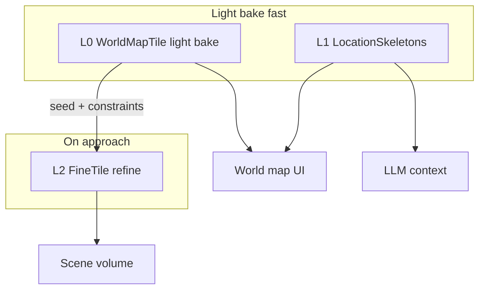

**Ключевой принцип:** см. § **Идея 1** + § **Идея 2** выше.

| Инвариант | Смысл |
|---|---|
| **WP-8** | L2 tile = `refine(L0_tile, world_seed, declared_hydro)` — реки/озёра/рельеф **согласованы** с world map |
| **WP-9** | Локации на world map: L1 anchors + optional coarse footprint; L0 хранит **pins**, не дублирует `NamedLocation` целиком |
| **WP-10** | `world_map_cells_per_tile = f(map_cell_size_m)` — больше tile → меньше subdivisions; manifest фиксирует resolved value |
| **WP-11** | L2 соседей — фон **по одному tile**; очередь **path-first** (heading + tile cross), не burst кольцом |
| **WP-12** | Восстановление refine: **chunk manifest + atomic chunk commit**; прерванный chunk — redo; tile `partial` \| `complete` |
| **WP-13** | L2 gameplay: **от точки входа**; blocking **только** scene volume; **никогда** blocking целого tile |
| **WP-14** | **Time-to-play:** spawn → playable ≤ **30 s** (p95); переход tile ≤ **10 s** blocking — hard product gate |
| **WP-15** | Прогресс: `worldMapLoading` + `localGridLoading`; UI push **каждые 10 s** (TODO frontend) |
| **WP-16** | **Heading:** movement **intent** (DAG) → fallback вектор последних позиций; без обоих — expand от anchor без prefetch вперёд |
| **WP-17** | `path_ahead_depth` — user setting в `config.toml` (`[world_loading]`), default **2** |
| **WP-18** | Climate L2: **сначала A** (coarse sample, fast); **B** (per-tile fine) — в фоне, когда есть время |
| **WP-19** | L2: **file-per-location** (territory) + **file-per-tile chunk** (wilderness); overlap — **mask на write**, **priority на read** |
| **WP-20** | **Layer priority:** patch → **player scene** → **player path** → **location** → **wilderness** → L0 |
| **WP-21** | Location territory — **3D volume** `(x,y,z)`; на одном macro-tile — **несколько** локаций на **разных z**; mask/merge по `(x,y,z)` |
| **WP-22** | **Stale L0 regen (A):** patches + location files сохраняем; wilderness regen **от координат/границы location** наружу — anti-seam |
| **WP-23** | **Cutover:** **без** dual-read / interim slice на `map_cells`; сразу целевая загрузка мира (Pack + WP-13…21) |
| **WP-24** | **Уровни импорта** — registry → skeleton → light pack → pack; patches только local session |
| **WP-25** | **Сессия** = world + character; персонаж — **`POST /characters/import` (✅)**; `starter_characters[]` / `npcs[]` — **backlog spec**, не impl в Pack migration |
| **WP-26** | **Legacy freeze:** `map_cells` / `materialize-stack` / TR-PERF — **вне scope** Pack migration; только bugfix; новые фичи — L1…L7 |

### L0 — WorldMapTile (Идея 1)

**Назначение:** корректная **world map UI** — где горы, реки, море, сёла/локации *примерно*; far climate; вход для L2.

| Параметр | Значение |
|---|---|
| Unit | **1 macro-tile** (`map_cell_size_m`, default 3000 m) |
| Разрешение внутри tile | **`world_map_cells_per_tile`** — **зависит от `map_cell_size_m`** (см. ниже); не фиксированные 32×32 |
| Физический шаг light cell | `light_cell_m ≈ map_cell_size_m / world_map_cells_per_tile` |
| Файл pack | `tiles/r.{gx}.{gy}.world_map.zst` + глобальный `climate_coarse.zst` |

#### Масштаб light grid от `map_cell_size_m` (утверждено)

**Правило:** чем **больше** macro-tile (`map_cell_size_m`), тем **меньше** subdivisions на tile — грубее world map, меньше данных на bake.

Опорная точка: **`map_cell_size_m = 3000` → `world_map_cells_per_tile = 32`**.

```
world_map_cells_per_tile = clamp(
  round(WORLD_MAP_CELLS_REF * WORLD_MAP_CELL_M_REF / map_cell_size_m),
  WORLD_MAP_CELLS_MIN,
  WORLD_MAP_CELLS_MAX,
)
```

| Константа | Default | POJO / код |
|---|---|---|
| `WORLD_MAP_CELL_M_REF` | 3000 | эталон `map_cell_size_m` |
| `WORLD_MAP_CELLS_REF` | 32 | cells per side при эталоне |
| `WORLD_MAP_CELLS_MIN` | 8 | не грубее (огромные tiles) |
| `WORLD_MAP_CELLS_MAX` | 48 | не мельче (маленькие tiles) |

**Примеры (per side):**

| `map_cell_size_m` | `world_map_cells_per_tile` | ~`light_cell_m` | Light cells / tile |
|---:|---:|---:|---:|
| 1000 | 48 (cap) | ~21 m | 2304 |
| 2000 | 48 (cap) | ~42 m | 2304 |
| **3000** | **32** | **~94 m** | **1024** |
| 4000 | 24 | ~167 m | 576 |
| 5000 | 19 | ~263 m | 361 |
| 6000 | 16 | ~375 m | 256 |

**Инвариант WP-10:** `world_map_cells_per_tile` **выводится** из `map_cell_size_m` при bake; значение пишется в `manifest.json` (не пересчитывать молча при load). Master override — optional nullable `world_map_cells_per_tile` на `worlds` (если задан — используется вместо формулы; иначе `None` → resolve).

**Зачем:** один и тот же UI world map при 3 km и 5 km tiles не раздувает light bake; большие миры — сознательно более схематичная карта.

#### Приоритет light bake (утверждено, WP-15)

**Не ждать** полный `world_bounds` перед входом игрока. Порядок:

| Приоритет | Что bake | Blocking для входа |
|---|---|---|
| **P0** | tile spawn + **все tiles с `named_locations`** (L0 pins + L1 skeleton) | да — минимум для world map с локациями |
| **P1** | climate coarse + `locations_index` | да |
| **P2** | остальные wilderness tiles L0 в `world_bounds` | **фон** после впуска игрока |

**Инвариант:** игрок **входит в мир** после P0+P1; wilderness L0 без локаций догоняется в фоне (`worldMapLoading` растёт по мере готовности pins).

**Cross-ref:** L2 gameplay — § WP-13 (spawn entry-first); L0 wilderness — не блокирует WP-14.

**L2 не зависит:** fine grid всегда `map_cell_size_m × map_cell_size_m` meter cells; меняется только **плотность L0**, не детализация gameplay.

**Данные на light cell `(tx, ty)` внутри tile:**

| Поле | Тип | Зачем |
|---|---|---|
| `surface_z` | i16 quantized | уровень рельефа / «высота горы» на карте |
| `dominant_terrain_id` | u8 | цвет/иконка biome |
| `hydrology_role` | u4 enum | none / sea / river / lake / shore — [`HydrologyCellRole`](./tz_terrain_hydrology.md) |
| `hydrology_width` | u4 optional | грубая «ширина» русла / берега в light cells |
| `climate_zone_id` | u8 optional | зона для UI |
| `location_pin` | u16 optional | index → `locations_index` (село, dungeon anchor) |

**Локации на карте** — реализация Идеи 1:

- **L1** остаётся source of truth (`named_locations`, `map_x/map_y`, `CitySkeleton`).
- При light bake: для каждой видимой на map локации — **pin** на ближайшую light cell + optional **coarse footprint** (круг/rect в light-grid cells, не метры).
- UI world map рисует: elevation shading + hydro mask + pins/footprints — без L2.

**Гидрология на L0** — реализация Идеи 1:

- Declared rivers/coastlines → rasterize на **light grid** (не 1 m).
- Река = полилиния + `hydrology_role=river` + `hydrology_width` в light cells.
- Море/озеро = connected component на light grid.
- Полный carve **не** делается — только маска и coarse `surface_z` для визуализации и constraints.

**Bake pipeline L0:**

```
pole + world_seed
  → run_surface_pass на light grid (per tile или world batch)
  → hydrology light rasterize (declared + autoresolve coarse)
  → project L1 location pins + coarse footprints
  → write world_map.zst per tile
```

**Объём (пример `map_cell_size_m=3000`, bbox 19×19):** 361 × 32² ≈ **371k** light cells → **< 1 MB** zstd. При 5000 m/tile: 361 × 19² ≈ **130k** — ещё меньше.

### L1 — LocationSkeletons (скелеты локаций, без fine cells)

**Назначение:** LLM и UI знают *что* есть в мире, без materialize района на метрах.

| Данные | Где | Детализация |
|---|---|---|
| Дерево `named_locations` | SQLite (как сейчас) | полные metadata |
| **CitySkeleton** поля | `NamedLocation` / JSON | [`tz_city_generation.md`](./tz_city_generation.md) §3 |
| Территория | `map_x,map_y` anchor + optional `territory_radius_m` / bbox | **без** fine `map_cells` |
| Settlement occupancy | **не** materialize на bake | только флаг `has_fine_cells: false` |
| Declared hydro / poles | import bundle | как сейчас |

**Инвариант:** LLM на дистанции читает L0 + L1 + `CitySkeleton` — **не фантазирует** города, которых нет в дереве.

**Не дублировать:** полный `SettlementLayout` / district cells в SQLite wilderness — L2 локации в pack (WP-19) + gameplay deltas в patch ([`tz_city_generation.md`](./tz_city_generation.md) фазы 2–3 lazy).

### L2 локации + wilderness tile (WP-19…21, утверждено)

**Гибрид location file + tile chunks** с mask/priority — под locations-first и WP-14. **На одном macro-tile** могут сосуществовать **разные локации на разных z-уровнях** (поверхностный город, подземелье ниже, верхний район на z>0) — отдельный `locations/l.{uid}.terrain.zst` на каждую `named_location`.

**Смешивание файлов — безопасно**, если:

1. **На read** — layer priority WP-20 по **(x,y,z)**.
2. **На write** — wilderness mask по **3D territory**, не только XY.

Иначе — дублирование и конфликт геометрии (layout vs L0 refine).

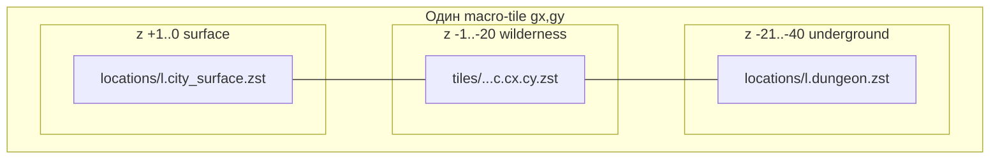

#### 3D territory (WP-21)

| Поле | Смысл |
|---|---|
| `territory_volume` | AABB `(x0,y0,z0)…(x1,y1,z1)` в meter grid; из `territory_radius_m` / layout bbox + `map_z` anchor |
| **Overlap XY, разный Z** | **норма:** два location file на одном tile; wilderness заполняет **z-диапазоны вне** всех location volumes |
| **Overlap XYZ** | validator warning; tie-break: выше `graph_level` / меньший `location_uid`; master разводит bbox |

**Mask на write (3D):**

```
inside_location(cell) =
  ∃ location L: cell ∈ L.territory_volume   // x,y,z — все три

wilderness_chunk.cells = refine_chunk(...)
  .filter(cell => !inside_location(cell))
```

На **(x,y)** wilderness может быть на `z=-5`, а location file — только на `z=0…-2`: конфликта нет.

#### Формат (file-per-unit)

| Слой | Файл | Unit |
|---|---|---|
| **Location L2** | `locations/l.{location_uid}.terrain.zst` | **3D** `territory_volume` локации |
| **Wilderness L2** | `tiles/r.{gx}.{gy}.c.{cx}.{cy}.zst` | fine chunk macro-tile |
| **Player scene / path** | *не отдельный тип файла* | те же chunks/tiles, но **выше в очереди** генерации и при read |

Wilderness — **file-per-tile-chunk**, не file-per-whole-tile на gameplay path (partial tile). Offline `r.{gx}.{gy}.terrain.zst` merged — только bake `tile|full`.

#### Layer priority (WP-20, утверждено)

На каждую `(x,y,z)` — **первый попавший** слой:

| # | Слой | Источник | Заметка |
|---|---|---|---|
| 0 | **patch** | `map_cell_patches` | gameplay deltas |
| 1 | **player scene** | scene volume вокруг `(map_x,map_y)` | highest pack layer; blocking P0 |
| 2 | **player path** | chunks/tiles на path corridor впереди | prefetch; ниже scene, выше location |
| 3 | **location** | `locations/l.{uid}.terrain` если `(x,y,z) ∈ territory_volume` | несколько uid на одном tile — по **z** |
| 4 | **wilderness** | `tiles/...c.{cx}.{cy}.zst` | только **вне** masked bbox локаций |
| 5 | **L0** | `upsample world_map` | fallback |

> **Статус impl merge:** § **Merge backlog (WP-MERGE)** v2 + § **WP-FIX** (фиксы) + § **WP-FIX-DEBT** + § **WP-FIX-REVIEW** (приоритеты code review).

**Очередь генерации** следует тому же порядку (WP-13, WP-16, WP-17): сначала scene под игроком, потом path, потом location L2 при входе, потом wilderness fill.

#### Exclusion mask на write (анти-дубликат)

```
wilderness_chunk.cells = refine_chunk(L0, rect)
  .filter(cell => !inside_any_location_volume(cell))  // WP-21: x,y,z
```

| Ситуация | Поведение |
|---|---|
| Location L2 **готов** | wilderness **не пишет** в её `territory_volume` |
| Тот же `(gx,gy)`, **разный z** | surface city + underground — **разные** location files; wilderness между ними по z |
| Location L2 **ещё нет**, wilderness в volume | location **перекрывает** при появлении; orphan wilderness bytes — допустимо v1 |
| Две локации overlap **XYZ** | manifest tie-break; validator warning |

**zstd:** каждый файл сжимается **на write** (`TileCodec`); отдельный batch-compress не нужен.

**`worldMapLoading`:** `location_terrain_ready` — локации с `l.{uid}.terrain.zst`.

**Крупный город:** bbox > лимита → sub-chunks `l.{uid}.c.{i}.zst` (backlog); v1 — один файл.

### L2 — FineTile (Идея 2)

**Назначение:** gameplay scene, точное русло, cliff gap, narration из геометрии.

**Реализация Идеи 2:** L2 **не** «с нуля», а **refine** light bake того же tile (§ Идея 2). **Не materialize целый macro-tile blocking** (~10–20 мин) — только объём вокруг игрока; остальное расширяется **от точки входа** (WP-13).

| Параметр | Значение |
|---|---|
| Unit persist | **fine chunk** `terrain_chunk_columns × terrain_chunk_columns` (default 32×32 m), см. [`tz_terrain_generation.md`](./tz_terrain_generation.md) § TR-PAR |
| Unit tile | macro-tile `map_cell_size_m`; статус `absent` \| `partial` \| `complete` |
| **Точка входа (anchor)** | `(entry_x, entry_y)` — откуда начинается/продолжается refine **внутри** tile |
| Триггер anchor | см. § **Генерация от точки входа** |
| Триггер соседних tiles | фоновая очередь path-first, § **Фоновый refine** |
| **Вход** | L0 `world_map` tile + L1 declared hydro + `world_seed` |
| Persist | wilderness: per-chunk blobs; **локации:** `locations/l.{uid}.*.zst` (§ WP-19) |
| Cache | LRU decoded chunks + location blobs + L0 sample |

### Генерация от точки входа (WP-13, утверждено)

**Принцип:** генерация **не** «весь tile разом», а **от точки, где игрок появился или вошёл**, кольцами наружу. При переходах — **новый anchor** = точка входа на границе / в локации.

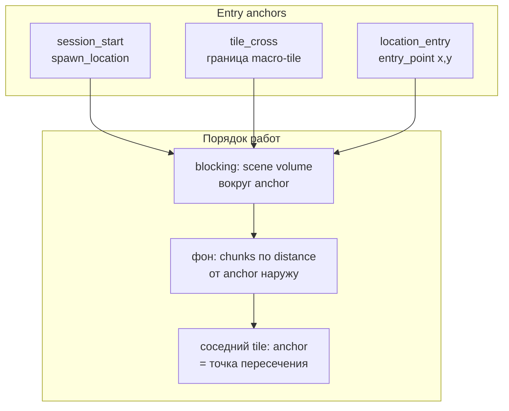

| Событие | Anchor `(entry_x, entry_y)` | Blocking |
|---|---|---|
| **Старт сессии** | `spawn_location` персонажа (`map_x`, `map_y`) | `scene_xy_radius` вокруг spawn — **секунды**, не минуты |
| **Переход macro-tile** | координата **пересечения** границы (где игрок вошёл в tile) | scene volume вокруг **ног** |
| **Вход в локацию** | `location_entry_points` (ближайший discovered entry) или anchor локации | scene volume вокруг entry |
| **Движение внутри tile** | anchor **не сбрасывается**; фон достраивает chunks по distance от **текущей** позиции + старый anchor |

**Порядок chunks внутри tile:**

1. Все chunks, пересекающие `scene_xy_radius` вокруг anchor — **P0, blocking** (первый playable).
2. Остальные chunks того же tile — **по возрастанию** distance(chunk_center, anchor); при движении игрока — пересортировка head очереди от `(map_x, map_y)`.
3. Соседний macro-tile на path corridor — после P0 текущего; **его anchor** = predicted entry point на границе (или фактический при cross).

**Чтение до готовности chunk:** `MapCellQueryFacade` → merge(**L2 chunk if present**, else **L0 upsample** sample, patches). Gameplay **не блокируется** на весь tile.

**Cross-ref:** scene volume defaults — [`tz_terrain_generation.md`](./tz_terrain_generation.md) § TR-LAZY-LOAD (`scene_xy_radius`, `get_scene_volume`).

**Антипаттерн (hard reject):** blocking `refine(entire_tile)`; materialize 9M columns до scene volume; **любой** gameplay wait **> 30 s** на старте сессии.

**Refine pipeline L2 (target):**

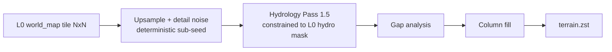

| Шаг | Контракт |
|---|---|
| **Upsample** | L0 `surface_z` → fine `SurfaceHeightmap` (interpolation + band-limited noise); **не** менять хребты/долины на macro-масштабе |
| **Hydro constrain** | реки/море L2 **обязаны** попадать в corridor L0 `hydrology_role`; ширина refine, топология — из L0 |
| **Declared override** | master declared river/coast **сильнее** autoresolve; L0 уже отражает declare |
| **Gap + fill** | как [`tz_terrain_generation.md`](./tz_terrain_generation.md) |
| **Climate** | field per tile; liquid overlay на read |

**Idempotent:** chunk в manifest → read; иначе `refine_chunk(L0, rect)` → write. Повтор того же chunk → тот же hash (WP-7). Tile `complete` когда все chunks в macro-tile записаны (offline `full` / добивка фоном).

**Генераторы:** orchestration contract — `SurfaceHeightmap` per tile в RAM (или tile strip cache); column fill **по chunk rect**; `parent_light_map` / `hydro_mask` в typed context.

### Фоновый refine (утверждено)

Два уровня фона: **(A) chunks внутри текущего tile** от anchor; **(B) соседние macro-tiles** по path corridor. Оба — **≤ 1 active chunk job** (single writer).

**Продуктовая модель:** после blocking scene volume gameplay идёт сразу; фон **достраивает** кольца chunks и tiles **по пути**, не burst кольцом из 8 сторон.

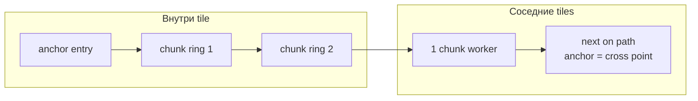

| Правило | Контракт |
|---|---|
| **Один worker** | ≤ 1 active chunk refine+persist |
| **Не burst** | не materialize все 8 соседних tiles при border cross |
| **Внутри tile** | chunks по distance от anchor; при движении — head очереди ближе к `(map_x, map_y)` |
| **Между tiles** | path corridor **`path_ahead_depth`** tiles вперёд (WP-17); новый tile стартует с **entry point** на границе |
| **Смена направления** | reorder corridor; не отменять active chunk mid-commit |
| **Повтор** | chunk уже в manifest — skip |

**Приоритет очереди (path-first + entry):**

| Приоритет | Когда |
|---|---|
| **P0** | chunks scene volume вокруг **ног** (если ещё нет) — единственный blocking |
| **P1** | chunks текущего tile по distance от anchor / позиции |
| **P2** | следующий tile на луче пути — **с entry на границе** |
| **P3** | +1…+`path_ahead_depth` tiles на луче (см. `[world_loading]` в `config.toml`) |
| **P4** | боковые tiles (idle + стоянка) |
| **P5** | master / debug |

**Foreground vs background:**

| Ситуация | Поведение |
|---|---|
| **Старт сессии** | blocking P0 вокруг spawn; фон — кольца от spawn |
| **Переход tile** | новый anchor = точка входа; P0 scene volume; фон — chunks от входа + path ahead |
| **Вход в локацию** | anchor = entry point; settlement layout — отдельный patch path ([`tz_city_generation.md`](./tz_city_generation.md)) |
| **Движение** | gameplay на L2+L0 fallback; фон достраивает впереди по пути |
| **Стоянка** | 1 chunk из head, idle |
| **Телепорт** | новый anchor; partial queue reorder |

**Компоненты:**

| Модуль | Слой |
|---|---|
| `ChunkRefineQueue` | priority: chunk jobs `(gx,gy,cx,cy)` + tile corridor |
| `ChunkRefineWorker` | `refine_chunk(L0, rect)` → `WorldPackWriter.write_chunk` |
| `EntryAnchorTracker` | spawn / tile_cross / location_entry → `set_anchor` |
| `TileRefineScheduler` | path corridor; heading WP-16; depth из `AppSettings.path_ahead_depth` |

#### Heading (WP-16, утверждено)

| Шаг | Источник | Условие |
|---|---|---|
| 1 | **Movement intent** | DAG / intent detection вернул направление или целевую точку |
| 2 | **Fallback (b)** | вектор по последним **5** позициям `(map_x, map_y)` в сессии |
| 3 | **Нет heading** | только expand chunks от anchor; **без** prefetch tiles впереди |

Intent **переопределяет** траекторию, пока актуален (до нового intent или смены цели).

#### `path_ahead_depth` (WP-17, утверждено)

Настройка пользователя в **`backend/config.toml`** (через `ConfigManager` ↔ `AppSettings`):

```toml
[world_loading]
path_ahead_depth = 2   # macro-tiles впереди по heading в фоновой очереди; default 2
```

| Поле | Default | Диапазон |
|---|---|---|
| `path_ahead_depth` | **2** | 1…4 (валидация при load settings) |

**Не** поле `worlds` / POJO мира — глобальная настройка клиента, как `repair_iterations`.

**Оценка:** blocking P0 ≈ 1–3 fine chunks + scene depth — **секунды**; полный tile — фон, часы только в offline `full`.

**Антипаттерн:** blocking entire tile; burst 8 neighbors; refine от центра tile вместо entry point.

### Восстановление фонового refine (WP-12)

Если генерация **остановилась** — восстановление на уровне **chunk**, не целого tile.

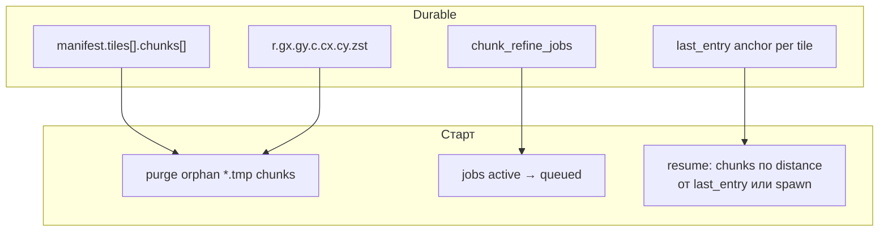

#### Что считается «готово»

| Вопрос | Ответ |
|---|---|
| Chunk готов? | Запись в `manifest.tiles[].chunks[{cx,cy}]` + файл на диске |
| Tile `complete`? | Все chunks macro-tile в manifest (или offline `full` bake) |
| Tile `partial`? | Есть ≥1 chunk, не все |
| Неготовая зона | L0 upsample на read |
| Вход refine | L0 `world_map.zst` + **anchor** `(entry_x, entry_y)` |

#### Atomic commit — **chunk** (граница восстановления)

| Шаг | Действие |
|---|---|
| 1 | `refine_chunk(L0, rect)` → cells |
| 2 | encode → `r.{gx}.{gy}.c.{cx}.{cy}.zst.tmp` |
| 3 | fsync; rename |
| 4 | append `manifest.tiles[].chunks[]`; если все chunks tile — `wilderness_refine_status=complete` |
| 5 | delete `chunk_refine_jobs` row |

**Crash mid-chunk:** purge `.tmp`; chunk не в manifest → **redo chunk** (WP-7, тот же hash). **Не** терять уже записанные соседние chunks.

#### Очередь после остановки

```sql
chunk_refine_jobs (
  world_uid TEXT NOT NULL,
  gx INTEGER NOT NULL,
  gy INTEGER NOT NULL,
  cx INTEGER NOT NULL,
  cy INTEGER NOT NULL,
  status TEXT NOT NULL,   -- queued | active
  priority INTEGER NOT NULL,
  source TEXT NOT NULL,   -- scene_blocking | entry_expand | path_ahead | manual
  entry_x INTEGER,
  entry_y INTEGER,
  enqueued_at TEXT NOT NULL,
  PRIMARY KEY (world_uid, gx, gy, cx, cy)
);
```

| Событие | Поведение |
|---|---|
| **Старт сессии** | `active`→`queued`; purge tmp; P0 = scene chunks вокруг **spawn** |
| **Resume partial tile** | недостающие chunks сортируются от `last_entry` или текущей позиции |
| **Переход tile** | новый anchor; jobs старого tile ниже приоритетом (не удалять готовые chunks) |

**Ответ «с чего начинать»:**

1. **Готовые chunks** — читать из pack.
2. **Прерванный chunk** — redo только его.
3. **Новая сессия на partial tile** — P0 scene volume → фон от **spawn** или **last_entry**.
4. **Новый tile cross** — anchor = точка входа; P0 scene → кольца от входа.

#### Stale L0 / regen (WP-22, утверждено)

Master rebake light pack → `l0_parent_hash` L2 ≠ текущий `world_map.zst`. Политика **A (skip + anchor-outward)**:

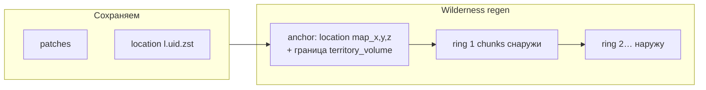

| Что | Действие |
|---|---|
| **`map_cell_patches`** | **не трогать** (WP-4) |
| **`locations/l.{uid}.terrain`** | сохранить; regen location file **только** если нет structure/settlement patch в volume (иначе skip + master warning) |
| **Wilderness chunks** со stale hash | удалить из manifest + диск |
| **Wilderness regen** | **не** row-major по tile; **от location anchor** `(map_x,map_y,map_z)` и **наружу** от `territory_volume` — кольца chunks по distance (тот же принцип, что WP-13 entry-first) |

**Anti-seam:** новый wilderness примыкает к **уже согласованной** геометрии location/patch; порядок записи — от границы локации наружу, чтобы не оставлять «остров» старого L2 внутри свежего кольца.

**Порядок jobs после stale:**

1. Halo chunks **соприкасающиеся** с `territory_volume` любой локации на tile (вне volume, z-совместимые).
2. Дальше — по возрастанию distance от ближайшего location anchor на tile.
3. Player scene / path — как WP-20 (выше приоритетом, если игрок на tile).

**Skip:** ячейка с patch или внутри сохранённого location volume — wilderness writer **не** regen.

**Не делать:** full wipe tile целиком, если есть location/patch (старый § «удалить все chunks» — только для **пустого** wilderness tile без locations).

#### API / observability

| API | Назначение |
|---|---|
| `get_chunk_materialize_state(gx,gy,cx,cy)` | `absent` \| `queued` \| `active` \| `ready` |
| `get_tile_wilderness_refine_status(gx,gy)` | `absent` \| `partial` \| `complete` + `chunks_done/total` |
| `get_entry_anchor(gx,gy)` | последний anchor tile |
| `tile_refine_status` | aggregate jobs + corridor + partial progress |

**Приёмка WP-A8:** kill mid-chunk → готовые chunks сохранены; прерванный redo → stable hash. **WP-A9:** старт сессии — playable scene volume ≤ **30 s** от spawn.

### Режимы bake

| Режим | Что materialize | Время (ориентир) | Когда |
|---|---|---|---|
| **`light`** (default) | L0 per-tile world_map + L1 + climate coarse | **секунды–2 мин** | import, world map UI |
| **`tile`** | L2 **все chunks** одного tile из L0 | offline ~20–40 мин/tile | debug, master |
| **`full`** | все tiles L2 в `world_bounds` | часы offline | дистрибуция, CI golden |

**Gameplay** использует только **entry-first chunk** path (WP-13); `tile` / `full` — offline, не blocking UI.

Cold load **`light` pack:** **≤ 5 min** (validate + mmap; decode L0 для viewport).

---

## Климат и гидрология по LOD

Генераторы **не меняются**; меняется **что persist-ится** на каждом уровне.

### Гидрология

| LOD | Поведение |
|---|---|
| **L0** | light grid: `hydrology_role`, `hydrology_width`, coarse `surface_z`; declared polyline rasterize; **без** fine bed carve |
| **L1** | declared metadata + connection graph; pins на map |
| **L2** | **refine:** `HydrologyGeneratorService` с **mask constraint** от L0; полный carve + gap + column fill |

См. [`tz_terrain_hydrology.md`](./tz_terrain_hydrology.md) — liquid_candidate на L2; liquid_body overlay на climate read.

### Климат

| LOD | Поведение |
|---|---|
| **L0** | `SurfaceClimateField` coarse — pole + zone blend на macro grid → `climate_coarse.zst` |
| **L1** | sample coarse field в anchor локации; `CitySkeleton` не требует per-cell climate |
| **L2 gameplay** | **двухуровневый** read (WP-18): см. ниже |
| **Gameplay near** | per-cell resolve при необходимости — [`tz_climate.md`](./tz_climate.md) § Climate LOD C6–C13 |

**Запрещено на L0/L1:** upsert `temperature_base`/`rainfall` на каждую fine cell.

#### Climate L2 v1 — tier A + tier B (WP-18, утверждено)

При загрузке L2 нужны **и скорость, и точность**. Не «или-или», а **сначала быстрое, потом точное**.

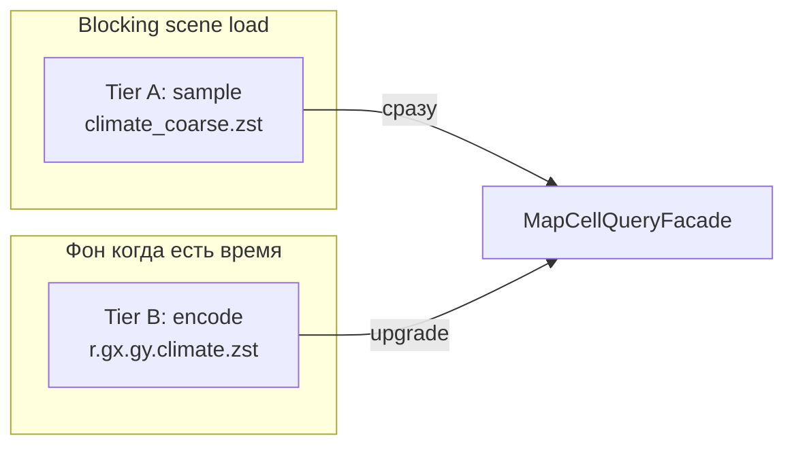

| Tier | Источник | Когда | Точность | Стоимость |
|---|---|---|---|---|
| **A (fast)** | глобальный `climate_coarse.zst` → `field.sample(x,y)` + patch override | **всегда** при read; **blocking** path не ждёт B | coarse (достаточно для старта сцены) | decode coarse 1× на сессию; sample — O(1) |
| **B (fine)** | `tiles/r.{gx}.{gy}.climate.zst` per macro-tile | **фон** после terrain chunks tile / при idle worker | fine horizontal field для tile | encode+persist **отдельный** файл на tile; **не** блокирует WP-14 |

**Read contract (WP-5):**

```
effective_climate(x,y) =
  if tile(gx,gy) has climate.zst (tier B ready):
    sample B field
  else:
    sample A coarse field
  + patch climate_delta if any
```

**Очередь B:** тот же `ChunkRefineWorker` или sibling job **после** terrain chunks текущего tile; приоритет **ниже** P0 scene terrain, **выше** wilderness prefetch. Tile без terrain chunks — **не** считать B.

**`localGridLoading` дополнение:** `climate_tier`: `coarse_only` \| `fine_ready` per `(gx,gy)`.

**Offline `tile`/`full` bake:** B materialize сразу вместе с terrain (не gameplay path).

**Backlog v2:** per-chunk climate blob — только если coarse+B tile недостаточно на границах chunk.

---

## Генерация мира остаётся

Меняется **persist**, не pipeline генераторов.

| Компонент | Статус после перехода |
|---|---|
| Import JSON мастером | без изменений |
| `TerrainGeneratorService` / hydrology / climate passes | pure, без repos |
| `WorldSurfaceMaterializationOrchestrator` | вызывает `WorldPackWriter` вместо terrain SQLite |
| Ordered queue S→O→C→CL | без изменений deps |
| `generate-z-slice` / lazy column | L2 on demand → pack tile или patch |
| DAG nodes | wiring после gate с мастером |

---

## Именование (LOD ↔ код)

В **продуктовом ТЗ** уровни **L0 / L1 / L2** — термины LOD bake. В **коде и wire** используются читаемые идентификаторы; **не** именовать API, классы и поля manifest буквами `L0` / `L2`.

| TZ LOD | Назначение | Код / wire | Файлы pack (примеры) |
|---|---|---|---|
| **L0** | Light world map per macro-tile | `world_map`, `WorldMapCellWire`, `world_map_path`, `world_map_hash`, `world_map_cells` | `r.{gx}.{gy}.world_map.zst`, `WorldMapBakeOrchestrator`, `WorldMapPackReader` |
| **L1** | Location skeleton (pins, anchors) | SQLite `named_locations`; mirror `locations_index.json` | не blob в pack |
| **L2 wilderness** | Fine terrain chunk в tile | `wilderness_chunk`, `FineTerrainChunkWire`, `wilderness_refine_status`, `wilderness_chunks_baked` | `r.{gx}.{gy}.c.{cx}.{cy}.zst`, `FineTerrainRefineOrchestrator` |
| **L2 location** | Fine terrain территории локации | `location_terrain`, `LocationTerrainEntry`, `location_terrain_entries[]`, `terrain_path`, `terrain_hash` | `locations/l.{uid}.terrain.zst` |
| **Merge fallback** | Coarse cell при отсутствии fine | `MapLayerKind.WORLD_MAP` | `merge_layers` / `MapCellQueryFacade` |

**Payload kinds (`tileCodec`):** `PAYLOAD_KIND_WORLD_MAP` (0), `PAYLOAD_KIND_FINE_TERRAIN` (1).

**Debug read API:** `GET …/map/pack/fine-terrain-read` — probe merged fine terrain; **не** `l2-probe`.

**Прогресс загрузки:** `world_map_tiles_ready` / `world_map_tiles_total`, `location_terrain_ready`, `wilderness_chunks_baked`.

**Логи (`packBakeLog`, JSON):** в `msg` и поле `activity` — **не** `L0`/`L2`/`l0`/`l2`. Соответствие LOD → log:

| TZ LOD | `activity` (примеры) | `blob_kind` / префикс `msg` |
|---|---|---|
| L0 | `world_map_bake_start`, `world_map_tile_write`, `pack_write_world_map` | `world_map` |
| L2 wilderness | `wilderness_chunk_generate`, `wilderness_chunk_persist_pack`, `pack_write_wilderness_chunk` | `wilderness_chunk` |
| L2 location | `location_terrain_persist_pack`, `pack_write_location_terrain` | `location_terrain` |
| Orchestration | `fine_terrain_phase_start`, `fine_terrain_plan_parallel`, `drain_persisted_job` | — |

Структурированные поля на каждой строке: `worker_thread`, `worker_tid`, `cpu_core`, `pool_workers` (см. `config.toml` `[logger_levels]` → `app.application.worldData.pack`).

**Legacy wire (до rebake):** старые ключи `l0_path`, `l2_status`, `locations_l2[]` — **не** читать; manifest пересоздаётся при следующем bake.

---

## Wire format (Pack v1)

```
{data_dir}/worlds/{world_uid}/pack/
  manifest.json
  registries.snapshot.json
  locations_index.json         # pins для world map (mirror L1)
  climate_coarse.zst
  locations/
    l.{location_uid}.terrain.zst   # L2 fine territory локации (zstd on write)
    l.{location_uid}.climate.zst   # tier B climate bbox локации (optional)
  tiles/
    r.{gx}.{gy}.world_map.zst       # L0 light bake per tile
    r.{gx}.{gy}.c.{cx}.{cy}.zst     # L2 fine chunk (partial tile)
    r.{gx}.{gy}.terrain.zst         # optional merged tile (offline full / tile bake)
    r.{gx}.{gy}.climate.zst         # tier B fine (optional until bg bake)
```

### `manifest.json` (POJO `WorldPackManifest`)

| Поле | Назначение |
|---|---|
| `pack_version` | wire semver |
| `world_uid`, `content_hash`, `registry_hash` | validation |
| `bake_mode` | `light` \| `full` |
| `map_cell_size_m` | из `worlds` |
| `world_map_cells_per_tile` | resolved при bake, см. § L0 |
| `cell_size_m`, `map_subsurface_depth` | из `WorldTerrainScalars` / `worlds` |
| `location_terrain_entries[]` | per-location L2 terrain — см. § `LocationTerrainEntry` |
| `tiles[]` | per macro-tile — см. § `TileManifestEntry` |
| `world_map_cells`, `wilderness_tiles_total`, `wilderness_chunks_baked` | progress |

#### `TileManifestEntry` (`tiles[]`)

Один macro-tile `(gx, gy)`. Поля именуются по **LOD-слою**, не generic `storage_path` / `content_hash`.

| Поле | Тип | Смысл |
|---|---|---|
| `gx`, `gy` | int | координаты macro-tile |
| `world_map_path` | str? | относительный путь к L0 `tiles/r.{gx}.{gy}.world_map.zst` |
| `world_map_hash` | str? | SHA-256 zstd-blob L0 world map |
| `wilderness_refine_status` | enum | `absent` \| `partial` \| `complete` — **wilderness L2 chunks** на tile (не location terrain) |
| `climate_tier` | str | `A` coarse на tile; `B` когда fine climate готов |
| `chunks[]` | `ChunkRef[]` | wilderness L2 chunks `tiles/r.{gx}.{gy}.c.{cx}.{cy}.zst` |

#### `LocationTerrainEntry` (`location_terrain_entries[]`)

Fine terrain **одной** `named_location` (file-per-location, WP-19).

| Поле | Тип | Смысл |
|---|---|---|
| `location_uid` | str | uid локации |
| `territory_volume` | AABB | 3D bbox в meter grid (WP-21) |
| `terrain_path` | str? | `locations/l.{uid}.terrain.zst` |
| `terrain_hash` | str? | SHA-256 location terrain blob |
| `climate_tier`, `z_band`, `bytes` | | climate LOD / z-band / размер blob |

#### `ChunkRef` (`tiles[].chunks[]`)

| Поле | Тип | Смысл |
|---|---|---|
| `cx`, `cy` | int | fine chunk внутри macro-tile |
| `refine_role` | enum? | `scene` \| `background` \| `path` |
| `content_hash`, `bytes` | | hash и размер wilderness chunk blob |

### Fine terrain column (внутри zstd)

`(lx, ly)` + z-runs + **`system_terrain`** / **`system_material`** (registry keys, строки). Legacy wire с `terrain_id: u8` — мигрируется при read (`FineTerrainZRun._migrate_legacy_wire`). См. `dataModel/worldPack/fineTerrainChunkWire.py`.

---

## Patch Store (SQLite)

Таблица **`map_cell_patches`** — только отличия от pack:

```sql
map_cell_patches (
  world_uid, x, y, z,
  layer_kind TEXT NOT NULL,  -- structure | settlement | terrain_delta | climate_delta | ore | cave
  ...
  PRIMARY KEY (world_uid, x, y, z)
);
```

**POJO:** `dataModel/worldPack/mapCellPatchLayerKind.py` (`MapCellPatchLayerKind`) — единственный источник wire-значений и mapping `save_pass(layer)` → `layer_kind`.

**Read (v2):** `PatchStoreService` строит `CellContribution` **по полям**, соответствующим `layer_kind` (climate patch не затирает terrain на read).

**Write (известный gap, WP-FIX-DEBT-1):** PK одна строка на `(x,y,z)` — overlay нескольких `layer_kind` на write требует merge-on-upsert в repo или composite PK; см. § **Fix debt (WP-FIX-DEBT)**.

`worlds` дополнение:

| Поле | Назначение |
|---|---|
| `terrain_pack_path` | путь к pack |
| `terrain_pack_hash` | fast validate |
| `terrain_pack_version` | wire version |

**`map_cells` удаляется** при cutover (один PR с кодом + `0001_initial.sql`).

---

## Read path

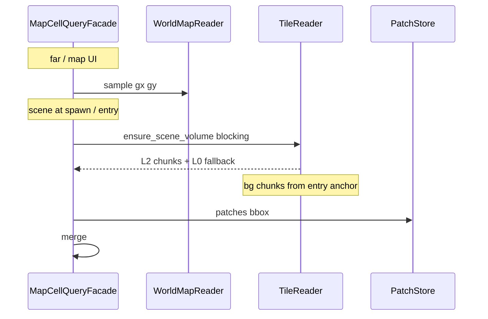

| API | LOD |
|---|---|
| `get_world_map_bbox` | L0 |
| `get_location_context` | L1 |
| `get_scene_volume` | L2 chunks + L0 fallback + merge patches |
| `ensure_scene_volume` | **blocking** только chunks scene volume вокруг anchor |
| `set_entry_anchor` | spawn / tile_cross / location_entry |
| `schedule_chunk_refine` | фон: кольца от anchor + path corridor |
| `get_tile_wilderness_refine_status` | `absent` \| `partial` \| `complete` |
| `tile_refine_status` | jobs + corridor + partial progress |

### Merge backlog (WP-MERGE)

**Контракт (v2, 2026-07-10):** `dataModel/worldPack/mergeMapCells.py` — **`merge_layers` field-wise overlay** по `LAYER_PRIORITY_ORDER` (высший приоритет перекрывает **отдельные поля**, не всю ячейку) + `MapCellQueryFacade` — единая точка read при наличии pack.

**Climate tier A:** `climate_coarse.sample(x,y)` подмешивается в facade **после** merge (post-step), если поля не заданы patch/L2; patch `climate_delta` — через слой PATCH.

#### Статус impl (v2, 2026-07-10)

| Слой WP-20 | Код | Заметка |
|---|---|---|
| **0 patch** | ✅ | `PatchStoreService` + `MapCellPatchLayerKind`; field-wise merge |
| **1 player scene** | ✅ | `ChunkRef.refine_role=scene` → `MapLayerKind.PLAYER_SCENE` |
| **2 player path** | ⚠️ | `refine_role=path` + heading corridor (WP-16); DAG intent wire — backlog |
| **3 location** | ⚠️ | `locations/l.*.terrain.zst`; local origin ✅; settlement footprint v1 ✅; multi-z overlap — backlog |
| **4 wilderness** | ✅ | `tiles/...c.*.zst`; registry keys в wire |
| **5 L0** | ⚠️ | surface @ `z==surface_z`; subsurface band `n_base`; не full column |
| **climate** (WP-5) | ⚠️ | post-merge `climate_coarse`; bake blob — backlog |
| **registry resolve** | ✅ | L2/L0 `system_terrain` строки; не `terrain_{u8}` |
| **продуктовая склейка** | ⚠️ | facade + debug routes (MERGE-9 ✅); location footprint assembler (DEBT-6 ✅) |

**Механизм merge (POJO + field-wise)** — ✅. **Полный read path мира** — частично (см. WP-FIX-DEBT).

#### Приоритет доработок (утверждено)

| Приоритет | ID | Задача | Статус | Примечание |
|---|---|---|---|---|
| **P0** | **MERGE-1** | PLAYER_SCENE в manifest/read | ✅ | `ChunkRef.refine_role` |
| **P0** | **MERGE-2** | Climate в read path | ⚠️ | post-merge coarse; tier A bake — backlog |
| **P1** | **MERGE-3** | Location L2 coords | ⚠️ | footprint v1 ✅; multi-z overlap / layout bbox — backlog |
| **P1** | **MERGE-4** | terrain/material → registry keys | ✅ | FIX-01/02 |
| **P2** | **MERGE-5** | PLAYER_PATH corridor | ⚠️ | heading corridor ✅; DAG movement intent — backlog |
| **P2** | **MERGE-6** | L0 per-z fallback | ⚠️ | subsurface band ✅; full column — backlog |
| **P2** | **MERGE-7** | patch `layer_kind` + field overlay | ✅ | FIX-10; write model gap → WP-FIX-DEBT-1 |
| **P3** | **MERGE-8** | Read perf | ✅ | batch patch bbox; `FineTerrainDecodeCache` + `PackReadPolicy` | |
| **P3** | **MERGE-9** | Потребители только facade | ⚠️ | debug read ✅; legacy write routes (`generate-surface`) — отдельно |

**Порядок работ (оставшееся):** REVIEW-1 (pack I/O root) → MERGE-8 LRU → smoke WP-A* → bake tile/full → DAG intent wire → REVIEW-2…7.

**Тесты backlog:** integration WP-A6, WP-A13; unit tie-break multi-location; golden patch-over-L2.

**Инженерные фиксы (WP-FIX):** § ниже. Детальный чеклист: [`.cursor/plans/world-pack-fixes.md`](../.cursor/plans/world-pack-fixes.md).

---

### Инженерные фиксы (WP-FIX) — статус impl

Ревью smells после L1–L7; имплементировано **2026-07-10**. Связка MERGE-* ↔ FIX-* в plan-файле.

| ID | Тема | Статус | Где |
|---|---|---|---|
| FIX-01/02 | L2 wire: `system_terrain` / `system_material` (не u8-hash) | ✅ | `l2ChunkWire`, `mapCellToFineTerrainWire`, facade |
| FIX-03/11 | Location L2 read/write + territory origin | ✅ | `fineTerrainRefineOrchestrator`, facade |
| FIX-04 | tile-local cx/cy в background queue | ✅ | `schedule_tile_background` |
| FIX-05/06 | Chunk refine worker + `chunk_refine_jobs` | ✅ | `ChunkRefineWorker`, sqlite repo |
| FIX-07 | PLAYER_SCENE (`refine_role=scene`) | ✅ | manifest + facade |
| FIX-08 | Climate post-merge | ✅ | `_apply_climate` |
| FIX-09 | L0 surface z-gate | ✅ | `_world_map_contribution` |
| FIX-10 | `MapCellPatchLayerKind` + field-wise merge | ✅ | POJO + `merge_layers` |
| FIX-12…18 | POJO defaults, manifest/world sync | ✅ | `PackBakeDefaults`, `finalize_pack_on_world` |
| FIX-19 | `world_pack_root` config | ✅ | `AppSettings` |
| FIX-20 | `max_tiles` из POJO | ✅ | `PackBakeDefaults.max_tiles_light` |
| FIX-21/22 | manifest counters + `content_hash` | ✅ | `WorldPackWriter` |
| FIX-23/24 | L0 miss / missing chunk log | ✅ | facade |
| FIX-25…30 | API lifecycle, loading, typing | ✅ | routes, container |
| FIX-31 | Binary wire вместо JSON | ⬜ | P4 backlog |
| FIX-32/33 | `codec_version` / zstd level в manifest+POJO | ✅ | manifest, `TileCodec` |

**MERGE-5/6/8 (частично в рамках доработок):** path corridor v1, L0 subsurface band, batch patch bbox.

---

### Fix debt (WP-FIX-DEBT) — после второго ревью

Не блокирует smoke v1; закрывать до DAG gate / master приёмки.

| ID | Проблема | Целевое решение |
|---|---|---|
| **DEBT-1** | patch PK `(x,y,z)` vs multi-`layer_kind` overlay на write | merge-on-upsert по полям (read ✅); PK policy — backlog |
| **DEBT-2** | `dataModel` → `db.models.MapCell` в `mapCellPatchLayerKind` | ✅ `patchCellContribution.py` |
| **DEBT-3** | `source_layer` в field-wise merge вводит в заблуждение | ✅ `field_sources` |
| **DEBT-4** | `has_pack()` не учитывал `worlds.terrain_pack_path` | ✅ `packPresence` + `WorldPackPaths.for_world` (REVIEW-1) |
| **DEBT-5** | queue in-memory vs `chunk_refine_jobs` без recovery drain | ✅ `drain_persisted` на resume |
| **DEBT-6** | location `TerritoryVolume` stub (не settlement geometry) | ✅ assembler `footprint_side_m` / `settlement_meter_rect` |
| **DEBT-7** | PLAYER_PATH corridor только +X | ✅ `pathHeading.py`; intent/history; без heading — no prefetch |
| **DEBT-8** | debug routes / `export` мимо facade | ✅ MERGE-9 |
| **DEBT-9** | pack orchestrators → `api.schemas.ImportResult` | ✅ `PersistResult` |

---

### Приоритет архитектурных фиксов (WP-FIX-REVIEW)

Результат code review после DEBT/MERGE (2026-07-10): неявные контракты, смешение ответственности, god-object, hardcode. **Не блокирует** smoke v1 целиком; **P0** — до master приёмки WP-A*.

| Приоритет | ID | Проблема | Целевое решение | Связь |
|---|---|---|---|---|
| **P0** | **REVIEW-1** | `has_pack_for(world)` смотрит `terrain_pack_path`, `WorldPackReader`/`Writer` открывают только `WorldPackPaths.from_db_parent` | ✅ `resolve_pack_root` + `WorldPackPaths.for_world`; facade reader cache | DEBT-4 |
| **P1** | **REVIEW-2** | `get_all_for_read` = concat L0 + patches без merge/dedupe | ✅ `get_debug_export_cells`; `read_mode=world_map_surface_merged_patches` | MERGE-9 |
| **P1** | **REVIEW-3** | `_settlement_like` — hardcoded `{"settlement","city","district"}` | ✅ `locationFootprintPolicy` + registry | DEBT-6 |
| **P2** | **REVIEW-4** | `TerritoryVolumePolicy.pin_half_extent_xy` дублирует `SCENE_LOAD_XY_RADIUS` | ✅ `SceneVolumePolicy` + `TerritoryVolumePolicy.pin_half_extent_xy()` | WP-13 |
| **P2** | **REVIEW-5** | `MapCellQueryFacade` — gameplay read + debug L0 export + loading progress | ✅ `PackDebugReadFacade` + `PackLoadingProgressFacade` + `PackReadContext` | MERGE-8/9 |
| **P2** | **REVIEW-6** | `MapCellService` — CRUD + read routing + debug export + legacy guards | ✅ `MapCellReadService` + `read_service_factory` | MERGE-9 |
| **P3** | **REVIEW-7** | `pathHeading.max_samples`, corridor `half_width_m=chunk_size` — literals | ✅ `PathHeadingPolicy` | WP-16, MERGE-5 |

**Неявные контракты (зафиксировать при impl, не откладывать молча):**

| Контракт | Риск | Действие |
|---|---|---|
| Heading на light bake без intent | path corridor **молча** не строится (WP-16) | smoke с `heading_dx/dy` или DAG wire |
| `depth_tiles × cell_m` в corridor | macro-tiles vs метры при смене `map_cell_size_m` | docstring + POJO единицы |
| Settlement rect half-open → territory inclusive | граница ±1 m vs generator occupancy | задокументировать в territory POJO |
| `PackMaterializationOrchestrator` session state на singleton | одна очередь/anchors на инстанс | явный session scope при DAG wiring |

**Порядок работ:** REVIEW-1 → smoke WP-A* → REVIEW-2/3 → MERGE-8 LRU → REVIEW-4…7 → DAG movement intent (MERGE-5).

---

### Прогресс загрузки (WP-15, утверждено)

Два **внутренних** счётчика (backend); позже — push на frontend. Пока загрузка активна (blocking или фон) — **каждые 10 s** отдавать снимок на UI (**TODO:** frontend SSE/ poll contract).

#### `worldMapLoading` — локации на world map

| Поле | Тип | Смысл |
|---|---|---|
| `locations_total` | int | `named_locations` активных в мире |
| `locations_ready` | int | L0 pin + L1 skeleton |
| `location_terrain_ready` | int | `locations/l.*.terrain.zst` готов (WP-19) |
| `wilderness_tiles_total` | int | macro-tiles в bounds без локаций |
| `wilderness_tiles_l0_ready` | int | wilderness tiles с `world_map.zst` (фон) |
| `phase` | enum | `locations` \| `wilderness` \| `idle` |

**Формула прогресса (0..1):** `(locations_ready + wilderness_tiles_l0_ready) / (locations_total + wilderness_tiles_total)` — или отдельные поля для UI.

#### `localGridLoading` — L2 per macro-tile

Массив / map по `(gx, gy)`:

| Поле | Тип | Смысл |
|---|---|---|
| `gx`, `gy` | int | macro-tile |
| `chunks_total` | int | fine chunks в tile |
| `chunks_ready` | int | chunks в pack |
| `wilderness_refine_status` | enum | `absent` \| `partial` \| `complete` — wilderness L2 chunks на tile |
| `climate_tier` | enum | `coarse_only` (tier A) \| `fine_ready` (tier B on disk) |
| `entry_anchor` | `{x,y}?` | последняя точка входа |

**Агрегат сессии:** `tiles_partial`, `tiles_complete`, `active_chunk_job`.

#### Backend API (target)

| API | Назначение |
|---|---|
| `get_loading_progress(world_uid)` | `{ worldMapLoading, localGridLoading, updated_at }` |
| `subscribe_loading_progress` | **TODO:** SSE / push **каждые 10 s** пока `phase != idle` |

**Приёмка WP-A11:** после spawn `worldMapLoading.locations_ready` включает spawn location; wilderness растёт в фоне без блокировки хода.

---

## Переход с `map_cells` (WP-23, утверждено)

**Решение продукта:** промежуточный **vertical slice** на legacy `map_cells` / dual-read **не делаем**. Нужен **переход на корректное ведение загрузки мира** — целевая архитектура Pack + Patch + entry-first + locations-first (WP-13…22), а не «ещё один слой оптимизации INSERT».

| Не делаем | Делаем |
|---|---|
| dual-read pack + `map_cells` | один read path: `MapCellQueryFacade` → `merge_layers` |
| писать terrain и в SQLite, и в pack | wilderness skeleton **только** pack |
| мигрировать старые rows | rebake fixtures |
| продлевать TR-PERF как основной путь | cutover **big bang** после L3 smoke |

### Big bang cutover

| Шаг | Действие |
|---|---|
| 1 | Impl L1–L7 по [plan](../.cursor/plans/world-data-storage-migration.md) |
| 2 | Smoke WP-A1…A14 на pack (debug HTTP / tests), **до** drop schema |
| 3 | **Один PR:** код + `0001_initial.sql` drop `map_cells` + `map_cell_patches` / jobs |
| 4 | Recreate local DB |
| 5 | Rebake fixtures: `light` pack в `fixtures/packs/{world_uid}/` |
| 6 | Удалить terrain INSERT path; grep-гейт в CI |

**Не мигрировать** старые `map_cells` rows → pack; только rebake.

**Пока L1–L3 не готовы (WP-26, утверждено):** legacy path **freeze** — `map_cells`, `materialize-stack`, TR-PERF **вне текущего scope**; не строим новый продуктовый slice на INSERT path. Допустимо: критичные bugfix на legacy. Имплементация — **только** по слоям целевой архитектуры (L1…L7).

---

## Уровни импорта и дистрибуция (WP-24, утверждено)

**П.9:** нужны **разные уровни импорта**, не один монолитный bundle. Согласовано с текущим кодом и целевым Pack.

### Что есть сейчас (код)

| Компонент | Поведение |
|---|---|
| `POST /worlds/import` | [`WorldBundleService.import_bundle`](../backend/app/application/worldData/worldBundleService.py) — транзакция, rollback при ошибке |
| Секции bundle | `world` **обязателен**; опционально: `races`, `perks`, `states`, `locations`, `map_cells`, `connection_nodes`, `connection_edges` |
| Дубликат `world_uid` | auto-remap → `имя vN` |
| `GET /worlds/{uid}/export` | **всё**, включая `map_cells` если есть |
| По-секционно | `POST …/locations/import`, `races/import`, … — уже **частичный** импорт |
| [`fixtures/world_template.json`](../fixtures/world_template.json) | world + registries + hydro declare; **без** settlements и `map_cells` |
| `init_mode` partial/full | в [`tz_city_generation.md`](./tz_city_generation.md) §11 — **когда генерировать**, не что в файле; в `AppSettings` ⬜ |

**Проблема:** нет явного `import_level`; export тянет legacy `map_cells`; pack как артефакт **не** подключён.

### Целевые уровни импорта

**Модель сессии (утверждено):** **сессия = мир + персонаж** (`game_sessions`: `world_uid` + `player_character_id`). Персонаж **живёт отдельно** от мира (свой import/export), но при старте игры **всегда** привязан к миру через сессию.

**Персонаж в продукте — роли и статус impl:**

| Роль | Хранение (код сейчас) | Import сегодня |
|---|---|---|
| **Персонаж игрока (PC)** | `character_sheet`, `character_type='player'` | ✅ **`POST /characters/import`** ([`characters.py`](../backend/app/api/routes/characters.py) → `PlayerService.create`) — **отдельный JSON**, не из world bundle |
| **NPC мира** | `character_sheet`, `character_type='npc'` + `world_uid` | ⬜ backlog — bundle не трогает; lazy sim / отдельный epic |
| **Starter PC в bundle** | — (новая сущность) | ⬜ **backlog spec** — `starter_characters[]` **не** impl; см. § Backlog bundle characters |

> **Мастер:** персонаж **живёт отдельно** от мира (свой import/export), сессия связывает `world_uid` + `player_character_id`. World bundle **не** импортирует персонажей — только мир.

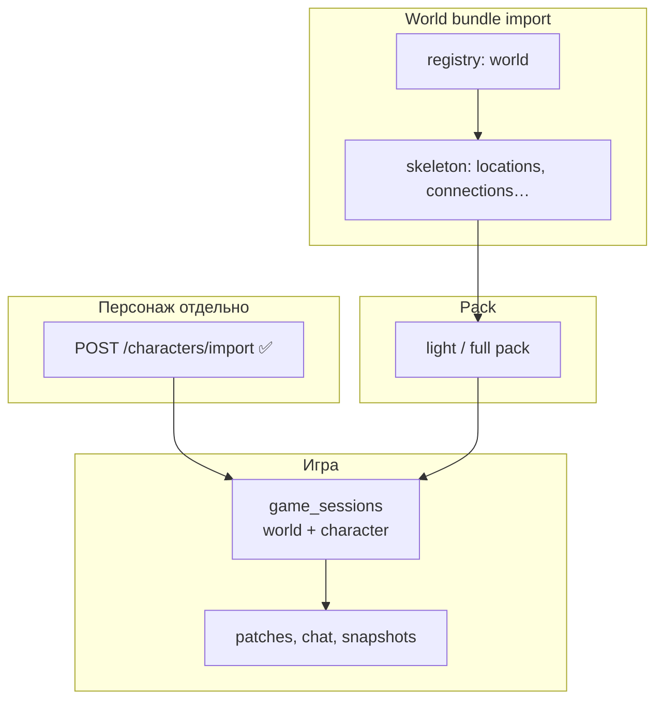

#### A. SQLite metadata (JSON bundle)

| Level | ID | Секции bundle | После import |
|---|---|---|---|
| **0** | `registry` | `world` | registries, scalars |
| **1** | `skeleton` | + `races`, `perks`, `states`, `locations`, `connection_*` | L1, без персонажей |
| ~~npcs~~ | — | **`npcs[]` backlog** | отдельный spec |
| ~~starter_characters~~ | — | **`starter_characters[]` backlog** | отдельный spec; **не** L6 |
| ~~legacy~~ | — | `map_cells` | **reject** (WP-23) |

**Сейчас в коде:** [`WorldBundleService`](../backend/app/application/worldData/worldBundleService.py) — `world`, `races`, `perks`, `states`, `locations`, `map_cells`, `connection_*` only. Персонажи — **`POST /characters/import`** отдельно (✅). Bundle персонажей — **нет**.

#### Backlog: bundle characters (spec only, не impl)

Две **будущие** сущности — зафиксировать wire отдельно, **не** включать в Pack migration / L6:

| Сущность | Назначение (идея) | Статус |
|---|---|---|
| **`npcs[]`** | pre-placed NPC roster мастера | ⬜ spec; vs lazy sim — не решено |
| **`starter_characters[]`** | готовые PC «в комплекте с миром» | ⬜ **новая** сущность; wire TBD; **не** дублировать `POST /characters/import` в L6 |

При появлении — отдельный epic + validator; remap UID как у locations. До решения — мастер: world bundle + отдельные character JSON.

#### B. Pack filesystem (отдельно от JSON или zip)

| Level | ID | Содержимое | Когда |
|---|---|---|---|
| **2** | `light` | `pack/manifest` + L0 location tiles + `climate_coarse` + `locations_index` | после skeleton import → **auto bake** ≤2 min **или** attach готового `fixtures/packs/{uid}/` |
| **3** | `pack` | + `locations/l.*.terrain.zst`, `tiles/...chunks` (partial/full) | master distributable / CI golden |
| **4** | `pack_attach` | только ссылка `worlds.terrain_pack_path` + validate hash | мир скопирован с pack folder |

**Не в bundle JSON:** бинарные zstd — **директория** `{data_dir}/worlds/{uid}/pack/` или zip `world_{uid}_pack.zip` рядом с `world.json`.

#### C. Session runtime (не определение мира/персонажа)

**Смысл:** bundle задаёт **мир** (skeleton + pack). **Сессия** — когда игрок выбрал/импортировал персонажа и создан `game_sessions`. Всё после — session runtime.

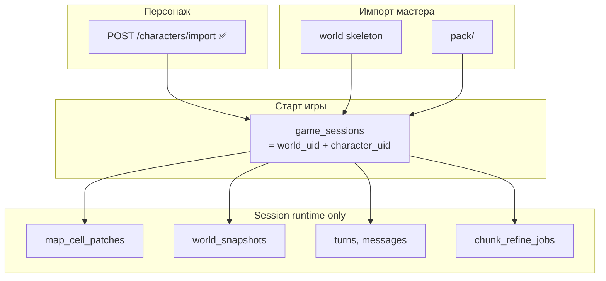

| Категория | Примеры | В bundle? |
|---|---|---|
| **Определение мира** | `world`, `locations`, connections | ✅ skeleton |
| **Определение PC** | character JSON | ✅ `POST /characters/import` (отдельно) |
| **Bundle characters** | `starter_characters[]`, `npcs[]` | ⬜ backlog spec |
| **Связка** | `game_sessions` | ❌ создаётся при **new game** |
| **Gameplay runtime** | patches, chat, snapshots, refine jobs | ❌ только сессия |

**Персонаж отдельно от мира:** `POST /characters/import` **без** мира (✅); export character JSON — отдельно от world export. Bundle «мир + герои одним файлом» — **backlog** (`starter_characters[]`), не текущий путь.

**Сценарии:**

| Действие | Что переносится |
|---|---|
| Мастер: world bundle + light pack | мир + карта |
| Мастер: готовый герой | `POST /characters/import` (отдельный JSON) |
| Игрок: new game | `game_sessions` + выбранный/импортированный PC |
| Продолжить игру | session + patches + snapshots |

**Что общее на инстансе мира:** `pack/` L2 — для всех сессий; `map_cell_patches` — накопление по миру в game.db (shared DB).

### Target API (L6)

| Endpoint | Назначение | Статус |
|---|---|---|
| `POST /worlds/import?level=skeleton` | JSON bundle ≤ skeleton | L6 |
| `POST /characters/import` | персонаж отдельно | ✅ **есть** |
| `POST /worlds/{uid}/pack/import` | zip → `pack/` | L6 |
| `POST /worlds/{uid}/pack/bake?mode=light` | bake после skeleton | L6 |
| `GET /worlds/{uid}/export?level=skeleton` | без map_cells / pack blobs | L6 |

### Связь с загрузкой игрока

| Импорт мастера | Игрок при старте сессии |
|---|---|
| skeleton + light pack | cold load ≤5 min; spawn ≤30s (WP-14) |
| skeleton only | auto light bake или blocking bake P0 locations |
| pack с L2 locations | меньше фоновой работы у spawn |

### Миграция с текущего export

| Было | Станет |
|---|---|
| export с `map_cells` | `level=skeleton`; terrain → pack export отдельно |
| import с `map_cells` | 422 + сообщение «use pack import» |
| monolith bundle | split: `world.json` + `pack/` directory |

---

## Deprecation

| Удаляется | Замена |
|---|---|
| `BootstrapMapCellWriter.write_terrain*` | `WorldPackWriter` |
| `insert_terrain_bulk` bootstrap | L2 tile blob |
| wilderness rows в `map_cells` | L0/L2 pack |
| per-cell climate upsert на bake | climate field blob |
| TR-PERF terrain bulk INSERT | pack encode; TR-PERF только patches |

---

## Имплементация (слои)

| Слой | Содержание | Статус (2026-07-10) |
|---|---|---|
| **L1** | `dataModel/worldPack/`, `merge_map_cells`, wire golden tests | ✅ |
| **L2** | `WorldPackWriter/Reader`, `TileCodec`, zstd | ✅ |
| **L3** | `MapCellQueryFacade`, LOD routing, `get_loading_progress` | ✅ |
| **L4** | orchestrators → pack writer; `ChunkRefineQueue`, `EntryAnchorTracker`, scene-volume blocking | ✅ |
| **L5** | schema `map_cell_patches`, drop `map_cells` | ✅ |
| **L6** | import levels WP-24; `pack/import`, `export?level=`; bake CLI | ✅ |
| **L7** | cleanup, sync `project_data_storage_tz.md` | ✅ |

**Post-L7:** § **WP-FIX**, § **WP-FIX-DEBT**, § **WP-FIX-REVIEW** (приоритеты code review). Smoke WP-A* — master.

**Не начинать L4** до L2+L3. DAG nodes — после L6+smoke, gate с мастером.

---

## Приёмка

| ID | Критерий |
|---|---|
| WP-A1 | `light` bake `world_terrain_test` ≤ 2 min; world map показывает рельеф + hydro + pins |
| WP-A2 | cold load `light` pack ≤ 5 min |
| WP-A3 | L1 + pins: локации видны на map без L2 |
| WP-A4 | L2 refine: река на fine tile **внутри** L0 river corridor; golden hash stable |
| WP-A5 | фон: chunks от entry; path corridor; worker ≤1; не burst 8 tiles |
| WP-A6 | patch merge: settlement поверх L2 без потери building cells |
| WP-A7 | нет wilderness INSERT в SQLite |
| WP-A8 | crash mid-chunk: готовые chunks сохранены; redo → stable hash |
| WP-A9 | **WP-14:** spawn → `get_scene_volume` playable ≤ **30 s** p95 (цель 15 s); игрок может отправить ход |
| WP-A10 | переход macro-tile: blocking ≤ **10 s**; дальше — L0 fallback + фон |
| WP-A11 | `worldMapLoading`: spawn location ready; wilderness L0 — фон после входа |
| WP-A12 | climate tier A на scene сразу; tier B в фоне |
| WP-A13 | overlap: 3D territory mask; merge WP-20; multi-location per tile по z |
| WP-A14 | stale L0: wilderness regen от границы location наружу; patch/location preserved |

### WP-A1 — фактический smoke (2026-07-10)

**Контекст:** `initialize_world.py --fixture world_terrain_test.json` → `POST /map/pack/bake?mode=light&max_tiles=16` для `world-terrain-test-001`. Логи: `backend/logs/app.log`, `request_id=8682e4c8` (терминал `npm run dev`).

| Метрика | Значение | WP-A1 |
|---|---|---|
| HTTP `request_end` | **34.9 s** | ≤ 2 min — **PASS** |
| `pack bake done elapsed_ms` | **33.8 s** | — |
| world_map tiles | 16 | cap=16 |
| wilderness_chunks (blocking scene) | 1 (1883 cells) | — |
| Background queue | **8836** jobs → SQLite | см. backlog ниже |

**Разбивка по фазам** (wall-clock по timestamp логов, UTC):

| Фаза | Длительность | Примечание |
|---|---|---|
| Планирование тайлов + hydrology (до `pack bake start`) | ~1.1 s | bootstrap tile set |
| `drain_persisted` (resume) | **~12.5 s** | 1 persisted job с прошлого bake |
| Background wilderness_chunk (generate+persist) | ~0.17 s | role=background, 1883 cells |
| Surface context + hydrology | ~1.1 s | `pack surface context elapsed_ms=1083.9` |
| world_map bake (16 tiles, 16384 cells) | **~0.1 s** | `pack world_map bake done elapsed_ms=100.3` |
| fine_terrain scene phase — подготовка | **~12.4 s** | от `pack fine_terrain phase start` до `wilderness_chunk generate start` |
| scene wilderness_chunk (generate+persist) | ~0.16 s | `pack wilderness_chunk done elapsed_ms=161.7` |
| Queue persist (`tile_background`) | **~5.5 s** | `pack jobs persisted count=8836` |

**Выводы:**

1. **Сам terrain (world_map + blocking wilderness_chunk) — &lt; 0.5 s**; light bake укладывается в WP-A1 с большим запасом.
2. **Основное время** — не генерация cells, а orchestration overhead: resume persisted job (~12.5 s), подготовка scene phase (~12.4 s), bulk INSERT 8836 refine jobs (~5.5 s).
3. **Backlog (perf):** `schedule_tile_background` для macro-tile `(12,12)` планирует **весь** tile (~94×94 chunks → 8836 jobs), а не corridor/scene volume. Для light bake это избыточно; фоновый worker (WP-A5, ≤1) отработает позже, но **blocking persist очереди** удлиняет HTTP bake.
4. **Повторный smoke** на чистой БД (без `drain_persisted`) ожидаемо короче на ~12.5 s.

**Артефакты:** `db/worlds/world-terrain-test-001/pack/manifest.json`, 16× `tiles/r.*.*.world_map.zst`, 1× `tiles/r.12.12.c.0.0.zst`.

---

## Связанные документы

| Документ | Связь |
|---|---|
| [`tz_terrain_generation.md`](./tz_terrain_generation.md) | multi-pass skeleton, TR-LAZY-LOAD, hydrology pass order |
| [`tz_terrain_hydrology.md`](./tz_terrain_hydrology.md) | Pass 1.5, liquid_candidate |
| [`tz_climate.md`](./tz_climate.md) | SurfaceClimateField, Climate LOD |
| [`tz_city_generation.md`](./tz_city_generation.md) | CitySkeleton L1 vs layout L2 lazy |
| [`project_data_storage_tz.md`](./project_data_storage_tz.md) | schema patch store |
| [`tz_world_snapshot.md`](./tz_world_snapshot.md) | pack_hash в snapshot |

---

## История

| Дата | Изменение |
|---|---|
| 2026-07 | § Идея 1 (light world map) + § Идея 2 (refine from L0) утверждены |
| 2026-07 | WP-10: `world_map_cells_per_tile` ∝ 1/`map_cell_size_m` |
| 2026-07 | World Pack + Patch Store; LOD L0/L1/L2 |
| 2026-07 | WP-26: legacy freeze — map_cells/materialize-stack/TR-PERF вне scope Pack migration |
| 2026-07 | WP-MERGE: статус merge v1 + приоритет доработок MERGE-1…9 |
| 2026-07 | WP-25: сессия=world+character; characters/import ✅; starter_characters + npcs — backlog spec only |
| 2026-07 | Ссылка на fix backlog: `.cursor/plans/world-pack-fixes.md` (FIX-01…33) |
| 2026-07-10 | **WP-FIX:** FIX-01…30 ✅, FIX-32/33 ✅; merge v2 field-wise; L1–L7 ✅ |
| 2026-07-10 | **WP-MERGE v2:** статус слоёв; MERGE-1/4/7 ✅; WP-FIX-DEBT-1…9 |
| 2026-07-10 | **WP-FIX-REVIEW:** REVIEW-5/6 — `PackDebugReadFacade`, `PackLoadingProgressFacade`, `MapCellReadService` |
| 2026-07-10 | § **WP-A1 — фактический smoke:** light bake `world_terrain_test` **34.9 s** HTTP; разбивка фаз + backlog queue=8836 |
| 2026-07-10 | Wire rename: `manifest.tiles[]` — `world_map_path`, `world_map_hash`, `wilderness_refine_status`; `location_terrain_entries[]` — `terrain_hash` |
| 2026-07-10 | § **Именование (LOD ↔ код):** bulk rename backend + **log activity** (`world_map`, `wilderness_chunk`, `location_terrain`); `MapLayerKind.WORLD_MAP`; `fine-terrain-read` debug API |
