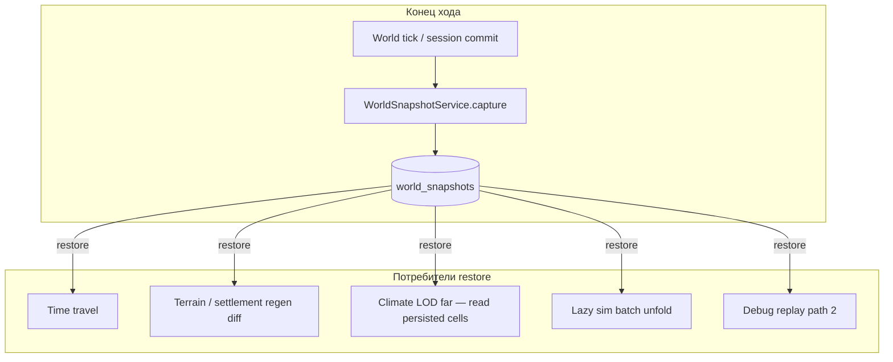

## Назначение

**World Snapshot** — **отдельный общий модуль платформы**, не часть climate, terrain или chat.

| Принцип | Смысл |
|---|---|
| **Единый сервис** | Один `WorldSnapshotService` отвечает за capture / restore / branch / delete |
| **Полный слепок на ход** | После **каждого хода** мир **целиком** сохраняется в `world_snapshots` |
| **Потребители** | Climate LOD, terrain regen, lazy sim, time travel, debug replay — **читают восстановленное состояние**, не делают свой ad-hoc snapshot |
| **Не маска** | Snapshot — **состояние мира** (данные + сессия), не boolean mask и не один derived field |

**Статус:** schema ✅ ([`project_data_storage_tz.md`](./project_data_storage_tz.md) § `world_snapshots`) · **runtime module ⬜** · capture на каждый ход ⬜

> **Не путать** с терминами в [`tz_climate.md`](./tz_climate.md) § «Терминология snapshot» — там другие сущности (`SurfaceClimateField`, `WeatherSnapshot`).

---

## Что это **не** является

| Сущность | Что это | Где |
|---|---|---|
| **`SurfaceClimateField`** | Derived **horizontal field** `(gx, gy)` — pole + tier blend для climate LOD | climate generator; может **входить** в blob snapshot как часть мира или пересчитываться при restore |
| **`WeatherSnapshot`** | Runtime **DTO** для сцены (temp + `system_weather`) | `ClimateRuntimeAssembler`; ephemeral, не заменяет world snapshot |
| **`liquid_candidate` / hydrology mask** | Boolean/metadata на `map_cells` | hydrology; часть terrain state **внутри** world snapshot |
| **`snapshot_store` (frontend)** | In-memory resume пайплайна чата | [`tz_frontend.md`](./tz_frontend.md); **не** персистентный world snapshot |

---

## Архитектура



**Инвариант:** модули **не** пишут свои parallel «snapshot файлы». Нужное состояние — в БД до capture; capture сериализует **согласованный срез**; restore гидратирует БД (или in-memory view) для следующего хода.

---

## Расположение (target)

```
app/application/worldSnapshot/
  worldSnapshotService.py      ← capture, restore, list, branch
  snapshotSerializer.py        ← schema → compressed blob
  snapshotDeserializer.py
  snapshotScope.py             ← что входит в v1 blob (registry ниже)
  checksum.py                  ← SHA256 verify

app/db/repositories/
  worldSnapshotRepository.py

app/application/engine/nodes/…   ← post_llm: capture после commit хода (позже)
```

**Граница слоя:** snapshot service **не** генерирует terrain/climate; **не** собирает LLM payload. Только serialize/deserialize + orchestration persist.

---

## Контракт API (черновик)

```python
@dataclass(frozen=True)
class WorldSnapshotMeta:
    snapshot_id: str
    world_id: str
    timeline_id: str
    turn_id: int
    parent_snapshot_id: str | None
    created_at: datetime
    checksum: str

class WorldSnapshotService:
    async def capture_turn(
        self,
        world_id: str,
        timeline_id: str,
        turn_id: int,
        *,
        parent_snapshot_id: str | None = None,
    ) -> WorldSnapshotMeta:
        """После commit хода: read DB → compress → insert world_snapshots."""

    async def restore(self, snapshot_id: str) -> None:
        """Verify checksum → deserialize → hydrate DB (transaction)."""

    async def list_timeline(self, timeline_id: str) -> list[WorldSnapshotMeta]: ...

    async def branch_from(self, snapshot_id: str) -> str:
        """Новый timeline_id от точки ответвления."""
```

**Когда вызывать `capture_turn`:** **каждый ход** после успешного commit patches (world tick, session state, NPC batch). Один вызов на ход — **не** per-module.

---

## Состав blob v1 (target)

Схема хранения — [`project_data_storage_tz.md`](./project_data_storage_tz.md):

> «Что входит в слепок: схема мира на момент хода, состояние всех NPC, состояние игрока, состояние сессии.»

| Домен | Входит в v1 | Примечание |
|---|---|---|
| `worlds` + registries (N+1 JSON) | ✅ | master rules |
| `named_locations` | ✅ | |
| `map_cells` (materialized scope) | ✅ | lazy cells = absent until generated; после capture — как в БД |
| `connection_nodes` / `connection_edges` | ✅ | |
| `location_states`, `location_weather`, `location_resources` | ✅ | far-zone LOD state |
| NPC + `character_sheet` + needs/goals | ✅ | |
| Active session + chat pointers | ✅ | messages могут оставаться отдельно — TBD |
| **`SurfaceClimateField`** (optional derived) | ⬜ v2 | либо в blob, либо rebuild из map_cells + poles при restore |
| Engine `snapshot_store` (chat pipeline) | ❌ | ephemeral; не world snapshot |

**Сжатие:** `snapshot_data` — compressed blob; `snapshot_checksum` = SHA256.

---

## Связь с другими подсистемами

### Climate LOD ([`tz_climate.md`](./tz_climate.md))

| Режим | До world snapshot | После world snapshot |
|---|---|---|
| **Near** | per-cell resolve в bbox | то же; cells уже в БД → попадают в capture |
| **Far** | sample `SurfaceClimateField` in-memory | **read из последнего restore** / persisted `location_weather` + cells в blob; без full-world recalc каждый сезон |

Climate **не** владеет world snapshot; при far LOD читает **данные мира**, сохранённые общим модулем.

### Terrain / hydrology regen ([`tz_city_generation.md`](./tz_city_generation.md) §11.4)

**Отложено до snapshot:** change detection (`partial` init), regen matrix, TR-2 double pole-resolve across HTTP.

После snapshot: сравнение `snapshot_id` N vs N−1 → решение regen vs patch.

### Lazy simulation ([`tz_lazy_simulation.md`](./tz_lazy_simulation.md))

Переход far → near: batch unfold + optional climate promote — **от elapsed turns между snapshots** или между tick counter внутри хода (TBD).

### Debug path 2 ([`tz_world_generation_dag.md`](./tz_world_generation_dag.md))

Target: materialization run **один раз** → persist → capture; следующий HTTP **restore или read DB**, не повторный full pole resolve (TR-2).

---

## Time travel

Уже в storage TZ:

- **Назад:** `restore(snapshot_id)` → continue → новая ветка `timeline_id`
- **Вперёд:** jump на любой snapshot существующего timeline
- **Branch points:** `ON DELETE RESTRICT` на `parent_snapshot_id`

Детали дерева и checksum errors — [`project_data_storage_tz.md`](./project_data_storage_tz.md) § «Снапшоты и таймлайны».

---

## Порядок работ

| Фаза | Scope |
|---|---|
| **WS-0** | Repository + schema migration если нужно |
| **WS-1** | `capture_turn` / `restore` minimal blob (world + session smoke) |
| **WS-1b** | Hook post-turn в engine (node или `ChatService` commit) |
| **WS-2** | Full domain list (map_cells, NPC, connections, location_*) |
| **WS-3** | Regen diff + TR-2 unblocked |
| **WS-4** | Time travel UI + branch API |

**Не блокирует:** D HY hydrology, eager climate v2 — они пишут в БД как сейчас; snapshot **накладывается** поверх persist cycle.

---

## Открытые вопросы

| Вопрос | Статус |
|---|---|
| Messages / chat history — inside blob или FK only | открыт |
| Sparse vs full `map_cells` в blob для lazy worlds | открыт |
| `SurfaceClimateField` — persist in blob vs recompute on restore | открыт (CL-17) |
| Incremental capture (delta) vs full каждый ход | v1: **full**; delta — v2+ |
| Sync events между timelines | отложено (storage TZ) |

---

## Changelog

| Дата | Изменение |
|---|---|
| 2026-06 | Initial TZ — единый `WorldSnapshotService`; disambiguation от climate field cache |

---

## Связанные документы

- [`project_data_storage_tz.md`](./project_data_storage_tz.md) — schema `world_snapshots`, timelines
- [`tz_climate.md`](./tz_climate.md) — `SurfaceClimateField`, Climate LOD (≠ world snapshot)
- [`tz_city_generation.md`](./tz_city_generation.md) §11.4 — regen gated on snapshot
- [`tz_lazy_simulation.md`](./tz_lazy_simulation.md) — LOD unfold
- [`tz_generator_technical_debt.md`](./tz_generator_technical_debt.md) — TR-2 deferred → snapshot
- [`tz_world_generation_dag.md`](./tz_world_generation_dag.md) — post-turn capture node (future)
